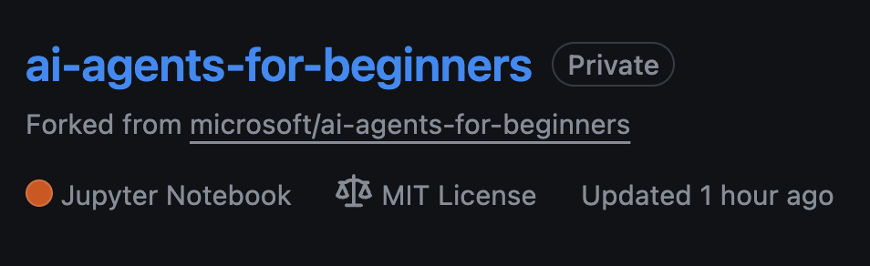
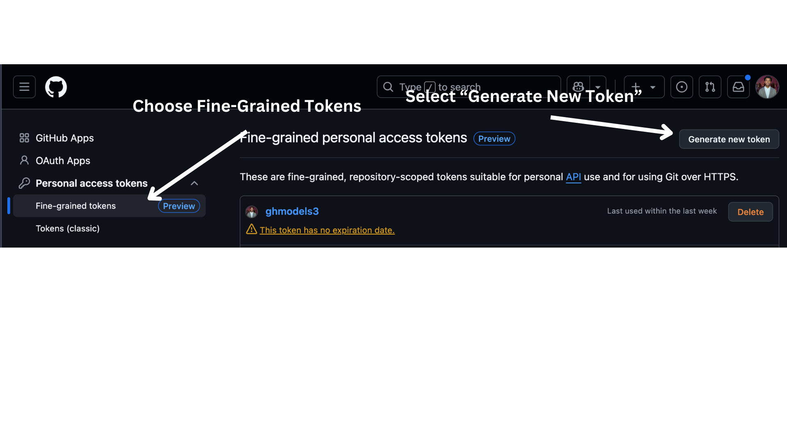

# Course Setup

## Introduction

This lesson will cover how to run the code samples of this course.

## Requirements

- A GitHub Account
- Python 3.12+

## Clone or Fork this Repo

To begin, please clone or fork the GitHub Repository. This will make your own version of the course material so that you can run, test and tweak the code!

This can be done by clicking link to <a href="https://github.com/microsoft/ai-agents-for-beginners/fork" target="_blank">fork the repo</a>

You should now have your own forked version of this course in the following link:



## Retrieve Your GitHub Personal Access Token (PAT)

Currently this course uses the Github Models Marketplace to offer free access to Large Language Models(LLMs) that will be used to create AI Agents.

To access this service, you will need to create a GitHub Personal Access Token.

This can be done by going to your <a href="https://github.com/settings/personal-access-tokens" target="_blank">Personal Access Tokens settings</a> in your GitHub Account.

Select the `Fine-grained tokens` options on the left side of your screen.

Then select `Generate new token`.



Copy your new token that you have just created. You will now add this to your `.env` file included in this course. 

## Add this to your Environment Variables

To create your `.env` file run the following command in your terminal:

```bash
cp .env.example .env
```

This will copy the example file and create a `.env` in your directory.

Open that file and paste the token you created into the `GITHUB_TOKEN=` field of the .env file.

## Install Required Packages

To ensure you have all the required Python packages to run the code, run the following command into your terminal.

We recommend creating a Python virtual environment to avoid any conflicts and issues.

```bash
pip install -r requirements.txt
```

This should install the required Python packages.

You are now ready to run the code of this code, happy learning more about the world of AI Agents!

If you have any issues running this setup, hop into our <a href="https://discord.gg/kzRShWzttr" target="_blank">Azure AI Community Discord</a> or <a href="https://github.com/microsoft/ai-agents-for-beginners/issues?WT.mc_id=academic-105485-koreyst" target="_blank">create an issue</a>.
