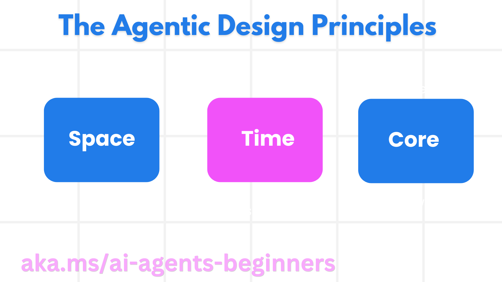

> _(Click the image above to view video of this lesson)_
# AI Agentic Design Principles

## Introduction

There are many ways to think about building AI Agentic Systems. Given that ambiguity is a feature and not a bug in Generative AI design, it’s sometimes difficult for engineers to figure out where to even start. We have created a set of human-centric UX Design Principles to enable developers to build customer-centric agentic systems to solve their business needs. These design principles are not a prescriptive architecture but rather a starting point for teams who are defining and building out agent experiences.

In general, agents should:

- Broaden and scale human capacities (brainstorming, problem-solving, automation, etc.)
- Fill in knowledge gaps (get me up-to-speed on knowledge domains, translation, etc.)
- Facilitate and support collaboration in the ways we as individuals prefer to work with others
- Make us better versions of ourselves (e.g., life coach/task master, helping us learn emotional regulation and mindfulness skills, building resilience, etc.)

## This Lesson Will Cover

- What are the Agentic Design Principles
- What are some guidelines to follow while implementing these design principles
- What are some examples of using the design principles

## Learning Goals

After completing this lesson, you will be able to:

1. Explain what the Agentic Design Principles are
2. Explain the guidelines for using the Agentic Design Principles
3. Understand how to build an agent using the Agentic Design Principles

## The Agentic Design Principles

### Agent (Space)

This is the environment in which the agent operates. These principles inform how we design agents for engaging in physical and digital worlds.

- **Connecting, not collapsing** – help connect people to other people, events, and actionable knowledge to enable collaboration and connection.
- Agents help connect events, knowledge, and people.
- Agents bring people closer together. They are not designed to replace or belittle people.
- **Easily accessible yet occasionally invisible** – agent largely operates in the background and only nudges us when it is relevant and appropriate.
  - Agent is easily discoverable and accessible for authorized users on any device or platform.
  - Agent supports multimodal inputs and outputs (sound, voice, text, etc.).
  - Agent can seamlessly transition between foreground and background; between proactive and reactive, depending on its sensing of user needs.
  - Agent may operate in invisible form, yet its background process path and collaboration with other Agents are transparent to and controllable by the user.

### Agent (Time)

This is how the agent operates over time. These principles inform how we design agents interacting across the past, present, and future.

- **Past**: Reflecting on history that includes both state and context.
  - Agent provides more relevant results based on analysis of richer historical data beyond only the event, people, or states.
  - Agent creates connections from past events and actively reflects on memory to engage with current situations.
- **Now**: Nudging more than notifying.
  - Agent embodies a comprehensive approach to interacting with people. When an event happens, the Agent goes beyond static notification or other static formality. Agent can simplify flows or dynamically generate cues to direct the user’s attention at the right moment.
  - Agent delivers information based on contextual environment, social and cultural changes and tailored to user intent.
  - Agent interaction can be gradual, evolving/growing in complexity to empower users over the long term.
- **Future**: Adapting and evolving.
  - Agent adapts to various devices, platforms, and modalities.
  - Agent adapts to user behavior, accessibility needs, and is freely customizable.
  - Agent is shaped by and evolves through continuous user interaction.

### Agent (Core)

These are the key elements in the core of an agent’s design.

- **Embrace uncertainty but establish trust**.
  - A certain level of Agent uncertainty is expected. Uncertainty is a key element of agent design.
  - Trust and transparency are foundational layers of Agent design.
  - Humans are in control of when the Agent is on/off and Agent status is clearly visible at all times.

## The Guidelines to Implement These Principles

When you’re using the previous design principles, use the following guidelines:

1. **Transparency**: Inform the user that AI is involved, how it functions (including past actions), and how to give feedback and modify the system.
2. **Control**: Enable the user to customize, specify preferences and personalize, and have control over the system and its attributes (including the ability to forget).
3. **Consistency**: Aim for consistent, multi-modal experiences across devices and endpoints. Use familiar UI/UX elements where possible (e.g., microphone icon for voice interaction) and reduce the customer’s cognitive load as much as possible (e.g., aim for concise responses, visual aids, and ‘Learn More’ content).

## How To Design a Travel Agent using These Principles and Guidelines

Imagine you are designing a Travel Agent, here is how you could think about using the Design Principles and Guidelines:

1. **Transparency** – Let the user know that the Travel Agent is an AI-enabled Agent. Provide some basic instructions on how to get started (e.g., a “Hello” message, sample prompts). Clearly document this on the product page. Show the list of prompts a user has asked in the past. Make it clear how to give feedback (thumbs up and down, Send Feedback button, etc.). Clearly articulate if the Agent has usage or topic restrictions.
2. **Control** – Make sure it’s clear how the user can modify the Agent after it’s been created with things like the System Prompt. Enable the user to choose how verbose the Agent is, its writing style, and any caveats on what the Agent should not talk about. Allow the user to view and delete any associated files or data, prompts, and past conversations.
3. **Consistency** – Make sure the icons for Share Prompt, add a file or photo and tag someone or something are standard and recognizable. Use the paperclip icon to indicate file upload/sharing with the Agent, and an image icon to indicate graphics upload.

## Additional Resources

- <a href="https://openai.com" target="_blank">Practices for Governing Agentic AI Systems | OpenAI</a>
- <a href="https://microsoft.com" target="_blank">The HAX Toolkit Project - Microsoft Research</a>
- <a href="https://responsibleaitoolbox.ai" target="_blank">Responsible AI Toolbox</a>

## Previous Lesson

[Exploring Agentic Frameworks](../02-explore-agentic-frameworks/README.md)

## Next Lesson

[Tool Use Design Pattern](../04-tool-use/README.md)
