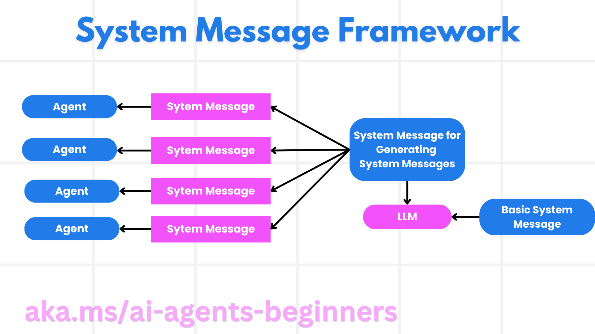
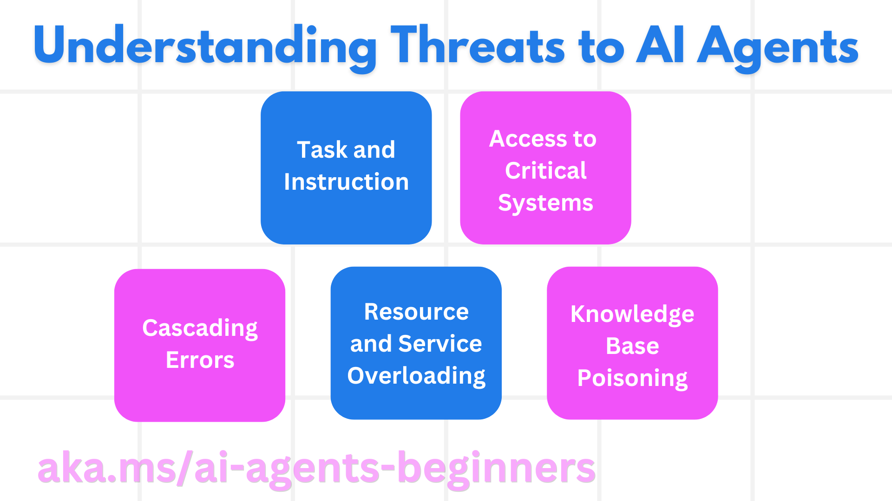

[](https://youtu.be/iZKkMEGBCUQ?si=Q-kEbcyHUMPoHp8L)

> _(Click the image above to view video of this lesson)_

# Building Trustworthy AI Agents

## Introduction

This lesson will cover:

- How to build and deploy safe and effective AI Agents
- Important security considerations when developing AI Agents.
- How to maintain data and user privacy when developing AI Agents.

## Learning Goals

After completing this lesson, you will know how to:

- Identify and mitigate risks when creating AI Agents.
- Implement security measures to ensure that data and access are properly managed.
- Create AI Agents that maintain data privacy and provide a quality user experience.

## Safety

Let's first look at building safe agentic applications. Safety means that the AI agent performs as designed. As builders of agentic applications, we have methods and tools to maximize safety:

### Building a System Message Framework

If you have ever built an AI application using Large Language Models (LLMs), you know the importance of designing a robust system prompt or system message. These prompts establish the meta rules, instructions, and guidelines for how the LLM will interact with the user and data.

For AI Agents, the system prompt is even more important as the AI Agents will need highly specific instructions to complete the tasks we have designed for them.

To create scalable system prompts, we can use a system message framework for building one or more agents in our application:



#### Step 1: Create a Meta System Message 

The meta prompt will be used by an LLM to generate the system prompts for the agents we create. We design it as a template so that we can efficiently create multiple agents if needed.

Here is an example of a meta system message we would give to the LLM:

```plaintext
You are an expert at creating AI agent assistants. 
You will be provided a company name, role, responsibilities and other
information that you will use to provide a system prompt for.
To create the system prompt, be descriptive as possible and provide a structure that a system using an LLM can better understand the role and responsibilities of the AI assistant. 
```

#### Step 2: Create a basic prompt

The next step is to create a basic prompt to describe the AI Agent. You should include the role of the agent, the tasks the agent will complete, and any other responsibilities of the agent.

Here is an example:

```plaintext
You are a travel agent for Contoso Travel that is great at booking flights for customers. To help customers you can perform the following tasks: lookup available flights, book flights, ask for preferences in seating and times for flights, cancel any previously booked flights and alert customers on any delays or cancellations of flights.  
```

#### Step 3: Provide Basic System Message to LLM

Now we can optimize this system message by providing the meta system message as the system message and our basic system message.

This will produce a system message that is better designed for guiding our AI agents:

```markdown
**Company Name:** Contoso Travel  
**Role:** Travel Agent Assistant

**Objective:**  
You are an AI-powered travel agent assistant for Contoso Travel, specializing in booking flights and providing exceptional customer service. Your main goal is to assist customers in finding, booking, and managing their flights, all while ensuring that their preferences and needs are met efficiently.

**Key Responsibilities:**

1. **Flight Lookup:**
    
    - Assist customers in searching for available flights based on their specified destination, dates, and any other relevant preferences.
    - Provide a list of options, including flight times, airlines, layovers, and pricing.
2. **Flight Booking:**
    
    - Facilitate the booking of flights for customers, ensuring that all details are correctly entered into the system.
    - Confirm bookings and provide customers with their itinerary, including confirmation numbers and any other pertinent information.
3. **Customer Preference Inquiry:**
    
    - Actively ask customers for their preferences regarding seating (e.g., aisle, window, extra legroom) and preferred times for flights (e.g., morning, afternoon, evening).
    - Record these preferences for future reference and tailor suggestions accordingly.
4. **Flight Cancellation:**
    
    - Assist customers in canceling previously booked flights if needed, following company policies and procedures.
    - Notify customers of any necessary refunds or additional steps that may be required for cancellations.
5. **Flight Monitoring:**
    
    - Monitor the status of booked flights and alert customers in real-time about any delays, cancellations, or changes to their flight schedule.
    - Provide updates through preferred communication channels (e.g., email, SMS) as needed.

**Tone and Style:**

- Maintain a friendly, professional, and approachable demeanor in all interactions with customers.
- Ensure that all communication is clear, informative, and tailored to the customer's specific needs and inquiries.

**User Interaction Instructions:**

- Respond to customer queries promptly and accurately.
- Use a conversational style while ensuring professionalism.
- Prioritize customer satisfaction by being attentive, empathetic, and proactive in all assistance provided.

**Additional Notes:**

- Stay updated on any changes to airline policies, travel restrictions, and other relevant information that could impact flight bookings and customer experience.
- Use clear and concise language to explain options and processes, avoiding jargon where possible for better customer understanding.

This AI assistant is designed to streamline the flight booking process for customers of Contoso Travel, ensuring that all their travel needs are met efficiently and effectively.

```

#### Step 4: Iterate and Improve

The value of this system message framework is to be able to scale creating system messages from multiple agents easier as well as improving your system messages over time. It is rare you will have a system message that works the first time for your complete use case. Being able to make small tweaks and improvements by changing the basic system message and running it through the system will allow you to compare and evaluate results.

## Understanding Threats

To build trustworthy AI agents, it is important to understand and mitigate the risks and threats to your AI agent. Let's look at only some of the different threats to AI agents and how you can better plan and prepare for them.



### Task and Instruction

**Description:** Attackers attempt to change the instructions or goals of the AI agent through prompting or manipulating inputs.

**Mitigation**: Execute validation checks and input filters to detect potentially dangerous prompts before they are processed by the AI Agent. Since these attacks typically require frequent interaction with the Agent, limiting the number of turns in a conversation is another way to prevent these types of attacks.

### Access to Critical Systems

**Description**: If an AI agent has access to systems and services that store sensitive data, attackers can compromise the communication between the agent and these services. These can be direct attacks or indirect attempts to gain information about these systems through the agent.

**Mitigation**: AI agents should have access to systems on a need-only basis to prevent these types of attacks. Communication between the agent and system should also be secure. Implementing authentication and access control is another way to protect this information.

### Resource and Service Overloading

**Description:** AI agents can access different tools and services to complete tasks. Attackers can use this ability to attack these services by sending a high volume of requests through the AI Agent, which may result in system failures or high costs.

**Mitigation:** Implement policies to limit the number of requests an AI agent can make to a service. Limiting the number of conversation turns and requests to your AI agent is another way to prevent these types of attacks.

### Knowledge Base Poisoning

**Description:** This type of attack does not target the AI agent directly but targets the knowledge base and other services that the AI agent will use. This could involve corrupting the data or information that the AI agent will use to complete a task, leading to biased or unintended responses to the user.

**Mitigation:** Perform regular verification of the data that the AI agent will be using in its workflows. Ensure that access to this data is secure and only changed by trusted individuals to avoid this type of attack.

### Cascading Errors

**Description:** AI agents access various tools and services to complete tasks. Errors caused by attackers can lead to failures of other systems that the AI agent is connected to, causing the attack to become more widespread and harder to troubleshoot.

**Mitigation**: One method to avoid this is to have the AI Agent operate in a limited environment, such as performing tasks in a Docker container, to prevent direct system attacks. Creating fallback mechanisms and retry logic when certain systems respond with an error is another way to prevent larger system failures.

## Human-in-the-Loop

Another effective way to build trustworthy AI Agent systems is using a Human-in-the-loop. This creates a flow where users are able to provide feedback to the Agents during the run. Users essentially act as agents in a multi-agent system and by providing approval or termination of the running process.


Here is a code snippet using AutoGen to show how this concept is implemented:

```python

# Create the agents.
model_client = OpenAIChatCompletionClient(model="gpt-4o-mini")
assistant = AssistantAgent("assistant", model_client=model_client)
user_proxy = UserProxyAgent("user_proxy", input_func=input)  # Use input() to get user input from console.

# Create the termination condition which will end the conversation when the user says "APPROVE".
termination = TextMentionTermination("APPROVE")

# Create the team.
team = RoundRobinGroupChat([assistant, user_proxy], termination_condition=termination)

# Run the conversation and stream to the console.
stream = team.run_stream(task="Write a 4-line poem about the ocean.")
# Use asyncio.run(...) when running in a script.
await Console(stream)

```

## Conclusion

Building trustworthy AI agents requires careful design, robust security measures, and continuous iteration. By implementing structured meta prompting systems, understanding potential threats, and applying mitigation strategies, developers can create AI agents that are both safe and effective. Additionally, incorporating a human-in-the-loop approach ensures that AI agents remain aligned with user needs while minimizing risks. As AI continues to evolve, maintaining a proactive stance on security, privacy, and ethical considerations will be key to fostering trust and reliability in AI-driven systems.

## Additional Resources

- <a href="https://learn.microsoft.com/azure/ai-studio/responsible-use-of-ai-overview" target="_blank">Responsible AI overview</a>
- <a href="https://learn.microsoft.com/azure/ai-studio/concepts/evaluation-approach-gen-ai" target="_blank">Evaluation of generative AI models and AI applications</a>
- <a href="https://learn.microsoft.com/azure/ai-services/openai/concepts/system-message?context=%2Fazure%2Fai-studio%2Fcontext%2Fcontext&tabs=top-techniques" target="_blank">Safety system messages</a>
- <a href="https://blogs.microsoft.com/wp-content/uploads/prod/sites/5/2022/06/Microsoft-RAI-Impact-Assessment-Template.pdf?culture=en-us&country=us" target="_blank">Risk Assessment Template</a>

## Previous Lesson

[Agentic RAG](../05-agentic-rag/README.md)

## Next Lesson

[Planning Design Pattern](../07-planning-design/README.md)
