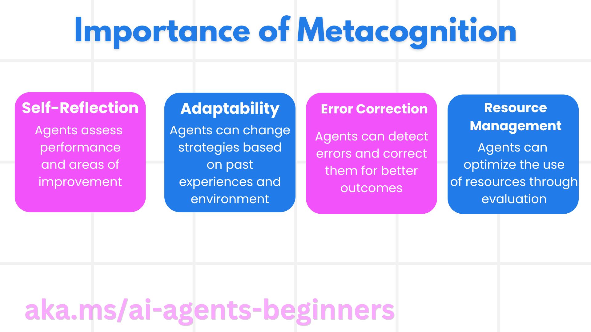
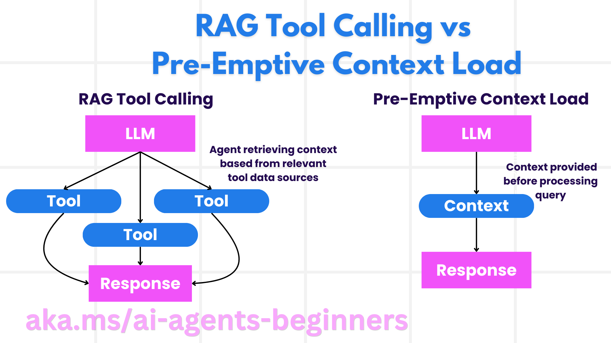

[](https://youtu.be/His9R6gw6Ec?si=3_RMb8VprNvdLRhX)

> _(Click the image above to view video of this lesson)_
# Metacognition in AI Agents

## Introduction

Welcome to the lesson on metacognition in AI agents! This chapter is designed for beginners who are curious about how AI agents can think about their own thinking processes. By the end of this lesson, you'll understand key concepts and be equipped with practical examples to apply metacognition in AI agent design.

## Learning Goals

After completing this lesson, you'll be able to:

1. Understand the implications of reasoning loops in agent definitions.
2. Use planning and evaluation techniques to help self-correcting agents.
3. Create your own agents capable of manipulating code to accomplish tasks.

## Introduction to Metacognition

Metacognition refers to the higher-order cognitive processes that involve thinking about one’s own thinking. For AI agents, this means being able to evaluate and adjust their actions based on self-awareness and past experiences. Metacognition, or "thinking about thinking," is an important concept in the development of agentic AI systems. It involves AI systems being aware of their own internal processes and being able to monitor, regulate, and adapt their behavior accordingly. Much like we do when we read the room or look at a problem. This self-awareness can help AI systems make better decisions, identify errors, and improve their performance over time- again linking back to the Turing test and the debate over whether AI is going to take over.

In the context of agentic AI systems, metacognition can help address several challenges, such as:
- Transparency: Ensuring that AI systems can explain their reasoning and decisions.
- Reasoning: Enhancing the ability of AI systems to synthesize information and make sound decisions.
- Adaptation: Allowing AI systems to adjust to new environments and changing conditions.
- Perception: Improving the accuracy of AI systems in recognizing and interpreting data from their environment.

### What is Metacognition?

Metacognition, or "thinking about thinking," is a higher-order cognitive process that involves self-awareness and self-regulation of one's cognitive processes. In the realm of AI, metacognition empowers agents to evaluate and adapt their strategies and actions, leading to improved problem-solving and decision-making capabilities. By understanding metacognition, you can design AI agents that are not only more intelligent but also more adaptable and efficient. In true metacognition, you’d see the AI explicitly reasoning about its own reasoning.

Example: “I prioritized cheaper flights because… I might be missing out on direct flights, so let me re-check.”.
Keeping track of how or why it chose a certain route.
- Noting that it made mistakes because it over-relied on user preferences from last time, so it modifies its decision-making strategy not just the final recommendation.
- Diagnosing patterns like, “Whenever I see the user mention ‘too crowded,’ I should not only remove certain attractions but also reflect that my method of picking ‘top attractions’ is flawed if I always rank by popularity.”

### Importance of Metacognition in AI Agents

Metacognition plays a crucial role in AI agent design for several reasons:



- Self-Reflection: Agents can assess their own performance and identify areas for improvement.
- Adaptability: Agents can modify their strategies based on past experiences and changing environments.
- Error Correction: Agents can detect and correct errors autonomously, leading to more accurate outcomes.
- Resource Management: Agents can optimize the use of resources, such as time and computational power, by planning and evaluating their actions.

## Components of an AI Agent

Before diving into metacognitive processes, it's essential to understand the basic components of an AI agent. An AI agent typically consists of:

- Persona: The personality and characteristics of the agent, which define how it interacts with users.
- Tools: The capabilities and functions that the agent can perform.
- Skills: The knowledge and expertise that the agent possesses.

These components work together to create an "expertise unit" that can perform specific tasks.

**Example**:
Consider a travel agent, agent services that not only plans your holiday but also adjusts its path based on real-time data and past customer journey experiences.

### Example: Metacognition in a Travel Agent Service

Imagine you're designing a travel agent service powered by AI. This agent, "Travel Agent," assists users with planning their vacations. To incorporate metacognition, Travel Agents needs to evaluate and adjust its actions based on self-awareness and past experiences. Here's how metacognition could play a role:

#### Current Task

The current task is to help a user plan a trip to Paris.

#### Steps to Complete the Task

1. **Gather User Preferences**: Ask the user about their travel dates, budget, interests (e.g., museums, cuisine, shopping), and any specific requirements.
2. **Retrieve Information**: Search for flight options, accommodations, attractions, and restaurants that match the user's preferences.
3. **Generate Recommendations**: Provide a personalized itinerary with flight details, hotel reservations, and suggested activities.
4. **Adjust Based on Feedback**: Ask the user for feedback on the recommendations and make necessary adjustments.

#### Required Resources

- Access to flight and hotel booking databases.
- Information on Parisian attractions and restaurants.
- User feedback data from previous interactions.

#### Experience and Self-Reflection

Travel Agent uses metacognition to evaluate its performance and learn from past experiences. For example:

1. **Analyzing User Feedback**: Travel Agent reviews user feedback to determine which recommendations were well-received and which were not. It adjusts its future suggestions accordingly.
2. **Adaptability**: If a user has previously mentioned a dislike for crowded places, Travel Agent will avoid recommending popular tourist spots during peak hours in the future.
3. **Error Correction**: If Travel Agent made an error in a past booking, such as suggesting a hotel that was fully booked, it learns to check availability more rigorously before making recommendations.

#### Practical Developer Example

Here's a simplified example of how Travel Agents code might look when incorporating metacognition:

```python
class Travel_Agent:
    def __init__(self):
        self.user_preferences = {}
        self.experience_data = []

    def gather_preferences(self, preferences):
        self.user_preferences = preferences

    def retrieve_information(self):
        # Search for flights, hotels, and attractions based on preferences
        flights = search_flights(self.user_preferences)
        hotels = search_hotels(self.user_preferences)
        attractions = search_attractions(self.user_preferences)
        return flights, hotels, attractions

    def generate_recommendations(self):
        flights, hotels, attractions = self.retrieve_information()
        itinerary = create_itinerary(flights, hotels, attractions)
        return itinerary

    def adjust_based_on_feedback(self, feedback):
        self.experience_data.append(feedback)
        # Analyze feedback and adjust future recommendations
        self.user_preferences = adjust_preferences(self.user_preferences, feedback)

# Example usage
travel_agent = Travel_Agent()
preferences = {
    "destination": "Paris",
    "dates": "2025-04-01 to 2025-04-10",
    "budget": "moderate",
    "interests": ["museums", "cuisine"]
}
travel_agent.gather_preferences(preferences)
itinerary = travel_agent.generate_recommendations()
print("Suggested Itinerary:", itinerary)
feedback = {"liked": ["Louvre Museum"], "disliked": ["Eiffel Tower (too crowded)"]}
travel_agent.adjust_based_on_feedback(feedback)
```

#### Why Metacognition Matters

- **Self-Reflection**: Agents can analyze their performance and identify areas for improvement.
- **Adaptability**: Agents can modify strategies based on feedback and changing conditions.
- **Error Correction**: Agents can autonomously detect and correct mistakes.
- **Resource Management**: Agents can optimize resource usage, such as time and computational power.

By incorporating metacognition, Travel Agent can provide more personalized and accurate travel recommendations, enhancing the overall user experience.

---

## 2. Planning in Agents

Planning is a critical component of AI agent behavior. It involves outlining the steps needed to achieve a goal, considering the current state, resources, and possible obstacles.

### Elements of Planning

- **Current Task**: Define the task clearly.
- **Steps to Complete the Task**: Break down the task into manageable steps.
- **Required Resources**: Identify necessary resources.
- **Experience**: Utilize past experiences to inform planning.

**Example**:
Here are the steps Travel Agent needs to take to assist a user in planning their trip effectively:

### Steps for Travel Agent

1. **Gather User Preferences**
   - Ask the user for details about their travel dates, budget, interests, and any specific requirements.
   - Examples: "When are you planning to travel?" "What is your budget range?" "What activities do you enjoy on vacation?"

2. **Retrieve Information**
   - Search for relevant travel options based on user preferences.
   - **Flights**: Look for available flights within the user's budget and preferred travel dates.
   - **Accommodations**: Find hotels or rental properties that match the user's preferences for location, price, and amenities.
   - **Attractions and Restaurants**: Identify popular attractions, activities, and dining options that align with the user's interests.

3. **Generate Recommendations**
   - Compile the retrieved information into a personalized itinerary.
   - Provide details such as flight options, hotel reservations, and suggested activities, making sure to tailor the recommendations to the user's preferences.

4. **Present Itinerary to User**
   - Share the proposed itinerary with the user for their review.
   - Example: "Here's a suggested itinerary for your trip to Paris. It includes flight details, hotel bookings, and a list of recommended activities and restaurants. Let me know your thoughts!"

5. **Collect Feedback**
   - Ask the user for feedback on the proposed itinerary.
   - Examples: "Do you like the flight options?" "Is the hotel suitable for your needs?" "Are there any activities you would like to add or remove?"

6. **Adjust Based on Feedback**
   - Modify the itinerary based on the user's feedback.
   - Make necessary changes to flight, accommodation, and activity recommendations to better match the user's preferences.

7. **Final Confirmation**
   - Present the updated itinerary to the user for final confirmation.
   - Example: "I've made the adjustments based on your feedback. Here's the updated itinerary. Does everything look good to you?"

8. **Book and Confirm Reservations**
   - Once the user approves the itinerary, proceed with booking flights, accommodations, and any pre-planned activities.
   - Send confirmation details to the user.

9. **Provide Ongoing Support**
   - Remain available to assist the user with any changes or additional requests before and during their trip.
   - Example: "If you need any further assistance during your trip, feel free to reach out to me anytime!"

### Example Interaction

```python
class Travel_Agent:
    def __init__(self):
        self.user_preferences = {}
        self.experience_data = []

    def gather_preferences(self, preferences):
        self.user_preferences = preferences

    def retrieve_information(self):
        flights = search_flights(self.user_preferences)
        hotels = search_hotels(self.user_preferences)
        attractions = search_attractions(self.user_preferences)
        return flights, hotels, attractions

    def generate_recommendations(self):
        flights, hotels, attractions = self.retrieve_information()
        itinerary = create_itinerary(flights, hotels, attractions)
        return itinerary

    def adjust_based_on_feedback(self, feedback):
        self.experience_data.append(feedback)
        self.user_preferences = adjust_preferences(self.user_preferences, feedback)

# Example usage within a booing request
travel_agent = Travel_Agent()
preferences = {
    "destination": "Paris",
    "dates": "2025-04-01 to 2025-04-10",
    "budget": "moderate",
    "interests": ["museums", "cuisine"]
}
travel_agent.gather_preferences(preferences)
itinerary = travel_agent.generate_recommendations()
print("Suggested Itinerary:", itinerary)
feedback = {"liked": ["Louvre Museum"], "disliked": ["Eiffel Tower (too crowded)"]}
travel_agent.adjust_based_on_feedback(feedback)
```

## 3. Corrective RAG System

Firstly let's start by understanding the difference between RAG Tool and Pre-emptive Context Load



### Retrieval-Augmented Generation (RAG)

RAG combines a retrieval system with a generative model. When a query is made, the retrieval system fetches relevant documents or data from an external source, and this retrieved information is used to augment the input to the generative model. This helps the model generate more accurate and contextually relevant responses.

In a RAG system, the agent retrieves relevant information from a knowledge base and uses it to generate appropriate responses or actions.

### Corrective RAG Approach

The Corrective RAG approach focuses on using RAG techniques to correct errors and improve the accuracy of AI agents. This involves:

1. **Prompting Technique**: Using specific prompts to guide the agent in retrieving relevant information.
2. **Tool**: Implementing algorithms and mechanisms that enable the agent to evaluate the relevance of the retrieved information and generate accurate responses.
3. **Evaluation**: Continuously assessing the agent's performance and making adjustments to improve its accuracy and efficiency.

#### Example: Corrective RAG in a Search Agent

Consider a search agent that retrieves information from the web to answer user queries. The Corrective RAG approach might involve:

1. **Prompting Technique**: Formulating search queries based on the user's input.
2. **Tool**: Using natural language processing and machine learning algorithms to rank and filter search results.
3. **Evaluation**: Analyzing user feedback to identify and correct inaccuracies in the retrieved information.

### Corrective RAG in Travel Agent

Corrective RAG (Retrieval-Augmented Generation) enhances an AI's ability to retrieve and generate information while correcting any inaccuracies. Let's see how Travel Agent can use the Corrective RAG approach to provide more accurate and relevant travel recommendations.

This involves:

- **Prompting Technique:** Using specific prompts to guide the agent in retrieving relevant information.
- **Tool:** Implementing algorithms and mechanisms that enable the agent to evaluate the relevance of the retrieved information and generate accurate responses.
- **Evaluation:** Continuously assessing the agent's performance and making adjustments to improve its accuracy and efficiency.

#### Steps for Implementing Corrective RAG in Travel Agent

1. **Initial User Interaction**
   - Travel Agent gathers initial preferences from the user, such as destination, travel dates, budget, and interests.
   - Example:

     ```python
     preferences = {
         "destination": "Paris",
         "dates": "2025-04-01 to 2025-04-10",
         "budget": "moderate",
         "interests": ["museums", "cuisine"]
     }
     ```

2. **Retrieval of Information**
   - Travel Agent retrieves information about flights, accommodations, attractions, and restaurants based on user preferences.
   - Example:

     ```python
     flights = search_flights(preferences)
     hotels = search_hotels(preferences)
     attractions = search_attractions(preferences)
     ```

3. **Generating Initial Recommendations**
   - Travel Agent uses the retrieved information to generate a personalized itinerary.
   - Example:

     ```python
     itinerary = create_itinerary(flights, hotels, attractions)
     print("Suggested Itinerary:", itinerary)
     ```

4. **Collecting User Feedback**
   - Travel Agent asks the user for feedback on the initial recommendations.
   - Example:

     ```python
     feedback = {
         "liked": ["Louvre Museum"],
         "disliked": ["Eiffel Tower (too crowded)"]
     }
     ```

5. **Corrective RAG Process**
   - **Prompting Technique**: Travel Agent formulates new search queries based on user feedback.
     - Example:

       ```python
       if "disliked" in feedback:
           preferences["avoid"] = feedback["disliked"]
       ```

   - **Tool**: Travel Agent uses algorithms to rank and filter new search results, emphasizing the relevance based on user feedback.
     - Example:

       ```python
       new_attractions = search_attractions(preferences)
       new_itinerary = create_itinerary(flights, hotels, new_attractions)
       print("Updated Itinerary:", new_itinerary)
       ```

   - **Evaluation**: Travel Agent continuously assesses the relevance and accuracy of its recommendations by analyzing user feedback and making necessary adjustments.
     - Example:

       ```python
       def adjust_preferences(preferences, feedback):
           if "liked" in feedback:
               preferences["favorites"] = feedback["liked"]
           if "disliked" in feedback:
               preferences["avoid"] = feedback["disliked"]
           return preferences

       preferences = adjust_preferences(preferences, feedback)
       ```

#### Practical Example

Here's a simplified Python code example incorporating the Corrective RAG approach in Travel Agent:

```python
class Travel_Agent:
    def __init__(self):
        self.user_preferences = {}
        self.experience_data = []

    def gather_preferences(self, preferences):
        self.user_preferences = preferences

    def retrieve_information(self):
        flights = search_flights(self.user_preferences)
        hotels = search_hotels(self.user_preferences)
        attractions = search_attractions(self.user_preferences)
        return flights, hotels, attractions

    def generate_recommendations(self):
        flights, hotels, attractions = self.retrieve_information()
        itinerary = create_itinerary(flights, hotels, attractions)
        return itinerary

    def adjust_based_on_feedback(self, feedback):
        self.experience_data.append(feedback)
        self.user_preferences = adjust_preferences(self.user_preferences, feedback)
        new_itinerary = self.generate_recommendations()
        return new_itinerary

# Example usage
travel_agent = Travel_Agent()
preferences = {
    "destination": "Paris",
    "dates": "2025-04-01 to 2025-04-10",
    "budget": "moderate",
    "interests": ["museums", "cuisine"]
}
travel_agent.gather_preferences(preferences)
itinerary = travel_agent.generate_recommendations()
print("Suggested Itinerary:", itinerary)
feedback = {"liked": ["Louvre Museum"], "disliked": ["Eiffel Tower (too crowded)"]}
new_itinerary = travel_agent.adjust_based_on_feedback(feedback)
print("Updated Itinerary:", new_itinerary)
```

### Pre-emptive Context Load

Pre-emptive Context Load involves loading relevant context or background information into the model before processing a query. This means the model has access to this information from the start, which can help it generate more informed responses without needing to retrieve additional data during the process.

Here's a simplified example of how a pre-emptive context load might look for a travel agent application in Python:

```python
class TravelAgent:
    def __init__(self):
        # Pre-load popular destinations and their information
        self.context = {
            "Paris": {"country": "France", "currency": "Euro", "language": "French", "attractions": ["Eiffel Tower", "Louvre Museum"]},
            "Tokyo": {"country": "Japan", "currency": "Yen", "language": "Japanese", "attractions": ["Tokyo Tower", "Shibuya Crossing"]},
            "New York": {"country": "USA", "currency": "Dollar", "language": "English", "attractions": ["Statue of Liberty", "Times Square"]},
            "Sydney": {"country": "Australia", "currency": "Dollar", "language": "English", "attractions": ["Sydney Opera House", "Bondi Beach"]}
        }

    def get_destination_info(self, destination):
        # Fetch destination information from pre-loaded context
        info = self.context.get(destination)
        if info:
            return f"{destination}:\nCountry: {info['country']}\nCurrency: {info['currency']}\nLanguage: {info['language']}\nAttractions: {', '.join(info['attractions'])}"
        else:
            return f"Sorry, we don't have information on {destination}."

# Example usage
travel_agent = TravelAgent()
print(travel_agent.get_destination_info("Paris"))
print(travel_agent.get_destination_info("Tokyo"))
```

#### Explanation

1. **Initialization (`__init__` method)**: The `TravelAgent` class pre-loads a dictionary containing information about popular destinations such as Paris, Tokyo, New York, and Sydney. This dictionary includes details like the country, currency, language, and major attractions for each destination.

2. **Retrieving Information (`get_destination_info` method)**: When a user queries about a specific destination, the `get_destination_info` method fetches the relevant information from the pre-loaded context dictionary.

By pre-loading the context, the travel agent application can quickly respond to user queries without having to retrieve this information from an external source in real-time. This makes the application more efficient and responsive.

### Bootstrapping the Plan with a Goal Before Iterating

Bootstrapping a plan with a goal involves starting with a clear objective or target outcome in mind. By defining this goal upfront, the model can use it as a guiding principle throughout the iterative process. This helps ensure that each iteration moves closer to achieving the desired outcome, making the process more efficient and focused.

Here's an example of how you might bootstrap a travel plan with a goal before iterating for a travel agent in Python:

### Scenario

A travel agent wants to plan a customized vacation for a client. The goal is to create a travel itinerary that maximizes the client's satisfaction based on their preferences and budget.

### Steps

1. Define the client's preferences and budget.
2. Bootstrap the initial plan based on these preferences.
3. Iterate to refine the plan, optimizing for the client's satisfaction.

#### Python Code

```python
class TravelAgent:
    def __init__(self, destinations):
        self.destinations = destinations

    def bootstrap_plan(self, preferences, budget):
        plan = []
        total_cost = 0

        for destination in self.destinations:
            if total_cost + destination['cost'] <= budget and self.match_preferences(destination, preferences):
                plan.append(destination)
                total_cost += destination['cost']

        return plan

    def match_preferences(self, destination, preferences):
        for key, value in preferences.items():
            if destination.get(key) != value:
                return False
        return True

    def iterate_plan(self, plan, preferences, budget):
        for i in range(len(plan)):
            for destination in self.destinations:
                if destination not in plan and self.match_preferences(destination, preferences) and self.calculate_cost(plan, destination) <= budget:
                    plan[i] = destination
                    break
        return plan

    def calculate_cost(self, plan, new_destination):
        return sum(destination['cost'] for destination in plan) + new_destination['cost']

# Example usage
destinations = [
    {"name": "Paris", "cost": 1000, "activity": "sightseeing"},
    {"name": "Tokyo", "cost": 1200, "activity": "shopping"},
    {"name": "New York", "cost": 900, "activity": "sightseeing"},
    {"name": "Sydney", "cost": 1100, "activity": "beach"},
]

preferences = {"activity": "sightseeing"}
budget = 2000

travel_agent = TravelAgent(destinations)
initial_plan = travel_agent.bootstrap_plan(preferences, budget)
print("Initial Plan:", initial_plan)

refined_plan = travel_agent.iterate_plan(initial_plan, preferences, budget)
print("Refined Plan:", refined_plan)
```

#### Code Explanation

1. **Initialization (`__init__` method)**: The `TravelAgent` class is initialized with a list of potential destinations, each having attributes like name, cost, and activity type.

2. **Bootstrapping the Plan (`bootstrap_plan` method)**: This method creates an initial travel plan based on the client's preferences and budget. It iterates through the list of destinations and adds them to the plan if they match the client's preferences and fit within the budget.

3. **Matching Preferences (`match_preferences` method)**: This method checks if a destination matches the client's preferences.

4. **Iterating the Plan (`iterate_plan` method)**: This method refines the initial plan by trying to replace each destination in the plan with a better match, considering the client's preferences and budget constraints.

5. **Calculating Cost (`calculate_cost` method)**: This method calculates the total cost of the current plan, including a potential new destination.

#### Example Usage

- **Initial Plan**: The travel agent creates an initial plan based on the client's preferences for sightseeing and a budget of $2000.
- **Refined Plan**: The travel agent iterates the plan, optimizing for the client's preferences and budget.

By bootstrapping the plan with a clear goal (e.g., maximizing client satisfaction) and iterating to refine the plan, the travel agent can create a customized and optimized travel itinerary for the client. This approach ensures that the travel plan aligns with the client's preferences and budget from the start and improves with each iteration.

### Taking Advantage of LLM for Re-ranking and Scoring

Large Language Models (LLMs) can be used for re-ranking and scoring by evaluating the relevance and quality of retrieved documents or generated responses. Here's how it works:

**Retrieval:** The initial retrieval step fetches a set of candidate documents or responses based on the query.

**Re-ranking:** The LLM evaluates these candidates and re-ranks them based on their relevance and quality. This step ensures that the most relevant and high-quality information is presented first.

**Scoring:** The LLM assigns scores to each candidate, reflecting their relevance and quality. This helps in selecting the best response or document for the user.

By leveraging LLMs for re-ranking and scoring, the system can provide more accurate and contextually relevant information, improving the overall user experience.

Here's an example of how a travel agent might use a Large Language Model (LLM) for re-ranking and scoring travel destinations based on user preferences in Python:

#### Scenario - Travel based on Preferences

A travel agent wants to recommend the best travel destinations to a client based on their preferences. The LLM will help re-rank and score the destinations to ensure the most relevant options are presented.

#### Steps:

1. Collect user preferences.
2. Retrieve a list of potential travel destinations.
3. Use the LLM to re-rank and score the destinations based on user preferences.

Here’s how you can update the previous example to use Azure OpenAI Services:

#### Requirements

1. You need to have an Azure subscription.
2. Create an Azure OpenAI resource and get your API key.

#### Example Python Code

```python
import requests
import json

class TravelAgent:
    def __init__(self, destinations):
        self.destinations = destinations

    def get_recommendations(self, preferences, api_key, endpoint):
        # Generate a prompt for the Azure OpenAI
        prompt = self.generate_prompt(preferences)
        
        # Define headers and payload for the request
        headers = {
            'Content-Type': 'application/json',
            'Authorization': f'Bearer {api_key}'
        }
        payload = {
            "prompt": prompt,
            "max_tokens": 150,
            "temperature": 0.7
        }
        
        # Call the Azure OpenAI API to get the re-ranked and scored destinations
        response = requests.post(endpoint, headers=headers, json=payload)
        response_data = response.json()
        
        # Extract and return the recommendations
        recommendations = response_data['choices'][0]['text'].strip().split('\n')
        return recommendations

    def generate_prompt(self, preferences):
        prompt = "Here are the travel destinations ranked and scored based on the following user preferences:\n"
        for key, value in preferences.items():
            prompt += f"{key}: {value}\n"
        prompt += "\nDestinations:\n"
        for destination in self.destinations:
            prompt += f"- {destination['name']}: {destination['description']}\n"
        return prompt

# Example usage
destinations = [
    {"name": "Paris", "description": "City of lights, known for its art, fashion, and culture."},
    {"name": "Tokyo", "description": "Vibrant city, famous for its modernity and traditional temples."},
    {"name": "New York", "description": "The city that never sleeps, with iconic landmarks and diverse culture."},
    {"name": "Sydney", "description": "Beautiful harbour city, known for its opera house and stunning beaches."},
]

preferences = {"activity": "sightseeing", "culture": "diverse"}
api_key = 'your_azure_openai_api_key'
endpoint = 'https://your-endpoint.com/openai/deployments/your-deployment-name/completions?api-version=2022-12-01'

travel_agent = TravelAgent(destinations)
recommendations = travel_agent.get_recommendations(preferences, api_key, endpoint)
print("Recommended Destinations:")
for rec in recommendations:
    print(rec)
```

#### Code Explanation - Preference Booker

1. **Initialization**: The `TravelAgent` class is initialized with a list of potential travel destinations, each having attributes like name and description.

2. **Getting Recommendations (`get_recommendations` method)**: This method generates a prompt for the Azure OpenAI service based on the user's preferences and makes an HTTP POST request to the Azure OpenAI API to get re-ranked and scored destinations.

3. **Generating Prompt (`generate_prompt` method)**: This method constructs a prompt for the Azure OpenAI, including the user's preferences and the list of destinations. The prompt guides the model to re-rank and score the destinations based on the provided preferences.

4. **API Call**: The `requests` library is used to make an HTTP POST request to the Azure OpenAI API endpoint. The response contains the re-ranked and scored destinations.

5. **Example Usage**: The travel agent collects user preferences (e.g., interest in sightseeing and diverse culture) and uses the Azure OpenAI service to get re-ranked and scored recommendations for travel destinations.

Make sure to replace `your_azure_openai_api_key` with your actual Azure OpenAI API key and `https://your-endpoint.com/...` with the actual endpoint URL of your Azure OpenAI deployment.

By leveraging the LLM for re-ranking and scoring, the travel agent can provide more personalized and relevant travel recommendations to clients, enhancing their overall experience.

### RAG: Prompting Technique vs Tool

Retrieval-Augmented Generation (RAG) can be both a prompting technique and a tool in the development of AI agents. Understanding the distinction between the two can help you leverage RAG more effectively in your projects.

#### RAG as a Prompting Technique

**What is it?**

- As a prompting technique, RAG involves formulating specific queries or prompts to guide the retrieval of relevant information from a large corpus or database. This information is then used to generate responses or actions.

**How it works:**

1. **Formulate Prompts**: Create well-structured prompts or queries based on the task at hand or the user's input.
2. **Retrieve Information**: Use the prompts to search for relevant data from a pre-existing knowledge base or dataset.
3. **Generate Response**: Combine the retrieved information with generative AI models to produce a comprehensive and coherent response.

**Example in Travel Agent**:

- User Input: "I want to visit museums in Paris."
- Prompt: "Find top museums in Paris."
- Retrieved Information: Details about Louvre Museum, Musée d'Orsay, etc.
- Generated Response: "Here are some top museums in Paris: Louvre Museum, Musée d'Orsay, and Centre Pompidou."

#### RAG as a Tool

**What is it?**

- As a tool, RAG is an integrated system that automates the retrieval and generation process, making it easier for developers to implement complex AI functionalities without manually crafting prompts for each query.

**How it works:**

1. **Integration**: Embed RAG within the AI agent's architecture, allowing it to automatically handle the retrieval and generation tasks.
2. **Automation**: The tool manages the entire process, from receiving user input to generating the final response, without requiring explicit prompts for each step.
3. **Efficiency**: Enhances the agent's performance by streamlining the retrieval and generation process, enabling quicker and more accurate responses.

**Example in Travel Agent**:

- User Input: "I want to visit museums in Paris."
- RAG Tool: Automatically retrieves information about museums and generates a response.
- Generated Response: "Here are some top museums in Paris: Louvre Museum, Musée d'Orsay, and Centre Pompidou."

### Comparison

| Aspect                 | Prompting Technique                                        | Tool                                                  |
|------------------------|-------------------------------------------------------------|-------------------------------------------------------|
| **Manual vs Automatic**| Manual formulation of prompts for each query.               | Automated process for retrieval and generation.       |
| **Control**            | Offers more control over the retrieval process.             | Streamlines and automates the retrieval and generation.|
| **Flexibility**        | Allows for customized prompts based on specific needs.      | More efficient for large-scale implementations.       |
| **Complexity**         | Requires crafting and tweaking of prompts.                  | Easier to integrate within an AI agent's architecture. |

### Practical Examples

**Prompting Technique Example:**

```python
def search_museums_in_paris():
    prompt = "Find top museums in Paris"
    search_results = search_web(prompt)
    return search_results

museums = search_museums_in_paris()
print("Top Museums in Paris:", museums)
```

**Tool Example:**

```python
class Travel_Agent:
    def __init__(self):
        self.rag_tool = RAGTool()

    def get_museums_in_paris(self):
        user_input = "I want to visit museums in Paris."
        response = self.rag_tool.retrieve_and_generate(user_input)
        return response

travel_agent = Travel_Agent()
museums = travel_agent.get_museums_in_paris()
print("Top Museums in Paris:", museums)
```

### Evaluating Relevancy

Evaluating relevancy is a crucial aspect of AI agent performance. It ensures that the information retrieved and generated by the agent is appropriate, accurate, and useful to the user. Let's explore how to evaluate relevancy in AI agents, including practical examples and techniques.

#### Key Concepts in Evaluating Relevancy

1. **Context Awareness**:
   - The agent must understand the context of the user's query to retrieve and generate relevant information.
   - Example: If a user asks for "best restaurants in Paris," the agent should consider the user's preferences, such as cuisine type and budget.

2. **Accuracy**:
   - The information provided by the agent should be factually correct and up-to-date.
   - Example: Recommending currently open restaurants with good reviews rather than outdated or closed options.

3. **User Intent**:
   - The agent should infer the user's intent behind the query to provide the most relevant information.
   - Example: If a user asks for "budget-friendly hotels," the agent should prioritize affordable options.

4. **Feedback Loop**:
   - Continuously collecting and analyzing user feedback helps the agent refine its relevancy evaluation process.
   - Example: Incorporating user ratings and feedback on previous recommendations to improve future responses.

#### Practical Techniques for Evaluating Relevancy

1. **Relevance Scoring**:
   - Assign a relevance score to each retrieved item based on how well it matches the user's query and preferences.
   - Example:

     ```python
     def relevance_score(item, query):
         score = 0
         if item['category'] in query['interests']:
             score += 1
         if item['price'] <= query['budget']:
             score += 1
         if item['location'] == query['destination']:
             score += 1
         return score
     ```

2. **Filtering and Ranking**:
   - Filter out irrelevant items and rank the remaining ones based on their relevance scores.
   - Example:

     ```python
     def filter_and_rank(items, query):
         ranked_items = sorted(items, key=lambda item: relevance_score(item, query), reverse=True)
         return ranked_items[:10]  # Return top 10 relevant items
     ```

3. **Natural Language Processing (NLP)**:
   - Use NLP techniques to understand the user's query and retrieve relevant information.
   - Example:

     ```python
     def process_query(query):
         # Use NLP to extract key information from the user's query
         processed_query = nlp(query)
         return processed_query
     ```

4. **User Feedback Integration**:
   - Collect user feedback on the provided recommendations and use it to adjust future relevance evaluations.
   - Example:

     ```python
     def adjust_based_on_feedback(feedback, items):
         for item in items:
             if item['name'] in feedback['liked']:
                 item['relevance'] += 1
             if item['name'] in feedback['disliked']:
                 item['relevance'] -= 1
         return items
     ```

#### Example: Evaluating Relevancy in Travel Agent

Here's a practical example of how Travel Agent can evaluate the relevancy of travel recommendations:

```python
class Travel_Agent:
    def __init__(self):
        self.user_preferences = {}
        self.experience_data = []

    def gather_preferences(self, preferences):
        self.user_preferences = preferences

    def retrieve_information(self):
        flights = search_flights(self.user_preferences)
        hotels = search_hotels(self.user_preferences)
        attractions = search_attractions(self.user_preferences)
        return flights, hotels, attractions

    def generate_recommendations(self):
        flights, hotels, attractions = self.retrieve_information()
        ranked_hotels = self.filter_and_rank(hotels, self.user_preferences)
        itinerary = create_itinerary(flights, ranked_hotels, attractions)
        return itinerary

    def filter_and_rank(self, items, query):
        ranked_items = sorted(items, key=lambda item: self.relevance_score(item, query), reverse=True)
        return ranked_items[:10]  # Return top 10 relevant items

    def relevance_score(self, item, query):
        score = 0
        if item['category'] in query['interests']:
            score += 1
        if item['price'] <= query['budget']:
            score += 1
        if item['location'] == query['destination']:
            score += 1
        return score

    def adjust_based_on_feedback(self, feedback, items):
        for item in items:
            if item['name'] in feedback['liked']:
                item['relevance'] += 1
            if item['name'] in feedback['disliked']:
                item['relevance'] -= 1
        return items

# Example usage
travel_agent = Travel_Agent()
preferences = {
    "destination": "Paris",
    "dates": "2025-04-01 to 2025-04-10",
    "budget": "moderate",
    "interests": ["museums", "cuisine"]
}
travel_agent.gather_preferences(preferences)
itinerary = travel_agent.generate_recommendations()
print("Suggested Itinerary:", itinerary)
feedback = {"liked": ["Louvre Museum"], "disliked": ["Eiffel Tower (too crowded)"]}
updated_items = travel_agent.adjust_based_on_feedback(feedback, itinerary['hotels'])
print("Updated Itinerary with Feedback:", updated_items)
```

### Search with Intent

Searching with intent involves understanding and interpreting the underlying purpose or goal behind a user's query to retrieve and generate the most relevant and useful information. This approach goes beyond simply matching keywords and focuses on grasping the user's actual needs and context.

#### Key Concepts in Searching with Intent

1. **Understanding User Intent**:
   - User intent can be categorized into three main types: informational, navigational, and transactional.
     - **Informational Intent**: The user seeks information about a topic (e.g., "What are the best museums in Paris?").
     - **Navigational Intent**: The user wants to navigate to a specific website or page (e.g., "Louvre Museum official website").
     - **Transactional Intent**: The user aims to perform a transaction, such as booking a flight or making a purchase (e.g., "Book a flight to Paris").

2. **Context Awareness**:
   - Analyzing the context of the user's query helps in accurately identifying their intent. This includes considering previous interactions, user preferences, and the specific details of the current query.

3. **Natural Language Processing (NLP)**:
   - NLP techniques are employed to understand and interpret the natural language queries provided by users. This includes tasks like entity recognition, sentiment analysis, and query parsing.

4. **Personalization**:
   - Personalizing the search results based on the user's history, preferences, and feedback enhances the relevancy of the information retrieved.

#### Practical Example: Searching with Intent in Travel Agent

Let's take Travel Agent as an example to see how searching with intent can be implemented.

1. **Gathering User Preferences**

   ```python
   class Travel_Agent:
       def __init__(self):
           self.user_preferences = {}

       def gather_preferences(self, preferences):
           self.user_preferences = preferences
   ```

2. **Understanding User Intent**

   ```python
   def identify_intent(query):
       if "book" in query or "purchase" in query:
           return "transactional"
       elif "website" in query or "official" in query:
           return "navigational"
       else:
           return "informational"
   ```

3. **Context Awareness**

   ```python
   def analyze_context(query, user_history):
       # Combine current query with user history to understand context
       context = {
           "current_query": query,
           "user_history": user_history
       }
       return context
   ```

4. **Search and Personalize Results**

   ```python
   def search_with_intent(query, preferences, user_history):
       intent = identify_intent(query)
       context = analyze_context(query, user_history)
       if intent == "informational":
           search_results = search_information(query, preferences)
       elif intent == "navigational":
           search_results = search_navigation(query)
       elif intent == "transactional":
           search_results = search_transaction(query, preferences)
       personalized_results = personalize_results(search_results, user_history)
       return personalized_results

   def search_information(query, preferences):
       # Example search logic for informational intent
       results = search_web(f"best {preferences['interests']} in {preferences['destination']}")
       return results

   def search_navigation(query):
       # Example search logic for navigational intent
       results = search_web(query)
       return results

   def search_transaction(query, preferences):
       # Example search logic for transactional intent
       results = search_web(f"book {query} to {preferences['destination']}")
       return results

   def personalize_results(results, user_history):
       # Example personalization logic
       personalized = [result for result in results if result not in user_history]
       return personalized[:10]  # Return top 10 personalized results
   ```

5. **Example Usage**

   ```python
   travel_agent = Travel_Agent()
   preferences = {
       "destination": "Paris",
       "interests": ["museums", "cuisine"]
   }
   travel_agent.gather_preferences(preferences)
   user_history = ["Louvre Museum website", "Book flight to Paris"]
   query = "best museums in Paris"
   results = search_with_intent(query, preferences, user_history)
   print("Search Results:", results)
   ```

---

## 4. Generating Code as a Tool

Code generating agents use AI models to write and execute code, solving complex problems and automating tasks.

### Code Generating Agents

Code generating agents use generative AI models to write and execute code. These agents can solve complex problems, automate tasks, and provide valuable insights by generating and running code in various programming languages.

#### Practical Applications

1. **Automated Code Generation**: Generate code snippets for specific tasks, such as data analysis, web scraping, or machine learning.
2. **SQL as a RAG**: Use SQL queries to retrieve and manipulate data from databases.
3. **Problem Solving**: Create and execute code to solve specific problems, such as optimizing algorithms or analyzing data.

#### Example: Code Generating Agent for Data Analysis

Imagine you're designing a code generating agent. Here's how it might work:

1. **Task**: Analyze a dataset to identify trends and patterns.
2. **Steps**:
   - Load the dataset into a data analysis tool.
   - Generate SQL queries to filter and aggregate the data.
   - Execute the queries and retrieve the results.
   - Use the results to generate visualizations and insights.
3. **Required Resources**: Access to the dataset, data analysis tools, and SQL capabilities.
4. **Experience**: Use past analysis results to improve the accuracy and relevance of future analyses.

### Example: Code Generating Agent for Travel Agent

In this example, we'll design a code generating agent, Travel Agent, to assist users in planning their travel by generating and executing code. This agent can handle tasks such as fetching travel options, filtering results, and compiling an itinerary using generative AI.

#### Overview of the Code Generating Agent

1. **Gathering User Preferences**: Collects user input such as destination, travel dates, budget, and interests.
2. **Generating Code to Fetch Data**: Generates code snippets to retrieve data about flights, hotels, and attractions.
3. **Executing Generated Code**: Runs the generated code to fetch real-time information.
4. **Generating Itinerary**: Compiles the fetched data into a personalized travel plan.
5. **Adjusting Based on Feedback**: Receives user feedback and regenerates code if necessary to refine the results.

#### Step-by-Step Implementation

1. **Gathering User Preferences**

   ```python
   class Travel_Agent:
       def __init__(self):
           self.user_preferences = {}

       def gather_preferences(self, preferences):
           self.user_preferences = preferences
   ```

2. **Generating Code to Fetch Data**

   ```python
   def generate_code_to_fetch_data(preferences):
       # Example: Generate code to search for flights based on user preferences
       code = f"""
       def search_flights():
           import requests
           response = requests.get('https://api.example.com/flights', params={preferences})
           return response.json()
       """
       return code

   def generate_code_to_fetch_hotels(preferences):
       # Example: Generate code to search for hotels
       code = f"""
       def search_hotels():
           import requests
           response = requests.get('https://api.example.com/hotels', params={preferences})
           return response.json()
       """
       return code
   ```

3. **Executing Generated Code**

   ```python
   def execute_code(code):
       # Execute the generated code using exec
       exec(code)
       result = locals()
       return result

   travel_agent = Travel_Agent()
   preferences = {
       "destination": "Paris",
       "dates": "2025-04-01 to 2025-04-10",
       "budget": "moderate",
       "interests": ["museums", "cuisine"]
   }
   travel_agent.gather_preferences(preferences)
   
   flight_code = generate_code_to_fetch_data(preferences)
   hotel_code = generate_code_to_fetch_hotels(preferences)
   
   flights = execute_code(flight_code)
   hotels = execute_code(hotel_code)

   print("Flight Options:", flights)
   print("Hotel Options:", hotels)
   ```

4. **Generating Itinerary**

   ```python
   def generate_itinerary(flights, hotels, attractions):
       itinerary = {
           "flights": flights,
           "hotels": hotels,
           "attractions": attractions
       }
       return itinerary

   attractions = search_attractions(preferences)
   itinerary = generate_itinerary(flights, hotels, attractions)
   print("Suggested Itinerary:", itinerary)
   ```

5. **Adjusting Based on Feedback**

   ```python
   def adjust_based_on_feedback(feedback, preferences):
       # Adjust preferences based on user feedback
       if "liked" in feedback:
           preferences["favorites"] = feedback["liked"]
       if "disliked" in feedback:
           preferences["avoid"] = feedback["disliked"]
       return preferences

   feedback = {"liked": ["Louvre Museum"], "disliked": ["Eiffel Tower (too crowded)"]}
   updated_preferences = adjust_based_on_feedback(feedback, preferences)
   
   # Regenerate and execute code with updated preferences
   updated_flight_code = generate_code_to_fetch_data(updated_preferences)
   updated_hotel_code = generate_code_to_fetch_hotels(updated_preferences)
   
   updated_flights = execute_code(updated_flight_code)
   updated_hotels = execute_code(updated_hotel_code)
   
   updated_itinerary = generate_itinerary(updated_flights, updated_hotels, attractions)
   print("Updated Itinerary:", updated_itinerary)
   ```

### Leveraging environmental awareness and reasoning

Based on the schema of the table can indeed enhance the query generation process by leveraging environmental awareness and reasoning.

Here's an example of how this can be done:

1. **Understanding the Schema**: The system will understand the schema of the table and use this information to ground the query generation.
2. **Adjusting Based on Feedback**: The system will adjust user preferences based on feedback and reason about which fields in the schema need to be updated.
3. **Generating and Executing Queries**: The system will generate and execute queries to fetch updated flight and hotel data based on the new preferences.

Here is an updated Python code example that incorporates these concepts:

```python
def adjust_based_on_feedback(feedback, preferences, schema):
    # Adjust preferences based on user feedback
    if "liked" in feedback:
        preferences["favorites"] = feedback["liked"]
    if "disliked" in feedback:
        preferences["avoid"] = feedback["disliked"]
    # Reasoning based on schema to adjust other related preferences
    for field in schema:
        if field in preferences:
            preferences[field] = adjust_based_on_environment(feedback, field, schema)
    return preferences

def adjust_based_on_environment(feedback, field, schema):
    # Custom logic to adjust preferences based on schema and feedback
    if field in feedback["liked"]:
        return schema[field]["positive_adjustment"]
    elif field in feedback["disliked"]:
        return schema[field]["negative_adjustment"]
    return schema[field]["default"]

def generate_code_to_fetch_data(preferences):
    # Generate code to fetch flight data based on updated preferences
    return f"fetch_flights(preferences={preferences})"

def generate_code_to_fetch_hotels(preferences):
    # Generate code to fetch hotel data based on updated preferences
    return f"fetch_hotels(preferences={preferences})"

def execute_code(code):
    # Simulate execution of code and return mock data
    return {"data": f"Executed: {code}"}

def generate_itinerary(flights, hotels, attractions):
    # Generate itinerary based on flights, hotels, and attractions
    return {"flights": flights, "hotels": hotels, "attractions": attractions}

# Example schema
schema = {
    "favorites": {"positive_adjustment": "increase", "negative_adjustment": "decrease", "default": "neutral"},
    "avoid": {"positive_adjustment": "decrease", "negative_adjustment": "increase", "default": "neutral"}
}

# Example usage
preferences = {"favorites": "sightseeing", "avoid": "crowded places"}
feedback = {"liked": ["Louvre Museum"], "disliked": ["Eiffel Tower (too crowded)"]}
updated_preferences = adjust_based_on_feedback(feedback, preferences, schema)

# Regenerate and execute code with updated preferences
updated_flight_code = generate_code_to_fetch_data(updated_preferences)
updated_hotel_code = generate_code_to_fetch_hotels(updated_preferences)

updated_flights = execute_code(updated_flight_code)
updated_hotels = execute_code(updated_hotel_code)

updated_itinerary = generate_itinerary(updated_flights, updated_hotels, feedback["liked"])
print("Updated Itinerary:", updated_itinerary)
```

#### Explanation - Booking Based on Feedback

1. **Schema Awareness**: The `schema` dictionary defines how preferences should be adjusted based on feedback. It includes fields like `favorites` and `avoid`, with corresponding adjustments.
2. **Adjusting Preferences (`adjust_based_on_feedback` method)**: This method adjusts preferences based on user feedback and the schema.
3. **Environment-Based Adjustments (`adjust_based_on_environment` method)**: This method customizes the adjustments based on the schema and feedback.
4. **Generating and Executing Queries**: The system generates code to fetch updated flight and hotel data based on the adjusted preferences and simulates the execution of these queries.
5. **Generating Itinerary**: The system creates an updated itinerary based on the new flight, hotel, and attraction data.

By making the system environment-aware and reasoning based on the schema, it can generate more accurate and relevant queries, leading to better travel recommendations and a more personalized user experience.

### Using SQL as a Retrieval-Augmented Generation (RAG) Technique

SQL (Structured Query Language) is a powerful tool for interacting with databases. When used as part of a Retrieval-Augmented Generation (RAG) approach, SQL can retrieve relevant data from databases to inform and generate responses or actions in AI agents. Let's explore how SQL can be used as a RAG technique in the context of Travel Agent.

#### Key Concepts

1. **Database Interaction**:
   - SQL is used to query databases, retrieve relevant information, and manipulate data.
   - Example: Fetching flight details, hotel information, and attractions from a travel database.

2. **Integration with RAG**:
   - SQL queries are generated based on user input and preferences.
   - The retrieved data is then used to generate personalized recommendations or actions.

3. **Dynamic Query Generation**:
   - The AI agent generates dynamic SQL queries based on the context and user needs.
   - Example: Customizing SQL queries to filter results based on budget, dates, and interests.

#### Applications

- **Automated Code Generation**: Generate code snippets for specific tasks.
- **SQL as a RAG**: Use SQL queries to manipulate data.
- **Problem Solving**: Create and execute code to solve problems.

**Example**:
A data analysis agent:

1. **Task**: Analyze a dataset to find trends.
2. **Steps**:
   - Load the dataset.
   - Generate SQL queries to filter data.
   - Execute queries and retrieve results.
   - Generate visualizations and insights.
3. **Resources**: Dataset access, SQL capabilities.
4. **Experience**: Use past results to improve future analyses.

#### Practical Example: Using SQL in Travel Agent

1. **Gathering User Preferences**

   ```python
   class Travel_Agent:
       def __init__(self):
           self.user_preferences = {}

       def gather_preferences(self, preferences):
           self.user_preferences = preferences
   ```

2. **Generating SQL Queries**

   ```python
   def generate_sql_query(table, preferences):
       query = f"SELECT * FROM {table} WHERE "
       conditions = []
       for key, value in preferences.items():
           conditions.append(f"{key}='{value}'")
       query += " AND ".join(conditions)
       return query
   ```

3. **Executing SQL Queries**

   ```python
   import sqlite3

   def execute_sql_query(query, database="travel.db"):
       connection = sqlite3.connect(database)
       cursor = connection.cursor()
       cursor.execute(query)
       results = cursor.fetchall()
       connection.close()
       return results
   ```

4. **Generating Recommendations**

   ```python
   def generate_recommendations(preferences):
       flight_query = generate_sql_query("flights", preferences)
       hotel_query = generate_sql_query("hotels", preferences)
       attraction_query = generate_sql_query("attractions", preferences)
       
       flights = execute_sql_query(flight_query)
       hotels = execute_sql_query(hotel_query)
       attractions = execute_sql_query(attraction_query)
       
       itinerary = {
           "flights": flights,
           "hotels": hotels,
           "attractions": attractions
       }
       return itinerary

   travel_agent = Travel_Agent()
   preferences = {
       "destination": "Paris",
       "dates": "2025-04-01 to 2025-04-10",
       "budget": "moderate",
       "interests": ["museums", "cuisine"]
   }
   travel_agent.gather_preferences(preferences)
   itinerary = generate_recommendations(preferences)
   print("Suggested Itinerary:", itinerary)
   ```

#### Example SQL Queries

1. **Flight Query**

   ```sql
   SELECT * FROM flights WHERE destination='Paris' AND dates='2025-04-01 to 2025-04-10' AND budget='moderate';
   ```

2. **Hotel Query**

   ```sql
   SELECT * FROM hotels WHERE destination='Paris' AND budget='moderate';
   ```

3. **Attraction Query**

   ```sql
   SELECT * FROM attractions WHERE destination='Paris' AND interests='museums, cuisine';
   ```

By leveraging SQL as part of the Retrieval-Augmented Generation (RAG) technique, AI agents like Travel Agent can dynamically retrieve and utilize relevant data to provide accurate and personalized recommendations.

### Example of Metacongition

So to demonstrate an implementation of metacongition, let's create a simple agent that *reflects on its decision-making process* while solving a problem. For this example, we'll build a system where an agent tries to optimize the choice of a hotel, but then evaluates its own reasoning and adjusts its strategy when it makes errors or suboptimal choices.

We'll simulate this using a basic example where the agent selects hotels based on a combination of price and quality, but it will "reflect" on its decisions and adjust accordingly.

#### How this illustrates metacognition:

1. **Initial Decision**: The agent will pick the cheapest hotel, without understanding the quality impact.
2. **Reflection and Evaluation**: After the initial choice, the agent will check whether the hotel is a "bad" choice using user feedback. If it finds that the hotel’s quality was too low, it reflects on its reasoning.
3. **Adjusting Strategy**: The agent adjusts its strategy based on its reflection switches from "cheapest" to "highest_quality", thus improving its decision-making process in future iterations.

Here's an example:

```python
class HotelRecommendationAgent:
    def __init__(self):
        self.previous_choices = []  # Stores the hotels chosen previously
        self.corrected_choices = []  # Stores the corrected choices
        self.recommendation_strategies = ['cheapest', 'highest_quality']  # Available strategies

    def recommend_hotel(self, hotels, strategy):
        """
        Recommend a hotel based on the chosen strategy.
        The strategy can either be 'cheapest' or 'highest_quality'.
        """
        if strategy == 'cheapest':
            recommended = min(hotels, key=lambda x: x['price'])
        elif strategy == 'highest_quality':
            recommended = max(hotels, key=lambda x: x['quality'])
        else:
            recommended = None
        self.previous_choices.append((strategy, recommended))
        return recommended

    def reflect_on_choice(self):
        """
        Reflect on the last choice made and decide if the agent should adjust its strategy.
        The agent considers if the previous choice led to a poor outcome.
        """
        if not self.previous_choices:
            return "No choices made yet."

        last_choice_strategy, last_choice = self.previous_choices[-1]
        # Let's assume we have some user feedback that tells us whether the last choice was good or not
        user_feedback = self.get_user_feedback(last_choice)

        if user_feedback == "bad":
            # Adjust strategy if the previous choice was unsatisfactory
            new_strategy = 'highest_quality' if last_choice_strategy == 'cheapest' else 'cheapest'
            self.corrected_choices.append((new_strategy, last_choice))
            return f"Reflecting on choice. Adjusting strategy to {new_strategy}."
        else:
            return "The choice was good. No need to adjust."

    def get_user_feedback(self, hotel):
        """
        Simulate user feedback based on hotel attributes.
        For simplicity, assume if the hotel is too cheap, the feedback is "bad".
        If the hotel has quality less than 7, feedback is "bad".
        """
        if hotel['price'] < 100 or hotel['quality'] < 7:
            return "bad"
        return "good"

# Simulate a list of hotels (price and quality)
hotels = [
    {'name': 'Budget Inn', 'price': 80, 'quality': 6},
    {'name': 'Comfort Suites', 'price': 120, 'quality': 8},
    {'name': 'Luxury Stay', 'price': 200, 'quality': 9}
]

# Create an agent
agent = HotelRecommendationAgent()

# Step 1: The agent recommends a hotel using the "cheapest" strategy
recommended_hotel = agent.recommend_hotel(hotels, 'cheapest')
print(f"Recommended hotel (cheapest): {recommended_hotel['name']}")

# Step 2: The agent reflects on the choice and adjusts strategy if necessary
reflection_result = agent.reflect_on_choice()
print(reflection_result)

# Step 3: The agent recommends again, this time using the adjusted strategy
adjusted_recommendation = agent.recommend_hotel(hotels, 'highest_quality')
print(f"Adjusted hotel recommendation (highest_quality): {adjusted_recommendation['name']}")
```

#### Agents Metacognition Abilities

The key here is the agent's ability to:
- Evaluate its previous choices and decision-making process.
- Adjust its strategy based on that reflection i.e., metacognition in action.

This is a simple form of metacognition where the system is capable of adjusting its reasoning process based on internal feedback.

### Conclusion

Metacognition is a powerful tool that can significantly enhance the capabilities of AI agents. By incorporating metacognitive processes, you can design agents that are more intelligent, adaptable, and efficient. Use the additional resources to further explore the fascinating world of metacognition in AI agents.

## Previous Lesson

[Multi-Agent Design Pattern](../08-multi-agent/README.md)

## Next Lesson

[AI Agents in Production](../10-ai-agents-production/README.md)
