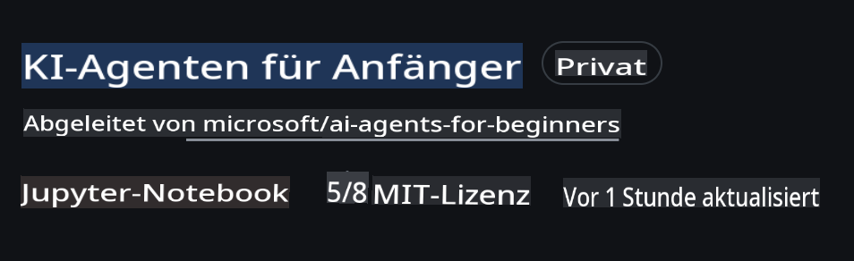
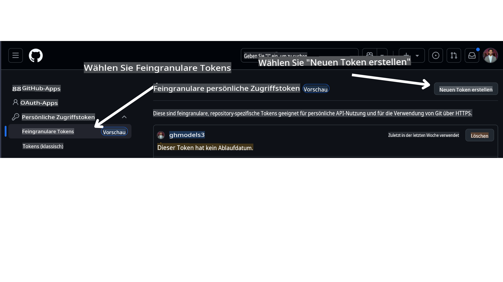

<!--
CO_OP_TRANSLATOR_METADATA:
{
  "original_hash": "366bc6709dd95b8a32ec7c705b0f179c",
  "translation_date": "2025-03-28T10:07:55+00:00",
  "source_file": "00-course-setup\\README.md",
  "language_code": "de"
}
-->
# Kurs-Setup

## Einführung

In dieser Lektion erfahren Sie, wie Sie die Codebeispiele dieses Kurses ausführen können.

## Anforderungen

- Ein GitHub-Konto
- Python 3.12+
- Azure-Abonnement
- Azure AI Foundry-Konto

## Dieses Repository klonen oder forken

Beginnen Sie damit, das GitHub-Repository zu klonen oder zu forken. Dadurch erstellen Sie Ihre eigene Version des Kursmaterials, sodass Sie den Code ausführen, testen und anpassen können!

Das können Sie tun, indem Sie auf den Link klicken:



## Abrufen Ihres GitHub Personal Access Token (PAT)

Derzeit nutzt dieser Kurs den Github Models Marketplace, um kostenlosen Zugang zu großen Sprachmodellen (LLMs) anzubieten, die zur Erstellung von KI-Agenten verwendet werden.

Um auf diesen Dienst zugreifen zu können, müssen Sie ein GitHub Personal Access Token erstellen.

Das können Sie tun, indem Sie zu Ihrem GitHub-Konto gehen.

Wählen Sie die Option `Fine-grained tokens` auf der linken Seite Ihres Bildschirms aus.

Klicken Sie anschließend auf `Generate new token`.



Kopieren Sie das neu erstellte Token. Dieses fügen Sie nun in die Datei `.env` ein, die in diesem Kurs enthalten ist.

## Zu den Umgebungsvariablen hinzufügen

Um Ihre `.env` Datei zu erstellen, führen Sie den folgenden Befehl in Ihrem Terminal aus:

```bash
cp .env.example .env
```

Dieser Befehl kopiert die Beispieldatei und erstellt eine `.env` in Ihrem Verzeichnis. Füllen Sie die Werte für die Umgebungsvariablen aus. Die Werte für jede Umgebungsvariable finden Sie an den folgenden Orten im [Azure AI Foundry](https://ai.azure.com?WT.mc_id=academic-105485-koreyst)-Portal:

Öffnen Sie die Datei und fügen Sie das erstellte Token in `GITHUB_TOKEN=` field of the .env file. 
- `AZURE_SUBSCRIPTION_ID` - On the **Overview** page of your project within **Project details**.
- `AZURE_AI_PROJECT_NAME` - At the top of the **Overview** page for your project.
- `AZURE_OPENAI_RESOURCE_GROUP` - On the **Overview** page of the **Management Center** within **Project properties**.
- `AZURE_OPENAI_SERVICE` - On the **Overview** page of your project in the **Included capabilities** tab for **Azure OpenAI Service**.
- `AZURE_OPENAI_API_VERSION` - On the [API version lifecycle](https://learn.microsoft.com/azure/ai-services/openai/api-version-deprecation#latest-ga-api-release?WT.mc_id=academic-105485-koreyst) webpage within the **Latest GA API release** section.
- `AZURE_OPENAI_ENDPOINT` ein - im **Details**-Tab Ihrer Modellbereitstellung unter **Endpoint** (z. B. **Target URI**).

## Erforderliche Pakete installieren

Um sicherzustellen, dass Sie alle benötigten Python-Pakete für die Codeausführung haben, führen Sie den folgenden Befehl in Ihrem Terminal aus.

Wir empfehlen die Erstellung einer Python-virtuellen Umgebung, um Konflikte und Probleme zu vermeiden.

```bash
pip install -r requirements.txt
```

Dadurch werden die erforderlichen Python-Pakete installiert.

# Anmeldung bei Azure

Als Sicherheitsbest-Practice verwenden wir [schlüssellose Authentifizierung](https://learn.microsoft.com/azure/developer/ai/keyless-connections?tabs=csharp%2Cazure-cli?WT.mc_id=academic-105485-koreyst), um sich mit Microsoft Entra ID bei Azure OpenAI zu authentifizieren. Bevor Sie dies tun können, müssen Sie zunächst die **Azure CLI** gemäß den [Installationsanweisungen](https://learn.microsoft.com/cli/azure/install-azure-cli?WT.mc_id=academic-105485-koreyst) für Ihr Betriebssystem installieren.

Öffnen Sie anschließend ein Terminal und führen Sie `az login` to sign in to your Azure account.

## Sign in to Azure

Login with your Azure AI account used to provision the Azure resources.

Open a new terminal and enter the following command and follow the instructions in the terminal:

`az login --use-device-code`

Once you've logged in, select your subscription in the terminal.

## Access the environment variables.

We'll import `os` and `load_dotenv` aus, um Zugriff auf die Umgebungsvariablen zu erhalten.

```python
import os
from dotenv import load_dotenv

load_dotenv()
```

## Schlüssellose Authentifizierung einrichten

Anstatt Ihre Zugangsdaten fest zu codieren, verwenden wir eine schlüssellose Verbindung mit Azure OpenAI. Dafür importieren wir die Funktion `DefaultAzureCredential` and later call the `DefaultAzureCredential`, um die Anmeldeinformationen abzurufen.

```python
from azure.identity import DefaultAzureCredential, InteractiveBrowserCredential
```

Nun sind Sie bereit, den Code dieses Kurses auszuführen. Viel Spaß beim Lernen über die Welt der KI-Agenten!

Falls Sie Probleme bei der Einrichtung haben, treten Sie unserer Community bei oder wenden Sie sich an unser Support-Team.

## Nächste Lektion

[Einführung in KI-Agenten und Anwendungsfälle für Agenten](../01-intro-to-ai-agents/README.md)

**Haftungsausschluss**:  
Dieses Dokument wurde mithilfe des KI-Übersetzungsdienstes [Co-op Translator](https://github.com/Azure/co-op-translator) übersetzt. Obwohl wir uns um Genauigkeit bemühen, beachten Sie bitte, dass automatisierte Übersetzungen Fehler oder Ungenauigkeiten enthalten können. Das Originaldokument in seiner ursprünglichen Sprache sollte als maßgebliche Quelle betrachtet werden. Für kritische Informationen wird eine professionelle menschliche Übersetzung empfohlen. Wir übernehmen keine Haftung für Missverständnisse oder Fehlinterpretationen, die sich aus der Nutzung dieser Übersetzung ergeben.