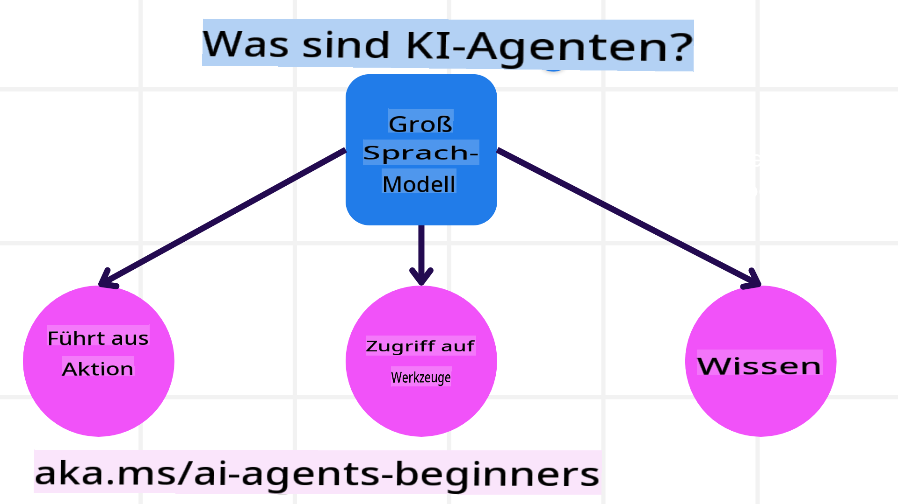
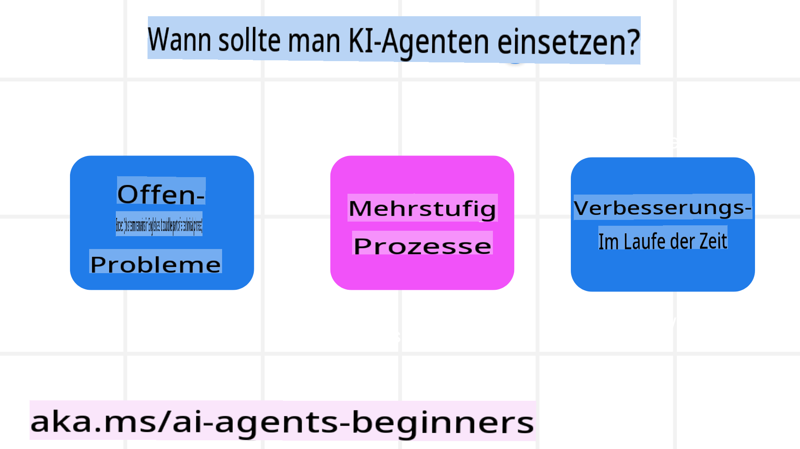

<!--
CO_OP_TRANSLATOR_METADATA:
{
  "original_hash": "233e7a18025a27eae95b653e9b5b5aa5",
  "translation_date": "2025-03-28T10:10:01+00:00",
  "source_file": "01-intro-to-ai-agents\\README.md",
  "language_code": "de"
}
-->

> _(Klicken Sie auf das Bild oben, um das Video zu dieser Lektion anzusehen)_

# Einführung in KI-Agenten und Anwendungsfälle für Agenten

Willkommen zum Kurs "KI-Agenten für Anfänger"! Dieser Kurs vermittelt grundlegendes Wissen und praktische Beispiele für den Aufbau von KI-Agenten.

Treffen Sie andere Lernende und KI-Agenten-Entwickler, und stellen Sie alle Fragen, die Sie zu diesem Kurs haben.

Um mit diesem Kurs zu beginnen, verschaffen wir uns zunächst ein besseres Verständnis darüber, was KI-Agenten sind und wie wir sie in den Anwendungen und Workflows einsetzen können, die wir erstellen.

## Einführung

Diese Lektion behandelt:

- Was sind KI-Agenten und welche unterschiedlichen Arten von Agenten gibt es?
- Welche Anwendungsfälle eignen sich besonders für KI-Agenten und wie können sie uns helfen?
- Welche grundlegenden Bausteine sind bei der Gestaltung von Agentenlösungen zu beachten?

## Lernziele
Nach Abschluss dieser Lektion sollten Sie in der Lage sein:

- Die Konzepte von KI-Agenten zu verstehen und wie sie sich von anderen KI-Lösungen unterscheiden.
- KI-Agenten effizient einzusetzen.
- Produktiv Agentenlösungen sowohl für Nutzer als auch für Kunden zu entwerfen.

## Definition von KI-Agenten und Typen von KI-Agenten

### Was sind KI-Agenten?

KI-Agenten sind **Systeme**, die es **großen Sprachmodellen (LLMs)** ermöglichen, **Aktionen auszuführen**, indem sie deren Fähigkeiten erweitern und ihnen **Zugang zu Werkzeugen** und **Wissen** verschaffen.

Lassen Sie uns diese Definition in kleinere Teile zerlegen:

- **System** - Es ist wichtig, Agenten nicht nur als eine einzelne Komponente zu betrachten, sondern als ein System aus vielen Komponenten. Grundlegend bestehen KI-Agenten aus:
  - **Umgebung** - Der definierte Raum, in dem der KI-Agent arbeitet. Zum Beispiel könnte die Umgebung eines Reisebuchungs-KI-Agenten das Buchungssystem sein, das der Agent zur Erledigung von Aufgaben nutzt.
  - **Sensoren** - Umgebungen enthalten Informationen und bieten Feedback. KI-Agenten nutzen Sensoren, um diese Informationen über den aktuellen Zustand der Umgebung zu sammeln und zu interpretieren. Im Beispiel des Reisebuchungs-Agenten könnte das System Informationen wie Hotelverfügbarkeit oder Flugpreise bereitstellen.
  - **Aktoren** - Sobald der KI-Agent den aktuellen Zustand der Umgebung erfasst hat, entscheidet er, welche Aktion er ausführen soll, um die Umgebung zu verändern. Für den Reisebuchungs-Agenten könnte dies bedeuten, ein verfügbares Zimmer für den Nutzer zu buchen.

**Große Sprachmodelle** - Das Konzept von Agenten existierte bereits vor der Entwicklung von LLMs. Der Vorteil, KI-Agenten mit LLMs aufzubauen, liegt in ihrer Fähigkeit, menschliche Sprache und Daten zu interpretieren. Diese Fähigkeit ermöglicht es LLMs, Umgebungsinformationen zu analysieren und einen Plan zur Veränderung der Umgebung zu erstellen.

**Aktionen ausführen** - Außerhalb von KI-Agenten-Systemen sind LLMs auf Situationen beschränkt, in denen die Aktion darin besteht, Inhalte oder Informationen basierend auf einer Eingabeaufforderung zu generieren. Innerhalb von KI-Agenten-Systemen können LLMs Aufgaben erledigen, indem sie die Anfrage des Nutzers interpretieren und Werkzeuge verwenden, die in ihrer Umgebung verfügbar sind.

**Zugang zu Werkzeugen** - Welche Werkzeuge dem LLM zur Verfügung stehen, wird durch 1) die Umgebung, in der es arbeitet, und 2) den Entwickler des KI-Agenten definiert. Für unser Reiseagenten-Beispiel sind die Werkzeuge des Agenten durch die Funktionen des Buchungssystems begrenzt, und/oder der Entwickler kann den Zugriff des Agenten auf bestimmte Werkzeuge wie Flüge einschränken.

**Wissen** - Neben den Informationen, die von der Umgebung bereitgestellt werden, können KI-Agenten auch Wissen aus anderen Systemen, Diensten, Werkzeugen und sogar anderen Agenten abrufen. Im Reiseagenten-Beispiel könnte dieses Wissen Informationen über die Reisevorlieben des Nutzers aus einer Kundendatenbank umfassen.

### Die verschiedenen Typen von Agenten

Nachdem wir nun eine allgemeine Definition von KI-Agenten haben, schauen wir uns einige spezifische Agententypen an und wie sie auf einen Reisebuchungs-KI-Agenten angewendet werden könnten.

| **Agententyp**                | **Beschreibung**                                                                                                                      | **Beispiel**                                                                                                                                                                                                                   |
| ----------------------------- | ------------------------------------------------------------------------------------------------------------------------------------- | ----------------------------------------------------------------------------------------------------------------------------------------------------------------------------------------------------------------------------- |
| **Einfache Reflex-Agenten**      | Führen sofortige Aktionen basierend auf vordefinierten Regeln aus.                                                                                  | Der Reiseagent interpretiert den Kontext einer E-Mail und leitet Reisebeschwerden an den Kundenservice weiter.                                                                                                                          |
| **Modellbasierte Reflex-Agenten** | Handeln basierend auf einem Modell der Welt und Veränderungen in diesem Modell.                                                              | Der Reiseagent priorisiert Routen mit signifikanten Preisänderungen basierend auf Zugriff auf historische Preisdaten.                                                                                                             |
| **Zielbasierte Agenten**         | Erstellen Pläne, um bestimmte Ziele zu erreichen, indem sie das Ziel interpretieren und die notwendigen Aktionen bestimmen.                                  | Der Reiseagent bucht eine Reise, indem er die notwendigen Reisearrangements (Auto, öffentliche Verkehrsmittel, Flüge) vom aktuellen Standort bis zum Zielort festlegt.                                                                                |
| **Nutzenbasierte Agenten**      | Berücksichtigen Präferenzen und wägen numerische Kompromisse ab, um zu bestimmen, wie Ziele erreicht werden können.                                               | Der Reiseagent maximiert den Nutzen, indem er Bequemlichkeit gegenüber Kosten abwägt, wenn er Reisen bucht.                                                                                                                                          |
| **Lernende Agenten**           | Verbessern sich im Laufe der Zeit durch Feedback und passen ihre Aktionen entsprechend an.                                                        | Der Reiseagent verbessert sich durch Kundenfeedback aus Umfragen nach der Reise, um zukünftige Buchungen anzupassen.                                                                                                               |
| **Hierarchische Agenten**       | Bestehen aus mehreren Agenten in einem gestaffelten System, wobei höherstufige Agenten Aufgaben in Teilaufgaben unterteilen, die von niedrigstufigen Agenten erledigt werden. | Der Reiseagent storniert eine Reise, indem er die Aufgabe in Teilaufgaben unterteilt (zum Beispiel einzelne Buchungen stornieren) und niedrigstufige Agenten diese erledigen lässt, die dann dem höherstufigen Agenten Bericht erstatten.                                     |
| **Multi-Agenten-Systeme (MAS)** | Agenten erledigen Aufgaben unabhängig voneinander, entweder kooperativ oder konkurrierend.                                                           | Kooperativ: Mehrere Agenten buchen spezifische Reisedienstleistungen wie Hotels, Flüge und Unterhaltung. Konkurrenz: Mehrere Agenten verwalten und konkurrieren um einen gemeinsamen Hotelbuchungskalender, um Kunden in das Hotel einzubuchen. |

## Wann sollte man KI-Agenten einsetzen?

Im vorherigen Abschnitt haben wir das Reiseagenten-Anwendungsbeispiel genutzt, um zu erklären, wie die verschiedenen Arten von Agenten in unterschiedlichen Szenarien der Reisebuchung eingesetzt werden können. Wir werden diese Anwendung im gesamten Kurs weiter verwenden.

Schauen wir uns die Arten von Anwendungsfällen an, für die KI-Agenten besonders geeignet sind:

- **Offene Probleme** - Ermöglichen es dem LLM, die notwendigen Schritte zur Erledigung einer Aufgabe zu bestimmen, da diese nicht immer fest in einen Workflow programmiert werden können.
- **Mehrstufige Prozesse** - Aufgaben, die ein gewisses Maß an Komplexität erfordern, bei denen der KI-Agent Werkzeuge oder Informationen über mehrere Schritte hinweg verwenden muss, anstatt sie in einem einzigen Durchgang abzurufen.
- **Verbesserung im Laufe der Zeit** - Aufgaben, bei denen sich der Agent durch Feedback von seiner Umgebung oder von Nutzern verbessern kann, um besseren Nutzen zu bieten.

Weitere Überlegungen zur Nutzung von KI-Agenten behandeln wir in der Lektion "Vertrauenswürdige KI-Agenten entwickeln".

## Grundlagen von Agentenlösungen

### Entwicklung von Agenten

Der erste Schritt beim Entwerfen eines KI-Agenten-Systems besteht darin, die Werkzeuge, Aktionen und Verhaltensweisen zu definieren. In diesem Kurs konzentrieren wir uns auf die Nutzung des **Azure AI Agent Service**, um unsere Agenten zu definieren. Er bietet Funktionen wie:

- Auswahl von offenen Modellen wie OpenAI, Mistral und Llama
- Nutzung von lizenzierten Daten über Anbieter wie Tripadvisor
- Verwendung standardisierter OpenAPI 3.0-Tools

### Agenten-Muster

Die Kommunikation mit LLMs erfolgt über Eingabeaufforderungen. Aufgrund der halbautonomen Natur von KI-Agenten ist es nicht immer möglich oder erforderlich, das LLM manuell erneut zu auffordern, nachdem sich die Umgebung geändert hat. Wir verwenden **Agenten-Muster**, die es uns ermöglichen, das LLM über mehrere Schritte hinweg auf skalierbare Weise zu steuern.

Dieser Kurs ist in einige der derzeit beliebten Agenten-Muster unterteilt.

### Agenten-Frameworks

Agenten-Frameworks ermöglichen es Entwicklern, Agenten-Muster durch Code umzusetzen. Diese Frameworks bieten Vorlagen, Plugins und Werkzeuge für eine bessere Zusammenarbeit von KI-Agenten. Diese Vorteile bieten Möglichkeiten für eine bessere Beobachtbarkeit und Fehlerbehebung von KI-Agenten-Systemen.

In diesem Kurs werden wir das forschungsgetriebene AutoGen-Framework und das produktionsreife Agent-Framework von Semantic Kernel erkunden.

## Vorherige Lektion

[Kursvorbereitung](../00-course-setup/README.md)

## Nächste Lektion

[Erforschung von Agenten-Frameworks](../02-explore-agentic-frameworks/README.md)

**Haftungsausschluss**:  
Dieses Dokument wurde mit dem KI-Übersetzungsdienst [Co-op Translator](https://github.com/Azure/co-op-translator) übersetzt. Obwohl wir uns um Genauigkeit bemühen, weisen wir darauf hin, dass automatisierte Übersetzungen Fehler oder Ungenauigkeiten enthalten können. Das Originaldokument in seiner ursprünglichen Sprache sollte als maßgebliche Quelle betrachtet werden. Für kritische Informationen wird eine professionelle menschliche Übersetzung empfohlen. Wir übernehmen keine Haftung für Missverständnisse oder Fehlinterpretationen, die sich aus der Nutzung dieser Übersetzung ergeben.