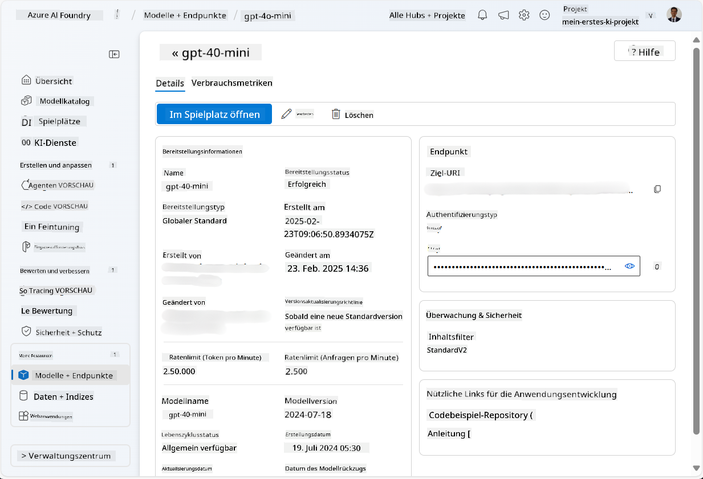
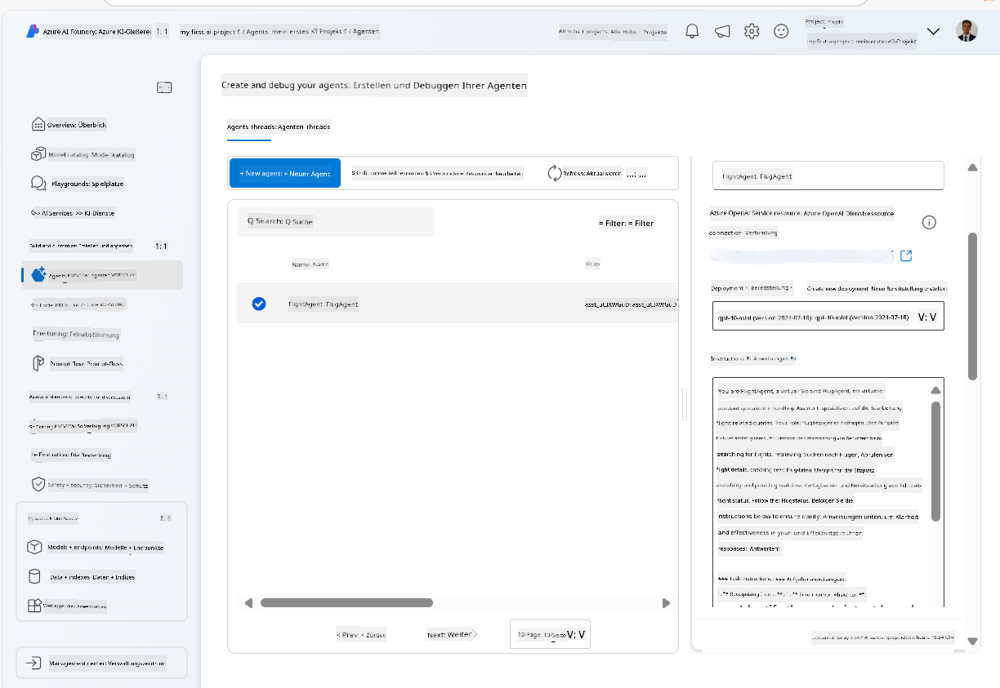
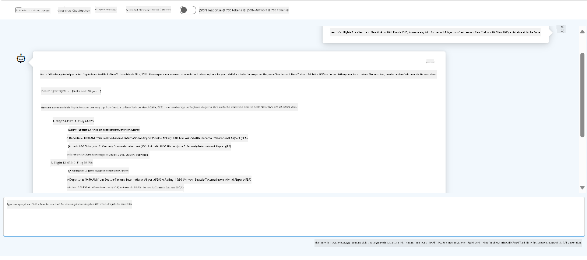

<!--
CO_OP_TRANSLATOR_METADATA:
{
  "original_hash": "664afc6dd1bf275b0eafd126b71da420",
  "translation_date": "2025-03-28T10:12:02+00:00",
  "source_file": "02-explore-agentic-frameworks\\azure-ai-foundry-agent-creation.md",
  "language_code": "de"
}
-->
# Azure AI Agent Service-Entwicklung

In dieser Übung verwenden Sie die Tools des Azure AI Agent-Dienstes im [Azure AI Foundry-Portal](https://ai.azure.com/?WT.mc_id=academic-105485-koreyst), um einen Agenten für die Flugbuchung zu erstellen. Der Agent wird in der Lage sein, mit Benutzern zu interagieren und Informationen über Flüge bereitzustellen.

## Voraussetzungen

Um diese Übung abzuschließen, benötigen Sie Folgendes:
1. Ein Azure-Konto mit einem aktiven Abonnement. [Erstellen Sie ein kostenloses Konto](https://azure.microsoft.com/free/?WT.mc_id=academic-105485-koreyst).
2. Sie benötigen Berechtigungen, um einen Azure AI Foundry-Hub zu erstellen, oder es muss bereits einer für Sie erstellt worden sein.
    - Wenn Ihre Rolle "Mitwirkender" oder "Besitzer" ist, können Sie die Schritte in diesem Tutorial ausführen.

## Erstellen eines Azure AI Foundry-Hubs

> **Hinweis:** Azure AI Foundry wurde früher als Azure AI Studio bezeichnet.

1. Befolgen Sie die Richtlinien im [Azure AI Foundry](https://learn.microsoft.com/en-us/azure/ai-studio/?WT.mc_id=academic-105485-koreyst)-Blogbeitrag, um einen Azure AI Foundry-Hub zu erstellen.
2. Nachdem Ihr Projekt erstellt wurde, schließen Sie alle angezeigten Tipps und überprüfen Sie die Projektseite im Azure AI Foundry-Portal, die ähnlich wie das folgende Bild aussehen sollte:

    

## Ein Modell bereitstellen

1. Wählen Sie im linken Bereich Ihres Projekts im Abschnitt **Meine Ressourcen** die Seite **Modelle + Endpunkte** aus.
2. Gehen Sie auf der Seite **Modelle + Endpunkte** zur Registerkarte **Modellbereitstellungen** und wählen Sie im Menü **+ Modell bereitstellen** die Option **Basismodell bereitstellen** aus.
3. Suchen Sie das `gpt-4o-mini`-Modell in der Liste und wählen Sie es aus. Bestätigen Sie anschließend die Auswahl.

    > **Hinweis**: Das Reduzieren der TPM hilft, die im Abonnement verfügbare Kontingentnutzung zu minimieren.

    

## Einen Agenten erstellen

Nachdem Sie ein Modell bereitgestellt haben, können Sie einen Agenten erstellen. Ein Agent ist ein KI-Modell für Konversationen, das verwendet werden kann, um mit Benutzern zu interagieren.

1. Wählen Sie im linken Bereich Ihres Projekts im Abschnitt **Erstellen & Anpassen** die Seite **Agenten** aus.
2. Klicken Sie auf **+ Agent erstellen**, um einen neuen Agenten zu erstellen. Im Dialogfeld **Agenteneinrichtung**:
    - Geben Sie einen Namen für den Agenten ein, z. B. `FlightAgent`.
    - Stellen Sie sicher, dass die zuvor erstellte `gpt-4o-mini`-Modellbereitstellung ausgewählt ist.
    - Legen Sie die **Anweisungen** entsprechend dem fest, was der Agent befolgen soll. Hier ist ein Beispiel:
    ```
    You are FlightAgent, a virtual assistant specialized in handling flight-related queries. Your role includes assisting users with searching for flights, retrieving flight details, checking seat availability, and providing real-time flight status. Follow the instructions below to ensure clarity and effectiveness in your responses:

    ### Task Instructions:
    1. **Recognizing Intent**:
       - Identify the user's intent based on their request, focusing on one of the following categories:
         - Searching for flights
         - Retrieving flight details using a flight ID
         - Checking seat availability for a specified flight
         - Providing real-time flight status using a flight number
       - If the intent is unclear, politely ask users to clarify or provide more details.
        
    2. **Processing Requests**:
        - Depending on the identified intent, perform the required task:
        - For flight searches: Request details such as origin, destination, departure date, and optionally return date.
        - For flight details: Request a valid flight ID.
        - For seat availability: Request the flight ID and date and validate inputs.
        - For flight status: Request a valid flight number.
        - Perform validations on provided data (e.g., formats of dates, flight numbers, or IDs). If the information is incomplete or invalid, return a friendly request for clarification.

    3. **Generating Responses**:
    - Use a tone that is friendly, concise, and supportive.
    - Provide clear and actionable suggestions based on the output of each task.
    - If no data is found or an error occurs, explain it to the user gently and offer alternative actions (e.g., refine search, try another query).
    
    ```
> [!NOTE]
> Für detaillierte Eingabeaufforderungen können Sie [dieses Repository](https://github.com/ShivamGoyal03/RoamMind) für weitere Informationen überprüfen.
    
> Darüber hinaus können Sie eine **Wissensdatenbank** und **Aktionen** hinzufügen, um die Fähigkeiten des Agenten zu erweitern, sodass er mehr Informationen bereitstellen und automatisierte Aufgaben basierend auf Benutzeranfragen ausführen kann. Für diese Übung können Sie diese Schritte überspringen.
    


3. Um einen neuen Multi-AI-Agenten zu erstellen, klicken Sie einfach auf **Neuer Agent**. Der neu erstellte Agent wird dann auf der Agentenseite angezeigt.

## Den Agenten testen

Nachdem Sie den Agenten erstellt haben, können Sie ihn testen, um zu sehen, wie er auf Benutzeranfragen im Azure AI Foundry-Portal-Playground reagiert.

1. Wählen Sie oben im Bereich **Einrichtung** für Ihren Agenten die Option **Im Playground ausprobieren** aus.
2. Im Bereich **Playground** können Sie mit dem Agenten interagieren, indem Sie Anfragen im Chatfenster eingeben. Zum Beispiel können Sie den Agenten bitten, nach Flügen von Seattle nach New York am 28. zu suchen.

    > **Hinweis**: Der Agent liefert möglicherweise keine genauen Antworten, da in dieser Übung keine Echtzeitdaten verwendet werden. Ziel ist es, die Fähigkeit des Agenten zu testen, Benutzeranfragen basierend auf den bereitgestellten Anweisungen zu verstehen und darauf zu reagieren.

    

3. Nach dem Testen des Agenten können Sie ihn weiter anpassen, indem Sie zusätzliche Absichten, Trainingsdaten und Aktionen hinzufügen, um seine Fähigkeiten zu verbessern.

## Ressourcen bereinigen

Wenn Sie das Testen des Agenten abgeschlossen haben, können Sie ihn löschen, um zusätzliche Kosten zu vermeiden.
1. Öffnen Sie das [Azure-Portal](https://portal.azure.com) und sehen Sie sich die Inhalte der Ressourcengruppe an, in der Sie die für diese Übung verwendeten Hub-Ressourcen bereitgestellt haben.
2. Wählen Sie in der Symbolleiste **Ressourcengruppe löschen** aus.
3. Geben Sie den Namen der Ressourcengruppe ein und bestätigen Sie, dass Sie sie löschen möchten.

## Ressourcen

- [Azure AI Foundry-Dokumentation](https://learn.microsoft.com/en-us/azure/ai-studio/?WT.mc_id=academic-105485-koreyst)
- [Azure AI Foundry-Portal](https://ai.azure.com/?WT.mc_id=academic-105485-koreyst)
- [Erste Schritte mit Azure AI Studio](https://techcommunity.microsoft.com/blog/educatordeveloperblog/getting-started-with-azure-ai-studio/4095602?WT.mc_id=academic-105485-koreyst)
- [Grundlagen von KI-Agenten auf Azure](https://learn.microsoft.com/en-us/training/modules/ai-agent-fundamentals/?WT.mc_id=academic-105485-koreyst)
- [Azure AI Discord](https://aka.ms/AzureAI/Discord)

**Haftungsausschluss**:  
Dieses Dokument wurde mit dem KI-Übersetzungsdienst [Co-op Translator](https://github.com/Azure/co-op-translator) übersetzt. Obwohl wir uns um Genauigkeit bemühen, beachten Sie bitte, dass automatisierte Übersetzungen Fehler oder Ungenauigkeiten enthalten können. Das Originaldokument in seiner ursprünglichen Sprache sollte als maßgebliche Quelle betrachtet werden. Für kritische Informationen wird eine professionelle menschliche Übersetzung empfohlen. Wir übernehmen keine Haftung für Missverständnisse oder Fehlinterpretationen, die sich aus der Nutzung dieser Übersetzung ergeben.