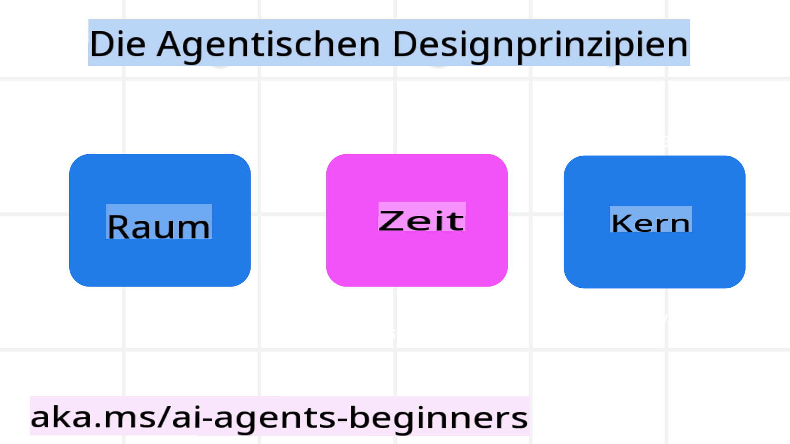

<!--
CO_OP_TRANSLATOR_METADATA:
{
  "original_hash": "969885aab5f923f67f134ce115fbbcaf",
  "translation_date": "2025-03-28T10:20:05+00:00",
  "source_file": "03-agentic-design-patterns\\README.md",
  "language_code": "de"
}
-->

> _(Klicken Sie auf das Bild oben, um das Video zu dieser Lektion anzusehen)_
# Prinzipien des agentischen Designs für KI

## Einführung

Es gibt viele Ansätze, um KI-Agentensysteme zu entwickeln. Da Mehrdeutigkeit in der Gestaltung generativer KI eher ein Merkmal als ein Fehler ist, fällt es Ingenieuren oft schwer, einen Ausgangspunkt zu finden. Wir haben eine Reihe von menschenzentrierten UX-Designprinzipien erstellt, die Entwicklern helfen sollen, kundenorientierte agentische Systeme zu entwickeln, um ihre geschäftlichen Anforderungen zu erfüllen. Diese Designprinzipien sind keine vorgeschriebene Architektur, sondern vielmehr ein Ausgangspunkt für Teams, die Agentenerfahrungen definieren und entwickeln.

Im Allgemeinen sollten Agenten:

- Menschliche Fähigkeiten erweitern und skalieren (Brainstorming, Problemlösung, Automatisierung usw.)
- Wissenslücken schließen (z. B. sich mit neuen Wissensgebieten vertraut machen, Übersetzung usw.)
- Zusammenarbeit erleichtern und unterstützen, auf eine Weise, die den individuellen Vorlieben entspricht
- Uns zu besseren Versionen unserer selbst machen (z. B. als Lebenscoach/Aufgabenmeister, uns helfen, emotionale Regulierung und Achtsamkeitsfähigkeiten zu erlernen, Resilienz aufzubauen usw.)

## Diese Lektion behandelt

- Was die Prinzipien des agentischen Designs sind
- Welche Richtlinien beim Umsetzen dieser Designprinzipien beachtet werden sollten
- Beispiele für die Anwendung der Designprinzipien

## Lernziele

Nach Abschluss dieser Lektion können Sie:

1. Erklären, was die Prinzipien des agentischen Designs sind
2. Die Richtlinien zur Anwendung der Prinzipien des agentischen Designs erläutern
3. Verstehen, wie man einen Agenten basierend auf den Prinzipien des agentischen Designs entwickelt

## Die Prinzipien des agentischen Designs

### Agent (Raum)

Dies ist die Umgebung, in der der Agent arbeitet. Diese Prinzipien beeinflussen, wie wir Agenten für die Interaktion in physischen und digitalen Welten gestalten.

- **Verbinden, nicht ersetzen** – Helfen Sie Menschen, sich mit anderen Menschen, Ereignissen und umsetzbarem Wissen zu verbinden, um Zusammenarbeit und Verbindungen zu ermöglichen.
  - Agenten helfen, Ereignisse, Wissen und Menschen zu verknüpfen.
  - Agenten bringen Menschen näher zusammen. Sie sind nicht dafür gedacht, Menschen zu ersetzen oder zu entwerten.
- **Leicht zugänglich, aber gelegentlich unsichtbar** – Der Agent arbeitet weitgehend im Hintergrund und gibt uns nur dann einen Hinweis, wenn es relevant und angemessen ist.
  - Der Agent ist leicht auffindbar und zugänglich für autorisierte Nutzer auf jedem Gerät oder jeder Plattform.
  - Der Agent unterstützt multimodale Eingaben und Ausgaben (Ton, Sprache, Text usw.).
  - Der Agent kann nahtlos zwischen Vordergrund und Hintergrund wechseln; zwischen proaktiv und reaktiv, abhängig von den Bedürfnissen des Nutzers.
  - Der Agent kann unsichtbar arbeiten, doch sein Hintergrundprozess und die Zusammenarbeit mit anderen Agenten sind für den Nutzer transparent und kontrollierbar.

### Agent (Zeit)

Dies beschreibt, wie der Agent im Laufe der Zeit arbeitet. Diese Prinzipien beeinflussen, wie wir Agenten gestalten, die über Vergangenheit, Gegenwart und Zukunft interagieren.

- **Vergangenheit**: Reflexion der Geschichte, einschließlich Zustand und Kontext.
  - Der Agent liefert relevantere Ergebnisse durch die Analyse umfangreicher historischer Daten, die über Ereignisse, Personen oder Zustände hinausgehen.
  - Der Agent schafft Verbindungen aus vergangenen Ereignissen und reflektiert aktiv Erinnerungen, um mit aktuellen Situationen zu interagieren.
- **Jetzt**: Anstoßen statt nur benachrichtigen.
  - Der Agent verkörpert einen umfassenden Ansatz zur Interaktion mit Menschen. Wenn ein Ereignis eintritt, geht der Agent über statische Benachrichtigungen oder andere formelle Hinweise hinaus. Der Agent kann Abläufe vereinfachen oder dynamisch Hinweise generieren, um die Aufmerksamkeit des Nutzers im richtigen Moment zu lenken.
  - Der Agent liefert Informationen basierend auf dem Kontext der Umgebung, sozialen und kulturellen Veränderungen und angepasst an die Absicht des Nutzers.
  - Die Interaktion mit dem Agenten kann schrittweise erfolgen, sich weiterentwickeln und im Laufe der Zeit komplexer werden, um den Nutzer langfristig zu stärken.
- **Zukunft**: Anpassen und weiterentwickeln.
  - Der Agent passt sich an verschiedene Geräte, Plattformen und Modalitäten an.
  - Der Agent passt sich dem Verhalten des Nutzers, dessen Barrierefreiheitsbedürfnissen an und ist frei anpassbar.
  - Der Agent wird durch kontinuierliche Interaktion mit dem Nutzer geformt und weiterentwickelt.

### Agent (Kern)

Dies sind die Schlüsselelemente im Kern des Designs eines Agenten.

- **Unsicherheit akzeptieren, aber Vertrauen schaffen**.
  - Ein gewisses Maß an Unsicherheit beim Agenten wird erwartet. Unsicherheit ist ein Schlüsselelement im Design von Agenten.
  - Vertrauen und Transparenz sind grundlegende Schichten im Design eines Agenten.
  - Menschen haben die Kontrolle darüber, wann der Agent ein- oder ausgeschaltet ist, und der Status des Agenten ist jederzeit klar sichtbar.

## Die Richtlinien zur Umsetzung dieser Prinzipien

Wenn Sie die oben genannten Designprinzipien verwenden, beachten Sie die folgenden Richtlinien:

1. **Transparenz**: Informieren Sie den Nutzer darüber, dass KI beteiligt ist, wie sie funktioniert (einschließlich vergangener Aktionen) und wie man Feedback gibt und das System modifiziert.
2. **Kontrolle**: Geben Sie dem Nutzer die Möglichkeit, Anpassungen vorzunehmen, Präferenzen festzulegen, das System zu personalisieren und Kontrolle über das System und seine Attribute zu haben (einschließlich der Möglichkeit zu vergessen).
3. **Konsistenz**: Streben Sie konsistente, multimodale Erfahrungen über Geräte und Endpunkte hinweg an. Verwenden Sie vertraute UI/UX-Elemente, wo möglich (z. B. Mikrofon-Symbol für Sprachinteraktion), und reduzieren Sie die kognitive Belastung des Nutzers so weit wie möglich (z. B. durch prägnante Antworten, visuelle Hilfsmittel und „Mehr erfahren“-Inhalte).

## Wie man einen Reiseagenten basierend auf diesen Prinzipien und Richtlinien entwirft

Stellen Sie sich vor, Sie entwerfen einen Reiseagenten. So könnten Sie die Designprinzipien und Richtlinien anwenden:

1. **Transparenz** – Informieren Sie den Nutzer darüber, dass der Reiseagent ein KI-gesteuerter Agent ist. Geben Sie einige grundlegende Anweisungen, wie man startet (z. B. eine „Hallo“-Nachricht, Beispielaufforderungen). Dokumentieren Sie dies klar auf der Produktseite. Zeigen Sie die Liste der Aufforderungen, die der Nutzer in der Vergangenheit gestellt hat. Machen Sie deutlich, wie man Feedback gibt (Daumen hoch und runter, Feedback senden-Button usw.). Stellen Sie klar, ob der Agent Nutzungs- oder Themenbeschränkungen hat.
2. **Kontrolle** – Stellen Sie sicher, dass klar ist, wie der Nutzer den Agenten nach dessen Erstellung ändern kann, z. B. durch den System-Prompt. Ermöglichen Sie dem Nutzer, auszuwählen, wie ausführlich der Agent ist, seinen Schreibstil und eventuelle Einschränkungen darüber, worüber der Agent nicht sprechen sollte. Lassen Sie den Nutzer alle zugehörigen Dateien oder Daten, Aufforderungen und vergangene Gespräche anzeigen und löschen.
3. **Konsistenz** – Stellen Sie sicher, dass die Symbole für „Aufforderung teilen“, „Datei oder Foto hinzufügen“ und „Jemanden oder etwas markieren“ standardisiert und erkennbar sind. Verwenden Sie das Büroklammer-Symbol, um Dateiupload/Teilen mit dem Agenten anzuzeigen, und ein Bildsymbol, um den Grafik-Upload darzustellen.

## Zusätzliche Ressourcen

## Vorherige Lektion

[Agentische Rahmenwerke erkunden](../02-explore-agentic-frameworks/README.md)

## Nächste Lektion

[Designmuster für Werkzeugnutzung](../04-tool-use/README.md)

**Haftungsausschluss**:  
Dieses Dokument wurde mit dem KI-Übersetzungsdienst [Co-op Translator](https://github.com/Azure/co-op-translator) übersetzt. Obwohl wir uns um Genauigkeit bemühen, weisen wir darauf hin, dass automatisierte Übersetzungen Fehler oder Ungenauigkeiten enthalten können. Das Originaldokument in seiner ursprünglichen Sprache sollte als maßgebliche Quelle betrachtet werden. Für kritische Informationen wird eine professionelle menschliche Übersetzung empfohlen. Wir übernehmen keine Haftung für Missverständnisse oder Fehlinterpretationen, die durch die Nutzung dieser Übersetzung entstehen.