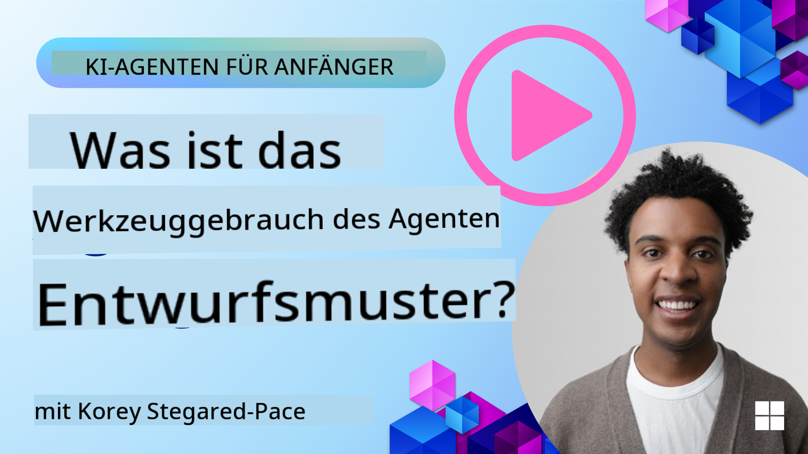
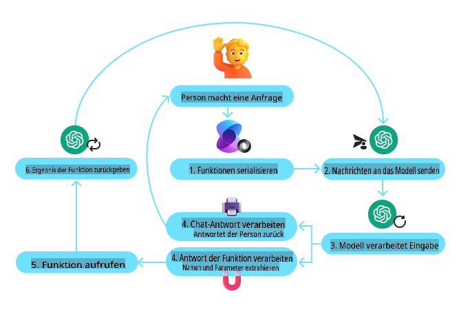
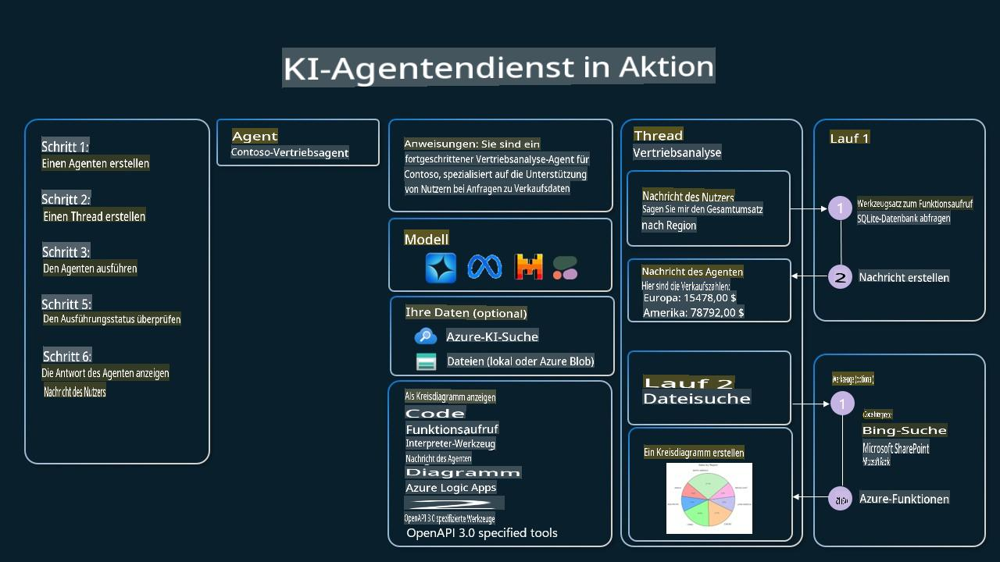

<!--
CO_OP_TRANSLATOR_METADATA:
{
  "original_hash": "b8ea2abd1a674f736d5fc08982e6ec06",
  "translation_date": "2025-03-28T10:23:03+00:00",
  "source_file": "04-tool-use\\README.md",
  "language_code": "de"
}
-->
[](https://youtu.be/vieRiPRx-gI?si=cEZ8ApnT6Sus9rhn)

> _(Klicken Sie auf das Bild oben, um das Video zu dieser Lektion anzusehen)_

# Designmuster für Werkzeugnutzung

Werkzeuge sind interessant, da sie KI-Agenten eine breitere Palette von Fähigkeiten ermöglichen. Anstatt dass der Agent nur eine begrenzte Anzahl von Aktionen ausführen kann, erweitert ein Werkzeug seine Möglichkeiten erheblich. In diesem Kapitel betrachten wir das Designmuster für Werkzeugnutzung, das beschreibt, wie KI-Agenten spezifische Werkzeuge nutzen können, um ihre Ziele zu erreichen.

## Einführung

In dieser Lektion versuchen wir, die folgenden Fragen zu beantworten:

- Was ist das Designmuster für Werkzeugnutzung?
- Welche Anwendungsfälle gibt es dafür?
- Welche Elemente/Bausteine sind erforderlich, um das Designmuster umzusetzen?
- Welche besonderen Überlegungen gibt es, um vertrauenswürdige KI-Agenten mit diesem Designmuster zu erstellen?

## Lernziele

Nach Abschluss dieser Lektion werden Sie in der Lage sein:

- Das Designmuster für Werkzeugnutzung und dessen Zweck zu definieren.
- Anwendungsfälle zu identifizieren, in denen das Designmuster für Werkzeugnutzung anwendbar ist.
- Die wesentlichen Elemente zu verstehen, die für die Umsetzung des Designmusters erforderlich sind.
- Überlegungen zu erkennen, um die Vertrauenswürdigkeit von KI-Agenten mit diesem Designmuster sicherzustellen.

## Was ist das Designmuster für Werkzeugnutzung?

Das **Designmuster für Werkzeugnutzung** konzentriert sich darauf, LLMs die Fähigkeit zu geben, mit externen Werkzeugen zu interagieren, um spezifische Ziele zu erreichen. Werkzeuge sind Code, der von einem Agenten ausgeführt werden kann, um Aktionen durchzuführen. Ein Werkzeug kann eine einfache Funktion wie ein Taschenrechner oder ein API-Aufruf eines Drittanbieterdienstes sein, beispielsweise für die Abfrage von Aktienkursen oder Wettervorhersagen. Im Kontext von KI-Agenten sind Werkzeuge dafür konzipiert, von Agenten als Reaktion auf **modellgenerierte Funktionsaufrufe** ausgeführt zu werden.

## Für welche Anwendungsfälle kann es verwendet werden?

KI-Agenten können Werkzeuge nutzen, um komplexe Aufgaben zu erledigen, Informationen abzurufen oder Entscheidungen zu treffen. Das Designmuster für Werkzeugnutzung wird oft in Szenarien verwendet, die eine dynamische Interaktion mit externen Systemen wie Datenbanken, Webdiensten oder Code-Interpretern erfordern. Diese Fähigkeit ist für eine Vielzahl von Anwendungsfällen nützlich, darunter:

- **Dynamische Informationsabfrage:** Agenten können externe APIs oder Datenbanken abfragen, um aktuelle Daten abzurufen (z. B. Abfragen einer SQLite-Datenbank für Datenanalysen, Abrufen von Aktienkursen oder Wetterinformationen).
- **Code-Ausführung und Interpretation:** Agenten können Code oder Skripte ausführen, um mathematische Probleme zu lösen, Berichte zu erstellen oder Simulationen durchzuführen.
- **Workflow-Automatisierung:** Automatisierung von wiederkehrenden oder mehrstufigen Workflows durch Integration von Werkzeugen wie Aufgabenplanern, E-Mail-Diensten oder Datenpipelines.
- **Kundensupport:** Agenten können mit CRM-Systemen, Ticketplattformen oder Wissensdatenbanken interagieren, um Benutzeranfragen zu lösen.
- **Inhaltsgenerierung und -bearbeitung:** Agenten können Werkzeuge wie Grammatikprüfer, Textzusammenfasser oder Inhaltsbewertungen nutzen, um bei der Erstellung von Inhalten zu helfen.

## Welche Elemente/Bausteine sind erforderlich, um das Designmuster für Werkzeugnutzung umzusetzen?

Diese Bausteine ermöglichen es dem KI-Agenten, eine breite Palette von Aufgaben auszuführen. Schauen wir uns die wesentlichen Elemente an, die für die Umsetzung des Designmusters für Werkzeugnutzung erforderlich sind:

- **Funktions-/Werkzeugaufrufe:** Dies ist die Hauptmethode, um LLMs die Interaktion mit Werkzeugen zu ermöglichen. Funktionen oder Werkzeuge sind wiederverwendbare Codeblöcke, die Agenten zur Durchführung von Aufgaben verwenden. Diese können von einfachen Funktionen wie einem Taschenrechner bis hin zu API-Aufrufen von Drittanbieterdiensten wie Aktienkursabfragen oder Wettervorhersagen reichen.

- **Dynamische Informationsabfrage:** Agenten können externe APIs oder Datenbanken abfragen, um aktuelle Daten abzurufen. Dies ist nützlich für Aufgaben wie Datenanalysen, Abrufen von Aktienkursen oder Wetterinformationen.

- **Code-Ausführung und Interpretation:** Agenten können Code oder Skripte ausführen, um mathematische Probleme zu lösen, Berichte zu erstellen oder Simulationen durchzuführen.

- **Workflow-Automatisierung:** Dies beinhaltet die Automatisierung von wiederkehrenden oder mehrstufigen Workflows durch Integration von Werkzeugen wie Aufgabenplanern, E-Mail-Diensten oder Datenpipelines.

- **Kundensupport:** Agenten können mit CRM-Systemen, Ticketplattformen oder Wissensdatenbanken interagieren, um Benutzeranfragen zu lösen.

- **Inhaltsgenerierung und -bearbeitung:** Agenten können Werkzeuge wie Grammatikprüfer, Textzusammenfasser oder Inhaltsbewertungen nutzen, um bei der Erstellung von Inhalten zu helfen.

Als Nächstes schauen wir uns Funktions-/Werkzeugaufrufe genauer an.

### Funktions-/Werkzeugaufrufe

Funktionsaufrufe sind die Hauptmethode, um Large Language Models (LLMs) die Interaktion mit Werkzeugen zu ermöglichen. Oft werden "Funktion" und "Werkzeug" synonym verwendet, da "Funktionen" (wiederverwendbare Codeblöcke) die "Werkzeuge" sind, die Agenten zur Durchführung von Aufgaben nutzen. Damit der Code einer Funktion ausgeführt werden kann, muss ein LLM die Anfrage des Nutzers mit der Beschreibung der Funktion vergleichen. Dazu wird ein Schema mit den Beschreibungen aller verfügbaren Funktionen an das LLM gesendet. Das LLM wählt dann die am besten geeignete Funktion für die Aufgabe aus und gibt deren Namen und Argumente zurück. Die ausgewählte Funktion wird ausgeführt, ihre Antwort wird an das LLM zurückgesendet, das die Informationen verwendet, um auf die Anfrage des Nutzers zu reagieren.

Um Funktionsaufrufe für Agenten umzusetzen, benötigen Entwickler:

1. Ein LLM-Modell, das Funktionsaufrufe unterstützt
2. Ein Schema mit Funktionsbeschreibungen
3. Den Code für jede beschriebene Funktion

Schauen wir uns das Beispiel an, wie man die aktuelle Zeit in einer Stadt abruft:

1. **Initialisierung eines LLM, das Funktionsaufrufe unterstützt:**

    Nicht alle Modelle unterstützen Funktionsaufrufe, daher ist es wichtig, sicherzustellen, dass das verwendete LLM dies tut. <a href="https://learn.microsoft.com/azure/ai-services/openai/how-to/function-calling" target="_blank">Azure OpenAI</a> unterstützt Funktionsaufrufe. Wir können beginnen, indem wir den Azure OpenAI-Client initialisieren.

    ```python
    # Initialize the Azure OpenAI client
    client = AzureOpenAI(
        azure_endpoint = os.getenv("AZURE_OPENAI_ENDPOINT"), 
        api_key=os.getenv("AZURE_OPENAI_API_KEY"),  
        api_version="2024-05-01-preview"
    )
    ```

1. **Erstellen eines Funktionsschemas:**

    Als Nächstes definieren wir ein JSON-Schema, das den Funktionsnamen, die Beschreibung der Funktion und die Namen und Beschreibungen der Funktionsparameter enthält. Dieses Schema wird dann an den zuvor erstellten Client übergeben, zusammen mit der Anfrage des Nutzers, die Zeit in San Francisco zu finden. Es ist wichtig zu beachten, dass ein **Werkzeugaufruf** zurückgegeben wird, **nicht** die endgültige Antwort auf die Frage. Wie zuvor erwähnt, gibt das LLM den Namen der Funktion zurück, die es für die Aufgabe ausgewählt hat, sowie die Argumente, die übergeben werden sollen.

    ```python
    # Function description for the model to read
    tools = [
        {
            "type": "function",
            "function": {
                "name": "get_current_time",
                "description": "Get the current time in a given location",
                "parameters": {
                    "type": "object",
                    "properties": {
                        "location": {
                            "type": "string",
                            "description": "The city name, e.g. San Francisco",
                        },
                    },
                    "required": ["location"],
                },
            }
        }
    ]
    ```
   
    ```python
  
    # Initial user message
    messages = [{"role": "user", "content": "What's the current time in San Francisco"}] 
  
    # First API call: Ask the model to use the function
      response = client.chat.completions.create(
          model=deployment_name,
          messages=messages,
          tools=tools,
          tool_choice="auto",
      )
  
      # Process the model's response
      response_message = response.choices[0].message
      messages.append(response_message)
  
      print("Model's response:")  

      print(response_message)
  
    ```

    ```bash
    Model's response:
    ChatCompletionMessage(content=None, role='assistant', function_call=None, tool_calls=[ChatCompletionMessageToolCall(id='call_pOsKdUlqvdyttYB67MOj434b', function=Function(arguments='{"location":"San Francisco"}', name='get_current_time'), type='function')])
    ```
  
1. **Der erforderliche Funktionscode zur Durchführung der Aufgabe:**

    Nachdem das LLM entschieden hat, welche Funktion ausgeführt werden soll, muss der Code implementiert und ausgeführt werden. Wir können den Code, um die aktuelle Zeit zu ermitteln, in Python implementieren. Außerdem müssen wir den Code schreiben, um den Namen und die Argumente aus der response_message zu extrahieren, um das endgültige Ergebnis zu erhalten.

    ```python
      def get_current_time(location):
        """Get the current time for a given location"""
        print(f"get_current_time called with location: {location}")  
        location_lower = location.lower()
        
        for key, timezone in TIMEZONE_DATA.items():
            if key in location_lower:
                print(f"Timezone found for {key}")  
                current_time = datetime.now(ZoneInfo(timezone)).strftime("%I:%M %p")
                return json.dumps({
                    "location": location,
                    "current_time": current_time
                })
      
        print(f"No timezone data found for {location_lower}")  
        return json.dumps({"location": location, "current_time": "unknown"})
    ```

    ```python
     # Handle function calls
      if response_message.tool_calls:
          for tool_call in response_message.tool_calls:
              if tool_call.function.name == "get_current_time":
     
                  function_args = json.loads(tool_call.function.arguments)
     
                  time_response = get_current_time(
                      location=function_args.get("location")
                  )
     
                  messages.append({
                      "tool_call_id": tool_call.id,
                      "role": "tool",
                      "name": "get_current_time",
                      "content": time_response,
                  })
      else:
          print("No tool calls were made by the model.")  
  
      # Second API call: Get the final response from the model
      final_response = client.chat.completions.create(
          model=deployment_name,
          messages=messages,
      )
  
      return final_response.choices[0].message.content
     ```

    ```bash
      get_current_time called with location: San Francisco
      Timezone found for san francisco
      The current time in San Francisco is 09:24 AM.
     ```

Funktionsaufrufe sind das Herzstück der meisten, wenn nicht aller agentengesteuerten Werkzeugnutzung, allerdings kann die Implementierung von Grund auf manchmal herausfordernd sein. Wie wir in [Lektion 2](../../../02-explore-agentic-frameworks) gelernt haben, bieten agentengesteuerte Frameworks vorgefertigte Bausteine zur Umsetzung der Werkzeugnutzung.

## Beispiele für Werkzeugnutzung mit agentengesteuerten Frameworks

Hier sind einige Beispiele, wie Sie das Designmuster für Werkzeugnutzung mit verschiedenen agentengesteuerten Frameworks umsetzen können:

### Semantic Kernel

<a href="https://learn.microsoft.com/azure/ai-services/agents/overview" target="_blank">Semantic Kernel</a> ist ein Open-Source-KI-Framework für .NET-, Python- und Java-Entwickler, die mit Large Language Models (LLMs) arbeiten. Es vereinfacht die Nutzung von Funktionsaufrufen, indem es Ihre Funktionen und deren Parameter automatisch durch einen Prozess namens <a href="https://learn.microsoft.com/semantic-kernel/concepts/ai-services/chat-completion/function-calling/?pivots=programming-language-python#1-serializing-the-functions" target="_blank">Serialisierung</a> beschreibt. Es kümmert sich auch um die Kommunikation zwischen dem Modell und Ihrem Code. Ein weiterer Vorteil eines agentengesteuerten Frameworks wie Semantic Kernel ist, dass es Zugang zu vorgefertigten Werkzeugen wie <a href="https://github.com/microsoft/semantic-kernel/blob/main/python/samples/getting_started_with_agents/openai_assistant/step4_assistant_tool_file_search.py" target="_blank">Dateisuche</a> und <a href="https://github.com/microsoft/semantic-kernel/blob/main/python/samples/getting_started_with_agents/openai_assistant/step3_assistant_tool_code_interpreter.py" target="_blank">Code-Interpreter</a> bietet.

Das folgende Diagramm veranschaulicht den Prozess des Funktionsaufrufs mit Semantic Kernel:



In Semantic Kernel werden Funktionen/Werkzeuge als <a href="https://learn.microsoft.com/semantic-kernel/concepts/plugins/?pivots=programming-language-python" target="_blank">Plugins</a> bezeichnet. Wir können die Funktion `get_current_time` function we saw earlier into a plugin by turning it into a class with the function in it. We can also import the `kernel_function` mit einem Dekorator versehen, der die Beschreibung der Funktion enthält. Wenn Sie dann ein Kernel mit dem GetCurrentTimePlugin erstellen, serialisiert das Kernel automatisch die Funktion und deren Parameter, wodurch das Schema erstellt wird, das an das LLM gesendet wird.

```python
from semantic_kernel.functions import kernel_function

class GetCurrentTimePlugin:
    async def __init__(self, location):
        self.location = location

    @kernel_function(
        description="Get the current time for a given location"
    )
    def get_current_time(location: str = ""):
        ...

```

```python 
from semantic_kernel import Kernel

# Create the kernel
kernel = Kernel()

# Create the plugin
get_current_time_plugin = GetCurrentTimePlugin(location)

# Add the plugin to the kernel
kernel.add_plugin(get_current_time_plugin)
```
  
### Azure AI Agent Service

<a href="https://learn.microsoft.com/azure/ai-services/agents/overview" target="_blank">Azure AI Agent Service</a> ist ein neues agentengesteuertes Framework, das Entwicklern dabei hilft, hochwertige, erweiterbare KI-Agenten sicher zu erstellen, bereitzustellen und zu skalieren, ohne die zugrunde liegenden Ressourcen verwalten zu müssen. Es ist besonders nützlich für Unternehmensanwendungen, da es ein vollständig verwalteter Dienst mit Sicherheit auf Unternehmensniveau ist.

Im Vergleich zur direkten Entwicklung mit der LLM-API bietet der Azure AI Agent Service einige Vorteile, darunter:

- Automatische Werkzeugaufrufe – keine Notwendigkeit, einen Werkzeugaufruf zu parsen, das Werkzeug aufzurufen und die Antwort zu verarbeiten; all dies wird jetzt serverseitig erledigt.
- Sicher verwaltete Daten – anstatt den Gesprächsverlauf selbst zu verwalten, können Sie Threads verwenden, um alle benötigten Informationen zu speichern.
- Vorinstallierte Werkzeuge – Werkzeuge, die Sie zur Interaktion mit Ihren Datenquellen verwenden können, wie Bing, Azure AI Search und Azure Functions.

Die im Azure AI Agent Service verfügbaren Werkzeuge lassen sich in zwei Kategorien einteilen:

1. Wissenswerkzeuge:
    - <a href="https://learn.microsoft.com/azure/ai-services/agents/how-to/tools/bing-grounding?tabs=python&pivots=overview" target="_blank">Grounding mit Bing-Suche</a>
    - <a href="https://learn.microsoft.com/azure/ai-services/agents/how-to/tools/file-search?tabs=python&pivots=overview" target="_blank">Dateisuche</a>
    - <a href="https://learn.microsoft.com/azure/ai-services/agents/how-to/tools/azure-ai-search?tabs=azurecli%2Cpython&pivots=overview-azure-ai-search" target="_blank">Azure AI-Suche</a>

2. Aktionswerkzeuge:
    - <a href="https://learn.microsoft.com/azure/ai-services/agents/how-to/tools/function-calling?tabs=python&pivots=overview" target="_blank">Funktionsaufrufe</a>
    - <a href="https://learn.microsoft.com/azure/ai-services/agents/how-to/tools/code-interpreter?tabs=python&pivots=overview" target="_blank">Code-Interpreter</a>
    - <a href="https://learn.microsoft.com/azure/ai-services/agents/how-to/tools/openapi-spec?tabs=python&pivots=overview" target="_blank">OpenAI-definierte Werkzeuge</a>
    - <a href="https://learn.microsoft.com/azure/ai-services/agents/how-to/tools/azure-functions?pivots=overview" target="_blank">Azure Functions</a>

Der Agent Service ermöglicht es uns, diese Werkzeuge gemeinsam als `toolset`. It also utilizes `threads` which keep track of the history of messages from a particular conversation.

Imagine you are a sales agent at a company called Contoso. You want to develop a conversational agent that can answer questions about your sales data.

The following image illustrates how you could use Azure AI Agent Service to analyze your sales data:



To use any of these tools with the service we can create a client and define a tool or toolset. To implement this practically we can use the following Python code. The LLM will be able to look at the toolset and decide whether to use the user created function, `fetch_sales_data_using_sqlite_query` oder den vorinstallierten Code-Interpreter je nach Nutzeranfrage zu verwenden.

```python 
import os
from azure.ai.projects import AIProjectClient
from azure.identity import DefaultAzureCredential
from fecth_sales_data_functions import fetch_sales_data_using_sqlite_query # fetch_sales_data_using_sqlite_query function which can be found in a fetch_sales_data_functions.py file.
from azure.ai.projects.models import ToolSet, FunctionTool, CodeInterpreterTool

project_client = AIProjectClient.from_connection_string(
    credential=DefaultAzureCredential(),
    conn_str=os.environ["PROJECT_CONNECTION_STRING"],
)

# Initialize function calling agent with the fetch_sales_data_using_sqlite_query function and adding it to the toolset
fetch_data_function = FunctionTool(fetch_sales_data_using_sqlite_query)
toolset = ToolSet()
toolset.add(fetch_data_function)

# Initialize Code Interpreter tool and adding it to the toolset. 
code_interpreter = code_interpreter = CodeInterpreterTool()
toolset = ToolSet()
toolset.add(code_interpreter)

agent = project_client.agents.create_agent(
    model="gpt-4o-mini", name="my-agent", instructions="You are helpful agent", 
    toolset=toolset
)
```

## Welche besonderen Überlegungen gibt es, um das Designmuster für Werkzeugnutzung zu nutzen und vertrauenswürdige KI-Agenten zu erstellen?

Ein häufiges Problem bei SQL, das dynamisch von LLMs generiert wird, ist die Sicherheit, insbesondere das Risiko von SQL-Injection oder böswilligen Aktionen wie dem Löschen oder Manipulieren der Datenbank. Obwohl diese Bedenken berechtigt sind, können sie durch die richtige Konfiguration der Datenbankzugriffsberechtigungen effektiv gemindert werden. Für die meisten Datenbanken bedeutet dies, dass die Datenbank als schreibgeschützt konfiguriert wird. Für Datenbankdienste wie PostgreSQL oder Azure SQL sollte der App eine schreibgeschützte (SELECT) Rolle zugewiesen werden.

Das Ausführen der App in einer sicheren Umgebung bietet zusätzlichen Schutz. In Unternehmensszenarien werden Daten normalerweise aus operativen Systemen extrahiert und in eine schreibgeschützte Datenbank oder ein Data Warehouse mit einer benutzerfreundlichen Schema transformiert. Dieser Ansatz stellt sicher, dass die Daten sicher sind, für Leistung und Zugänglichkeit optimiert sind und dass die App eingeschränkten, schreibgeschützten Zugriff hat.

## Zusätzliche Ressourcen

- <a href="https://microsoft.github.io/build-your-first-agent-with-azure-ai-agent-service-workshop/" target="_blank">Azure AI Agents Service Workshop</a>
- <a href="https://github.com/Azure-Samples/contoso-creative-writer/tree/main/docs/workshop" target="_blank">Contoso Creative Writer Multi-Agent Workshop</a>
- <a href="https://learn.microsoft.com/semantic-kernel/concepts/ai-services/chat-completion/function-calling/?pivots=programming-language-python#1-serializing-the-functions" target="_blank">Semantic Kernel Function Calling Tutorial</a>
- <a href="https://github.com/microsoft/semantic-kernel/blob/main/python/samples/getting_started_with_agents/openai_assistant/step3_assistant_tool_code_interpreter.py" target="_blank">Semantic Kernel Code Interpreter</a>
- <a href="https://microsoft.github.io/autogen/dev/user-guide/core-user-guide/components/tools.html" target="_blank">Autogen Tools</a>

## Vorherige Lektion

[Agentische Designmuster verstehen](../03-agentic-design-patterns/README.md)

## Nächste Lektion

[Agentic RAG](../05-agentic-rag/README.md)

**Haftungsausschluss**:  
Dieses Dokument wurde mit dem KI-Übersetzungsdienst [Co-op Translator](https://github.com/Azure/co-op-translator) übersetzt. Obwohl wir uns um Genauigkeit bemühen, weisen wir darauf hin, dass automatisierte Übersetzungen Fehler oder Ungenauigkeiten enthalten können. Das Originaldokument in seiner ursprünglichen Sprache sollte als maßgebliche Quelle betrachtet werden. Für kritische Informationen wird eine professionelle menschliche Übersetzung empfohlen. Wir übernehmen keine Haftung für Missverständnisse oder Fehlinterpretationen, die durch die Nutzung dieser Übersetzung entstehen.