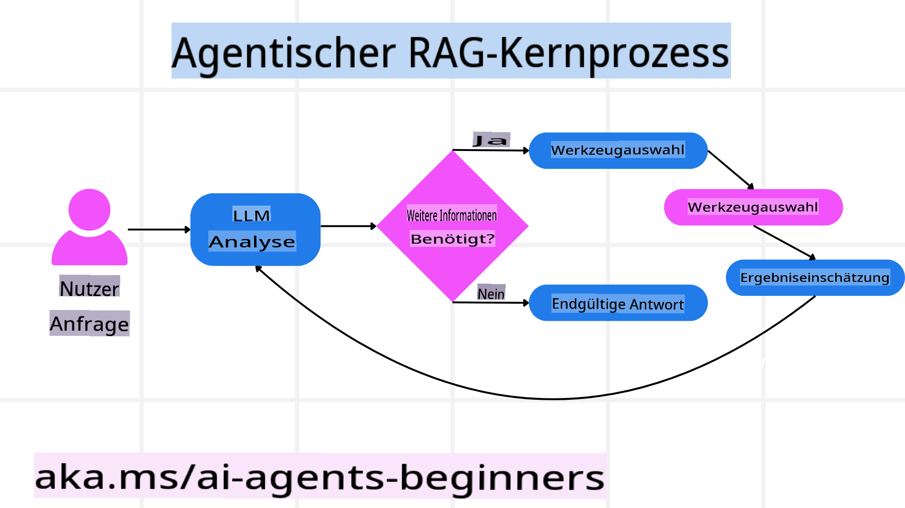
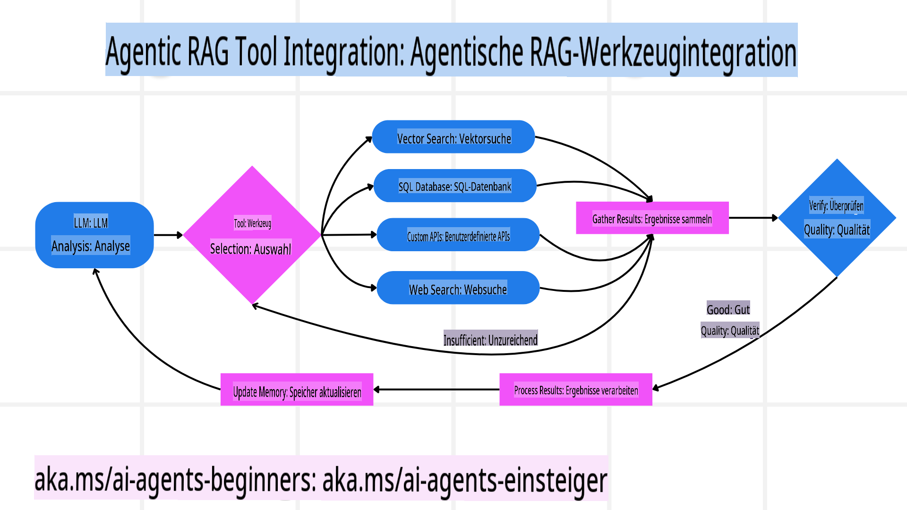
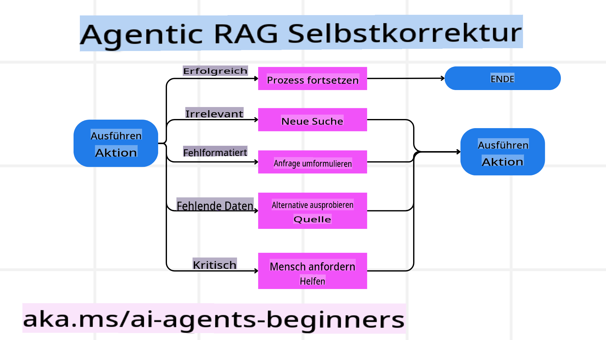
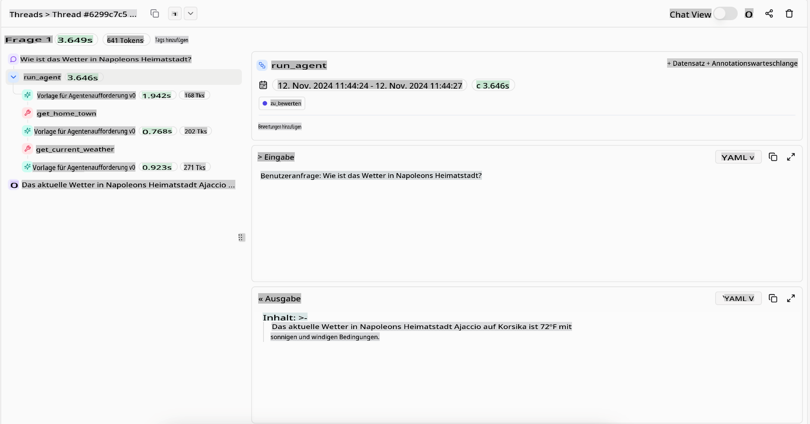
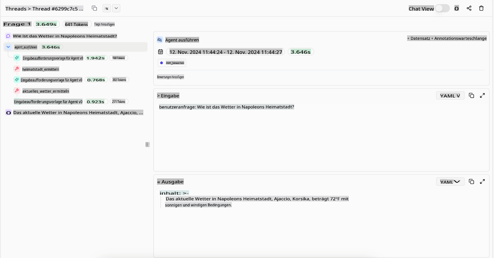

<!--
CO_OP_TRANSLATOR_METADATA:
{
  "original_hash": "4d215d159f2f3b96644fd62657988d23",
  "translation_date": "2025-03-28T10:26:03+00:00",
  "source_file": "05-agentic-rag\\README.md",
  "language_code": "de"
}
-->

> _(Klicken Sie auf das Bild oben, um das Video zu dieser Lektion anzusehen)_

# Agentic RAG

Diese Lektion bietet einen umfassenden Überblick über Agentic Retrieval-Augmented Generation (Agentic RAG), ein aufkommendes KI-Paradigma, bei dem große Sprachmodelle (LLMs) eigenständig ihre nächsten Schritte planen und dabei Informationen aus externen Quellen abrufen. Im Gegensatz zu statischen Mustern wie „Abrufen und Lesen“ umfasst Agentic RAG iterative Aufrufe an das LLM, unterbrochen von Werkzeug- oder Funktionsaufrufen und strukturierten Ausgaben. Das System bewertet die Ergebnisse, verfeinert Abfragen, ruft bei Bedarf zusätzliche Werkzeuge auf und setzt diesen Zyklus fort, bis eine zufriedenstellende Lösung erreicht ist.

## Einführung

Diese Lektion behandelt:

- **Agentic RAG verstehen:** Lernen Sie das aufkommende Paradigma in der KI kennen, bei dem große Sprachmodelle (LLMs) eigenständig ihre nächsten Schritte planen und dabei Informationen aus externen Datenquellen abrufen.
- **Iterativer Maker-Checker-Stil:** Verstehen Sie die Schleife aus iterativen Aufrufen an das LLM, unterbrochen von Werkzeug- oder Funktionsaufrufen und strukturierten Ausgaben, die darauf abzielt, Korrektheit zu verbessern und fehlerhafte Abfragen zu bewältigen.
- **Praktische Anwendungen erkunden:** Identifizieren Sie Szenarien, in denen Agentic RAG besonders glänzt, wie z. B. in korrektheitsorientierten Umgebungen, komplexen Datenbankinteraktionen und erweiterten Workflows.

## Lernziele

Nach Abschluss dieser Lektion werden Sie wissen/verstehen:

- **Agentic RAG verstehen:** Lernen Sie das aufkommende Paradigma in der KI kennen, bei dem große Sprachmodelle (LLMs) eigenständig ihre nächsten Schritte planen und dabei Informationen aus externen Datenquellen abrufen.
- **Iterativer Maker-Checker-Stil:** Verstehen Sie das Konzept einer Schleife aus iterativen Aufrufen an das LLM, unterbrochen von Werkzeug- oder Funktionsaufrufen und strukturierten Ausgaben, die darauf abzielt, Korrektheit zu verbessern und fehlerhafte Abfragen zu bewältigen.
- **Den Denkprozess übernehmen:** Verstehen Sie die Fähigkeit des Systems, seinen Denkprozess eigenständig zu steuern, Entscheidungen darüber zu treffen, wie Probleme angegangen werden sollen, ohne auf vorgegebene Pfade angewiesen zu sein.
- **Workflow:** Verstehen Sie, wie ein agentisches Modell eigenständig Markttrendberichte abruft, Wettbewerberdaten identifiziert, interne Verkaufsmetriken korreliert, Erkenntnisse synthetisiert und die Strategie bewertet.
- **Iterative Schleifen, Werkzeugintegration und Speicher:** Lernen Sie die Abhängigkeit des Systems von einem Interaktionsmuster mit Schleifen kennen, das den Zustand und Speicher über die Schritte hinweg beibehält, um wiederholte Schleifen zu vermeiden und fundierte Entscheidungen zu treffen.
- **Fehlerbewältigung und Selbstkorrektur:** Erkunden Sie die robusten Selbstkorrekturmechanismen des Systems, einschließlich Iterationen und erneuter Abfragen, der Nutzung diagnostischer Werkzeuge und des Rückgriffs auf menschliche Aufsicht.
- **Grenzen der Eigenständigkeit:** Verstehen Sie die Einschränkungen von Agentic RAG, mit Fokus auf domänenspezifische Autonomie, Infrastrukturabhängigkeit und die Einhaltung von Sicherheitsvorkehrungen.
- **Praktische Anwendungsfälle und Wert:** Identifizieren Sie Szenarien, in denen Agentic RAG besonders glänzt, wie z. B. in korrektheitsorientierten Umgebungen, komplexen Datenbankinteraktionen und erweiterten Workflows.
- **Governance, Transparenz und Vertrauen:** Lernen Sie die Bedeutung von Governance und Transparenz kennen, einschließlich nachvollziehbarer Argumentation, Kontrolle von Verzerrungen und menschlicher Aufsicht.

## Was ist Agentic RAG?

Agentic Retrieval-Augmented Generation (Agentic RAG) ist ein aufkommendes KI-Paradigma, bei dem große Sprachmodelle (LLMs) eigenständig ihre nächsten Schritte planen und dabei Informationen aus externen Quellen abrufen. Im Gegensatz zu statischen Mustern wie „Abrufen und Lesen“ umfasst Agentic RAG iterative Aufrufe an das LLM, unterbrochen von Werkzeug- oder Funktionsaufrufen und strukturierten Ausgaben. Das System bewertet die Ergebnisse, verfeinert Abfragen, ruft bei Bedarf zusätzliche Werkzeuge auf und setzt diesen Zyklus fort, bis eine zufriedenstellende Lösung erreicht ist. Dieser iterative „Maker-Checker“-Stil verbessert die Korrektheit, bewältigt fehlerhafte Abfragen und sorgt für qualitativ hochwertige Ergebnisse.

Das System übernimmt aktiv seinen Denkprozess, schreibt fehlgeschlagene Abfragen neu, wählt unterschiedliche Abrufmethoden und integriert mehrere Werkzeuge—wie etwa Vektorsuche in Azure AI Search, SQL-Datenbanken oder benutzerdefinierte APIs—bevor es seine Antwort finalisiert. Die herausragende Eigenschaft eines agentischen Systems ist seine Fähigkeit, seinen Denkprozess eigenständig zu steuern. Traditionelle RAG-Implementierungen verlassen sich auf vorgegebene Pfade, aber ein agentisches System bestimmt die Abfolge der Schritte basierend auf der Qualität der gefundenen Informationen eigenständig.

## Definition von Agentic Retrieval-Augmented Generation (Agentic RAG)

Agentic Retrieval-Augmented Generation (Agentic RAG) ist ein aufkommendes Paradigma in der KI-Entwicklung, bei dem LLMs nicht nur Informationen aus externen Datenquellen abrufen, sondern auch eigenständig ihre nächsten Schritte planen. Im Gegensatz zu statischen Mustern wie „Abrufen und Lesen“ oder sorgfältig geskripteten Prompt-Sequenzen umfasst Agentic RAG eine Schleife aus iterativen Aufrufen an das LLM, unterbrochen von Werkzeug- oder Funktionsaufrufen und strukturierten Ausgaben. Bei jedem Schritt bewertet das System die erzielten Ergebnisse, entscheidet, ob Abfragen verfeinert werden müssen, ruft bei Bedarf zusätzliche Werkzeuge auf und setzt diesen Zyklus fort, bis eine zufriedenstellende Lösung erreicht ist.

Dieser iterative „Maker-Checker“-Arbeitsstil ist darauf ausgelegt, die Korrektheit zu verbessern, fehlerhafte Abfragen an strukturierte Datenbanken (z. B. NL2SQL) zu bewältigen und ausgewogene, qualitativ hochwertige Ergebnisse zu gewährleisten. Anstatt sich ausschließlich auf sorgfältig gestaltete Prompt-Ketten zu verlassen, übernimmt das System aktiv seinen Denkprozess. Es kann fehlgeschlagene Abfragen neu schreiben, unterschiedliche Abrufmethoden wählen und mehrere Werkzeuge integrieren—wie etwa Vektorsuche in Azure AI Search, SQL-Datenbanken oder benutzerdefinierte APIs—bevor es seine Antwort finalisiert. Dies macht komplexe Orchestrierungsframeworks überflüssig. Stattdessen kann eine relativ einfache Schleife aus „LLM-Aufruf → Werkzeugnutzung → LLM-Aufruf → …“ zu anspruchsvollen und fundierten Ausgaben führen.

## Den Denkprozess übernehmen

Die herausragende Eigenschaft, die ein System „agentisch“ macht, ist seine Fähigkeit, seinen Denkprozess eigenständig zu steuern. Traditionelle RAG-Implementierungen hängen oft davon ab, dass Menschen einen Pfad für das Modell vorgeben: eine Gedankenkette, die festlegt, was wann abgerufen werden soll.  
Wenn ein System jedoch wirklich agentisch ist, entscheidet es intern, wie es das Problem angehen soll. Es führt nicht einfach ein Skript aus, sondern bestimmt eigenständig die Abfolge der Schritte basierend auf der Qualität der gefundenen Informationen.  
Beispielsweise, wenn es aufgefordert wird, eine Produktstartstrategie zu entwickeln, verlässt es sich nicht nur auf einen Prompt, der den gesamten Forschungs- und Entscheidungsprozess vorgibt. Stattdessen entscheidet das agentische Modell eigenständig:

1. Aktuelle Markttrendberichte mit Bing Web Grounding abrufen.  
2. Relevante Wettbewerberdaten mit Azure AI Search identifizieren.  
3. Historische interne Verkaufsmetriken mit Azure SQL Database korrelieren.  
4. Die Erkenntnisse zu einer kohärenten Strategie zusammenfassen, orchestriert über Azure OpenAI Service.  
5. Die Strategie auf Lücken oder Inkonsistenzen überprüfen und gegebenenfalls eine weitere Runde von Abrufen einleiten.  

Alle diese Schritte—Abfragen verfeinern, Quellen auswählen, iterieren, bis die Antwort „zufriedenstellend“ ist—werden vom Modell entschieden und nicht von einem Menschen vorgegeben.

## Iterative Schleifen, Werkzeugintegration und Speicher

Ein agentisches System basiert auf einem Interaktionsmuster mit Schleifen:

- **Erster Aufruf:** Das Ziel des Benutzers (aka. Benutzer-Prompt) wird dem LLM präsentiert.  
- **Werkzeugaufruf:** Wenn das Modell fehlende Informationen oder unklare Anweisungen erkennt, wählt es ein Werkzeug oder eine Abrufmethode—wie eine Vektordatenbankabfrage (z. B. Azure AI Search Hybrid-Suche über private Daten) oder einen strukturierten SQL-Aufruf—um mehr Kontext zu sammeln.  
- **Bewertung & Verfeinerung:** Nach der Überprüfung der zurückgegebenen Daten entscheidet das Modell, ob die Informationen ausreichen. Falls nicht, verfeinert es die Abfrage, probiert ein anderes Werkzeug aus oder passt seinen Ansatz an.  
- **Wiederholen bis zufrieden:** Dieser Zyklus wird fortgesetzt, bis das Modell feststellt, dass es ausreichend Klarheit und Belege hat, um eine fundierte, abschließende Antwort zu liefern.  
- **Speicher & Zustand:** Da das System Zustand und Speicher über die Schritte hinweg beibehält, kann es sich an frühere Versuche und deren Ergebnisse erinnern, repetitive Schleifen vermeiden und fundiertere Entscheidungen treffen, während es fortschreitet.  

Mit der Zeit entsteht dadurch ein Gefühl von wachsendem Verständnis, das dem Modell ermöglicht, komplexe Aufgaben mit mehreren Schritten zu bewältigen, ohne dass ein Mensch ständig eingreifen oder den Prompt umgestalten muss.

## Fehlerbewältigung und Selbstkorrektur

Die Autonomie von Agentic RAG umfasst auch robuste Selbstkorrekturmechanismen. Wenn das System auf Sackgassen stößt—wie das Abrufen irrelevanter Dokumente oder das Auftreten fehlerhafter Abfragen—kann es:

- **Iterieren und erneut abfragen:** Anstatt minderwertige Antworten zurückzugeben, versucht das Modell neue Suchstrategien, schreibt Datenbankabfragen neu oder betrachtet alternative Datensätze.  
- **Diagnosetools nutzen:** Das System kann zusätzliche Funktionen aufrufen, die ihm helfen, seine Denkschritte zu debuggen oder die Korrektheit der abgerufenen Daten zu bestätigen. Werkzeuge wie Azure AI Tracing werden wichtig sein, um robuste Beobachtbarkeit und Überwachung zu ermöglichen.  
- **Auf menschliche Aufsicht zurückgreifen:** Für Szenarien mit hohem Risiko oder wiederholtem Scheitern könnte das Modell Unsicherheit kennzeichnen und menschliche Anleitung anfordern. Sobald der Mensch korrektives Feedback gibt, kann das Modell diese Lektion in Zukunft einbeziehen.  

Dieser iterative und dynamische Ansatz ermöglicht es dem Modell, sich kontinuierlich zu verbessern, sodass es nicht nur ein „Ein-Schuss-System“ ist, sondern eines, das aus seinen Fehlern während einer Sitzung lernt.

## Grenzen der Eigenständigkeit

Trotz seiner Autonomie innerhalb einer Aufgabe ist Agentic RAG nicht mit künstlicher allgemeiner Intelligenz vergleichbar. Seine „agentischen“ Fähigkeiten sind auf die von menschlichen Entwicklern bereitgestellten Werkzeuge, Datenquellen und Richtlinien beschränkt. Es kann keine eigenen Werkzeuge erfinden oder über die festgelegten Domänengrenzen hinausgehen. Stattdessen zeichnet es sich durch die dynamische Orchestrierung der verfügbaren Ressourcen aus.  
Wichtige Unterschiede zu fortgeschritteneren KI-Formen sind:

1. **Domänenspezifische Autonomie:** Agentic RAG-Systeme konzentrieren sich darauf, vom Benutzer definierte Ziele innerhalb einer bekannten Domäne zu erreichen, und nutzen Strategien wie Abfrage-Neuschreibung oder Werkzeugauswahl, um Ergebnisse zu verbessern.  
2. **Infrastrukturabhängigkeit:** Die Fähigkeiten des Systems hängen von den von Entwicklern integrierten Werkzeugen und Daten ab. Es kann diese Grenzen nicht ohne menschliches Eingreifen überschreiten.  
3. **Einhaltung von Sicherheitsvorkehrungen:** Ethische Richtlinien, Compliance-Regeln und Geschäftspolitiken bleiben sehr wichtig. Die Freiheit des Agenten ist immer durch Sicherheitsmaßnahmen und Aufsichtsmechanismen eingeschränkt (hoffentlich?).  

## Praktische Anwendungsfälle und Wert

Agentic RAG glänzt in Szenarien, die iterative Verfeinerung und Präzision erfordern:

1. **Korrektheitsorientierte Umgebungen:** Bei Compliance-Prüfungen, regulatorischen Analysen oder juristischen Recherchen kann das agentische Modell Fakten wiederholt überprüfen, mehrere Quellen konsultieren und Abfragen neu schreiben, bis eine gründlich geprüfte Antwort vorliegt.  
2. **Komplexe Datenbankinteraktionen:** Bei der Arbeit mit strukturierten Daten, bei denen Abfragen häufig fehlschlagen oder angepasst werden müssen, kann das System eigenständig seine Abfragen verfeinern, z. B. mit Azure SQL oder Microsoft Fabric OneLake, um sicherzustellen, dass der endgültige Abruf den Absichten des Benutzers entspricht.  
3. **Erweiterte Workflows:** Länger laufende Sitzungen könnten sich entwickeln, wenn neue Informationen auftauchen. Agentic RAG kann kontinuierlich neue Daten einbeziehen und Strategien anpassen, während es mehr über den Problemraum lernt.  

## Governance, Transparenz und Vertrauen

Da diese Systeme in ihrem Denkprozess zunehmend autonom werden, sind Governance und Transparenz entscheidend:

- **Nachvollziehbare Argumentation:** Das Modell kann eine Prüfspur der Abfragen, der konsultierten Quellen und der Denkschritte bereitstellen, die zu seinem Ergebnis geführt haben. Werkzeuge wie Azure AI Content Safety und Azure AI Tracing / GenAIOps können helfen, Transparenz zu gewährleisten und Risiken zu minimieren.  
- **Bias-Kontrolle und ausgewogener Abruf:** Entwickler können Abrufstrategien abstimmen, um sicherzustellen, dass ausgewogene, repräsentative Datenquellen berücksichtigt werden, und regelmäßig Ausgaben prüfen, um Verzerrungen oder unausgewogene Muster zu erkennen, z. B. mit benutzerdefinierten Modellen für fortgeschrittene Datenwissenschaftsorganisationen, die Azure Machine Learning verwenden.  
- **Menschliche Aufsicht und Compliance:** Für sensible Aufgaben bleibt menschliche Überprüfung unerlässlich. Agentic RAG ersetzt keine menschliche Entscheidungsfindung bei kritischen Entscheidungen—es ergänzt sie, indem es gründlich geprüfte Optionen liefert.  

Werkzeuge, die eine klare Aufzeichnung der Aktionen bieten, sind entscheidend. Ohne sie kann das Debuggen eines mehrstufigen Prozesses sehr schwierig sein. Siehe das folgende Beispiel von Literal AI (Unternehmen hinter Chainlit) für einen Agent-Lauf:

## Fazit

Agentic RAG stellt eine natürliche Weiterentwicklung dar, wie KI-Systeme komplexe, datenintensive Aufgaben bewältigen. Durch die Einführung eines Interaktionsmusters mit Schleifen, die eigenständige Auswahl von Werkzeugen und die Verfeinerung von Abfragen bis zum Erreichen eines qualitativ hochwertigen Ergebnisses bewegt sich das System über statisches Befolgen von Prompts hinaus hin zu einem adaptiven, kontextbewussten Entscheidungsträger. Obwohl es weiterhin durch menschlich definierte Infrastrukturen und ethische Richtlinien begrenzt ist, ermöglichen diese agentischen Fähigkeiten reichhaltigere, dynamischere und letztlich nützlichere KI-Interaktionen für Unternehmen und Endbenutzer.

## Zusätzliche Ressourcen

- <a href="https://learn.microsoft.com/training/modules/use-own-data-azure-openai" target="_blank">Implementierung von Retrieval-Augmented Generation (RAG) mit Azure OpenAI Service: Erfahren Sie, wie Sie Ihre eigenen Daten mit dem Azure OpenAI Service nutzen können. Dieses Microsoft Learn-Modul bietet eine umfassende Anleitung zur Implementierung von RAG</a>  
- <a href="https://learn.microsoft.com/azure/ai-studio/concepts/evaluation-approach-gen-ai" target="_blank">Bewertung von generativen KI-Anwendungen mit Azure AI Foundry: Dieser Artikel behandelt die Bewertung und den Vergleich von Modellen auf öffentlich verfügbaren Datensätzen, einschließlich agentischer KI-Anwendungen und RAG-Architekturen</a>  
- <a href="https://weaviate.io/blog/what-is-agentic-rag" target="_blank">Was ist Agentic RAG | Weaviate</a>  
- <a href="https://ragaboutit.com/agentic-rag-a-complete-guide-to-agent-based-retrieval-augmented-generation/" target="_blank">Agentic RAG: Ein vollständiger Leitfaden zu agentenbasierter Retrieval-Augmented Generation – Neuigkeiten aus der Generation RAG</a>  
- <a href="https://huggingface.co/learn/cookbook/agent_rag" target="_blank">Agentic RAG: Turbocharge your RAG with query reformulation and self-query! Hugging Face Open-Source AI Cookbook</a>  
- <a href="https://youtu.be/aQ4yQXeB1Ss?si=2HUqBzHoeB5tR04U" target="_blank">Hinzufügen agentischer Ebenen zu RAG</a>  
- <a href="https://www.youtube.com/watch?v=zeAyuLc_f3Q&t=244s" target="_blank">Die Zukunft von Wissensassistenten: Jerry Liu</a>  
- <a href="https://www.youtube.com/watch?v=AOSjiXP1jmQ" target="_blank">Wie man agentische RAG-Systeme aufbaut</a>  
- <a href="https://ignite.microsoft.com/sessions/BRK102?source=sessions" target="_blank">Verwendung des Azure AI Foundry Agent Service zur Skalierung Ihrer KI-Agenten</a>  

### Wissenschaftliche Arbeiten

- <a href="https://arxiv.org/abs/2303.17651" target="_blank">2303.17651 Self-Refine: Iterative Refinement with Self-Feedback</a>  
- <a href="https://arxiv.org/abs/2303.11366" target="_blank">2303.11366 Reflexion: Language Agents with Verbal Reinforcement Learning</a>  
- <a href="https://arxiv.org/abs/2305.11738" target="_blank">2305.11738 CRITIC: Large Language Models Can Self-Correct

**Haftungsausschluss**:  
Dieses Dokument wurde mit dem KI-Übersetzungsdienst [Co-op Translator](https://github.com/Azure/co-op-translator) übersetzt. Obwohl wir uns um Genauigkeit bemühen, beachten Sie bitte, dass automatisierte Übersetzungen Fehler oder Ungenauigkeiten enthalten können. Das Originaldokument in seiner ursprünglichen Sprache sollte als maßgebliche Quelle betrachtet werden. Für kritische Informationen wird eine professionelle menschliche Übersetzung empfohlen. Wir übernehmen keine Haftung für Missverständnisse oder Fehlinterpretationen, die aus der Nutzung dieser Übersetzung entstehen.