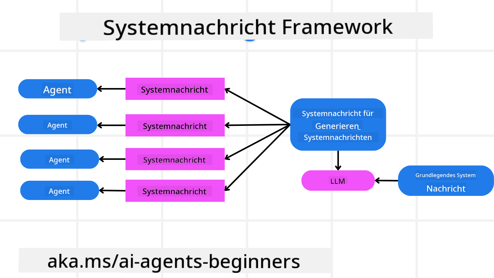
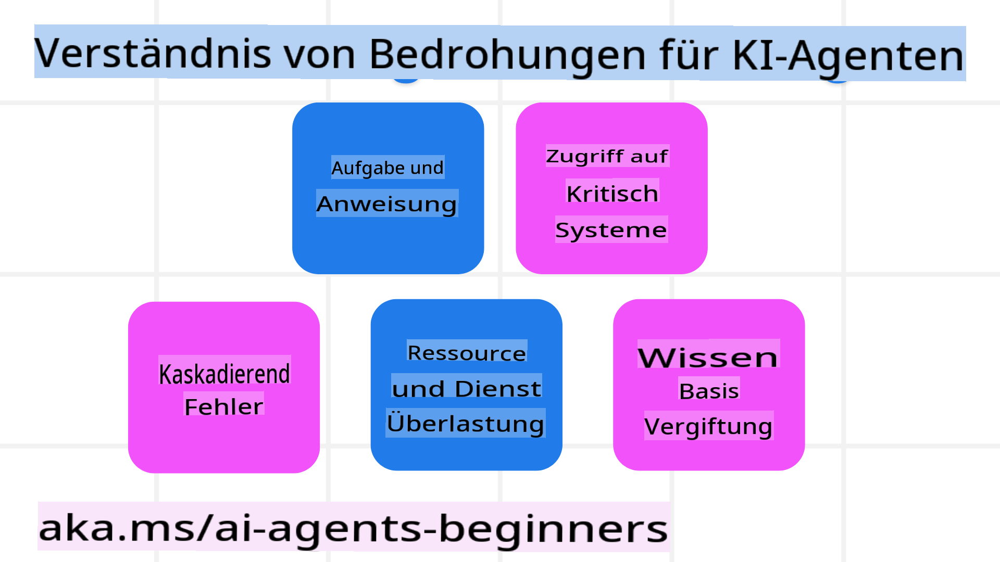
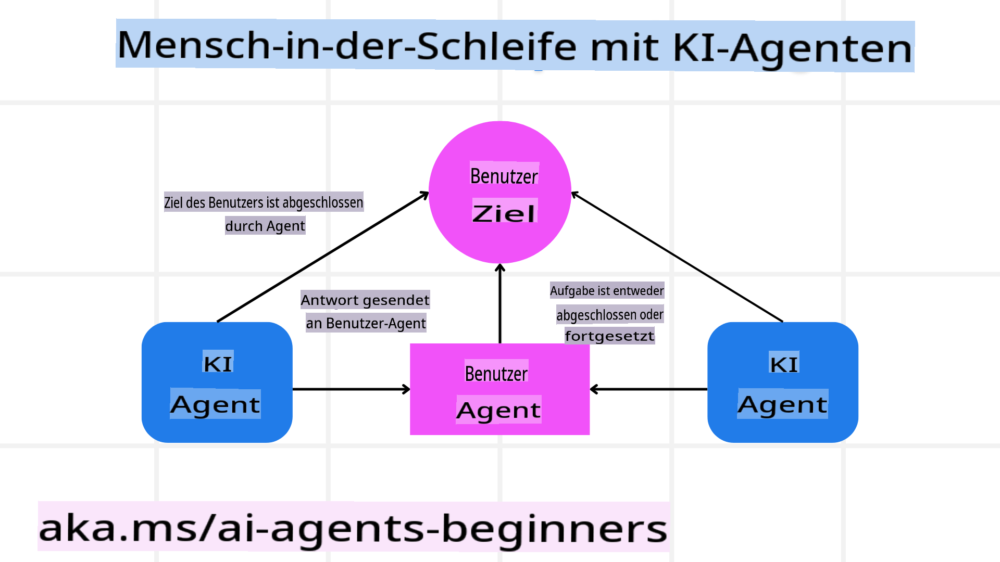

<!--
CO_OP_TRANSLATOR_METADATA:
{
  "original_hash": "c069d7ff0feca3027f88819355866ca1",
  "translation_date": "2025-03-28T10:28:49+00:00",
  "source_file": "06-building-trustworthy-agents\\README.md",
  "language_code": "de"
}
-->
[](https://youtu.be/iZKkMEGBCUQ?si=Q-kEbcyHUMPoHp8L)

> _(Klicken Sie auf das Bild oben, um das Video zu dieser Lektion anzusehen)_

# Aufbau vertrauenswürdiger KI-Agenten

## Einführung

Diese Lektion behandelt:

- Wie man sichere und effektive KI-Agenten erstellt und bereitstellt
- Wichtige Sicherheitsaspekte bei der Entwicklung von KI-Agenten
- Wie man Datenschutz und Privatsphäre bei der Entwicklung von KI-Agenten gewährleistet

## Lernziele

Nach Abschluss dieser Lektion wissen Sie:

- Wie Sie Risiken bei der Erstellung von KI-Agenten erkennen und mindern.
- Wie Sie Sicherheitsmaßnahmen implementieren, um sicherzustellen, dass Daten und Zugänge ordnungsgemäß verwaltet werden.
- Wie Sie KI-Agenten erstellen, die Datenschutz gewährleisten und eine qualitativ hochwertige Benutzererfahrung bieten.

## Sicherheit

Lassen Sie uns zunächst betrachten, wie sichere agentenbasierte Anwendungen entwickelt werden können. Sicherheit bedeutet, dass der KI-Agent wie vorgesehen funktioniert. Als Entwickler von agentenbasierten Anwendungen stehen uns Methoden und Tools zur Verfügung, um die Sicherheit zu maximieren:

### Aufbau eines Systemnachrichten-Frameworks

Wenn Sie jemals eine KI-Anwendung mit großen Sprachmodellen (LLMs) erstellt haben, wissen Sie, wie wichtig es ist, einen robusten System-Prompt oder eine Systemnachricht zu entwerfen. Diese Prompts legen die Meta-Regeln, Anweisungen und Richtlinien fest, wie das LLM mit Benutzern und Daten interagieren soll.

Für KI-Agenten ist der System-Prompt noch wichtiger, da die Agenten äußerst spezifische Anweisungen benötigen, um die Aufgaben zu erfüllen, die wir für sie entworfen haben.

Um skalierbare System-Prompts zu erstellen, können wir ein Systemnachrichten-Framework verwenden, um einen oder mehrere Agenten in unserer Anwendung zu entwickeln:



#### Schritt 1: Erstellen einer Meta-Systemnachricht

Die Meta-Nachricht wird von einem LLM verwendet, um die Systemnachrichten für die Agenten zu generieren, die wir erstellen. Wir entwerfen sie als Vorlage, um effizient mehrere Agenten erstellen zu können, falls erforderlich.

Hier ist ein Beispiel für eine Meta-Systemnachricht, die wir dem LLM geben würden:

```plaintext
You are an expert at creating AI agent assistants. 
You will be provided a company name, role, responsibilities and other
information that you will use to provide a system prompt for.
To create the system prompt, be descriptive as possible and provide a structure that a system using an LLM can better understand the role and responsibilities of the AI assistant. 
```

#### Schritt 2: Erstellen eines Basis-Prompts

Der nächste Schritt ist die Erstellung eines Basis-Prompts, um den KI-Agenten zu beschreiben. Sie sollten die Rolle des Agenten, die Aufgaben, die der Agent erledigen soll, und alle anderen Verantwortlichkeiten des Agenten einbeziehen.

Hier ist ein Beispiel:

```plaintext
You are a travel agent for Contoso Travel that is great at booking flights for customers. To help customers you can perform the following tasks: lookup available flights, book flights, ask for preferences in seating and times for flights, cancel any previously booked flights and alert customers on any delays or cancellations of flights.  
```

#### Schritt 3: Bereitstellen der Basis-Systemnachricht für das LLM

Nun können wir diese Systemnachricht optimieren, indem wir die Meta-Systemnachricht als Systemnachricht und unsere Basis-Systemnachricht verwenden.

Dies erzeugt eine Systemnachricht, die besser darauf ausgelegt ist, unsere KI-Agenten zu leiten:

```markdown
**Company Name:** Contoso Travel  
**Role:** Travel Agent Assistant

**Objective:**  
You are an AI-powered travel agent assistant for Contoso Travel, specializing in booking flights and providing exceptional customer service. Your main goal is to assist customers in finding, booking, and managing their flights, all while ensuring that their preferences and needs are met efficiently.

**Key Responsibilities:**

1. **Flight Lookup:**
    
    - Assist customers in searching for available flights based on their specified destination, dates, and any other relevant preferences.
    - Provide a list of options, including flight times, airlines, layovers, and pricing.
2. **Flight Booking:**
    
    - Facilitate the booking of flights for customers, ensuring that all details are correctly entered into the system.
    - Confirm bookings and provide customers with their itinerary, including confirmation numbers and any other pertinent information.
3. **Customer Preference Inquiry:**
    
    - Actively ask customers for their preferences regarding seating (e.g., aisle, window, extra legroom) and preferred times for flights (e.g., morning, afternoon, evening).
    - Record these preferences for future reference and tailor suggestions accordingly.
4. **Flight Cancellation:**
    
    - Assist customers in canceling previously booked flights if needed, following company policies and procedures.
    - Notify customers of any necessary refunds or additional steps that may be required for cancellations.
5. **Flight Monitoring:**
    
    - Monitor the status of booked flights and alert customers in real-time about any delays, cancellations, or changes to their flight schedule.
    - Provide updates through preferred communication channels (e.g., email, SMS) as needed.

**Tone and Style:**

- Maintain a friendly, professional, and approachable demeanor in all interactions with customers.
- Ensure that all communication is clear, informative, and tailored to the customer's specific needs and inquiries.

**User Interaction Instructions:**

- Respond to customer queries promptly and accurately.
- Use a conversational style while ensuring professionalism.
- Prioritize customer satisfaction by being attentive, empathetic, and proactive in all assistance provided.

**Additional Notes:**

- Stay updated on any changes to airline policies, travel restrictions, and other relevant information that could impact flight bookings and customer experience.
- Use clear and concise language to explain options and processes, avoiding jargon where possible for better customer understanding.

This AI assistant is designed to streamline the flight booking process for customers of Contoso Travel, ensuring that all their travel needs are met efficiently and effectively.

```

#### Schritt 4: Iterieren und verbessern

Der Wert dieses Systemnachrichten-Frameworks liegt darin, die Erstellung von Systemnachrichten für mehrere Agenten einfacher zu gestalten und Ihre Systemnachrichten im Laufe der Zeit zu verbessern. Es ist selten, dass eine Systemnachricht beim ersten Mal für den gesamten Anwendungsfall funktioniert. Kleine Anpassungen und Verbesserungen durch Änderungen an der Basis-Systemnachricht und die erneute Verarbeitung durch das System ermöglichen den Vergleich und die Bewertung von Ergebnissen.

## Bedrohungen verstehen

Um vertrauenswürdige KI-Agenten zu erstellen, ist es wichtig, die Risiken und Bedrohungen für Ihren KI-Agenten zu verstehen und zu mindern. Lassen Sie uns einige der verschiedenen Bedrohungen für KI-Agenten betrachten und wie Sie besser planen und sich darauf vorbereiten können.



### Aufgaben und Anweisungen

**Beschreibung:** Angreifer versuchen, die Anweisungen oder Ziele des KI-Agenten durch Eingabeaufforderungen oder Manipulationen zu ändern.

**Minderung**: Validierungsprüfungen und Eingabefilter ausführen, um potenziell gefährliche Eingaben zu erkennen, bevor sie vom KI-Agenten verarbeitet werden. Da diese Angriffe normalerweise häufige Interaktionen mit dem Agenten erfordern, kann das Begrenzen der Anzahl von Gesprächsrunden eine weitere Möglichkeit sein, diese Art von Angriffen zu verhindern.

### Zugriff auf kritische Systeme

**Beschreibung**: Wenn ein KI-Agent Zugriff auf Systeme und Dienste hat, die sensible Daten speichern, können Angreifer die Kommunikation zwischen dem Agenten und diesen Diensten kompromittieren. Dies können direkte Angriffe oder indirekte Versuche sein, Informationen über diese Systeme durch den Agenten zu gewinnen.

**Minderung**: KI-Agenten sollten nur bei Bedarf Zugriff auf Systeme haben, um diese Art von Angriffen zu verhindern. Die Kommunikation zwischen dem Agenten und dem System sollte ebenfalls sicher sein. Die Implementierung von Authentifizierung und Zugriffskontrolle ist eine weitere Möglichkeit, diese Informationen zu schützen.

### Überlastung von Ressourcen und Diensten

**Beschreibung:** KI-Agenten können auf verschiedene Tools und Dienste zugreifen, um Aufgaben zu erledigen. Angreifer können diese Fähigkeit nutzen, um diese Dienste anzugreifen, indem sie eine hohe Anzahl von Anfragen über den KI-Agenten senden, was zu Systemausfällen oder hohen Kosten führen kann.

**Minderung:** Richtlinien implementieren, um die Anzahl der Anfragen, die ein KI-Agent an einen Dienst senden kann, zu begrenzen. Das Begrenzen der Anzahl von Gesprächsrunden und Anfragen an Ihren KI-Agenten ist eine weitere Möglichkeit, diese Art von Angriffen zu verhindern.

### Vergiftung der Wissensbasis

**Beschreibung:** Diese Art von Angriff zielt nicht direkt auf den KI-Agenten ab, sondern auf die Wissensbasis und andere Dienste, die der KI-Agent nutzen wird. Dies könnte die Daten oder Informationen verfälschen, die der KI-Agent zur Erfüllung einer Aufgabe verwenden wird, was zu voreingenommenen oder unbeabsichtigten Antworten für den Benutzer führen kann.

**Minderung:** Regelmäßige Überprüfung der Daten, die der KI-Agent in seinen Arbeitsabläufen verwendet. Sicherstellen, dass der Zugriff auf diese Daten sicher ist und nur von vertrauenswürdigen Personen geändert wird, um diese Art von Angriff zu vermeiden.

### Kaskadierende Fehler

**Beschreibung:** KI-Agenten greifen auf verschiedene Tools und Dienste zu, um Aufgaben zu erledigen. Fehler, die durch Angreifer verursacht werden, können zu Ausfällen anderer Systeme führen, mit denen der KI-Agent verbunden ist, wodurch der Angriff weiter verbreitet und schwerer zu beheben wird.

**Minderung**: Eine Möglichkeit, dies zu vermeiden, besteht darin, den KI-Agenten in einer begrenzten Umgebung, wie z. B. in einem Docker-Container, arbeiten zu lassen, um direkte Systemangriffe zu verhindern. Das Erstellen von Fallback-Mechanismen und Wiederholungslogik, wenn bestimmte Systeme mit einem Fehler antworten, ist eine weitere Möglichkeit, größere Systemausfälle zu verhindern.

## Menschliche Interaktion (Human-in-the-Loop)

Eine weitere effektive Möglichkeit, vertrauenswürdige KI-Agentensysteme zu erstellen, ist die Verwendung eines Human-in-the-Loop-Ansatzes. Dies schafft einen Ablauf, bei dem Benutzer während des Prozesses Feedback an die Agenten geben können. Benutzer fungieren im Wesentlichen als Agenten in einem Multi-Agenten-System und können den laufenden Prozess genehmigen oder abbrechen.



Hier ist ein Code-Snippet, das AutoGen verwendet, um zu zeigen, wie dieses Konzept implementiert wird:

```python

# Create the agents.
model_client = OpenAIChatCompletionClient(model="gpt-4o-mini")
assistant = AssistantAgent("assistant", model_client=model_client)
user_proxy = UserProxyAgent("user_proxy", input_func=input)  # Use input() to get user input from console.

# Create the termination condition which will end the conversation when the user says "APPROVE".
termination = TextMentionTermination("APPROVE")

# Create the team.
team = RoundRobinGroupChat([assistant, user_proxy], termination_condition=termination)

# Run the conversation and stream to the console.
stream = team.run_stream(task="Write a 4-line poem about the ocean.")
# Use asyncio.run(...) when running in a script.
await Console(stream)

```

## Fazit

Der Aufbau vertrauenswürdiger KI-Agenten erfordert sorgfältiges Design, robuste Sicherheitsmaßnahmen und kontinuierliche Iteration. Durch die Implementierung strukturierter Meta-Prompt-Systeme, das Verständnis potenzieller Bedrohungen und die Anwendung von Minderungstechniken können Entwickler KI-Agenten erstellen, die sowohl sicher als auch effektiv sind. Zusätzlich stellt die Integration eines Human-in-the-Loop-Ansatzes sicher, dass KI-Agenten den Benutzeranforderungen entsprechen und Risiken minimiert werden. Während sich die KI weiterentwickelt, wird ein proaktiver Ansatz in Bezug auf Sicherheit, Datenschutz und ethische Überlegungen entscheidend sein, um Vertrauen und Zuverlässigkeit in KI-gesteuerten Systemen zu fördern.

## Zusätzliche Ressourcen

- <a href="https://learn.microsoft.com/azure/ai-studio/responsible-use-of-ai-overview" target="_blank">Verantwortungsvolle KI Übersicht</a>
- <a href="https://learn.microsoft.com/azure/ai-studio/concepts/evaluation-approach-gen-ai" target="_blank">Bewertung generativer KI-Modelle und Anwendungen</a>
- <a href="https://learn.microsoft.com/azure/ai-services/openai/concepts/system-message?context=%2Fazure%2Fai-studio%2Fcontext%2Fcontext&tabs=top-techniques" target="_blank">Sicherheits-Systemnachrichten</a>
- <a href="https://blogs.microsoft.com/wp-content/uploads/prod/sites/5/2022/06/Microsoft-RAI-Impact-Assessment-Template.pdf?culture=en-us&country=us" target="_blank">Risiko-Bewertungs-Template</a>

## Vorherige Lektion

[Agentic RAG](../05-agentic-rag/README.md)

## Nächste Lektion

[Planungs-Designmuster](../07-planning-design/README.md)

**Haftungsausschluss**:  
Dieses Dokument wurde mit dem KI-Übersetzungsdienst [Co-op Translator](https://github.com/Azure/co-op-translator) übersetzt. Obwohl wir uns um Genauigkeit bemühen, beachten Sie bitte, dass automatisierte Übersetzungen Fehler oder Ungenauigkeiten enthalten können. Das Originaldokument in seiner ursprünglichen Sprache sollte als maßgebliche Quelle betrachtet werden. Für kritische Informationen wird eine professionelle menschliche Übersetzung empfohlen. Wir übernehmen keine Haftung für Missverständnisse oder Fehlinterpretationen, die aus der Nutzung dieser Übersetzung entstehen.