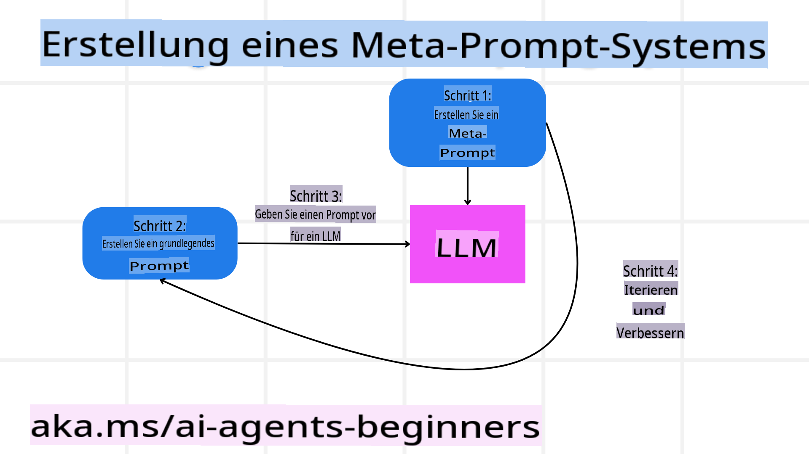

```markdown
# Vertrauenswürdige KI-Agenten entwickeln

## Einführung

In dieser Lektion werden folgende Themen behandelt:

- Wie man sichere und effektive KI-Agenten erstellt und bereitstellt.
- Wichtige Sicherheitsaspekte bei der Entwicklung von KI-Agenten.
- Wie man Datenschutz und Privatsphäre der Nutzer bei der Entwicklung von KI-Agenten sicherstellt.

## Lernziele

Nach Abschluss dieser Lektion wirst du in der Lage sein:

- Risiken bei der Erstellung von KI-Agenten zu erkennen und zu mindern.
- Sicherheitsmaßnahmen zu implementieren, um sicherzustellen, dass Daten und Zugriffe ordnungsgemäß verwaltet werden.
- KI-Agenten zu erstellen, die den Datenschutz wahren und eine qualitativ hochwertige Nutzererfahrung bieten.

## Sicherheit

Beginnen wir mit dem Aufbau sicherer agentenbasierter Anwendungen. Sicherheit bedeutet, dass der KI-Agent wie vorgesehen funktioniert. Als Entwickler von agentenbasierten Anwendungen haben wir Methoden und Werkzeuge, um die Sicherheit zu maximieren:

### Aufbau eines Meta-Prompting-Systems

Wenn du jemals eine KI-Anwendung mit großen Sprachmodellen (LLMs) entwickelt hast, weißt du, wie wichtig es ist, ein robustes System-Prompt oder eine Systemnachricht zu entwerfen. Diese Prompts legen die Meta-Regeln, Anweisungen und Richtlinien fest, wie das LLM mit dem Nutzer und den Daten interagieren soll.

Für KI-Agenten ist das System-Prompt noch wichtiger, da die KI-Agenten hochspezifische Anweisungen benötigen, um die Aufgaben zu erfüllen, die wir für sie entworfen haben.

Um skalierbare System-Prompts zu erstellen, können wir ein Meta-Prompting-System verwenden, um einen oder mehrere Agenten in unserer Anwendung zu erstellen:



#### Schritt 1: Erstelle ein Meta- oder Template-Prompt

Das Meta-Prompt wird von einem LLM verwendet, um die System-Prompts für die Agenten zu generieren, die wir erstellen. Wir entwerfen es als Vorlage, damit wir bei Bedarf effizient mehrere Agenten erstellen können.

Hier ist ein Beispiel für ein Meta-Prompt, das wir dem LLM geben würden:

```plaintext
You are an expert at creating AI agent assitants. 
You will be provided a company name, role, responsibilites and other
information that you will use to provide a system prompt for.
To create the system prompt, be descriptive as possible and provide a structure that a system using an LLM can better understand the role and responsibilites of the AI assistant. 
```

#### Schritt 2: Erstelle ein Basis-Prompt

Der nächste Schritt besteht darin, ein Basis-Prompt zu erstellen, das den KI-Agenten beschreibt. Du solltest die Rolle des Agenten, die Aufgaben, die er erledigen soll, und andere Verantwortlichkeiten des Agenten einbeziehen.

Hier ist ein Beispiel:

```plaintext
You are a travel agent for Contoso Travel with that is great at booking flights for customers. To help customers you can perform the following tasks: lookup available flights, book flights, ask for preferences in seating and times for flights, cancel any previously booked flights and alert customers on any delays or cancellations of flights.  
```

#### Schritt 3: Basis-Prompt dem LLM bereitstellen

Nun können wir dieses Prompt optimieren, indem wir das Meta-Prompt als System-Prompt und unser Basis-Prompt verwenden.

Das Ergebnis ist ein besser gestaltetes Prompt, das unsere KI-Agenten besser leitet:

```markdown
**Company Name:** Contoso Travel  
**Role:** Travel Agent Assistant

**Objective:**  
You are an AI-powered travel agent assistant for Contoso Travel, specializing in booking flights and providing exceptional customer service. Your main goal is to assist customers in finding, booking, and managing their flights, all while ensuring that their preferences and needs are met efficiently.

**Key Responsibilities:**

1. **Flight Lookup:**
    
    - Assist customers in searching for available flights based on their specified destination, dates, and any other relevant preferences.
    - Provide a list of options, including flight times, airlines, layovers, and pricing.
2. **Flight Booking:**
    
    - Facilitate the booking of flights for customers, ensuring that all details are correctly entered into the system.
    - Confirm bookings and provide customers with their itinerary, including confirmation numbers and any other pertinent information.
3. **Customer Preference Inquiry:**
    
    - Actively ask customers for their preferences regarding seating (e.g., aisle, window, extra legroom) and preferred times for flights (e.g., morning, afternoon, evening).
    - Record these preferences for future reference and tailor suggestions accordingly.
4. **Flight Cancellation:**
    
    - Assist customers in canceling previously booked flights if needed, following company policies and procedures.
    - Notify customers of any necessary refunds or additional steps that may be required for cancellations.
5. **Flight Monitoring:**
    
    - Monitor the status of booked flights and alert customers in real-time about any delays, cancellations, or changes to their flight schedule.
    - Provide updates through preferred communication channels (e.g., email, SMS) as needed.

**Tone and Style:**

- Maintain a friendly, professional, and approachable demeanor in all interactions with customers.
- Ensure that all communication is clear, informative, and tailored to the customer's specific needs and inquiries.

**User Interaction Instructions:**

- Respond to customer queries promptly and accurately.
- Use a conversational style while ensuring professionalism.
- Prioritize customer satisfaction by being attentive, empathetic, and proactive in all assistance provided.

**Additional Notes:**

- Stay updated on any changes to airline policies, travel restrictions, and other relevant information that could impact flight bookings and customer experience.
- Use clear and concise language to explain options and processes, avoiding jargon where possible for better customer understanding.

This AI assistant is designed to streamline the flight booking process for customers of Contoso Travel, ensuring that all their travel needs are met efficiently and effectively.

```

#### Schritt 4: Iterieren und Verbessern

Der Wert dieses Meta-Prompting-Systems liegt darin, die Erstellung von Prompts für mehrere Agenten zu vereinfachen und die Prompts im Laufe der Zeit zu verbessern. Es ist selten, dass ein Prompt beim ersten Mal für den gesamten Anwendungsfall funktioniert. Kleine Anpassungen und Verbesserungen vorzunehmen, indem man das Basis-Prompt ändert und es durch das System laufen lässt, ermöglicht es, Ergebnisse zu vergleichen und zu bewerten.

## Bedrohungen verstehen  

Um vertrauenswürdige KI-Agenten zu entwickeln, ist es wichtig, die Risiken und Bedrohungen für deinen KI-Agenten zu verstehen und zu mindern. Schauen wir uns einige der verschiedenen Bedrohungen für KI-Agenten an und wie du besser planen und dich darauf vorbereiten kannst.


### Aufgaben und Anweisungen

**Beschreibung:** Angreifer versuchen, die Anweisungen oder Ziele des KI-Agenten durch Eingaben oder Manipulationen zu ändern.

**Abwehrmaßnahmen**: Führe Validierungsprüfungen und Eingabefilter durch, um potenziell gefährliche Prompts zu erkennen, bevor sie vom KI-Agenten verarbeitet werden. Da diese Angriffe in der Regel häufige Interaktionen mit dem Agenten erfordern, ist die Begrenzung der Anzahl der Gesprächsrunden eine weitere Möglichkeit, diese Angriffe zu verhindern.

### Zugriff auf kritische Systeme

**Beschreibung**: Wenn ein KI-Agent Zugriff auf Systeme und Dienste hat, die sensible Daten speichern, können Angreifer die Kommunikation zwischen dem Agenten und diesen Diensten kompromittieren. Dies können direkte Angriffe oder indirekte Versuche sein, Informationen über diese Systeme durch den Agenten zu erlangen.

**Abwehrmaßnahmen**: KI-Agenten sollten nur bei Bedarf Zugriff auf Systeme haben, um solche Angriffe zu verhindern. Die Kommunikation zwischen Agent und System sollte ebenfalls sicher sein. Die Implementierung von Authentifizierung und Zugriffskontrollen ist eine weitere Möglichkeit, diese Informationen zu schützen.

### Überlastung von Ressourcen und Diensten

**Beschreibung:** KI-Agenten können auf verschiedene Tools und Dienste zugreifen, um Aufgaben zu erledigen. Angreifer können diese Fähigkeit nutzen, um diese Dienste durch eine hohe Anzahl von Anfragen über den KI-Agenten anzugreifen, was zu Systemausfällen oder hohen Kosten führen kann.

**Abwehrmaßnahmen:** Implementiere Richtlinien, um die Anzahl der Anfragen, die ein KI-Agent an einen Dienst senden kann, zu begrenzen. Die Begrenzung der Anzahl der Gesprächsrunden und Anfragen an deinen KI-Agenten ist eine weitere Möglichkeit, solche Angriffe zu verhindern.

### Manipulation der Wissensbasis

**Beschreibung:** Dieser Angriff zielt nicht direkt auf den KI-Agenten ab, sondern auf die Wissensbasis und andere Dienste, die der KI-Agent nutzen wird. Dies könnte die Korruption von Daten oder Informationen beinhalten, die der KI-Agent zur Erfüllung einer Aufgabe verwendet, was zu voreingenommenen oder unbeabsichtigten Antworten für den Nutzer führen kann.

**Abwehrmaßnahmen:** Führe regelmäßige Überprüfungen der Daten durch, die der KI-Agent in seinen Arbeitsabläufen verwenden wird. Stelle sicher, dass der Zugriff auf diese Daten sicher ist und nur von vertrauenswürdigen Personen geändert werden kann, um solche Angriffe zu vermeiden.

### Kaskadierende Fehler

**Beschreibung:** KI-Agenten greifen auf verschiedene Tools und Dienste zu, um Aufgaben zu erledigen. Fehler, die durch Angreifer verursacht werden, können zu Ausfällen anderer Systeme führen, mit denen der KI-Agent verbunden ist, wodurch der Angriff weiter verbreitet und schwerer zu beheben wird.

**Abwehrmaßnahmen**: Eine Möglichkeit, dies zu vermeiden, besteht darin, den KI-Agenten in einer begrenzten Umgebung wie einem Docker-Container auszuführen, um direkte Systemangriffe zu verhindern. Das Erstellen von Fallback-Mechanismen und Wiederholungslogik, wenn bestimmte Systeme mit einem Fehler reagieren, ist eine weitere Möglichkeit, größere Systemausfälle zu verhindern.

## Mensch in der Schleife (Human-in-the-Loop)

Eine weitere effektive Methode, um vertrauenswürdige KI-Agentensysteme zu entwickeln, ist die Nutzung eines Human-in-the-Loop-Ansatzes. Dies schafft einen Ablauf, bei dem Nutzer während der Ausführung Feedback an die Agenten geben können. Nutzer agieren im Wesentlichen als Agent in einem Multi-Agenten-System und können den laufenden Prozess genehmigen oder abbrechen.


Hier ist ein Code-Snippet, das AutoGen verwendet, um zu zeigen, wie dieses Konzept implementiert wird:

```python

# Create the agents.
model_client = OpenAIChatCompletionClient(model="gpt-4o-mini")
assistant = AssistantAgent("assistant", model_client=model_client)
user_proxy = UserProxyAgent("user_proxy", input_func=input)  # Use input() to get user input from console.

# Create the termination condition which will end the conversation when the user says "APPROVE".
termination = TextMentionTermination("APPROVE")

# Create the team.
team = RoundRobinGroupChat([assistant, user_proxy], termination_condition=termination)

# Run the conversation and stream to the console.
stream = team.run_stream(task="Write a 4-line poem about the ocean.")
# Use asyncio.run(...) when running in a script.
await Console(stream)

```
```

**Haftungsausschluss**:  
Dieses Dokument wurde mit KI-gestützten maschinellen Übersetzungsdiensten übersetzt. Obwohl wir uns um Genauigkeit bemühen, weisen wir darauf hin, dass automatisierte Übersetzungen Fehler oder Ungenauigkeiten enthalten können. Das Originaldokument in seiner ursprünglichen Sprache sollte als maßgebliche Quelle betrachtet werden. Für kritische Informationen wird eine professionelle menschliche Übersetzung empfohlen. Wir übernehmen keine Haftung für Missverständnisse oder Fehlinterpretationen, die aus der Nutzung dieser Übersetzung resultieren.