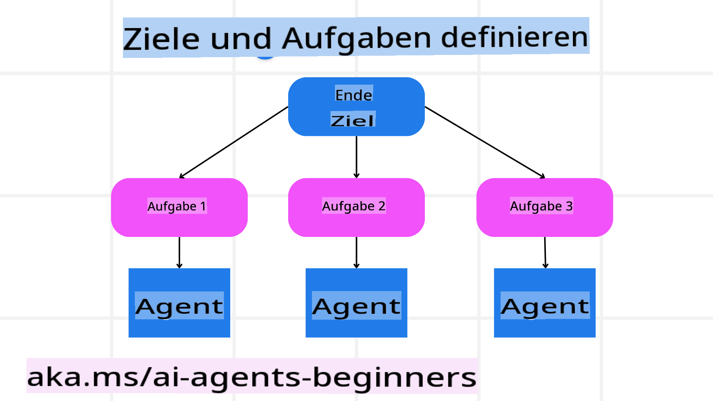

# Planungsdesign

## Einführung

In dieser Lektion behandeln wir:

* Wie man ein klares übergeordnetes Ziel definiert und eine komplexe Aufgabe in überschaubare Teilaufgaben aufteilt.
* Die Nutzung strukturierter Ausgaben für zuverlässigere und maschinenlesbare Antworten.
* Die Anwendung eines ereignisgesteuerten Ansatzes zur Bewältigung dynamischer Aufgaben und unerwarteter Eingaben.

## Lernziele

Nach Abschluss dieser Lektion wirst du verstehen:

* Wie man ein übergeordnetes Ziel für einen KI-Agenten definiert, sodass dieser genau weiß, was erreicht werden soll.
* Wie man eine komplexe Aufgabe in handhabbare Teilaufgaben zerlegt und diese in eine logische Reihenfolge bringt.
* Wie man Agenten mit den richtigen Werkzeugen (z. B. Suchtools oder Datenanalysetools) ausstattet, entscheidet, wann und wie diese verwendet werden, und unerwartete Situationen bewältigt.
* Wie man Ergebnisse von Teilaufgaben bewertet, die Leistung misst und Maßnahmen iteriert, um das Endergebnis zu verbessern.

## Das übergeordnete Ziel definieren und eine Aufgabe aufteilen



Die meisten Aufgaben in der realen Welt sind zu komplex, um sie in einem einzigen Schritt zu lösen. Ein KI-Agent benötigt ein prägnantes Ziel, um seine Planung und Aktionen zu leiten. Betrachten wir beispielsweise das Ziel:

    "Erstelle einen 3-tägigen Reiseplan."

Auch wenn es einfach formuliert ist, benötigt es dennoch Verfeinerung. Je klarer das Ziel definiert ist, desto besser können der Agent (und eventuelle menschliche Mitarbeiter) sich darauf konzentrieren, das richtige Ergebnis zu erzielen, z. B. einen umfassenden Reiseplan mit Flugoptionen, Hotelempfehlungen und Vorschlägen für Aktivitäten.

### Aufgabenzerlegung

Große oder komplexe Aufgaben werden überschaubarer, wenn sie in kleinere, zielorientierte Teilaufgaben aufgeteilt werden.  
Für das Beispiel des Reiseplans könnte man das Ziel wie folgt zerlegen:

* Flugbuchung
* Hotelbuchung
* Mietwagen
* Personalisierung

Jede Teilaufgabe kann dann von spezialisierten Agenten oder Prozessen bearbeitet werden. Ein Agent könnte sich beispielsweise auf die Suche nach den besten Flugangeboten spezialisieren, ein anderer auf Hotelbuchungen usw. Ein koordinierender oder „nachgelagerter“ Agent kann diese Ergebnisse dann zu einem zusammenhängenden Reiseplan für den Endnutzer zusammenfügen.

Dieser modulare Ansatz ermöglicht auch schrittweise Verbesserungen. Zum Beispiel könnte man spezialisierte Agenten für Restaurantempfehlungen oder lokale Aktivitätsvorschläge hinzufügen und den Reiseplan im Laufe der Zeit weiter verfeinern.

### Strukturierte Ausgabe

Große Sprachmodelle (LLMs) können strukturierte Ausgaben (z. B. JSON) generieren, die von nachgelagerten Agenten oder Diensten leichter analysiert und verarbeitet werden können. Dies ist besonders nützlich in einem Multi-Agenten-Kontext, in dem Aufgaben nach der Planungsausgabe bearbeitet werden. Sieh dir diesen [Blogpost](https://microsoft.github.io/autogen/stable/user-guide/core-user-guide/cookbook/structured-output-agent.html) für einen kurzen Überblick an.

Im Folgenden ein Beispiel eines Python-Snippets, das zeigt, wie ein einfacher Planungsagent ein Ziel in Teilaufgaben zerlegt und einen strukturierten Plan erstellt:

### Planungsagent mit Multi-Agenten-Orchestrierung

In diesem Beispiel erhält ein Semantic Router Agent eine Benutzeranfrage (z. B. "Ich brauche einen Hotelplan für meine Reise.").

Der Planer:

* Erhält den Hotelplan: Der Planer nimmt die Nachricht des Benutzers entgegen und erstellt basierend auf einem System-Prompt (einschließlich Details zu verfügbaren Agenten) einen strukturierten Reiseplan.
* Listet Agenten und deren Werkzeuge auf: Das Agentenregister enthält eine Liste von Agenten (z. B. für Flug, Hotel, Mietwagen und Aktivitäten) zusammen mit den Funktionen oder Tools, die sie anbieten.
* Leitet den Plan an die entsprechenden Agenten weiter: Abhängig von der Anzahl der Teilaufgaben sendet der Planer die Nachricht entweder direkt an einen spezialisierten Agenten (für Einzelaufgabenszenarien) oder koordiniert über einen Gruppenchat-Manager für die Zusammenarbeit mehrerer Agenten.
* Fasst das Ergebnis zusammen: Schließlich fasst der Planer den erstellten Plan zur besseren Übersicht zusammen.

Im Folgenden ein Python-Codebeispiel, das diese Schritte illustriert:

```python

from pydantic import BaseModel

from enum import Enum
from typing import List, Optional, Union

class AgentEnum(str, Enum):
    FlightBooking = "flight_booking"
    HotelBooking = "hotel_booking"
    CarRental = "car_rental"
    ActivitiesBooking = "activities_booking"
    DestinationInfo = "destination_info"
    DefaultAgent = "default_agent"
    GroupChatManager = "group_chat_manager"

# Travel SubTask Model

class TravelSubTask(BaseModel):
    task_details: str
    assigned_agent: AgentEnum # we want to assign the task to the agent

class TravelPlan(BaseModel):
    main_task: str
    subtasks: List[TravelSubTask]
    is_greeting: bool
import json
import os
from typing import Optional

from autogen_core.models import UserMessage, SystemMessage, AssistantMessage
from autogen_ext.models.openai import AzureOpenAIChatCompletionClient

# Create the client with type-checked environment variables

client = AzureOpenAIChatCompletionClient(
    azure_deployment=os.getenv("AZURE_OPENAI_DEPLOYMENT_NAME"),
    model=os.getenv("AZURE_OPENAI_DEPLOYMENT_NAME"),
    api_version=os.getenv("AZURE_OPENAI_API_VERSION"),
    azure_endpoint=os.getenv("AZURE_OPENAI_ENDPOINT"),
    api_key=os.getenv("AZURE_OPENAI_API_KEY"),
)

from pprint import pprint

# Define the user message

messages = [
    SystemMessage(content="""You are an planner agent.
    Your job is to decide which agents to run based on the user's request.
    Below are the available agents specialised in different tasks:
    - FlightBooking: For booking flights and providing flight information
    - HotelBooking: For booking hotels and providing hotel information
    - CarRental: For booking cars and providing car rental information
    - ActivitiesBooking: For booking activities and providing activity information
    - DestinationInfo: For providing information about destinations
    - DefaultAgent: For handling general requests""", source="system"),
    UserMessage(content="Create a travel plan for a family of 2 kids from Singapore to Melbourne", source="user"),
]

response = await client.create(messages=messages, extra_create_args={"response_format": TravelPlan})

# Ensure the response content is a valid JSON string before loading it

response_content: Optional[str] = response.content if isinstance(response.content, str) else None
if response_content is None:
    raise ValueError("Response content is not a valid JSON string")

# Print the response content after loading it as JSON

pprint(json.loads(response_content))
```

Im Anschluss daran zeigt die Ausgabe des obigen Codes, wie diese strukturierte Ausgabe an `assigned_agent` weitergeleitet und der Reiseplan für den Endnutzer zusammengefasst werden kann:

```json
{
    "is_greeting": "False",
    "main_task": "Plan a family trip from Singapore to Melbourne.",
    "subtasks": [
        {
            "assigned_agent": "flight_booking",
            "task_details": "Book round-trip flights from Singapore to Melbourne."
        },
        {
            "assigned_agent": "hotel_booking",
            "task_details": "Find family-friendly hotels in Melbourne."
        },
        {
            "assigned_agent": "car_rental",
            "task_details": "Arrange a car rental suitable for a family of four in Melbourne."
        },
        {
            "assigned_agent": "activities_booking",
            "task_details": "List family-friendly activities in Melbourne."
        },
        {
            "assigned_agent": "destination_info",
            "task_details": "Provide information about Melbourne as a travel destination."
        }
    ]
}
```

Ein Beispiel-Notebook mit dem obigen Codebeispiel ist [hier](../../../07-planning-design/code_samples/07-autogen.ipynb) verfügbar.

### Iterative Planung

Einige Aufgaben erfordern einen iterativen Prozess oder eine Neuplanung, bei dem das Ergebnis einer Teilaufgabe die nächste beeinflusst. Beispielsweise könnte der Agent, wenn er beim Buchen von Flügen ein unerwartetes Datenformat entdeckt, seine Strategie anpassen müssen, bevor er mit der Hotelbuchung fortfährt.

Auch Benutzerfeedback (z. B. wenn ein Mensch entscheidet, dass er einen früheren Flug bevorzugt) kann eine teilweise Neuplanung auslösen. Dieser dynamische, iterative Ansatz stellt sicher, dass die endgültige Lösung mit den realen Einschränkungen und den sich ändernden Benutzerpräferenzen übereinstimmt.

Beispiel-Code:

    ```python
    from autogen_core.models import UserMessage, SystemMessage, AssistantMessage
    #.. same as previous code and pass on the user history, current plan 
    messages = [
        SystemMessage(content="""You are a planner agent to optimize the 
        Your job is to decide which agents to run based on the user's request.
        Below are the available agents specialised in different tasks:
        - FlightBooking: For booking flights and providing flight information
        - HotelBooking: For booking hotels and providing hotel information
        - CarRental: For booking cars and providing car rental information
        - ActivitiesBooking: For booking activities and providing activity information
        - DestinationInfo: For providing information about destinations
        - DefaultAgent: For handling general requests""", source="system"),
        UserMessage(content="Create a travel plan for a family of 2 kids from Singapore to Melboune", source="user"),
        AssistantMessage(content=f"Previous travel plan - {TravelPlan}", source="assistant")
    ]
    # .. re-plan and send the tasks to respective agents
    ```

Für eine umfassendere Planung lies dir den Magnetic One [Blogpost](https://www.microsoft.com/research/articles/magentic-one-a-generalist-multi-agent-system-for-solving-complex-tasks) durch, der die Lösung komplexer Aufgaben beschreibt.

## Zusammenfassung

In diesem Artikel haben wir ein Beispiel dafür betrachtet, wie man einen Planer erstellen kann, der dynamisch die verfügbaren definierten Agenten auswählt. Die Ausgabe des Planers zerlegt die Aufgaben und weist sie den Agenten zu, damit sie ausgeführt werden können. Es wird davon ausgegangen, dass die Agenten Zugriff auf die Funktionen/Tools haben, die für die Ausführung der Aufgabe erforderlich sind. Zusätzlich zu den Agenten kannst du andere Muster wie Reflexion, Zusammenfassung oder Round-Robin-Chat einbinden, um die Lösung weiter anzupassen.

## Zusätzliche Ressourcen

* Der Einsatz von o1-Reasoning-Modellen hat sich bei der Planung komplexer Aufgaben als äußerst fortschrittlich erwiesen – TODO: Beispiel teilen?

* Autogen Magnetic One – Ein generalistisches Multi-Agenten-System zur Lösung komplexer Aufgaben, das beeindruckende Ergebnisse bei mehreren anspruchsvollen agentischen Benchmarks erzielt hat. Referenz: [autogen-magentic-one](https://github.com/microsoft/autogen/tree/main/python/packages/autogen-magentic-one). In dieser Implementierung erstellt der Orchestrator einen aufgabenspezifischen Plan und delegiert diese Aufgaben an die verfügbaren Agenten. Neben der Planung verwendet der Orchestrator auch einen Mechanismus zur Fortschrittsüberwachung und passt den Plan bei Bedarf an.

**Haftungsausschluss**:  
Dieses Dokument wurde mit KI-gestützten maschinellen Übersetzungsdiensten übersetzt. Obwohl wir uns um Genauigkeit bemühen, weisen wir darauf hin, dass automatisierte Übersetzungen Fehler oder Ungenauigkeiten enthalten können. Das Originaldokument in seiner ursprünglichen Sprache sollte als maßgebliche Quelle betrachtet werden. Für kritische Informationen wird eine professionelle menschliche Übersetzung empfohlen. Wir übernehmen keine Haftung für Missverständnisse oder Fehlinterpretationen, die aus der Nutzung dieser Übersetzung entstehen.