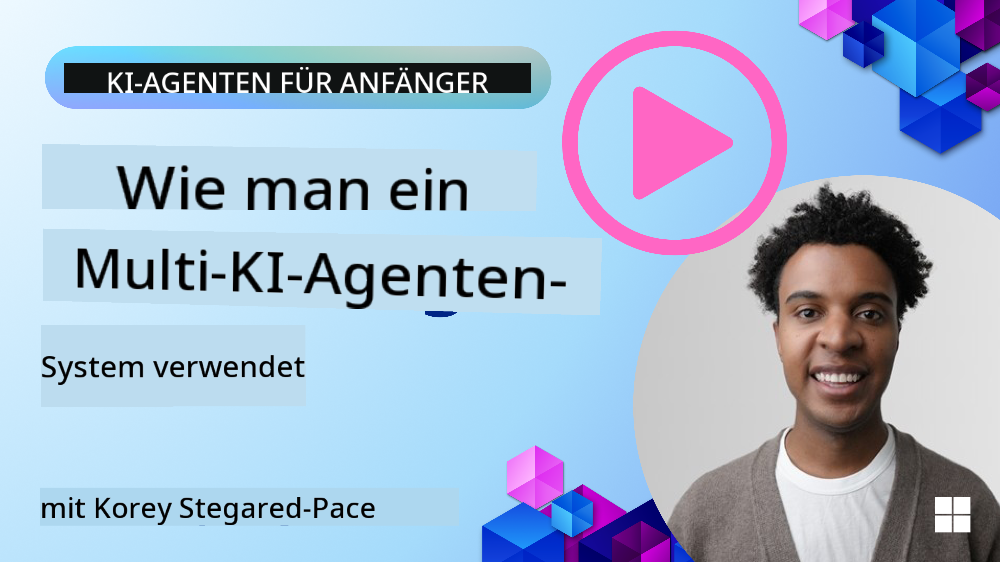
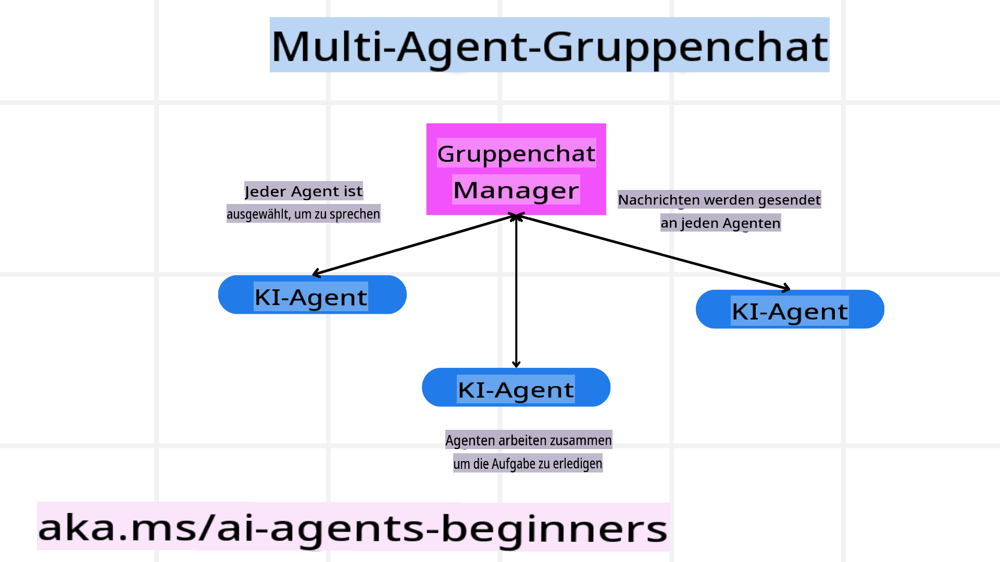
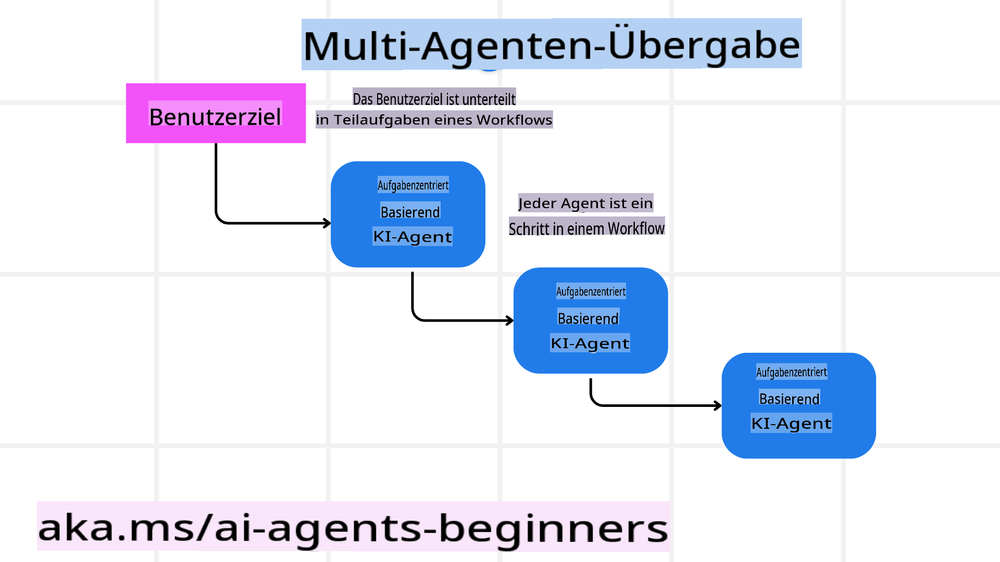
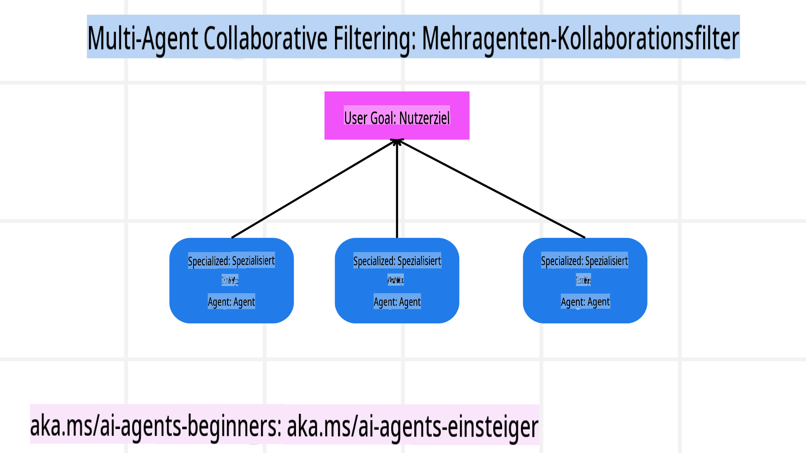

<!--
CO_OP_TRANSLATOR_METADATA:
{
  "original_hash": "bdb0a92e5a437d5fa985a6863f4a836c",
  "translation_date": "2025-03-28T10:34:04+00:00",
  "source_file": "08-multi-agent\\README.md",
  "language_code": "de"
}
-->

> _(Klicken Sie auf das obige Bild, um das Video zu dieser Lektion anzusehen)_

# Multi-Agent-Designmuster

Sobald Sie an einem Projekt arbeiten, das mehrere Agenten umfasst, müssen Sie das Multi-Agent-Designmuster in Betracht ziehen. Es ist jedoch möglicherweise nicht sofort klar, wann der Wechsel zu Multi-Agenten sinnvoll ist und welche Vorteile dies bietet.

## Einführung

In dieser Lektion möchten wir folgende Fragen beantworten:

- In welchen Szenarien sind Multi-Agenten anwendbar?
- Welche Vorteile bietet die Verwendung von Multi-Agenten im Vergleich zu einem einzelnen Agenten, der mehrere Aufgaben übernimmt?
- Was sind die Bausteine zur Implementierung des Multi-Agent-Designmusters?
- Wie erhält man Einblick in die Interaktionen zwischen mehreren Agenten?

## Lernziele

Nach dieser Lektion sollten Sie in der Lage sein:

- Szenarien zu identifizieren, in denen Multi-Agenten anwendbar sind.
- Die Vorteile der Verwendung von Multi-Agenten gegenüber einem einzelnen Agenten zu erkennen.
- Die Bausteine zur Implementierung des Multi-Agent-Designmusters zu verstehen.

Was ist das größere Bild?

*Multi-Agenten sind ein Designmuster, das es mehreren Agenten ermöglicht, zusammenzuarbeiten, um ein gemeinsames Ziel zu erreichen.*

Dieses Muster wird in verschiedenen Bereichen häufig eingesetzt, darunter Robotik, autonome Systeme und verteiltes Rechnen.

## Szenarien, in denen Multi-Agenten anwendbar sind

Welche Szenarien eignen sich also gut für den Einsatz von Multi-Agenten? Die Antwort lautet, dass es viele Szenarien gibt, in denen der Einsatz mehrerer Agenten von Vorteil ist, insbesondere in den folgenden Fällen:

- **Große Arbeitslasten**: Große Arbeitslasten können in kleinere Aufgaben aufgeteilt und verschiedenen Agenten zugewiesen werden, was parallele Verarbeitung und schnellere Fertigstellung ermöglicht. Ein Beispiel hierfür ist die Verarbeitung großer Datenmengen.
- **Komplexe Aufgaben**: Komplexe Aufgaben können, ähnlich wie große Arbeitslasten, in kleinere Teilaufgaben aufgeteilt und verschiedenen Agenten zugewiesen werden, die jeweils auf einen spezifischen Aspekt der Aufgabe spezialisiert sind. Ein gutes Beispiel hierfür sind autonome Fahrzeuge, bei denen verschiedene Agenten für Navigation, Hinderniserkennung und Kommunikation mit anderen Fahrzeugen zuständig sind.
- **Vielfältige Expertise**: Unterschiedliche Agenten können über unterschiedliche Fachkenntnisse verfügen, sodass sie verschiedene Aspekte einer Aufgabe effektiver bewältigen können als ein einzelner Agent. Ein gutes Beispiel hierfür ist das Gesundheitswesen, wo Agenten für Diagnosen, Behandlungspläne und Patientenüberwachung zuständig sein können.

## Vorteile der Verwendung von Multi-Agenten im Vergleich zu einem einzelnen Agenten

Ein System mit einem einzigen Agenten kann für einfache Aufgaben gut funktionieren, aber für komplexere Aufgaben bieten mehrere Agenten mehrere Vorteile:

- **Spezialisierung**: Jeder Agent kann auf eine bestimmte Aufgabe spezialisiert sein. Ein Mangel an Spezialisierung bei einem einzigen Agenten bedeutet, dass dieser zwar alles kann, aber bei komplexen Aufgaben möglicherweise verwirrt ist. Er könnte beispielsweise eine Aufgabe übernehmen, für die er nicht am besten geeignet ist.
- **Skalierbarkeit**: Es ist einfacher, Systeme durch Hinzufügen weiterer Agenten zu skalieren, als einen einzelnen Agenten zu überlasten.
- **Fehlertoleranz**: Wenn ein Agent ausfällt, können andere weiterhin funktionieren, was die Zuverlässigkeit des Systems gewährleistet.

Nehmen wir ein Beispiel: Wir buchen eine Reise für einen Benutzer. Ein System mit einem einzigen Agenten müsste alle Aspekte des Buchungsprozesses übernehmen, von der Suche nach Flügen bis zur Buchung von Hotels und Mietwagen. Um dies mit einem einzigen Agenten zu erreichen, müsste dieser über Werkzeuge verfügen, um all diese Aufgaben zu bewältigen. Dies könnte zu einem komplexen und monolithischen System führen, das schwer zu warten und zu skalieren ist. Ein Multi-Agent-System hingegen könnte verschiedene Agenten haben, die auf die Suche nach Flügen, die Buchung von Hotels und Mietwagen spezialisiert sind. Dies würde das System modularer, leichter wartbar und skalierbarer machen.

Vergleichen Sie dies mit einem Reisebüro, das als Familienbetrieb geführt wird, im Gegensatz zu einem Reisebüro, das als Franchise betrieben wird. Der Familienbetrieb hätte einen einzigen Agenten, der alle Aspekte des Buchungsprozesses übernimmt, während das Franchise verschiedene Agenten hätte, die unterschiedliche Aspekte des Buchungsprozesses übernehmen.

## Bausteine zur Implementierung des Multi-Agent-Designmusters

Bevor Sie das Multi-Agent-Designmuster implementieren können, müssen Sie die Bausteine verstehen, aus denen das Muster besteht.

Betrachten wir dies erneut anhand des Beispiels, eine Reise für einen Benutzer zu buchen. In diesem Fall umfassen die Bausteine:

- **Agentenkommunikation**: Agenten für die Suche nach Flügen, die Buchung von Hotels und Mietwagen müssen kommunizieren und Informationen über die Präferenzen und Einschränkungen des Benutzers austauschen. Sie müssen die Protokolle und Methoden für diese Kommunikation festlegen. Konkret bedeutet dies, dass der Agent für die Flugsuche mit dem Agenten für die Hotelbuchung kommunizieren muss, um sicherzustellen, dass das Hotel für dieselben Daten wie der Flug gebucht wird. Das bedeutet, dass die Agenten Informationen über die Reisedaten des Benutzers austauschen müssen, was bedeutet, dass Sie entscheiden müssen, *welche Agenten Informationen austauschen und wie sie dies tun*.
- **Koordinationsmechanismen**: Agenten müssen ihre Aktionen koordinieren, um sicherzustellen, dass die Präferenzen und Einschränkungen des Benutzers erfüllt werden. Eine Benutzerpräferenz könnte beispielsweise sein, dass sie ein Hotel in der Nähe des Flughafens wünschen, während eine Einschränkung sein könnte, dass Mietwagen nur am Flughafen verfügbar sind. Das bedeutet, dass der Agent für die Hotelbuchung mit dem Agenten für Mietwagenbuchungen koordinieren muss, um sicherzustellen, dass die Präferenzen und Einschränkungen des Benutzers erfüllt werden. Das bedeutet, dass Sie entscheiden müssen, *wie die Agenten ihre Aktionen koordinieren*.
- **Agentenarchitektur**: Agenten müssen über eine interne Struktur verfügen, um Entscheidungen zu treffen und aus ihren Interaktionen mit dem Benutzer zu lernen. Das bedeutet, dass der Agent für die Flugsuche eine interne Struktur haben muss, um Entscheidungen darüber zu treffen, welche Flüge dem Benutzer empfohlen werden. Das bedeutet, dass Sie entscheiden müssen, *wie die Agenten Entscheidungen treffen und aus ihren Interaktionen mit dem Benutzer lernen*. Beispiele dafür, wie ein Agent lernt und sich verbessert, könnten sein, dass der Agent für die Flugsuche ein maschinelles Lernmodell verwendet, um dem Benutzer basierend auf seinen bisherigen Präferenzen Flüge zu empfehlen.
- **Sichtbarkeit der Multi-Agent-Interaktionen**: Sie müssen Einblick in die Interaktionen zwischen den verschiedenen Agenten haben. Das bedeutet, dass Sie über Werkzeuge und Techniken zur Verfolgung der Aktivitäten und Interaktionen der Agenten verfügen müssen. Dies könnte in Form von Protokollierungs- und Überwachungstools, Visualisierungstools und Leistungsmetriken erfolgen.
- **Multi-Agent-Muster**: Es gibt verschiedene Muster zur Implementierung von Multi-Agent-Systemen, wie z. B. zentrale, dezentrale und hybride Architekturen. Sie müssen das Muster auswählen, das am besten zu Ihrem Anwendungsfall passt.
- **Mensch in der Schleife**: In den meisten Fällen wird ein Mensch in den Prozess eingebunden sein, und Sie müssen die Agenten anweisen, wann sie menschliche Eingriffe anfordern sollen. Dies könnte in Form eines Benutzers geschehen, der nach einem bestimmten Hotel oder Flug fragt, den die Agenten nicht empfohlen haben, oder der eine Bestätigung vor der Buchung eines Fluges oder Hotels wünscht.

## Sichtbarkeit der Multi-Agent-Interaktionen

Es ist wichtig, dass Sie Einblick in die Interaktionen zwischen den verschiedenen Agenten haben. Diese Sichtbarkeit ist entscheidend für Debugging, Optimierung und die Sicherstellung der Effektivität des Gesamtsystems. Um dies zu erreichen, müssen Sie über Werkzeuge und Techniken zur Verfolgung der Aktivitäten und Interaktionen der Agenten verfügen. Dies könnte in Form von Protokollierungs- und Überwachungstools, Visualisierungstools und Leistungsmetriken erfolgen.

Zum Beispiel könnten Sie im Fall der Buchung einer Reise für einen Benutzer ein Dashboard haben, das den Status jedes Agenten, die Präferenzen und Einschränkungen des Benutzers sowie die Interaktionen zwischen den Agenten anzeigt. Dieses Dashboard könnte die Reisedaten des Benutzers, die vom Flugagenten empfohlenen Flüge, die vom Hotelagenten empfohlenen Hotels und die vom Mietwagenagenten empfohlenen Mietwagen anzeigen. Dies würde Ihnen einen klaren Überblick darüber geben, wie die Agenten miteinander interagieren und ob die Präferenzen und Einschränkungen des Benutzers erfüllt werden.

Schauen wir uns jeden dieser Aspekte genauer an:

- **Protokollierungs- und Überwachungstools**: Sie möchten jede Aktion eines Agenten protokollieren. Ein Protokolleintrag könnte Informationen über den Agenten enthalten, der die Aktion ausgeführt hat, die ausgeführte Aktion, die Zeit der Aktion und das Ergebnis der Aktion. Diese Informationen können dann für Debugging, Optimierung und mehr verwendet werden.

- **Visualisierungstools**: Visualisierungstools können Ihnen helfen, die Interaktionen zwischen Agenten auf eine intuitivere Weise zu sehen. Beispielsweise könnten Sie ein Diagramm haben, das den Informationsfluss zwischen den Agenten zeigt. Dies könnte Ihnen helfen, Engpässe, Ineffizienzen und andere Probleme im System zu identifizieren.

- **Leistungsmetriken**: Leistungsmetriken können Ihnen helfen, die Effektivität des Multi-Agent-Systems zu verfolgen. Beispielsweise könnten Sie die Zeit messen, die benötigt wird, um eine Aufgabe abzuschließen, die Anzahl der pro Zeiteinheit abgeschlossenen Aufgaben und die Genauigkeit der von den Agenten gegebenen Empfehlungen. Diese Informationen können Ihnen helfen, Verbesserungsbereiche zu identifizieren und das System zu optimieren.

## Multi-Agent-Muster

Lassen Sie uns einige konkrete Muster betrachten, die wir zur Erstellung von Multi-Agent-Anwendungen verwenden können. Hier sind einige interessante Muster, die es wert sind, in Betracht gezogen zu werden:

### Gruppenchat

Dieses Muster ist nützlich, wenn Sie eine Gruppenchat-Anwendung erstellen möchten, in der mehrere Agenten miteinander kommunizieren können. Typische Anwendungsfälle für dieses Muster sind Teamzusammenarbeit, Kundensupport und soziale Netzwerke.

In diesem Muster repräsentiert jeder Agent einen Benutzer im Gruppenchat, und Nachrichten werden zwischen Agenten über ein Nachrichtenprotokoll ausgetauscht. Die Agenten können Nachrichten an den Gruppenchat senden, Nachrichten vom Gruppenchat empfangen und auf Nachrichten anderer Agenten antworten.

Dieses Muster kann mit einer zentralisierten Architektur implementiert werden, bei der alle Nachrichten über einen zentralen Server geleitet werden, oder mit einer dezentralen Architektur, bei der Nachrichten direkt ausgetauscht werden.

### Übergabe

Dieses Muster ist nützlich, wenn Sie eine Anwendung erstellen möchten, in der mehrere Agenten Aufgaben aneinander übergeben können.

Typische Anwendungsfälle für dieses Muster sind Kundensupport, Aufgabenmanagement und Workflow-Automatisierung.

In diesem Muster repräsentiert jeder Agent eine Aufgabe oder einen Schritt in einem Workflow, und Agenten können Aufgaben basierend auf vordefinierten Regeln an andere Agenten übergeben.

### Kollaborative Filterung

Dieses Muster ist nützlich, wenn Sie eine Anwendung erstellen möchten, in der mehrere Agenten zusammenarbeiten, um Empfehlungen für Benutzer zu geben.

Warum Sie möchten, dass mehrere Agenten zusammenarbeiten, liegt daran, dass jeder Agent über unterschiedliche Fachkenntnisse verfügen und auf unterschiedliche Weise zum Empfehlungsprozess beitragen kann.

Nehmen wir ein Beispiel, bei dem ein Benutzer eine Empfehlung für die beste Aktie auf dem Aktienmarkt möchte:

- **Branchenexperte**: Ein Agent könnte ein Experte in einer bestimmten Branche sein.
- **Technische Analyse**: Ein anderer Agent könnte ein Experte für technische Analysen sein.
- **Fundamentalanalyse**: Und ein weiterer Agent könnte ein Experte für Fundamentalanalysen sein. Durch Zusammenarbeit können diese Agenten dem Benutzer eine umfassendere Empfehlung geben.

## Szenario: Rückerstattungsprozess

Betrachten wir ein Szenario, in dem ein Kunde versucht, eine Rückerstattung für ein Produkt zu erhalten. Es könnten einige Agenten in diesem Prozess beteiligt sein, aber lassen Sie uns zwischen Agenten unterscheiden, die spezifisch für diesen Prozess sind, und allgemeinen Agenten, die auch in anderen Prozessen verwendet werden können.

**Agenten, die spezifisch für den Rückerstattungsprozess sind**:

Folgende Agenten könnten am Rückerstattungsprozess beteiligt sein:

- **Kundenagent**: Dieser Agent repräsentiert den Kunden und ist verantwortlich für die Einleitung des Rückerstattungsprozesses.
- **Verkäuferagent**: Dieser Agent repräsentiert den Verkäufer und ist verantwortlich für die Bearbeitung der Rückerstattung.
- **Zahlungsagent**: Dieser Agent repräsentiert den Zahlungsprozess und ist verantwortlich für die Rückerstattung der Zahlung an den Kunden.
- **Lösungsagent**: Dieser Agent repräsentiert den Lösungsprozess und ist verantwortlich für die Lösung von Problemen, die während des Rückerstattungsprozesses auftreten.
- **Compliance-Agent**: Dieser Agent repräsentiert den Compliance-Prozess und ist verantwortlich dafür, dass der Rückerstattungsprozess den Vorschriften und Richtlinien entspricht.

**Allgemeine Agenten**:

Diese Agenten können in anderen Teilen Ihres Unternehmens verwendet werden.

- **Versandagent**: Dieser Agent repräsentiert den Versandprozess und ist verantwortlich für den Rückversand des Produkts an den Verkäufer. Dieser Agent kann sowohl für den Rückerstattungsprozess als auch für den allgemeinen Versand eines Produkts verwendet werden, z. B. bei einem Kauf.
- **Feedback-Agent**: Dieser Agent repräsentiert den Feedback-Prozess und ist verantwortlich für das Sammeln von Feedback vom Kunden. Feedback kann jederzeit eingeholt werden, nicht nur während des Rückerstattungsprozesses.
- **Eskalationsagent**: Dieser Agent repräsentiert den Eskalationsprozess und ist verantwortlich für die Eskalation von Problemen auf eine höhere Support-Ebene. Sie können diesen Agententyp für jeden Prozess verwenden, bei dem Sie ein Problem eskalieren müssen.
- **Benachrichtigungsagent**: Dieser Agent repräsentiert den Benachrichtigungsprozess und ist verantwortlich für das Senden von Benachrichtigungen an den Kunden in verschiedenen Phasen des Rückerstattungsprozesses.
- **Analyseagent**: Dieser Agent repräsentiert den Analyseprozess und ist verantwortlich für die Analyse von Daten im Zusammenhang mit dem Rückerstattungsprozess.
- **Audit-Agent**: Dieser Agent repräsentiert den Audit-Prozess und ist verantwortlich für die Überprüfung des Rückerstattungsprozesses, um sicherzustellen, dass er korrekt durchgeführt wird.
- **Berichtsagent**: Dieser Agent repräsentiert den Berichtsprozess und ist verantwortlich für die Erstellung von Berichten über den Rückerstattungsprozess.
- **Wissensagent**: Dieser Agent repräsentiert den Wissensprozess und ist verantwortlich für die Pflege einer Wissensdatenbank mit Informationen zum Rückerstattungsprozess. Dieser Agent könnte sowohl auf Rückerstattungen als auch auf andere Teile Ihres Unternehmens spezialisiert sein.
- **Sicherheitsagent**: Dieser Agent repräsentiert den Sicherheitsprozess und ist verantwortlich für die Sicherstellung der Sicherheit des Rückerstattungsprozesses.
- **Qualitätsagent**: Dieser Agent repräsentiert den Qualitätsprozess und ist verantwortlich für die Sicherstellung der Qualität des Rückerstattungsprozesses.

Es gibt eine ganze Reihe von Agenten, die zuvor sowohl für den spezifischen Rückerstattungsprozess als auch für die allgemeinen Agenten, die in anderen Teilen Ihres Unternehmens verwendet werden können, aufgelistet wurden. Hoffentlich gibt Ihnen dies eine Idee, wie Sie entscheiden können, welche Agenten Sie in Ihrem Multi-Agent-System verwenden möchten.

## Aufgabe

Entwerfen Sie ein Multi-Agent-System für einen Kundensupportprozess. Identifizieren Sie die am Prozess beteiligten Agenten, ihre Rollen und Verantwortlichkeiten sowie ihre Interaktionen miteinander. Berücksichtigen Sie sowohl Agenten, die spezifisch für den Kundensupportprozess sind, als auch allgemeine Agenten, die in anderen Teilen Ihres Unternehmens verwendet werden können.

> Denken Sie nach, bevor Sie die folgende Lösung lesen. Sie benötigen möglicherweise mehr Agenten, als Sie denken.

> TIPP: Denken Sie über die verschiedenen Phasen des Kundensupportprozesses nach und berücksichtigen Sie auch die für jedes System erforderlichen Agenten.

## Lösung

[Lösung](./solution/solution.md)

## Wissensüberprüfung

Frage: Wann sollten Sie den Einsatz von Multi-Agenten in Betracht ziehen?

- [ ] A1: Wenn Sie eine geringe Arbeitslast und eine einfache Aufgabe haben.
- [ ] A2: Wenn Sie eine große Arbeitslast haben.
- [ ] A3: Wenn Sie eine einfache Aufgabe haben.

[Lösungsquiz](./solution/solution-quiz.md)

## Zusammenfassung

In dieser Lektion haben wir das Multi-Agent-Designmuster betrachtet, einschließlich der Szenarien, in denen Multi-Agenten anwendbar sind, der Vorteile der Verwendung von Multi-Agenten gegenüber einem einzelnen Agenten, der Bausteine zur Implementierung des Multi-Agent-Designmusters und wie man Einblick in die Interaktionen zwischen den verschiedenen Agenten erhält.

## Zusätzliche Ressourcen

- ## Vorherige Lektion

[Planungsdesign](../07-planning-design/README.md)

## Nächste Lektion

[Metakognition in KI-Agenten](../09-metacognition/README.md)

**Haftungsausschluss**:  
Dieses Dokument wurde mit dem KI-Übersetzungsdienst [Co-op Translator](https://github.com/Azure/co-op-translator) übersetzt. Obwohl wir uns um Genauigkeit bemühen, beachten Sie bitte, dass automatisierte Übersetzungen Fehler oder Ungenauigkeiten enthalten können. Das Originaldokument in seiner ursprünglichen Sprache sollte als maßgebliche Quelle betrachtet werden. Für wichtige Informationen wird eine professionelle menschliche Übersetzung empfohlen. Wir übernehmen keine Haftung für Missverständnisse oder Fehlinterpretationen, die durch die Nutzung dieser Übersetzung entstehen.