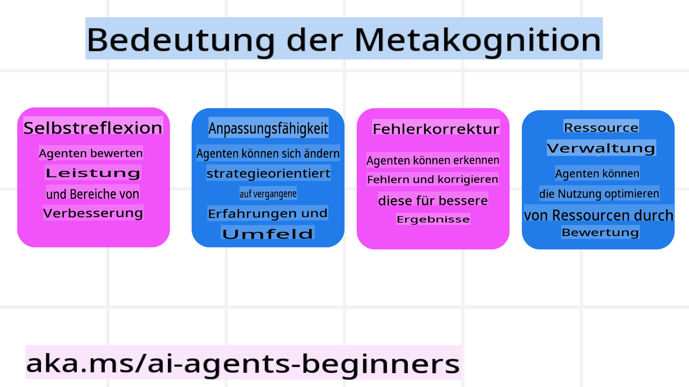
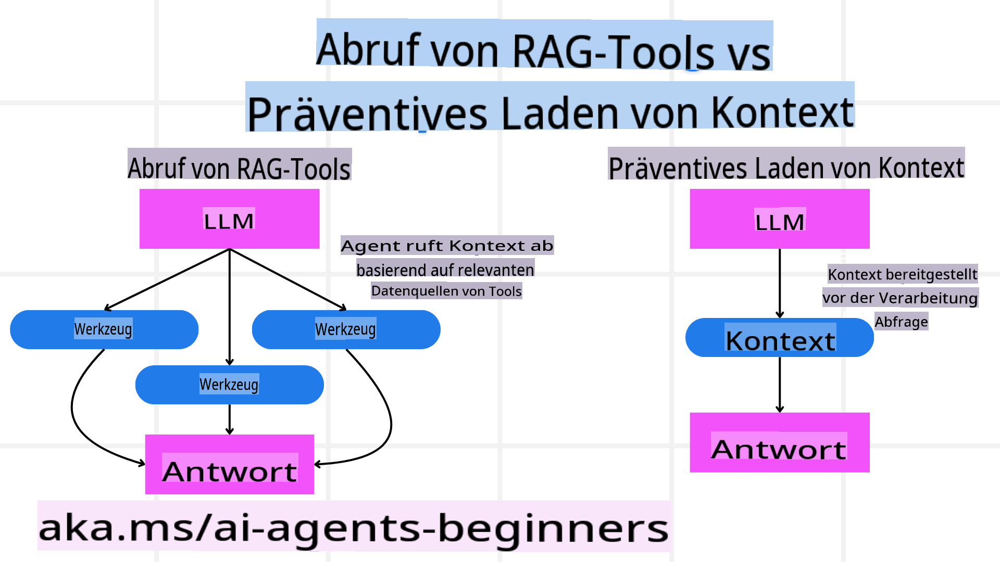

<!--
CO_OP_TRANSLATOR_METADATA:
{
  "original_hash": "3171ed887315c3ddeaccf966e40e9a50",
  "translation_date": "2025-03-28T10:43:30+00:00",
  "source_file": "09-metacognition\\README.md",
  "language_code": "de"
}
-->
[](https://youtu.be/His9R6gw6Ec?si=3_RMb8VprNvdLRhX)

> _(Klicken Sie auf das Bild oben, um das Video dieser Lektion anzusehen)_
# Metakognition bei KI-Agenten ## Einführung Willkommen zur Lektion über Metakognition bei KI-Agenten! Dieses Kapitel ist für Anfänger gedacht, die neugierig darauf sind, wie KI-Agenten über ihre eigenen Denkprozesse nachdenken können. Am Ende dieser Lektion verstehen Sie die wichtigsten Konzepte und erhalten praktische Beispiele, um Metakognition im Design von KI-Agenten anzuwenden. ## Lernziele Nach Abschluss dieser Lektion können Sie: 1. Die Auswirkungen von Denkzyklen bei Agentendefinitionen verstehen. 2. Planungs- und Evaluierungstechniken anwenden, um selbstkorrigierende Agenten zu unterstützen. 3. Eigene Agenten erstellen, die in der Lage sind, Code zu manipulieren, um Aufgaben zu erledigen. ## Einführung in Metakognition Metakognition bezieht sich auf höhere kognitive Prozesse, die das Nachdenken über das eigene Denken beinhalten. Für KI-Agenten bedeutet dies, dass sie ihre Aktionen basierend auf Selbstbewusstsein und früheren Erfahrungen bewerten und anpassen können. Metakognition, oder „über das Denken nachdenken“, ist ein wichtiger Begriff bei der Entwicklung von agentischen KI-Systemen. Es bedeutet, dass KI-Systeme sich ihrer eigenen internen Prozesse bewusst sind und in der Lage sind, ihr Verhalten zu überwachen, zu regulieren und anzupassen. Ähnlich wie wir es tun, wenn wir die Situation einschätzen oder ein Problem betrachten. Dieses Selbstbewusstsein kann KI-Systemen helfen, bessere Entscheidungen zu treffen, Fehler zu erkennen und ihre Leistung im Laufe der Zeit zu verbessern – was wiederum mit dem Turing-Test und der Debatte darüber, ob KI die Kontrolle übernehmen wird, verknüpft ist. Im Kontext von agentischen KI-Systemen kann Metakognition helfen, mehrere Herausforderungen zu bewältigen, wie zum Beispiel: - Transparenz: Sicherstellen, dass KI-Systeme ihre Argumentation und Entscheidungen erklären können. - Argumentation: Verbesserung der Fähigkeit von KI-Systemen, Informationen zu synthetisieren und fundierte Entscheidungen zu treffen. - Anpassung: Ermöglichen, dass KI-Systeme sich an neue Umgebungen und sich ändernde Bedingungen anpassen können. - Wahrnehmung: Verbesserung der Genauigkeit von KI-Systemen bei der Erkennung und Interpretation von Daten aus ihrer Umgebung. ### Was ist Metakognition? Metakognition, oder „über das Denken nachdenken“, ist ein höherer kognitiver Prozess, der Selbstbewusstsein und Selbstregulierung der eigenen kognitiven Prozesse umfasst. Im Bereich der KI befähigt Metakognition Agenten, ihre Strategien und Aktionen zu bewerten und anzupassen, was zu verbesserten Problemlösungs- und Entscheidungsfähigkeiten führt. Durch das Verständnis von Metakognition können Sie KI-Agenten entwickeln, die nicht nur intelligenter, sondern auch anpassungsfähiger und effizienter sind. Bei echter Metakognition würde die KI explizit über ihre eigene Argumentation nachdenken. Beispiel: „Ich habe günstigere Flüge priorisiert, weil... Ich könnte Direktflüge verpassen, also überprüfe ich das nochmal.“ Nachvollziehen, wie oder warum sie eine bestimmte Route gewählt hat. - Feststellen, dass sie Fehler gemacht hat, weil sie sich zu stark auf die Vorlieben des Nutzers aus der Vergangenheit verlassen hat, und ihre Entscheidungsstrategie anpassen, nicht nur die endgültige Empfehlung. - Muster diagnostizieren wie: „Immer wenn der Nutzer erwähnt, ‚zu überfüllt‘, sollte ich nicht nur bestimmte Attraktionen entfernen, sondern auch reflektieren, dass meine Methode zur Auswahl ‚der besten Attraktionen‘ fehlerhaft ist, wenn ich immer nach Beliebtheit ranke.“ ### Bedeutung der Metakognition bei KI-Agenten Metakognition spielt aus mehreren Gründen eine entscheidende Rolle im Design von KI-Agenten:  - Selbstreflexion: Agenten können ihre eigene Leistung bewerten und Bereiche zur Verbesserung identifizieren. - Anpassungsfähigkeit: Agenten können ihre Strategien basierend auf früheren Erfahrungen und sich ändernden Umgebungen modifizieren. - Fehlerkorrektur: Agenten können Fehler selbstständig erkennen und korrigieren, was zu genaueren Ergebnissen führt. - Ressourcenmanagement: Agenten können die Nutzung von Ressourcen wie Zeit und Rechenleistung optimieren, indem sie ihre Aktionen planen und bewerten. ## Komponenten eines KI-Agenten Bevor wir uns mit metakognitiven Prozessen befassen, ist es wichtig, die grundlegenden Komponenten eines KI-Agenten zu verstehen. Ein KI-Agent besteht typischerweise aus: - Persona: Die Persönlichkeit und Eigenschaften des Agenten, die definieren, wie er mit Nutzern interagiert. - Werkzeuge: Die Fähigkeiten und Funktionen, die der Agent ausführen kann. - Fähigkeiten: Das Wissen und die Expertise, die der Agent besitzt. Diese Komponenten arbeiten zusammen, um eine „Expertise-Einheit“ zu schaffen, die spezifische Aufgaben ausführen kann. **Beispiel**: Stellen Sie sich einen Reiseagenten vor, der nicht nur Ihren Urlaub plant, sondern auch seinen Weg basierend auf Echtzeitdaten und früheren Kundenerfahrungen anpasst. ### Beispiel: Metakognition in einem Reiseagenten-Dienst Stellen Sie sich vor, Sie entwerfen einen KI-gestützten Reiseagenten-Dienst. Dieser Agent, „Reiseagent“, hilft Nutzern bei der Planung ihrer Urlaube. Um Metakognition einzubinden, muss Reiseagent seine Aktionen basierend auf Selbstbewusstsein und früheren Erfahrungen bewerten und anpassen. So könnte Metakognition eine Rolle spielen: #### Aktuelle Aufgabe Die aktuelle Aufgabe besteht darin, einem Nutzer bei der Planung einer Reise nach Paris zu helfen. #### Schritte zur Erledigung der Aufgabe 1. **Nutzerpräferenzen sammeln**: Den Nutzer nach seinen Reisedaten, seinem Budget, seinen Interessen (z. B. Museen, Küche, Shopping) und spezifischen Anforderungen fragen. 2. **Informationen abrufen**: Flugoptionen, Unterkünfte, Attraktionen und Restaurants suchen, die den Präferenzen des Nutzers entsprechen. 3. **Empfehlungen generieren**: Einen personalisierten Reiseplan mit Flugdaten, Hotelreservierungen und vorgeschlagenen Aktivitäten erstellen. 4. **Anpassung basierend auf Feedback**: Den Nutzer nach Feedback zu den Empfehlungen fragen und notwendige Anpassungen vornehmen. #### Benötigte Ressourcen - Zugriff auf Flug- und Hotelbuchungsdatenbanken. - Informationen zu Pariser Attraktionen und Restaurants. - Nutzerdaten aus früheren Interaktionen. #### Erfahrung und Selbstreflexion Reiseagent nutzt Metakognition, um seine Leistung zu bewerten und aus früheren Erfahrungen zu lernen. Zum Beispiel: 1. **Analyse von Nutzerfeedback**: Reiseagent überprüft Nutzerfeedback, um festzustellen, welche Empfehlungen gut ankamen und welche nicht. Er passt zukünftige Vorschläge entsprechend an. 2. **Anpassungsfähigkeit**: Wenn ein Nutzer zuvor eine Abneigung gegen überfüllte Orte geäußert hat, wird Reiseagent in Zukunft vermeiden, beliebte Touristenattraktionen zu Stoßzeiten zu empfehlen. 3. **Fehlerkorrektur**: Wenn Reiseagent bei einer früheren Buchung einen Fehler gemacht hat, wie z. B. ein Hotel vorzuschlagen, das ausgebucht war, lernt er, die Verfügbarkeit vor der Empfehlung gründlicher zu überprüfen. #### Praktisches Entwicklerbeispiel Hier ist ein vereinfachtes Beispiel, wie der Code von Reiseagent aussehen könnte, wenn Metakognition eingebunden wird: ```python
class Travel_Agent:
    def __init__(self):
        self.user_preferences = {}
        self.experience_data = []

    def gather_preferences(self, preferences):
        self.user_preferences = preferences

    def retrieve_information(self):
        # Search for flights, hotels, and attractions based on preferences
        flights = search_flights(self.user_preferences)
        hotels = search_hotels(self.user_preferences)
        attractions = search_attractions(self.user_preferences)
        return flights, hotels, attractions

    def generate_recommendations(self):
        flights, hotels, attractions = self.retrieve_information()
        itinerary = create_itinerary(flights, hotels, attractions)
        return itinerary

    def adjust_based_on_feedback(self, feedback):
        self.experience_data.append(feedback)
        # Analyze feedback and adjust future recommendations
        self.user_preferences = adjust_preferences(self.user_preferences, feedback)

# Example usage
travel_agent = Travel_Agent()
preferences = {
    "destination": "Paris",
    "dates": "2025-04-01 to 2025-04-10",
    "budget": "moderate",
    "interests": ["museums", "cuisine"]
}
travel_agent.gather_preferences(preferences)
itinerary = travel_agent.generate_recommendations()
print("Suggested Itinerary:", itinerary)
feedback = {"liked": ["Louvre Museum"], "disliked": ["Eiffel Tower (too crowded)"]}
travel_agent.adjust_based_on_feedback(feedback)
``` #### Warum Metakognition wichtig ist - **Selbstreflexion**: Agenten können ihre Leistung analysieren und Verbesserungsmöglichkeiten identifizieren. - **Anpassungsfähigkeit**: Agenten können Strategien basierend auf Feedback und sich ändernden Bedingungen modifizieren. - **Fehlerkorrektur**: Agenten können Fehler selbstständig erkennen und korrigieren. - **Ressourcenmanagement**: Agenten können die Ressourcennutzung optimieren, wie Zeit und Rechenleistung. Durch die Einbindung von Metakognition kann Reiseagent personalisierte und genauere Reiseempfehlungen geben und die Benutzererfahrung insgesamt verbessern. --- ## 2. Planung bei Agenten Planung ist eine entscheidende Komponente des Verhaltens von KI-Agenten. Sie umfasst die Festlegung der Schritte, die erforderlich sind, um ein Ziel zu erreichen, unter Berücksichtigung des aktuellen Zustands, der Ressourcen und möglicher Hindernisse. ### Elemente der Planung - **Aktuelle Aufgabe**: Die Aufgabe klar definieren. - **Schritte zur Erledigung der Aufgabe**: Die Aufgabe in überschaubare Schritte unterteilen. - **Benötigte Ressourcen**: Notwendige Ressourcen identifizieren. - **Erfahrung**: Frühere Erfahrungen nutzen, um die Planung zu informieren. **Beispiel**: Hier sind die Schritte, die Reiseagent unternehmen muss, um einem Nutzer effektiv bei der Reiseplanung zu helfen: ### Schritte für Reiseagent 1. **Nutzerpräferenzen sammeln** - Den Nutzer nach Details zu seinen Reisedaten, seinem Budget, seinen Interessen und spezifischen Anforderungen fragen. - Beispiele: „Wann planen Sie zu reisen?“ „Was ist Ihre Budgetspanne?“ „Welche Aktivitäten genießen Sie im Urlaub?“ 2. **Informationen abrufen** - Relevante Reiseoptionen basierend auf den Präferenzen des Nutzers suchen. - **Flüge**: Verfügbare Flüge innerhalb des Budgets und der bevorzugten Reisedaten des Nutzers suchen. - **Unterkünfte**: Hotels oder Mietobjekte finden, die den Präferenzen des Nutzers hinsichtlich Lage, Preis und Ausstattung entsprechen. - **Attraktionen und Restaurants**: Beliebte Attraktionen, Aktivitäten und Essensmöglichkeiten identifizieren, die den Interessen des Nutzers entsprechen. 3. **Empfehlungen generieren** - Die abgerufenen Informationen in einem personalisierten Reiseplan zusammenstellen. - Details wie Flugoptionen, Hotelreservierungen und vorgeschlagene Aktivitäten bereitstellen, wobei die Empfehlungen auf die Präferenzen des Nutzers zugeschnitten werden. 4. **Reiseplan dem Nutzer präsentieren** - Den vorgeschlagenen Reiseplan dem Nutzer zur Überprüfung teilen. - Beispiel: „Hier ist ein vorgeschlagener Reiseplan für Ihre Reise nach Paris. Er enthält Flugdaten, Hotelbuchungen und eine Liste empfohlener Aktivitäten und Restaurants. Lassen Sie mich wissen, was Sie denken!“ 5. **Feedback einholen** - Den Nutzer nach Feedback zum vorgeschlagenen Reiseplan fragen. - Beispiele: „Gefällt Ihnen die Flugoptionen?“ „Ist das Hotel für Ihre Bedürfnisse geeignet?“ „Gibt es Aktivitäten, die Sie hinzufügen oder entfernen möchten?“ 6. **Anpassung basierend auf Feedback** - Den Reiseplan basierend auf dem Feedback des Nutzers modifizieren. - Notwendige Änderungen an Flug-, Unterkunfts- und Aktivitätsempfehlungen vornehmen, um besser zu den Präferenzen des Nutzers zu passen. 7. **Endgültige Bestätigung** - Den aktualisierten Reiseplan dem Nutzer zur endgültigen Bestätigung präsentieren. - Beispiel: „Ich habe die Anpassungen basierend auf Ihrem Feedback vorgenommen. Hier ist der aktualisierte Reiseplan. Ist alles in Ordnung für Sie?“ 8. **Buchungen und Reservierungen bestätigen** - Sobald der Nutzer den Reiseplan genehmigt hat, mit der Buchung von Flügen, Unterkünften und geplanten Aktivitäten fortfahren. - Bestätigungsdetails an den Nutzer senden. 9. **Fortlaufende Unterstützung bieten** - Dem Nutzer weiterhin zur Verfügung stehen, um ihm bei Änderungen oder zusätzlichen Anfragen vor und während seiner Reise zu helfen. - Beispiel: „Wenn Sie während Ihrer Reise weitere Unterstützung benötigen, können Sie sich jederzeit an mich wenden!“ ### Beispiel-Interaktion ```python
class Travel_Agent:
    def __init__(self):
        self.user_preferences = {}
        self.experience_data = []

    def gather_preferences(self, preferences):
        self.user_preferences = preferences

    def retrieve_information(self):
        flights = search_flights(self.user_preferences)
        hotels = search_hotels(self.user_preferences)
        attractions = search_attractions(self.user_preferences)
        return flights, hotels, attractions

    def generate_recommendations(self):
        flights, hotels, attractions = self.retrieve_information()
        itinerary = create_itinerary(flights, hotels, attractions)
        return itinerary

    def adjust_based_on_feedback(self, feedback):
        self.experience_data.append(feedback)
        self.user_preferences = adjust_preferences(self.user_preferences, feedback)

# Example usage within a booing request
travel_agent = Travel_Agent()
preferences = {
    "destination": "Paris",
    "dates": "2025-04-01 to 2025-04-10",
    "budget": "moderate",
    "interests": ["museums", "cuisine"]
}
travel_agent.gather_preferences(preferences)
itinerary = travel_agent.generate_recommendations()
print("Suggested Itinerary:", itinerary)
feedback = {"liked": ["Louvre Museum"], "disliked": ["Eiffel Tower (too crowded)"]}
travel_agent.adjust_based_on_feedback(feedback)
``` ## 3. Korrektives RAG-System Lassen Sie uns zunächst den Unterschied zwischen RAG-Tool und präventivem Kontextladen verstehen:  ### Retrieval-Augmented Generation (RAG) RAG kombiniert ein Retrieval-System mit einem generativen Modell. Wenn eine Anfrage gestellt wird, ruft das Retrieval-System relevante Dokumente oder Daten aus einer externen Quelle ab, und diese abgerufenen Informationen werden verwendet, um die Eingabe für das generative Modell zu erweitern. Dies hilft dem Modell, genauere und kontextuell relevante Antworten zu generieren. In einem RAG-System ruft der Agent relevante Informationen aus einer Wissensdatenbank ab und nutzt diese, um geeignete Antworten oder Aktionen zu generieren. ### Ansatz des Korrektiven RAG Der Ansatz des Korrektiven RAG konzentriert sich darauf, RAG-Techniken zu nutzen, um Fehler zu korrigieren und die Genauigkeit von KI-Agenten zu verbessern. Dies umfasst: 1. **Prompting-Technik**: Spezifische Prompts verwenden, um den Agenten bei der Abfrage relevanter Informationen zu führen. 2. **Werkzeug**: Algorithmen und Mechanismen implementieren, die es dem Agenten ermöglichen, die Relevanz der abgerufenen Informationen zu bewerten und genaue Antworten zu generieren. 3. **Evaluierung**: Die Leistung des Agenten kontinuierlich bewerten und Anpassungen vornehmen, um die Genauigkeit und Effizienz zu verbessern.
Korrektive RAG in einem Suchagenten  
Betrachten wir einen Suchagenten, der Informationen aus dem Web abruft, um Benutzeranfragen zu beantworten. Der Corrective-RAG-Ansatz könnte Folgendes umfassen:  
1. **Prompting-Technik**: Formulierung von Suchanfragen basierend auf den Eingaben des Benutzers.  
2. **Tool**: Verwendung von NLP- und maschinellen Lernalgorithmen, um Suchergebnisse zu bewerten und zu filtern.  
3. **Evaluation**: Analyse von Benutzerfeedback, um Ungenauigkeiten in den abgerufenen Informationen zu identifizieren und zu korrigieren.  

### Korrektive RAG in einem Reiseagenten  
Corrective RAG (Retrieval-Augmented Generation) verbessert die Fähigkeit einer KI, Informationen abzurufen und zu generieren, während Ungenauigkeiten korrigiert werden. Sehen wir uns an, wie ein Reiseagent den Corrective-RAG-Ansatz nutzen kann, um genauere und relevantere Reiseempfehlungen bereitzustellen. Dies umfasst:  
- **Prompting-Technik:** Verwendung spezifischer Prompts, um den Agenten beim Abrufen relevanter Informationen zu leiten.  
- **Tool:** Implementierung von Algorithmen und Mechanismen, die dem Agenten ermöglichen, die Relevanz der abgerufenen Informationen zu bewerten und genaue Antworten zu generieren.  
- **Evaluation:** Kontinuierliche Bewertung der Leistung des Agenten und Anpassungen zur Verbesserung von Genauigkeit und Effizienz.  

#### Schritte zur Implementierung von Corrective RAG in einem Reiseagenten  
1. **Erste Benutzerinteraktion**  
   - Der Reiseagent sammelt erste Präferenzen des Benutzers, wie Zielort, Reisedaten, Budget und Interessen.  
   - Beispiel: ```python
     preferences = {
         "destination": "Paris",
         "dates": "2025-04-01 to 2025-04-10",
         "budget": "moderate",
         "interests": ["museums", "cuisine"]
     }
     ```  

2. **Abrufen von Informationen**  
   - Der Reiseagent ruft Informationen über Flüge, Unterkünfte, Sehenswürdigkeiten und Restaurants basierend auf den Benutzerpräferenzen ab.  
   - Beispiel: ```python
     flights = search_flights(preferences)
     hotels = search_hotels(preferences)
     attractions = search_attractions(preferences)
     ```  

3. **Generierung erster Empfehlungen**  
   - Der Reiseagent nutzt die abgerufenen Informationen, um eine personalisierte Reiseroute zu erstellen.  
   - Beispiel: ```python
     itinerary = create_itinerary(flights, hotels, attractions)
     print("Suggested Itinerary:", itinerary)
     ```  

4. **Sammeln von Benutzerfeedback**  
   - Der Reiseagent bittet den Benutzer um Feedback zu den ersten Empfehlungen.  
   - Beispiel: ```python
     feedback = {
         "liked": ["Louvre Museum"],
         "disliked": ["Eiffel Tower (too crowded)"]
     }
     ```  

5. **Corrective-RAG-Prozess**  
   - **Prompting-Technik**: Der Reiseagent formuliert neue Suchanfragen basierend auf Benutzerfeedback.  
     - Beispiel: ```python
       if "disliked" in feedback:
           preferences["avoid"] = feedback["disliked"]
       ```  
   - **Tool**: Der Reiseagent verwendet Algorithmen, um neue Suchergebnisse zu bewerten und zu filtern, wobei der Fokus auf der Relevanz basierend auf Benutzerfeedback liegt.  
     - Beispiel: ```python
       new_attractions = search_attractions(preferences)
       new_itinerary = create_itinerary(flights, hotels, new_attractions)
       print("Updated Itinerary:", new_itinerary)
       ```  
   - **Evaluation**: Der Reiseagent bewertet kontinuierlich die Relevanz und Genauigkeit seiner Empfehlungen durch Analyse von Benutzerfeedback und notwendige Anpassungen.  
     - Beispiel: ```python
       def adjust_preferences(preferences, feedback):
           if "liked" in feedback:
               preferences["favorites"] = feedback["liked"]
           if "disliked" in feedback:
               preferences["avoid"] = feedback["disliked"]
           return preferences

       preferences = adjust_preferences(preferences, feedback)
       ```  

#### Praktisches Beispiel  
Hier ist ein vereinfachtes Python-Code-Beispiel, das den Corrective-RAG-Ansatz in einem Reiseagenten implementiert:  
```python
class Travel_Agent:
    def __init__(self):
        self.user_preferences = {}
        self.experience_data = []

    def gather_preferences(self, preferences):
        self.user_preferences = preferences

    def retrieve_information(self):
        flights = search_flights(self.user_preferences)
        hotels = search_hotels(self.user_preferences)
        attractions = search_attractions(self.user_preferences)
        return flights, hotels, attractions

    def generate_recommendations(self):
        flights, hotels, attractions = self.retrieve_information()
        itinerary = create_itinerary(flights, hotels, attractions)
        return itinerary

    def adjust_based_on_feedback(self, feedback):
        self.experience_data.append(feedback)
        self.user_preferences = adjust_preferences(self.user_preferences, feedback)
        new_itinerary = self.generate_recommendations()
        return new_itinerary

# Example usage
travel_agent = Travel_Agent()
preferences = {
    "destination": "Paris",
    "dates": "2025-04-01 to 2025-04-10",
    "budget": "moderate",
    "interests": ["museums", "cuisine"]
}
travel_agent.gather_preferences(preferences)
itinerary = travel_agent.generate_recommendations()
print("Suggested Itinerary:", itinerary)
feedback = {"liked": ["Louvre Museum"], "disliked": ["Eiffel Tower (too crowded)"]}
new_itinerary = travel_agent.adjust_based_on_feedback(feedback)
print("Updated Itinerary:", new_itinerary)
```  

### Präventive Kontextladung  
Präventive Kontextladung beinhaltet das Laden relevanter Kontexte oder Hintergrundinformationen in das Modell, bevor eine Anfrage verarbeitet wird. Dies bedeutet, dass das Modell von Anfang an Zugriff auf diese Informationen hat, was ihm helfen kann, fundiertere Antworten zu generieren, ohne während des Prozesses zusätzliche Daten abrufen zu müssen.  

Hier ist ein vereinfachtes Beispiel, wie eine präventive Kontextladung für eine Reiseagentenanwendung in Python aussehen könnte:  
```python
class TravelAgent:
    def __init__(self):
        # Pre-load popular destinations and their information
        self.context = {
            "Paris": {"country": "France", "currency": "Euro", "language": "French", "attractions": ["Eiffel Tower", "Louvre Museum"]},
            "Tokyo": {"country": "Japan", "currency": "Yen", "language": "Japanese", "attractions": ["Tokyo Tower", "Shibuya Crossing"]},
            "New York": {"country": "USA", "currency": "Dollar", "language": "English", "attractions": ["Statue of Liberty", "Times Square"]},
            "Sydney": {"country": "Australia", "currency": "Dollar", "language": "English", "attractions": ["Sydney Opera House", "Bondi Beach"]}
        }

    def get_destination_info(self, destination):
        # Fetch destination information from pre-loaded context
        info = self.context.get(destination)
        if info:
            return f"{destination}:\nCountry: {info['country']}\nCurrency: {info['currency']}\nLanguage: {info['language']}\nAttractions: {', '.join(info['attractions'])}"
        else:
            return f"Sorry, we don't have information on {destination}."

# Example usage
travel_agent = TravelAgent()
print(travel_agent.get_destination_info("Paris"))
print(travel_agent.get_destination_info("Tokyo"))
```  

#### Erklärung  
1. **Initialisierung (`__init__` method)**: The `TravelAgent` class pre-loads a dictionary containing information about popular destinations such as Paris, Tokyo, New York, and Sydney. This dictionary includes details like the country, currency, language, and major attractions for each destination.

2. **Retrieving Information (`get_destination_info` method)**: When a user queries about a specific destination, the `get_destination_info`-Methode)**: Diese Methode ruft die relevanten Informationen aus dem vorab geladenen Kontext-Wörterbuch ab. Durch das Vorladen des Kontexts kann die Reiseagentenanwendung schnell auf Benutzeranfragen reagieren, ohne diese Informationen in Echtzeit aus einer externen Quelle abrufen zu müssen. Dies macht die Anwendung effizienter und reaktionsschneller.  

### Bootstrapping des Plans mit einem Ziel vor der Iteration  
Das Bootstrapping eines Plans mit einem Ziel beinhaltet das Starten mit einem klaren Ziel oder gewünschten Ergebnis. Durch die Definition dieses Ziels im Voraus kann das Modell es als Leitprinzip während des iterativen Prozesses verwenden. Dies hilft sicherzustellen, dass jede Iteration dem gewünschten Ergebnis näher kommt und der Prozess effizienter und fokussierter wird.  

Hier ist ein Beispiel, wie Sie einen Reiseplan mit einem Ziel bootstrappen könnten, bevor Sie für einen Reiseagenten iterieren:  

### Szenario  
Ein Reiseagent möchte eine maßgeschneiderte Reise für einen Kunden planen. Das Ziel ist es, eine Reiseroute zu erstellen, die die Zufriedenheit des Kunden basierend auf seinen Präferenzen und seinem Budget maximiert.  

### Schritte  
1. Definieren Sie die Präferenzen und das Budget des Kunden.  
2. Bootstrappen Sie den ersten Plan basierend auf diesen Präferenzen.  
3. Iterieren Sie, um den Plan zu verfeinern und die Zufriedenheit des Kunden zu optimieren.  

#### Python-Code  
```python
class TravelAgent:
    def __init__(self, destinations):
        self.destinations = destinations

    def bootstrap_plan(self, preferences, budget):
        plan = []
        total_cost = 0

        for destination in self.destinations:
            if total_cost + destination['cost'] <= budget and self.match_preferences(destination, preferences):
                plan.append(destination)
                total_cost += destination['cost']

        return plan

    def match_preferences(self, destination, preferences):
        for key, value in preferences.items():
            if destination.get(key) != value:
                return False
        return True

    def iterate_plan(self, plan, preferences, budget):
        for i in range(len(plan)):
            for destination in self.destinations:
                if destination not in plan and self.match_preferences(destination, preferences) and self.calculate_cost(plan, destination) <= budget:
                    plan[i] = destination
                    break
        return plan

    def calculate_cost(self, plan, new_destination):
        return sum(destination['cost'] for destination in plan) + new_destination['cost']

# Example usage
destinations = [
    {"name": "Paris", "cost": 1000, "activity": "sightseeing"},
    {"name": "Tokyo", "cost": 1200, "activity": "shopping"},
    {"name": "New York", "cost": 900, "activity": "sightseeing"},
    {"name": "Sydney", "cost": 1100, "activity": "beach"},
]

preferences = {"activity": "sightseeing"}
budget = 2000

travel_agent = TravelAgent(destinations)
initial_plan = travel_agent.bootstrap_plan(preferences, budget)
print("Initial Plan:", initial_plan)

refined_plan = travel_agent.iterate_plan(initial_plan, preferences, budget)
print("Refined Plan:", refined_plan)
```  

#### Code-Erklärung  
1. **Initialisierung (`__init__` method)**: The `TravelAgent` class is initialized with a list of potential destinations, each having attributes like name, cost, and activity type.

2. **Bootstrapping the Plan (`bootstrap_plan` method)**: This method creates an initial travel plan based on the client's preferences and budget. It iterates through the list of destinations and adds them to the plan if they match the client's preferences and fit within the budget.

3. **Matching Preferences (`match_preferences` method)**: This method checks if a destination matches the client's preferences.

4. **Iterating the Plan (`iterate_plan` method)**: This method refines the initial plan by trying to replace each destination in the plan with a better match, considering the client's preferences and budget constraints.

5. **Calculating Cost (`calculate_cost`-Methode)**: Diese Methode berechnet die Gesamtkosten des aktuellen Plans, einschließlich eines potenziellen neuen Ziels.  

#### Beispielanwendung  
- **Erster Plan**: Der Reiseagent erstellt einen ersten Plan basierend auf den Präferenzen des Kunden für Sightseeing und einem Budget von 2000 $.  
- **Verfeinerter Plan**: Der Reiseagent iteriert den Plan und optimiert ihn basierend auf den Präferenzen und dem Budget des Kunden.  

Durch das Bootstrapping des Plans mit einem klaren Ziel (z. B. Maximierung der Kundenzufriedenheit) und Iteration zur Verfeinerung des Plans kann der Reiseagent eine maßgeschneiderte und optimierte Reiseroute für den Kunden erstellen. Dieser Ansatz stellt sicher, dass der Reiseplan von Anfang an mit den Präferenzen und dem Budget des Kunden übereinstimmt und sich mit jeder Iteration verbessert.  

### Nutzung von LLM für Re-Ranking und Bewertung  
Große Sprachmodelle (LLMs) können für Re-Ranking und Bewertung verwendet werden, indem sie die Relevanz und Qualität von abgerufenen Dokumenten oder generierten Antworten bewerten. So funktioniert es:  

**Abruf:** Der erste Abrufschritt ruft eine Reihe von Kandidatendokumenten oder Antworten basierend auf der Anfrage ab.  
**Re-Ranking:** Das LLM bewertet diese Kandidaten und sortiert sie basierend auf ihrer Relevanz und Qualität neu. Dieser Schritt stellt sicher, dass die relevantesten und qualitativ hochwertigsten Informationen zuerst präsentiert werden.  
**Bewertung:** Das LLM weist jedem Kandidaten Punkte zu, die seine Relevanz und Qualität widerspiegeln. Dies hilft bei der Auswahl der besten Antwort oder des besten Dokuments für den Benutzer.  

Durch die Nutzung von LLMs für Re-Ranking und Bewertung kann das System genauere und kontextuell relevantere Informationen bereitstellen, was die Benutzererfahrung insgesamt verbessert.  

Hier ist ein Beispiel, wie ein Reiseagent ein großes Sprachmodell (LLM) verwenden könnte, um Reiseziele basierend auf Benutzerpräferenzen neu zu bewerten und zu bewerten:  

#### Szenario - Reisen basierend auf Präferenzen  
Ein Reiseagent möchte dem Kunden die besten Reiseziele basierend auf seinen Präferenzen empfehlen. Das LLM hilft dabei, die Ziele neu zu bewerten und zu bewerten, um sicherzustellen, dass die relevantesten Optionen präsentiert werden.  

#### Schritte:  
1. Sammeln Sie die Benutzerpräferenzen.  
2. Rufen Sie eine Liste potenzieller Reiseziele ab.  
3. Verwenden Sie das LLM, um die Ziele basierend auf Benutzerpräferenzen neu zu bewerten und zu bewerten.  

Hier erfahren Sie, wie Sie das vorherige Beispiel aktualisieren können, um Azure OpenAI Services zu verwenden:  

#### Anforderungen  
1. Sie benötigen ein Azure-Abonnement.  
2. Erstellen Sie eine Azure OpenAI-Ressource und erhalten Sie Ihren API-Schlüssel.  

#### Beispiel-Python-Code  
```python
import requests
import json

class TravelAgent:
    def __init__(self, destinations):
        self.destinations = destinations

    def get_recommendations(self, preferences, api_key, endpoint):
        # Generate a prompt for the Azure OpenAI
        prompt = self.generate_prompt(preferences)
        
        # Define headers and payload for the request
        headers = {
            'Content-Type': 'application/json',
            'Authorization': f'Bearer {api_key}'
        }
        payload = {
            "prompt": prompt,
            "max_tokens": 150,
            "temperature": 0.7
        }
        
        # Call the Azure OpenAI API to get the re-ranked and scored destinations
        response = requests.post(endpoint, headers=headers, json=payload)
        response_data = response.json()
        
        # Extract and return the recommendations
        recommendations = response_data['choices'][0]['text'].strip().split('\n')
        return recommendations

    def generate_prompt(self, preferences):
        prompt = "Here are the travel destinations ranked and scored based on the following user preferences:\n"
        for key, value in preferences.items():
            prompt += f"{key}: {value}\n"
        prompt += "\nDestinations:\n"
        for destination in self.destinations:
            prompt += f"- {destination['name']}: {destination['description']}\n"
        return prompt

# Example usage
destinations = [
    {"name": "Paris", "description": "City of lights, known for its art, fashion, and culture."},
    {"name": "Tokyo", "description": "Vibrant city, famous for its modernity and traditional temples."},
    {"name": "New York", "description": "The city that never sleeps, with iconic landmarks and diverse culture."},
    {"name": "Sydney", "description": "Beautiful harbour city, known for its opera house and stunning beaches."},
]

preferences = {"activity": "sightseeing", "culture": "diverse"}
api_key = 'your_azure_openai_api_key'
endpoint = 'https://your-endpoint.com/openai/deployments/your-deployment-name/completions?api-version=2022-12-01'

travel_agent = TravelAgent(destinations)
recommendations = travel_agent.get_recommendations(preferences, api_key, endpoint)
print("Recommended Destinations:")
for rec in recommendations:
    print(rec)
```  

#### Code-Erklärung - Präferenzbucher  
1. **Initialisierung**: Der `TravelAgent` class is initialized with a list of potential travel destinations, each having attributes like name and description.

2. **Getting Recommendations (`get_recommendations` method)**: This method generates a prompt for the Azure OpenAI service based on the user's preferences and makes an HTTP POST request to the Azure OpenAI API to get re-ranked and scored destinations.

3. **Generating Prompt (`generate_prompt` method)**: This method constructs a prompt for the Azure OpenAI, including the user's preferences and the list of destinations. The prompt guides the model to re-rank and score the destinations based on the provided preferences.

4. **API Call**: The `requests` library is used to make an HTTP POST request to the Azure OpenAI API endpoint. The response contains the re-ranked and scored destinations.

5. **Example Usage**: The travel agent collects user preferences (e.g., interest in sightseeing and diverse culture) and uses the Azure OpenAI service to get re-ranked and scored recommendations for travel destinations.

Make sure to replace `your_azure_openai_api_key` with your actual Azure OpenAI API key and `https://your-endpoint.com/...` mit der tatsächlichen Endpunkt-URL Ihrer Azure-OpenAI-Bereitstellung.  

Durch die Nutzung des LLM für Re-Ranking und Bewertung kann der Reiseagent personalisierte und relevantere Reiseempfehlungen für Kunden bereitstellen und deren Gesamterfahrung verbessern.  

### RAG: Prompting-Technik vs. Tool  
Retrieval-Augmented Generation (RAG) kann sowohl eine Prompting-Technik als auch ein Tool bei der Entwicklung von KI-Agenten sein. Das Verständnis des Unterschieds zwischen beiden kann Ihnen helfen, RAG effektiver in Ihren Projekten einzusetzen.  

#### RAG als Prompting-Technik  
**Was ist das?**  
- Als Prompting-Technik beinhaltet RAG die Formulierung spezifischer Anfragen oder Prompts, um das Abrufen relevanter Informationen aus einem großen Korpus oder einer Datenbank zu steuern. Diese Informationen werden dann verwendet, um Antworten oder Aktionen zu generieren.  

**Wie funktioniert es:**  
1. **Prompts formulieren**: Erstellen Sie gut strukturierte Prompts oder Anfragen basierend auf der Aufgabe oder den Eingaben des Benutzers.  
2. **Informationen abrufen**: Verwenden Sie die Prompts, um relevante Daten aus einer bestehenden Wissensbasis oder einem Datensatz zu suchen.  
3. **Antwort generieren**: Kombinieren Sie die abgerufenen Informationen mit generativen KI-Modellen, um eine umfassende und kohärente Antwort zu erstellen.  

**Beispiel im Reiseagenten**:  
- Benutzereingabe: "Ich möchte Museen in Paris besuchen."  
- Prompt: "Finde die besten Museen in Paris."  
- Abgerufene Informationen: Details über Louvre, Musée d'Orsay usw.  
- Generierte Antwort: "Hier sind einige der besten Museen in Paris: Louvre, Musée d'Orsay und Centre Pompidou."  

#### RAG als Tool  
**Was ist das?**  
- Als Tool ist RAG ein integriertes System, das den Abruf- und Generierungsprozess automatisiert und es Entwicklern erleichtert, komplexe KI-Funktionalitäten zu implementieren, ohne für jede Anfrage manuell Prompts erstellen zu müssen.  

**Wie funktioniert es:**  
1. **Integration**: Betten Sie RAG in die Architektur des KI-Agenten ein, sodass es den Abruf- und Generierungsprozess automatisch abwickelt.  
2. **Automatisierung**: Das Tool verwaltet den gesamten Prozess, vom Empfang der Benutzereingabe bis zur Generierung der finalen Antwort, ohne dass explizite Prompts für jeden Schritt erforderlich sind.  
3. **Effizienz**: Verbessert die Leistung des Agenten, indem der Abruf- und Generierungsprozess optimiert wird, was schnellere und genauere Antworten ermöglicht.  

**Beispiel im Reiseagenten**:  
- Benutzereingabe: "Ich möchte Museen in Paris besuchen."  
- RAG-Tool: Ruft automatisch Informationen über Museen ab und generiert eine Antwort.  
- Generierte Antwort: "Hier sind einige der besten Museen in Paris: Louvre, Musée d'Orsay und Centre Pompidou."  

### Vergleich  

| Aspekt               | Prompting-Technik                                      | Tool                                               |  
|-----------------------|-------------------------------------------------------|---------------------------------------------------|  
| **Manuell vs. Automatisch** | Manuelle Formulierung von Prompts für jede Anfrage. | Automatisierter Prozess für Abruf und Generierung. |  
| **Kontrolle**         | Bietet mehr Kontrolle über den Abrufprozess.          | Optimiert und automatisiert den Abruf- und Generierungsprozess.|  
| **Flexibilität**      | Ermöglicht maßgeschneiderte Prompts für spezifische Anforderungen.| Effizienter für groß angelegte Implementierungen. |  
| **Komplexität**       | Erfordert das Erstellen und Anpassen von Prompts.     | Einfacher in die Architektur eines KI-Agenten zu integrieren. |  

### Praktische Beispiele  
**Beispiel für Prompting-Technik:**  
```python
def search_museums_in_paris():
    prompt = "Find top museums in Paris"
    search_results = search_web(prompt)
    return search_results

museums = search_museums_in_paris()
print("Top Museums in Paris:", museums)
```  

**Beispiel für Tool:**  
```python
class Travel_Agent:
    def __init__(self):
        self.rag_tool = RAGTool()

    def get_museums_in_paris(self):
        user_input = "I want to visit museums in Paris."
        response = self.rag_tool.retrieve_and_generate(user_input)
        return response

travel_agent = Travel_Agent()
museums = travel_agent.get_museums_in_paris()
print("Top Museums in Paris:", museums)
```  

### Bewertung der Relevanz  
Die Bewertung der Relevanz ist ein entscheidender Aspekt der Leistung von KI-Agenten. Sie stellt sicher, dass die vom Agenten abgerufenen und generierten Informationen für den Benutzer angemessen, genau und nützlich sind.  

#### Schlüsselkonzepte bei der Bewertung der Relevanz  
1. **Kontextbewusstsein**:  
   - Der Agent muss den Kontext der Benutzeranfrage verstehen, um relevante Informationen abzurufen und zu generieren.  
   - Beispiel: Wenn ein Benutzer nach "den besten Restaurants in Paris" fragt, sollte der Agent die Präferenzen des Benutzers wie Küchentyp und Budget berücksichtigen.  
2. **Genauigkeit**:  
   - Die vom Agenten bereitgestellten Informationen sollten faktisch korrekt und aktuell sein.  
   - Beispiel: Empfehlung von derzeit geöffneten Restaurants mit guten Bewertungen anstelle von veralteten oder geschlossenen Optionen.  
3. **Benutzerabsicht**:  
Der Agent sollte die Absicht des Benutzers hinter der Anfrage ableiten, um die relevantesten Informationen bereitzustellen. - Beispiel: Wenn ein Benutzer nach „günstigen Hotels“ fragt, sollte der Agent erschwingliche Optionen priorisieren. 4. **Feedback-Schleife**: - Kontinuierliches Sammeln und Analysieren von Benutzerfeedback hilft dem Agenten, seinen Prozess zur Bewertung der Relevanz zu verbessern. - Beispiel: Einbeziehung von Benutzerbewertungen und Feedback zu früheren Empfehlungen, um zukünftige Antworten zu verbessern. #### Praktische Techniken zur Bewertung der Relevanz 1. **Relevanzbewertung**: - Weisen Sie jedem abgerufenen Element eine Relevanzbewertung zu, basierend darauf, wie gut es zur Anfrage und den Präferenzen des Benutzers passt. - Beispiel: ```python
     def relevance_score(item, query):
         score = 0
         if item['category'] in query['interests']:
             score += 1
         if item['price'] <= query['budget']:
             score += 1
         if item['location'] == query['destination']:
             score += 1
         return score
     ``` 2. **Filtern und Ranking**: - Entfernen Sie irrelevante Elemente und ordnen Sie die verbleibenden basierend auf ihren Relevanzbewertungen. - Beispiel: ```python
     def filter_and_rank(items, query):
         ranked_items = sorted(items, key=lambda item: relevance_score(item, query), reverse=True)
         return ranked_items[:10]  # Return top 10 relevant items
     ``` 3. **Natural Language Processing (NLP)**: - Verwenden Sie NLP-Techniken, um die Anfrage des Benutzers zu verstehen und relevante Informationen abzurufen. - Beispiel: ```python
     def process_query(query):
         # Use NLP to extract key information from the user's query
         processed_query = nlp(query)
         return processed_query
     ``` 4. **Integration von Benutzerfeedback**: - Sammeln Sie Benutzerfeedback zu den bereitgestellten Empfehlungen und verwenden Sie dieses, um zukünftige Relevanzbewertungen anzupassen. - Beispiel: ```python
     def adjust_based_on_feedback(feedback, items):
         for item in items:
             if item['name'] in feedback['liked']:
                 item['relevance'] += 1
             if item['name'] in feedback['disliked']:
                 item['relevance'] -= 1
         return items
     ``` #### Beispiel: Bewertung der Relevanz bei Travel Agent Hier ist ein praktisches Beispiel dafür, wie Travel Agent die Relevanz von Reiseempfehlungen bewerten kann: ```python
class Travel_Agent:
    def __init__(self):
        self.user_preferences = {}
        self.experience_data = []

    def gather_preferences(self, preferences):
        self.user_preferences = preferences

    def retrieve_information(self):
        flights = search_flights(self.user_preferences)
        hotels = search_hotels(self.user_preferences)
        attractions = search_attractions(self.user_preferences)
        return flights, hotels, attractions

    def generate_recommendations(self):
        flights, hotels, attractions = self.retrieve_information()
        ranked_hotels = self.filter_and_rank(hotels, self.user_preferences)
        itinerary = create_itinerary(flights, ranked_hotels, attractions)
        return itinerary

    def filter_and_rank(self, items, query):
        ranked_items = sorted(items, key=lambda item: self.relevance_score(item, query), reverse=True)
        return ranked_items[:10]  # Return top 10 relevant items

    def relevance_score(self, item, query):
        score = 0
        if item['category'] in query['interests']:
            score += 1
        if item['price'] <= query['budget']:
            score += 1
        if item['location'] == query['destination']:
            score += 1
        return score

    def adjust_based_on_feedback(self, feedback, items):
        for item in items:
            if item['name'] in feedback['liked']:
                item['relevance'] += 1
            if item['name'] in feedback['disliked']:
                item['relevance'] -= 1
        return items

# Example usage
travel_agent = Travel_Agent()
preferences = {
    "destination": "Paris",
    "dates": "2025-04-01 to 2025-04-10",
    "budget": "moderate",
    "interests": ["museums", "cuisine"]
}
travel_agent.gather_preferences(preferences)
itinerary = travel_agent.generate_recommendations()
print("Suggested Itinerary:", itinerary)
feedback = {"liked": ["Louvre Museum"], "disliked": ["Eiffel Tower (too crowded)"]}
updated_items = travel_agent.adjust_based_on_feedback(feedback, itinerary['hotels'])
print("Updated Itinerary with Feedback:", updated_items)
``` ### Suche mit Absicht Die Suche mit Absicht beinhaltet das Verstehen und Interpretieren des zugrunde liegenden Zwecks oder Ziels hinter der Anfrage eines Benutzers, um die relevantesten und nützlichsten Informationen abzurufen und zu generieren. Dieser Ansatz geht über das einfache Abgleichen von Schlüsselwörtern hinaus und konzentriert sich darauf, die tatsächlichen Bedürfnisse und den Kontext des Benutzers zu erfassen. #### Schlüsselkonzepte bei der Suche mit Absicht 1. **Verstehen der Benutzerabsicht**: - Die Benutzerabsicht kann in drei Haupttypen kategorisiert werden: informationell, navigationsbezogen und transaktional. - **Informationelle Absicht**: Der Benutzer sucht Informationen zu einem Thema (z. B. „Was sind die besten Museen in Paris?“). - **Navigationsbezogene Absicht**: Der Benutzer möchte zu einer bestimmten Website oder Seite navigieren (z. B. „Offizielle Website des Louvre-Museums“). - **Transaktionale Absicht**: Der Benutzer möchte eine Transaktion durchführen, wie z. B. einen Flug buchen oder einen Kauf tätigen (z. B. „Buche einen Flug nach Paris“). 2. **Kontextbewusstsein**: - Die Analyse des Kontexts der Benutzeranfrage hilft dabei, ihre Absicht genau zu identifizieren. Dies umfasst die Berücksichtigung früherer Interaktionen, Benutzerpräferenzen und spezifischer Details der aktuellen Anfrage. 3. **Natural Language Processing (NLP)**: - NLP-Techniken werden eingesetzt, um die von Benutzern bereitgestellten natürlichen Sprachabfragen zu verstehen und zu interpretieren. Dazu gehören Aufgaben wie Entitätserkennung, Sentiment-Analyse und Abfrage-Parsing. 4. **Personalisierung**: - Die Personalisierung der Suchergebnisse basierend auf der Historie, den Präferenzen und dem Feedback des Benutzers verbessert die Relevanz der abgerufenen Informationen. #### Praktisches Beispiel: Suche mit Absicht bei Travel Agent Nehmen wir Travel Agent als Beispiel, um zu sehen, wie die Suche mit Absicht implementiert werden kann. 1. **Erfassung von Benutzerpräferenzen** ```python
   class Travel_Agent:
       def __init__(self):
           self.user_preferences = {}

       def gather_preferences(self, preferences):
           self.user_preferences = preferences
   ``` 2. **Verstehen der Benutzerabsicht** ```python
   def identify_intent(query):
       if "book" in query or "purchase" in query:
           return "transactional"
       elif "website" in query or "official" in query:
           return "navigational"
       else:
           return "informational"
   ``` 3. **Kontextbewusstsein** ```python
   def analyze_context(query, user_history):
       # Combine current query with user history to understand context
       context = {
           "current_query": query,
           "user_history": user_history
       }
       return context
   ``` 4. **Suche und Personalisierung der Ergebnisse** ```python
   def search_with_intent(query, preferences, user_history):
       intent = identify_intent(query)
       context = analyze_context(query, user_history)
       if intent == "informational":
           search_results = search_information(query, preferences)
       elif intent == "navigational":
           search_results = search_navigation(query)
       elif intent == "transactional":
           search_results = search_transaction(query, preferences)
       personalized_results = personalize_results(search_results, user_history)
       return personalized_results

   def search_information(query, preferences):
       # Example search logic for informational intent
       results = search_web(f"best {preferences['interests']} in {preferences['destination']}")
       return results

   def search_navigation(query):
       # Example search logic for navigational intent
       results = search_web(query)
       return results

   def search_transaction(query, preferences):
       # Example search logic for transactional intent
       results = search_web(f"book {query} to {preferences['destination']}")
       return results

   def personalize_results(results, user_history):
       # Example personalization logic
       personalized = [result for result in results if result not in user_history]
       return personalized[:10]  # Return top 10 personalized results
   ``` 5. **Beispielverwendung** ```python
   travel_agent = Travel_Agent()
   preferences = {
       "destination": "Paris",
       "interests": ["museums", "cuisine"]
   }
   travel_agent.gather_preferences(preferences)
   user_history = ["Louvre Museum website", "Book flight to Paris"]
   query = "best museums in Paris"
   results = search_with_intent(query, preferences, user_history)
   print("Search Results:", results)
   ``` --- ## 4. Codegenerierung als Werkzeug Codegenerierende Agenten verwenden KI-Modelle, um Code zu schreiben und auszuführen, komplexe Probleme zu lösen und Aufgaben zu automatisieren. ### Codegenerierende Agenten Codegenerierende Agenten nutzen generative KI-Modelle, um Code zu schreiben und auszuführen. Diese Agenten können komplexe Probleme lösen, Aufgaben automatisieren und wertvolle Einblicke liefern, indem sie Code in verschiedenen Programmiersprachen generieren und ausführen. #### Praktische Anwendungen 1. **Automatisierte Codegenerierung**: Generieren von Code-Snippets für spezifische Aufgaben wie Datenanalyse, Web-Scraping oder maschinelles Lernen. 2. **SQL als RAG**: Verwenden von SQL-Abfragen, um Daten aus Datenbanken abzurufen und zu manipulieren. 3. **Problemlösung**: Erstellen und Ausführen von Code, um spezifische Probleme zu lösen, wie z. B. die Optimierung von Algorithmen oder die Analyse von Daten. #### Beispiel: Codegenerierender Agent für Datenanalyse Stellen Sie sich vor, Sie entwerfen einen codegenerierenden Agenten. So könnte er funktionieren: 1. **Aufgabe**: Analyse eines Datensatzes zur Identifizierung von Trends und Mustern. 2. **Schritte**: - Laden des Datensatzes in ein Datenanalysetool. - Generieren von SQL-Abfragen zum Filtern und Aggregieren der Daten. - Ausführen der Abfragen und Abrufen der Ergebnisse. - Verwendung der Ergebnisse zur Erstellung von Visualisierungen und Erkenntnissen. 3. **Erforderliche Ressourcen**: Zugriff auf den Datensatz, Datenanalysetools und SQL-Fähigkeiten. 4. **Erfahrung**: Verwendung früherer Analyseergebnisse zur Verbesserung der Genauigkeit und Relevanz zukünftiger Analysen. ### Beispiel: Codegenerierender Agent für Travel Agent In diesem Beispiel entwerfen wir einen codegenerierenden Agenten, Travel Agent, der Benutzer bei der Reiseplanung unterstützt, indem er Code generiert und ausführt. Dieser Agent kann Aufgaben wie das Abrufen von Reiseoptionen, das Filtern von Ergebnissen und das Zusammenstellen einer Reiseroute mit generativer KI übernehmen. #### Überblick über den Codegenerierenden Agenten 1. **Erfassung von Benutzerpräferenzen**: Erfasst Benutzereingaben wie Zielort, Reisedaten, Budget und Interessen. 2. **Generierung von Code zum Abrufen von Daten**: Generiert Code-Snippets, um Daten zu Flügen, Hotels und Attraktionen abzurufen. 3. **Ausführung des generierten Codes**: Führt den generierten Code aus, um Echtzeitinformationen abzurufen. 4. **Generierung der Reiseroute**: Stellt die abgerufenen Daten in einem personalisierten Reiseplan zusammen. 5. **Anpassung basierend auf Feedback**: Empfängt Benutzerfeedback und generiert Code neu, falls erforderlich, um die Ergebnisse zu verfeinern. #### Schritt-für-Schritt-Implementierung 1. **Erfassung von Benutzerpräferenzen** ```python
   class Travel_Agent:
       def __init__(self):
           self.user_preferences = {}

       def gather_preferences(self, preferences):
           self.user_preferences = preferences
   ``` 2. **Generierung von Code zum Abrufen von Daten** ```python
   def generate_code_to_fetch_data(preferences):
       # Example: Generate code to search for flights based on user preferences
       code = f"""
       def search_flights():
           import requests
           response = requests.get('https://api.example.com/flights', params={preferences})
           return response.json()
       """
       return code

   def generate_code_to_fetch_hotels(preferences):
       # Example: Generate code to search for hotels
       code = f"""
       def search_hotels():
           import requests
           response = requests.get('https://api.example.com/hotels', params={preferences})
           return response.json()
       """
       return code
   ``` 3. **Ausführung des generierten Codes** ```python
   def execute_code(code):
       # Execute the generated code using exec
       exec(code)
       result = locals()
       return result

   travel_agent = Travel_Agent()
   preferences = {
       "destination": "Paris",
       "dates": "2025-04-01 to 2025-04-10",
       "budget": "moderate",
       "interests": ["museums", "cuisine"]
   }
   travel_agent.gather_preferences(preferences)
   
   flight_code = generate_code_to_fetch_data(preferences)
   hotel_code = generate_code_to_fetch_hotels(preferences)
   
   flights = execute_code(flight_code)
   hotels = execute_code(hotel_code)

   print("Flight Options:", flights)
   print("Hotel Options:", hotels)
   ``` 4. **Generierung der Reiseroute** ```python
   def generate_itinerary(flights, hotels, attractions):
       itinerary = {
           "flights": flights,
           "hotels": hotels,
           "attractions": attractions
       }
       return itinerary

   attractions = search_attractions(preferences)
   itinerary = generate_itinerary(flights, hotels, attractions)
   print("Suggested Itinerary:", itinerary)
   ``` 5. **Anpassung basierend auf Feedback** ```python
   def adjust_based_on_feedback(feedback, preferences):
       # Adjust preferences based on user feedback
       if "liked" in feedback:
           preferences["favorites"] = feedback["liked"]
       if "disliked" in feedback:
           preferences["avoid"] = feedback["disliked"]
       return preferences

   feedback = {"liked": ["Louvre Museum"], "disliked": ["Eiffel Tower (too crowded)"]}
   updated_preferences = adjust_based_on_feedback(feedback, preferences)
   
   # Regenerate and execute code with updated preferences
   updated_flight_code = generate_code_to_fetch_data(updated_preferences)
   updated_hotel_code = generate_code_to_fetch_hotels(updated_preferences)
   
   updated_flights = execute_code(updated_flight_code)
   updated_hotels = execute_code(updated_hotel_code)
   
   updated_itinerary = generate_itinerary(updated_flights, updated_hotels, attractions)
   print("Updated Itinerary:", updated_itinerary)
   ``` ### Nutzung von Umweltbewusstsein und logischem Denken Basierend auf dem Schema der Tabelle kann der Abfragegenerierungsprozess durch die Nutzung von Umweltbewusstsein und logischem Denken verbessert werden. Hier ist ein Beispiel, wie dies erreicht werden kann: 1. **Verstehen des Schemas**: Das System versteht das Schema der Tabelle und verwendet diese Informationen, um die Abfragegenerierung zu verankern. 2. **Anpassung basierend auf Feedback**: Das System passt Benutzerpräferenzen basierend auf Feedback an und überlegt, welche Felder im Schema aktualisiert werden müssen. 3. **Generierung und Ausführung von Abfragen**: Das System generiert und führt Abfragen aus, um aktualisierte Flug- und Hoteldaten basierend auf den neuen Präferenzen abzurufen. Hier ist ein aktualisiertes Python-Code-Beispiel, das diese Konzepte integriert: ```python
def adjust_based_on_feedback(feedback, preferences, schema):
    # Adjust preferences based on user feedback
    if "liked" in feedback:
        preferences["favorites"] = feedback["liked"]
    if "disliked" in feedback:
        preferences["avoid"] = feedback["disliked"]
    # Reasoning based on schema to adjust other related preferences
    for field in schema:
        if field in preferences:
            preferences[field] = adjust_based_on_environment(feedback, field, schema)
    return preferences

def adjust_based_on_environment(feedback, field, schema):
    # Custom logic to adjust preferences based on schema and feedback
    if field in feedback["liked"]:
        return schema[field]["positive_adjustment"]
    elif field in feedback["disliked"]:
        return schema[field]["negative_adjustment"]
    return schema[field]["default"]

def generate_code_to_fetch_data(preferences):
    # Generate code to fetch flight data based on updated preferences
    return f"fetch_flights(preferences={preferences})"

def generate_code_to_fetch_hotels(preferences):
    # Generate code to fetch hotel data based on updated preferences
    return f"fetch_hotels(preferences={preferences})"

def execute_code(code):
    # Simulate execution of code and return mock data
    return {"data": f"Executed: {code}"}

def generate_itinerary(flights, hotels, attractions):
    # Generate itinerary based on flights, hotels, and attractions
    return {"flights": flights, "hotels": hotels, "attractions": attractions}

# Example schema
schema = {
    "favorites": {"positive_adjustment": "increase", "negative_adjustment": "decrease", "default": "neutral"},
    "avoid": {"positive_adjustment": "decrease", "negative_adjustment": "increase", "default": "neutral"}
}

# Example usage
preferences = {"favorites": "sightseeing", "avoid": "crowded places"}
feedback = {"liked": ["Louvre Museum"], "disliked": ["Eiffel Tower (too crowded)"]}
updated_preferences = adjust_based_on_feedback(feedback, preferences, schema)

# Regenerate and execute code with updated preferences
updated_flight_code = generate_code_to_fetch_data(updated_preferences)
updated_hotel_code = generate_code_to_fetch_hotels(updated_preferences)

updated_flights = execute_code(updated_flight_code)
updated_hotels = execute_code(updated_hotel_code)

updated_itinerary = generate_itinerary(updated_flights, updated_hotels, feedback["liked"])
print("Updated Itinerary:", updated_itinerary)
``` #### Erklärung - Buchung basierend auf Feedback 1. **Schema-Bewusstsein**: Die Methode `schema` dictionary defines how preferences should be adjusted based on feedback. It includes fields like `favorites` and `avoid`, with corresponding adjustments.
2. **Adjusting Preferences (`adjust_based_on_feedback` method)**: This method adjusts preferences based on user feedback and the schema.
3. **Environment-Based Adjustments (`adjust_based_on_environment` passt die Anpassungen basierend auf Schema und Feedback an. 4. **Generierung und Ausführung von Abfragen**: Das System generiert Code, um aktualisierte Flug- und Hoteldaten basierend auf den angepassten Präferenzen abzurufen, und simuliert die Ausführung dieser Abfragen. 5. **Generierung der Reiseroute**: Das System erstellt eine aktualisierte Reiseroute basierend auf den neuen Flug-, Hotel- und Attraktionsdaten. Durch die Umweltbewusstheit des Systems und logisches Denken basierend auf dem Schema können genauere und relevantere Abfragen generiert werden, was zu besseren Reiseempfehlungen und einer personalisierten Benutzererfahrung führt. ### Verwendung von SQL als Retrieval-Augmented Generation (RAG)-Technik SQL (Structured Query Language) ist ein leistungsstarkes Werkzeug zur Interaktion mit Datenbanken. Wenn SQL als Teil eines Retrieval-Augmented Generation (RAG)-Ansatzes verwendet wird, können relevante Daten aus Datenbanken abgerufen werden, um Antworten oder Aktionen in KI-Agenten zu informieren und zu generieren. Lassen Sie uns untersuchen, wie SQL als RAG-Technik im Kontext von Travel Agent verwendet werden kann. #### Schlüsselkonzepte 1. **Datenbankinteraktion**: - SQL wird verwendet, um Datenbanken abzufragen, relevante Informationen abzurufen und Daten zu manipulieren. - Beispiel: Abrufen von Fluginformationen, Hotelinformationen und Attraktionen aus einer Reisedatenbank. 2. **Integration mit RAG**: - SQL-Abfragen werden basierend auf Benutzereingaben und Präferenzen generiert. - Die abgerufenen Daten werden dann verwendet, um personalisierte Empfehlungen oder Aktionen zu generieren. 3. **Dynamische Abfragegenerierung**: - Der KI-Agent generiert dynamische SQL-Abfragen basierend auf dem Kontext und den Bedürfnissen des Benutzers. - Beispiel: Anpassung von SQL-Abfragen, um Ergebnisse basierend auf Budget, Daten und Interessen zu filtern. #### Anwendungen - **Automatisierte Codegenerierung**: Generieren von Code-Snippets für spezifische Aufgaben. - **SQL als RAG**: Verwenden von SQL-Abfragen zur Manipulation von Daten. - **Problemlösung**: Erstellen und Ausführen von Code zur Lösung von Problemen. **Beispiel**: Ein Datenanalyse-Agent: 1. **Aufgabe**: Analyse eines Datensatzes zur Identifizierung von Trends. 2. **Schritte**: - Laden des Datensatzes. - Generieren von SQL-Abfragen zur Filterung der Daten. - Ausführen der Abfragen und Abrufen der Ergebnisse. - Generieren von Visualisierungen und Erkenntnissen. 3. **Ressourcen**: Zugriff auf den Datensatz, SQL-Fähigkeiten. 4. **Erfahrung**: Verwendung früherer Ergebnisse zur Verbesserung zukünftiger Analysen. #### Praktisches Beispiel: Verwendung von SQL in Travel Agent 1. **Erfassung von Benutzerpräferenzen** ```python
   class Travel_Agent:
       def __init__(self):
           self.user_preferences = {}

       def gather_preferences(self, preferences):
           self.user_preferences = preferences
   ``` 2. **Generierung von SQL-Abfragen** ```python
   def generate_sql_query(table, preferences):
       query = f"SELECT * FROM {table} WHERE "
       conditions = []
       for key, value in preferences.items():
           conditions.append(f"{key}='{value}'")
       query += " AND ".join(conditions)
       return query
   ``` 3. **Ausführung von SQL-Abfragen** ```python
   import sqlite3

   def execute_sql_query(query, database="travel.db"):
       connection = sqlite3.connect(database)
       cursor = connection.cursor()
       cursor.execute(query)
       results = cursor.fetchall()
       connection.close()
       return results
   ``` 4. **Generierung von Empfehlungen** ```python
   def generate_recommendations(preferences):
       flight_query = generate_sql_query("flights", preferences)
       hotel_query = generate_sql_query("hotels", preferences)
       attraction_query = generate_sql_query("attractions", preferences)
       
       flights = execute_sql_query(flight_query)
       hotels = execute_sql_query(hotel_query)
       attractions = execute_sql_query(attraction_query)
       
       itinerary = {
           "flights": flights,
           "hotels": hotels,
           "attractions": attractions
       }
       return itinerary

   travel_agent = Travel_Agent()
   preferences = {
       "destination": "Paris",
       "dates": "2025-04-01 to 2025-04-10",
       "budget": "moderate",
       "interests": ["museums", "cuisine"]
   }
   travel_agent.gather_preferences(preferences)
   itinerary = generate_recommendations(preferences)
   print("Suggested Itinerary:", itinerary)
   ``` #### Beispiel-SQL-Abfragen 1. **Flugabfrage** ```sql
   SELECT * FROM flights WHERE destination='Paris' AND dates='2025-04-01 to 2025-04-10' AND budget='moderate';
   ``` 2. **Hotelabfrage** ```sql
   SELECT * FROM hotels WHERE destination='Paris' AND budget='moderate';
   ``` 3. **Attraktionsabfrage** ```sql
   SELECT * FROM attractions WHERE destination='Paris' AND interests='museums, cuisine';
   ``` Durch die Nutzung von SQL als Teil der Retrieval-Augmented Generation (RAG)-Technik können KI-Agenten wie Travel Agent relevante Daten dynamisch abrufen und nutzen, um genaue und personalisierte Empfehlungen bereitzustellen. ### Beispiel für Metakognition Um eine Implementierung von Metakognition zu demonstrieren, erstellen wir einen einfachen Agenten, der *seinen Entscheidungsprozess reflektiert*, während er ein Problem löst. In diesem Beispiel entwickeln wir ein System, bei dem ein Agent versucht, die Wahl eines Hotels zu optimieren, dann jedoch seine eigene Argumentation evaluiert und seine Strategie anpasst, wenn er Fehler oder suboptimale Entscheidungen trifft. Wir simulieren dies anhand eines einfachen Beispiels, bei dem der Agent Hotels basierend auf einer Kombination aus Preis und Qualität auswählt, aber „reflektiert“ und entsprechend anpasst. #### Wie dies Metakognition veranschaulicht: 1. **Erstentscheidung**: Der Agent wählt das günstigste Hotel aus, ohne die Qualitätsauswirkungen zu verstehen. 2. **Reflexion und Bewertung**: Nach der Erstwahl überprüft der Agent, ob das Hotel eine „schlechte“ Wahl war, basierend auf Benutzerfeedback. Wenn er feststellt, dass die Qualität des Hotels zu niedrig war, reflektiert er seine Argumentation. 3. **Anpassung der Strategie**: Der Agent passt seine Strategie basierend auf seiner Reflexion an und wechselt von „günstigstes“ zu „höchste Qualität“, wodurch er seinen Entscheidungsprozess in zukünftigen Iterationen verbessert. Hier ist ein Beispiel: ```python
class HotelRecommendationAgent:
    def __init__(self):
        self.previous_choices = []  # Stores the hotels chosen previously
        self.corrected_choices = []  # Stores the corrected choices
        self.recommendation_strategies = ['cheapest', 'highest_quality']  # Available strategies

    def recommend_hotel(self, hotels, strategy):
        """
        Recommend a hotel based on the chosen strategy.
        The strategy can either be 'cheapest' or 'highest_quality'.
        """
        if strategy == 'cheapest':
            recommended = min(hotels, key=lambda x: x['price'])
        elif strategy == 'highest_quality':
            recommended = max(hotels, key=lambda x: x['quality'])
        else:
            recommended = None
        self.previous_choices.append((strategy, recommended))
        return recommended

    def reflect_on_choice(self):
        """
        Reflect on the last choice made and decide if the agent should adjust its strategy.
        The agent considers if the previous choice led to a poor outcome.
        """
        if not self.previous_choices:
            return "No choices made yet."

        last_choice_strategy, last_choice = self.previous_choices[-1]
        # Let's assume we have some user feedback that tells us whether the last choice was good or not
        user_feedback = self.get_user_feedback(last_choice)

        if user_feedback == "bad":
            # Adjust strategy if the previous choice was unsatisfactory
            new_strategy = 'highest_quality' if last_choice_strategy == 'cheapest' else 'cheapest'
            self.corrected_choices.append((new_strategy, last_choice))
            return f"Reflecting on choice. Adjusting strategy to {new_strategy}."
        else:
            return "The choice was good. No need to adjust."

    def get_user_feedback(self, hotel):
        """
        Simulate user feedback based on hotel attributes.
        For simplicity, assume if the hotel is too cheap, the feedback is "bad".
        If the hotel has quality less than 7, feedback is "bad".
        """
        if hotel['price'] < 100 or hotel['quality'] < 7:
            return "bad"
        return "good"

# Simulate a list of hotels (price and quality)
hotels = [
    {'name': 'Budget Inn', 'price': 80, 'quality': 6},
    {'name': 'Comfort Suites', 'price': 120, 'quality': 8},
    {'name': 'Luxury Stay', 'price': 200, 'quality': 9}
]

# Create an agent
agent = HotelRecommendationAgent()

# Step 1: The agent recommends a hotel using the "cheapest" strategy
recommended_hotel = agent.recommend_hotel(hotels, 'cheapest')
print(f"Recommended hotel (cheapest): {recommended_hotel['name']}")

# Step 2: The agent reflects on the choice and adjusts strategy if necessary
reflection_result = agent.reflect_on_choice()
print(reflection_result)

# Step 3: The agent recommends again, this time using the adjusted strategy
adjusted_recommendation = agent.recommend_hotel(hotels, 'highest_quality')
print(f"Adjusted hotel recommendation (highest_quality): {adjusted_recommendation['name']}")
``` #### Metakognitive Fähigkeiten des Agenten Der Schlüssel liegt hier in der Fähigkeit des Agenten: - Seine früheren Entscheidungen und den Entscheidungsprozess zu bewerten. - Seine Strategie basierend auf dieser Reflexion anzupassen, d. h. Metakognition in Aktion. Dies ist eine einfache Form von Metakognition, bei der das System in der Lage ist, seinen Argumentationsprozess basierend auf internem Feedback anzupassen. ### Fazit Metakognition ist ein leistungsstarkes Werkzeug, das die Fähigkeiten von KI-Agenten erheblich verbessern kann. Durch die Integration von metakognitiven
Prozesse können Sie Agenten entwerfen, die intelligenter, anpassungsfähiger und effizienter sind. Nutzen Sie die zusätzlichen Ressourcen, um die faszinierende Welt der Metakognition in KI-Agenten weiter zu erforschen. ## Vorherige Lektion [Multi-Agent Design Pattern](../08-multi-agent/README.md) ## Nächste Lektion [KI-Agenten in der Produktion](../10-ai-agents-production/README.md)

**Haftungsausschluss**:  
Dieses Dokument wurde mithilfe des KI-Übersetzungsdienstes [Co-op Translator](https://github.com/Azure/co-op-translator) übersetzt. Obwohl wir uns um Genauigkeit bemühen, beachten Sie bitte, dass automatisierte Übersetzungen Fehler oder Ungenauigkeiten enthalten können. Das Originaldokument in seiner ursprünglichen Sprache sollte als maßgebliche Quelle betrachtet werden. Für kritische Informationen wird eine professionelle menschliche Übersetzung empfohlen. Wir übernehmen keine Haftung für Missverständnisse oder Fehlinterpretationen, die sich aus der Nutzung dieser Übersetzung ergeben.