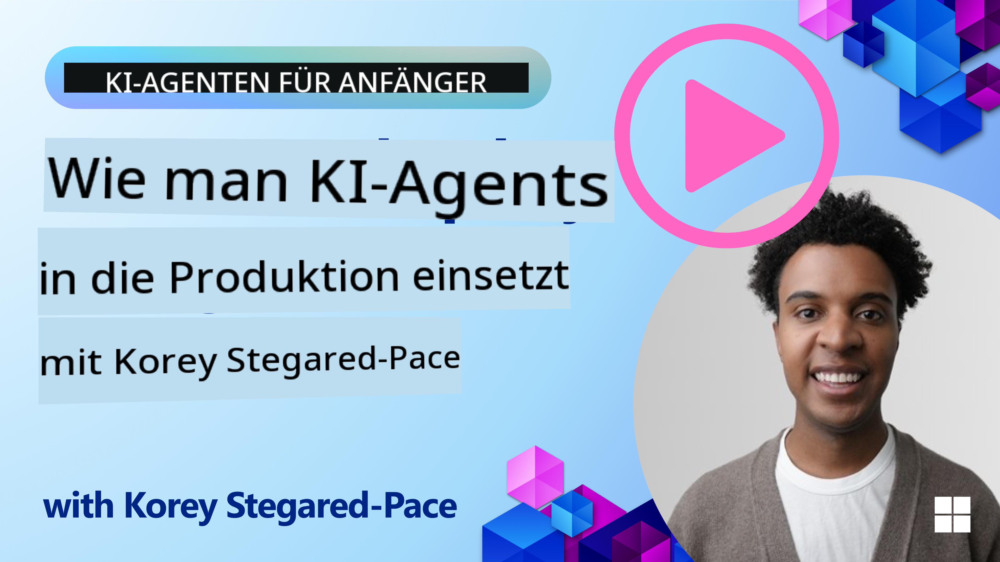

<!--
CO_OP_TRANSLATOR_METADATA:
{
  "original_hash": "44013a98d980c8b92d4b814dc49b545d",
  "translation_date": "2025-03-28T10:52:56+00:00",
  "source_file": "10-ai-agents-production\\README.md",
  "language_code": "de"
}
-->

> _(Klicken Sie auf das Bild oben, um das Video zu dieser Lektion anzusehen)_
# KI-Agenten in der Produktion

## Einführung

Diese Lektion behandelt:

- Wie Sie die Bereitstellung Ihres KI-Agenten für die Produktion effektiv planen.
- Häufige Fehler und Probleme, die bei der Bereitstellung Ihres KI-Agenten für die Produktion auftreten können.
- Wie Sie Kosten managen, während Sie die Leistung Ihres KI-Agenten aufrechterhalten.

## Lernziele

Nach Abschluss dieser Lektion wissen Sie, wie Sie:

- Techniken zur Verbesserung der Leistung, Kosten und Effektivität eines KI-Agenten-Systems in der Produktion anwenden.
- Ihre KI-Agenten bewerten und was dabei zu beachten ist.
- Kosten kontrollieren, wenn KI-Agenten für die Produktion bereitgestellt werden.

Es ist wichtig, vertrauenswürdige KI-Agenten bereitzustellen. Sehen Sie sich die Lektion „Vertrauenswürdige KI-Agenten aufbauen“ an.

## Bewertung von KI-Agenten

Vor, während und nach der Bereitstellung von KI-Agenten ist ein geeignetes System zur Bewertung Ihrer KI-Agenten entscheidend. Dies stellt sicher, dass Ihr System mit Ihren Zielen und denen Ihrer Nutzer übereinstimmt.

Um einen KI-Agenten zu bewerten, ist es wichtig, nicht nur die Ergebnisse des Agenten, sondern auch das gesamte System, in dem Ihr KI-Agent arbeitet, zu analysieren. Dazu gehören unter anderem:

- Die ursprüngliche Modellanfrage.
- Die Fähigkeit des Agenten, die Absicht des Nutzers zu erkennen.
- Die Fähigkeit des Agenten, das richtige Werkzeug zur Ausführung der Aufgabe zu identifizieren.
- Die Antwort des Werkzeugs auf die Anfrage des Agenten.
- Die Fähigkeit des Agenten, die Antwort des Werkzeugs zu interpretieren.
- Das Feedback des Nutzers zur Antwort des Agenten.

Dies ermöglicht Ihnen, Verbesserungsbereiche auf modulare Weise zu identifizieren. Änderungen an Modellen, Eingabeaufforderungen, Werkzeugen und anderen Komponenten können so effizienter überwacht werden.

## Häufige Probleme und mögliche Lösungen bei KI-Agenten

| **Problem**                                    | **Mögliche Lösung**                                                                                                                                                                                                      |
| ---------------------------------------------- | ------------------------------------------------------------------------------------------------------------------------------------------------------------------------------------------------------------------------- |
| KI-Agent führt Aufgaben nicht konsistent aus   | - Verfeinern Sie die Eingabeaufforderung an den KI-Agenten; seien Sie klar in Ihren Zielen. - Überlegen Sie, ob es sinnvoll ist, Aufgaben in Teilaufgaben aufzuteilen und diese von mehreren Agenten bearbeiten zu lassen. |
| KI-Agent gerät in Endlosschleifen              | - Stellen Sie klare Abbruchbedingungen auf, damit der Agent weiß, wann der Prozess beendet werden soll. - Für komplexe Aufgaben, die Argumentation und Planung erfordern, nutzen Sie ein größeres Modell, das darauf spezialisiert ist. |
| Werkzeuganfragen des KI-Agenten funktionieren nicht gut | - Testen und validieren Sie die Ausgabe des Werkzeugs außerhalb des Agenten-Systems. - Verfeinern Sie die definierten Parameter, Eingabeaufforderungen und Benennungen der Werkzeuge.                                   |
| Multi-Agenten-System arbeitet nicht konsistent | - Verfeinern Sie die Eingabeaufforderungen für jeden Agenten, um sicherzustellen, dass sie spezifisch und voneinander abgegrenzt sind. - Erstellen Sie ein hierarchisches System mit einem „Routing“- oder Steuerungsagenten, der entscheidet, welcher Agent der richtige ist. |

## Kostenmanagement

Hier sind einige Strategien, um die Kosten für die Bereitstellung von KI-Agenten in der Produktion zu kontrollieren:

- **Antworten zwischenspeichern** - Häufige Anfragen und Aufgaben zu identifizieren und die Antworten vor der Verarbeitung durch Ihr Agenten-System bereitzustellen, ist eine gute Möglichkeit, das Volumen ähnlicher Anfragen zu reduzieren. Sie können sogar einen Ablauf implementieren, um zu erkennen, wie ähnlich eine Anfrage den zwischengespeicherten Anfragen ist, mithilfe einfacherer KI-Modelle.

- **Kleinere Modelle verwenden** - Kleine Sprachmodelle (SLMs) können bei bestimmten Agenten-Anwendungsfällen gut abschneiden und die Kosten erheblich reduzieren. Wie bereits erwähnt, ist der Aufbau eines Bewertungssystems, um Leistung und Kosten im Vergleich zu größeren Modellen zu vergleichen, die beste Methode, um herauszufinden, wie gut ein SLM für Ihren Anwendungsfall geeignet ist.

- **Router-Modell verwenden** - Eine ähnliche Strategie besteht darin, eine Vielfalt von Modellen und Größen zu verwenden. Sie können ein LLM/SLM oder eine serverlose Funktion nutzen, um Anfragen basierend auf ihrer Komplexität an die am besten geeigneten Modelle weiterzuleiten. Dies hilft, die Kosten zu senken und gleichzeitig die Leistung für die jeweiligen Aufgaben sicherzustellen.

## Glückwunsch

Dies ist derzeit die letzte Lektion von „KI-Agenten für Anfänger“.

Wir planen, basierend auf Feedback und Entwicklungen in dieser stetig wachsenden Branche weitere Lektionen hinzuzufügen. Schauen Sie also bald wieder vorbei.

Wenn Sie Ihre Lernreise und das Arbeiten mit KI-Agenten fortsetzen möchten, treten Sie dem <a href="https://discord.gg/kzRShWzttr" target="_blank">Azure AI Community Discord</a> bei.

Dort veranstalten wir Workshops, Community-Diskussionen und „Ask Me Anything“-Sessions.

Wir haben auch eine Sammlung von Lernmaterialien, die Ihnen helfen können, KI-Agenten in der Produktion zu entwickeln.

## Vorherige Lektion

[Metakognition-Designmuster](../09-metacognition/README.md)

**Haftungsausschluss**:  
Dieses Dokument wurde mithilfe des KI-Übersetzungsdienstes [Co-op Translator](https://github.com/Azure/co-op-translator) übersetzt. Obwohl wir uns um Genauigkeit bemühen, beachten Sie bitte, dass automatisierte Übersetzungen Fehler oder Ungenauigkeiten enthalten können. Das Originaldokument in seiner ursprünglichen Sprache sollte als maßgebliche Quelle betrachtet werden. Für kritische Informationen wird eine professionelle menschliche Übersetzung empfohlen. Wir haften nicht für Missverständnisse oder Fehlinterpretationen, die sich aus der Nutzung dieser Übersetzung ergeben.