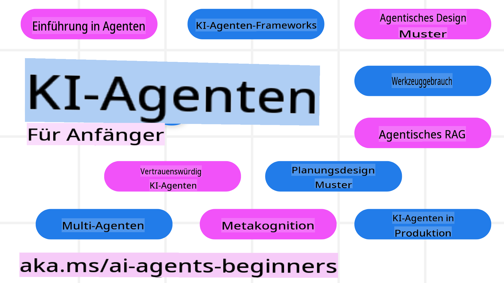

<!--
CO_OP_TRANSLATOR_METADATA:
{
  "original_hash": "09e975d95b470ee45ab546c22ee35d33",
  "translation_date": "2025-03-28T09:59:59+00:00",
  "source_file": "README.md",
  "language_code": "de"
}
-->
# KI-Agenten für Anfänger – Ein Kurs

## 10 Lektionen, die alles vermitteln, was Sie wissen müssen, um KI-Agenten zu erstellen

### Sprachunterstützung

     
 

 

  
 
 

## 🌱 Erste Schritte

Dieser Kurs umfasst 10 Lektionen, die die Grundlagen zum Erstellen von KI-Agenten behandeln. Jede Lektion hat ein eigenes Thema, sodass Sie an jedem beliebigen Punkt beginnen können!

Dieser Kurs bietet Unterstützung für mehrere Sprachen. Sehen Sie sich unsere [verfügbaren Sprachen hier an](../..). 

Wenn Sie zum ersten Mal mit generativen KI-Modellen arbeiten, schauen Sie sich unseren Kurs [Generative KI für Anfänger](https://aka.ms/genai-beginners) an, der 21 Lektionen zum Arbeiten mit GenAI umfasst.

Vergessen Sie nicht, [dieses Repository zu favorisieren (🌟)](https://docs.github.com/en/get-started/exploring-projects-on-github/saving-repositories-with-stars?WT.mc_id=academic-105485-koreyst) und [dieses Repository zu forken](https://github.com/microsoft/ai-agents-for-beginners/fork), um den Code auszuführen.

### Was Sie benötigen 

Jede Lektion in diesem Kurs enthält Codebeispiele, die Sie im Ordner `code_samples` finden können. Sie können [dieses Repository forken](https://github.com/microsoft/ai-agents-for-beginners/fork), um Ihre eigene Kopie zu erstellen.  

Die Codebeispiele in diesen Übungen nutzen Azure AI Foundry und GitHub Model Catalogs, um mit Sprachmodellen zu interagieren:

- [GitHub-Modelle](https://aka.ms/ai-agents-beginners/github-models) - Kostenlos / Begrenzte Nutzung
- [Azure AI Foundry](https://aka.ms/ai-agents-beginners/ai-foundry) - Azure-Konto erforderlich

Dieser Kurs verwendet auch die folgenden KI-Agenten-Frameworks und -Dienste von Microsoft:

- [Azure KI-Agenten-Dienst](https://aka.ms/ai-agents-beginners/ai-agent-service)
- [Semantic Kernel](https://aka.ms/ai-agents-beginners/semantic-kernel)  
- [AutoGen](https://aka.ms/ai-agents/autogen)  

Weitere Informationen zur Ausführung des Codes für diesen Kurs finden Sie unter [Kurs Setup](./00-course-setup/README.md).  

## 🙏 Möchten Sie helfen?  

Haben Sie Vorschläge oder Rechtschreib- oder Codefehler gefunden? [Erstellen Sie ein Issue](https://github.com/microsoft/ai-agents-for-beginners/issues?WT.mc_id=academic-105485-koreyst) oder [Erstellen Sie eine Pull-Request](https://github.com/microsoft/ai-agents-for-beginners/pulls?WT.mc_id=academic-105485-koreyst).  

Wenn Sie nicht weiterkommen oder Fragen zum Aufbau von KI-Agenten haben, treten Sie unserem [Azure AI Community Discord](https://discord.gg/kzRShWzttr) bei.  

## 📂 Jede Lektion enthält  

- Eine schriftliche Lektion im README und ein kurzes Video  
- Python-Codebeispiele, die Azure AI Foundry und Github-Modelle unterstützen (kostenlos)  
- Links zu zusätzlichen Ressourcen, um Ihr Lernen fortzusetzen  

## 🗃️ Lektionen  

| **Lektion**                              | **Text & Code**                                   | **Video**                                                  | **Zusätzliche Ressourcen**                                                            |
|------------------------------------------|--------------------------------------------------|------------------------------------------------------------|---------------------------------------------------------------------------------------|
| Einführung in KI-Agenten und Anwendungsfälle | [Link](./01-intro-to-ai-agents/README.md)         | [Video](https://youtu.be/3zgm60bXmQk?si=z8QygFvYQv-9WtO1)  | [Link](https://aka.ms/ai-agents-beginners/collection?WT.mc_id=academic-105485-koreyst) |
| Erkundung von KI-Agentischen Frameworks   | [Link](./02-explore-agentic-frameworks/README.md) | [Video](https://youtu.be/ODwF-EZo_O8?si=Vawth4hzVaHv-u0H)  | [Link](https://aka.ms/ai-agents-beginners/collection?WT.mc_id=academic-105485-koreyst) |
| Verständnis von Designmustern für KI-Agenten | [Link](./03-agentic-design-patterns/README.md)    | [Video](https://youtu.be/m9lM8qqoOEA?si=BIzHwzstTPL8o9GF)  | [Link](https://aka.ms/ai-agents-beginners/collection?WT.mc_id=academic-105485-koreyst) |
| Designmuster für Tool-Nutzung             | [Link](./04-tool-use/README.md)                   | [Video](https://youtu.be/vieRiPRx-gI?si=2z6O2Xu2cu_Jz46N)  | [Link](https://aka.ms/ai-agents-beginners/collection?WT.mc_id=academic-105485-koreyst) |
| Agentic RAG                               | [Link](./05-agentic-rag/README.md)                | [Video](https://youtu.be/WcjAARvdL7I?si=gKPWsQpKiIlDH9A3)  | [Link](https://aka.ms/ai-agents-beginners/collection?WT.mc_id=academic-105485-koreyst) |
| Vertrauenswürdige KI-Agenten erstellen    | [Link](./06-building-trustworthy-agents/README.md)| [Video](https://youtu.be/iZKkMEGBCUQ?si=jZjpiMnGFOE9L8OK ) | [Link](https://aka.ms/ai-agents-beginners/collection?WT.mc_id=academic-105485-koreyst) |
| Planungs-Designmuster                     | [Link](./07-planning-design/README.md)            | [Video](https://youtu.be/kPfJ2BrBCMY?si=6SC_iv_E5-mzucnC)  | [Link](https://aka.ms/ai-agents-beginners/collection?WT.mc_id=academic-105485-koreyst) |
| Multi-Agent-Designmuster                  | [Link](./08-multi-agent/README.md)                | [Video](https://youtu.be/V6HpE9hZEx0?si=rMgDhEu7wXo2uo6g)  | [Link](https://aka.ms/ai-agents-beginners/collection?WT.mc_id=academic-105485-koreyst) |  
| Metakognitions-Designmuster             | [Link](./09-metacognition/README.md)               | [Video](https://youtu.be/His9R6gw6Ec?si=8gck6vvdSNCt6OcF)  | [Link](https://aka.ms/ai-agents-beginners/collection?WT.mc_id=academic-105485-koreyst) |
| KI-Agenten in der Produktion            | [Link](./10-ai-agents-production/README.md)        | [Video](https://youtu.be/l4TP6IyJxmQ?si=31dnhexRo6yLRJDl)  | [Link](https://aka.ms/ai-agents-beginners/collection?WT.mc_id=academic-105485-koreyst) |

## 🌐 Mehrsprachige Unterstützung

| Sprache              | Code | Link zur übersetzten README                            | Letzte Aktualisierung |
|----------------------|------|--------------------------------------------------------|------------------------|
| Chinesisch (vereinfacht) | zh   | [Chinesische Übersetzung](../zh/README.md) | 24.03.2025            |
| Chinesisch (traditionell)| tw   | [Chinesische Übersetzung](../tw/README.md) | 13.02.2025            |
| Chinesisch (Hongkong) | hk   | [Chinesische (Hongkong) Übersetzung](../hk/README.md) | 13.02.2025            |
| Französisch           | fr   | [Französische Übersetzung](../fr/README.md) | 13.02.2025            |
| Japanisch             | ja   | [Japanische Übersetzung](../ja/README.md)  | 13.02.2025            |
| Koreanisch            | ko   | [Koreanische Übersetzung](../ko/README.md) | 13.02.2025            |
| Portugiesisch         | pt   | [Portugiesische Übersetzung](../pt/README.md) | 13.02.2025            |
| Spanisch              | es   | [Spanische Übersetzung](../es/README.md)   | 13.02.2025            |
| Deutsch               | de   | [Deutsche Übersetzung](./README.md)   | 13.02.2025            |
| Persisch              | fa   | [Persische Übersetzung](../fa/README.md)  | 26.03.2025            |
| Polnisch              | pl   | [Polnische Übersetzung](../pl/README.md)  | 26.03.2025            |

## 🎒 Weitere Kurse

Unser Team produziert weitere Kurse! Schauen Sie sich folgende an:

- [**NEU** Generative KI für Anfänger mit .NET](https://github.com/microsoft/Generative-AI-for-beginners-dotnet?WT.mc_id=academic-105485-koreyst)
- [Generative KI für Anfänger](https://github.com/microsoft/generative-ai-for-beginners?WT.mc_id=academic-105485-koreyst)
- [ML für Anfänger](https://aka.ms/ml-beginners?WT.mc_id=academic-105485-koreyst)
- [Datenwissenschaft für Anfänger](https://aka.ms/datascience-beginners?WT.mc_id=academic-105485-koreyst)
- [KI für Anfänger](https://aka.ms/ai-beginners?WT.mc_id=academic-105485-koreyst)
- [Cybersicherheit für Anfänger](https://github.com/microsoft/Security-101??WT.mc_id=academic-96948-sayoung)
- [Webentwicklung für Anfänger](https://aka.ms/webdev-beginners?WT.mc_id=academic-105485-koreyst)
- [IoT für Anfänger](https://aka.ms/iot-beginners?WT.mc_id=academic-105485-koreyst)
- [XR-Entwicklung für Anfänger](https://github.com/microsoft/xr-development-for-beginners?WT.mc_id=academic-105485-koreyst)
- [GitHub Copilot meistern für KI-gestütztes Pair Programming](https://aka.ms/GitHubCopilotAI?WT.mc_id=academic-105485-koreyst)
- [GitHub Copilot meistern für C#/.NET-Entwickler](https://github.com/microsoft/mastering-github-copilot-for-dotnet-csharp-developers?WT.mc_id=academic-105485-koreyst)
- [Erstellen Sie Ihr eigenes Copilot-Abenteuer](https://github.com/microsoft/CopilotAdventures?WT.mc_id=academic-105485-koreyst)

## 🌟 Community-Dank

Vielen Dank an [Shivam Goyal](https://www.linkedin.com/in/shivam2003/) für die Bereitstellung wichtiger Codebeispiele, die Agentic RAG demonstrieren.

## Beitrag leisten

Dieses Projekt begrüßt Beiträge und Vorschläge. Die meisten Beiträge erfordern, dass Sie einer
Contributor License Agreement (CLA) zustimmen, die erklärt, dass Sie das Recht haben, und tatsächlich tun, uns die
Rechte zur Nutzung Ihres Beitrags zu gewähren. Weitere Informationen finden Sie unter <https://cla.opensource.microsoft.com>.

Wenn Sie eine Pull-Request einreichen, wird ein CLA-Bot automatisch feststellen, ob Sie eine CLA bereitstellen müssen, und die PR entsprechend kennzeichnen (z. B. Statusprüfung, Kommentar). Folgen Sie einfach den Anweisungen des Bots. Sie müssen dies nur einmal für alle Repos tun, die unser CLA verwenden.
Dieses Projekt hat den [Microsoft Open Source Verhaltenskodex](https://opensource.microsoft.com/codeofconduct/) übernommen.  
Weitere Informationen finden Sie in den [FAQ zum Verhaltenskodex](https://opensource.microsoft.com/codeofconduct/faq/) oder  
kontaktieren Sie [opencode@microsoft.com](mailto:opencode@microsoft.com) bei zusätzlichen Fragen oder Anmerkungen.

## Marken

Dieses Projekt kann Marken oder Logos für Projekte, Produkte oder Dienstleistungen enthalten. Die autorisierte Verwendung von Microsoft-Marken oder -Logos unterliegt den [Microsoft-Richtlinien für Marken und Markenauftritt](https://www.microsoft.com/legal/intellectualproperty/trademarks/usage/general) und muss diesen entsprechen.  
Die Verwendung von Microsoft-Marken oder -Logos in modifizierten Versionen dieses Projekts darf keine Verwirrung stiften oder eine Unterstützung durch Microsoft implizieren.  
Jegliche Nutzung von Marken oder Logos Dritter unterliegt den Richtlinien der jeweiligen Drittparteien.

**Haftungsausschluss**:  
Dieses Dokument wurde mit dem KI-Übersetzungsdienst [Co-op Translator](https://github.com/Azure/co-op-translator) übersetzt. Obwohl wir uns um Genauigkeit bemühen, beachten Sie bitte, dass automatisierte Übersetzungen Fehler oder Ungenauigkeiten enthalten können. Das Originaldokument in seiner ursprünglichen Sprache sollte als maßgebliche Quelle betrachtet werden. Für kritische Informationen wird eine professionelle menschliche Übersetzung empfohlen. Wir übernehmen keine Haftung für Missverständnisse oder Fehlinterpretationen, die sich aus der Nutzung dieser Übersetzung ergeben.