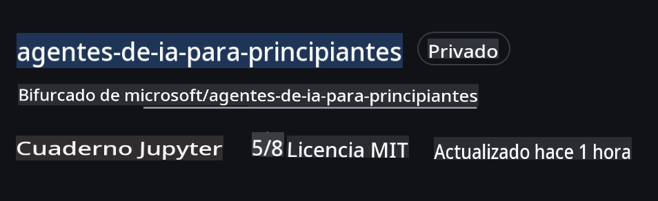
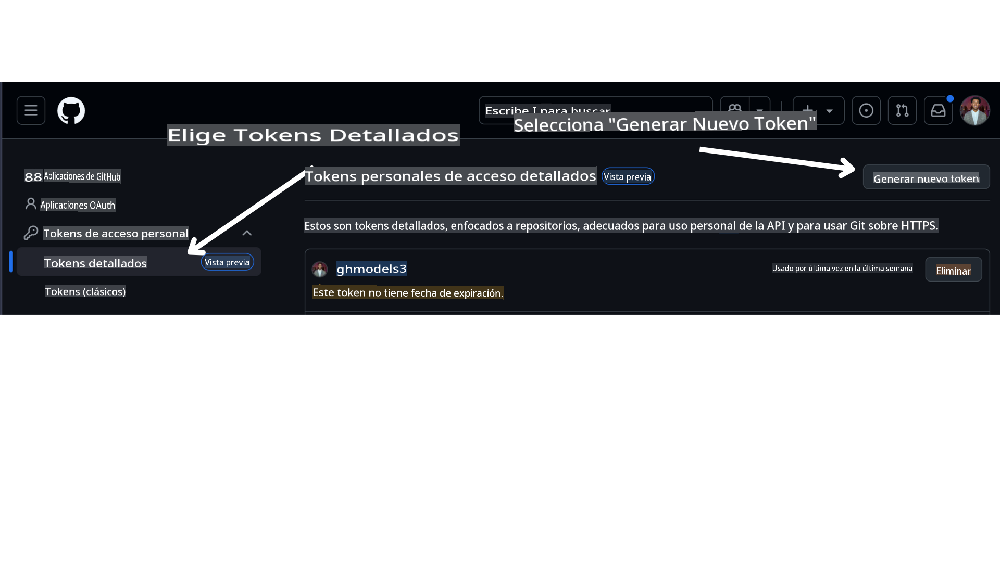

<!--
CO_OP_TRANSLATOR_METADATA:
{
  "original_hash": "366bc6709dd95b8a32ec7c705b0f179c",
  "translation_date": "2025-03-28T10:07:26+00:00",
  "source_file": "00-course-setup\\README.md",
  "language_code": "es"
}
-->
# Configuración del Curso

## Introducción

Esta lección cubrirá cómo ejecutar los ejemplos de código de este curso.

## Requisitos

- Una cuenta de GitHub
- Python 3.12+
- Suscripción a Azure
- Cuenta en Azure AI Foundry

## Clonar o hacer un Fork de este repositorio

Para comenzar, por favor clona o haz un fork del repositorio de GitHub. Esto creará tu propia versión del material del curso para que puedas ejecutar, probar y ajustar el código.

Esto se puede hacer haciendo clic en el enlace a



## Obtener tu token de acceso personal (PAT) de GitHub

Actualmente, este curso utiliza el Marketplace de Modelos de GitHub para ofrecer acceso gratuito a los Modelos de Lenguaje Extenso (LLMs) que se usarán para crear Agentes de IA.

Para acceder a este servicio, necesitarás crear un token de acceso personal de GitHub.

Esto se puede hacer en tu cuenta de GitHub.

Selecciona la opción `Fine-grained tokens` en el lado izquierdo de tu pantalla.

Luego selecciona `Generate new token`.



Copia tu nuevo token que acabas de crear. Ahora lo agregarás a tu archivo `.env` incluido en este curso.

## Agregar esto a tus variables de entorno

Para crear tu archivo `.env` ejecuta el siguiente comando en tu terminal:

```bash
cp .env.example .env
```

Esto copiará el archivo de ejemplo y creará un `.env` en tu directorio. Llena los valores de las variables de entorno. Puedes localizar los valores de cada variable de entorno en las siguientes ubicaciones del portal de [Azure AI Foundry](https://ai.azure.com?WT.mc_id=academic-105485-koreyst):

Abre ese archivo y pega el token que creaste en `GITHUB_TOKEN=` field of the .env file. 
- `AZURE_SUBSCRIPTION_ID` - On the **Overview** page of your project within **Project details**.
- `AZURE_AI_PROJECT_NAME` - At the top of the **Overview** page for your project.
- `AZURE_OPENAI_RESOURCE_GROUP` - On the **Overview** page of the **Management Center** within **Project properties**.
- `AZURE_OPENAI_SERVICE` - On the **Overview** page of your project in the **Included capabilities** tab for **Azure OpenAI Service**.
- `AZURE_OPENAI_API_VERSION` - On the [API version lifecycle](https://learn.microsoft.com/azure/ai-services/openai/api-version-deprecation#latest-ga-api-release?WT.mc_id=academic-105485-koreyst) webpage within the **Latest GA API release** section.
- `AZURE_OPENAI_ENDPOINT` - En la pestaña **Detalles** de tu implementación de modelo dentro de **Endpoint** (es decir, **Target URI**).

## Instalar paquetes requeridos

Para asegurarte de tener todos los paquetes de Python necesarios para ejecutar el código, ejecuta el siguiente comando en tu terminal.

Recomendamos crear un entorno virtual de Python para evitar conflictos y problemas.

```bash
pip install -r requirements.txt
```

Esto debería instalar los paquetes de Python requeridos.

# Iniciar sesión en Azure

Como una práctica recomendada de seguridad, utilizaremos [autenticación sin claves](https://learn.microsoft.com/azure/developer/ai/keyless-connections?tabs=csharp%2Cazure-cli?WT.mc_id=academic-105485-koreyst) para autenticar en Azure OpenAI con Microsoft Entra ID. Antes de poder hacerlo, primero necesitarás instalar el **Azure CLI** según las [instrucciones de instalación](https://learn.microsoft.com/cli/azure/install-azure-cli?WT.mc_id=academic-105485-koreyst) para tu sistema operativo.

Luego, abre una terminal y ejecuta `az login` to sign in to your Azure account.

## Sign in to Azure

Login with your Azure AI account used to provision the Azure resources.

Open a new terminal and enter the following command and follow the instructions in the terminal:

`az login --use-device-code`

Once you've logged in, select your subscription in the terminal.

## Access the environment variables.

We'll import `os` and `load_dotenv` para que puedas acceder a las variables de entorno.

```python
import os
from dotenv import load_dotenv

load_dotenv()
```

## Configurar autenticación sin claves

En lugar de codificar tus credenciales, utilizaremos una conexión sin claves con Azure OpenAI. Para hacerlo, importaremos la función `DefaultAzureCredential` and later call the `DefaultAzureCredential` para obtener las credenciales.

```python
from azure.identity import DefaultAzureCredential, InteractiveBrowserCredential
```

¡Ahora estás listo para ejecutar el código de este curso! Disfruta aprendiendo más sobre el mundo de los Agentes de IA.

Si tienes algún problema al ejecutar esta configuración, únete a nuestro

## Próxima Lección

[Introducción a los Agentes de IA y Casos de Uso de Agentes](../01-intro-to-ai-agents/README.md)

**Descargo de responsabilidad**:  
Este documento ha sido traducido utilizando el servicio de traducción automática [Co-op Translator](https://github.com/Azure/co-op-translator). Si bien nos esforzamos por lograr precisión, tenga en cuenta que las traducciones automáticas pueden contener errores o imprecisiones. El documento original en su idioma nativo debe considerarse como la fuente autorizada. Para información crítica, se recomienda una traducción profesional realizada por humanos. No nos hacemos responsables de malentendidos o interpretaciones erróneas que surjan del uso de esta traducción.