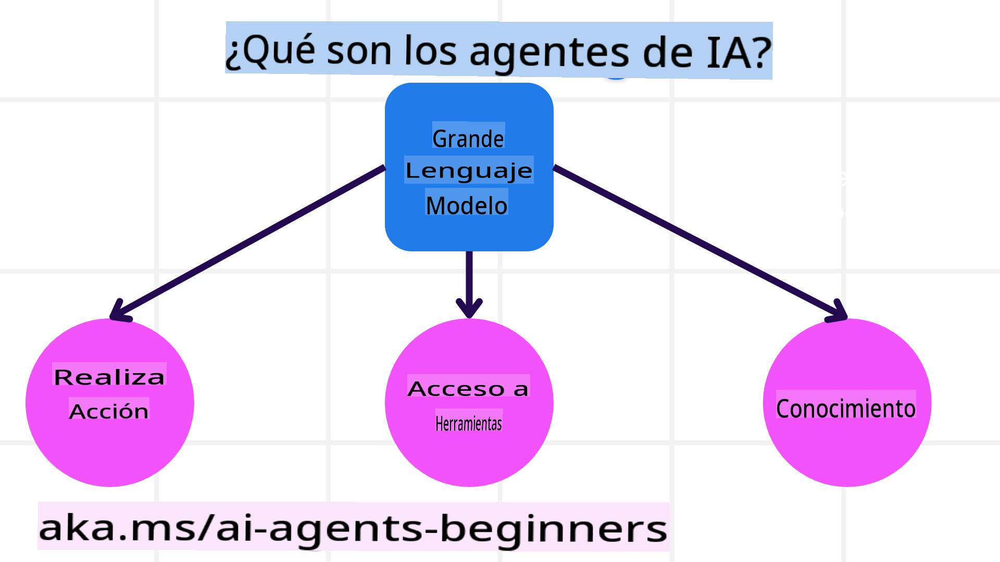
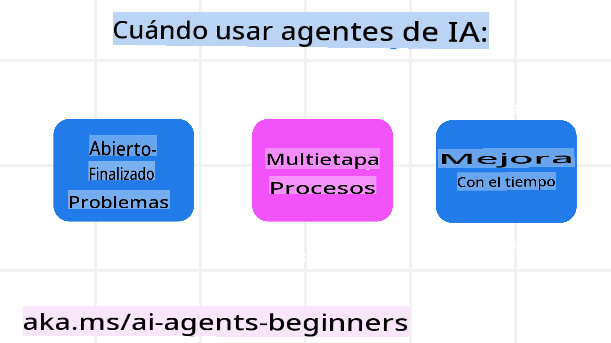

<!--
CO_OP_TRANSLATOR_METADATA:
{
  "original_hash": "233e7a18025a27eae95b653e9b5b5aa5",
  "translation_date": "2025-03-28T10:08:57+00:00",
  "source_file": "01-intro-to-ai-agents\\README.md",
  "language_code": "es"
}
-->

> _(Haz clic en la imagen de arriba para ver el video de esta lección)_

# Introducción a los Agentes de IA y Casos de Uso de Agentes

¡Bienvenido al curso "Agentes de IA para Principiantes"! Este curso proporciona conocimientos fundamentales y ejemplos prácticos para construir Agentes de IA.

Únete al grupo para conocer a otros estudiantes y constructores de Agentes de IA, y haz cualquier pregunta que tengas sobre este curso.

Para comenzar este curso, primero obtendremos una mejor comprensión de qué son los Agentes de IA y cómo podemos utilizarlos en las aplicaciones y flujos de trabajo que desarrollamos.

## Introducción

Esta lección cubre:

- ¿Qué son los Agentes de IA y cuáles son los diferentes tipos de agentes?
- ¿Qué casos de uso son ideales para los Agentes de IA y cómo pueden ayudarnos?
- ¿Cuáles son algunos de los bloques básicos al diseñar Soluciones Agénticas?

## Objetivos de Aprendizaje

Después de completar esta lección, deberías ser capaz de:

- Comprender los conceptos de Agentes de IA y cómo se diferencian de otras soluciones de IA.
- Aplicar los Agentes de IA de manera eficiente.
- Diseñar soluciones agénticas de forma productiva para usuarios y clientes.

## Definiendo los Agentes de IA y Tipos de Agentes de IA

### ¿Qué son los Agentes de IA?

Los Agentes de IA son **sistemas** que permiten que los **Modelos de Lenguaje Extensos (LLMs)** **realicen acciones** al extender sus capacidades mediante el acceso a **herramientas** y **conocimiento**.

Desglosaremos esta definición en partes más pequeñas:

- **Sistema** - Es importante pensar en los agentes no como un único componente, sino como un sistema compuesto por muchos componentes. A nivel básico, los componentes de un Agente de IA son:
  - **Entorno** - El espacio definido donde opera el Agente de IA. Por ejemplo, si tuviéramos un agente de reservas de viajes, el entorno podría ser el sistema de reservas que el agente utiliza para completar tareas.
  - **Sensores** - Los entornos tienen información y proporcionan retroalimentación. Los Agentes de IA utilizan sensores para recopilar e interpretar esta información sobre el estado actual del entorno. En el ejemplo del agente de reservas de viajes, el sistema de reservas puede proporcionar información como disponibilidad de hoteles o precios de vuelos.
  - **Actuadores** - Una vez que el Agente de IA recibe el estado actual del entorno, determina qué acción realizar para cambiar el entorno en función de la tarea actual. Para el agente de reservas de viajes, podría ser reservar una habitación disponible para el usuario.

**Modelos de Lenguaje Extensos** - El concepto de agentes existía antes de la creación de los LLMs. La ventaja de construir Agentes de IA con LLMs es su capacidad para interpretar el lenguaje humano y los datos. Esta habilidad permite a los LLMs interpretar información ambiental y definir un plan para cambiar el entorno.

**Realizar Acciones** - Fuera de los sistemas de Agentes de IA, los LLMs están limitados a situaciones donde la acción consiste en generar contenido o información basada en el prompt del usuario. Dentro de los sistemas de Agentes de IA, los LLMs pueden completar tareas interpretando la solicitud del usuario y utilizando herramientas disponibles en su entorno.

**Acceso a Herramientas** - Las herramientas a las que tiene acceso el LLM se definen por 1) el entorno en el que opera y 2) el desarrollador del Agente de IA. En nuestro ejemplo de agente de viajes, las herramientas del agente están limitadas por las operaciones disponibles en el sistema de reservas y/o el desarrollador puede limitar el acceso del agente a vuelos.

**Conocimiento** - Además de la información proporcionada por el entorno, los Agentes de IA también pueden recuperar conocimiento de otros sistemas, servicios, herramientas e incluso otros agentes. En el ejemplo del agente de viajes, este conocimiento podría ser la información sobre las preferencias de viaje del usuario ubicada en una base de datos de clientes.

### Los diferentes tipos de agentes

Ahora que tenemos una definición general de los Agentes de IA, veamos algunos tipos específicos de agentes y cómo se aplicarían a un agente de reservas de viajes.

| **Tipo de Agente**            | **Descripción**                                                                                                                       | **Ejemplo**                                                                                                                                                                                                                   |
| ----------------------------- | ------------------------------------------------------------------------------------------------------------------------------------- | ----------------------------------------------------------------------------------------------------------------------------------------------------------------------------------------------------------------------------- |
| **Agentes de Reflexión Simple** | Realizan acciones inmediatas basadas en reglas predefinidas.                                                                           | El agente de viajes interpreta el contexto del correo electrónico y reenvía las quejas de viajes al servicio al cliente.                                                                                                     |
| **Agentes de Reflexión Basados en Modelos** | Realizan acciones basadas en un modelo del mundo y los cambios en ese modelo.                                                       | El agente de viajes prioriza rutas con cambios significativos en precios basándose en el acceso a datos históricos de precios.                                                                                              |
| **Agentes Basados en Objetivos** | Crean planes para alcanzar objetivos específicos interpretando el objetivo y determinando las acciones necesarias para lograrlo.       | El agente de viajes reserva un viaje determinando los arreglos necesarios (auto, transporte público, vuelos) desde la ubicación actual hasta el destino.                                                                     |
| **Agentes Basados en Utilidad** | Consideran preferencias y evalúan compensaciones numéricas para determinar cómo alcanzar objetivos.                                    | El agente de viajes maximiza la utilidad al sopesar conveniencia vs. costo al reservar viajes.                                                                                                                              |
| **Agentes de Aprendizaje**      | Mejoran con el tiempo respondiendo a retroalimentación y ajustando sus acciones en consecuencia.                                      | El agente de viajes mejora utilizando la retroalimentación de encuestas posteriores al viaje para realizar ajustes en futuras reservas.                                                                                     |
| **Agentes Jerárquicos**         | Incluyen múltiples agentes en un sistema escalonado, donde agentes de nivel superior dividen tareas en subtareas para que agentes de nivel inferior las completen. | El agente de viajes cancela un viaje dividiendo la tarea en subtareas (por ejemplo, cancelar reservas específicas) y haciendo que agentes de nivel inferior las completen, informando al agente de nivel superior.          |
| **Sistemas Multi-Agente (MAS)** | Los agentes completan tareas de manera independiente, ya sea cooperativa o competitivamente.                                           | Cooperativo: Múltiples agentes reservan servicios de viaje específicos como hoteles, vuelos y entretenimiento. Competitivo: Múltiples agentes gestionan y compiten por un calendario compartido de reservas de hotel.       |

## Cuándo Usar Agentes de IA

En la sección anterior, utilizamos el caso de uso de un agente de viajes para explicar cómo los diferentes tipos de agentes pueden ser utilizados en diferentes escenarios de reserva de viajes. Continuaremos usando esta aplicación a lo largo del curso.

Veamos los tipos de casos de uso para los que los Agentes de IA son más adecuados:

- **Problemas Abiertos** - Permitir que el LLM determine los pasos necesarios para completar una tarea porque no siempre se pueden codificar directamente en un flujo de trabajo.
- **Procesos de Múltiples Pasos** - Tareas que requieren un nivel de complejidad en el que el Agente de IA necesita usar herramientas o información en múltiples interacciones en lugar de una recuperación única.  
- **Mejora con el Tiempo** - Tareas donde el agente puede mejorar con el tiempo al recibir retroalimentación de su entorno o de los usuarios para proporcionar una mejor utilidad.

Cubriremos más consideraciones sobre el uso de Agentes de IA en la lección sobre Construcción de Agentes de IA Confiables.

## Fundamentos de las Soluciones Agénticas

### Desarrollo de Agentes

El primer paso para diseñar un sistema de Agentes de IA es definir las herramientas, acciones y comportamientos. En este curso, nos enfocamos en usar el **Azure AI Agent Service** para definir nuestros agentes. Ofrece características como:

- Selección de Modelos Abiertos como OpenAI, Mistral y Llama
- Uso de Datos Licenciados a través de proveedores como Tripadvisor
- Uso de herramientas estándar OpenAPI 3.0

### Patrones Agénticos

La comunicación con los LLMs se realiza a través de prompts. Dada la naturaleza semiautónoma de los Agentes de IA, no siempre es posible o necesario reconfigurar manualmente el prompt del LLM después de un cambio en el entorno. Utilizamos **Patrones Agénticos** que nos permiten configurar el prompt del LLM en múltiples pasos de una manera más escalable.

Este curso está dividido en algunos de los patrones agénticos más populares actualmente.

### Frameworks Agénticos

Los Frameworks Agénticos permiten a los desarrolladores implementar patrones agénticos mediante código. Estos frameworks ofrecen plantillas, plugins y herramientas para una mejor colaboración entre Agentes de IA. Estos beneficios proporcionan capacidades para una mejor observabilidad y solución de problemas en sistemas de Agentes de IA.

En este curso, exploraremos el framework AutoGen basado en investigación y el framework Agent listo para producción de Semantic Kernel.

## Lección Anterior

[Configuración del Curso](../00-course-setup/README.md)

## Próxima Lección

[Explorando Frameworks Agénticos](../02-explore-agentic-frameworks/README.md)

**Descargo de responsabilidad**:  
Este documento ha sido traducido utilizando el servicio de traducción automática [Co-op Translator](https://github.com/Azure/co-op-translator). Si bien nos esforzamos por garantizar la precisión, tenga en cuenta que las traducciones automatizadas pueden contener errores o imprecisiones. El documento original en su idioma nativo debe considerarse la fuente autorizada. Para información crítica, se recomienda la traducción profesional realizada por humanos. No nos hacemos responsables de malentendidos o interpretaciones erróneas que puedan surgir del uso de esta traducción.