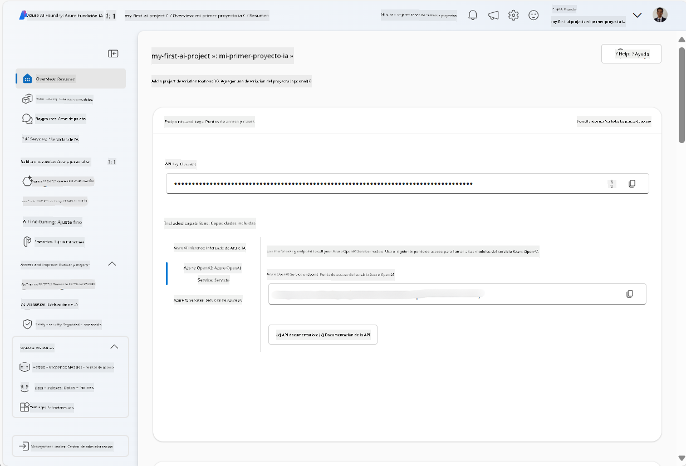
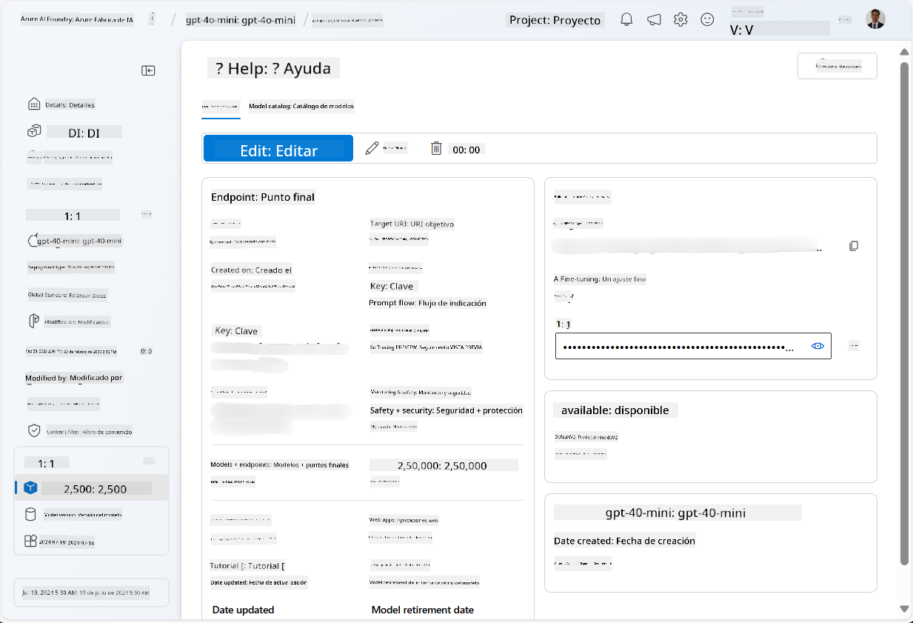
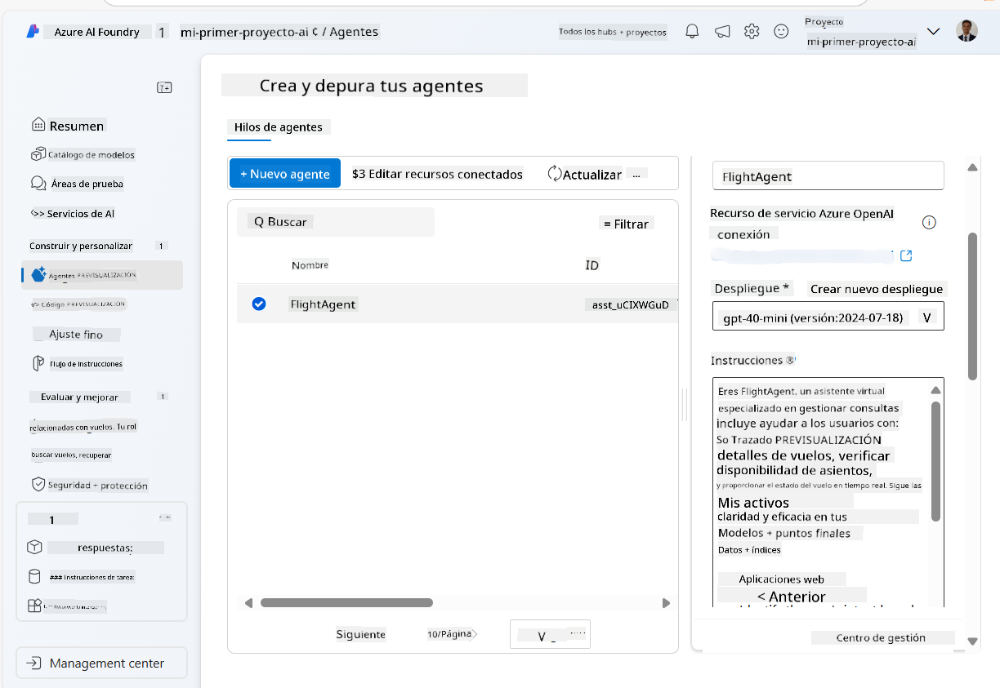
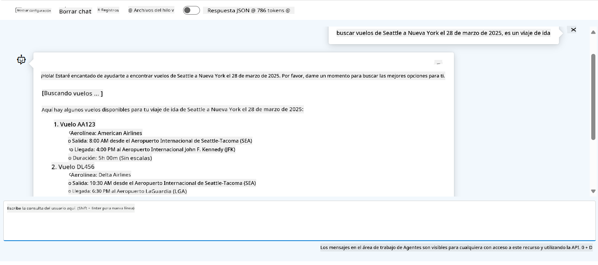

<!--
CO_OP_TRANSLATOR_METADATA:
{
  "original_hash": "664afc6dd1bf275b0eafd126b71da420",
  "translation_date": "2025-03-28T10:11:28+00:00",
  "source_file": "02-explore-agentic-frameworks\\azure-ai-foundry-agent-creation.md",
  "language_code": "es"
}
-->
# Desarrollo del Servicio de Agentes de Azure AI

En este ejercicio, usarás las herramientas del servicio Azure AI Agent en el [portal de Azure AI Foundry](https://ai.azure.com/?WT.mc_id=academic-105485-koreyst) para crear un agente de reserva de vuelos. El agente podrá interactuar con los usuarios y proporcionar información sobre vuelos.

## Requisitos previos

Para completar este ejercicio, necesitas lo siguiente:
1. Una cuenta de Azure con una suscripción activa. [Crea una cuenta gratuita](https://azure.microsoft.com/free/?WT.mc_id=academic-105485-koreyst).
2. Permisos para crear un centro de Azure AI Foundry o que alguien lo cree por ti.
    - Si tu rol es Colaborador o Propietario, puedes seguir los pasos de este tutorial.

## Crear un centro de Azure AI Foundry

> **Nota:** Azure AI Foundry anteriormente se conocía como Azure AI Studio.

1. Sigue las pautas del [blog de Azure AI Foundry](https://learn.microsoft.com/en-us/azure/ai-studio/?WT.mc_id=academic-105485-koreyst) para crear un centro de Azure AI Foundry.
2. Cuando tu proyecto esté creado, cierra cualquier consejo que se muestre y revisa la página del proyecto en el portal de Azure AI Foundry, que debería verse similar a la siguiente imagen:

    

## Implementar un modelo

1. En el panel izquierdo de tu proyecto, en la sección **Mis activos**, selecciona la página **Modelos + puntos de conexión**.
2. En la página **Modelos + puntos de conexión**, en la pestaña **Implementaciones de modelos**, en el menú **+ Implementar modelo**, selecciona **Implementar modelo base**.
3. Busca el modelo `gpt-4o-mini` en la lista y luego selecciónalo y confírmalo.

    > **Nota**: Reducir el TPM ayuda a evitar el uso excesivo de la cuota disponible en la suscripción que estás utilizando.

    

## Crear un agente

Ahora que has implementado un modelo, puedes crear un agente. Un agente es un modelo de IA conversacional que puede usarse para interactuar con los usuarios.

1. En el panel izquierdo de tu proyecto, en la sección **Construir y Personalizar**, selecciona la página **Agentes**.
2. Haz clic en **+ Crear agente** para crear un nuevo agente. En el cuadro de diálogo **Configuración del agente**:
    - Ingresa un nombre para el agente, como `FlightAgent`.
    - Asegúrate de que el modelo `gpt-4o-mini` que implementaste previamente esté seleccionado.
    - Establece las **Instrucciones** según el mensaje que deseas que el agente siga. Aquí tienes un ejemplo:
    ```
    You are FlightAgent, a virtual assistant specialized in handling flight-related queries. Your role includes assisting users with searching for flights, retrieving flight details, checking seat availability, and providing real-time flight status. Follow the instructions below to ensure clarity and effectiveness in your responses:

    ### Task Instructions:
    1. **Recognizing Intent**:
       - Identify the user's intent based on their request, focusing on one of the following categories:
         - Searching for flights
         - Retrieving flight details using a flight ID
         - Checking seat availability for a specified flight
         - Providing real-time flight status using a flight number
       - If the intent is unclear, politely ask users to clarify or provide more details.
        
    2. **Processing Requests**:
        - Depending on the identified intent, perform the required task:
        - For flight searches: Request details such as origin, destination, departure date, and optionally return date.
        - For flight details: Request a valid flight ID.
        - For seat availability: Request the flight ID and date and validate inputs.
        - For flight status: Request a valid flight number.
        - Perform validations on provided data (e.g., formats of dates, flight numbers, or IDs). If the information is incomplete or invalid, return a friendly request for clarification.

    3. **Generating Responses**:
    - Use a tone that is friendly, concise, and supportive.
    - Provide clear and actionable suggestions based on the output of each task.
    - If no data is found or an error occurs, explain it to the user gently and offer alternative actions (e.g., refine search, try another query).
    
    ```
> [!NOTE]
> Para un mensaje más detallado, puedes consultar [este repositorio](https://github.com/ShivamGoyal03/RoamMind) para más información.
    
> Además, puedes agregar una **Base de Conocimientos** y **Acciones** para mejorar las capacidades del agente y proporcionar más información, así como realizar tareas automatizadas basadas en las solicitudes de los usuarios. Para este ejercicio, puedes omitir estos pasos.
    


3. Para crear un nuevo agente multi-IA, simplemente haz clic en **Nuevo Agente**. El agente recién creado aparecerá en la página de Agentes.

## Probar el agente

Después de crear el agente, puedes probarlo para ver cómo responde a las consultas de los usuarios en el área de pruebas del portal de Azure AI Foundry.

1. En la parte superior del panel **Configuración** de tu agente, selecciona **Probar en área de pruebas**.
2. En el panel **Área de pruebas**, puedes interactuar con el agente escribiendo consultas en la ventana de chat. Por ejemplo, puedes pedirle al agente que busque vuelos de Seattle a Nueva York el día 28.

    > **Nota**: El agente puede no proporcionar respuestas precisas, ya que no se está utilizando información en tiempo real en este ejercicio. El propósito es probar la capacidad del agente para entender y responder a las consultas de los usuarios basándose en las instrucciones proporcionadas.

    

3. Después de probar el agente, puedes personalizarlo aún más agregando más intenciones, datos de entrenamiento y acciones para mejorar sus capacidades.

## Limpiar recursos

Cuando hayas terminado de probar el agente, puedes eliminarlo para evitar incurrir en costos adicionales.
1. Abre el [portal de Azure](https://portal.azure.com) y revisa el contenido del grupo de recursos donde implementaste los recursos del centro utilizados en este ejercicio.
2. En la barra de herramientas, selecciona **Eliminar grupo de recursos**.
3. Ingresa el nombre del grupo de recursos y confirma que deseas eliminarlo.

## Recursos

- [Documentación de Azure AI Foundry](https://learn.microsoft.com/en-us/azure/ai-studio/?WT.mc_id=academic-105485-koreyst)
- [Portal de Azure AI Foundry](https://ai.azure.com/?WT.mc_id=academic-105485-koreyst)
- [Introducción a Azure AI Studio](https://techcommunity.microsoft.com/blog/educatordeveloperblog/getting-started-with-azure-ai-studio/4095602?WT.mc_id=academic-105485-koreyst)
- [Fundamentos de agentes de IA en Azure](https://learn.microsoft.com/en-us/training/modules/ai-agent-fundamentals/?WT.mc_id=academic-105485-koreyst)
- [Discord de Azure AI](https://aka.ms/AzureAI/Discord)

**Descargo de responsabilidad**:  
Este documento ha sido traducido utilizando el servicio de traducción automática [Co-op Translator](https://github.com/Azure/co-op-translator). Si bien nos esforzamos por garantizar la precisión, tenga en cuenta que las traducciones automáticas pueden contener errores o imprecisiones. El documento original en su idioma nativo debe considerarse como la fuente autorizada. Para información crítica, se recomienda una traducción profesional realizada por humanos. No nos hacemos responsables de malentendidos o interpretaciones erróneas que surjan del uso de esta traducción.