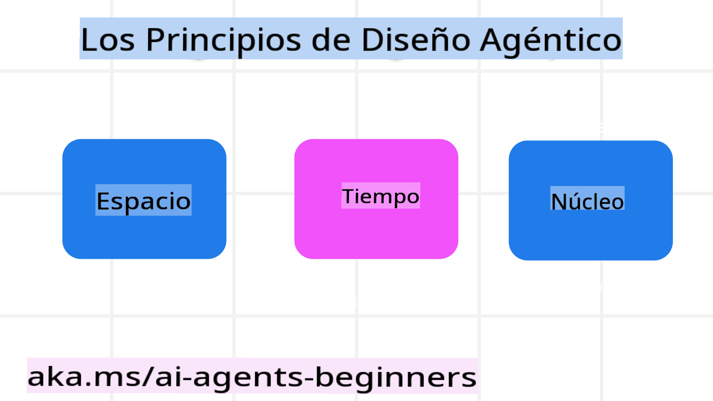

<!--
CO_OP_TRANSLATOR_METADATA:
{
  "original_hash": "969885aab5f923f67f134ce115fbbcaf",
  "translation_date": "2025-03-28T10:19:41+00:00",
  "source_file": "03-agentic-design-patterns\\README.md",
  "language_code": "es"
}
-->

> _(Haz clic en la imagen de arriba para ver el video de esta lección)_
# Principios de Diseño de Agentes de IA

## Introducción

Existen muchas formas de pensar en la construcción de Sistemas Agentes de IA. Dado que la ambigüedad es una característica y no un defecto en el diseño de IA Generativa, a veces es difícil para los ingenieros saber por dónde empezar. Hemos creado un conjunto de Principios de Diseño UX centrados en el ser humano para permitir a los desarrolladores construir sistemas agentes centrados en el cliente que resuelvan sus necesidades empresariales. Estos principios de diseño no son una arquitectura prescriptiva, sino más bien un punto de partida para los equipos que están definiendo y desarrollando experiencias de agentes.

En general, los agentes deberían:

- Ampliar y escalar las capacidades humanas (lluvia de ideas, resolución de problemas, automatización, etc.)
- Rellenar lagunas de conocimiento (ponerme al día en dominios de conocimiento, traducción, etc.)
- Facilitar y apoyar la colaboración de la manera en que preferimos trabajar con otros
- Ayudarnos a ser mejores versiones de nosotros mismos (por ejemplo, entrenador personal/gestor de tareas, ayudándonos a aprender habilidades de regulación emocional y mindfulness, desarrollando resiliencia, etc.)

## Esta Lección Cubrirá

- Qué son los Principios de Diseño de Agentes
- Cuáles son algunas pautas a seguir al implementar estos principios de diseño
- Ejemplos de uso de los principios de diseño

## Objetivos de Aprendizaje

Al completar esta lección, serás capaz de:

1. Explicar qué son los Principios de Diseño de Agentes
2. Explicar las pautas para usar los Principios de Diseño de Agentes
3. Entender cómo construir un agente utilizando los Principios de Diseño de Agentes

## Los Principios de Diseño de Agentes

### Agente (Espacio)

Este es el entorno en el que opera el agente. Estos principios informan cómo diseñamos agentes para interactuar en mundos físicos y digitales.

- **Conectar, no colapsar** – ayudar a conectar a las personas con otras personas, eventos y conocimiento accionable para permitir la colaboración y conexión.
  - Los agentes ayudan a conectar eventos, conocimiento y personas.
  - Los agentes acercan a las personas. No están diseñados para reemplazar o menospreciar a las personas.
- **Fácilmente accesible pero ocasionalmente invisible** – el agente opera mayormente en segundo plano y solo nos da avisos cuando es relevante y apropiado.
  - El agente es fácilmente descubrible y accesible para usuarios autorizados en cualquier dispositivo o plataforma.
  - El agente soporta entradas y salidas multimodales (sonido, voz, texto, etc.).
  - El agente puede cambiar sin problemas entre primer plano y segundo plano; entre ser proactivo y reactivo, dependiendo de cómo perciba las necesidades del usuario.
  - El agente puede operar de forma invisible, pero su proceso en segundo plano y su colaboración con otros agentes son transparentes y controlables por el usuario.

### Agente (Tiempo)

Este es el modo en que el agente opera a lo largo del tiempo. Estos principios informan cómo diseñamos agentes que interactúan con el pasado, presente y futuro.

- **Pasado**: Reflexionando sobre la historia que incluye tanto el estado como el contexto.
  - El agente proporciona resultados más relevantes basándose en el análisis de datos históricos más ricos, más allá del evento, las personas o los estados.
  - El agente crea conexiones a partir de eventos pasados y reflexiona activamente sobre la memoria para interactuar con situaciones actuales.
- **Ahora**: Más empujar que notificar.
  - El agente adopta un enfoque integral para interactuar con las personas. Cuando ocurre un evento, el agente va más allá de una notificación estática u otra formalidad estática. Puede simplificar flujos o generar dinámicamente señales para dirigir la atención del usuario en el momento adecuado.
  - El agente entrega información basada en el entorno contextual, los cambios sociales y culturales, y adaptada a la intención del usuario.
  - La interacción del agente puede ser gradual, evolucionando/creciendo en complejidad para empoderar a los usuarios a largo plazo.
- **Futuro**: Adaptándose y evolucionando.
  - El agente se adapta a diversos dispositivos, plataformas y modalidades.
  - El agente se adapta al comportamiento del usuario, a las necesidades de accesibilidad, y es completamente personalizable.
  - El agente se moldea y evoluciona a través de la interacción continua con el usuario.

### Agente (Núcleo)

Estos son los elementos clave en el núcleo del diseño de un agente.

- **Abrazar la incertidumbre pero establecer confianza**.
  - Se espera un cierto nivel de incertidumbre en el agente. La incertidumbre es un elemento clave del diseño de agentes.
  - La confianza y la transparencia son capas fundamentales del diseño de agentes.
  - Los humanos tienen el control de cuándo el agente está activado/desactivado, y el estado del agente es claramente visible en todo momento.

## Las Pautas para Implementar Estos Principios

Cuando uses los principios de diseño anteriores, sigue las siguientes pautas:

1. **Transparencia**: Informa al usuario que se está utilizando IA, cómo funciona (incluyendo acciones pasadas) y cómo dar retroalimentación y modificar el sistema.
2. **Control**: Permite al usuario personalizar, especificar preferencias y personalizar, y tener control sobre el sistema y sus atributos (incluyendo la capacidad de olvidar).
3. **Consistencia**: Busca experiencias consistentes y multimodales en dispositivos y puntos de contacto. Usa elementos familiares de UI/UX siempre que sea posible (por ejemplo, el ícono de micrófono para interacción por voz) y reduce la carga cognitiva del cliente tanto como sea posible (por ejemplo, respuestas concisas, ayudas visuales y contenido de ‘Aprender más’).

## Cómo Diseñar un Agente de Viajes Usando Estos Principios y Pautas

Imagina que estás diseñando un Agente de Viajes, aquí tienes cómo podrías pensar en usar los Principios y Pautas de Diseño:

1. **Transparencia** – Informa al usuario que el Agente de Viajes es un Agente habilitado por IA. Proporciona algunas instrucciones básicas sobre cómo comenzar (por ejemplo, un mensaje de “Hola”, ejemplos de solicitudes). Documenta esto claramente en la página del producto. Muestra la lista de solicitudes que el usuario ha hecho en el pasado. Haz claro cómo dar retroalimentación (pulgar arriba y abajo, botón de Enviar Comentarios, etc.). Articula claramente si el Agente tiene restricciones de uso o temas.
2. **Control** – Asegúrate de que esté claro cómo el usuario puede modificar el Agente después de que ha sido creado, con cosas como el System Prompt. Permite al usuario elegir cuán detallado es el Agente, su estilo de escritura, y cualquier restricción sobre lo que el Agente no debería hablar. Permite al usuario ver y eliminar cualquier archivo o dato asociado, solicitudes y conversaciones pasadas.
3. **Consistencia** – Asegúrate de que los íconos para Compartir Solicitud, agregar un archivo o foto y etiquetar a alguien o algo sean estándar y reconocibles. Usa el ícono de clip para indicar carga/compartición de archivos con el Agente, y un ícono de imagen para indicar carga de gráficos.

## Recursos Adicionales

- 

## Lección Anterior

[Explorando Marcos Agénticos](../02-explore-agentic-frameworks/README.md)

## Próxima Lección

[Patrón de Diseño de Uso de Herramientas](../04-tool-use/README.md)

**Descargo de responsabilidad**:  
Este documento ha sido traducido utilizando el servicio de traducción por IA [Co-op Translator](https://github.com/Azure/co-op-translator). Aunque nos esforzamos por garantizar la precisión, tenga en cuenta que las traducciones automatizadas pueden contener errores o imprecisiones. El documento original en su idioma nativo debe considerarse como la fuente autorizada. Para información crítica, se recomienda una traducción profesional realizada por humanos. No nos hacemos responsables de malentendidos o interpretaciones erróneas que surjan del uso de esta traducción.