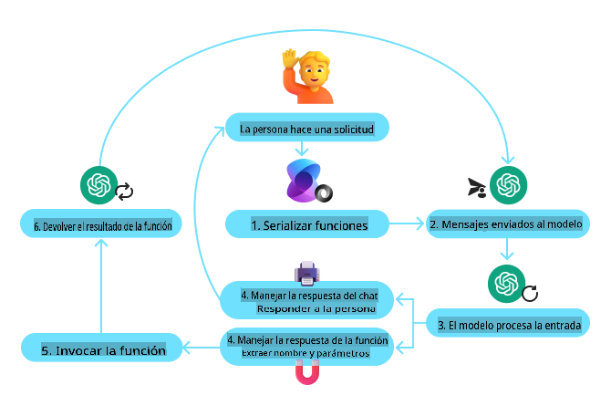

# Patrón de Diseño para el Uso de Herramientas  

## Introducción

En esta lección, buscamos responder las siguientes preguntas:

- ¿Qué es el patrón de diseño para el uso de herramientas?
- ¿En qué casos de uso puede aplicarse?
- ¿Cuáles son los elementos/bloques de construcción necesarios para implementar este patrón de diseño?
- ¿Qué consideraciones especiales deben tenerse en cuenta al usar el patrón de diseño para el uso de herramientas en la construcción de agentes de IA confiables?

## Objetivos de Aprendizaje

Al completar esta lección, serás capaz de:

- Definir el Patrón de Diseño para el Uso de Herramientas y su propósito.
- Identificar casos de uso donde este patrón de diseño es aplicable.
- Comprender los elementos clave necesarios para implementar el patrón de diseño.
- Reconocer las consideraciones para garantizar la confiabilidad en agentes de IA que utilizan este patrón de diseño.

## ¿Qué es el Patrón de Diseño para el Uso de Herramientas?

El **Patrón de Diseño para el Uso de Herramientas** se centra en proporcionar a los modelos de lenguaje (LLMs) la capacidad de interactuar con herramientas externas para alcanzar objetivos específicos. Las herramientas son código que puede ser ejecutado por un agente para realizar acciones. Una herramienta puede ser una función simple como una calculadora o una llamada API a un servicio de terceros, como consultar precios de acciones o pronósticos del clima. En el contexto de agentes de IA, las herramientas están diseñadas para ser ejecutadas por agentes en respuesta a **llamadas a funciones generadas por el modelo**.

## ¿En qué casos de uso puede aplicarse?

Los agentes de IA pueden aprovechar las herramientas para completar tareas complejas, recuperar información o tomar decisiones. El patrón de diseño para el uso de herramientas se utiliza a menudo en escenarios que requieren interacción dinámica con sistemas externos, como bases de datos, servicios web o intérpretes de código. Esta capacidad es útil en una variedad de casos de uso, incluyendo:

- **Recuperación Dinámica de Información:** Los agentes pueden consultar APIs externas o bases de datos para obtener datos actualizados (por ejemplo, consultar una base de datos SQLite para análisis de datos, obtener precios de acciones o información meteorológica).
- **Ejecución e Interpretación de Código:** Los agentes pueden ejecutar código o scripts para resolver problemas matemáticos, generar informes o realizar simulaciones.
- **Automatización de Flujos de Trabajo:** Automatizar flujos de trabajo repetitivos o de múltiples pasos integrando herramientas como planificadores de tareas, servicios de correo electrónico o canalizaciones de datos.
- **Atención al Cliente:** Los agentes pueden interactuar con sistemas CRM, plataformas de tickets o bases de conocimiento para resolver consultas de los usuarios.
- **Generación y Edición de Contenido:** Los agentes pueden usar herramientas como correctores gramaticales, resúmenes de texto o evaluadores de seguridad de contenido para asistir en tareas de creación de contenido.

## ¿Cuáles son los elementos/bloques de construcción necesarios para implementar el patrón de diseño para el uso de herramientas?

### Llamadas a Funciones/Herramientas

Las llamadas a funciones son la forma principal de habilitar que los modelos de lenguaje (LLMs) interactúen con herramientas. A menudo verás los términos 'Función' y 'Herramienta' usados de manera intercambiable, ya que las 'funciones' (bloques de código reutilizable) son las 'herramientas' que los agentes usan para realizar tareas. Para que el código de una función sea invocado, un LLM debe comparar la solicitud del usuario con la descripción de la función. Para ello, se envía al LLM un esquema que contiene las descripciones de todas las funciones disponibles. El LLM selecciona la función más adecuada para la tarea y devuelve su nombre y argumentos. La función seleccionada se invoca, su respuesta se envía de vuelta al LLM, y este utiliza la información para responder a la solicitud del usuario.

Para que los desarrolladores implementen llamadas a funciones para agentes, necesitarán:

1. Un modelo LLM que soporte llamadas a funciones.
2. Un esquema que contenga descripciones de funciones.
3. El código de cada función descrita.

Usemos el ejemplo de obtener la hora actual en una ciudad para ilustrarlo:

- **Inicializar un LLM que soporte llamadas a funciones:**

    No todos los modelos soportan llamadas a funciones, por lo que es importante verificar que el LLM que estás utilizando lo haga. [Azure OpenAI](https://learn.microsoft.com/azure/ai-services/openai/how-to/function-calling) soporta llamadas a funciones. Podemos comenzar iniciando el cliente de Azure OpenAI.

    ```python
    # Initialize the Azure OpenAI client
    client = AzureOpenAI(
        azure_endpoint = os.getenv("AZURE_OPENAI_ENDPOINT"), 
        api_key=os.getenv("AZURE_OPENAI_API_KEY"),  
        api_version="2024-05-01-preview"
    )
    ```

- **Crear un Esquema de Función:**

    A continuación, definiremos un esquema JSON que contiene el nombre de la función, la descripción de lo que hace la función, y los nombres y descripciones de los parámetros de la función. Luego tomaremos este esquema y lo pasaremos al cliente creado anteriormente, junto con la solicitud del usuario para encontrar la hora en San Francisco. Es importante notar que lo que se devuelve es una **llamada a herramienta**, **no** la respuesta final a la pregunta. Como se mencionó anteriormente, el LLM devuelve el nombre de la función que seleccionó para la tarea y los argumentos que se le pasarán.

    ```python
    # Function description for the model to read
    tools = [
        {
            "type": "function",
            "function": {
                "name": "get_current_time",
                "description": "Get the current time in a given location",
                "parameters": {
                    "type": "object",
                    "properties": {
                        "location": {
                            "type": "string",
                            "description": "The city name, e.g. San Francisco",
                        },
                    },
                    "required": ["location"],
                },
            }
        }
    ]
    ```
   
    ```python
  
    # Initial user message
    messages = [{"role": "user", "content": "What's the current time in San Francisco"}] 
  
    # First API call: Ask the model to use the function
      response = client.chat.completions.create(
          model=deployment_name,
          messages=messages,
          tools=tools,
          tool_choice="auto",
      )
  
      # Process the model's response
      response_message = response.choices[0].message
      messages.append(response_message)
  
      print("Model's response:")  

      print(response_message)
  
    ```

    ```bash
    Model's response:
    ChatCompletionMessage(content=None, role='assistant', function_call=None, tool_calls=[ChatCompletionMessageToolCall(id='call_pOsKdUlqvdyttYB67MOj434b', function=Function(arguments='{"location":"San Francisco"}', name='get_current_time'), type='function')])
    ```
  
- **El código de la función necesario para realizar la tarea:**

    Ahora que el LLM ha elegido qué función necesita ejecutarse, el código que realiza la tarea debe implementarse y ejecutarse. Podemos implementar el código para obtener la hora actual en Python. También necesitaremos escribir el código para extraer el nombre y los argumentos de `response_message` para obtener el resultado final.

    ```python
      def get_current_time(location):
        """Get the current time for a given location"""
        print(f"get_current_time called with location: {location}")  
        location_lower = location.lower()
        
        for key, timezone in TIMEZONE_DATA.items():
            if key in location_lower:
                print(f"Timezone found for {key}")  
                current_time = datetime.now(ZoneInfo(timezone)).strftime("%I:%M %p")
                return json.dumps({
                    "location": location,
                    "current_time": current_time
                })
      
        print(f"No timezone data found for {location_lower}")  
        return json.dumps({"location": location, "current_time": "unknown"})
    ```

    ```python
     # Handle function calls
      if response_message.tool_calls:
          for tool_call in response_message.tool_calls:
              if tool_call.function.name == "get_current_time":
     
                  function_args = json.loads(tool_call.function.arguments)
     
                  time_response = get_current_time(
                      location=function_args.get("location")
                  )
     
                  messages.append({
                      "tool_call_id": tool_call.id,
                      "role": "tool",
                      "name": "get_current_time",
                      "content": time_response,
                  })
      else:
          print("No tool calls were made by the model.")  
  
      # Second API call: Get the final response from the model
      final_response = client.chat.completions.create(
          model=deployment_name,
          messages=messages,
      )
  
      return final_response.choices[0].message.content
     ```

    ```bash
      get_current_time called with location: San Francisco
      Timezone found for san francisco
      The current time in San Francisco is 09:24 AM.
     ```

Las llamadas a funciones son el núcleo de la mayoría, si no de todos, los diseños de uso de herramientas para agentes. Sin embargo, implementarlas desde cero puede ser un desafío. Como aprendimos en [Lección 2](../../../02-explore-agentic-frameworks), los frameworks agentivos nos proporcionan bloques de construcción predefinidos para implementar el uso de herramientas.

### Ejemplos de Uso de Herramientas con Frameworks Agentivos

- ### **[Semantic Kernel](https://learn.microsoft.com/azure/ai-services/agents/overview)**

    Semantic Kernel es un framework de IA de código abierto para desarrolladores de .NET, Python y Java que trabajan con modelos de lenguaje (LLMs). Simplifica el proceso de uso de llamadas a funciones al describir automáticamente tus funciones y sus parámetros al modelo mediante un proceso llamado [serialización](https://learn.microsoft.com/semantic-kernel/concepts/ai-services/chat-completion/function-calling/?pivots=programming-language-python#1-serializing-the-functions). También gestiona la comunicación entre el modelo y tu código. Otra ventaja de usar un framework agentivo como Semantic Kernel es que te permite acceder a herramientas predefinidas como [File Search](https://github.com/microsoft/semantic-kernel/blob/main/python/samples/getting_started_with_agents/openai_assistant/step4_assistant_tool_file_search.py) e [Intérprete de Código](https://github.com/microsoft/semantic-kernel/blob/main/python/samples/getting_started_with_agents/openai_assistant/step3_assistant_tool_code_interpreter.py).

    El siguiente diagrama ilustra el proceso de llamadas a funciones con Semantic Kernel:

    

    En Semantic Kernel, las funciones/herramientas se llaman [Plugins](https://learn.microsoft.com/semantic-kernel/concepts/plugins/?pivots=programming-language-python). Podemos convertir la función `get_current_time` function we saw earlier into a plugin by turning it into a class with the function in it. We can also import the `kernel_function` con un decorador que incluye la descripción de la función. Cuando luego creas un kernel con el `GetCurrentTimePlugin`, el kernel automáticamente serializa la función y sus parámetros, creando el esquema para enviarlo al LLM en el proceso.

    ```python
    from semantic_kernel.functions import kernel_function

    class GetCurrentTimePlugin:
        async def __init__(self, location):
            self.location = location

        @kernel_function(
            description="Get the current time for a given location"
        )
        def get_current_time(location: str = ""):
            ...

    ```

    ```python 
    from semantic_kernel import Kernel

    # Create the kernel
    kernel = Kernel()

    # Create the plugin
    get_current_time_plugin = GetCurrentTimePlugin(location)

    # Add the plugin to the kernel
    kernel.add_plugin(get_current_time_plugin)
    ```
  
- ### **[Azure AI Agent Service](https://learn.microsoft.com/azure/ai-services/agents/overview)**

    Azure AI Agent Service es un framework agentivo más reciente diseñado para permitir a los desarrolladores construir, implementar y escalar agentes de IA de alta calidad y extensibles de manera segura, sin necesidad de gestionar los recursos de cómputo y almacenamiento subyacentes. Es particularmente útil para aplicaciones empresariales, ya que es un servicio completamente administrado con seguridad de nivel empresarial.

    Comparado con desarrollar directamente con la API del LLM, Azure AI Agent Service ofrece algunas ventajas, incluyendo:
  - Llamadas a herramientas automáticas: no necesitas analizar una llamada a herramienta, invocar la herramienta ni gestionar la respuesta; todo esto se realiza del lado del servidor.
  - Gestión segura de datos: en lugar de gestionar tu propio estado de conversación, puedes confiar en hilos para almacenar toda la información que necesitas.
  - Herramientas listas para usar: Herramientas que puedes usar para interactuar con tus fuentes de datos, como Bing, Azure AI Search y Azure Functions.

    Las herramientas disponibles en Azure AI Agent Service se dividen en dos categorías:

    1. Herramientas de Conocimiento:
        - [Grounding con Bing Search](https://learn.microsoft.com/azure/ai-services/agents/how-to/tools/bing-grounding?tabs=python&pivots=overview)
        - [File Search](https://learn.microsoft.com/azure/ai-services/agents/how-to/tools/file-search?tabs=python&pivots=overview)
        - [Azure AI Search](https://learn.microsoft.com/azure/ai-services/agents/how-to/tools/azure-ai-search?tabs=azurecli%2Cpython&pivots=overview-azure-ai-search)

    2. Herramientas de Acción:
        - [Llamadas a Funciones](https://learn.microsoft.com/azure/ai-services/agents/how-to/tools/function-calling?tabs=python&pivots=overview)
        - [Intérprete de Código](https://learn.microsoft.com/azure/ai-services/agents/how-to/tools/code-interpreter?tabs=python&pivots=overview)
        - [Herramientas definidas por OpenAI](https://learn.microsoft.com/azure/ai-services/agents/how-to/tools/openapi-spec?tabs=python&pivots=overview)
        - [Azure Functions](https://learn.microsoft.com/azure/ai-services/agents/how-to/tools/azure-functions?pivots=overview)

    El Agent Service nos permite usar estas herramientas juntas como un `toolset`. It also utilizes `threads` which keep track of the history of messages from a particular conversation.

    Imagine you are a sales agent at a company called Contoso. You want to develop a conversational agent that can answer questions about your sales data.

    The image below illustrates how you could use Azure AI Agent Service to analyze your sales data:

    

    To use any of these tools with the service we can create a client and define a tool or toolset. To implement this practically we can use the Python code below. The LLM will be able to look at the toolset and decide whether to use the user created function, `fetch_sales_data_using_sqlite_query`, o el Intérprete de Código predefinido, dependiendo de la solicitud del usuario.

    ```python 
    import os
    from azure.ai.projects import AIProjectClient
    from azure.identity import DefaultAzureCredential
    from fecth_sales_data_functions import fetch_sales_data_using_sqlite_query # fetch_sales_data_using_sqlite_query function which can be found in a fecth_sales_data_functions.py file.
    from azure.ai.projects.models import ToolSet, FunctionTool, CodeInterpreterTool

    project_client = AIProjectClient.from_connection_string(
        credential=DefaultAzureCredential(),
        conn_str=os.environ["PROJECT_CONNECTION_STRING"],
    )

    # Initialize function calling agent with the fetch_sales_data_using_sqlite_query function and adding it to the toolset
    fetch_data_function = FunctionTool(fetch_sales_data_using_sqlite_query)
    toolset = ToolSet()
    toolset.add(fetch_data_function)

    # Initialize Code Interpreter tool and adding it to the toolset. 
    code_interpreter = code_interpreter = CodeInterpreterTool()
    toolset = ToolSet()
    toolset.add(code_interpreter)

    agent = project_client.agents.create_agent(
        model="gpt-4o-mini", name="my-agent", instructions="You are helpful agent", 
        toolset=toolset
    )
    ```

## ¿Cuáles son las consideraciones especiales al usar el Patrón de Diseño para el Uso de Herramientas para construir agentes de IA confiables?

Una preocupación común con SQL generado dinámicamente por LLMs es la seguridad, en particular el riesgo de inyección de SQL o acciones maliciosas, como eliminar o manipular la base de datos. Aunque estas preocupaciones son válidas, pueden mitigarse eficazmente configurando adecuadamente los permisos de acceso a la base de datos. Para la mayoría de las bases de datos, esto implica configurarlas como de solo lectura. Para servicios de bases de datos como PostgreSQL o Azure SQL, la aplicación debe asignarse un rol de solo lectura (SELECT).

Ejecutar la aplicación en un entorno seguro mejora aún más la protección. En escenarios empresariales, los datos suelen extraerse y transformarse de sistemas operativos en una base de datos de solo lectura o almacén de datos con un esquema fácil de usar. Este enfoque asegura que los datos sean seguros, optimizados para el rendimiento y la accesibilidad, y que la aplicación tenga acceso restringido y de solo lectura.

## Recursos Adicionales

- [Azure AI Agents Service Workshop](https://microsoft.github.io/build-your-first-agent-with-azure-ai-agent-service-workshop/)
- [Contoso Creative Writer Multi-Agent Workshop](https://github.com/Azure-Samples/contoso-creative-writer/tree/main/docs/workshop)
- [Tutorial de Llamadas a Funciones en Semantic Kernel](https://learn.microsoft.com/semantic-kernel/concepts/ai-services/chat-completion/function-calling/?pivots=programming-language-python#1-serializing-the-functions)
- [Intérprete de Código en Semantic Kernel](https://github.com/microsoft/semantic-kernel/blob/main/python/samples/getting_started_with_agents/openai_assistant/step3_assistant_tool_code_interpreter.py)
- [Autogen Tools](https://microsoft.github.io/autogen/dev/user-guide/core-user-guide/components/tools.html)

**Descargo de responsabilidad**:  
Este documento ha sido traducido utilizando servicios de traducción automática basados en inteligencia artificial. Si bien nos esforzamos por lograr precisión, tenga en cuenta que las traducciones automatizadas pueden contener errores o imprecisiones. El documento original en su idioma nativo debe considerarse la fuente autorizada. Para información crítica, se recomienda una traducción profesional realizada por humanos. No nos hacemos responsables de malentendidos o interpretaciones erróneas que surjan del uso de esta traducción.