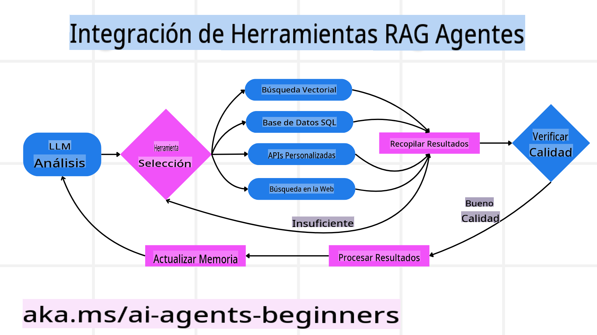
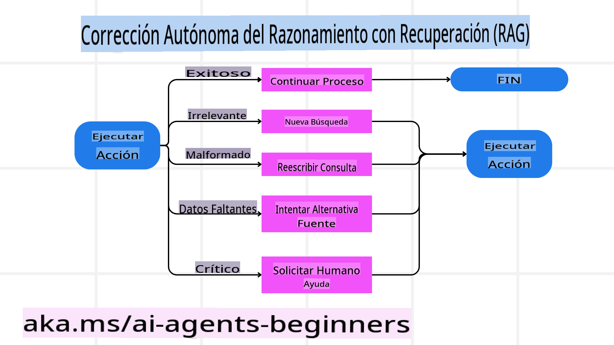
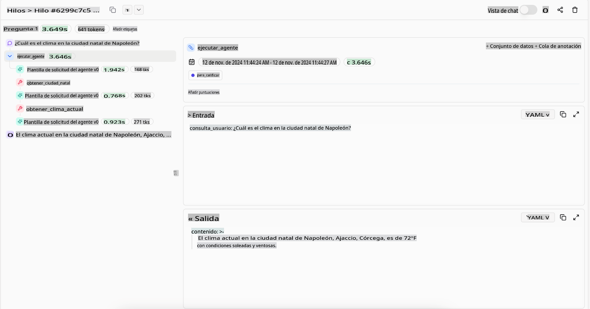
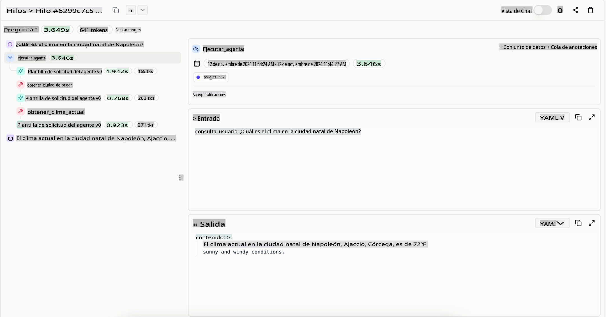

<!--
CO_OP_TRANSLATOR_METADATA:
{
  "original_hash": "4d215d159f2f3b96644fd62657988d23",
  "translation_date": "2025-03-28T10:24:57+00:00",
  "source_file": "05-agentic-rag\\README.md",
  "language_code": "es"
}
-->

> _(Haz clic en la imagen de arriba para ver el video de esta lección)_

# Agentic RAG

Esta lección ofrece una visión general completa sobre Agentic Retrieval-Augmented Generation (Agentic RAG), un paradigma emergente de IA donde los modelos de lenguaje extensos (LLMs) planifican de manera autónoma sus próximos pasos mientras extraen información de fuentes externas. A diferencia de los patrones estáticos de recuperación y lectura, Agentic RAG implica llamadas iterativas al LLM, intercaladas con llamadas a herramientas o funciones y salidas estructuradas. El sistema evalúa resultados, refina consultas, invoca herramientas adicionales si es necesario y continúa este ciclo hasta lograr una solución satisfactoria.

## Introducción

Esta lección cubrirá:

- **Entender Agentic RAG:** Aprende sobre el paradigma emergente en IA donde los modelos de lenguaje extensos (LLMs) planifican de manera autónoma sus próximos pasos mientras extraen información de fuentes de datos externas.
- **Comprender el estilo iterativo Maker-Checker:** Comprende el ciclo de llamadas iterativas al LLM, intercaladas con llamadas a herramientas o funciones y salidas estructuradas, diseñado para mejorar la precisión y manejar consultas malformadas.
- **Explorar aplicaciones prácticas:** Identifica escenarios donde Agentic RAG destaca, como entornos donde la precisión es clave, interacciones complejas con bases de datos y flujos de trabajo extendidos.

## Objetivos de aprendizaje

Después de completar esta lección, sabrás cómo/entenderás:

- **Entender Agentic RAG:** Aprende sobre el paradigma emergente en IA donde los modelos de lenguaje extensos (LLMs) planifican de manera autónoma sus próximos pasos mientras extraen información de fuentes de datos externas.
- **Estilo iterativo Maker-Checker:** Comprende el concepto de un ciclo de llamadas iterativas al LLM, intercaladas con llamadas a herramientas o funciones y salidas estructuradas, diseñado para mejorar la precisión y manejar consultas malformadas.
- **Poseer el proceso de razonamiento:** Comprende la capacidad del sistema para poseer su proceso de razonamiento, tomando decisiones sobre cómo abordar problemas sin depender de caminos predefinidos.
- **Flujo de trabajo:** Entiende cómo un modelo agentic decide de manera independiente recuperar informes de tendencias del mercado, identificar datos de competidores, correlacionar métricas internas de ventas, sintetizar hallazgos y evaluar la estrategia.
- **Bucles iterativos, integración de herramientas y memoria:** Aprende sobre la dependencia del sistema en un patrón de interacción en bucle, manteniendo estado y memoria a través de los pasos para evitar bucles repetitivos y tomar decisiones informadas.
- **Manejo de modos de falla y autocorrección:** Explora los mecanismos robustos de autocorrección del sistema, incluyendo iteración y reconsulta, uso de herramientas de diagnóstico y recurrir a la supervisión humana cuando sea necesario.
- **Límites de la autonomía:** Entiende las limitaciones de Agentic RAG, enfocándose en la autonomía específica del dominio, la dependencia de la infraestructura y el respeto por las salvaguardas.
- **Casos prácticos y valor:** Identifica escenarios donde Agentic RAG destaca, como entornos donde la precisión es clave, interacciones complejas con bases de datos y flujos de trabajo extendidos.
- **Gobernanza, transparencia y confianza:** Aprende sobre la importancia de la gobernanza y la transparencia, incluyendo razonamiento explicable, control de sesgos y supervisión humana.

## ¿Qué es Agentic RAG?

Agentic Retrieval-Augmented Generation (Agentic RAG) es un paradigma emergente de IA donde los modelos de lenguaje extensos (LLMs) planifican de manera autónoma sus próximos pasos mientras extraen información de fuentes externas. A diferencia de los patrones estáticos de recuperación y lectura, Agentic RAG implica llamadas iterativas al LLM, intercaladas con llamadas a herramientas o funciones y salidas estructuradas. El sistema evalúa resultados, refina consultas, invoca herramientas adicionales si es necesario y continúa este ciclo hasta lograr una solución satisfactoria. Este estilo iterativo “maker-checker” mejora la precisión, maneja consultas malformadas y asegura resultados de alta calidad.

El sistema posee activamente su proceso de razonamiento, reescribiendo consultas fallidas, eligiendo diferentes métodos de recuperación e integrando múltiples herramientas—como búsqueda vectorial en Azure AI Search, bases de datos SQL o APIs personalizadas—antes de finalizar su respuesta. La cualidad distintiva de un sistema agentic es su capacidad para poseer su proceso de razonamiento. Las implementaciones tradicionales de RAG dependen de caminos predefinidos, pero un sistema agentic determina de manera autónoma la secuencia de pasos según la calidad de la información que encuentra.

## Definiendo Agentic Retrieval-Augmented Generation (Agentic RAG)

Agentic Retrieval-Augmented Generation (Agentic RAG) es un paradigma emergente en el desarrollo de IA donde los LLMs no solo extraen información de fuentes de datos externas, sino que también planifican de manera autónoma sus próximos pasos. A diferencia de los patrones estáticos de recuperación y lectura o las secuencias de indicaciones cuidadosamente guionadas, Agentic RAG implica un ciclo de llamadas iterativas al LLM, intercaladas con llamadas a herramientas o funciones y salidas estructuradas. En cada paso, el sistema evalúa los resultados obtenidos, decide si refinar sus consultas, invoca herramientas adicionales si es necesario y continúa este ciclo hasta lograr una solución satisfactoria.

Este estilo iterativo “maker-checker” está diseñado para mejorar la precisión, manejar consultas malformadas a bases de datos estructuradas (por ejemplo, NL2SQL) y asegurar resultados equilibrados y de alta calidad. En lugar de depender únicamente de cadenas de indicaciones cuidadosamente diseñadas, el sistema posee activamente su proceso de razonamiento. Puede reescribir consultas que fallan, elegir diferentes métodos de recuperación e integrar múltiples herramientas—como búsqueda vectorial en Azure AI Search, bases de datos SQL o APIs personalizadas—antes de finalizar su respuesta. Esto elimina la necesidad de marcos de orquestación excesivamente complejos. En su lugar, un ciclo relativamente simple de “llamada al LLM → uso de herramienta → llamada al LLM → …” puede generar salidas sofisticadas y bien fundamentadas.

## Poseer el proceso de razonamiento

La cualidad distintiva que hace que un sistema sea “agentic” es su capacidad para poseer su proceso de razonamiento. Las implementaciones tradicionales de RAG suelen depender de que los humanos definan previamente un camino para el modelo: una cadena de pensamiento que detalla qué recuperar y cuándo.
Pero cuando un sistema es verdaderamente agentic, decide internamente cómo abordar el problema. No solo ejecuta un guion; determina de manera autónoma la secuencia de pasos según la calidad de la información que encuentra.
Por ejemplo, si se le pide crear una estrategia de lanzamiento de producto, no depende únicamente de una indicación que detalla todo el flujo de trabajo de investigación y toma de decisiones. En cambio, el modelo agentic decide de manera independiente:

1. Recuperar informes de tendencias actuales del mercado usando Bing Web Grounding.
2. Identificar datos relevantes de competidores usando Azure AI Search.
3. Correlacionar métricas internas históricas de ventas usando Azure SQL Database.
4. Sintetizar los hallazgos en una estrategia cohesiva orquestada mediante Azure OpenAI Service.
5. Evaluar la estrategia en busca de brechas o inconsistencias, iniciando otra ronda de recuperación si es necesario.

Todos estos pasos—refinar consultas, elegir fuentes, iterar hasta estar “satisfecho” con la respuesta—son decididos por el modelo, no guionados previamente por un humano.

## Bucles iterativos, integración de herramientas y memoria

Un sistema agentic se basa en un patrón de interacción en bucle:

- **Llamada inicial:** El objetivo del usuario (es decir, la indicación del usuario) se presenta al LLM.
- **Invocación de herramientas:** Si el modelo identifica información faltante o instrucciones ambiguas, selecciona una herramienta o método de recuperación—como una consulta a una base de datos vectorial (por ejemplo, búsqueda híbrida de Azure AI Search sobre datos privados) o una llamada SQL estructurada—para reunir más contexto.
- **Evaluación y refinamiento:** Después de revisar los datos devueltos, el modelo decide si la información es suficiente. Si no, refina la consulta, prueba una herramienta diferente o ajusta su enfoque.
- **Repetir hasta estar satisfecho:** Este ciclo continúa hasta que el modelo determina que tiene suficiente claridad y evidencia para entregar una respuesta final bien razonada.
- **Memoria y estado:** Dado que el sistema mantiene estado y memoria a través de los pasos, puede recordar intentos previos y sus resultados, evitando bucles repetitivos y tomando decisiones más informadas a medida que avanza.

Con el tiempo, esto crea una sensación de comprensión evolutiva, permitiendo al modelo navegar tareas complejas y de múltiples pasos sin requerir que un humano intervenga constantemente o reformule la indicación.

## Manejo de modos de falla y autocorrección

La autonomía de Agentic RAG también implica mecanismos robustos de autocorrección. Cuando el sistema enfrenta callejones sin salida—como recuperar documentos irrelevantes o encontrar consultas malformadas—puede:

- **Iterar y reconsultar:** En lugar de devolver respuestas de bajo valor, el modelo intenta nuevas estrategias de búsqueda, reescribe consultas a bases de datos o busca en conjuntos de datos alternativos.
- **Usar herramientas de diagnóstico:** El sistema puede invocar funciones adicionales diseñadas para ayudarle a depurar sus pasos de razonamiento o confirmar la corrección de los datos recuperados. Herramientas como Azure AI Tracing serán importantes para habilitar una observabilidad y monitoreo robustos.
- **Recurrir a supervisión humana:** Para escenarios de alto riesgo o que fallan repetidamente, el modelo puede señalar incertidumbre y solicitar orientación humana. Una vez que el humano proporciona retroalimentación correctiva, el modelo puede incorporar esa lección en adelante.

Este enfoque iterativo y dinámico permite al modelo mejorar continuamente, asegurando que no sea solo un sistema de una sola oportunidad, sino uno que aprende de sus errores durante una sesión determinada.

## Límites de la autonomía

A pesar de su autonomía dentro de una tarea, Agentic RAG no es análogo a la Inteligencia Artificial General. Sus capacidades “agentic” están confinadas a las herramientas, fuentes de datos y políticas proporcionadas por los desarrolladores humanos. No puede inventar sus propias herramientas ni salir de los límites del dominio que se le han establecido. Más bien, sobresale en la orquestación dinámica de los recursos disponibles.
Las diferencias clave con formas más avanzadas de IA incluyen:

1. **Autonomía específica del dominio:** Los sistemas Agentic RAG se enfocan en lograr objetivos definidos por el usuario dentro de un dominio conocido, empleando estrategias como la reescritura de consultas o la selección de herramientas para mejorar los resultados.
2. **Dependencia de la infraestructura:** Las capacidades del sistema dependen de las herramientas y datos integrados por los desarrolladores. No puede superar estos límites sin intervención humana.
3. **Respeto por las salvaguardas:** Las directrices éticas, las reglas de cumplimiento y las políticas empresariales siguen siendo muy importantes. La libertad del agente siempre está limitada por medidas de seguridad y mecanismos de supervisión (¿esperemos?).

## Casos prácticos y valor

Agentic RAG destaca en escenarios que requieren refinamiento iterativo y precisión:

1. **Entornos donde la precisión es clave:** En verificaciones de cumplimiento, análisis regulatorio o investigación legal, el modelo agentic puede verificar repetidamente hechos, consultar múltiples fuentes y reescribir consultas hasta producir una respuesta completamente revisada.
2. **Interacciones complejas con bases de datos:** Al tratar con datos estructurados donde las consultas pueden fallar o necesitar ajustes, el sistema puede refinar de manera autónoma sus consultas usando Azure SQL o Microsoft Fabric OneLake, asegurando que la recuperación final se alinee con la intención del usuario.
3. **Flujos de trabajo extendidos:** Las sesiones de mayor duración pueden evolucionar a medida que surja nueva información. Agentic RAG puede incorporar continuamente nuevos datos, ajustando estrategias a medida que aprende más sobre el espacio del problema.

## Gobernanza, transparencia y confianza

A medida que estos sistemas se vuelven más autónomos en su razonamiento, la gobernanza y la transparencia son cruciales:

- **Razonamiento explicable:** El modelo puede proporcionar un registro de auditoría de las consultas que realizó, las fuentes que consultó y los pasos de razonamiento que tomó para llegar a su conclusión. Herramientas como Azure AI Content Safety y Azure AI Tracing / GenAIOps pueden ayudar a mantener la transparencia y mitigar riesgos.
- **Control de sesgos y recuperación equilibrada:** Los desarrolladores pueden ajustar estrategias de recuperación para garantizar que se consideren fuentes de datos equilibradas y representativas, y auditar regularmente las salidas para detectar sesgos o patrones desviados usando modelos personalizados para organizaciones avanzadas de ciencia de datos que usan Azure Machine Learning.
- **Supervisión humana y cumplimiento:** Para tareas sensibles, la revisión humana sigue siendo esencial. Agentic RAG no reemplaza el juicio humano en decisiones de alto riesgo: lo complementa al ofrecer opciones más exhaustivamente revisadas.

Tener herramientas que proporcionen un registro claro de acciones es esencial. Sin ellas, depurar un proceso de múltiples pasos puede ser muy difícil. Consulta el siguiente ejemplo de Literal AI (empresa detrás de Chainlit) para una ejecución de agente:

## Conclusión

Agentic RAG representa una evolución natural en cómo los sistemas de IA manejan tareas complejas y con gran cantidad de datos. Al adoptar un patrón de interacción en bucle, seleccionar herramientas de manera autónoma y refinar consultas hasta lograr un resultado de alta calidad, el sistema va más allá de seguir indicaciones estáticas hacia un tomador de decisiones más adaptativo y consciente del contexto. Aunque todavía está limitado por infraestructuras definidas por humanos y pautas éticas, estas capacidades agentic permiten interacciones de IA más ricas, dinámicas y, en última instancia, más útiles tanto para empresas como para usuarios finales.

## Recursos adicionales

- <a href="https://learn.microsoft.com/training/modules/use-own-data-azure-openai" target="_blank">Implementar Retrieval Augmented Generation (RAG) con Azure OpenAI Service: Aprende cómo usar tus propios datos con Azure OpenAI Service. Este módulo de Microsoft Learn ofrece una guía completa sobre cómo implementar RAG</a>
- <a href="https://learn.microsoft.com/azure/ai-studio/concepts/evaluation-approach-gen-ai" target="_blank">Evaluación de aplicaciones de IA generativa con Azure AI Foundry: Este artículo cubre la evaluación y comparación de modelos en conjuntos de datos públicos, incluyendo aplicaciones de IA agentic y arquitecturas RAG</a>
- <a href="https://weaviate.io/blog/what-is-agentic-rag" target="_blank">¿Qué es Agentic RAG? | Weaviate</a>
- <a href="https://ragaboutit.com/agentic-rag-a-complete-guide-to-agent-based-retrieval-augmented-generation/" target="_blank">Agentic RAG: Una guía completa sobre generación aumentada basada en agentes – Noticias de generación RAG</a>
- <a href="https://huggingface.co/learn/cookbook/agent_rag" target="_blank">Agentic RAG: potencia tu RAG con reformulación de consultas y auto-consulta! Hugging Face Open-Source AI Cookbook</a>
- <a href="https://youtu.be/aQ4yQXeB1Ss?si=2HUqBzHoeB5tR04U" target="_blank">Agregar capas agentic a RAG</a>
- <a href="https://www.youtube.com/watch?v=zeAyuLc_f3Q&t=244s" target="_blank">El futuro de los asistentes de conocimiento: Jerry Liu</a>
- <a href="https://www.youtube.com/watch?v=AOSjiXP1jmQ" target="_blank">Cómo construir sistemas Agentic RAG</a>
- <a href="https://ignite.microsoft.com/sessions/BRK102?source=sessions" target="_blank">Usar Azure AI Foundry Agent Service para escalar tus agentes de IA</a>

### Artículos académicos

- <a href="https://arxiv.org/abs/2303.17651" target="_blank">2303.17651 Self-Refine: Iterative Refinement with Self-Feedback</a>
- <a href="https://arxiv.org/abs/2303.11366" target="_blank">2303.11366 Reflexion: Language Agents with Verbal Reinforcement Learning</a>
- <a href="https://arxiv.org/abs/2305.11738" target="_blank">2305.11738 CRITIC: Large Language Models Can Self-Correct with Tool-Interactive Critiquing</a>
- <a href="https://arxiv.org/abs/2501.09136" target="_blank">2501.09136 Agentic Retrieval-Augmented Generation: A Survey on Agentic RAG</a>

## Lección anterior

[Tool Use Design Pattern](../04-tool-use/README.md)

## Próxima lección

[Building Trustworthy AI Agents](../06-building-trustworthy-agents/README.md)

**Descargo de responsabilidad**:  
Este documento ha sido traducido utilizando el servicio de traducción automática [Co-op Translator](https://github.com/Azure/co-op-translator). Aunque nos esforzamos por garantizar la precisión, tenga en cuenta que las traducciones automáticas pueden contener errores o imprecisiones. El documento original en su idioma nativo debe considerarse la fuente autorizada. Para información crítica, se recomienda una traducción profesional realizada por humanos. No nos hacemos responsables de malentendidos o interpretaciones erróneas que puedan surgir del uso de esta traducción.