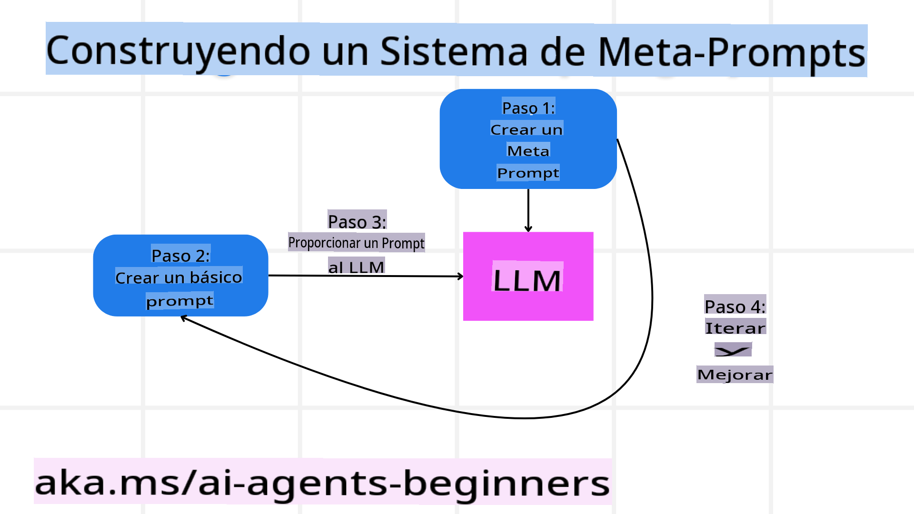

# Construyendo Agentes de IA Confiables

## Introducción

En esta lección se cubrirá:

- Cómo construir y desplegar Agentes de IA seguros y efectivos.
- Consideraciones importantes de seguridad al desarrollar Agentes de IA.
- Cómo mantener la privacidad de datos y usuarios al desarrollar Agentes de IA.

## Objetivos de Aprendizaje

Al completar esta lección, sabrás cómo:

- Identificar y mitigar riesgos al crear Agentes de IA.
- Implementar medidas de seguridad para garantizar que los datos y el acceso estén correctamente gestionados.
- Crear Agentes de IA que mantengan la privacidad de los datos y ofrezcan una experiencia de usuario de calidad.

## Seguridad

Primero, exploremos cómo construir aplicaciones de agentes seguras. La seguridad significa que el agente de IA actúa según lo diseñado. Como creadores de aplicaciones de agentes, contamos con métodos y herramientas para maximizar la seguridad:

### Construcción de un Sistema de Meta-Prompts

Si alguna vez has creado una aplicación de IA utilizando Modelos de Lenguaje Extenso (LLMs, por sus siglas en inglés), sabes la importancia de diseñar un prompt o mensaje del sistema robusto. Estos prompts establecen las reglas, instrucciones y directrices meta sobre cómo el LLM interactuará con el usuario y los datos.

Para los Agentes de IA, el prompt del sistema es aún más importante, ya que estos agentes necesitarán instrucciones altamente específicas para completar las tareas que hemos diseñado para ellos.

Para crear prompts del sistema escalables, podemos utilizar un sistema de meta-prompts para construir uno o más agentes en nuestra aplicación:



#### Paso 1: Crear un Meta-Prompt o Prompt Plantilla

El meta-prompt será utilizado por un LLM para generar los prompts del sistema para los agentes que creemos. Lo diseñamos como una plantilla para poder crear múltiples agentes de manera eficiente si es necesario.

Aquí tienes un ejemplo de un meta-prompt que podríamos proporcionar al LLM:

```plaintext
You are an expert at creating AI agent assitants. 
You will be provided a company name, role, responsibilites and other
information that you will use to provide a system prompt for.
To create the system prompt, be descriptive as possible and provide a structure that a system using an LLM can better understand the role and responsibilites of the AI assistant. 
```

#### Paso 2: Crear un Prompt Básico

El siguiente paso es crear un prompt básico para describir al Agente de IA. Debes incluir el rol del agente, las tareas que realizará y cualquier otra responsabilidad que tenga.

Aquí tienes un ejemplo:

```plaintext
You are a travel agent for Contoso Travel with that is great at booking flights for customers. To help customers you can perform the following tasks: lookup available flights, book flights, ask for preferences in seating and times for flights, cancel any previously booked flights and alert customers on any delays or cancellations of flights.  
```

#### Paso 3: Proporcionar el Prompt Básico al LLM

Ahora podemos optimizar este prompt proporcionando el meta-prompt como el prompt del sistema junto con nuestro prompt básico.

Esto producirá un prompt mejor diseñado para guiar a nuestros Agentes de IA:

```markdown
**Company Name:** Contoso Travel  
**Role:** Travel Agent Assistant

**Objective:**  
You are an AI-powered travel agent assistant for Contoso Travel, specializing in booking flights and providing exceptional customer service. Your main goal is to assist customers in finding, booking, and managing their flights, all while ensuring that their preferences and needs are met efficiently.

**Key Responsibilities:**

1. **Flight Lookup:**
    
    - Assist customers in searching for available flights based on their specified destination, dates, and any other relevant preferences.
    - Provide a list of options, including flight times, airlines, layovers, and pricing.
2. **Flight Booking:**
    
    - Facilitate the booking of flights for customers, ensuring that all details are correctly entered into the system.
    - Confirm bookings and provide customers with their itinerary, including confirmation numbers and any other pertinent information.
3. **Customer Preference Inquiry:**
    
    - Actively ask customers for their preferences regarding seating (e.g., aisle, window, extra legroom) and preferred times for flights (e.g., morning, afternoon, evening).
    - Record these preferences for future reference and tailor suggestions accordingly.
4. **Flight Cancellation:**
    
    - Assist customers in canceling previously booked flights if needed, following company policies and procedures.
    - Notify customers of any necessary refunds or additional steps that may be required for cancellations.
5. **Flight Monitoring:**
    
    - Monitor the status of booked flights and alert customers in real-time about any delays, cancellations, or changes to their flight schedule.
    - Provide updates through preferred communication channels (e.g., email, SMS) as needed.

**Tone and Style:**

- Maintain a friendly, professional, and approachable demeanor in all interactions with customers.
- Ensure that all communication is clear, informative, and tailored to the customer's specific needs and inquiries.

**User Interaction Instructions:**

- Respond to customer queries promptly and accurately.
- Use a conversational style while ensuring professionalism.
- Prioritize customer satisfaction by being attentive, empathetic, and proactive in all assistance provided.

**Additional Notes:**

- Stay updated on any changes to airline policies, travel restrictions, and other relevant information that could impact flight bookings and customer experience.
- Use clear and concise language to explain options and processes, avoiding jargon where possible for better customer understanding.

This AI assistant is designed to streamline the flight booking process for customers of Contoso Travel, ensuring that all their travel needs are met efficiently and effectively.

```

#### Paso 4: Iterar y Mejorar

El valor de este sistema de meta-prompts radica en la capacidad de escalar la creación de prompts para múltiples agentes de manera más sencilla, así como en la mejora continua de los prompts. Es raro que un prompt funcione perfectamente desde el primer intento para todo el caso de uso. Poder realizar pequeños ajustes y mejoras cambiando el prompt básico y ejecutándolo a través del sistema te permitirá comparar y evaluar los resultados.

## Comprendiendo las Amenazas  

Para construir agentes de IA confiables, es importante entender y mitigar los riesgos y amenazas a los que están expuestos. Veamos algunas de las diferentes amenazas a los Agentes de IA y cómo puedes planificar y prepararte mejor para enfrentarlas.


### Tareas e Instrucciones

**Descripción:** Los atacantes intentan cambiar las instrucciones o metas del Agente de IA a través de prompts o manipulando entradas.

**Mitigación:** Ejecuta verificaciones de validación y filtros de entrada para detectar prompts potencialmente peligrosos antes de que sean procesados por el Agente de IA. Dado que estos ataques suelen requerir interacciones frecuentes con el Agente, limitar el número de turnos en una conversación es otra manera de prevenir este tipo de ataques.

### Acceso a Sistemas Críticos

**Descripción:** Si un Agente de IA tiene acceso a sistemas y servicios que almacenan datos sensibles, los atacantes pueden comprometer la comunicación entre el agente y estos servicios. Estos pueden ser ataques directos o intentos indirectos de obtener información sobre estos sistemas a través del agente.

**Mitigación:** Los Agentes de IA deben tener acceso a los sistemas únicamente cuando sea necesario para prevenir este tipo de ataques. La comunicación entre el agente y los sistemas también debe ser segura. Implementar autenticación y control de acceso es otra forma de proteger esta información.

### Sobrecarga de Recursos y Servicios

**Descripción:** Los Agentes de IA pueden acceder a diferentes herramientas y servicios para completar tareas. Los atacantes pueden aprovechar esta capacidad para atacar estos servicios enviando un alto volumen de solicitudes a través del Agente de IA, lo que podría resultar en fallos del sistema o altos costos.

**Mitigación:** Implementa políticas para limitar el número de solicitudes que un Agente de IA puede realizar a un servicio. Limitar el número de turnos de conversación y solicitudes al Agente de IA es otra manera de prevenir este tipo de ataques.

### Envenenamiento de la Base de Conocimientos

**Descripción:** Este tipo de ataque no se dirige directamente al Agente de IA, sino a la base de conocimientos y otros servicios que el agente utilizará. Esto podría implicar corromper los datos o la información que el agente usará para completar una tarea, lo que llevaría a respuestas sesgadas o no deseadas al usuario.

**Mitigación:** Realiza verificaciones regulares de los datos que el Agente de IA utilizará en sus flujos de trabajo. Asegúrate de que el acceso a estos datos sea seguro y que solo personas de confianza puedan realizar cambios para evitar este tipo de ataques.

### Errores en Cascada

**Descripción:** Los Agentes de IA acceden a diversas herramientas y servicios para completar tareas. Los errores causados por atacantes pueden provocar fallos en otros sistemas conectados al Agente de IA, haciendo que el ataque se propague y sea más difícil de solucionar.

**Mitigación:** Una forma de evitar esto es hacer que el Agente de IA opere en un entorno limitado, como realizar tareas en un contenedor Docker, para prevenir ataques directos al sistema. Crear mecanismos de respaldo y lógica de reintento cuando ciertos sistemas respondan con errores es otra manera de prevenir fallos mayores en el sistema.

## Humano en el Bucle

Otra forma efectiva de construir sistemas de Agentes de IA confiables es utilizar un enfoque de Humano en el Bucle. Esto crea un flujo en el que los usuarios pueden proporcionar retroalimentación a los Agentes durante su ejecución. Los usuarios actúan esencialmente como un agente en un sistema multiagente, proporcionando aprobación o terminación del proceso en curso.


Aquí tienes un fragmento de código que utiliza AutoGen para mostrar cómo se implementa este concepto:

```python

# Create the agents.
model_client = OpenAIChatCompletionClient(model="gpt-4o-mini")
assistant = AssistantAgent("assistant", model_client=model_client)
user_proxy = UserProxyAgent("user_proxy", input_func=input)  # Use input() to get user input from console.

# Create the termination condition which will end the conversation when the user says "APPROVE".
termination = TextMentionTermination("APPROVE")

# Create the team.
team = RoundRobinGroupChat([assistant, user_proxy], termination_condition=termination)

# Run the conversation and stream to the console.
stream = team.run_stream(task="Write a 4-line poem about the ocean.")
# Use asyncio.run(...) when running in a script.
await Console(stream)

```

**Descargo de responsabilidad**:  
Este documento ha sido traducido utilizando servicios de traducción automática basados en inteligencia artificial. Si bien nos esforzamos por garantizar la precisión, tenga en cuenta que las traducciones automatizadas pueden contener errores o inexactitudes. El documento original en su idioma nativo debe considerarse como la fuente autorizada. Para información crítica, se recomienda una traducción profesional realizada por humanos. No nos hacemos responsables de ningún malentendido o interpretación errónea que surja del uso de esta traducción.