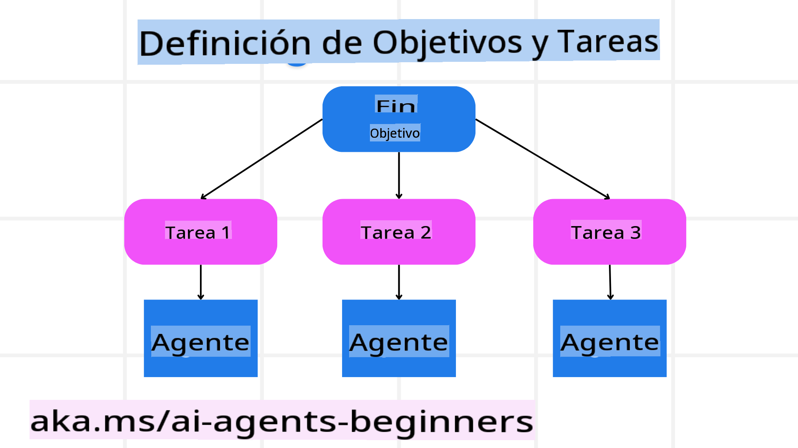

<!--
CO_OP_TRANSLATOR_METADATA:
{
  "original_hash": "8dd9a05d4dc18d3ff510e68e3798a080",
  "translation_date": "2025-03-28T10:30:23+00:00",
  "source_file": "07-planning-design\\README.md",
  "language_code": "es"
}
-->
[](https://youtu.be/kPfJ2BrBCMY?si=9pYpPXp0sSbK91Dr)

> _(Haz clic en la imagen de arriba para ver el video de esta lección)_

# Diseño de Planificación

## Introducción

Esta lección cubrirá:

* Definir un objetivo general claro y dividir una tarea compleja en tareas manejables.
* Aprovechar salidas estructuradas para respuestas más confiables y legibles por máquinas.
* Aplicar un enfoque basado en eventos para manejar tareas dinámicas e inputs inesperados.

## Objetivos de Aprendizaje

Después de completar esta lección, tendrás una comprensión sobre:

* Identificar y establecer un objetivo general para un agente de IA, asegurando que sepa claramente qué necesita lograr.
* Descomponer una tarea compleja en subtareas manejables y organizarlas en una secuencia lógica.
* Equipar a los agentes con las herramientas adecuadas (por ejemplo, herramientas de búsqueda o análisis de datos), decidir cuándo y cómo se utilizan, y manejar situaciones inesperadas que surjan.
* Evaluar los resultados de las subtareas, medir el rendimiento e iterar sobre las acciones para mejorar el resultado final.

## Definir el Objetivo General y Dividir una Tarea



La mayoría de las tareas del mundo real son demasiado complejas para abordarlas en un solo paso. Un agente de IA necesita un objetivo conciso para guiar su planificación y acciones. Por ejemplo, considera el objetivo:

    "Generar un itinerario de viaje de 3 días."

Aunque es simple de expresar, aún necesita refinamiento. Cuanto más claro sea el objetivo, mejor podrá el agente (y cualquier colaborador humano) centrarse en lograr el resultado correcto, como crear un itinerario completo con opciones de vuelo, recomendaciones de hoteles y sugerencias de actividades.

### Descomposición de Tareas

Las tareas grandes o intrincadas se vuelven más manejables cuando se dividen en subtareas pequeñas y orientadas a objetivos.  
Para el ejemplo del itinerario de viaje, podrías descomponer el objetivo en:

* Reserva de vuelos  
* Reserva de hoteles  
* Alquiler de autos  
* Personalización  

Cada subtarea puede ser abordada por agentes o procesos dedicados. Un agente podría especializarse en buscar las mejores ofertas de vuelos, otro en reservas de hoteles, y así sucesivamente. Un agente coordinador o "descendente" puede entonces compilar estos resultados en un itinerario cohesivo para el usuario final.

Este enfoque modular también permite mejoras incrementales. Por ejemplo, podrías agregar agentes especializados en recomendaciones gastronómicas o sugerencias de actividades locales y refinar el itinerario con el tiempo.

### Salida Estructurada

Los modelos de lenguaje grandes (LLMs) pueden generar salidas estructuradas (por ejemplo, JSON) que son más fáciles de analizar y procesar por agentes o servicios posteriores. Esto es especialmente útil en un contexto de múltiples agentes, donde podemos actuar sobre estas tareas después de recibir la salida de planificación. Consulta esto:

El siguiente fragmento de código en Python demuestra un agente de planificación simple descomponiendo un objetivo en subtareas y generando un plan estructurado:

```python
from pydantic import BaseModel
from enum import Enum
from typing import List, Optional, Union
import json
import os
from typing import Optional
from pprint import pprint
from autogen_core.models import UserMessage, SystemMessage, AssistantMessage
from autogen_ext.models.azure import AzureAIChatCompletionClient
from azure.core.credentials import AzureKeyCredential

class AgentEnum(str, Enum):
    FlightBooking = "flight_booking"
    HotelBooking = "hotel_booking"
    CarRental = "car_rental"
    ActivitiesBooking = "activities_booking"
    DestinationInfo = "destination_info"
    DefaultAgent = "default_agent"
    GroupChatManager = "group_chat_manager"

# Travel SubTask Model
class TravelSubTask(BaseModel):
    task_details: str
    assigned_agent: AgentEnum  # we want to assign the task to the agent

class TravelPlan(BaseModel):
    main_task: str
    subtasks: List[TravelSubTask]
    is_greeting: bool

client = AzureAIChatCompletionClient(
    model="gpt-4o-mini",
    endpoint="https://models.inference.ai.azure.com",
    # To authenticate with the model you will need to generate a personal access token (PAT) in your GitHub settings.
    # Create your PAT token by following instructions here: https://docs.github.com/en/authentication/keeping-your-account-and-data-secure/managing-your-personal-access-tokens
    credential=AzureKeyCredential(os.environ["GITHUB_TOKEN"]),
    model_info={
        "json_output": False,
        "function_calling": True,
        "vision": True,
        "family": "unknown",
    },
)

# Define the user message
messages = [
    SystemMessage(content="""You are an planner agent.
    Your job is to decide which agents to run based on the user's request.
                      Provide your response in JSON format with the following structure:
{'main_task': 'Plan a family trip from Singapore to Melbourne.',
 'subtasks': [{'assigned_agent': 'flight_booking',
               'task_details': 'Book round-trip flights from Singapore to '
                               'Melbourne.'}
    Below are the available agents specialised in different tasks:
    - FlightBooking: For booking flights and providing flight information
    - HotelBooking: For booking hotels and providing hotel information
    - CarRental: For booking cars and providing car rental information
    - ActivitiesBooking: For booking activities and providing activity information
    - DestinationInfo: For providing information about destinations
    - DefaultAgent: For handling general requests""", source="system"),
    UserMessage(
        content="Create a travel plan for a family of 2 kids from Singapore to Melboune", source="user"),
]

response = await client.create(messages=messages, extra_create_args={"response_format": 'json_object'})

response_content: Optional[str] = response.content if isinstance(
    response.content, str) else None
if response_content is None:
    raise ValueError("Response content is not a valid JSON string" )

pprint(json.loads(response_content))

# # Ensure the response content is a valid JSON string before loading it
# response_content: Optional[str] = response.content if isinstance(
#     response.content, str) else None
# if response_content is None:
#     raise ValueError("Response content is not a valid JSON string")

# # Print the response content after loading it as JSON
# pprint(json.loads(response_content))

# Validate the response content with the MathReasoning model
# TravelPlan.model_validate(json.loads(response_content))
```

### Agente de Planificación con Orquestación Multi-Agente

En este ejemplo, un Agente de Enrutamiento Semántico recibe una solicitud del usuario (por ejemplo, "Necesito un plan de hotel para mi viaje.").

El planificador entonces:

* Recibe el Plan de Hotel: El planificador toma el mensaje del usuario y, basado en un mensaje del sistema (incluyendo detalles de los agentes disponibles), genera un plan de viaje estructurado.  
* Lista Agentes y sus Herramientas: El registro de agentes contiene una lista de agentes (por ejemplo, para vuelos, hoteles, alquiler de autos y actividades) junto con las funciones o herramientas que ofrecen.  
* Dirige el Plan a los Agentes Correspondientes: Dependiendo del número de subtareas, el planificador envía el mensaje directamente a un agente dedicado (para escenarios de tarea única) o coordina a través de un administrador de chat grupal para la colaboración multi-agente.  
* Resume el Resultado: Finalmente, el planificador resume el plan generado para mayor claridad.  

El siguiente ejemplo de código en Python ilustra estos pasos:

```python

from pydantic import BaseModel

from enum import Enum
from typing import List, Optional, Union

class AgentEnum(str, Enum):
    FlightBooking = "flight_booking"
    HotelBooking = "hotel_booking"
    CarRental = "car_rental"
    ActivitiesBooking = "activities_booking"
    DestinationInfo = "destination_info"
    DefaultAgent = "default_agent"
    GroupChatManager = "group_chat_manager"

# Travel SubTask Model

class TravelSubTask(BaseModel):
    task_details: str
    assigned_agent: AgentEnum # we want to assign the task to the agent

class TravelPlan(BaseModel):
    main_task: str
    subtasks: List[TravelSubTask]
    is_greeting: bool
import json
import os
from typing import Optional

from autogen_core.models import UserMessage, SystemMessage, AssistantMessage
from autogen_ext.models.openai import AzureOpenAIChatCompletionClient

# Create the client with type-checked environment variables

client = AzureOpenAIChatCompletionClient(
    azure_deployment=os.getenv("AZURE_OPENAI_DEPLOYMENT_NAME"),
    model=os.getenv("AZURE_OPENAI_DEPLOYMENT_NAME"),
    api_version=os.getenv("AZURE_OPENAI_API_VERSION"),
    azure_endpoint=os.getenv("AZURE_OPENAI_ENDPOINT"),
    api_key=os.getenv("AZURE_OPENAI_API_KEY"),
)

from pprint import pprint

# Define the user message

messages = [
    SystemMessage(content="""You are an planner agent.
    Your job is to decide which agents to run based on the user's request.
    Below are the available agents specialized in different tasks:
    - FlightBooking: For booking flights and providing flight information
    - HotelBooking: For booking hotels and providing hotel information
    - CarRental: For booking cars and providing car rental information
    - ActivitiesBooking: For booking activities and providing activity information
    - DestinationInfo: For providing information about destinations
    - DefaultAgent: For handling general requests""", source="system"),
    UserMessage(content="Create a travel plan for a family of 2 kids from Singapore to Melbourne", source="user"),
]

response = await client.create(messages=messages, extra_create_args={"response_format": TravelPlan})

# Ensure the response content is a valid JSON string before loading it

response_content: Optional[str] = response.content if isinstance(response.content, str) else None
if response_content is None:
    raise ValueError("Response content is not a valid JSON string")

# Print the response content after loading it as JSON

pprint(json.loads(response_content))
```

Lo que sigue es la salida del código anterior y luego puedes usar esta salida estructurada para dirigirla al `assigned_agent` y resumir el plan de viaje para el usuario final.

```json
{
    "is_greeting": "False",
    "main_task": "Plan a family trip from Singapore to Melbourne.",
    "subtasks": [
        {
            "assigned_agent": "flight_booking",
            "task_details": "Book round-trip flights from Singapore to Melbourne."
        },
        {
            "assigned_agent": "hotel_booking",
            "task_details": "Find family-friendly hotels in Melbourne."
        },
        {
            "assigned_agent": "car_rental",
            "task_details": "Arrange a car rental suitable for a family of four in Melbourne."
        },
        {
            "assigned_agent": "activities_booking",
            "task_details": "List family-friendly activities in Melbourne."
        },
        {
            "assigned_agent": "destination_info",
            "task_details": "Provide information about Melbourne as a travel destination."
        }
    ]
}
```

Un cuaderno de ejemplo con el código anterior está disponible [aquí](../../../07-planning-design/07-autogen.ipynb).

### Planificación Iterativa

Algunas tareas requieren un ida y vuelta o una re-planificación, donde el resultado de una subtarea influye en la siguiente. Por ejemplo, si el agente encuentra un formato de datos inesperado mientras reserva vuelos, podría necesitar adaptar su estrategia antes de pasar a las reservas de hotel.

Además, los comentarios del usuario (por ejemplo, que un humano decida que prefiere un vuelo más temprano) pueden desencadenar una re-planificación parcial. Este enfoque dinámico e iterativo asegura que la solución final se alinee con las restricciones del mundo real y las preferencias del usuario en evolución.

Ejemplo de código:

```python
from autogen_core.models import UserMessage, SystemMessage, AssistantMessage
#.. same as previous code and pass on the user history, current plan
messages = [
    SystemMessage(content="""You are a planner agent to optimize the
    Your job is to decide which agents to run based on the user's request.
    Below are the available agents specialized in different tasks:
    - FlightBooking: For booking flights and providing flight information
    - HotelBooking: For booking hotels and providing hotel information
    - CarRental: For booking cars and providing car rental information
    - ActivitiesBooking: For booking activities and providing activity information
    - DestinationInfo: For providing information about destinations
    - DefaultAgent: For handling general requests""", source="system"),
    UserMessage(content="Create a travel plan for a family of 2 kids from Singapore to Melbourne", source="user"),
    AssistantMessage(content=f"Previous travel plan - {TravelPlan}", source="assistant")
]
# .. re-plan and send the tasks to respective agents
```

Para una planificación más completa, consulta Magnetic One para resolver tareas complejas.

## Resumen

En este artículo hemos visto un ejemplo de cómo podemos crear un planificador que seleccione dinámicamente los agentes disponibles definidos. La salida del planificador descompone las tareas y asigna los agentes para que puedan ejecutarse. Se asume que los agentes tienen acceso a las funciones/herramientas necesarias para realizar la tarea. Además de los agentes, puedes incluir otros patrones como reflexión, resumidor y chat por turnos para personalizar aún más.

## Recursos Adicionales

* AutoGen Magnetic One - Un sistema multi-agente generalista para resolver tareas complejas que ha logrado resultados impresionantes en múltiples benchmarks desafiantes de agentes. Referencia:  

En esta implementación, el orquestador crea un plan específico para la tarea y delega estas tareas a los agentes disponibles. Además de planificar, el orquestador también emplea un mecanismo de seguimiento para monitorear el progreso de la tarea y re-planificar según sea necesario.

## Lección Anterior

[Construyendo Agentes de IA Confiables](../06-building-trustworthy-agents/README.md)

## Próxima Lección

[Patrón de Diseño Multi-Agente](../08-multi-agent/README.md)

**Descargo de responsabilidad**:  
Este documento ha sido traducido utilizando el servicio de traducción automática [Co-op Translator](https://github.com/Azure/co-op-translator). Si bien nos esforzamos por garantizar la precisión, tenga en cuenta que las traducciones automatizadas pueden contener errores o imprecisiones. El documento original en su idioma nativo debe considerarse la fuente autorizada. Para información crítica, se recomienda una traducción profesional realizada por humanos. No nos hacemos responsables de ningún malentendido o interpretación errónea que surja del uso de esta traducción.