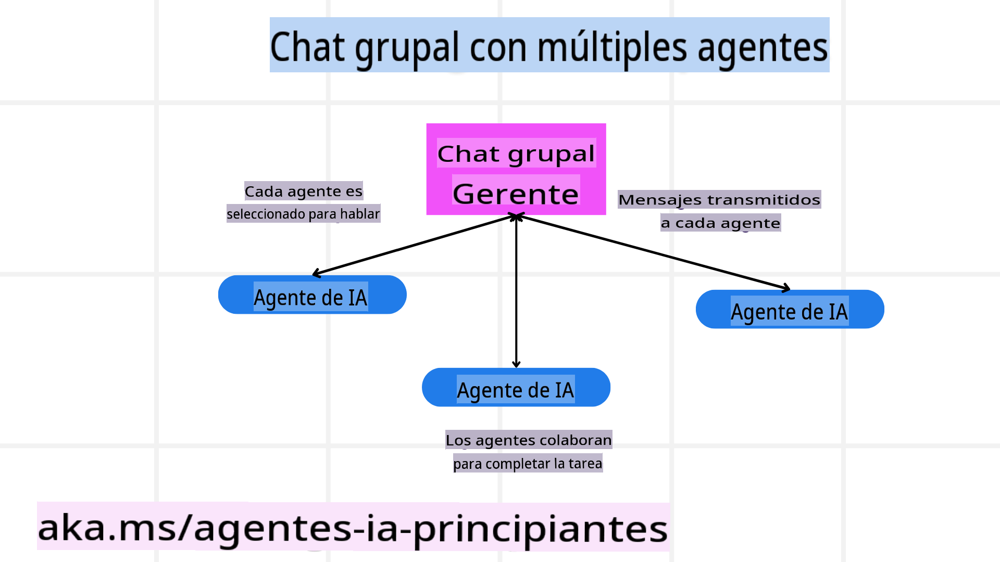
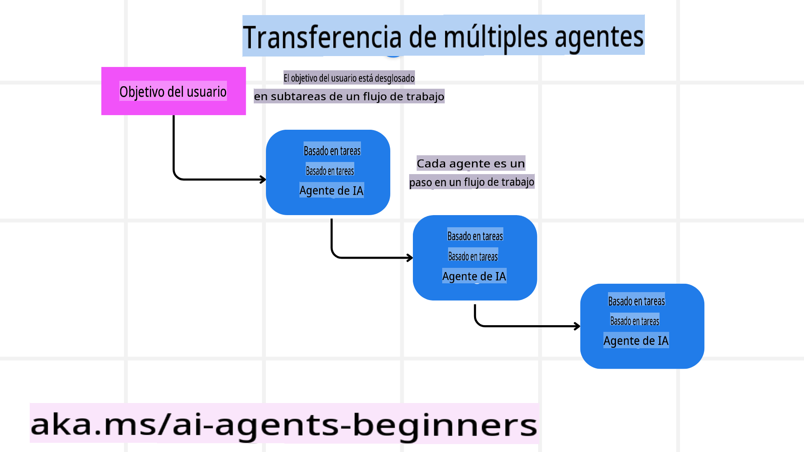
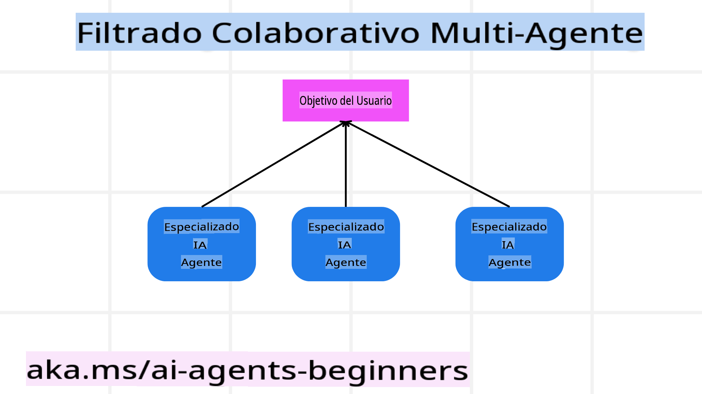

# Patrones de diseño de múltiples agentes

Tan pronto como comiences a trabajar en un proyecto que involucre múltiples agentes, necesitarás considerar el patrón de diseño de múltiples agentes. Sin embargo, puede que no sea inmediatamente evidente cuándo cambiar a un enfoque de múltiples agentes y cuáles son sus ventajas.  

## Introducción

En esta lección, buscamos responder las siguientes preguntas:

- ¿En qué escenarios son aplicables los múltiples agentes?  
- ¿Cuáles son las ventajas de usar múltiples agentes en lugar de un solo agente realizando múltiples tareas?  
- ¿Cuáles son los componentes básicos para implementar el patrón de diseño de múltiples agentes?  
- ¿Cómo podemos tener visibilidad de cómo interactúan entre sí los múltiples agentes?  

## Objetivos de aprendizaje

Al finalizar esta lección, deberías ser capaz de:

- Identificar escenarios donde los múltiples agentes son aplicables.  
- Reconocer las ventajas de usar múltiples agentes en lugar de un solo agente.  
- Comprender los componentes básicos para implementar el patrón de diseño de múltiples agentes.  

### ¿Cuál es la idea principal?

*Los múltiples agentes son un patrón de diseño que permite que varios agentes trabajen juntos para lograr un objetivo común*.  

Este patrón se utiliza ampliamente en diversos campos, incluidos la robótica, los sistemas autónomos y la computación distribuida.  

## Escenarios donde los múltiples agentes son aplicables

Entonces, ¿en qué escenarios es útil usar múltiples agentes? La respuesta es que hay muchos casos en los que emplear múltiples agentes resulta beneficioso, especialmente en las siguientes situaciones:

- **Altas cargas de trabajo**: Las cargas de trabajo grandes pueden dividirse en tareas más pequeñas y asignarse a diferentes agentes, permitiendo procesamiento en paralelo y una finalización más rápida. Un ejemplo de esto es en el caso de una tarea de procesamiento de datos a gran escala.
- **Tareas complejas**: Las tareas complejas, al igual que las grandes cargas de trabajo, pueden descomponerse en subtareas más pequeñas y asignarse a diferentes agentes, cada uno especializado en un aspecto específico de la tarea. Un buen ejemplo de esto es en el caso de vehículos autónomos, donde diferentes agentes gestionan la navegación, la detección de obstáculos y la comunicación con otros vehículos.
- **Diversidad de especialización**: Diferentes agentes pueden tener especializaciones diversas, permitiéndoles manejar distintos aspectos de una tarea de manera más efectiva que un único agente. Por ejemplo, en el caso del sector salud, los agentes pueden gestionar diagnósticos, planes de tratamiento y monitoreo de pacientes.

## Ventajas de usar múltiples agentes frente a un solo agente

Un sistema con un solo agente puede funcionar bien para tareas simples, pero para tareas más complejas, usar múltiples agentes puede ofrecer varias ventajas:

- **Especialización**: Cada agente puede especializarse en una tarea específica. La falta de especialización en un solo agente puede significar que este termine realizando tareas para las que no está mejor preparado. Por ejemplo, podría enfrentarse a tareas complejas que lo confundan o que realice de manera subóptima.  
- **Escalabilidad**: Es más sencillo escalar sistemas añadiendo más agentes en lugar de sobrecargar a un único agente.  
- **Tolerancia a fallos**: Si un agente falla, los demás pueden seguir funcionando, garantizando la fiabilidad del sistema.  

Tomemos un ejemplo: reservar un viaje para un usuario. Un sistema con un solo agente tendría que manejar todos los aspectos del proceso de reserva de viaje, desde encontrar vuelos hasta reservar hoteles y autos de alquiler. Para lograr esto, el agente único necesitaría herramientas para gestionar todas estas tareas, lo que podría llevar a un sistema complejo y monolítico, difícil de mantener y escalar. Un sistema con múltiples agentes, en cambio, podría tener diferentes agentes especializados en encontrar vuelos, reservar hoteles y autos de alquiler. Esto haría que el sistema fuera más modular, fácil de mantener y escalable.

Compáralo con una agencia de viajes administrada como un pequeño negocio familiar frente a una agencia de viajes operada como una franquicia. El negocio familiar tendría un solo agente manejando todos los aspectos del proceso de reserva de viaje, mientras que la franquicia tendría diferentes agentes gestionando distintos aspectos del proceso.

## Componentes básicos para implementar el patrón de diseño de múltiples agentes

Antes de implementar el patrón de diseño de múltiples agentes, necesitas entender los componentes básicos que conforman este patrón.

Hagamos esto más concreto volviendo al ejemplo de reservar un viaje para un usuario. En este caso, los componentes básicos incluirían:

- **Comunicación entre agentes**: Los agentes encargados de encontrar vuelos, reservar hoteles y autos de alquiler necesitan comunicarse y compartir información sobre las preferencias y restricciones del usuario. Necesitarás decidir los protocolos y métodos para esta comunicación. Por ejemplo, el agente que encuentra vuelos debe comunicarse con el agente que reserva hoteles para asegurarse de que el hotel esté reservado para las mismas fechas que el vuelo. Esto significa que los agentes deben compartir información sobre las fechas de viaje del usuario, por lo que necesitas decidir *qué información comparten los agentes y cómo la comparten*.  
- **Mecanismos de coordinación**: Los agentes deben coordinar sus acciones para asegurarse de que se cumplan las preferencias y restricciones del usuario. Por ejemplo, una preferencia del usuario podría ser que quiere un hotel cerca del aeropuerto, mientras que una restricción podría ser que los autos de alquiler solo están disponibles en el aeropuerto. Esto significa que el agente que reserva hoteles necesita coordinarse con el agente que reserva autos de alquiler para cumplir con las preferencias y restricciones del usuario. Necesitarás decidir *cómo los agentes coordinan sus acciones*.  
- **Arquitectura de los agentes**: Los agentes necesitan una estructura interna para tomar decisiones y aprender de sus interacciones con el usuario. Por ejemplo, el agente que encuentra vuelos necesita una estructura interna para decidir qué vuelos recomendar al usuario. Esto significa que necesitas decidir *cómo los agentes toman decisiones y aprenden de sus interacciones con el usuario*. Un ejemplo de cómo un agente puede aprender y mejorar es que el agente que encuentra vuelos podría usar un modelo de aprendizaje automático para recomendar vuelos al usuario basándose en sus preferencias pasadas.  
- **Visibilidad de las interacciones entre agentes**: Es necesario tener visibilidad de cómo interactúan entre sí los múltiples agentes. Esto implica contar con herramientas y técnicas para rastrear las actividades e interacciones de los agentes. Podrías usar herramientas de registro y monitoreo, herramientas de visualización y métricas de rendimiento.  
- **Patrones de múltiples agentes**: Existen diferentes patrones para implementar sistemas de múltiples agentes, como arquitecturas centralizadas, descentralizadas e híbridas. Necesitarás decidir cuál se adapta mejor a tu caso de uso.  
- **Intervención humana**: En la mayoría de los casos, habrá un humano involucrado en el proceso, y necesitarás instruir a los agentes sobre cuándo pedir la intervención humana. Por ejemplo, un usuario podría pedir un hotel o un vuelo específico que los agentes no hayan recomendado, o podría solicitar confirmación antes de realizar una reserva.  

## Visibilidad de las interacciones entre agentes

Es importante tener visibilidad de cómo interactúan entre sí los múltiples agentes. Esta visibilidad es esencial para depurar, optimizar y garantizar la efectividad general del sistema. Para lograrlo, necesitas herramientas y técnicas para rastrear las actividades e interacciones de los agentes. Esto podría incluir herramientas de registro y monitoreo, herramientas de visualización y métricas de rendimiento.

Por ejemplo, en el caso de reservar un viaje para un usuario, podrías tener un panel de control que muestre el estado de cada agente, las preferencias y restricciones del usuario, y las interacciones entre los agentes. Este panel podría mostrar las fechas de viaje del usuario, los vuelos recomendados por el agente de vuelos, los hoteles recomendados por el agente de hoteles y los autos de alquiler recomendados por el agente de autos de alquiler. Esto te daría una visión clara de cómo interactúan entre sí los agentes y si se están cumpliendo las preferencias y restricciones del usuario.

Veamos cada uno de estos aspectos con más detalle:

- **Herramientas de registro y monitoreo**: Es importante registrar cada acción tomada por un agente. Una entrada en el registro podría incluir información sobre el agente que realizó la acción, la acción realizada, el momento en que se realizó y el resultado de la acción. Esta información puede usarse para depurar, optimizar y más.  
- **Herramientas de visualización**: Las herramientas de visualización pueden ayudarte a entender las interacciones entre los agentes de manera más intuitiva. Por ejemplo, podrías tener un gráfico que muestre el flujo de información entre los agentes. Esto podría ayudarte a identificar cuellos de botella, ineficiencias y otros problemas en el sistema.  
- **Métricas de rendimiento**: Las métricas de rendimiento pueden ayudarte a rastrear la efectividad del sistema de múltiples agentes. Por ejemplo, podrías rastrear el tiempo necesario para completar una tarea, el número de tareas completadas por unidad de tiempo y la precisión de las recomendaciones realizadas por los agentes. Esta información puede ayudarte a identificar áreas de mejora y optimizar el sistema.  

## Patrones de múltiples agentes

Veamos algunos patrones concretos que podemos usar para crear aplicaciones de múltiples agentes. Aquí hay algunos patrones interesantes que vale la pena considerar:

### Chat grupal

Este patrón es útil cuando quieres crear una aplicación de chat grupal donde múltiples agentes puedan comunicarse entre sí. Los casos de uso típicos de este patrón incluyen colaboración en equipo, soporte al cliente y redes sociales.

En este patrón, cada agente representa a un usuario en el chat grupal, y los mensajes se intercambian entre los agentes utilizando un protocolo de mensajería. Los agentes pueden enviar mensajes al chat grupal, recibir mensajes del chat grupal y responder a mensajes de otros agentes.

Este patrón puede implementarse utilizando una arquitectura centralizada, donde todos los mensajes se enrutan a través de un servidor central, o una arquitectura descentralizada, donde los mensajes se intercambian directamente.

### Transferencia de tareas (Hand-off)

Este patrón es útil cuando deseas crear una aplicación donde múltiples agentes puedan transferir tareas entre sí.

Los casos de uso típicos de este patrón incluyen soporte al cliente, gestión de tareas y automatización de flujos de trabajo.

En este patrón, cada agente representa una tarea o un paso en un flujo de trabajo, y los agentes pueden transferir tareas a otros agentes basándose en reglas predefinidas.

### Filtrado colaborativo

Este patrón es útil cuando deseas crear una aplicación donde múltiples agentes puedan colaborar para hacer recomendaciones a los usuarios.

¿Por qué querrías que múltiples agentes colaboren? Porque cada agente puede tener diferentes especializaciones y contribuir al proceso de recomendación de maneras distintas.

Tomemos un ejemplo donde un usuario quiere una recomendación sobre la mejor acción para comprar en el mercado de valores:

- **Experto en la industria**: Un agente podría ser experto en una industria específica.  
- **Análisis técnico**: Otro agente podría ser experto en análisis técnico.  
- **Análisis fundamental**: Y otro agente podría ser experto en análisis fundamental.  

Colaborando, estos agentes pueden proporcionar una recomendación más completa al usuario.  

## Escenario: Proceso de reembolso

Consideremos un escenario donde un cliente está intentando obtener un reembolso por un producto. Puede haber varios agentes involucrados en este proceso, pero dividámoslos entre agentes específicos para este proceso y agentes generales que pueden usarse en otros procesos.

**Agentes específicos para el proceso de reembolso**:

A continuación, algunos agentes que podrían estar involucrados en el proceso de reembolso:

- **Agente del cliente**: Representa al cliente y es responsable de iniciar el proceso de reembolso.  
- **Agente del vendedor**: Representa al vendedor y es responsable de procesar el reembolso.  
- **Agente de pagos**: Representa el proceso de pago y es responsable de reembolsar el pago del cliente.  
- **Agente de resolución**: Representa el proceso de resolución y es responsable de resolver cualquier problema que surja durante el proceso de reembolso.  
- **Agente de cumplimiento**: Representa el proceso de cumplimiento y es responsable de garantizar que el proceso de reembolso cumpla con las normativas y políticas.  

**Agentes generales**:

Estos agentes pueden usarse en otras partes de tu negocio:

- **Agente de envío**: Representa el proceso de envío y es responsable de devolver el producto al vendedor. Este agente puede usarse tanto para el proceso de reembolso como para el envío general de un producto tras una compra, por ejemplo.  
- **Agente de retroalimentación**: Representa el proceso de retroalimentación y es responsable de recopilar comentarios del cliente. La retroalimentación podría obtenerse en cualquier momento, no solo durante el proceso de reembolso.  
- **Agente de escalamiento**: Representa el proceso de escalamiento y es responsable de escalar problemas a un nivel superior de soporte. Este tipo de agente puede usarse en cualquier proceso donde necesites escalar un problema.  
- **Agente de notificaciones**: Representa el proceso de notificaciones y es responsable de enviar notificaciones al cliente en varias etapas del proceso de reembolso.  
- **Agente de análisis**: Representa el proceso de análisis y es responsable de analizar datos relacionados con el proceso de reembolso.  
- **Agente de auditoría**: Representa el proceso de auditoría y es responsable de auditar el proceso de reembolso para garantizar que se lleve a cabo correctamente.  
- **Agente de reportes**: Representa el proceso de reportes y es responsable de generar informes sobre el proceso de reembolso.  
- **Agente de conocimiento**: Representa el proceso de gestión del conocimiento y es responsable de mantener una base de datos de información relacionada con el proceso de reembolso. Este agente podría ser útil tanto para reembolsos como para otras partes de tu negocio.  
- **Agente de seguridad**: Representa el proceso de seguridad y es responsable de garantizar la seguridad del proceso de reembolso.  
- **Agente de calidad**: Representa el proceso de calidad y es responsable de garantizar la calidad del proceso de reembolso.  

Hay bastantes agentes enumerados anteriormente, tanto específicos para el proceso de reembolso como generales que pueden usarse en otras partes de tu negocio. Esperamos que esto te dé una idea de cómo decidir qué agentes usar en tu sistema de múltiples agentes.

## Tarea

¿Cuál sería una buena tarea para esta lección?

Diseña un sistema de múltiples agentes para un proceso de soporte al cliente. Identifica los agentes involucrados en el proceso, sus roles y responsabilidades, y cómo interactúan entre sí. Considera tanto agentes específicos para el proceso de soporte al cliente como agentes generales que puedan usarse en otras partes de tu negocio.

> Reflexiona antes de leer la solución a continuación, puede que necesites más agentes de los que crees.

> TIP: Piensa en las diferentes etapas del proceso de soporte al cliente y también considera los agentes necesarios para cualquier sistema.

## Solución

[Solución](./solution/solution.md)

## Verificaciones de conocimiento

Pregunta: ¿Cuándo deberías considerar usar múltiples agentes?

- [] A1: Cuando tienes una carga de trabajo pequeña y una tarea sencilla.  
- [] A2: Cuando tienes una carga de trabajo grande.  
- [] A3: Cuando tienes una tarea sencilla.  

[Solución del cuestionario](./solution/solution-quiz.md)  

## Resumen

En esta lección, hemos explorado el patrón de diseño de múltiples agentes, incluidos los escenarios donde son aplicables, las ventajas de usar múltiples agentes en lugar de un solo agente, los componentes básicos para implementar el patrón de diseño de múltiples agentes y cómo tener visibilidad de cómo interactúan entre sí los múltiples agentes.

## Recursos adicionales

- [Autogen design patterns](https://microsoft.github.io/autogen/stable/user-guide/core-user-guide/design-patterns/intro.html)  
- [Agentic design patterns](https://www.analyticsvidhya.com/blog/2024/10/agentic-design-patterns/)  

**Descargo de responsabilidad**:  
Este documento ha sido traducido utilizando servicios de traducción automática basados en inteligencia artificial. Si bien nos esforzamos por garantizar la precisión, tenga en cuenta que las traducciones automáticas pueden contener errores o imprecisiones. El documento original en su idioma nativo debe considerarse como la fuente autorizada. Para información crítica, se recomienda una traducción profesional realizada por humanos. No nos hacemos responsables de malentendidos o interpretaciones erróneas que puedan surgir del uso de esta traducción.