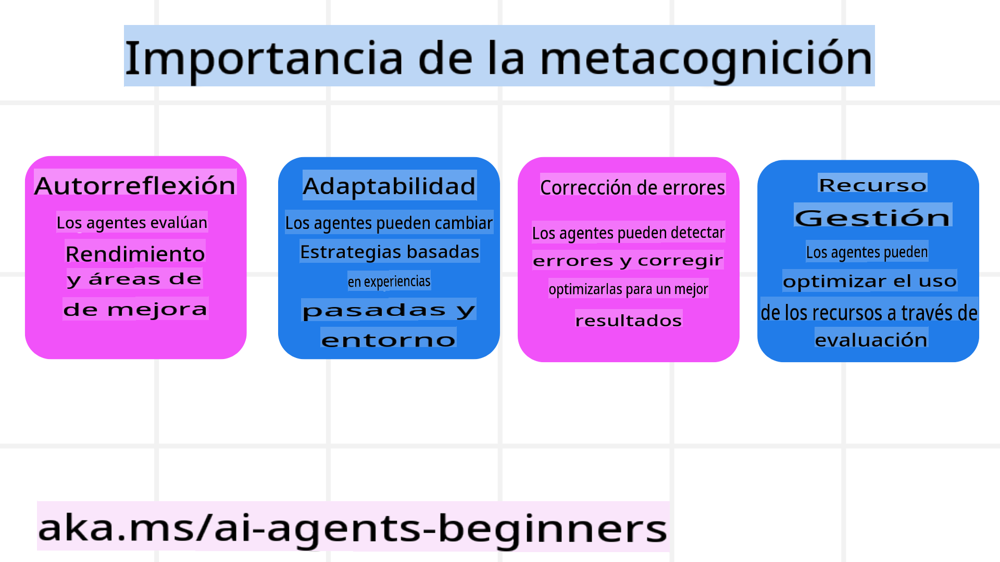
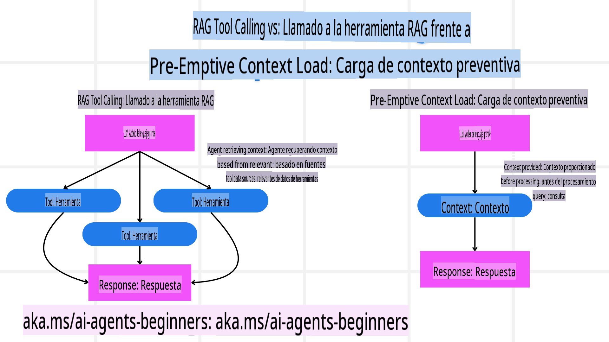

<!--
CO_OP_TRANSLATOR_METADATA:
{
  "original_hash": "3171ed887315c3ddeaccf966e40e9a50",
  "translation_date": "2025-03-28T10:38:08+00:00",
  "source_file": "09-metacognition\\README.md",
  "language_code": "es"
}
-->
[](https://youtu.be/His9R6gw6Ec?si=3_RMb8VprNvdLRhX)

> _(Haz clic en la imagen de arriba para ver el video de esta lección)_

# Metacognición en Agentes de IA

## Introducción

¡Bienvenido a la lección sobre metacognición en agentes de IA! Este capítulo está diseñado para principiantes interesados en cómo los agentes de IA pueden reflexionar sobre sus propios procesos de pensamiento. Al final de esta lección, comprenderás conceptos clave y tendrás ejemplos prácticos para aplicar la metacognición en el diseño de agentes de IA.

## Objetivos de Aprendizaje

Después de completar esta lección, serás capaz de:

1. Entender las implicaciones de los bucles de razonamiento en las definiciones de agentes.
2. Usar técnicas de planificación y evaluación para ayudar a los agentes a autocorregirse.
3. Crear tus propios agentes capaces de manipular código para realizar tareas.

## Introducción a la Metacognición

La metacognición se refiere a los procesos cognitivos de orden superior que implican pensar sobre el propio pensamiento. Para los agentes de IA, esto significa poder evaluar y ajustar sus acciones basándose en la autoconciencia y las experiencias pasadas. La metacognición, o "pensar sobre el pensamiento", es un concepto importante en el desarrollo de sistemas de IA con capacidades autónomas. Implica que los sistemas de IA sean conscientes de sus propios procesos internos y puedan monitorear, regular y adaptar su comportamiento en consecuencia, tal como hacemos nosotros cuando evaluamos una situación o enfrentamos un problema.

Esta autoconciencia puede ayudar a los sistemas de IA a tomar mejores decisiones, identificar errores y mejorar su desempeño con el tiempo, conectándose nuevamente con el Test de Turing y el debate sobre si la IA dominará el futuro. En el contexto de los sistemas de IA autónomos, la metacognición puede ayudar a abordar varios desafíos, como:

- Transparencia: Garantizar que los sistemas de IA puedan explicar su razonamiento y decisiones.
- Razonamiento: Mejorar la capacidad de los sistemas de IA para sintetizar información y tomar decisiones acertadas.
- Adaptación: Permitir que los sistemas de IA se ajusten a nuevos entornos y condiciones cambiantes.
- Percepción: Mejorar la precisión de los sistemas de IA al reconocer e interpretar datos de su entorno.

### ¿Qué es la Metacognición?

La metacognición, o "pensar sobre el pensamiento", es un proceso cognitivo de orden superior que implica autoconciencia y autorregulación de los propios procesos cognitivos. En el ámbito de la IA, la metacognición permite que los agentes evalúen y adapten sus estrategias y acciones, lo que lleva a una mejor resolución de problemas y capacidades de toma de decisiones. Al entender la metacognición, puedes diseñar agentes de IA que no solo sean más inteligentes, sino también más adaptables y eficientes.

En una verdadera metacognición, verías al agente razonando explícitamente sobre su propio razonamiento. Ejemplo: “Priorizé vuelos más económicos porque... podría estar perdiendo vuelos directos, así que déjame revisar nuevamente”. Manteniendo un registro de cómo o por qué eligió una ruta en particular.

- Notando que cometió errores porque confió demasiado en las preferencias del usuario de la última vez, por lo que modifica su estrategia de toma de decisiones, no solo la recomendación final.
- Diagnosticando patrones como, “Cada vez que el usuario menciona ‘demasiado concurrido,’ no solo debería eliminar ciertas atracciones, sino también reflexionar que mi método de elegir ‘principales atracciones’ está equivocado si siempre clasifico por popularidad.”

### Importancia de la Metacognición en Agentes de IA

La metacognición juega un papel crucial en el diseño de agentes de IA por varias razones:



- Reflexión Personal: Los agentes pueden evaluar su propio desempeño e identificar áreas de mejora.
- Adaptabilidad: Los agentes pueden modificar sus estrategias basándose en experiencias pasadas y entornos cambiantes.
- Corrección de Errores: Los agentes pueden detectar y corregir errores de manera autónoma, llevando a resultados más precisos.
- Gestión de Recursos: Los agentes pueden optimizar el uso de recursos, como tiempo y potencia computacional, mediante la planificación y evaluación de sus acciones.

## Componentes de un Agente de IA

Antes de profundizar en los procesos metacognitivos, es esencial comprender los componentes básicos de un agente de IA. Un agente de IA típicamente consta de:

- Persona: La personalidad y características del agente, que definen cómo interactúa con los usuarios.
- Herramientas: Las capacidades y funciones que el agente puede realizar.
- Habilidades: El conocimiento y la experiencia que posee el agente.

Estos componentes trabajan juntos para crear una "unidad de experiencia" que puede realizar tareas específicas.

**Ejemplo**: Piensa en un agente de viajes, servicios de agente que no solo planea tus vacaciones, sino que también ajusta su ruta basándose en datos en tiempo real y experiencias pasadas de los clientes.

### Ejemplo: Metacognición en un Servicio de Agente de Viajes

Imagina que estás diseñando un servicio de agente de viajes impulsado por IA. Este agente, "Agente de Viajes," ayuda a los usuarios a planificar sus vacaciones. Para incorporar metacognición, Agente de Viajes necesita evaluar y ajustar sus acciones basándose en la autoconciencia y las experiencias pasadas. Así es como la metacognición podría desempeñar un papel:

#### Tarea Actual

La tarea actual es ayudar a un usuario a planificar un viaje a París.

#### Pasos para Completar la Tarea

1. **Recopilar Preferencias del Usuario**: Preguntar al usuario sobre sus fechas de viaje, presupuesto, intereses (por ejemplo, museos, gastronomía, compras) y cualquier requisito específico.
2. **Recuperar Información**: Buscar opciones de vuelos, alojamientos, atracciones y restaurantes que coincidan con las preferencias del usuario.
3. **Generar Recomendaciones**: Proporcionar un itinerario personalizado con detalles de vuelos, reservas de hotel y actividades sugeridas.
4. **Ajustar Según la Retroalimentación**: Solicitar al usuario comentarios sobre las recomendaciones y realizar los ajustes necesarios.

#### Recursos Necesarios

- Acceso a bases de datos de vuelos y reservas de hoteles.
- Información sobre atracciones y restaurantes en París.
- Datos de retroalimentación de usuarios de interacciones anteriores.

#### Experiencia y Reflexión Personal

Agente de Viajes utiliza metacognición para evaluar su desempeño y aprender de experiencias pasadas. Por ejemplo:

1. **Analizar Retroalimentación del Usuario**: Agente de Viajes revisa los comentarios de los usuarios para determinar qué recomendaciones fueron bien recibidas y cuáles no. Ajusta sus futuras sugerencias en consecuencia.
2. **Adaptabilidad**: Si un usuario ha mencionado previamente que no le gustan los lugares concurridos, Agente de Viajes evitará recomendar lugares turísticos populares en horas pico en el futuro.
3. **Corrección de Errores**: Si Agente de Viajes cometió un error en una reserva pasada, como sugerir un hotel que estaba completamente reservado, aprende a verificar disponibilidad más rigurosamente antes de hacer recomendaciones.

#### Ejemplo Práctico para Desarrolladores

Aquí hay un ejemplo simplificado de cómo podría verse el código de Agente de Viajes al incorporar metacognición:

```python
class Travel_Agent:
    def __init__(self):
        self.user_preferences = {}
        self.experience_data = []

    def gather_preferences(self, preferences):
        self.user_preferences = preferences

    def retrieve_information(self):
        # Search for flights, hotels, and attractions based on preferences
        flights = search_flights(self.user_preferences)
        hotels = search_hotels(self.user_preferences)
        attractions = search_attractions(self.user_preferences)
        return flights, hotels, attractions

    def generate_recommendations(self):
        flights, hotels, attractions = self.retrieve_information()
        itinerary = create_itinerary(flights, hotels, attractions)
        return itinerary

    def adjust_based_on_feedback(self, feedback):
        self.experience_data.append(feedback)
        # Analyze feedback and adjust future recommendations
        self.user_preferences = adjust_preferences(self.user_preferences, feedback)

# Example usage
travel_agent = Travel_Agent()
preferences = {
    "destination": "Paris",
    "dates": "2025-04-01 to 2025-04-10",
    "budget": "moderate",
    "interests": ["museums", "cuisine"]
}
travel_agent.gather_preferences(preferences)
itinerary = travel_agent.generate_recommendations()
print("Suggested Itinerary:", itinerary)
feedback = {"liked": ["Louvre Museum"], "disliked": ["Eiffel Tower (too crowded)"]}
travel_agent.adjust_based_on_feedback(feedback)
```

#### Por Qué Importa la Metacognición

- **Reflexión Personal**: Los agentes pueden analizar su desempeño e identificar áreas de mejora.
- **Adaptabilidad**: Los agentes pueden modificar estrategias basándose en comentarios y condiciones cambiantes.
- **Corrección de Errores**: Los agentes pueden detectar y corregir errores de manera autónoma.
- **Gestión de Recursos**: Los agentes pueden optimizar el uso de recursos, como tiempo y potencia computacional.

Al incorporar metacognición, Agente de Viajes puede proporcionar recomendaciones de viaje más personalizadas y precisas, mejorando la experiencia general del usuario.

---

## 2. Planificación en Agentes

La planificación es un componente crítico del comportamiento de los agentes de IA. Implica delinear los pasos necesarios para alcanzar un objetivo, considerando el estado actual, los recursos y posibles obstáculos.

### Elementos de la Planificación

- **Tarea Actual**: Definir claramente la tarea.
- **Pasos para Completar la Tarea**: Dividir la tarea en pasos manejables.
- **Recursos Necesarios**: Identificar los recursos necesarios.
- **Experiencia**: Utilizar experiencias pasadas para informar la planificación.

**Ejemplo**: Aquí están los pasos que Agente de Viajes necesita seguir para ayudar a un usuario a planificar su viaje de manera efectiva:

### Pasos para Agente de Viajes

1. **Recopilar Preferencias del Usuario**
   - Preguntar al usuario detalles sobre sus fechas de viaje, presupuesto, intereses y cualquier requisito específico.
   - Ejemplos: "¿Cuándo planeas viajar?" "¿Cuál es tu rango de presupuesto?" "¿Qué actividades disfrutas en tus vacaciones?"

2. **Recuperar Información**
   - Buscar opciones de viaje relevantes basándose en las preferencias del usuario.
   - **Vuelos**: Buscar vuelos disponibles dentro del presupuesto y fechas de viaje preferidas del usuario.
   - **Alojamientos**: Encontrar hoteles o propiedades en alquiler que coincidan con las preferencias del usuario en ubicación, precio y comodidades.
   - **Atracciones y Restaurantes**: Identificar atracciones populares, actividades y opciones gastronómicas que se alineen con los intereses del usuario.

3. **Generar Recomendaciones**
   - Compilar la información recuperada en un itinerario personalizado.
   - Proporcionar detalles como opciones de vuelos, reservas de hotel y actividades sugeridas, asegurándose de adaptar las recomendaciones a las preferencias del usuario.

4. **Presentar el Itinerario al Usuario**
   - Compartir el itinerario propuesto con el usuario para su revisión.
   - Ejemplo: "Aquí tienes un itinerario sugerido para tu viaje a París. Incluye detalles de vuelos, reservas de hotel y una lista de actividades y restaurantes recomendados. ¡Dime qué opinas!"

5. **Recopilar Retroalimentación**
   - Solicitar comentarios al usuario sobre el itinerario propuesto.
   - Ejemplos: "¿Te gustan las opciones de vuelo?" "¿El hotel se ajusta a tus necesidades?" "¿Hay alguna actividad que quieras añadir o eliminar?"

6. **Ajustar Según la Retroalimentación**
   - Modificar el itinerario basándose en los comentarios del usuario.
   - Realizar los cambios necesarios en las recomendaciones de vuelos, alojamiento y actividades para que coincidan mejor con las preferencias del usuario.

7. **Confirmación Final**
   - Presentar el itinerario actualizado al usuario para confirmación final.
   - Ejemplo: "He realizado los ajustes según tus comentarios. Aquí tienes el itinerario actualizado. ¿Todo se ve bien para ti?"

8. **Reservar y Confirmar Reservas**
   - Una vez que el usuario apruebe el itinerario, proceder con la reserva de vuelos, alojamientos y actividades preplanificadas.
   - Enviar detalles de confirmación al usuario.

9. **Proporcionar Soporte Continuo**
   - Estar disponible para ayudar al usuario con cualquier cambio o solicitud adicional antes y durante su viaje.
   - Ejemplo: "Si necesitas más ayuda durante tu viaje, ¡no dudes en contactarme en cualquier momento!"

### Ejemplo de Interacción

```python
class Travel_Agent:
    def __init__(self):
        self.user_preferences = {}
        self.experience_data = []

    def gather_preferences(self, preferences):
        self.user_preferences = preferences

    def retrieve_information(self):
        flights = search_flights(self.user_preferences)
        hotels = search_hotels(self.user_preferences)
        attractions = search_attractions(self.user_preferences)
        return flights, hotels, attractions

    def generate_recommendations(self):
        flights, hotels, attractions = self.retrieve_information()
        itinerary = create_itinerary(flights, hotels, attractions)
        return itinerary

    def adjust_based_on_feedback(self, feedback):
        self.experience_data.append(feedback)
        self.user_preferences = adjust_preferences(self.user_preferences, feedback)

# Example usage within a booing request
travel_agent = Travel_Agent()
preferences = {
    "destination": "Paris",
    "dates": "2025-04-01 to 2025-04-10",
    "budget": "moderate",
    "interests": ["museums", "cuisine"]
}
travel_agent.gather_preferences(preferences)
itinerary = travel_agent.generate_recommendations()
print("Suggested Itinerary:", itinerary)
feedback = {"liked": ["Louvre Museum"], "disliked": ["Eiffel Tower (too crowded)"]}
travel_agent.adjust_based_on_feedback(feedback)
```

## 3. Sistema Correctivo RAG

Primero, entendamos la diferencia entre la Herramienta RAG y la Carga de Contexto Preventiva.



### Generación con Recuperación Aumentada (RAG)

RAG combina un sistema de recuperación con un modelo generativo. Cuando se realiza una consulta, el sistema de recuperación obtiene documentos o datos relevantes de una fuente externa, y esta información recuperada se utiliza para aumentar la entrada al modelo generativo. Esto ayuda al modelo a generar respuestas más precisas y contextualmente relevantes.

En un sistema RAG, el agente recupera información relevante de una base de conocimientos y la utiliza para generar respuestas o acciones apropiadas.

### Enfoque Correctivo RAG

El enfoque Correctivo RAG se centra en usar técnicas RAG para corregir errores y mejorar la precisión de los agentes de IA. Esto implica:

1. **Técnica de Indicaciones**: Usar indicaciones específicas para guiar al agente en la recuperación de información relevante.
2. **Herramienta**: Implementar algoritmos y mecanismos que permitan al agente evaluar la relevancia de la información recuperada y generar respuestas precisas.
3. **Evaluación**: Evaluar continuamente el desempeño del agente y realizar ajustes para mejorar su precisión y eficiencia.
Ejemplo: RAG Correctivo en un Agente de Búsqueda Consideremos un agente de búsqueda que recupera información de la web para responder a consultas de los usuarios. El enfoque RAG Correctivo podría implicar: 1. **Técnica de Prompts**: Formular consultas de búsqueda basadas en la entrada del usuario. 2. **Herramienta**: Usar procesamiento de lenguaje natural y algoritmos de aprendizaje automático para clasificar y filtrar los resultados de búsqueda. 3. **Evaluación**: Analizar la retroalimentación del usuario para identificar y corregir inexactitudes en la información recuperada. ### RAG Correctivo en un Agente de Viajes RAG Correctivo (Generación Aumentada por Recuperación) mejora la capacidad de una IA para recuperar y generar información mientras corrige cualquier inexactitud. Veamos cómo un Agente de Viajes puede usar el enfoque RAG Correctivo para proporcionar recomendaciones de viaje más precisas y relevantes. Esto implica: - **Técnica de Prompts:** Usar prompts específicos para guiar al agente en la recuperación de información relevante. - **Herramienta:** Implementar algoritmos y mecanismos que permitan al agente evaluar la relevancia de la información recuperada y generar respuestas precisas. - **Evaluación:** Evaluar continuamente el rendimiento del agente y realizar ajustes para mejorar su precisión y eficiencia. #### Pasos para Implementar RAG Correctivo en un Agente de Viajes 1. **Interacción Inicial con el Usuario** - El Agente de Viajes recopila preferencias iniciales del usuario, como destino, fechas de viaje, presupuesto e intereses. - Ejemplo: ```python
     preferences = {
         "destination": "Paris",
         "dates": "2025-04-01 to 2025-04-10",
         "budget": "moderate",
         "interests": ["museums", "cuisine"]
     }
     ``` 2. **Recuperación de Información** - El Agente de Viajes recupera información sobre vuelos, alojamientos, atracciones y restaurantes según las preferencias del usuario. - Ejemplo: ```python
     flights = search_flights(preferences)
     hotels = search_hotels(preferences)
     attractions = search_attractions(preferences)
     ``` 3. **Generación de Recomendaciones Iniciales** - El Agente de Viajes utiliza la información recuperada para generar un itinerario personalizado. - Ejemplo: ```python
     itinerary = create_itinerary(flights, hotels, attractions)
     print("Suggested Itinerary:", itinerary)
     ``` 4. **Recopilación de Retroalimentación del Usuario** - El Agente de Viajes solicita al usuario retroalimentación sobre las recomendaciones iniciales. - Ejemplo: ```python
     feedback = {
         "liked": ["Louvre Museum"],
         "disliked": ["Eiffel Tower (too crowded)"]
     }
     ``` 5. **Proceso RAG Correctivo** - **Técnica de Prompts**: El Agente de Viajes formula nuevas consultas de búsqueda basadas en la retroalimentación del usuario. - Ejemplo: ```python
       if "disliked" in feedback:
           preferences["avoid"] = feedback["disliked"]
       ``` - **Herramienta**: El Agente de Viajes utiliza algoritmos para clasificar y filtrar nuevos resultados de búsqueda, destacando la relevancia basada en la retroalimentación del usuario. - Ejemplo: ```python
       new_attractions = search_attractions(preferences)
       new_itinerary = create_itinerary(flights, hotels, new_attractions)
       print("Updated Itinerary:", new_itinerary)
       ``` - **Evaluación**: El Agente de Viajes evalúa continuamente la relevancia y precisión de sus recomendaciones analizando la retroalimentación del usuario y realizando los ajustes necesarios. - Ejemplo: ```python
       def adjust_preferences(preferences, feedback):
           if "liked" in feedback:
               preferences["favorites"] = feedback["liked"]
           if "disliked" in feedback:
               preferences["avoid"] = feedback["disliked"]
           return preferences

       preferences = adjust_preferences(preferences, feedback)
       ``` #### Ejemplo Práctico Aquí hay un ejemplo simplificado de código en Python que incorpora el enfoque RAG Correctivo en un Agente de Viajes: ```python
class Travel_Agent:
    def __init__(self):
        self.user_preferences = {}
        self.experience_data = []

    def gather_preferences(self, preferences):
        self.user_preferences = preferences

    def retrieve_information(self):
        flights = search_flights(self.user_preferences)
        hotels = search_hotels(self.user_preferences)
        attractions = search_attractions(self.user_preferences)
        return flights, hotels, attractions

    def generate_recommendations(self):
        flights, hotels, attractions = self.retrieve_information()
        itinerary = create_itinerary(flights, hotels, attractions)
        return itinerary

    def adjust_based_on_feedback(self, feedback):
        self.experience_data.append(feedback)
        self.user_preferences = adjust_preferences(self.user_preferences, feedback)
        new_itinerary = self.generate_recommendations()
        return new_itinerary

# Example usage
travel_agent = Travel_Agent()
preferences = {
    "destination": "Paris",
    "dates": "2025-04-01 to 2025-04-10",
    "budget": "moderate",
    "interests": ["museums", "cuisine"]
}
travel_agent.gather_preferences(preferences)
itinerary = travel_agent.generate_recommendations()
print("Suggested Itinerary:", itinerary)
feedback = {"liked": ["Louvre Museum"], "disliked": ["Eiffel Tower (too crowded)"]}
new_itinerary = travel_agent.adjust_based_on_feedback(feedback)
print("Updated Itinerary:", new_itinerary)
``` ### Carga Contextual Preventiva La Carga Contextual Preventiva implica cargar contexto o información relevante en el modelo antes de procesar una consulta. Esto significa que el modelo tiene acceso a esta información desde el principio, lo que puede ayudarle a generar respuestas más informadas sin necesidad de recuperar datos adicionales durante el proceso. Aquí hay un ejemplo simplificado de cómo podría verse una carga contextual preventiva para una aplicación de agente de viajes en Python: ```python
class TravelAgent:
    def __init__(self):
        # Pre-load popular destinations and their information
        self.context = {
            "Paris": {"country": "France", "currency": "Euro", "language": "French", "attractions": ["Eiffel Tower", "Louvre Museum"]},
            "Tokyo": {"country": "Japan", "currency": "Yen", "language": "Japanese", "attractions": ["Tokyo Tower", "Shibuya Crossing"]},
            "New York": {"country": "USA", "currency": "Dollar", "language": "English", "attractions": ["Statue of Liberty", "Times Square"]},
            "Sydney": {"country": "Australia", "currency": "Dollar", "language": "English", "attractions": ["Sydney Opera House", "Bondi Beach"]}
        }

    def get_destination_info(self, destination):
        # Fetch destination information from pre-loaded context
        info = self.context.get(destination)
        if info:
            return f"{destination}:\nCountry: {info['country']}\nCurrency: {info['currency']}\nLanguage: {info['language']}\nAttractions: {', '.join(info['attractions'])}"
        else:
            return f"Sorry, we don't have information on {destination}."

# Example usage
travel_agent = TravelAgent()
print(travel_agent.get_destination_info("Paris"))
print(travel_agent.get_destination_info("Tokyo"))
``` #### Explicación 1. **Inicialización (`__init__` method)**: The `TravelAgent` class pre-loads a dictionary containing information about popular destinations such as Paris, Tokyo, New York, and Sydney. This dictionary includes details like the country, currency, language, and major attractions for each destination.

2. **Retrieving Information (`get_destination_info` method)**: When a user queries about a specific destination, the `get_destination_info` método)**: Este método recupera la información relevante del diccionario de contexto pre-cargado. Al pre-cargar el contexto, la aplicación del agente de viajes puede responder rápidamente a las consultas de los usuarios sin tener que recuperar esta información de una fuente externa en tiempo real. Esto hace que la aplicación sea más eficiente y receptiva. ### Crear el Plan con un Objetivo Antes de Iterar Crear el plan con un objetivo implica comenzar con un resultado claro o meta en mente. Al definir este objetivo desde el principio, el modelo puede usarlo como principio orientador durante el proceso iterativo. Esto ayuda a garantizar que cada iteración avance hacia el logro del resultado deseado, haciendo que el proceso sea más eficiente y enfocado. Aquí hay un ejemplo de cómo podrías crear un plan de viaje con un objetivo antes de iterar para un agente de viajes en Python: ### Escenario Un agente de viajes quiere planificar unas vacaciones personalizadas para un cliente. El objetivo es crear un itinerario de viaje que maximice la satisfacción del cliente según sus preferencias y presupuesto. ### Pasos 1. Definir las preferencias y el presupuesto del cliente. 2. Crear el plan inicial basado en estas preferencias. 3. Iterar para refinar el plan, optimizando la satisfacción del cliente. #### Código Python ```python
class TravelAgent:
    def __init__(self, destinations):
        self.destinations = destinations

    def bootstrap_plan(self, preferences, budget):
        plan = []
        total_cost = 0

        for destination in self.destinations:
            if total_cost + destination['cost'] <= budget and self.match_preferences(destination, preferences):
                plan.append(destination)
                total_cost += destination['cost']

        return plan

    def match_preferences(self, destination, preferences):
        for key, value in preferences.items():
            if destination.get(key) != value:
                return False
        return True

    def iterate_plan(self, plan, preferences, budget):
        for i in range(len(plan)):
            for destination in self.destinations:
                if destination not in plan and self.match_preferences(destination, preferences) and self.calculate_cost(plan, destination) <= budget:
                    plan[i] = destination
                    break
        return plan

    def calculate_cost(self, plan, new_destination):
        return sum(destination['cost'] for destination in plan) + new_destination['cost']

# Example usage
destinations = [
    {"name": "Paris", "cost": 1000, "activity": "sightseeing"},
    {"name": "Tokyo", "cost": 1200, "activity": "shopping"},
    {"name": "New York", "cost": 900, "activity": "sightseeing"},
    {"name": "Sydney", "cost": 1100, "activity": "beach"},
]

preferences = {"activity": "sightseeing"}
budget = 2000

travel_agent = TravelAgent(destinations)
initial_plan = travel_agent.bootstrap_plan(preferences, budget)
print("Initial Plan:", initial_plan)

refined_plan = travel_agent.iterate_plan(initial_plan, preferences, budget)
print("Refined Plan:", refined_plan)
``` #### Explicación del Código 1. **Inicialización (`__init__` method)**: The `TravelAgent` class is initialized with a list of potential destinations, each having attributes like name, cost, and activity type.

2. **Bootstrapping the Plan (`bootstrap_plan` method)**: This method creates an initial travel plan based on the client's preferences and budget. It iterates through the list of destinations and adds them to the plan if they match the client's preferences and fit within the budget.

3. **Matching Preferences (`match_preferences` method)**: This method checks if a destination matches the client's preferences.

4. **Iterating the Plan (`iterate_plan` method)**: This method refines the initial plan by trying to replace each destination in the plan with a better match, considering the client's preferences and budget constraints.

5. **Calculating Cost (`calculate_cost` método)**: Este método calcula el costo total del plan actual, incluyendo un posible nuevo destino. #### Ejemplo de Uso - **Plan Inicial**: El agente de viajes crea un plan inicial basado en las preferencias del cliente para turismo y un presupuesto de $2000. - **Plan Refinado**: El agente de viajes itera el plan, optimizando las preferencias y el presupuesto del cliente. Al crear el plan con un objetivo claro (por ejemplo, maximizar la satisfacción del cliente) e iterar para refinar el plan, el agente de viajes puede crear un itinerario de viaje personalizado y optimizado para el cliente. Este enfoque asegura que el plan de viaje se alinee con las preferencias y el presupuesto del cliente desde el principio y mejore con cada iteración. ### Aprovechar los LLM para Re-ranking y Puntuación Los Modelos de Lenguaje Grande (LLMs) pueden usarse para re-ranking y puntuación al evaluar la relevancia y calidad de los documentos recuperados o respuestas generadas. Así es como funciona: **Recuperación:** El paso inicial de recuperación obtiene un conjunto de documentos o respuestas candidatos basados en la consulta. **Re-ranking:** El LLM evalúa estos candidatos y los reordena según su relevancia y calidad. Este paso asegura que se presente primero la información más relevante y de alta calidad. **Puntuación:** El LLM asigna puntuaciones a cada candidato, reflejando su relevancia y calidad. Esto ayuda a seleccionar la mejor respuesta o documento para el usuario. Al aprovechar los LLM para re-ranking y puntuación, el sistema puede proporcionar información más precisa y contextualmente relevante, mejorando la experiencia general del usuario. Aquí hay un ejemplo de cómo un agente de viajes podría usar un Modelo de Lenguaje Grande (LLM) para re-ranking y puntuación de destinos de viaje basados en las preferencias del usuario en Python: #### Escenario - Viajes según Preferencias Un agente de viajes quiere recomendar los mejores destinos de viaje a un cliente según sus preferencias. El LLM ayudará a reordenar y puntuar los destinos para garantizar que se presenten las opciones más relevantes. #### Pasos: 1. Recopilar las preferencias del usuario. 2. Recuperar una lista de posibles destinos de viaje. 3. Usar el LLM para reordenar y puntuar los destinos según las preferencias del usuario. Aquí está cómo puedes actualizar el ejemplo anterior para usar Azure OpenAI Services: #### Requisitos 1. Necesitas tener una suscripción a Azure. 2. Crear un recurso Azure OpenAI y obtener tu clave API. #### Código Python Ejemplo ```python
import requests
import json

class TravelAgent:
    def __init__(self, destinations):
        self.destinations = destinations

    def get_recommendations(self, preferences, api_key, endpoint):
        # Generate a prompt for the Azure OpenAI
        prompt = self.generate_prompt(preferences)
        
        # Define headers and payload for the request
        headers = {
            'Content-Type': 'application/json',
            'Authorization': f'Bearer {api_key}'
        }
        payload = {
            "prompt": prompt,
            "max_tokens": 150,
            "temperature": 0.7
        }
        
        # Call the Azure OpenAI API to get the re-ranked and scored destinations
        response = requests.post(endpoint, headers=headers, json=payload)
        response_data = response.json()
        
        # Extract and return the recommendations
        recommendations = response_data['choices'][0]['text'].strip().split('\n')
        return recommendations

    def generate_prompt(self, preferences):
        prompt = "Here are the travel destinations ranked and scored based on the following user preferences:\n"
        for key, value in preferences.items():
            prompt += f"{key}: {value}\n"
        prompt += "\nDestinations:\n"
        for destination in self.destinations:
            prompt += f"- {destination['name']}: {destination['description']}\n"
        return prompt

# Example usage
destinations = [
    {"name": "Paris", "description": "City of lights, known for its art, fashion, and culture."},
    {"name": "Tokyo", "description": "Vibrant city, famous for its modernity and traditional temples."},
    {"name": "New York", "description": "The city that never sleeps, with iconic landmarks and diverse culture."},
    {"name": "Sydney", "description": "Beautiful harbour city, known for its opera house and stunning beaches."},
]

preferences = {"activity": "sightseeing", "culture": "diverse"}
api_key = 'your_azure_openai_api_key'
endpoint = 'https://your-endpoint.com/openai/deployments/your-deployment-name/completions?api-version=2022-12-01'

travel_agent = TravelAgent(destinations)
recommendations = travel_agent.get_recommendations(preferences, api_key, endpoint)
print("Recommended Destinations:")
for rec in recommendations:
    print(rec)
``` #### Explicación del Código - Preference Booker 1. **Inicialización**: El `TravelAgent` class is initialized with a list of potential travel destinations, each having attributes like name and description.

2. **Getting Recommendations (`get_recommendations` method)**: This method generates a prompt for the Azure OpenAI service based on the user's preferences and makes an HTTP POST request to the Azure OpenAI API to get re-ranked and scored destinations.

3. **Generating Prompt (`generate_prompt` method)**: This method constructs a prompt for the Azure OpenAI, including the user's preferences and the list of destinations. The prompt guides the model to re-rank and score the destinations based on the provided preferences.

4. **API Call**: The `requests` library is used to make an HTTP POST request to the Azure OpenAI API endpoint. The response contains the re-ranked and scored destinations.

5. **Example Usage**: The travel agent collects user preferences (e.g., interest in sightseeing and diverse culture) and uses the Azure OpenAI service to get re-ranked and scored recommendations for travel destinations.

Make sure to replace `your_azure_openai_api_key` with your actual Azure OpenAI API key and `https://your-endpoint.com/...` con la URL del endpoint de tu implementación de Azure OpenAI. Al aprovechar el LLM para re-ranking y puntuación, el agente de viajes puede proporcionar recomendaciones de viaje más personalizadas y relevantes a los clientes, mejorando su experiencia general. ### RAG: Técnica de Prompts vs Herramienta La Generación Aumentada por Recuperación (RAG) puede ser tanto una técnica de prompts como una herramienta en el desarrollo de agentes de IA. Comprender la distinción entre las dos puede ayudarte a aprovechar RAG de manera más efectiva en tus proyectos. #### RAG como Técnica de Prompts **¿Qué es?** - Como técnica de prompts, RAG implica formular consultas o prompts específicos para guiar la recuperación de información relevante de un corpus o base de datos grande. Esta información se utiliza luego para generar respuestas o acciones. **Cómo funciona:** 1. **Formular Prompts**: Crear prompts o consultas bien estructurados basados en la tarea en cuestión o en la entrada del usuario. 2. **Recuperar Información**: Usar los prompts para buscar datos relevantes en una base de conocimiento o conjunto de datos preexistente. 3. **Generar Respuesta**: Combinar la información recuperada con modelos de IA generativa para producir una respuesta completa y coherente. **Ejemplo en Agente de Viajes**: - Entrada del Usuario: "Quiero visitar museos en París." - Prompt: "Encuentra los mejores museos en París." - Información Recuperada: Detalles sobre el Museo del Louvre, el Museo de Orsay, etc. - Respuesta Generada: "Aquí tienes algunos de los mejores museos en París: Museo del Louvre, Museo de Orsay y Centro Pompidou." #### RAG como Herramienta **¿Qué es?** - Como herramienta, RAG es un sistema integrado que automatiza el proceso de recuperación y generación, facilitando a los desarrolladores la implementación de funcionalidades de IA complejas sin necesidad de crear prompts manualmente para cada consulta. **Cómo funciona:** 1. **Integración**: Incorporar RAG dentro de la arquitectura del agente de IA, permitiéndole manejar automáticamente las tareas de recuperación y generación. 2. **Automatización**: La herramienta gestiona todo el proceso, desde recibir la entrada del usuario hasta generar la respuesta final, sin requerir prompts explícitos para cada paso. 3. **Eficiencia**: Mejora el rendimiento del agente al simplificar el proceso de recuperación y generación, permitiendo respuestas más rápidas y precisas. **Ejemplo en Agente de Viajes**: - Entrada del Usuario: "Quiero visitar museos en París." - Herramienta RAG: Recupera automáticamente información sobre museos y genera una respuesta. - Respuesta Generada: "Aquí tienes algunos de los mejores museos en París: Museo del Louvre, Museo de Orsay y Centro Pompidou." ### Comparación | Aspecto | Técnica de Prompts | Herramienta | |------------------------|-------------------------------------------------------------|-------------------------------------------------------| | **Manual vs Automático**| Formulación manual de prompts para cada consulta. | Proceso automatizado para recuperación y generación. | | **Control** | Ofrece más control sobre el proceso de recuperación. | Simplifica y automatiza la recuperación y generación.| | **Flexibilidad** | Permite prompts personalizados según necesidades específicas. | Más eficiente para implementaciones a gran escala. | | **Complejidad** | Requiere la creación y ajuste de prompts. | Más fácil de integrar dentro de la arquitectura del agente de IA. | ### Ejemplos Prácticos **Ejemplo de Técnica de Prompts:** ```python
def search_museums_in_paris():
    prompt = "Find top museums in Paris"
    search_results = search_web(prompt)
    return search_results

museums = search_museums_in_paris()
print("Top Museums in Paris:", museums)
``` **Ejemplo de Herramienta:** ```python
class Travel_Agent:
    def __init__(self):
        self.rag_tool = RAGTool()

    def get_museums_in_paris(self):
        user_input = "I want to visit museums in Paris."
        response = self.rag_tool.retrieve_and_generate(user_input)
        return response

travel_agent = Travel_Agent()
museums = travel_agent.get_museums_in_paris()
print("Top Museums in Paris:", museums)
``` ### Evaluación de Relevancia Evaluar la relevancia es un aspecto crucial del rendimiento de los agentes de IA. Garantiza que la información recuperada y generada por el agente sea apropiada, precisa y útil para el usuario. Exploremos cómo evaluar la relevancia en agentes de IA, incluyendo ejemplos prácticos y técnicas. #### Conceptos Clave en la Evaluación de Relevancia 1. **Conciencia del Contexto**: - El agente debe comprender el contexto de la consulta del usuario para recuperar y generar información relevante. - Ejemplo: Si un usuario pregunta por "mejores restaurantes en París", el agente debe considerar las preferencias del usuario, como tipo de cocina y presupuesto. 2. **Precisión**: - La información proporcionada por el agente debe ser correcta y actualizada. - Ejemplo: Recomendar restaurantes actualmente abiertos con buenas reseñas en lugar de opciones obsoletas o cerradas. 3. **Intención del Usuario**: -
El agente debe inferir la intención del usuario detrás de la consulta para proporcionar la información más relevante. - Ejemplo: Si un usuario pregunta por "hoteles económicos", el agente debe priorizar opciones asequibles. 4. **Bucle de Retroalimentación**: - Recopilar y analizar continuamente la retroalimentación del usuario ayuda al agente a refinar su proceso de evaluación de relevancia. - Ejemplo: Incorporar calificaciones y comentarios de los usuarios sobre recomendaciones anteriores para mejorar las respuestas futuras. #### Técnicas Prácticas para Evaluar la Relevancia 1. **Puntuación de Relevancia**: - Asignar una puntuación de relevancia a cada elemento recuperado según qué tan bien se ajusta a la consulta y preferencias del usuario. - Ejemplo: ```python
     def relevance_score(item, query):
         score = 0
         if item['category'] in query['interests']:
             score += 1
         if item['price'] <= query['budget']:
             score += 1
         if item['location'] == query['destination']:
             score += 1
         return score
     ``` 2. **Filtrado y Clasificación**: - Filtrar elementos irrelevantes y clasificar los restantes según sus puntuaciones de relevancia. - Ejemplo: ```python
     def filter_and_rank(items, query):
         ranked_items = sorted(items, key=lambda item: relevance_score(item, query), reverse=True)
         return ranked_items[:10]  # Return top 10 relevant items
     ``` 3. **Procesamiento de Lenguaje Natural (NLP)**: - Usar técnicas de NLP para comprender la consulta del usuario y recuperar información relevante. - Ejemplo: ```python
     def process_query(query):
         # Use NLP to extract key information from the user's query
         processed_query = nlp(query)
         return processed_query
     ``` 4. **Integración de Retroalimentación del Usuario**: - Recopilar comentarios de los usuarios sobre las recomendaciones proporcionadas y utilizarlos para ajustar futuras evaluaciones de relevancia. - Ejemplo: ```python
     def adjust_based_on_feedback(feedback, items):
         for item in items:
             if item['name'] in feedback['liked']:
                 item['relevance'] += 1
             if item['name'] in feedback['disliked']:
                 item['relevance'] -= 1
         return items
     ``` #### Ejemplo: Evaluación de Relevancia en Agente de Viajes Aquí hay un ejemplo práctico de cómo el Agente de Viajes puede evaluar la relevancia de las recomendaciones de viaje: ```python
class Travel_Agent:
    def __init__(self):
        self.user_preferences = {}
        self.experience_data = []

    def gather_preferences(self, preferences):
        self.user_preferences = preferences

    def retrieve_information(self):
        flights = search_flights(self.user_preferences)
        hotels = search_hotels(self.user_preferences)
        attractions = search_attractions(self.user_preferences)
        return flights, hotels, attractions

    def generate_recommendations(self):
        flights, hotels, attractions = self.retrieve_information()
        ranked_hotels = self.filter_and_rank(hotels, self.user_preferences)
        itinerary = create_itinerary(flights, ranked_hotels, attractions)
        return itinerary

    def filter_and_rank(self, items, query):
        ranked_items = sorted(items, key=lambda item: self.relevance_score(item, query), reverse=True)
        return ranked_items[:10]  # Return top 10 relevant items

    def relevance_score(self, item, query):
        score = 0
        if item['category'] in query['interests']:
            score += 1
        if item['price'] <= query['budget']:
            score += 1
        if item['location'] == query['destination']:
            score += 1
        return score

    def adjust_based_on_feedback(self, feedback, items):
        for item in items:
            if item['name'] in feedback['liked']:
                item['relevance'] += 1
            if item['name'] in feedback['disliked']:
                item['relevance'] -= 1
        return items

# Example usage
travel_agent = Travel_Agent()
preferences = {
    "destination": "Paris",
    "dates": "2025-04-01 to 2025-04-10",
    "budget": "moderate",
    "interests": ["museums", "cuisine"]
}
travel_agent.gather_preferences(preferences)
itinerary = travel_agent.generate_recommendations()
print("Suggested Itinerary:", itinerary)
feedback = {"liked": ["Louvre Museum"], "disliked": ["Eiffel Tower (too crowded)"]}
updated_items = travel_agent.adjust_based_on_feedback(feedback, itinerary['hotels'])
print("Updated Itinerary with Feedback:", updated_items)
``` ### Búsqueda con Intención Buscar con intención implica comprender e interpretar el propósito o objetivo subyacente detrás de la consulta de un usuario para recuperar y generar la información más relevante y útil. Este enfoque va más allá de simplemente coincidir palabras clave y se centra en captar las necesidades y el contexto reales del usuario. #### Conceptos Clave en la Búsqueda con Intención 1. **Comprender la Intención del Usuario**: - La intención del usuario puede categorizarse en tres tipos principales: informativa, de navegación y transaccional. - **Intención Informativa**: El usuario busca información sobre un tema (por ejemplo, "¿Cuáles son los mejores museos en París?"). - **Intención de Navegación**: El usuario quiere navegar a un sitio web o página específica (por ejemplo, "Sitio web oficial del Museo del Louvre"). - **Intención Transaccional**: El usuario busca realizar una transacción, como reservar un vuelo o hacer una compra (por ejemplo, "Reservar un vuelo a París"). 2. **Conciencia del Contexto**: - Analizar el contexto de la consulta del usuario ayuda a identificar con precisión su intención. Esto incluye considerar interacciones previas, preferencias del usuario y los detalles específicos de la consulta actual. 3. **Procesamiento de Lenguaje Natural (NLP)**: - Se emplean técnicas de NLP para comprender e interpretar las consultas en lenguaje natural proporcionadas por los usuarios. Esto incluye tareas como reconocimiento de entidades, análisis de sentimientos y análisis de consultas. 4. **Personalización**: - Personalizar los resultados de búsqueda según el historial, preferencias y comentarios del usuario mejora la relevancia de la información recuperada. #### Ejemplo Práctico: Búsqueda con Intención en Agente de Viajes Tomemos como ejemplo el Agente de Viajes para ver cómo se puede implementar la búsqueda con intención. 1. **Recopilación de Preferencias del Usuario** ```python
   class Travel_Agent:
       def __init__(self):
           self.user_preferences = {}

       def gather_preferences(self, preferences):
           self.user_preferences = preferences
   ``` 2. **Comprensión de la Intención del Usuario** ```python
   def identify_intent(query):
       if "book" in query or "purchase" in query:
           return "transactional"
       elif "website" in query or "official" in query:
           return "navigational"
       else:
           return "informational"
   ``` 3. **Conciencia del Contexto** ```python
   def analyze_context(query, user_history):
       # Combine current query with user history to understand context
       context = {
           "current_query": query,
           "user_history": user_history
       }
       return context
   ``` 4. **Buscar y Personalizar Resultados** ```python
   def search_with_intent(query, preferences, user_history):
       intent = identify_intent(query)
       context = analyze_context(query, user_history)
       if intent == "informational":
           search_results = search_information(query, preferences)
       elif intent == "navigational":
           search_results = search_navigation(query)
       elif intent == "transactional":
           search_results = search_transaction(query, preferences)
       personalized_results = personalize_results(search_results, user_history)
       return personalized_results

   def search_information(query, preferences):
       # Example search logic for informational intent
       results = search_web(f"best {preferences['interests']} in {preferences['destination']}")
       return results

   def search_navigation(query):
       # Example search logic for navigational intent
       results = search_web(query)
       return results

   def search_transaction(query, preferences):
       # Example search logic for transactional intent
       results = search_web(f"book {query} to {preferences['destination']}")
       return results

   def personalize_results(results, user_history):
       # Example personalization logic
       personalized = [result for result in results if result not in user_history]
       return personalized[:10]  # Return top 10 personalized results
   ``` 5. **Ejemplo de Uso** ```python
   travel_agent = Travel_Agent()
   preferences = {
       "destination": "Paris",
       "interests": ["museums", "cuisine"]
   }
   travel_agent.gather_preferences(preferences)
   user_history = ["Louvre Museum website", "Book flight to Paris"]
   query = "best museums in Paris"
   results = search_with_intent(query, preferences, user_history)
   print("Search Results:", results)
   ``` --- ## 4. Generación de Código como Herramienta Los agentes generadores de código utilizan modelos de IA para escribir y ejecutar código, resolviendo problemas complejos y automatizando tareas. ### Agentes Generadores de Código Los agentes generadores de código utilizan modelos de IA generativa para escribir y ejecutar código. Estos agentes pueden resolver problemas complejos, automatizar tareas y proporcionar información valiosa generando y ejecutando código en varios lenguajes de programación. #### Aplicaciones Prácticas 1. **Generación Automática de Código**: Generar fragmentos de código para tareas específicas, como análisis de datos, extracción web o aprendizaje automático. 2. **SQL como RAG**: Usar consultas SQL para recuperar y manipular datos de bases de datos. 3. **Resolución de Problemas**: Crear y ejecutar código para resolver problemas específicos, como optimizar algoritmos o analizar datos. #### Ejemplo: Agente Generador de Código para Análisis de Datos Imagina que estás diseñando un agente generador de código. Así es como podría funcionar: 1. **Tarea**: Analizar un conjunto de datos para identificar tendencias y patrones. 2. **Pasos**: - Cargar el conjunto de datos en una herramienta de análisis de datos. - Generar consultas SQL para filtrar y agregar los datos. - Ejecutar las consultas y recuperar los resultados. - Usar los resultados para generar visualizaciones e ideas. 3. **Recursos Necesarios**: Acceso al conjunto de datos, herramientas de análisis de datos y capacidades SQL. 4. **Experiencia**: Utilizar resultados de análisis previos para mejorar la precisión y relevancia de futuros análisis. ### Ejemplo: Agente Generador de Código para Agente de Viajes En este ejemplo, diseñaremos un agente generador de código, Agente de Viajes, para ayudar a los usuarios a planificar sus viajes generando y ejecutando código. Este agente puede manejar tareas como buscar opciones de viaje, filtrar resultados y compilar un itinerario utilizando IA generativa. #### Descripción General del Agente Generador de Código 1. **Recopilación de Preferencias del Usuario**: Recopila la entrada del usuario, como destino, fechas de viaje, presupuesto e intereses. 2. **Generación de Código para Obtener Datos**: Genera fragmentos de código para recuperar datos sobre vuelos, hoteles y atracciones. 3. **Ejecución del Código Generado**: Ejecuta el código generado para obtener información en tiempo real. 4. **Generación de Itinerario**: Compila los datos obtenidos en un plan de viaje personalizado. 5. **Ajuste Según Retroalimentación**: Recibe comentarios del usuario y regenera el código si es necesario para refinar los resultados. #### Implementación Paso a Paso 1. **Recopilación de Preferencias del Usuario** ```python
   class Travel_Agent:
       def __init__(self):
           self.user_preferences = {}

       def gather_preferences(self, preferences):
           self.user_preferences = preferences
   ``` 2. **Generación de Código para Obtener Datos** ```python
   def generate_code_to_fetch_data(preferences):
       # Example: Generate code to search for flights based on user preferences
       code = f"""
       def search_flights():
           import requests
           response = requests.get('https://api.example.com/flights', params={preferences})
           return response.json()
       """
       return code

   def generate_code_to_fetch_hotels(preferences):
       # Example: Generate code to search for hotels
       code = f"""
       def search_hotels():
           import requests
           response = requests.get('https://api.example.com/hotels', params={preferences})
           return response.json()
       """
       return code
   ``` 3. **Ejecución del Código Generado** ```python
   def execute_code(code):
       # Execute the generated code using exec
       exec(code)
       result = locals()
       return result

   travel_agent = Travel_Agent()
   preferences = {
       "destination": "Paris",
       "dates": "2025-04-01 to 2025-04-10",
       "budget": "moderate",
       "interests": ["museums", "cuisine"]
   }
   travel_agent.gather_preferences(preferences)
   
   flight_code = generate_code_to_fetch_data(preferences)
   hotel_code = generate_code_to_fetch_hotels(preferences)
   
   flights = execute_code(flight_code)
   hotels = execute_code(hotel_code)

   print("Flight Options:", flights)
   print("Hotel Options:", hotels)
   ``` 4. **Generación de Itinerario** ```python
   def generate_itinerary(flights, hotels, attractions):
       itinerary = {
           "flights": flights,
           "hotels": hotels,
           "attractions": attractions
       }
       return itinerary

   attractions = search_attractions(preferences)
   itinerary = generate_itinerary(flights, hotels, attractions)
   print("Suggested Itinerary:", itinerary)
   ``` 5. **Ajuste Según Retroalimentación** ```python
   def adjust_based_on_feedback(feedback, preferences):
       # Adjust preferences based on user feedback
       if "liked" in feedback:
           preferences["favorites"] = feedback["liked"]
       if "disliked" in feedback:
           preferences["avoid"] = feedback["disliked"]
       return preferences

   feedback = {"liked": ["Louvre Museum"], "disliked": ["Eiffel Tower (too crowded)"]}
   updated_preferences = adjust_based_on_feedback(feedback, preferences)
   
   # Regenerate and execute code with updated preferences
   updated_flight_code = generate_code_to_fetch_data(updated_preferences)
   updated_hotel_code = generate_code_to_fetch_hotels(updated_preferences)
   
   updated_flights = execute_code(updated_flight_code)
   updated_hotels = execute_code(updated_hotel_code)
   
   updated_itinerary = generate_itinerary(updated_flights, updated_hotels, attractions)
   print("Updated Itinerary:", updated_itinerary)
   ``` ### Aprovechando la Conciencia Ambiental y el Razonamiento Basarse en el esquema de la tabla puede mejorar el proceso de generación de consultas aprovechando la conciencia ambiental y el razonamiento. Aquí hay un ejemplo de cómo esto se puede hacer: 1. **Comprensión del Esquema**: El sistema comprenderá el esquema de la tabla y usará esta información para fundamentar la generación de consultas. 2. **Ajuste Según Retroalimentación**: El sistema ajustará las preferencias del usuario según los comentarios y razonará sobre qué campos del esquema deben actualizarse. 3. **Generación y Ejecución de Consultas**: El sistema generará y ejecutará consultas para obtener datos actualizados de vuelos y hoteles según las nuevas preferencias. Aquí hay un ejemplo de código Python actualizado que incorpora estos conceptos: ```python
def adjust_based_on_feedback(feedback, preferences, schema):
    # Adjust preferences based on user feedback
    if "liked" in feedback:
        preferences["favorites"] = feedback["liked"]
    if "disliked" in feedback:
        preferences["avoid"] = feedback["disliked"]
    # Reasoning based on schema to adjust other related preferences
    for field in schema:
        if field in preferences:
            preferences[field] = adjust_based_on_environment(feedback, field, schema)
    return preferences

def adjust_based_on_environment(feedback, field, schema):
    # Custom logic to adjust preferences based on schema and feedback
    if field in feedback["liked"]:
        return schema[field]["positive_adjustment"]
    elif field in feedback["disliked"]:
        return schema[field]["negative_adjustment"]
    return schema[field]["default"]

def generate_code_to_fetch_data(preferences):
    # Generate code to fetch flight data based on updated preferences
    return f"fetch_flights(preferences={preferences})"

def generate_code_to_fetch_hotels(preferences):
    # Generate code to fetch hotel data based on updated preferences
    return f"fetch_hotels(preferences={preferences})"

def execute_code(code):
    # Simulate execution of code and return mock data
    return {"data": f"Executed: {code}"}

def generate_itinerary(flights, hotels, attractions):
    # Generate itinerary based on flights, hotels, and attractions
    return {"flights": flights, "hotels": hotels, "attractions": attractions}

# Example schema
schema = {
    "favorites": {"positive_adjustment": "increase", "negative_adjustment": "decrease", "default": "neutral"},
    "avoid": {"positive_adjustment": "decrease", "negative_adjustment": "increase", "default": "neutral"}
}

# Example usage
preferences = {"favorites": "sightseeing", "avoid": "crowded places"}
feedback = {"liked": ["Louvre Museum"], "disliked": ["Eiffel Tower (too crowded)"]}
updated_preferences = adjust_based_on_feedback(feedback, preferences, schema)

# Regenerate and execute code with updated preferences
updated_flight_code = generate_code_to_fetch_data(updated_preferences)
updated_hotel_code = generate_code_to_fetch_hotels(updated_preferences)

updated_flights = execute_code(updated_flight_code)
updated_hotels = execute_code(updated_hotel_code)

updated_itinerary = generate_itinerary(updated_flights, updated_hotels, feedback["liked"])
print("Updated Itinerary:", updated_itinerary)
``` #### Explicación - Reserva Según Retroalimentación 1. **Conciencia del Esquema**: El método `schema` dictionary defines how preferences should be adjusted based on feedback. It includes fields like `favorites` and `avoid`, with corresponding adjustments.
2. **Adjusting Preferences (`adjust_based_on_feedback` method)**: This method adjusts preferences based on user feedback and the schema.
3. **Environment-Based Adjustments (`adjust_based_on_environment`)**: Este método personaliza los ajustes según el esquema y los comentarios. 4. **Generación y Ejecución de Consultas**: El sistema genera código para obtener datos actualizados de vuelos y hoteles según las preferencias ajustadas y simula la ejecución de estas consultas. 5. **Generación de Itinerario**: El sistema crea un itinerario actualizado basado en los nuevos datos de vuelos, hoteles y atracciones. Al hacer que el sistema sea consciente del entorno y razone basado en el esquema, puede generar consultas más precisas y relevantes, lo que conduce a mejores recomendaciones de viaje y una experiencia de usuario más personalizada. ### Uso de SQL como Técnica de Recuperación-Augmentada (RAG) SQL (Lenguaje de Consulta Estructurado) es una herramienta poderosa para interactuar con bases de datos. Cuando se utiliza como parte de un enfoque de Recuperación-Augmentada (RAG), SQL puede recuperar datos relevantes de bases de datos para informar y generar respuestas o acciones en agentes de IA. Exploremos cómo se puede usar SQL como técnica RAG en el contexto del Agente de Viajes. #### Conceptos Clave 1. **Interacción con Bases de Datos**: - SQL se utiliza para consultar bases de datos, recuperar información relevante y manipular datos. - Ejemplo: Obtener detalles de vuelos, información de hoteles y atracciones de una base de datos de viajes. 2. **Integración con RAG**: - Las consultas SQL se generan según la entrada y las preferencias del usuario. - Los datos recuperados se utilizan para generar recomendaciones o acciones personalizadas. 3. **Generación Dinámica de Consultas**: - El agente de IA genera consultas SQL dinámicas según el contexto y las necesidades del usuario. - Ejemplo: Personalizar consultas SQL para filtrar resultados según presupuesto, fechas e intereses. #### Aplicaciones - **Generación Automática de Código**: Generar fragmentos de código para tareas específicas. - **SQL como RAG**: Usar consultas SQL para manipular datos. - **Resolución de Problemas**: Crear y ejecutar código para resolver problemas. **Ejemplo**: Un agente de análisis de datos: 1. **Tarea**: Analizar un conjunto de datos para encontrar tendencias. 2. **Pasos**: - Cargar el conjunto de datos. - Generar consultas SQL para filtrar datos. - Ejecutar consultas y recuperar resultados. - Generar visualizaciones e ideas. 3. **Recursos**: Acceso al conjunto de datos, capacidades SQL. 4. **Experiencia**: Utilizar resultados anteriores para mejorar análisis futuros. #### Ejemplo Práctico: Uso de SQL en Agente de Viajes 1. **Recopilación de Preferencias del Usuario** ```python
   class Travel_Agent:
       def __init__(self):
           self.user_preferences = {}

       def gather_preferences(self, preferences):
           self.user_preferences = preferences
   ``` 2. **Generación de Consultas SQL** ```python
   def generate_sql_query(table, preferences):
       query = f"SELECT * FROM {table} WHERE "
       conditions = []
       for key, value in preferences.items():
           conditions.append(f"{key}='{value}'")
       query += " AND ".join(conditions)
       return query
   ``` 3. **Ejecución de Consultas SQL** ```python
   import sqlite3

   def execute_sql_query(query, database="travel.db"):
       connection = sqlite3.connect(database)
       cursor = connection.cursor()
       cursor.execute(query)
       results = cursor.fetchall()
       connection.close()
       return results
   ``` 4. **Generación de Recomendaciones** ```python
   def generate_recommendations(preferences):
       flight_query = generate_sql_query("flights", preferences)
       hotel_query = generate_sql_query("hotels", preferences)
       attraction_query = generate_sql_query("attractions", preferences)
       
       flights = execute_sql_query(flight_query)
       hotels = execute_sql_query(hotel_query)
       attractions = execute_sql_query(attraction_query)
       
       itinerary = {
           "flights": flights,
           "hotels": hotels,
           "attractions": attractions
       }
       return itinerary

   travel_agent = Travel_Agent()
   preferences = {
       "destination": "Paris",
       "dates": "2025-04-01 to 2025-04-10",
       "budget": "moderate",
       "interests": ["museums", "cuisine"]
   }
   travel_agent.gather_preferences(preferences)
   itinerary = generate_recommendations(preferences)
   print("Suggested Itinerary:", itinerary)
   ``` #### Ejemplo de Consultas SQL 1. **Consulta de Vuelos** ```sql
   SELECT * FROM flights WHERE destination='Paris' AND dates='2025-04-01 to 2025-04-10' AND budget='moderate';
   ``` 2. **Consulta de Hoteles** ```sql
   SELECT * FROM hotels WHERE destination='Paris' AND budget='moderate';
   ``` 3. **Consulta de Atracciones** ```sql
   SELECT * FROM attractions WHERE destination='Paris' AND interests='museums, cuisine';
   ``` Al aprovechar SQL como parte de la técnica de Recuperación-Augmentada (RAG), los agentes de IA como Agente de Viajes pueden recuperar y utilizar dinámicamente datos relevantes para proporcionar recomendaciones precisas y personalizadas. ### Ejemplo de Metacognición Para demostrar una implementación de metacognición, crearemos un agente simple que *reflexiona sobre su proceso de toma de decisiones* mientras resuelve un problema. En este ejemplo, construiremos un sistema donde un agente intenta optimizar la elección de un hotel, pero luego evalúa su propio razonamiento y ajusta su estrategia cuando comete errores o elige opciones subóptimas. Simularemos esto usando un ejemplo básico donde el agente selecciona hoteles según una combinación de precio y calidad, pero "reflexiona" sobre sus decisiones y ajusta en consecuencia. #### Cómo esto ilustra la metacognición: 1. **Decisión Inicial**: El agente elegirá el hotel más barato, sin comprender el impacto en la calidad. 2. **Reflexión y Evaluación**: Después de la elección inicial, el agente verificará si el hotel es una "mala" elección utilizando comentarios del usuario. Si encuentra que la calidad del hotel era demasiado baja, reflexiona sobre su razonamiento. 3. **Ajuste de Estrategia**: El agente ajusta su estrategia basado en su reflexión, cambiando de "más barato" a "mejor calidad", mejorando así su proceso de toma de decisiones en futuras iteraciones. Aquí hay un ejemplo: ```python
class HotelRecommendationAgent:
    def __init__(self):
        self.previous_choices = []  # Stores the hotels chosen previously
        self.corrected_choices = []  # Stores the corrected choices
        self.recommendation_strategies = ['cheapest', 'highest_quality']  # Available strategies

    def recommend_hotel(self, hotels, strategy):
        """
        Recommend a hotel based on the chosen strategy.
        The strategy can either be 'cheapest' or 'highest_quality'.
        """
        if strategy == 'cheapest':
            recommended = min(hotels, key=lambda x: x['price'])
        elif strategy == 'highest_quality':
            recommended = max(hotels, key=lambda x: x['quality'])
        else:
            recommended = None
        self.previous_choices.append((strategy, recommended))
        return recommended

    def reflect_on_choice(self):
        """
        Reflect on the last choice made and decide if the agent should adjust its strategy.
        The agent considers if the previous choice led to a poor outcome.
        """
        if not self.previous_choices:
            return "No choices made yet."

        last_choice_strategy, last_choice = self.previous_choices[-1]
        # Let's assume we have some user feedback that tells us whether the last choice was good or not
        user_feedback = self.get_user_feedback(last_choice)

        if user_feedback == "bad":
            # Adjust strategy if the previous choice was unsatisfactory
            new_strategy = 'highest_quality' if last_choice_strategy == 'cheapest' else 'cheapest'
            self.corrected_choices.append((new_strategy, last_choice))
            return f"Reflecting on choice. Adjusting strategy to {new_strategy}."
        else:
            return "The choice was good. No need to adjust."

    def get_user_feedback(self, hotel):
        """
        Simulate user feedback based on hotel attributes.
        For simplicity, assume if the hotel is too cheap, the feedback is "bad".
        If the hotel has quality less than 7, feedback is "bad".
        """
        if hotel['price'] < 100 or hotel['quality'] < 7:
            return "bad"
        return "good"

# Simulate a list of hotels (price and quality)
hotels = [
    {'name': 'Budget Inn', 'price': 80, 'quality': 6},
    {'name': 'Comfort Suites', 'price': 120, 'quality': 8},
    {'name': 'Luxury Stay', 'price': 200, 'quality': 9}
]

# Create an agent
agent = HotelRecommendationAgent()

# Step 1: The agent recommends a hotel using the "cheapest" strategy
recommended_hotel = agent.recommend_hotel(hotels, 'cheapest')
print(f"Recommended hotel (cheapest): {recommended_hotel['name']}")

# Step 2: The agent reflects on the choice and adjusts strategy if necessary
reflection_result = agent.reflect_on_choice()
print(reflection_result)

# Step 3: The agent recommends again, this time using the adjusted strategy
adjusted_recommendation = agent.recommend_hotel(hotels, 'highest_quality')
print(f"Adjusted hotel recommendation (highest_quality): {adjusted_recommendation['name']}")
``` #### Habilidades de Metacognición de los Agentes La clave aquí es la capacidad del agente de: - Evaluar sus elecciones anteriores y proceso de toma de decisiones. - Ajustar su estrategia basado en esa reflexión, es decir, metacognición en acción. Esto es una forma simple de metacognición donde el sistema es capaz de ajustar su proceso de razonamiento basado en retroalimentación interna. ### Conclusión La metacognición es una herramienta poderosa que puede mejorar significativamente las capacidades de los agentes de IA. Al incorporar metacognición
procesos, puedes diseñar agentes que sean más inteligentes, adaptables y eficientes. Utiliza los recursos adicionales para explorar más a fondo el fascinante mundo de la metacognición en agentes de IA. ## Lección anterior [Patrón de diseño multiagente](../08-multi-agent/README.md) ## Próxima lección [Agentes de IA en producción](../10-ai-agents-production/README.md)

**Descargo de responsabilidad**:  
Este documento ha sido traducido utilizando el servicio de traducción automática [Co-op Translator](https://github.com/Azure/co-op-translator). Aunque nos esforzamos por lograr precisión, tenga en cuenta que las traducciones automáticas pueden contener errores o imprecisiones. El documento original en su idioma nativo debe considerarse como la fuente autorizada. Para información crítica, se recomienda una traducción profesional realizada por humanos. No somos responsables de malentendidos o interpretaciones erróneas que puedan surgir del uso de esta traducción.