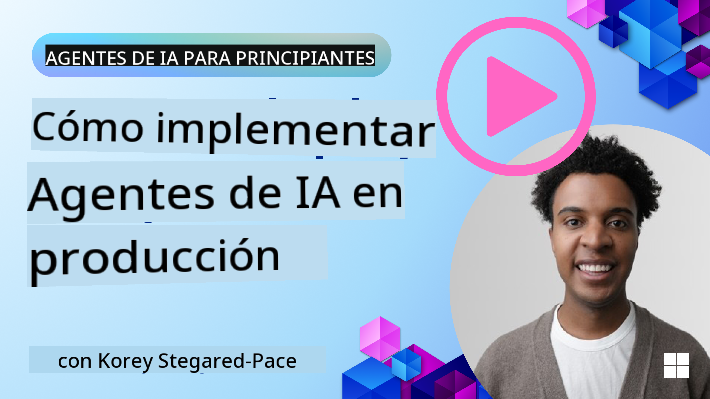

<!--
CO_OP_TRANSLATOR_METADATA:
{
  "original_hash": "44013a98d980c8b92d4b814dc49b545d",
  "translation_date": "2025-03-28T10:52:32+00:00",
  "source_file": "10-ai-agents-production\\README.md",
  "language_code": "es"
}
-->

> _(Haz clic en la imagen de arriba para ver el video de esta lección)_
# Agentes de IA en Producción

## Introducción

Esta lección cubrirá:

- Cómo planificar de manera efectiva el despliegue de tu agente de IA en producción.
- Errores comunes y problemas que podrías enfrentar al implementar tu agente de IA en producción.
- Cómo gestionar los costos mientras mantienes el rendimiento de tu agente de IA.

## Objetivos de Aprendizaje

Después de completar esta lección, sabrás cómo/entenderás:

- Técnicas para mejorar el rendimiento, los costos y la eficacia de un sistema de agentes de IA en producción.
- Qué evaluar y cómo evaluar tus agentes de IA.
- Cómo controlar los costos al desplegar agentes de IA en producción.

Es importante implementar agentes de IA confiables. Consulta la lección "Construyendo Agentes de IA Confiables".

## Evaluando Agentes de IA

Antes, durante y después de desplegar agentes de IA, es fundamental contar con un sistema adecuado para evaluarlos. Esto garantizará que tu sistema esté alineado con tus objetivos y los de tus usuarios.

Para evaluar un agente de IA, es importante tener la capacidad de evaluar no solo la salida del agente, sino también todo el sistema en el que opera. Esto incluye, entre otros aspectos:

- La solicitud inicial al modelo.
- La capacidad del agente para identificar la intención del usuario.
- La capacidad del agente para identificar la herramienta adecuada para realizar la tarea.
- La respuesta de la herramienta a la solicitud del agente.
- La capacidad del agente para interpretar la respuesta de la herramienta.
- La retroalimentación del usuario respecto a la respuesta del agente.

Esto te permitirá identificar áreas de mejora de forma más modular. Luego, podrás monitorear el impacto de los cambios en modelos, indicaciones, herramientas y otros componentes de manera más eficiente.

## Problemas Comunes y Soluciones Potenciales con Agentes de IA

| **Problema**                                   | **Solución Potencial**                                                                                                                                                                                                     |
| ---------------------------------------------- | -------------------------------------------------------------------------------------------------------------------------------------------------------------------------------------------------------------------------- |
| El agente de IA no realiza tareas de manera consistente | - Refina la indicación proporcionada al agente de IA; sé claro en los objetivos. - Identifica dónde dividir las tareas en subtareas y manejarlas con múltiples agentes puede ser útil.                                     |
| El agente de IA entra en bucles continuos      | - Asegúrate de tener términos y condiciones claros de finalización para que el agente sepa cuándo detener el proceso. - Para tareas complejas que requieren razonamiento y planificación, utiliza un modelo más grande especializado en estas tareas. |
| Las llamadas a herramientas del agente de IA no funcionan bien | - Prueba y valida la salida de la herramienta fuera del sistema del agente. - Refina los parámetros definidos, las indicaciones y los nombres de las herramientas.                                                       |
| El sistema multiagente no funciona de manera consistente | - Refina las indicaciones proporcionadas a cada agente para garantizar que sean específicas y distintas entre sí. - Construye un sistema jerárquico usando un agente "controlador" o de "enrutamiento" para determinar cuál agente es el adecuado.          |

## Gestión de Costos

Aquí hay algunas estrategias para gestionar los costos al desplegar agentes de IA en producción:

- **Caché de Respuestas** - Identificar solicitudes y tareas comunes y proporcionar las respuestas antes de que pasen por tu sistema de agentes es una buena manera de reducir el volumen de solicitudes similares. Incluso puedes implementar un flujo para identificar qué tan similar es una solicitud a tus respuestas almacenadas utilizando modelos de IA más básicos.

- **Uso de Modelos Más Pequeños** - Los Modelos de Lenguaje Pequeños (SLMs, por sus siglas en inglés) pueden funcionar bien en ciertos casos de uso de agentes y reducir significativamente los costos. Como se mencionó anteriormente, construir un sistema de evaluación para determinar y comparar el rendimiento frente a modelos más grandes es la mejor manera de entender qué tan bien funcionará un SLM en tu caso de uso.

- **Uso de un Modelo de Enrutamiento** - Una estrategia similar es usar una diversidad de modelos y tamaños. Puedes usar un LLM/SLM o una función sin servidor para enrutar solicitudes según su complejidad a los modelos más adecuados. Esto también ayudará a reducir costos mientras aseguras el rendimiento en las tareas correctas.

## Felicitaciones

Esta es actualmente la última lección de "Agentes de IA para Principiantes".

Planeamos continuar agregando lecciones basadas en comentarios y cambios en esta industria en constante crecimiento, así que vuelve a visitarnos en el futuro cercano.

Si deseas continuar aprendiendo y desarrollando con agentes de IA, únete al <a href="https://discord.gg/kzRShWzttr" target="_blank">Discord de la Comunidad Azure AI</a>.

Allí organizamos talleres, mesas redondas comunitarias y sesiones de "pregúntame lo que quieras".

También contamos con una colección de aprendizaje con materiales adicionales que pueden ayudarte a comenzar a construir agentes de IA en producción.

## Lección Anterior

[Patrón de Diseño de Metacognición](../09-metacognition/README.md)

**Descargo de responsabilidad**:  
Este documento ha sido traducido utilizando el servicio de traducción por IA [Co-op Translator](https://github.com/Azure/co-op-translator). Aunque nos esforzamos por garantizar la precisión, tenga en cuenta que las traducciones automatizadas pueden contener errores o imprecisiones. El documento original en su idioma nativo debe considerarse la fuente autorizada. Para información crítica, se recomienda una traducción profesional realizada por humanos. No nos hacemos responsables de ningún malentendido o interpretación errónea que surja del uso de esta traducción.