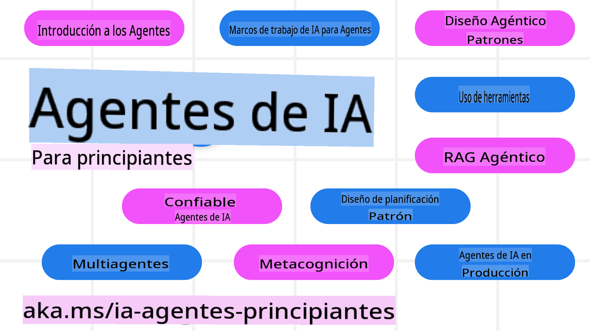

<!--
CO_OP_TRANSLATOR_METADATA:
{
  "original_hash": "09e975d95b470ee45ab546c22ee35d33",
  "translation_date": "2025-03-28T09:58:19+00:00",
  "source_file": "README.md",
  "language_code": "es"
}
-->
# Agentes de IA para Principiantes - Un Curso

## 10 Lecciones que enseñan todo lo necesario para comenzar a construir Agentes de IA

  
  
  
  
  

### Soporte de Idiomas
  
  
  
  
  
  
  
  
  
  
  
  

  
  
  

  

## 🌱 Comenzando

Este curso tiene 10 lecciones que cubren los fundamentos para construir Agentes de IA. Cada lección trata un tema específico, ¡así que comienza donde prefieras!

Hay soporte multilingüe para este curso. Consulta nuestros [idiomas disponibles aquí](../..).  

Si es tu primera vez construyendo con modelos de IA Generativa, revisa nuestro curso [Generative AI For Beginners](https://aka.ms/genai-beginners), que incluye 21 lecciones sobre cómo trabajar con GenAI.

No olvides [marcar con estrella (🌟) este repositorio](https://docs.github.com/en/get-started/exploring-projects-on-github/saving-repositories-with-stars?WT.mc_id=academic-105485-koreyst) y [hacer un fork de este repositorio](https://github.com/microsoft/ai-agents-for-beginners/fork) para ejecutar el código.

### Qué necesitas 

Cada lección de este curso incluye ejemplos de código, que se pueden encontrar en la carpeta code_samples. Puedes [hacer un fork de este repositorio](https://github.com/microsoft/ai-agents-for-beginners/fork) para crear tu propia copia.  

Los ejemplos de código en estos ejercicios utilizan Azure AI Foundry y GitHub Model Catalogs para interactuar con modelos de lenguaje:

- [Github Models](https://aka.ms/ai-agents-beginners/github-models) - Gratis / Limitado  
- [Azure AI Foundry](https://aka.ms/ai-agents-beginners/ai-foundry) - Requiere cuenta de Azure  

Este curso también utiliza los siguientes marcos y servicios de Agentes de IA de Microsoft:

- [Azure AI Agent Service](https://aka.ms/ai-agents-beginners/ai-agent-service)  
- [Semantic Kernel](https://aka.ms/ai-agents-beginners/semantic-kernel)  
- [AutoGen](https://aka.ms/ai-agents/autogen)  

Para obtener más información sobre cómo ejecutar el código de este curso, visita la [Configuración del Curso](./00-course-setup/README.md).  

## 🙏 ¿Quieres ayudar?  

¿Tienes sugerencias o encontraste errores ortográficos o de código? [Abre un problema](https://github.com/microsoft/ai-agents-for-beginners/issues?WT.mc_id=academic-105485-koreyst) o [Crea un pull request](https://github.com/microsoft/ai-agents-for-beginners/pulls?WT.mc_id=academic-105485-koreyst).  

Si te quedas atascado o tienes preguntas sobre cómo construir Agentes de IA, únete a nuestro [Discord de la Comunidad de Azure AI](https://discord.gg/kzRShWzttr).  

## 📂 Cada lección incluye  

- Una lección escrita ubicada en el README y un video corto  
- Ejemplos de código en Python compatibles con Azure AI Foundry y Modelos de Github (Gratis)  
- Enlaces a recursos adicionales para continuar aprendiendo  

## 🗃️ Lecciones  

| **Lección**                              | **Texto y Código**                                 | **Video**                                                  | **Aprendizaje Adicional**                                                           |
|------------------------------------------|----------------------------------------------------|------------------------------------------------------------|-------------------------------------------------------------------------------------|
| Introducción a los Agentes de IA y Casos de Uso de Agentes | [Enlace](./01-intro-to-ai-agents/README.md)        | [Video](https://youtu.be/3zgm60bXmQk?si=z8QygFvYQv-9WtO1)  | [Enlace](https://aka.ms/ai-agents-beginners/collection?WT.mc_id=academic-105485-koreyst) |
| Explorando Marcos de Trabajo Agénticos de IA        | [Enlace](./02-explore-agentic-frameworks/README.md)| [Video](https://youtu.be/ODwF-EZo_O8?si=Vawth4hzVaHv-u0H)  | [Enlace](https://aka.ms/ai-agents-beginners/collection?WT.mc_id=academic-105485-koreyst) |
| Comprendiendo Patrones de Diseño Agénticos de IA    | [Enlace](./03-agentic-design-patterns/README.md)   | [Video](https://youtu.be/m9lM8qqoOEA?si=BIzHwzstTPL8o9GF)  | [Enlace](https://aka.ms/ai-agents-beginners/collection?WT.mc_id=academic-105485-koreyst) |
| Patrón de Diseño para Uso de Herramientas           | [Enlace](./04-tool-use/README.md)                  | [Video](https://youtu.be/vieRiPRx-gI?si=2z6O2Xu2cu_Jz46N)  | [Enlace](https://aka.ms/ai-agents-beginners/collection?WT.mc_id=academic-105485-koreyst) |
| RAG Agéntico                                        | [Enlace](./05-agentic-rag/README.md)               | [Video](https://youtu.be/WcjAARvdL7I?si=gKPWsQpKiIlDH9A3)  | [Enlace](https://aka.ms/ai-agents-beginners/collection?WT.mc_id=academic-105485-koreyst) |
| Construyendo Agentes de IA Confiables               | [Enlace](./06-building-trustworthy-agents/README.md)| [Video](https://youtu.be/iZKkMEGBCUQ?si=jZjpiMnGFOE9L8OK)  | [Enlace](https://aka.ms/ai-agents-beginners/collection?WT.mc_id=academic-105485-koreyst) |
| Patrón de Diseño para Planificación                 | [Enlace](./07-planning-design/README.md)           | [Video](https://youtu.be/kPfJ2BrBCMY?si=6SC_iv_E5-mzucnC)  | [Enlace](https://aka.ms/ai-agents-beginners/collection?WT.mc_id=academic-105485-koreyst) |
| Patrón de Diseño Multi-Agente                       | [Enlace](./08-multi-agent/README.md)               | [Video](https://youtu.be/V6HpE9hZEx0?si=rMgDhEu7wXo2uo6g)  | [Enlace](https://aka.ms/ai-agents-beginners/collection?WT.mc_id=academic-105485-koreyst) |  
| Patrón de diseño de metacognición          | [Link](./09-metacognition/README.md)               | [Video](https://youtu.be/His9R6gw6Ec?si=8gck6vvdSNCt6OcF)  | [Link](https://aka.ms/ai-agents-beginners/collection?WT.mc_id=academic-105485-koreyst) |
| Agentes de IA en producción                | [Link](./10-ai-agents-production/README.md)        | [Video](https://youtu.be/l4TP6IyJxmQ?si=31dnhexRo6yLRJDl)  | [Link](https://aka.ms/ai-agents-beginners/collection?WT.mc_id=academic-105485-koreyst) |

## 🌐 Soporte multilingüe

| Idioma               | Código | Enlace al README traducido                             | Última actualización |
|----------------------|--------|-------------------------------------------------------|-----------------------|
| Chino (Simplificado) | zh     | [Traducción al chino](../zh/README.md)     | 2025-03-24           |
| Chino (Tradicional)  | tw     | [Traducción al chino](../tw/README.md)     | 2025-02-13           |
| Chino (Hong Kong)    | hk     | [Traducción al chino (Hong Kong)](../hk/README.md) | 2025-02-13           |
| Francés              | fr     | [Traducción al francés](../fr/README.md)   | 2025-02-13           |
| Japonés              | ja     | [Traducción al japonés](../ja/README.md)   | 2025-02-13           |
| Coreano              | ko     | [Traducción al coreano](../ko/README.md)   | 2025-02-13           |
| Portugués            | pt     | [Traducción al portugués](../pt/README.md) | 2025-02-13           |
| Español              | es     | [Traducción al español](./README.md)   | 2025-02-13           |
| Alemán               | de     | [Traducción al alemán](../de/README.md)    | 2025-02-13           |
| Persa                | fa     | [Traducción al persa](../fa/README.md)     | 2025-03-26           |
| Polaco               | pl     | [Traducción al polaco](../pl/README.md)    | 2025-03-26           |

## 🎒 Otros cursos

¡Nuestro equipo produce otros cursos! Explora:

- [**NUEVO** IA Generativa para principiantes usando .NET](https://github.com/microsoft/Generative-AI-for-beginners-dotnet?WT.mc_id=academic-105485-koreyst)
- [IA Generativa para principiantes](https://github.com/microsoft/generative-ai-for-beginners?WT.mc_id=academic-105485-koreyst)
- [ML para principiantes](https://aka.ms/ml-beginners?WT.mc_id=academic-105485-koreyst)
- [Ciencia de datos para principiantes](https://aka.ms/datascience-beginners?WT.mc_id=academic-105485-koreyst)
- [IA para principiantes](https://aka.ms/ai-beginners?WT.mc_id=academic-105485-koreyst)
- [Ciberseguridad para principiantes](https://github.com/microsoft/Security-101??WT.mc_id=academic-96948-sayoung)
- [Desarrollo web para principiantes](https://aka.ms/webdev-beginners?WT.mc_id=academic-105485-koreyst)
- [IoT para principiantes](https://aka.ms/iot-beginners?WT.mc_id=academic-105485-koreyst)
- [Desarrollo XR para principiantes](https://github.com/microsoft/xr-development-for-beginners?WT.mc_id=academic-105485-koreyst)
- [Dominando GitHub Copilot para programación asistida por IA](https://aka.ms/GitHubCopilotAI?WT.mc_id=academic-105485-koreyst)
- [Dominando GitHub Copilot para desarrolladores de C#/.NET](https://github.com/microsoft/mastering-github-copilot-for-dotnet-csharp-developers?WT.mc_id=academic-105485-koreyst)
- [Elige tu propia aventura con Copilot](https://github.com/microsoft/CopilotAdventures?WT.mc_id=academic-105485-koreyst)

## 🌟 Agradecimientos a la comunidad

Gracias a [Shivam Goyal](https://www.linkedin.com/in/shivam2003/) por contribuir con importantes ejemplos de código que demuestran Agentic RAG.

## Contribuciones

Este proyecto da la bienvenida a contribuciones y sugerencias. La mayoría de las contribuciones requieren que aceptes un
Acuerdo de Licencia de Contribuidor (CLA), declarando que tienes el derecho de, y efectivamente, otorgarnos
los derechos para usar tu contribución. Para más detalles, visita <https://cla.opensource.microsoft.com>.

Cuando envíes una solicitud de extracción (pull request), un bot de CLA determinará automáticamente si necesitas proporcionar
un CLA y decorará la PR de manera adecuada (por ejemplo, con una verificación de estado o un comentario). Simplemente sigue las instrucciones
proporcionadas por el bot. Solo necesitarás hacer esto una vez en todos los repositorios que utilicen nuestro CLA.
Este proyecto ha adoptado el [Código de Conducta de Código Abierto de Microsoft](https://opensource.microsoft.com/codeofconduct/).
Para más información, consulta las [Preguntas Frecuentes sobre el Código de Conducta](https://opensource.microsoft.com/codeofconduct/faq/) o
contacta a [opencode@microsoft.com](mailto:opencode@microsoft.com) para cualquier pregunta o comentario adicional.

## Marcas Registradas

Este proyecto puede contener marcas registradas o logotipos de proyectos, productos o servicios. El uso autorizado de las marcas registradas o logotipos de Microsoft está sujeto a y debe cumplir con las
[Directrices de Marca y Logotipo de Microsoft](https://www.microsoft.com/legal/intellectualproperty/trademarks/usage/general).
El uso de marcas registradas o logotipos de Microsoft en versiones modificadas de este proyecto no debe causar confusión ni implicar patrocinio por parte de Microsoft.
Cualquier uso de marcas registradas o logotipos de terceros está sujeto a las políticas de dichos terceros.

**Descargo de responsabilidad**:  
Este documento ha sido traducido utilizando el servicio de traducción automática [Co-op Translator](https://github.com/Azure/co-op-translator). Aunque nos esforzamos por garantizar la precisión, tenga en cuenta que las traducciones automáticas pueden contener errores o imprecisiones. El documento original en su idioma nativo debe considerarse la fuente autorizada. Para información crítica, se recomienda una traducción profesional realizada por humanos. No nos hacemos responsables de malentendidos o interpretaciones erróneas que surjan del uso de esta traducción.