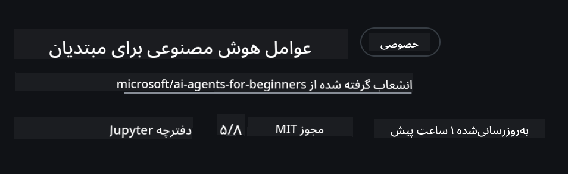
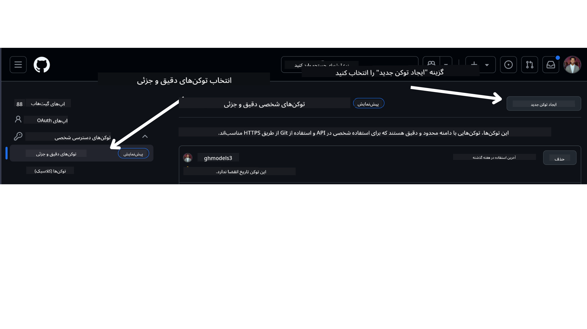

<!--
CO_OP_TRANSLATOR_METADATA:
{
  "original_hash": "366bc6709dd95b8a32ec7c705b0f179c",
  "translation_date": "2025-03-28T09:12:44+00:00",
  "source_file": "00-course-setup\\README.md",
  "language_code": "fa"
}
-->
# راه‌اندازی دوره

## مقدمه

این درس نحوه اجرای نمونه کدهای این دوره را پوشش خواهد داد.

## الزامات

- حساب کاربری GitHub
- پایتون نسخه 3.12 یا بالاتر
- اشتراک Azure
- حساب کاربری Azure AI Foundry

## کلون یا فورک کردن این مخزن

برای شروع، لطفاً مخزن GitHub را کلون یا فورک کنید. این کار نسخه‌ای از محتوای دوره را برای شما ایجاد می‌کند تا بتوانید کدها را اجرا، آزمایش و تغییر دهید!

این کار را می‌توانید با کلیک بر روی لینک زیر انجام دهید:



## دریافت توکن دسترسی شخصی GitHub (PAT)

در حال حاضر، این دوره از بازار مدل‌های GitHub استفاده می‌کند تا دسترسی رایگان به مدل‌های زبان بزرگ (LLMs) که برای ایجاد عوامل هوش مصنوعی استفاده می‌شوند، فراهم کند.

برای دسترسی به این سرویس، باید یک توکن دسترسی شخصی GitHub ایجاد کنید.

این کار را می‌توانید با رفتن به حساب کاربری GitHub خود انجام دهید.

گزینه `Fine-grained tokens` را در سمت چپ صفحه انتخاب کنید.

سپس `Generate new token` را انتخاب کنید.



توکن جدیدی که ایجاد کرده‌اید را کپی کنید. حالا باید این توکن را به فایل `.env` که در این دوره وجود دارد اضافه کنید.

## افزودن به متغیرهای محیطی

برای ایجاد فایل `.env` دستور زیر را در ترمینال اجرا کنید:

```bash
cp .env.example .env
```

این دستور فایل نمونه را کپی کرده و یک فایل `.env` در دایرکتوری شما ایجاد می‌کند. مقادیر متغیرهای محیطی را پر کنید. می‌توانید مقادیر هر متغیر محیطی را در مکان‌های زیر در پورتال [Azure AI Foundry](https://ai.azure.com?WT.mc_id=academic-105485-koreyst) پیدا کنید:

فایل را باز کرده و توکنی که ایجاد کرده‌اید را در `GITHUB_TOKEN=` field of the .env file. 
- `AZURE_SUBSCRIPTION_ID` - On the **Overview** page of your project within **Project details**.
- `AZURE_AI_PROJECT_NAME` - At the top of the **Overview** page for your project.
- `AZURE_OPENAI_RESOURCE_GROUP` - On the **Overview** page of the **Management Center** within **Project properties**.
- `AZURE_OPENAI_SERVICE` - On the **Overview** page of your project in the **Included capabilities** tab for **Azure OpenAI Service**.
- `AZURE_OPENAI_API_VERSION` - On the [API version lifecycle](https://learn.microsoft.com/azure/ai-services/openai/api-version-deprecation#latest-ga-api-release?WT.mc_id=academic-105485-koreyst) webpage within the **Latest GA API release** section.
- `AZURE_OPENAI_ENDPOINT` قرار دهید - در تب **Details** در بخش **Endpoint** مدل شما (مثلاً **Target URI**)

## نصب بسته‌های مورد نیاز

برای اطمینان از اینکه تمام بسته‌های مورد نیاز پایتون را برای اجرای کد دارید، دستور زیر را در ترمینال اجرا کنید.

توصیه می‌کنیم یک محیط مجازی پایتون ایجاد کنید تا از هرگونه تعارض و مشکل جلوگیری شود.

```bash
pip install -r requirements.txt
```

این دستور باید بسته‌های پایتون مورد نیاز را نصب کند.

# ورود به Azure

به عنوان یک بهترین روش امنیتی، از [احراز هویت بدون کلید](https://learn.microsoft.com/azure/developer/ai/keyless-connections?tabs=csharp%2Cazure-cli?WT.mc_id=academic-105485-koreyst) برای احراز هویت در Azure OpenAI با Microsoft Entra ID استفاده خواهیم کرد. قبل از انجام این کار، ابتدا باید **Azure CLI** را طبق [دستورالعمل نصب](https://learn.microsoft.com/cli/azure/install-azure-cli?WT.mc_id=academic-105485-koreyst) برای سیستم‌عامل خود نصب کنید.

سپس، یک ترمینال باز کرده و دستور `az login` to sign in to your Azure account.

## Sign in to Azure

Login with your Azure AI account used to provision the Azure resources.

Open a new terminal and enter the following command and follow the instructions in the terminal:

`az login --use-device-code`

Once you've logged in, select your subscription in the terminal.

## Access the environment variables.

We'll import `os` and `load_dotenv` را اجرا کنید تا بتوانید به متغیرهای محیطی دسترسی پیدا کنید.

```python
import os
from dotenv import load_dotenv

load_dotenv()
```

## راه‌اندازی احراز هویت بدون کلید

به جای سخت‌کد کردن اطلاعات ورود، از یک اتصال بدون کلید با Azure OpenAI استفاده خواهیم کرد. برای انجام این کار، تابع `DefaultAzureCredential` and later call the `DefaultAzureCredential` را برای دریافت اطلاعات احراز هویت وارد می‌کنیم.

```python
from azure.identity import DefaultAzureCredential, InteractiveBrowserCredential
```

اکنون آماده اجرای کدهای این دوره هستید. از یادگیری بیشتر درباره دنیای عوامل هوش مصنوعی لذت ببرید!

اگر در اجرای این تنظیمات مشکلی داشتید، وارد بخش 

یا 

## درس بعدی

[مقدمه‌ای بر عوامل هوش مصنوعی و موارد استفاده از عوامل](../01-intro-to-ai-agents/README.md)

**سلب مسئولیت**:  
این سند با استفاده از سرویس ترجمه هوش مصنوعی [Co-op Translator](https://github.com/Azure/co-op-translator) ترجمه شده است. در حالی که ما تلاش می‌کنیم دقت ترجمه را حفظ کنیم، لطفاً توجه داشته باشید که ترجمه‌های خودکار ممکن است شامل اشتباهات یا نواقص باشند. سند اصلی به زبان اصلی باید به عنوان منبع معتبر در نظر گرفته شود. برای اطلاعات حساس، توصیه می‌شود از ترجمه حرفه‌ای انسانی استفاده کنید. ما هیچ مسئولیتی در قبال سوء تفاهم‌ها یا تفسیرهای نادرست ناشی از استفاده از این ترجمه نداریم.