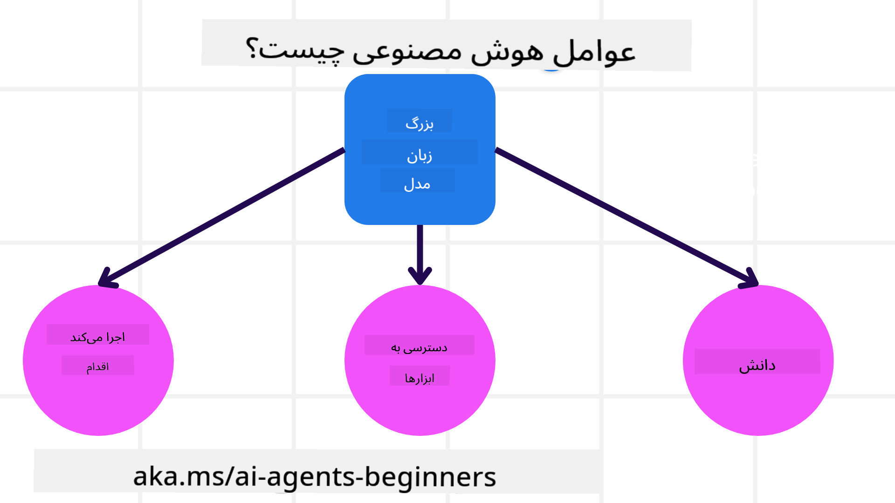

<!--
CO_OP_TRANSLATOR_METADATA:
{
  "original_hash": "233e7a18025a27eae95b653e9b5b5aa5",
  "translation_date": "2025-03-28T09:14:42+00:00",
  "source_file": "01-intro-to-ai-agents\\README.md",
  "language_code": "fa"
}
-->

> _(برای مشاهده ویدئوی این درس، روی تصویر بالا کلیک کنید)_

# مقدمه‌ای بر عوامل هوش مصنوعی و موارد استفاده آن‌ها

به دوره "عوامل هوش مصنوعی برای مبتدیان" خوش آمدید! این دوره دانش پایه و نمونه‌های کاربردی برای ساخت عوامل هوش مصنوعی را ارائه می‌دهد.

به جمع بپیوندید تا با دیگر یادگیرندگان و سازندگان عوامل هوش مصنوعی آشنا شوید و هر سوالی که در مورد این دوره دارید بپرسید.

برای شروع این دوره، ابتدا باید درک بهتری از عوامل هوش مصنوعی و نحوه استفاده از آن‌ها در برنامه‌ها و جریان‌های کاری که ایجاد می‌کنیم، داشته باشیم.

## مقدمه

این درس شامل موارد زیر است:

- عوامل هوش مصنوعی چیستند و انواع مختلف آن‌ها کدامند؟
- چه موارد استفاده‌ای برای عوامل هوش مصنوعی مناسب هستند و چگونه می‌توانند به ما کمک کنند؟
- چه اجزای اساسی در طراحی راه‌حل‌های مبتنی بر عامل وجود دارد؟

## اهداف یادگیری
پس از تکمیل این درس، شما باید بتوانید:

- مفاهیم عوامل هوش مصنوعی و تفاوت آن‌ها با سایر راه‌حل‌های هوش مصنوعی را درک کنید.
- عوامل هوش مصنوعی را به شکل کارآمد به کار ببرید.
- راه‌حل‌های مبتنی بر عامل را به طور موثر برای کاربران و مشتریان طراحی کنید.

## تعریف عوامل هوش مصنوعی و انواع آن‌ها

### عوامل هوش مصنوعی چیستند؟

عوامل هوش مصنوعی **سیستم‌هایی** هستند که به **مدل‌های زبانی بزرگ (LLMs)** اجازه می‌دهند تا **اقداماتی انجام دهند**. این کار با گسترش قابلیت‌های مدل‌های زبانی از طریق دسترسی به **ابزارها** و **دانش** امکان‌پذیر می‌شود.

بیایید این تعریف را به بخش‌های کوچکتر تقسیم کنیم:

- **سیستم** - مهم است که عوامل را نه به عنوان یک جزء منفرد بلکه به عنوان سیستمی متشکل از اجزای متعدد در نظر بگیریم. در سطح پایه، اجزای یک عامل هوش مصنوعی عبارتند از:
  - **محیط** - فضای تعریف‌شده‌ای که عامل هوش مصنوعی در آن فعالیت می‌کند. به عنوان مثال، اگر یک عامل رزرو سفر داشته باشیم، محیط می‌تواند سیستم رزرو سفری باشد که عامل از آن برای انجام وظایف استفاده می‌کند.
  - **حسگرها** - محیط‌ها اطلاعات و بازخورد ارائه می‌دهند. عوامل هوش مصنوعی از حسگرها برای جمع‌آوری و تفسیر این اطلاعات درباره وضعیت فعلی محیط استفاده می‌کنند. در مثال عامل رزرو سفر، سیستم رزرو سفر می‌تواند اطلاعاتی مانند در دسترس بودن هتل یا قیمت پرواز ارائه دهد.
  - **عملگرها** - پس از دریافت وضعیت فعلی محیط توسط عامل هوش مصنوعی، عامل برای وظیفه فعلی تعیین می‌کند که چه اقدامی انجام دهد تا محیط تغییر کند. برای عامل رزرو سفر، ممکن است اقدام به رزرو اتاق موجود برای کاربر باشد.

**مدل‌های زبانی بزرگ** - مفهوم عوامل قبل از ایجاد مدل‌های زبانی بزرگ وجود داشت. مزیت ساخت عوامل هوش مصنوعی با مدل‌های زبانی بزرگ توانایی آن‌ها در تفسیر زبان انسانی و داده‌ها است. این توانایی به مدل‌های زبانی بزرگ اجازه می‌دهد اطلاعات محیطی را تفسیر کرده و برنامه‌ای برای تغییر محیط تعریف کنند.

**انجام اقدامات** - خارج از سیستم‌های عامل هوش مصنوعی، مدل‌های زبانی بزرگ محدود به موقعیت‌هایی هستند که اقدام آن‌ها تولید محتوا یا اطلاعات بر اساس درخواست کاربر است. در داخل سیستم‌های عامل هوش مصنوعی، مدل‌های زبانی بزرگ می‌توانند وظایفی را با تفسیر درخواست کاربر و استفاده از ابزارهای موجود در محیط خود انجام دهند.

**دسترسی به ابزارها** - ابزارهایی که مدل زبانی بزرگ به آن‌ها دسترسی دارد توسط 1) محیطی که در آن فعالیت می‌کند و 2) توسعه‌دهنده عامل هوش مصنوعی تعریف می‌شود. برای مثال عامل سفر، ابزارهای عامل به عملیات موجود در سیستم رزرو محدود می‌شود و/یا توسعه‌دهنده می‌تواند دسترسی عامل به ابزارها را محدود به پروازها کند.

**دانش** - خارج از اطلاعات ارائه‌شده توسط محیط، عوامل هوش مصنوعی می‌توانند دانش را از سایر سیستم‌ها، خدمات، ابزارها و حتی عوامل دیگر بازیابی کنند. در مثال عامل سفر، این دانش می‌تواند اطلاعات مربوط به ترجیحات سفر کاربر باشد که در پایگاه داده مشتری ذخیره شده است.

### انواع مختلف عوامل

اکنون که یک تعریف کلی از عوامل هوش مصنوعی داریم، بیایید به برخی از انواع خاص عوامل و نحوه کاربرد آن‌ها در یک عامل رزرو سفر بپردازیم.

| **نوع عامل**                   | **توضیحات**                                                                                                                  | **مثال**                                                                                                                                                                                                                     |
| ----------------------------- | -------------------------------------------------------------------------------------------------------------------------- | ----------------------------------------------------------------------------------------------------------------------------------------------------------------------------------------------------------------------------- |
| **عوامل واکنشی ساده**         | اقدامات فوری بر اساس قوانین از پیش تعریف‌شده انجام می‌دهند.                                                                 | عامل سفر زمینه ایمیل را تفسیر کرده و شکایات سفر را به خدمات مشتریان ارسال می‌کند.                                                                                                                                           |
| **عوامل واکنشی مبتنی بر مدل** | اقدامات بر اساس مدلی از جهان و تغییرات در آن مدل انجام می‌دهند.                                                              | عامل سفر مسیرهایی با تغییرات قابل توجه قیمت را بر اساس دسترسی به داده‌های تاریخی قیمت‌ها اولویت‌بندی می‌کند.                                                                                                                 |
| **عوامل مبتنی بر هدف**        | برنامه‌هایی برای دستیابی به اهداف خاص ایجاد می‌کنند که از طریق تفسیر هدف و تعیین اقدامات لازم برای رسیدن به آن انجام می‌شود. | عامل سفر ترتیبات سفر لازم (ماشین، حمل‌ونقل عمومی، پروازها) را از مکان فعلی تا مقصد تعیین کرده و سفر را رزرو می‌کند.                                                                                                         |
| **عوامل مبتنی بر سودمندی**    | ترجیحات را در نظر گرفته و با وزن‌دهی عددی، معامله‌ها را برای تعیین نحوه دستیابی به اهداف انجام می‌دهند.                     | عامل سفر با وزن‌دهی راحتی در برابر هزینه، سودمندی را به حداکثر می‌رساند و سفر را رزرو می‌کند.                                                                                                                                |
| **عوامل یادگیرنده**           | با پاسخ به بازخورد و تنظیم اقدامات به مرور زمان بهبود می‌یابند.                                                             | عامل سفر با استفاده از بازخورد مشتری از نظرسنجی‌های پس از سفر، تنظیماتی در رزروهای آینده ایجاد می‌کند.                                                                                                                      |
| **عوامل سلسله‌مراتبی**        | شامل چندین عامل در یک سیستم سلسله‌مراتبی هستند که عوامل سطح بالاتر وظایف را به زیر وظایف تقسیم کرده و عوامل سطح پایین‌تر آن‌ها را تکمیل می‌کنند. | عامل سفر یک سفر را لغو می‌کند و وظایف را به زیر وظایف تقسیم می‌کند (برای مثال، لغو رزروهای خاص) و عوامل سطح پایین‌تر آن‌ها را تکمیل کرده و به عامل سطح بالاتر گزارش می‌دهند.                                                  |
| **سیستم‌های چندعامله (MAS)** | عوامل به صورت مستقل وظایف را انجام می‌دهند، یا به صورت همکاری یا رقابت.                                                      | همکاری: چندین عامل خدمات سفر خاص مانند هتل‌ها، پروازها و سرگرمی‌ها را رزرو می‌کنند. رقابت: چندین عامل یک تقویم رزرو هتل مشترک را مدیریت کرده و برای رزرو مشتریان در هتل رقابت می‌کنند.                                          |

## زمان استفاده از عوامل هوش مصنوعی

در بخش قبلی، از مورد استفاده عامل سفر برای توضیح نحوه استفاده از انواع مختلف عوامل در سناریوهای مختلف رزرو سفر استفاده کردیم. در طول دوره از این کاربرد استفاده خواهیم کرد.

بیایید به انواع موارد استفاده‌ای که عوامل هوش مصنوعی برای آن‌ها مناسب هستند نگاهی بیندازیم:

- **مسائل باز و بدون محدودیت** - اجازه دادن به مدل زبانی بزرگ برای تعیین مراحل مورد نیاز برای تکمیل یک وظیفه، زیرا همیشه نمی‌توان آن را در یک جریان کاری به صورت سخت‌کد تعریف کرد.
- **فرآیندهای چندمرحله‌ای** - وظایفی که سطحی از پیچیدگی را نیاز دارند که در آن عامل هوش مصنوعی باید ابزارها یا اطلاعات را در چند مرحله استفاده کند و نه بازیابی تک‌شات.  
- **بهبود در طول زمان** - وظایفی که عامل می‌تواند با دریافت بازخورد از محیط یا کاربران به مرور زمان بهبود یابد تا سودمندی بهتری ارائه دهد.

ما در درس "ساخت عوامل هوش مصنوعی قابل اعتماد" ملاحظات بیشتری در مورد استفاده از عوامل هوش مصنوعی را پوشش می‌دهیم.

## اصول اولیه راه‌حل‌های مبتنی بر عامل

### توسعه عامل

اولین قدم در طراحی یک سیستم عامل هوش مصنوعی، تعریف ابزارها، اقدامات و رفتارها است. در این دوره، ما بر استفاده از **Azure AI Agent Service** برای تعریف عوامل خود تمرکز می‌کنیم. این سرویس ویژگی‌هایی مانند موارد زیر را ارائه می‌دهد:

- انتخاب مدل‌های باز مانند OpenAI، Mistral و Llama
- استفاده از داده‌های دارای مجوز از طریق ارائه‌دهندگان مانند Tripadvisor
- استفاده از ابزارهای استاندارد OpenAPI 3.0

### الگوهای مبتنی بر عامل

ارتباط با مدل‌های زبانی بزرگ از طریق دستورات انجام می‌شود. با توجه به ماهیت نیمه‌خودمختار عوامل هوش مصنوعی، همیشه ممکن یا ضروری نیست که پس از تغییر در محیط، مدل زبانی بزرگ را به صورت دستی دوباره دستور دهیم. ما از **الگوهای مبتنی بر عامل** استفاده می‌کنیم که به ما اجازه می‌دهند مدل زبانی بزرگ را در چندین مرحله به شکل مقیاس‌پذیر دستور دهیم.

این دوره به برخی از الگوهای محبوب فعلی مبتنی بر عامل تقسیم شده است.

### چارچوب‌های مبتنی بر عامل

چارچوب‌های مبتنی بر عامل به توسعه‌دهندگان امکان پیاده‌سازی الگوهای مبتنی بر عامل از طریق کد را می‌دهند. این چارچوب‌ها قالب‌ها، افزونه‌ها و ابزارهایی برای همکاری بهتر عوامل هوش مصنوعی ارائه می‌دهند. این مزایا توانایی‌هایی برای مشاهده بهتر و رفع اشکال سیستم‌های عامل هوش مصنوعی فراهم می‌کنند.

در این دوره، ما چارچوب AutoGen مبتنی بر تحقیق و چارچوب Agent آماده تولید از Semantic Kernel را بررسی خواهیم کرد.

## درس قبلی

[تنظیمات دوره](../00-course-setup/README.md)

## درس بعدی

[بررسی چارچوب‌های مبتنی بر عامل](../02-explore-agentic-frameworks/README.md)

**سلب مسئولیت**:  
این سند با استفاده از سرویس ترجمه هوش مصنوعی [Co-op Translator](https://github.com/Azure/co-op-translator) ترجمه شده است. در حالی که ما تلاش می‌کنیم دقت را حفظ کنیم، لطفاً توجه داشته باشید که ترجمه‌های خودکار ممکن است شامل خطاها یا نادقتی‌ها باشند. سند اصلی به زبان مادری آن باید به عنوان منبع معتبر در نظر گرفته شود. برای اطلاعات حساس، ترجمه حرفه‌ای انسانی توصیه می‌شود. ما هیچ مسئولیتی در قبال سوءتفاهم‌ها یا تفسیرهای نادرست ناشی از استفاده از این ترجمه نداریم.