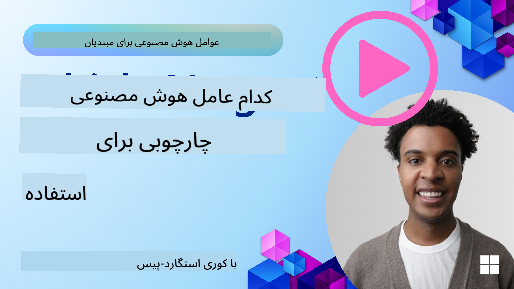

<!--
CO_OP_TRANSLATOR_METADATA:
{
  "original_hash": "d3ceafa2939ede602b96d6bd412c5cbf",
  "translation_date": "2025-03-28T09:19:59+00:00",
  "source_file": "02-explore-agentic-frameworks\\README.md",
  "language_code": "fa"
}
-->
[](https://youtu.be/ODwF-EZo_O8?si=1xoy_B9RNQfrYdF7)

> _(برای مشاهده ویدیوی این درس روی تصویر بالا کلیک کنید)_

# کاوش چارچوب‌های عامل هوش مصنوعی

چارچوب‌های عامل هوش مصنوعی پلتفرم‌های نرم‌افزاری هستند که برای ساده‌سازی ایجاد، استقرار و مدیریت عوامل هوش مصنوعی طراحی شده‌اند. این چارچوب‌ها به توسعه‌دهندگان ابزارها، انتزاعات و مؤلفه‌های از پیش ساخته شده‌ای ارائه می‌دهند که توسعه سیستم‌های پیچیده هوش مصنوعی را تسهیل می‌کنند.

این چارچوب‌ها به توسعه‌دهندگان کمک می‌کنند تا با ارائه رویکردهای استاندارد برای چالش‌های رایج در توسعه عوامل هوش مصنوعی، بر جنبه‌های منحصربه‌فرد برنامه‌های خود تمرکز کنند. آن‌ها مقیاس‌پذیری، دسترسی‌پذیری و کارایی را در ساخت سیستم‌های هوش مصنوعی بهبود می‌بخشند.

## مقدمه

این درس شامل موارد زیر خواهد بود:

- چارچوب‌های عامل هوش مصنوعی چیستند و چه امکاناتی برای توسعه‌دهندگان فراهم می‌کنند؟
- تیم‌ها چگونه می‌توانند از این چارچوب‌ها برای نمونه‌سازی سریع، تکرار و بهبود قابلیت‌های عامل خود استفاده کنند؟
- تفاوت‌های بین چارچوب‌ها و ابزارهای ساخته شده توسط مایکروسافت، ... و ... چیست؟
- آیا می‌توان ابزارهای موجود در اکوسیستم Azure را مستقیماً ادغام کرد، یا به راه‌حل‌های مستقل نیاز است؟
- سرویس Azure AI Agents چیست و چگونه به من کمک می‌کند؟

## اهداف یادگیری

اهداف این درس شامل موارد زیر است:

- درک نقش چارچوب‌های عامل هوش مصنوعی در توسعه هوش مصنوعی.
- استفاده از چارچوب‌های عامل هوش مصنوعی برای ساخت عوامل هوشمند.
- آشنایی با قابلیت‌های کلیدی ارائه شده توسط چارچوب‌های عامل هوش مصنوعی.
- شناخت تفاوت‌های بین AutoGen، Semantic Kernel و Azure AI Agent Service.

## چارچوب‌های عامل هوش مصنوعی چیستند و چه امکاناتی برای توسعه‌دهندگان فراهم می‌کنند؟

چارچوب‌های سنتی هوش مصنوعی می‌توانند به شما کمک کنند تا هوش مصنوعی را در برنامه‌های خود ادغام کنید و این برنامه‌ها را در موارد زیر بهبود ببخشند:

- **شخصی‌سازی**: هوش مصنوعی می‌تواند رفتار و ترجیحات کاربران را تحلیل کرده و پیشنهادها، محتوا و تجربیات شخصی‌سازی شده ارائه دهد.
  مثال: سرویس‌های پخش آنلاین مانند نتفلیکس از هوش مصنوعی برای پیشنهاد فیلم‌ها و سریال‌ها بر اساس تاریخچه تماشا استفاده می‌کنند و تعامل و رضایت کاربران را افزایش می‌دهند.
- **اتوماسیون و کارایی**: هوش مصنوعی می‌تواند وظایف تکراری را خودکار کند، جریان‌های کاری را بهینه کند و کارایی عملیاتی را بهبود بخشد.
  مثال: برنامه‌های خدمات مشتری از چت‌بات‌های مبتنی بر هوش مصنوعی برای پاسخ به پرسش‌های رایج استفاده می‌کنند و زمان پاسخ‌دهی را کاهش داده و نیروی انسانی را برای مسائل پیچیده‌تر آزاد می‌کنند.
- **بهبود تجربه کاربری**: هوش مصنوعی می‌تواند تجربه کلی کاربر را با ارائه ویژگی‌های هوشمند مانند تشخیص صدا، پردازش زبان طبیعی و متن پیش‌بینی‌کننده بهبود بخشد.
  مثال: دستیارهای مجازی مانند Siri و Google Assistant از هوش مصنوعی برای درک و پاسخ به دستورات صوتی استفاده می‌کنند و تعامل کاربران با دستگاه‌هایشان را آسان‌تر می‌سازند.

### این موارد عالی به نظر می‌رسند، پس چرا به چارچوب عامل هوش مصنوعی نیاز داریم؟

چارچوب‌های عامل هوش مصنوعی چیزی فراتر از چارچوب‌های سنتی هوش مصنوعی هستند. آن‌ها برای ایجاد عوامل هوشمندی طراحی شده‌اند که می‌توانند با کاربران، سایر عوامل و محیط تعامل داشته باشند تا به اهداف خاصی دست یابند. این عوامل می‌توانند رفتار خودمختار نشان دهند، تصمیم بگیرند و به شرایط متغیر سازگار شوند. بیایید نگاهی به قابلیت‌های کلیدی ارائه شده توسط چارچوب‌های عامل هوش مصنوعی بیندازیم:

- **همکاری و هماهنگی عوامل**: امکان ایجاد چندین عامل هوش مصنوعی که می‌توانند با هم کار کنند، ارتباط برقرار کنند و برای حل وظایف پیچیده هماهنگ شوند.
- **اتوماسیون و مدیریت وظایف**: ارائه مکانیزم‌هایی برای خودکارسازی جریان‌های کاری چندمرحله‌ای، واگذاری وظایف و مدیریت پویا وظایف بین عوامل.
- **درک و سازگاری زمینه‌ای**: تجهیز عوامل به توانایی درک زمینه، سازگاری با محیط‌های متغیر و تصمیم‌گیری بر اساس اطلاعات لحظه‌ای.

به طور خلاصه، عوامل به شما این امکان را می‌دهند که کارهای بیشتری انجام دهید، اتوماسیون را به سطح بالاتری برسانید و سیستم‌های هوشمندتری ایجاد کنید که بتوانند از محیط خود بیاموزند و سازگار شوند.

## چگونه به سرعت نمونه‌سازی، تکرار و بهبود قابلیت‌های عامل را انجام دهیم؟

این حوزه به سرعت در حال تغییر است، اما برخی موارد در اکثر چارچوب‌های عامل هوش مصنوعی مشترک هستند که می‌توانند به شما کمک کنند به سرعت نمونه‌سازی و تکرار کنید. این موارد شامل مؤلفه‌های ماژولار، ابزارهای همکاری و یادگیری بلادرنگ است. بیایید به این موارد بپردازیم:

- **استفاده از مؤلفه‌های ماژولار**: SDKهای هوش مصنوعی مؤلفه‌های از پیش ساخته‌ای مانند اتصالات هوش مصنوعی و حافظه، فراخوانی توابع با استفاده از زبان طبیعی یا افزونه‌های کدنویسی، قالب‌های درخواست و غیره ارائه می‌دهند.
- **استفاده از ابزارهای همکاری**: طراحی عوامل با نقش‌ها و وظایف خاص، امکان آزمایش و اصلاح جریان‌های کاری مشترک.
- **یادگیری بلادرنگ**: پیاده‌سازی حلقه‌های بازخورد که در آن عوامل از تعاملات یاد می‌گیرند و رفتار خود را به طور پویا تنظیم می‌کنند.

### استفاده از مؤلفه‌های ماژولار

SDKهایی مانند Microsoft Semantic Kernel و LangChain مؤلفه‌های از پیش ساخته‌ای مانند اتصالات هوش مصنوعی، قالب‌های درخواست و مدیریت حافظه ارائه می‌دهند.

**چگونه تیم‌ها می‌توانند از این موارد استفاده کنند**: تیم‌ها می‌توانند این مؤلفه‌ها را به سرعت مونتاژ کرده و یک نمونه اولیه کاربردی ایجاد کنند، بدون اینکه از ابتدا شروع کنند، و این امکان را فراهم می‌آورند تا سریعاً آزمایش و تکرار انجام دهند.

**چگونه در عمل کار می‌کند**: شما می‌توانید از یک تجزیه‌گر از پیش ساخته شده برای استخراج اطلاعات از ورودی کاربر، یک ماژول حافظه برای ذخیره و بازیابی داده‌ها، و یک مولد درخواست برای تعامل با کاربران استفاده کنید، بدون اینکه نیاز به ساخت این مؤلفه‌ها از ابتدا باشد.

**کد نمونه**. بیایید به نمونه‌هایی از نحوه استفاده از یک اتصال هوش مصنوعی از پیش ساخته شده با Semantic Kernel در پایتون و .Net که از فراخوانی خودکار توابع برای پاسخ به ورودی کاربر استفاده می‌کند، نگاهی بیندازیم:

``` python
# Semantic Kernel Python Example

import asyncio
from typing import Annotated

from semantic_kernel.connectors.ai import FunctionChoiceBehavior
from semantic_kernel.connectors.ai.open_ai import AzureChatCompletion, AzureChatPromptExecutionSettings
from semantic_kernel.contents import ChatHistory
from semantic_kernel.functions import kernel_function
from semantic_kernel.kernel import Kernel

# Define a ChatHistory object to hold the conversation's context
chat_history = ChatHistory()
chat_history.add_user_message("I'd like to go to New York on January 1, 2025")


# Define a sample plugin that contains the function to book travel
class BookTravelPlugin:
    """A Sample Book Travel Plugin"""

    @kernel_function(name="book_flight", description="Book travel given location and date")
    async def book_flight(
        self, date: Annotated[str, "The date of travel"], location: Annotated[str, "The location to travel to"]
    ) -> str:
        return f"Travel was booked to {location} on {date}"

# Create the Kernel
kernel = Kernel()

# Add the sample plugin to the Kernel object
kernel.add_plugin(BookTravelPlugin(), plugin_name="book_travel")

# Define the Azure OpenAI AI Connector
chat_service = AzureChatCompletion(
    deployment_name="YOUR_DEPLOYMENT_NAME", 
    api_key="YOUR_API_KEY", 
    endpoint="https://<your-resource>.azure.openai.com/",
)

# Define the request settings to configure the model with auto-function calling
request_settings = AzureChatPromptExecutionSettings(function_choice_behavior=FunctionChoiceBehavior.Auto())


async def main():
    # Make the request to the model for the given chat history and request settings
    # The Kernel contains the sample that the model will request to invoke
    response = await chat_service.get_chat_message_content(
        chat_history=chat_history, settings=request_settings, kernel=kernel
    )
    assert response is not None

    """
    Note: In the auto function calling process, the model determines it can invoke the 
    `BookTravelPlugin` using the `book_flight` function, supplying the necessary arguments. 
    
    For example:

    "tool_calls": [
        {
            "id": "call_abc123",
            "type": "function",
            "function": {
                "name": "BookTravelPlugin-book_flight",
                "arguments": "{'location': 'New York', 'date': '2025-01-01'}"
            }
        }
    ]

    Since the location and date arguments are required (as defined by the kernel function), if the 
    model lacks either, it will prompt the user to provide them. For instance:

    User: Book me a flight to New York.
    Model: Sure, I'd love to help you book a flight. Could you please specify the date?
    User: I want to travel on January 1, 2025.
    Model: Your flight to New York on January 1, 2025, has been successfully booked. Safe travels!
    """

    print(f"`{response}`")
    # Example AI Model Response: `Your flight to New York on January 1, 2025, has been successfully booked. Safe travels! ✈️🗽`

    # Add the model's response to our chat history context
    chat_history.add_assistant_message(response.content)


if __name__ == "__main__":
    asyncio.run(main())
```
```csharp
// Semantic Kernel C# example

using Microsoft.SemanticKernel;
using Microsoft.SemanticKernel.ChatCompletion;
using System.ComponentModel;
using Microsoft.SemanticKernel.Connectors.AzureOpenAI;

ChatHistory chatHistory = [];
chatHistory.AddUserMessage("I'd like to go to New York on January 1, 2025");

var kernelBuilder = Kernel.CreateBuilder();
kernelBuilder.AddAzureOpenAIChatCompletion(
    deploymentName: "NAME_OF_YOUR_DEPLOYMENT",
    apiKey: "YOUR_API_KEY",
    endpoint: "YOUR_AZURE_ENDPOINT"
);
kernelBuilder.Plugins.AddFromType<BookTravelPlugin>("BookTravel"); 
var kernel = kernelBuilder.Build();

var settings = new AzureOpenAIPromptExecutionSettings()
{
    FunctionChoiceBehavior = FunctionChoiceBehavior.Auto()
};

var chatCompletion = kernel.GetRequiredService<IChatCompletionService>();

var response = await chatCompletion.GetChatMessageContentAsync(chatHistory, settings, kernel);

/*
Behind the scenes, the model recognizes the tool to call, what arguments it already has (location) and (date)
{

"tool_calls": [
    {
        "id": "call_abc123",
        "type": "function",
        "function": {
            "name": "BookTravelPlugin-book_flight",
            "arguments": "{'location': 'New York', 'date': '2025-01-01'}"
        }
    }
]
*/

Console.WriteLine(response.Content);
chatHistory.AddMessage(response!.Role, response!.Content!);

// Example AI Model Response: Your flight to New York on January 1, 2025, has been successfully booked. Safe travels! ✈️🗽

// Define a plugin that contains the function to book travel
public class BookTravelPlugin
{
    [KernelFunction("book_flight")]
    [Description("Book travel given location and date")]
    public async Task<string> BookFlight(DateTime date, string location)
    {
        return await Task.FromResult( $"Travel was booked to {location} on {date}");
    }
}
```

آنچه از این مثال می‌بینید این است که چگونه می‌توانید از یک تجزیه‌گر از پیش ساخته شده برای استخراج اطلاعات کلیدی از ورودی کاربر، مانند مبدا، مقصد و تاریخ درخواست رزرو پرواز استفاده کنید. این رویکرد ماژولار به شما امکان می‌دهد بر روی منطق سطح بالا تمرکز کنید.

### استفاده از ابزارهای همکاری

چارچوب‌هایی مانند CrewAI، Microsoft AutoGen و Semantic Kernel امکان ایجاد چندین عامل را که می‌توانند با هم کار کنند فراهم می‌کنند.

**چگونه تیم‌ها می‌توانند از این موارد استفاده کنند**: تیم‌ها می‌توانند عوامل را با نقش‌ها و وظایف خاص طراحی کنند، و این امکان را فراهم آورند تا جریان‌های کاری مشترک را آزمایش و اصلاح کنند و کارایی کلی سیستم را بهبود بخشند.

**چگونه در عمل کار می‌کند**: شما می‌توانید یک تیم از عوامل ایجاد کنید که هر عامل دارای یک عملکرد تخصصی باشد، مانند بازیابی داده‌ها، تحلیل یا تصمیم‌گیری. این عوامل می‌توانند برای دستیابی به یک هدف مشترک، مانند پاسخ به پرسش کاربر یا تکمیل یک وظیفه، ارتباط برقرار کرده و اطلاعات را به اشتراک بگذارند.

**کد نمونه (AutoGen)**:

```python
# creating agents, then create a round robin schedule where they can work together, in this case in order

# Data Retrieval Agent
# Data Analysis Agent
# Decision Making Agent

agent_retrieve = AssistantAgent(
    name="dataretrieval",
    model_client=model_client,
    tools=[retrieve_tool],
    system_message="Use tools to solve tasks."
)

agent_analyze = AssistantAgent(
    name="dataanalysis",
    model_client=model_client,
    tools=[analyze_tool],
    system_message="Use tools to solve tasks."
)

# conversation ends when user says "APPROVE"
termination = TextMentionTermination("APPROVE")

user_proxy = UserProxyAgent("user_proxy", input_func=input)

team = RoundRobinGroupChat([agent_retrieve, agent_analyze, user_proxy], termination_condition=termination)

stream = team.run_stream(task="Analyze data", max_turns=10)
# Use asyncio.run(...) when running in a script.
await Console(stream)
```

آنچه در کد قبلی می‌بینید این است که چگونه می‌توانید یک وظیفه را ایجاد کنید که شامل چندین عامل است که با هم برای تحلیل داده‌ها کار می‌کنند. هر عامل یک عملکرد خاص را انجام می‌دهد و وظیفه با هماهنگی عوامل برای دستیابی به نتیجه مطلوب اجرا می‌شود. با ایجاد عوامل اختصاصی با نقش‌های تخصصی، می‌توانید کارایی و عملکرد وظایف را بهبود بخشید.

### یادگیری بلادرنگ

چارچوب‌های پیشرفته قابلیت‌هایی برای درک و سازگاری زمینه‌ای بلادرنگ ارائه می‌دهند.

**چگونه تیم‌ها می‌توانند از این موارد استفاده کنند**: تیم‌ها می‌توانند حلقه‌های بازخوردی را پیاده‌سازی کنند که در آن عوامل از تعاملات یاد می‌گیرند و رفتار خود را به طور پویا تنظیم می‌کنند، که منجر به بهبود و اصلاح مداوم قابلیت‌ها می‌شود.

**چگونه در عمل کار می‌کند**: عوامل می‌توانند بازخورد کاربران، داده‌های محیطی و نتایج وظایف را تحلیل کنند تا پایگاه دانش خود را به‌روزرسانی کنند، الگوریتم‌های تصمیم‌گیری را تنظیم کنند و عملکرد خود را در طول زمان بهبود بخشند. این فرآیند یادگیری تکراری به عوامل اجازه می‌دهد تا به شرایط متغیر و ترجیحات کاربران سازگار شوند و اثربخشی کلی سیستم را افزایش دهند.

## تفاوت‌های بین چارچوب‌های AutoGen، Semantic Kernel و Azure AI Agent Service چیست؟

راه‌های زیادی برای مقایسه این چارچوب‌ها وجود دارد، اما بیایید نگاهی به تفاوت‌های کلیدی از نظر طراحی، قابلیت‌ها و موارد استفاده هدف بیندازیم:

## AutoGen

AutoGen یک چارچوب متن‌باز است که توسط آزمایشگاه AI Frontiers Lab مایکروسافت ریسرچ توسعه یافته است. این چارچوب بر روی برنامه‌های عامل‌محور توزیع‌شده و رویدادمحور متمرکز است و امکان استفاده از LLMها و SLMها، ابزارها و الگوهای پیشرفته طراحی چندعاملی را فراهم می‌کند.

AutoGen بر مفهوم اصلی عوامل بنا شده است، که موجودیت‌های خودمختاری هستند که می‌توانند محیط خود را درک کنند، تصمیم بگیرند و اقدامات لازم را برای دستیابی به اهداف خاص انجام دهند. عوامل از طریق پیام‌های غیرهم‌زمان ارتباط برقرار می‌کنند، که به آن‌ها اجازه می‌دهد به طور مستقل و موازی کار کنند و مقیاس‌پذیری و پاسخگویی سیستم را افزایش دهند.
ماژولار بودن، همکاری، ارکستراسیون فرآیند | استقرار امن، مقیاس‌پذیر و انعطاف‌پذیر عوامل هوش مصنوعی | موارد استفاده ایده‌آل برای هر یک از این چارچوب‌ها چیست؟ 

## آیا می‌توانم ابزارهای موجود اکوسیستم Azure خود را مستقیماً یکپارچه کنم یا به راه‌حل‌های مستقل نیاز دارم؟
پاسخ مثبت است، شما می‌توانید ابزارهای موجود اکوسیستم Azure خود را مستقیماً با Azure AI Agent Service یکپارچه کنید، به‌ویژه به این دلیل که این سرویس به گونه‌ای طراحی شده که به‌صورت یکپارچه با سایر خدمات Azure کار کند. به‌عنوان مثال، می‌توانید Bing، Azure AI Search و Azure Functions را یکپارچه کنید. همچنین یکپارچگی عمیقی با Azure AI Foundry وجود دارد.

برای AutoGen و Semantic Kernel نیز می‌توانید با خدمات Azure یکپارچه شوید، اما ممکن است نیاز داشته باشید که خدمات Azure را از طریق کد خود فراخوانی کنید. راه دیگر برای یکپارچه‌سازی این است که از Azure SDK‌ها برای تعامل با خدمات Azure از طریق عوامل خود استفاده کنید. علاوه بر این، همانطور که ذکر شد، می‌توانید از Azure AI Agent Service به‌عنوان یک ارکستراتور برای عوامل ساخته‌شده در AutoGen یا Semantic Kernel استفاده کنید که دسترسی آسان به اکوسیستم Azure را فراهم می‌کند.

## منابع

---

## درس قبلی

[مقدمه‌ای بر عوامل هوش مصنوعی و موارد استفاده آن‌ها](../01-intro-to-ai-agents/README.md)

## درس بعدی

[درک الگوهای طراحی عامل‌محور](../03-agentic-design-patterns/README.md)

**سلب مسئولیت**:  
این سند با استفاده از سرویس ترجمه هوش مصنوعی [Co-op Translator](https://github.com/Azure/co-op-translator) ترجمه شده است. در حالی که ما تلاش می‌کنیم دقت ترجمه را حفظ کنیم، لطفاً توجه داشته باشید که ترجمه‌های خودکار ممکن است حاوی خطاها یا نادرستی‌ها باشند. سند اصلی به زبان اصلی آن باید به عنوان منبع معتبر در نظر گرفته شود. برای اطلاعات حساس، توصیه می‌شود از ترجمه حرفه‌ای انسانی استفاده کنید. ما مسئولیت هرگونه سوءتفاهم یا تفسیر نادرست ناشی از استفاده از این ترجمه را نمی‌پذیریم.