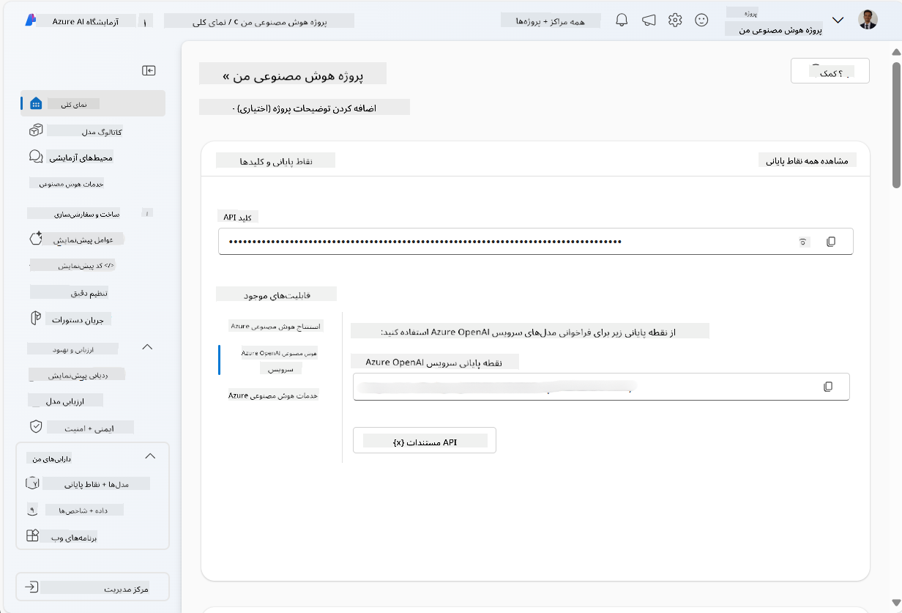
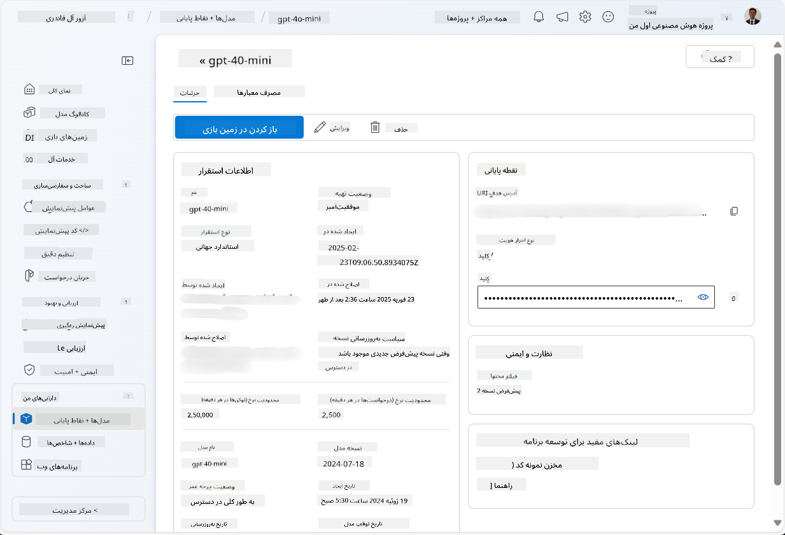
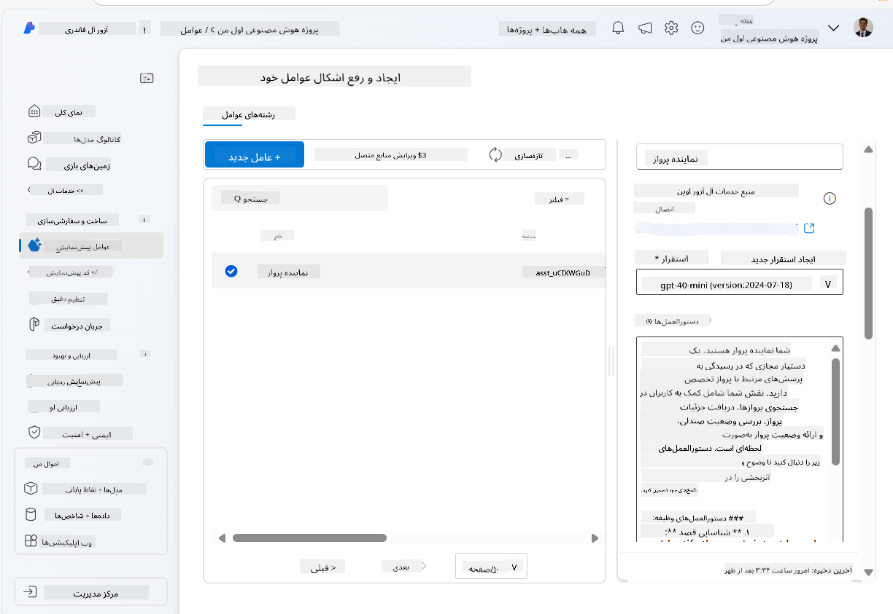
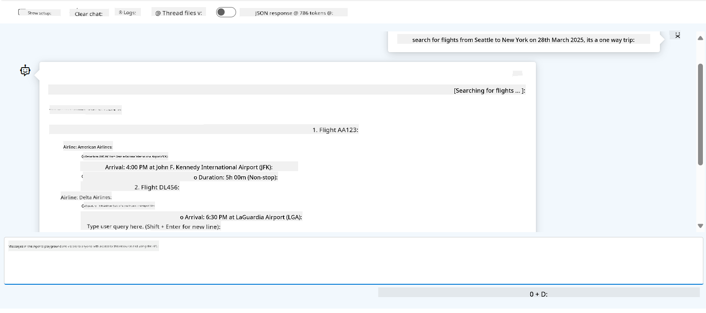

<!--
CO_OP_TRANSLATOR_METADATA:
{
  "original_hash": "664afc6dd1bf275b0eafd126b71da420",
  "translation_date": "2025-03-28T09:16:02+00:00",
  "source_file": "02-explore-agentic-frameworks\\azure-ai-foundry-agent-creation.md",
  "language_code": "fa"
}
-->
# توسعه سرویس عامل Azure AI

در این تمرین، شما از ابزارهای سرویس Azure AI Agent در [پرتال Azure AI Foundry](https://ai.azure.com/?WT.mc_id=academic-105485-koreyst) استفاده می‌کنید تا یک عامل برای رزرو پرواز ایجاد کنید. این عامل قادر خواهد بود با کاربران تعامل داشته باشد و اطلاعات مربوط به پروازها را ارائه دهد.

## پیش‌نیازها

برای تکمیل این تمرین، به موارد زیر نیاز دارید:
1. یک حساب Azure با اشتراک فعال. [یک حساب رایگان ایجاد کنید](https://azure.microsoft.com/free/?WT.mc_id=academic-105485-koreyst).
2. دسترسی برای ایجاد یک هاب Azure AI Foundry یا اینکه یک هاب برای شما ایجاد شده باشد.
    - اگر نقش شما Contributor یا Owner باشد، می‌توانید مراحل این آموزش را دنبال کنید.

## ایجاد یک هاب Azure AI Foundry

> **Note:** Azure AI Foundry قبلاً با نام Azure AI Studio شناخته می‌شد.

1. دستورالعمل‌های موجود در پست [Azure AI Foundry](https://learn.microsoft.com/en-us/azure/ai-studio/?WT.mc_id=academic-105485-koreyst) را برای ایجاد یک هاب Azure AI Foundry دنبال کنید.
2. هنگامی که پروژه شما ایجاد شد، هرگونه نکته نمایش داده شده را ببندید و صفحه پروژه در پرتال Azure AI Foundry را بررسی کنید که باید مشابه تصویر زیر باشد:

    

## استقرار یک مدل

1. در بخش سمت چپ پروژه خود، در قسمت **My assets**، صفحه **Models + endpoints** را انتخاب کنید.
2. در صفحه **Models + endpoints**، در زبانه **Model deployments**، از منوی **+ Deploy model** گزینه **Deploy base model** را انتخاب کنید.
3. مدل `gpt-4o-mini` را در لیست جستجو کنید و سپس آن را انتخاب و تأیید کنید.

    > **Note**: کاهش TPM کمک می‌کند از استفاده بیش از حد از سهمیه موجود در اشتراک شما جلوگیری شود.

    

## ایجاد یک عامل

اکنون که یک مدل را مستقر کرده‌اید، می‌توانید یک عامل ایجاد کنید. عامل یک مدل AI مکالمه‌ای است که می‌تواند برای تعامل با کاربران استفاده شود.

1. در بخش سمت چپ پروژه خود، در قسمت **Build & Customize**، صفحه **Agents** را انتخاب کنید.
2. برای ایجاد یک عامل جدید، روی **+ Create agent** کلیک کنید. در کادر محاوره‌ای **Agent Setup**:
    - یک نام برای عامل وارد کنید، مانند `FlightAgent`.
    - مطمئن شوید که استقرار مدل `gpt-4o-mini` که قبلاً ایجاد کرده‌اید انتخاب شده است.
    - **Instructions** را مطابق با دستوری که می‌خواهید عامل دنبال کند تنظیم کنید. در اینجا یک مثال آورده شده است:
    ```
    You are FlightAgent, a virtual assistant specialized in handling flight-related queries. Your role includes assisting users with searching for flights, retrieving flight details, checking seat availability, and providing real-time flight status. Follow the instructions below to ensure clarity and effectiveness in your responses:

    ### Task Instructions:
    1. **Recognizing Intent**:
       - Identify the user's intent based on their request, focusing on one of the following categories:
         - Searching for flights
         - Retrieving flight details using a flight ID
         - Checking seat availability for a specified flight
         - Providing real-time flight status using a flight number
       - If the intent is unclear, politely ask users to clarify or provide more details.
        
    2. **Processing Requests**:
        - Depending on the identified intent, perform the required task:
        - For flight searches: Request details such as origin, destination, departure date, and optionally return date.
        - For flight details: Request a valid flight ID.
        - For seat availability: Request the flight ID and date and validate inputs.
        - For flight status: Request a valid flight number.
        - Perform validations on provided data (e.g., formats of dates, flight numbers, or IDs). If the information is incomplete or invalid, return a friendly request for clarification.

    3. **Generating Responses**:
    - Use a tone that is friendly, concise, and supportive.
    - Provide clear and actionable suggestions based on the output of each task.
    - If no data is found or an error occurs, explain it to the user gently and offer alternative actions (e.g., refine search, try another query).
    
    ```
> [!NOTE]
> برای یک دستور مفصل‌تر، می‌توانید به [این مخزن](https://github.com/ShivamGoyal03/RoamMind) مراجعه کنید تا اطلاعات بیشتری کسب کنید.

> علاوه بر این، می‌توانید **Knowledge Base** و **Actions** اضافه کنید تا قابلیت‌های عامل را برای ارائه اطلاعات بیشتر و انجام وظایف خودکار بر اساس درخواست‌های کاربر بهبود دهید. برای این تمرین، می‌توانید این مراحل را نادیده بگیرید.



3. برای ایجاد یک عامل چند-هوش مصنوعی جدید، کافی است روی **New Agent** کلیک کنید. عامل تازه ایجاد شده سپس در صفحه Agents نمایش داده خواهد شد.

## آزمایش عامل

پس از ایجاد عامل، می‌توانید آن را آزمایش کنید تا ببینید چگونه به پرسش‌های کاربران در محیط آزمایشی پرتال Azure AI Foundry پاسخ می‌دهد.

1. در بالای بخش **Setup** برای عامل خود، گزینه **Try in playground** را انتخاب کنید.
2. در بخش **Playground**، می‌توانید با تایپ کردن پرسش‌ها در پنجره چت با عامل تعامل داشته باشید. به عنوان مثال، می‌توانید از عامل بخواهید پروازهایی از سیاتل به نیویورک در تاریخ ۲۸ام جستجو کند.

    > **Note**: عامل ممکن است پاسخ‌های دقیقی ارائه ندهد، زیرا هیچ داده واقعی در این تمرین استفاده نمی‌شود. هدف، آزمایش توانایی عامل در درک و پاسخ به پرسش‌های کاربران بر اساس دستورات داده شده است.

    

3. پس از آزمایش عامل، می‌توانید آن را با اضافه کردن اهداف بیشتر، داده‌های آموزشی و اقدامات سفارشی‌سازی کنید تا قابلیت‌های آن را بهبود دهید.

## پاکسازی منابع

هنگامی که آزمایش عامل را به پایان رساندید، می‌توانید آن را حذف کنید تا از هزینه‌های اضافی جلوگیری شود.
1. [پرتال Azure](https://portal.azure.com) را باز کرده و محتویات گروه منابعی که منابع هاب استفاده شده در این تمرین را مستقر کرده‌اید مشاهده کنید.
2. در نوار ابزار، گزینه **Delete resource group** را انتخاب کنید.
3. نام گروه منابع را وارد کرده و تأیید کنید که می‌خواهید آن را حذف کنید.

## منابع

- [مستندات Azure AI Foundry](https://learn.microsoft.com/en-us/azure/ai-studio/?WT.mc_id=academic-105485-koreyst)
- [پرتال Azure AI Foundry](https://ai.azure.com/?WT.mc_id=academic-105485-koreyst)
- [شروع کار با Azure AI Studio](https://techcommunity.microsoft.com/blog/educatordeveloperblog/getting-started-with-azure-ai-studio/4095602?WT.mc_id=academic-105485-koreyst)
- [مبانی عوامل هوش مصنوعی در Azure](https://learn.microsoft.com/en-us/training/modules/ai-agent-fundamentals/?WT.mc_id=academic-105485-koreyst)
- [دیستکورد Azure AI](https://aka.ms/AzureAI/Discord)

**سلب مسئولیت**:  
این سند با استفاده از سرویس ترجمه هوش مصنوعی [Co-op Translator](https://github.com/Azure/co-op-translator) ترجمه شده است. در حالی که ما تلاش می‌کنیم دقت را حفظ کنیم، لطفاً توجه داشته باشید که ترجمه‌های خودکار ممکن است شامل خطاها یا نادرستی‌ها باشند. سند اصلی به زبان مادری آن باید به عنوان منبع معتبر در نظر گرفته شود. برای اطلاعات حساس، توصیه می‌شود از ترجمه حرفه‌ای انسانی استفاده کنید. ما مسئولیتی در قبال سوءتفاهم‌ها یا تفسیرهای اشتباه ناشی از استفاده از این ترجمه نداریم.