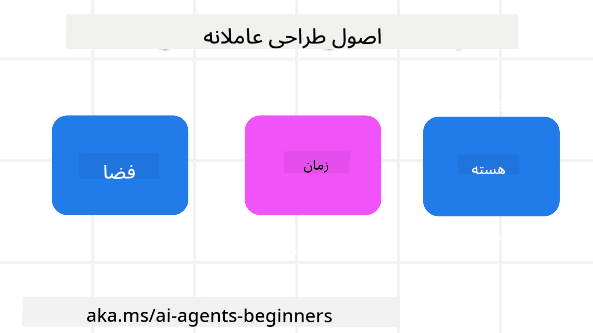

<!--
CO_OP_TRANSLATOR_METADATA:
{
  "original_hash": "969885aab5f923f67f134ce115fbbcaf",
  "translation_date": "2025-03-28T09:21:41+00:00",
  "source_file": "03-agentic-design-patterns\\README.md",
  "language_code": "fa"
}
-->

> _(برای مشاهده ویدئوی این درس روی تصویر بالا کلیک کنید)_
# اصول طراحی عوامل هوش مصنوعی

## مقدمه

روش‌های مختلفی برای طراحی سیستم‌های عامل هوش مصنوعی وجود دارد. از آنجا که ابهام در طراحی هوش مصنوعی مولد یک ویژگی است و نه یک نقص، گاهی مهندسان در تعیین نقطه شروع دچار مشکل می‌شوند. ما مجموعه‌ای از اصول طراحی تجربه کاربری انسان‌محور ایجاد کرده‌ایم تا به توسعه‌دهندگان کمک کنیم سیستم‌های عامل مشتری‌محور بسازند که نیازهای کسب‌وکارشان را حل کند. این اصول طراحی معماری تجویزی نیستند، بلکه نقطه شروعی برای تیم‌هایی هستند که در حال تعریف و ساخت تجربه‌های عامل هستند.

به طور کلی، عوامل باید:

- ظرفیت‌های انسانی را گسترش دهند و مقیاس‌بندی کنند (ایده‌پردازی، حل مسئله، خودکارسازی و غیره)
- شکاف‌های دانشی را پر کنند (من را با حوزه‌های دانشی آشنا کن، ترجمه و غیره)
- همکاری را تسهیل کنند و از روش‌هایی که ما به عنوان افراد ترجیح می‌دهیم با دیگران کار کنیم، حمایت کنند.
- نسخه‌های بهتری از خودمان بسازند (مانند مربی زندگی/مدیر وظایف، کمک به یادگیری مهارت‌های تنظیم احساسات و ذهن‌آگاهی، ایجاد تاب‌آوری و غیره)

## این درس شامل موارد زیر خواهد بود

- اصول طراحی عوامل هوش مصنوعی چیست
- دستورالعمل‌هایی برای پیاده‌سازی این اصول طراحی چیست
- مثال‌هایی از استفاده از اصول طراحی

## اهداف یادگیری

پس از تکمیل این درس، شما قادر خواهید بود:

1. توضیح دهید اصول طراحی عوامل هوش مصنوعی چیست
2. دستورالعمل‌های استفاده از اصول طراحی عوامل هوش مصنوعی را توضیح دهید
3. درک کنید که چگونه می‌توان عاملی را با استفاده از اصول طراحی عوامل هوش مصنوعی ساخت

## اصول طراحی عوامل هوش مصنوعی

### عامل (فضا)

این محیطی است که عامل در آن عمل می‌کند. این اصول نحوه طراحی عوامل برای فعالیت در جهان‌های فیزیکی و دیجیتال را اطلاع می‌دهند.

- **اتصال، نه فروپاشی** – کمک به اتصال افراد به افراد دیگر، رویدادها و دانش قابل اقدام برای تسهیل همکاری و ارتباط.
- عوامل به اتصال رویدادها، دانش و افراد کمک می‌کنند.
- عوامل افراد را به هم نزدیک‌تر می‌کنند. آن‌ها برای جایگزینی یا کوچک شمردن افراد طراحی نشده‌اند.
- **به راحتی قابل دسترس اما گاهی نامرئی** – عامل عمدتاً در پس‌زمینه عمل می‌کند و فقط زمانی ما را هل می‌دهد که مرتبط و مناسب باشد.
  - عامل برای کاربران مجاز در هر دستگاه یا پلتفرمی به راحتی قابل کشف و دسترسی است.
  - عامل از ورودی‌ها و خروجی‌های چندوجهی پشتیبانی می‌کند (صدا، گفتار، متن و غیره).
  - عامل می‌تواند به طور یکپارچه بین پیش‌زمینه و پس‌زمینه؛ بین فعال و واکنش‌پذیر، بر اساس نیازهای کاربر حرکت کند.
  - عامل ممکن است به صورت نامرئی عمل کند، اما مسیر فرآیند پس‌زمینه و همکاری آن با سایر عوامل برای کاربر شفاف و قابل کنترل است.

### عامل (زمان)

این نحوه عملکرد عامل در طول زمان است. این اصول نحوه طراحی عوامل برای تعامل در گذشته، حال و آینده را اطلاع می‌دهند.

- **گذشته**: تأمل بر تاریخ که شامل حالت و زمینه است.
  - عامل نتایج مرتبط‌تری بر اساس تحلیل داده‌های تاریخی غنی‌تر فراتر از فقط رویداد، افراد یا حالت‌ها ارائه می‌دهد.
  - عامل ارتباطاتی از رویدادهای گذشته ایجاد می‌کند و فعالانه بر حافظه تأمل می‌کند تا با موقعیت‌های فعلی تعامل کند.
- **اکنون**: هل دادن بیشتر از اطلاع‌رسانی.
  - عامل رویکرد جامعی برای تعامل با افراد تجسم می‌کند. وقتی رویدادی رخ می‌دهد، عامل فراتر از اطلاع‌رسانی ثابت یا سایر شکل‌های ثابت می‌رود. عامل می‌تواند جریان‌ها را ساده کند یا نشانه‌هایی را به طور پویا ایجاد کند تا توجه کاربر را در لحظه مناسب جلب کند.
  - عامل اطلاعاتی را بر اساس محیط زمینه‌ای، تغییرات اجتماعی و فرهنگی و متناسب با قصد کاربر ارائه می‌دهد.
  - تعامل عامل می‌تواند تدریجی باشد، با پیچیدگی‌ای که در طول زمان برای توانمندسازی کاربران رشد می‌کند.
- **آینده**: تطبیق و تکامل.
  - عامل با دستگاه‌ها، پلتفرم‌ها و حالت‌های مختلف تطبیق می‌یابد.
  - عامل با رفتار کاربر، نیازهای دسترسی سازگار می‌شود و به طور آزاد قابل تنظیم است.
  - عامل از طریق تعامل مداوم کاربر شکل می‌گیرد و تکامل می‌یابد.

### عامل (هسته)

این عناصر کلیدی در هسته طراحی عامل هستند.

- **ابهام را بپذیرید اما اعتماد را برقرار کنید**.
  - سطح معینی از ابهام عامل مورد انتظار است. ابهام یک عنصر کلیدی در طراحی عامل است.
  - اعتماد و شفافیت لایه‌های بنیادی طراحی عامل هستند.
  - انسان‌ها کنترل دارند که عامل روشن/خاموش باشد و وضعیت عامل در تمام زمان‌ها به وضوح قابل مشاهده است.

## دستورالعمل‌های پیاده‌سازی این اصول

هنگام استفاده از اصول طراحی قبلی، از دستورالعمل‌های زیر استفاده کنید:

1. **شفافیت**: به کاربر اطلاع دهید که هوش مصنوعی درگیر است، چگونه عمل می‌کند (شامل اقدامات گذشته)، و چگونه بازخورد بدهد و سیستم را اصلاح کند.
2. **کنترل**: به کاربر امکان دهید تا تنظیمات، ترجیحات و شخصی‌سازی سیستم و ویژگی‌های آن را مشخص کند (شامل توانایی فراموشی).
3. **ثبات**: هدف شما ارائه تجربه‌های چندوجهی و سازگار در دستگاه‌ها و نقاط انتهایی باشد. از عناصر آشنا UI/UX در صورت امکان استفاده کنید (مانند آیکون میکروفون برای تعامل صوتی) و بار شناختی مشتری را تا حد ممکن کاهش دهید (مانند پاسخ‌های مختصر، کمک‌های بصری و محتوای «بیشتر بدانید»).

## چگونه یک عامل سفر را با استفاده از این اصول و دستورالعمل‌ها طراحی کنیم

تصور کنید که در حال طراحی یک عامل سفر هستید، اینجا نحوه استفاده از اصول طراحی و دستورالعمل‌ها آورده شده است:

1. **شفافیت** – به کاربر اطلاع دهید که عامل سفر یک عامل مجهز به هوش مصنوعی است. برخی دستورالعمل‌های اولیه در مورد نحوه شروع ارائه دهید (مانند یک پیام «سلام»، نمونه درخواست‌ها). این موارد را به وضوح در صفحه محصول مستند کنید. لیست درخواست‌هایی که کاربر در گذشته پرسیده است نشان دهید. روشن کنید که چگونه بازخورد بدهید (دکمه شست بالا و پایین، دکمه ارسال بازخورد و غیره). به وضوح بیان کنید اگر عامل محدودیت‌های استفاده یا موضوع دارد.
2. **کنترل** – مطمئن شوید که مشخص است چگونه کاربر می‌تواند عامل را پس از ایجاد آن اصلاح کند، مانند پیام سیستمی. به کاربر امکان دهید که میزان طولانی بودن پاسخ‌های عامل، سبک نوشتاری آن و هر محدودیتی در مورد موضوعاتی که عامل نباید درباره آن صحبت کند، انتخاب کند. به کاربر اجازه دهید هر فایل یا داده مرتبط، درخواست‌ها و مکالمات گذشته را مشاهده و حذف کند.
3. **ثبات** – مطمئن شوید که آیکون‌های اشتراک درخواست، افزودن فایل یا عکس و برچسب زدن به کسی یا چیزی استاندارد و قابل شناسایی هستند. از آیکون گیره کاغذ برای نشان دادن آپلود/اشتراک فایل با عامل و آیکون تصویر برای نشان دادن آپلود گرافیک استفاده کنید.

## منابع اضافی

## درس قبلی

[بررسی چارچوب‌های عامل](../02-explore-agentic-frameworks/README.md)

## درس بعدی

[الگوی طراحی استفاده از ابزار](../04-tool-use/README.md)

**سلب مسئولیت**:  
این سند با استفاده از سرویس ترجمه هوش مصنوعی [Co-op Translator](https://github.com/Azure/co-op-translator) ترجمه شده است. در حالی که ما برای دقت تلاش می‌کنیم، لطفاً توجه داشته باشید که ترجمه‌های خودکار ممکن است حاوی خطاها یا نواقصی باشند. سند اصلی به زبان مادری باید به عنوان منبع معتبر در نظر گرفته شود. برای اطلاعات حیاتی، ترجمه حرفه‌ای انسانی توصیه می‌شود. ما هیچ مسئولیتی در قبال سوء تفاهم‌ها یا تفسیرهای نادرست ناشی از استفاده از این ترجمه نداریم.