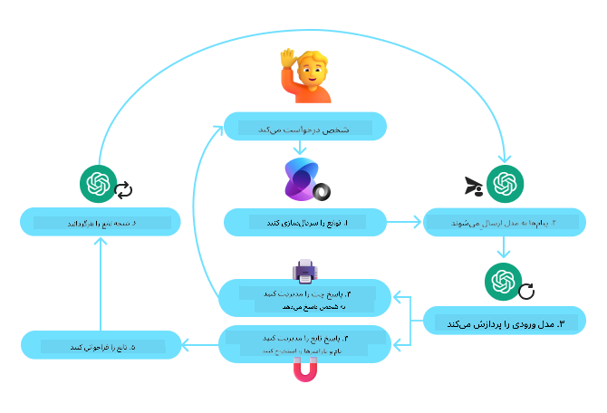
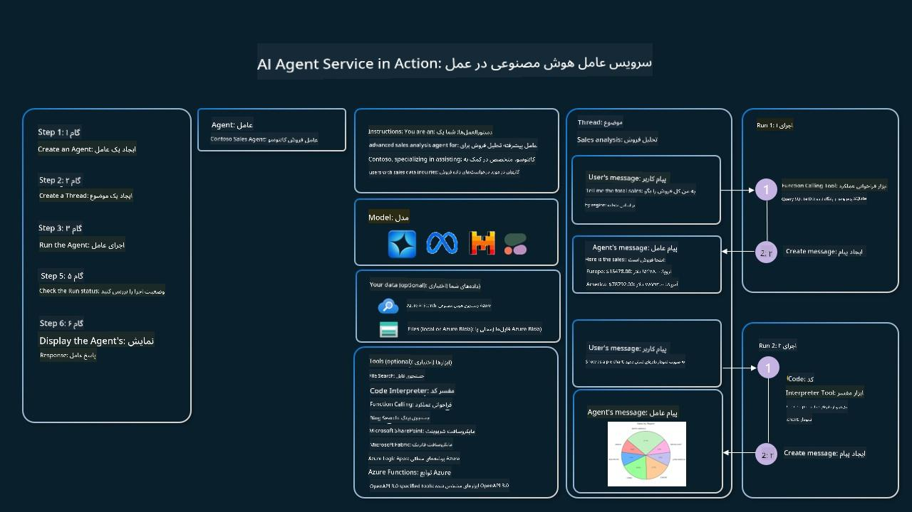

<!--
CO_OP_TRANSLATOR_METADATA:
{
  "original_hash": "b8ea2abd1a674f736d5fc08982e6ec06",
  "translation_date": "2025-03-28T09:23:36+00:00",
  "source_file": "04-tool-use\\README.md",
  "language_code": "fa"
}
-->
[](https://youtu.be/vieRiPRx-gI?si=cEZ8ApnT6Sus9rhn)

> _(برای مشاهده ویدئوی این درس روی تصویر بالا کلیک کنید)_

# الگوی طراحی استفاده از ابزار

ابزارها جذاب هستند زیرا به عوامل هوش مصنوعی امکان می‌دهند که دامنه وسیع‌تری از قابلیت‌ها داشته باشند. به جای اینکه عامل تنها مجموعه محدودی از اقدامات را بتواند انجام دهد، با افزودن یک ابزار، اکنون می‌تواند طیف گسترده‌ای از اقدامات را انجام دهد. در این فصل، به الگوی طراحی استفاده از ابزار می‌پردازیم که نحوه استفاده عوامل هوش مصنوعی از ابزارهای خاص برای دستیابی به اهدافشان را توصیف می‌کند.

## مقدمه

در این درس، قصد داریم به سوالات زیر پاسخ دهیم:

- الگوی طراحی استفاده از ابزار چیست؟
- موارد کاربردی که می‌توان آن را به کار برد چیست؟
- عناصر/بلوک‌های سازنده مورد نیاز برای پیاده‌سازی این الگوی طراحی چیست؟
- ملاحظات ویژه برای استفاده از الگوی طراحی استفاده از ابزار جهت ساخت عوامل هوش مصنوعی قابل اعتماد چیست؟

## اهداف آموزشی

پس از اتمام این درس، شما قادر خواهید بود:

- تعریف الگوی طراحی استفاده از ابزار و هدف آن را توضیح دهید.
- موارد کاربردی که این الگوی طراحی قابل استفاده است را شناسایی کنید.
- عناصر کلیدی مورد نیاز برای پیاده‌سازی این الگوی طراحی را درک کنید.
- ملاحظات مربوط به تضمین اعتمادپذیری عوامل هوش مصنوعی که از این الگو استفاده می‌کنند را بشناسید.

## الگوی طراحی استفاده از ابزار چیست؟

الگوی طراحی **استفاده از ابزار** بر توانمندسازی مدل‌های زبانی بزرگ (LLMs) برای تعامل با ابزارهای خارجی به منظور دستیابی به اهداف خاص تمرکز دارد. ابزارها کدهایی هستند که توسط یک عامل اجرا می‌شوند تا اقدامات خاصی انجام دهند. یک ابزار می‌تواند یک تابع ساده مانند یک ماشین حساب باشد یا یک فراخوانی API به یک سرویس شخص ثالث مانند جستجوی قیمت سهام یا پیش‌بینی آب‌وهوا. در زمینه عوامل هوش مصنوعی، ابزارها به گونه‌ای طراحی شده‌اند که توسط عوامل در پاسخ به **فراخوانی‌های تابع تولیدشده توسط مدل** اجرا شوند.

## موارد کاربردی که می‌توان آن را به کار برد چیست؟

عوامل هوش مصنوعی می‌توانند از ابزارها برای انجام وظایف پیچیده، بازیابی اطلاعات یا تصمیم‌گیری استفاده کنند. الگوی طراحی استفاده از ابزار معمولاً در سناریوهایی به کار می‌رود که نیاز به تعامل پویا با سیستم‌های خارجی دارند، مانند پایگاه‌های داده، سرویس‌های وب یا مفسرهای کد. این قابلیت برای مجموعه‌ای از موارد کاربردی مختلف مفید است، از جمله:

- **بازیابی اطلاعات پویا:** عوامل می‌توانند APIهای خارجی یا پایگاه‌های داده را برای دریافت داده‌های به‌روز پرس‌وجو کنند (مثلاً پرس‌وجوی پایگاه داده SQLite برای تحلیل داده‌ها، دریافت قیمت سهام یا اطلاعات آب‌وهوا).
- **اجرای کد و تفسیر:** عوامل می‌توانند کد یا اسکریپت اجرا کنند تا مسائل ریاضی را حل کنند، گزارش تولید کنند یا شبیه‌سازی انجام دهند.
- **اتوماسیون گردش کار:** خودکارسازی گردش کارهای تکراری یا چندمرحله‌ای با ادغام ابزارهایی مانند زمان‌بندی وظایف، سرویس‌های ایمیل یا خطوط داده.
- **پشتیبانی مشتری:** عوامل می‌توانند با سیستم‌های مدیریت ارتباط با مشتری (CRM)، پلتفرم‌های تیکتینگ یا پایگاه‌های دانش تعامل داشته باشند تا به پرسش‌های کاربران پاسخ دهند.
- **تولید و ویرایش محتوا:** عوامل می‌توانند از ابزارهایی مانند بررسی‌کننده‌های گرامر، خلاصه‌کننده‌های متن یا ارزیاب‌های ایمنی محتوا برای کمک به وظایف تولید محتوا استفاده کنند.

## عناصر/بلوک‌های سازنده مورد نیاز برای پیاده‌سازی الگوی طراحی استفاده از ابزار چیست؟

این بلوک‌های سازنده به عامل هوش مصنوعی امکان انجام طیف گسترده‌ای از وظایف را می‌دهند. بیایید به عناصر کلیدی مورد نیاز برای پیاده‌سازی الگوی طراحی استفاده از ابزار نگاهی بیندازیم:

- **فراخوانی توابع/ابزار:** این روش اصلی برای توانمندسازی مدل‌های زبانی بزرگ (LLMs) جهت تعامل با ابزارها است. توابع یا ابزارها بلوک‌های کد قابل استفاده مجدد هستند که عوامل برای انجام وظایف از آنها استفاده می‌کنند. این‌ها می‌توانند از توابع ساده مانند یک ماشین حساب گرفته تا فراخوانی API به سرویس‌های شخص ثالث مانند جستجوی قیمت سهام یا پیش‌بینی آب‌وهوا باشند.

- **بازیابی اطلاعات پویا:** عوامل می‌توانند APIهای خارجی یا پایگاه‌های داده را برای دریافت داده‌های به‌روز پرس‌وجو کنند. این برای وظایفی مانند تحلیل داده‌ها، دریافت قیمت سهام یا اطلاعات آب‌وهوا مفید است.

- **اجرای کد و تفسیر:** عوامل می‌توانند کد یا اسکریپت اجرا کنند تا مسائل ریاضی را حل کنند، گزارش تولید کنند یا شبیه‌سازی انجام دهند.

- **اتوماسیون گردش کار:** این شامل خودکارسازی گردش کارهای تکراری یا چندمرحله‌ای با ادغام ابزارهایی مانند زمان‌بندی وظایف، سرویس‌های ایمیل یا خطوط داده است.

- **پشتیبانی مشتری:** عوامل می‌توانند با سیستم‌های مدیریت ارتباط با مشتری (CRM)، پلتفرم‌های تیکتینگ یا پایگاه‌های دانش تعامل داشته باشند تا به پرسش‌های کاربران پاسخ دهند.

- **تولید و ویرایش محتوا:** عوامل می‌توانند از ابزارهایی مانند بررسی‌کننده‌های گرامر، خلاصه‌کننده‌های متن یا ارزیاب‌های ایمنی محتوا برای کمک به وظایف تولید محتوا استفاده کنند.

در ادامه، به فراخوانی توابع/ابزار به صورت دقیق‌تر می‌پردازیم.

### فراخوانی توابع/ابزار

فراخوانی توابع روش اصلی برای توانمندسازی مدل‌های زبانی بزرگ (LLMs) جهت تعامل با ابزارها است. اغلب اصطلاحات "تابع" و "ابزار" به صورت متقابل استفاده می‌شوند، زیرا "توابع" (بلوک‌های کد قابل استفاده مجدد) همان "ابزارهایی" هستند که عوامل برای انجام وظایف از آنها استفاده می‌کنند. برای اینکه کد یک تابع اجرا شود، مدل زبانی بزرگ باید درخواست کاربر را با توضیحات تابع مقایسه کند. برای انجام این کار، یک اسکیمای حاوی توضیحات همه توابع موجود به مدل زبانی بزرگ ارسال می‌شود. سپس مدل زبانی بزرگ مناسب‌ترین تابع را برای وظیفه انتخاب کرده و نام و آرگومان‌های آن را برمی‌گرداند. تابع انتخاب‌شده اجرا می‌شود، پاسخ آن به مدل زبانی بزرگ ارسال می‌شود، و مدل از این اطلاعات برای پاسخ به درخواست کاربر استفاده می‌کند.

برای پیاده‌سازی فراخوانی توابع برای عوامل، توسعه‌دهندگان نیاز دارند:

1. یک مدل زبانی بزرگ که از فراخوانی توابع پشتیبانی کند.
2. یک اسکیمای حاوی توضیحات توابع.
3. کد هر تابع توضیح داده‌شده.

برای مثال، از دریافت زمان فعلی در یک شهر استفاده می‌کنیم:

1. **یک مدل زبانی بزرگ که از فراخوانی توابع پشتیبانی کند را راه‌اندازی کنید:**

    همه مدل‌ها از فراخوانی توابع پشتیبانی نمی‌کنند، بنابراین مهم است که بررسی کنید مدل زبانی بزرگ شما این قابلیت را دارد. <a href="https://learn.microsoft.com/azure/ai-services/openai/how-to/function-calling" target="_blank">Azure OpenAI</a> از فراخوانی توابع پشتیبانی می‌کند. ما می‌توانیم با راه‌اندازی کلاینت Azure OpenAI شروع کنیم.

    ```python
    # Initialize the Azure OpenAI client
    client = AzureOpenAI(
        azure_endpoint = os.getenv("AZURE_OPENAI_ENDPOINT"), 
        api_key=os.getenv("AZURE_OPENAI_API_KEY"),  
        api_version="2024-05-01-preview"
    )
    ```

1. **ایجاد یک اسکیمای تابع:**

    در مرحله بعد، یک اسکیمای JSON تعریف می‌کنیم که شامل نام تابع، توضیحی درباره کاری که انجام می‌دهد، و نام‌ها و توضیحات پارامترهای تابع است.
    سپس این اسکیمای JSON را به همراه درخواست کاربر برای یافتن زمان در سان‌فرانسیسکو به کلاینت ارسال می‌کنیم. نکته مهم این است که یک **فراخوانی ابزار** بازگردانده می‌شود، نه پاسخ نهایی به سوال. همانطور که قبلاً اشاره شد، مدل زبانی بزرگ نام تابع انتخاب‌شده برای وظیفه و آرگومان‌هایی که به آن ارسال می‌شود را بازمی‌گرداند.

    ```python
    # Function description for the model to read
    tools = [
        {
            "type": "function",
            "function": {
                "name": "get_current_time",
                "description": "Get the current time in a given location",
                "parameters": {
                    "type": "object",
                    "properties": {
                        "location": {
                            "type": "string",
                            "description": "The city name, e.g. San Francisco",
                        },
                    },
                    "required": ["location"],
                },
            }
        }
    ]
    ```
   
    ```python
  
    # Initial user message
    messages = [{"role": "user", "content": "What's the current time in San Francisco"}] 
  
    # First API call: Ask the model to use the function
      response = client.chat.completions.create(
          model=deployment_name,
          messages=messages,
          tools=tools,
          tool_choice="auto",
      )
  
      # Process the model's response
      response_message = response.choices[0].message
      messages.append(response_message)
  
      print("Model's response:")  

      print(response_message)
  
    ```

    ```bash
    Model's response:
    ChatCompletionMessage(content=None, role='assistant', function_call=None, tool_calls=[ChatCompletionMessageToolCall(id='call_pOsKdUlqvdyttYB67MOj434b', function=Function(arguments='{"location":"San Francisco"}', name='get_current_time'), type='function')])
    ```
  
1. **کد تابع مورد نیاز برای انجام وظیفه:**

    حال که مدل زبانی بزرگ انتخاب کرده کدام تابع باید اجرا شود، کدی که وظیفه را انجام می‌دهد باید پیاده‌سازی و اجرا شود.
    می‌توانیم کد برای دریافت زمان فعلی را در پایتون پیاده‌سازی کنیم. همچنین باید کدی بنویسیم که نام و آرگومان‌ها را از response_message استخراج کند تا نتیجه نهایی را دریافت کنیم.

    ```python
      def get_current_time(location):
        """Get the current time for a given location"""
        print(f"get_current_time called with location: {location}")  
        location_lower = location.lower()
        
        for key, timezone in TIMEZONE_DATA.items():
            if key in location_lower:
                print(f"Timezone found for {key}")  
                current_time = datetime.now(ZoneInfo(timezone)).strftime("%I:%M %p")
                return json.dumps({
                    "location": location,
                    "current_time": current_time
                })
      
        print(f"No timezone data found for {location_lower}")  
        return json.dumps({"location": location, "current_time": "unknown"})
    ```

     ```python
     # Handle function calls
      if response_message.tool_calls:
          for tool_call in response_message.tool_calls:
              if tool_call.function.name == "get_current_time":
     
                  function_args = json.loads(tool_call.function.arguments)
     
                  time_response = get_current_time(
                      location=function_args.get("location")
                  )
     
                  messages.append({
                      "tool_call_id": tool_call.id,
                      "role": "tool",
                      "name": "get_current_time",
                      "content": time_response,
                  })
      else:
          print("No tool calls were made by the model.")  
  
      # Second API call: Get the final response from the model
      final_response = client.chat.completions.create(
          model=deployment_name,
          messages=messages,
      )
  
      return final_response.choices[0].message.content
     ```

     ```bash
      get_current_time called with location: San Francisco
      Timezone found for san francisco
      The current time in San Francisco is 09:24 AM.
     ```

فراخوانی توابع در قلب اکثر طراحی‌های استفاده از ابزار توسط عوامل قرار دارد، اما پیاده‌سازی آن از ابتدا گاهی اوقات چالش‌برانگیز است.
همانطور که در [درس ۲](../../../02-explore-agentic-frameworks) آموختیم، چارچوب‌های عاملیک به ما بلوک‌های سازنده آماده برای پیاده‌سازی استفاده از ابزار ارائه می‌دهند.

## نمونه‌هایی از استفاده از ابزار با چارچوب‌های عاملیک

در اینجا چند نمونه از نحوه پیاده‌سازی الگوی طراحی استفاده از ابزار با استفاده از چارچوب‌های عاملیک مختلف آورده شده است:

### Semantic Kernel

<a href="https://learn.microsoft.com/azure/ai-services/agents/overview" target="_blank">Semantic Kernel</a> یک چارچوب هوش مصنوعی متن‌باز برای توسعه‌دهندگان .NET، پایتون و جاوا است که با مدل‌های زبانی بزرگ (LLMs) کار می‌کنند. این چارچوب فرآیند استفاده از فراخوانی توابع را با توصیف خودکار توابع و پارامترهای آنها به مدل از طریق فرآیندی به نام <a href="https://learn.microsoft.com/semantic-kernel/concepts/ai-services/chat-completion/function-calling/?pivots=programming-language-python#1-serializing-the-functions" target="_blank">سریال‌سازی</a> ساده می‌کند. همچنین ارتباط رفت و برگشتی بین مدل و کد شما را مدیریت می‌کند. یکی دیگر از مزایای استفاده از چارچوب عاملیک مانند Semantic Kernel این است که به شما امکان دسترسی به ابزارهای از پیش ساخته‌شده مانند <a href="https://github.com/microsoft/semantic-kernel/blob/main/python/samples/getting_started_with_agents/openai_assistant/step4_assistant_tool_file_search.py" target="_blank">File Search</a> و <a href="https://github.com/microsoft/semantic-kernel/blob/main/python/samples/getting_started_with_agents/openai_assistant/step3_assistant_tool_code_interpreter.py" target="_blank">Code Interpreter</a> را می‌دهد.

نمودار زیر فرآیند فراخوانی توابع با Semantic Kernel را نشان می‌دهد:



در Semantic Kernel توابع/ابزارها <a href="https://learn.microsoft.com/semantic-kernel/concepts/plugins/?pivots=programming-language-python" target="_blank">پلاگین‌ها</a> نامیده می‌شوند. ما می‌توانیم `get_current_time` function we saw earlier into a plugin by turning it into a class with the function in it. We can also import the `kernel_function` را با استفاده از یک دکوریتور که توضیح تابع را می‌گیرد، تبدیل کنیم. هنگامی که یک کرنل با GetCurrentTimePlugin ایجاد می‌کنید، کرنل به طور خودکار تابع و پارامترهای آن را سریال‌سازی کرده و اسکیمای لازم برای ارسال به مدل زبانی بزرگ را ایجاد می‌کند.

```python
from semantic_kernel.functions import kernel_function

class GetCurrentTimePlugin:
    async def __init__(self, location):
        self.location = location

    @kernel_function(
        description="Get the current time for a given location"
    )
    def get_current_time(location: str = ""):
        ...

```

```python 
from semantic_kernel import Kernel

# Create the kernel
kernel = Kernel()

# Create the plugin
get_current_time_plugin = GetCurrentTimePlugin(location)

# Add the plugin to the kernel
kernel.add_plugin(get_current_time_plugin)
```
  
### Azure AI Agent Service

<a href="https://learn.microsoft.com/azure/ai-services/agents/overview" target="_blank">Azure AI Agent Service</a> یک چارچوب عاملیک جدید است که برای توانمندسازی توسعه‌دهندگان جهت ساخت، استقرار و مقیاس‌بندی عوامل هوش مصنوعی با کیفیت بالا و قابل گسترش طراحی شده است، بدون اینکه نیاز به مدیریت منابع محاسباتی و ذخیره‌سازی زیرین داشته باشند. این سرویس به ویژه برای برنامه‌های سازمانی مفید است، زیرا یک سرویس کاملاً مدیریت‌شده با امنیت در سطح سازمانی است.

در مقایسه با توسعه با API مدل زبانی بزرگ به صورت مستقیم، Azure AI Agent Service چندین مزیت ارائه می‌دهد، از جمله:

- فراخوانی ابزار خودکار – نیازی به تجزیه یک فراخوانی ابزار، اجرای ابزار و مدیریت پاسخ نیست؛ همه این‌ها اکنون در سمت سرور انجام می‌شود.
- مدیریت امن داده‌ها – به جای مدیریت وضعیت مکالمه خود، می‌توانید به رشته‌ها برای ذخیره تمام اطلاعات مورد نیاز خود اعتماد کنید.
- ابزارهای آماده استفاده – ابزارهایی که می‌توانید برای تعامل با منابع داده خود استفاده کنید، مانند Bing، Azure AI Search و Azure Functions.

ابزارهای موجود در Azure AI Agent Service به دو دسته تقسیم می‌شوند:

1. ابزارهای دانش:
    - <a href="https://learn.microsoft.com/azure/ai-services/agents/how-to/tools/bing-grounding?tabs=python&pivots=overview" target="_blank">پایه‌گذاری با Bing Search</a>
    - <a href="https://learn.microsoft.com/azure/ai-services/agents/how-to/tools/file-search?tabs=python&pivots=overview" target="_blank">File Search</a>
    - <a href="https://learn.microsoft.com/azure/ai-services/agents/how-to/tools/azure-ai-search?tabs=azurecli%2Cpython&pivots=overview-azure-ai-search" target="_blank">Azure AI Search</a>

2. ابزارهای عملیاتی:
    - <a href="https://learn.microsoft.com/azure/ai-services/agents/how-to/tools/function-calling?tabs=python&pivots=overview" target="_blank">فراخوانی توابع</a>
    - <a href="https://learn.microsoft.com/azure/ai-services/agents/how-to/tools/code-interpreter?tabs=python&pivots=overview" target="_blank">Code Interpreter</a>
    - <a href="https://learn.microsoft.com/azure/ai-services/agents/how-to/tools/openapi-spec?tabs=python&pivots=overview" target="_blank">ابزارهای تعریف‌شده توسط OpenAI</a>
    - <a href="https://learn.microsoft.com/azure/ai-services/agents/how-to/tools/azure-functions?pivots=overview" target="_blank">Azure Functions</a>

Agent Service به ما امکان می‌دهد که بتوانیم این ابزارها را به صورت یک `toolset`. It also utilizes `threads` which keep track of the history of messages from a particular conversation.

Imagine you are a sales agent at a company called Contoso. You want to develop a conversational agent that can answer questions about your sales data.

The following image illustrates how you could use Azure AI Agent Service to analyze your sales data:



To use any of these tools with the service we can create a client and define a tool or toolset. To implement this practically we can use the following Python code. The LLM will be able to look at the toolset and decide whether to use the user created function, `fetch_sales_data_using_sqlite_query` یا Code Interpreter از پیش ساخته‌شده بر اساس درخواست کاربر استفاده کنیم.

```python 
import os
from azure.ai.projects import AIProjectClient
from azure.identity import DefaultAzureCredential
from fecth_sales_data_functions import fetch_sales_data_using_sqlite_query # fetch_sales_data_using_sqlite_query function which can be found in a fetch_sales_data_functions.py file.
from azure.ai.projects.models import ToolSet, FunctionTool, CodeInterpreterTool

project_client = AIProjectClient.from_connection_string(
    credential=DefaultAzureCredential(),
    conn_str=os.environ["PROJECT_CONNECTION_STRING"],
)

# Initialize function calling agent with the fetch_sales_data_using_sqlite_query function and adding it to the toolset
fetch_data_function = FunctionTool(fetch_sales_data_using_sqlite_query)
toolset = ToolSet()
toolset.add(fetch_data_function)

# Initialize Code Interpreter tool and adding it to the toolset. 
code_interpreter = code_interpreter = CodeInterpreterTool()
toolset = ToolSet()
toolset.add(code_interpreter)

agent = project_client.agents.create_agent(
    model="gpt-4o-mini", name="my-agent", instructions="You are helpful agent", 
    toolset=toolset
)
```

## ملاحظات ویژه برای استفاده از الگوی طراحی استفاده از ابزار جهت ساخت عوامل هوش مصنوعی قابل اعتماد چیست؟

یکی از نگرانی‌های رایج در مورد SQL که به صورت پویا توسط مدل‌های زبانی بزرگ تولید می‌شود، امنیت است، به ویژه خطر تزریق SQL یا اقدامات مخرب، مانند حذف یا دستکاری پایگاه داده. در حالی که این نگرانی‌ها معتبر هستند، می‌توان با پیکربندی صحیح مجوزهای دسترسی پایگاه داده به طور مؤثر آنها را کاهش داد. برای اکثر پایگاه‌های داده، این شامل پیکربندی پایگاه داده به صورت فقط خواندنی است. برای سرویس‌های پایگاه داده مانند PostgreSQL یا Azure SQL، باید به برنامه یک نقش فقط خواندنی (SELECT) اختصاص داده شود.

اجرای برنامه در یک محیط امن محافظت را بیشتر افزایش می‌دهد. در سناریوهای سازمانی، داده‌ها معمولاً از سیستم‌های عملیاتی استخراج و تبدیل شده و به یک پایگاه داده فقط خواندنی یا انبار داده با یک اسکیمای کاربرپسند منتقل می‌شوند. این روش تضمین می‌کند که داده‌ها امن هستند، برای عملکرد و دسترسی بهینه شده‌اند، و برنامه دسترسی محدود و فقط خواندنی دارد.

## منابع اضافی

- <a href="https://microsoft.github.io/build-your-first-agent-with-azure-ai-agent-service-workshop/" target="_blank">کارگاه سرویس عوامل Azure AI</a>
- <a href="https://github.com/Azure-Samples/contoso-creative-writer/tree/main/docs/workshop" target="_blank">کارگاه چندعاملی نویسنده خلاق Contoso</a>
- <a href="https://learn.microsoft.com/semantic-kernel/concepts/ai-services/chat-completion/function-calling/?pivots=programming-language-python#1-serializing-the-functions" target="_blank">آموزش فراخوانی توابع Semantic Kernel</a>
- <a href="https://github.com/microsoft/semantic-kernel/blob/main/python/samples/getting_started_with_agents/openai_assistant/step3_assistant_tool_code_interpreter.py" target="_blank">مفسر کد Semantic Kernel</a>
- <a href="https://microsoft.github.io/autogen/dev/user-guide/core-user-guide/components/tools.html" target="_blank">ابزارهای Autogen</a>

## درس قبلی

[درک الگوهای طراحی عاملیک](../03-agentic-design-patterns/README.md)

## درس بعدی

[Agentic RAG](../05-agentic-rag/README.md)

**سلب مسئولیت**:  
این سند با استفاده از سرویس ترجمه هوش مصنوعی [Co-op Translator](https://github.com/Azure/co-op-translator) ترجمه شده است. در حالی که ما تلاش می‌کنیم دقت را حفظ کنیم، لطفاً توجه داشته باشید که ترجمه‌های خودکار ممکن است شامل خطاها یا نادرستی‌هایی باشند. سند اصلی به زبان مادری آن باید به عنوان منبع معتبر در نظر گرفته شود. برای اطلاعات حساس، توصیه می‌شود از ترجمه حرفه‌ای انسانی استفاده کنید. ما هیچ مسئولیتی در قبال سوءتفاهم‌ها یا تفسیرهای اشتباه ناشی از استفاده از این ترجمه نداریم.