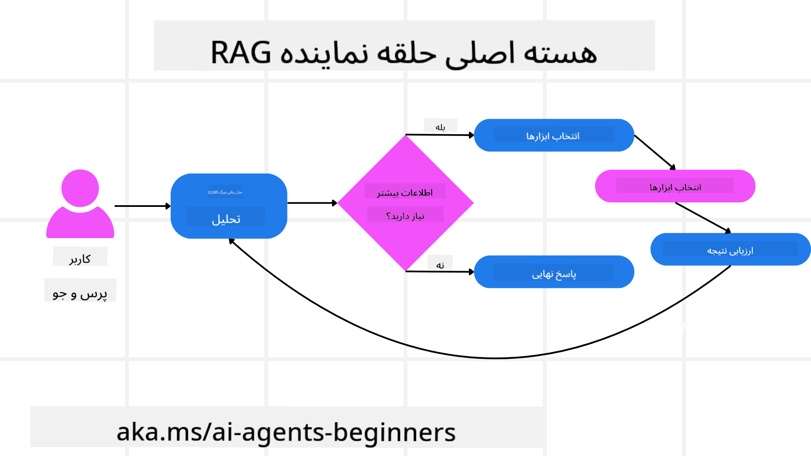
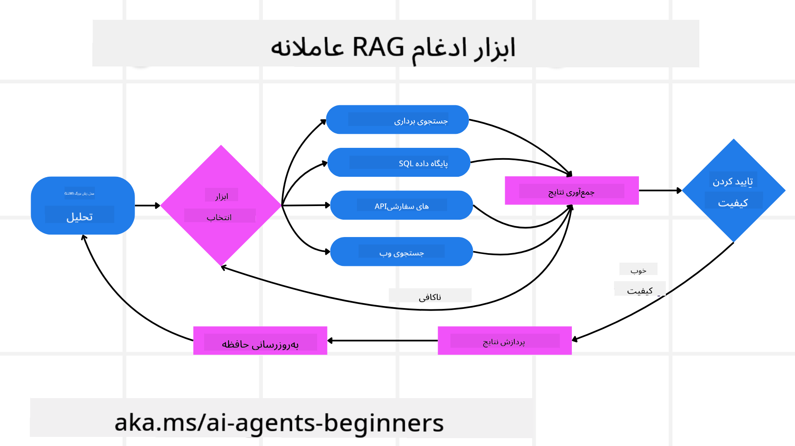
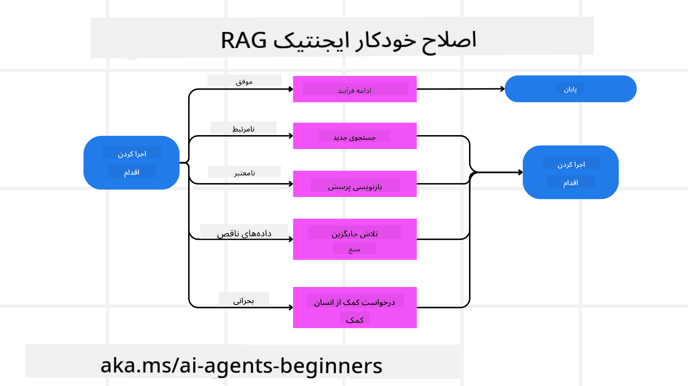
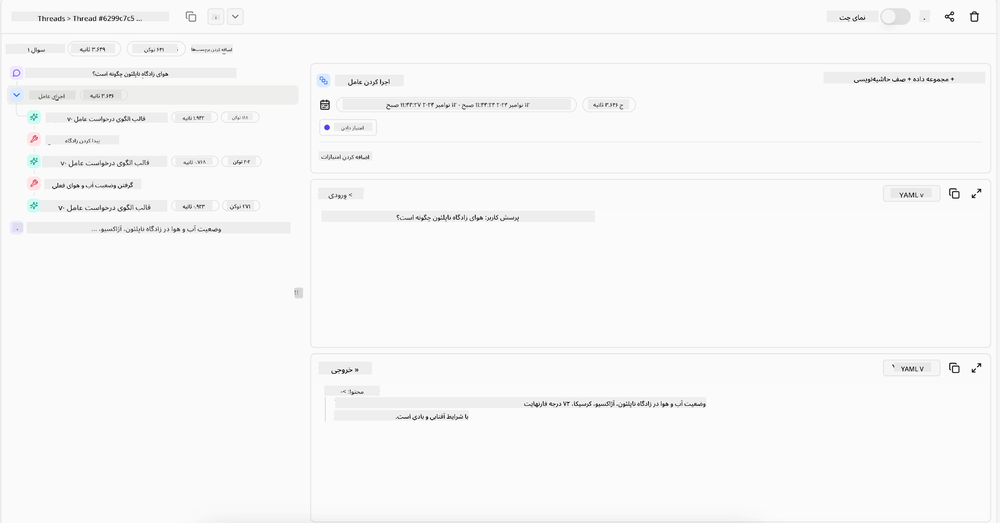

<!--
CO_OP_TRANSLATOR_METADATA:
{
  "original_hash": "4d215d159f2f3b96644fd62657988d23",
  "translation_date": "2025-03-28T09:25:44+00:00",
  "source_file": "05-agentic-rag\\README.md",
  "language_code": "fa"
}
-->

> _(برای مشاهده ویدئوی این درس، روی تصویر بالا کلیک کنید)_

# Agentic RAG

این درس یک نمای کلی جامع از "تولید تقویت‌شده با بازیابی عاملی" (Agentic Retrieval-Augmented Generation یا Agentic RAG) ارائه می‌دهد؛ یک پارادایم نوظهور در هوش مصنوعی که در آن مدل‌های زبانی بزرگ (LLMs) به صورت خودکار مراحل بعدی خود را برنامه‌ریزی می‌کنند و در عین حال اطلاعات را از منابع خارجی استخراج می‌کنند. برخلاف الگوهای ثابت "بازیابی-سپس-خواندن"، Agentic RAG شامل فراخوانی‌های تکراری به LLM است که با فراخوانی ابزارها یا توابع و خروجی‌های ساختاریافته در هم آمیخته شده‌اند. این سیستم نتایج را ارزیابی می‌کند، پرسش‌ها را بهبود می‌بخشد، در صورت نیاز ابزارهای بیشتری را به کار می‌گیرد و این چرخه را تا دستیابی به یک راه‌حل رضایت‌بخش ادامه می‌دهد.

## مقدمه

این درس شامل موارد زیر است:

- **درک Agentic RAG:** آشنایی با پارادایم نوظهور در هوش مصنوعی که در آن مدل‌های زبانی بزرگ (LLMs) به صورت خودکار مراحل بعدی خود را برنامه‌ریزی کرده و اطلاعات را از منابع داده خارجی استخراج می‌کنند.
- **فهم سبک تکراری Maker-Checker:** درک چرخه فراخوانی‌های تکراری به LLM که با فراخوانی ابزارها یا توابع و خروجی‌های ساختاریافته در هم آمیخته شده‌اند، به منظور بهبود دقت و مدیریت پرسش‌های نادرست.
- **بررسی کاربردهای عملی:** شناسایی سناریوهایی که در آن‌ها Agentic RAG می‌درخشد، مانند محیط‌های با اولویت دقت، تعاملات پیچیده با پایگاه داده و جریان‌های کاری گسترده.

## اهداف یادگیری

پس از تکمیل این درس، شما قادر خواهید بود:

- **درک Agentic RAG:** با پارادایم نوظهور در هوش مصنوعی آشنا شوید که در آن مدل‌های زبانی بزرگ (LLMs) به صورت خودکار مراحل بعدی خود را برنامه‌ریزی کرده و اطلاعات را از منابع داده خارجی استخراج می‌کنند.
- **سبک تکراری Maker-Checker:** مفهوم چرخه فراخوانی‌های تکراری به LLM که با فراخوانی ابزارها یا توابع و خروجی‌های ساختاریافته در هم آمیخته شده‌اند، به منظور بهبود دقت و مدیریت پرسش‌های نادرست را درک کنید.
- **مالکیت فرآیند استدلال:** توانایی سیستم در مالکیت فرآیند استدلال خود را درک کنید، به طوری که تصمیمات مربوط به نحوه برخورد با مسائل را بدون تکیه بر مسیرهای از پیش تعریف‌شده اتخاذ کند.
- **جریان کاری:** بفهمید چگونه یک مدل عاملی به طور مستقل تصمیم می‌گیرد گزارش‌های روند بازار را بازیابی کند، داده‌های رقبا را شناسایی کند، معیارهای فروش داخلی را همبسته کند، یافته‌ها را ترکیب کند و استراتژی را ارزیابی کند.
- **حلقه‌های تکراری، یکپارچه‌سازی ابزار و حافظه:** درباره اتکای سیستم به یک الگوی تعامل حلقه‌ای، حفظ وضعیت و حافظه در مراحل مختلف برای جلوگیری از حلقه‌های تکراری و اتخاذ تصمیمات آگاهانه اطلاعات کسب کنید.
- **مدیریت حالت‌های خرابی و خوداصلاحی:** مکانیزم‌های قوی خوداصلاحی سیستم را کشف کنید، از جمله تکرار و پرسش مجدد، استفاده از ابزارهای تشخیصی، و تکیه بر نظارت انسانی در صورت نیاز.
- **مرزهای عاملیت:** محدودیت‌های Agentic RAG را بفهمید، با تمرکز بر خودمختاری خاص حوزه، وابستگی به زیرساخت و رعایت قوانین.
- **موارد استفاده عملی و ارزش:** سناریوهایی را شناسایی کنید که در آن‌ها Agentic RAG می‌درخشد، مانند محیط‌های با اولویت دقت، تعاملات پیچیده با پایگاه داده و جریان‌های کاری گسترده.
- **حاکمیت، شفافیت و اعتماد:** درباره اهمیت حاکمیت و شفافیت، از جمله استدلال قابل توضیح، کنترل تعصب و نظارت انسانی یاد بگیرید.

## Agentic RAG چیست؟

"تولید تقویت‌شده با بازیابی عاملی" (Agentic RAG) یک پارادایم نوظهور در هوش مصنوعی است که در آن مدل‌های زبانی بزرگ (LLMs) به صورت خودکار مراحل بعدی خود را برنامه‌ریزی می‌کنند و اطلاعات را از منابع خارجی استخراج می‌کنند. برخلاف الگوهای ثابت "بازیابی-سپس-خواندن"، Agentic RAG شامل فراخوانی‌های تکراری به LLM است که با فراخوانی ابزارها یا توابع و خروجی‌های ساختاریافته در هم آمیخته شده‌اند. این سیستم نتایج را ارزیابی می‌کند، پرسش‌ها را بهبود می‌بخشد، ابزارهای بیشتری را به کار می‌گیرد و این چرخه را تا دستیابی به یک راه‌حل رضایت‌بخش ادامه می‌دهد. این سبک تکراری "سازنده-بازبین" برای بهبود دقت، مدیریت پرسش‌های نادرست و تضمین نتایج با کیفیت بالا طراحی شده است.

این سیستم به طور فعال فرآیند استدلال خود را مدیریت می‌کند، پرسش‌های نادرست را بازنویسی می‌کند، روش‌های بازیابی مختلف را انتخاب می‌کند و ابزارهای مختلفی مانند جستجوی برداری در Azure AI Search، پایگاه داده‌های SQL یا API‌های سفارشی را ادغام می‌کند، قبل از این که پاسخ نهایی خود را ارائه دهد. ویژگی متمایز یک سیستم عاملی توانایی آن در مدیریت فرآیند استدلال خود است. پیاده‌سازی‌های سنتی RAG به مسیرهای از پیش تعریف‌شده متکی هستند، اما یک سیستم عاملی به صورت خودکار توالی مراحل را بر اساس کیفیت اطلاعاتی که پیدا می‌کند تعیین می‌کند.

## تعریف "تولید تقویت‌شده با بازیابی عاملی" (Agentic RAG)

"تولید تقویت‌شده با بازیابی عاملی" (Agentic RAG) یک پارادایم نوظهور در توسعه هوش مصنوعی است که در آن مدل‌های زبانی بزرگ (LLMs) نه تنها اطلاعات را از منابع داده خارجی بازیابی می‌کنند بلکه به صورت خودکار مراحل بعدی خود را برنامه‌ریزی می‌کنند. برخلاف الگوهای ثابت "بازیابی-سپس-خواندن" یا توالی‌های دستوری از پیش تعیین‌شده، Agentic RAG شامل یک چرخه فراخوانی‌های تکراری به LLM است که با فراخوانی ابزارها یا توابع و خروجی‌های ساختاریافته در هم آمیخته شده‌اند. در هر مرحله، سیستم نتایج به دست آمده را ارزیابی می‌کند، تصمیم می‌گیرد که آیا پرسش‌ها را بهبود دهد، ابزارهای بیشتری را به کار گیرد و این چرخه را ادامه می‌دهد تا به یک راه‌حل رضایت‌بخش برسد.

این سبک تکراری "سازنده-بازبین" برای بهبود دقت، مدیریت پرسش‌های نادرست به پایگاه داده‌های ساختاریافته (مانند NL2SQL) و تضمین نتایج متوازن و با کیفیت بالا طراحی شده است. به جای تکیه صرف بر زنجیره‌های دستوری از پیش طراحی‌شده، سیستم به طور فعال فرآیند استدلال خود را مدیریت می‌کند. می‌تواند پرسش‌های نادرست را بازنویسی کند، روش‌های بازیابی مختلف را انتخاب کند و ابزارهای مختلفی مانند جستجوی برداری در Azure AI Search، پایگاه داده‌های SQL یا API‌های سفارشی را ادغام کند، قبل از این که پاسخ نهایی خود را ارائه دهد. این امر نیاز به چارچوب‌های ارکستراسیون پیچیده را از بین می‌برد. در عوض، یک حلقه نسبتاً ساده "فراخوانی LLM → استفاده از ابزار → فراخوانی LLM → ..." می‌تواند خروجی‌های پیچیده و مستحکمی ارائه دهد.

## مدیریت فرآیند استدلال

ویژگی متمایزی که یک سیستم را "عاملی" می‌سازد، توانایی آن در مدیریت فرآیند استدلال خود است. پیاده‌سازی‌های سنتی RAG اغلب به انسان‌ها متکی هستند تا مسیری از پیش تعیین‌شده برای مدل تعریف کنند: زنجیره‌ای از تفکرات که مشخص می‌کند چه چیزی را بازیابی کند و چه زمانی این کار را انجام دهد.
اما وقتی یک سیستم واقعاً عاملی باشد، خودش تصمیم می‌گیرد که چگونه به مسئله نزدیک شود. این سیستم فقط یک اسکریپت را اجرا نمی‌کند؛ بلکه به طور خودکار توالی مراحل را بر اساس کیفیت اطلاعاتی که پیدا می‌کند تعیین می‌کند.
برای مثال، اگر از آن خواسته شود یک استراتژی برای عرضه محصول ایجاد کند، به یک دستورالعمل که کل فرآیند تحقیق و تصمیم‌گیری را توضیح می‌دهد متکی نیست. در عوض، مدل عاملی به صورت مستقل تصمیم می‌گیرد که:

1. گزارش‌های روند بازار را با استفاده از Bing Web Grounding بازیابی کند.
2. داده‌های مرتبط با رقبا را با استفاده از Azure AI Search شناسایی کند.
3. معیارهای فروش داخلی تاریخی را با استفاده از Azure SQL Database همبسته کند.
4. یافته‌ها را در یک استراتژی منسجم ترکیب کند که از طریق Azure OpenAI Service هماهنگ شده است.
5. استراتژی را از نظر شکاف‌ها یا ناسازگاری‌ها ارزیابی کند و در صورت لزوم دور دیگری از بازیابی را آغاز کند.
تمام این مراحل—از بهبود پرسش‌ها گرفته تا انتخاب منابع و تکرار تا زمانی که پاسخ "رضایت‌بخش" باشد—توسط مدل تصمیم‌گیری می‌شود، نه این که توسط یک انسان از پیش اسکریپت شده باشد.

## حلقه‌های تکراری، یکپارچه‌سازی ابزار و حافظه

یک سیستم عاملی به یک الگوی تعامل حلقه‌ای متکی است:

- **فراخوانی اولیه:** هدف کاربر (یعنی درخواست کاربر) به LLM ارائه می‌شود.
- **فراخوانی ابزار:** اگر مدل اطلاعات گمشده یا دستورالعمل‌های مبهم را شناسایی کند، یک ابزار یا روش بازیابی را انتخاب می‌کند—مانند یک پرسش به پایگاه داده برداری (مثلاً Azure AI Search Hybrid search بر روی داده‌های خصوصی) یا یک فراخوانی SQL ساختاریافته—تا زمینه بیشتری را جمع‌آوری کند.
- **ارزیابی و بهبود:** پس از بررسی داده‌های بازگشتی، مدل تصمیم می‌گیرد که آیا اطلاعات کافی است. اگر نه، پرسش را بهبود می‌دهد، ابزار دیگری را امتحان می‌کند یا رویکرد خود را تنظیم می‌کند.
- **تکرار تا رضایت:** این چرخه ادامه می‌یابد تا زمانی که مدل تعیین کند به وضوح و شواهد کافی برای ارائه یک پاسخ نهایی و مستدل دست یافته است.
- **حافظه و وضعیت:** از آنجا که سیستم وضعیت و حافظه را در مراحل مختلف حفظ می‌کند، می‌تواند تلاش‌های قبلی و نتایج آن‌ها را به یاد آورد، از حلقه‌های تکراری جلوگیری کند و تصمیمات آگاهانه‌تری در ادامه مسیر بگیرد.

با گذشت زمان، این امر حس درک در حال تکامل را ایجاد می‌کند و به مدل امکان می‌دهد تا وظایف پیچیده و چندمرحله‌ای را بدون نیاز به دخالت یا تغییر مداوم دستورالعمل توسط انسان مدیریت کند.

## مدیریت حالت‌های خرابی و خوداصلاحی

خودمختاری Agentic RAG شامل مکانیزم‌های قوی خوداصلاحی نیز می‌شود. وقتی سیستم به بن‌بست می‌رسد—مانند بازیابی اسناد نامرتبط یا برخورد با پرسش‌های نادرست—می‌تواند:

- **تکرار و پرسش مجدد:** به جای ارائه پاسخ‌های کم‌ارزش، مدل استراتژی‌های جستجوی جدیدی را امتحان می‌کند، پرسش‌های پایگاه داده را بازنویسی می‌کند یا مجموعه داده‌های جایگزین را بررسی می‌کند.
- **استفاده از ابزارهای تشخیصی:** سیستم ممکن است توابع اضافی را فراخوانی کند که برای کمک به اشکال‌زدایی مراحل استدلال یا تأیید صحت داده‌های بازیابی‌شده طراحی شده‌اند. ابزارهایی مانند Azure AI Tracing برای مشاهده‌پذیری و نظارت قوی بسیار مهم خواهند بود.
- **تکیه بر نظارت انسانی:** برای سناریوهای حساس یا مکرراً شکست‌خورده، مدل ممکن است عدم اطمینان را علامت‌گذاری کرده و راهنمایی انسانی درخواست کند. هنگامی که انسان بازخورد اصلاحی ارائه می‌دهد، مدل می‌تواند آن درس را برای ادامه کار خود ادغام کند.

این رویکرد تکراری و پویا به مدل اجازه می‌دهد تا به طور مداوم بهبود یابد و اطمینان حاصل کند که فقط یک سیستم تک‌شات نیست، بلکه سیستمی است که از اشتباهات خود در طول یک جلسه درس می‌گیرد.

## مرزهای عاملیت

با وجود خودمختاری در یک وظیفه، Agentic RAG معادل "هوش عمومی مصنوعی" نیست. قابلیت‌های "عاملی" آن محدود به ابزارها، منابع داده و سیاست‌هایی است که توسط توسعه‌دهندگان انسانی ارائه شده است. این سیستم نمی‌تواند ابزارهای خود را اختراع کند یا از مرزهای حوزه‌ای که تعیین شده است فراتر رود. بلکه در هماهنگ‌سازی پویا منابع موجود برتری دارد.
تفاوت‌های کلیدی با اشکال پیشرفته‌تر هوش مصنوعی شامل موارد زیر است:

1. **خودمختاری خاص حوزه:** سیستم‌های Agentic RAG بر دستیابی به اهداف تعریف‌شده توسط کاربر در یک حوزه شناخته‌شده متمرکز هستند و از استراتژی‌هایی مانند بازنویسی پرسش‌ها یا انتخاب ابزار برای بهبود نتایج استفاده می‌کنند.
2. **وابستگی به زیرساخت:** قابلیت‌های سیستم به ابزارها و داده‌هایی که توسط توسعه‌دهندگان یکپارچه شده‌اند وابسته است. بدون دخالت انسانی، نمی‌تواند از این مرزها فراتر رود.
3. **رعایت قوانین:** دستورالعمل‌های اخلاقی، قوانین انطباق و سیاست‌های کسب‌وکار همچنان بسیار مهم هستند. آزادی عامل همیشه تحت محدودیت‌های اقدامات ایمنی و مکانیزم‌های نظارتی باقی می‌ماند (امیدواریم؟)

## موارد استفاده عملی و ارزش

Agentic RAG در سناریوهایی که نیاز به اصلاح تکراری و دقت دارند می‌درخشد:

1. **محیط‌های با اولویت دقت:** در بررسی‌های انطباق، تحلیل‌های قانونی یا تحقیقات حقوقی، مدل عاملی می‌تواند بارها حقایق را بررسی کند، منابع متعددی را مشورت کند و پرسش‌ها را بازنویسی کند تا یک پاسخ کاملاً بررسی‌شده ارائه دهد.
2. **تعاملات پیچیده با پایگاه داده:** هنگام کار با داده‌های ساختاریافته که در آن پرسش‌ها ممکن است اغلب شکست بخورند یا نیاز به تنظیم داشته باشند، سیستم می‌تواند به طور خودکار پرسش‌های خود را با استفاده از Azure SQL یا Microsoft Fabric OneLake اصلاح کند تا اطمینان حاصل شود که بازیابی نهایی با هدف کاربر مطابقت دارد.
3. **جریان‌های کاری گسترده:** جلسات طولانی‌تر ممکن است با آشکار شدن اطلاعات جدید تکامل یابند. Agentic RAG می‌تواند به طور مداوم داده‌های جدید را ادغام کند و استراتژی‌های خود را با یادگیری بیشتر درباره فضای مسئله تغییر دهد.

## حاکمیت، شفافیت و اعتماد

با افزایش خودمختاری این سیستم‌ها در استدلال، حاکمیت و شفافیت بسیار حیاتی هستند:

- **استدلال قابل توضیح:** مدل می‌تواند یک مسیر حسابرسی از پرسش‌هایی که انجام داده است، منابعی که مشورت کرده است و مراحل استدلالی که برای رسیدن به نتیجه خود انجام داده است ارائه دهد. ابزارهایی مانند Azure AI Content Safety و Azure AI Tracing / GenAIOps می‌توانند به حفظ شفافیت و کاهش ریسک کمک کنند.
- **کنترل تعصب و بازیابی متعادل:** توسعه‌دهندگان می‌توانند استراتژی‌های بازیابی را تنظیم کنند تا اطمینان حاصل شود که منابع داده متعادل و نماینده در نظر گرفته می‌شوند و خروجی‌ها را به طور منظم برای تشخیص تعصب یا الگوهای نامتعادل بررسی کنند، با استفاده از مدل‌های سفارشی برای سازمان‌های پیشرفته علم داده که از Azure Machine Learning استفاده می‌کنند.
- **نظارت انسانی و انطباق:** برای وظایف حساس، بررسی انسانی همچنان ضروری است. Agentic RAG جایگزین قضاوت انسانی در تصمیمات حساس نمی‌شود—بلکه با ارائه گزینه‌های کاملاً بررسی‌شده، آن را تقویت می‌کند.

داشتن ابزارهایی که یک رکورد واضح از اقدامات ارائه دهند بسیار مهم است. بدون آن‌ها، اشکال‌زدایی یک فرآیند چندمرحله‌ای می‌تواند بسیار دشوار باشد. مثال زیر از Literal AI (شرکت پشت Chainlit) را برای یک اجرای عامل ببینید:

## نتیجه‌گیری

Agentic RAG نمایانگر یک تکامل طبیعی در نحوه مدیریت وظایف پیچیده و داده‌محور توسط سیستم‌های هوش مصنوعی است. با اتخاذ یک الگوی تعامل حلقه‌ای، انتخاب خودکار ابزارها و بهبود پرسش‌ها تا دستیابی به یک نتیجه با کیفیت بالا، سیستم فراتر از دنبال‌کردن دستورات ثابت حرکت کرده و به یک تصمیم‌گیرنده تطبیقی و آگاه از زمینه تبدیل می‌شود. در حالی که همچنان محدود به زیرساخت‌ها و دستورالعمل‌های اخلاقی تعریف‌شده توسط انسان است، این قابلیت‌های عاملی امکان تعاملات غنی‌تر، پویا‌تر و در نهایت مفیدتر با هوش مصنوعی را برای سازمان‌ها و کاربران نهایی فراهم می‌کند.

## منابع اضافی

- <a href="https://learn.microsoft.com/training/modules/use-own-data-azure-openai"

**سلب مسئولیت**:  
این سند با استفاده از سرویس ترجمه هوش مصنوعی [Co-op Translator](https://github.com/Azure/co-op-translator) ترجمه شده است. در حالی که ما تلاش می‌کنیم دقت ترجمه را تضمین کنیم، لطفاً توجه داشته باشید که ترجمه‌های خودکار ممکن است شامل خطاها یا نادرستی‌ها باشند. سند اصلی به زبان اصلی آن باید به عنوان منبع معتبر در نظر گرفته شود. برای اطلاعات حساس، ترجمه حرفه‌ای انسانی توصیه می‌شود. ما هیچ مسئولیتی در قبال سوء تفاهم‌ها یا برداشت‌های نادرست ناشی از استفاده از این ترجمه نداریم.