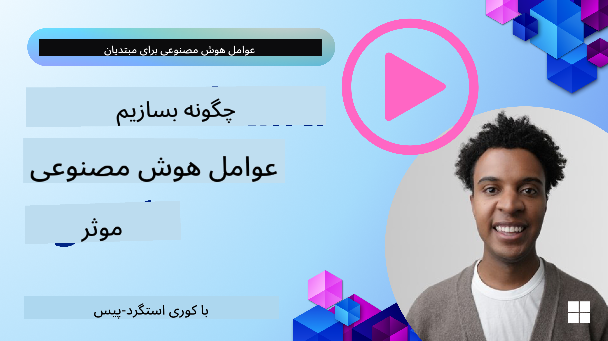
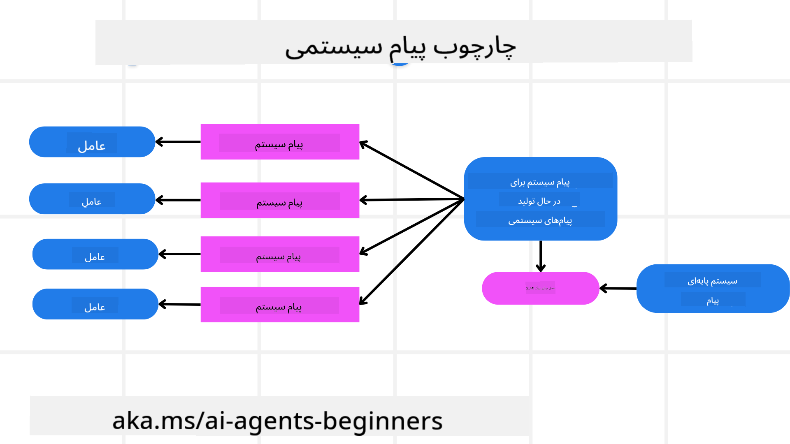
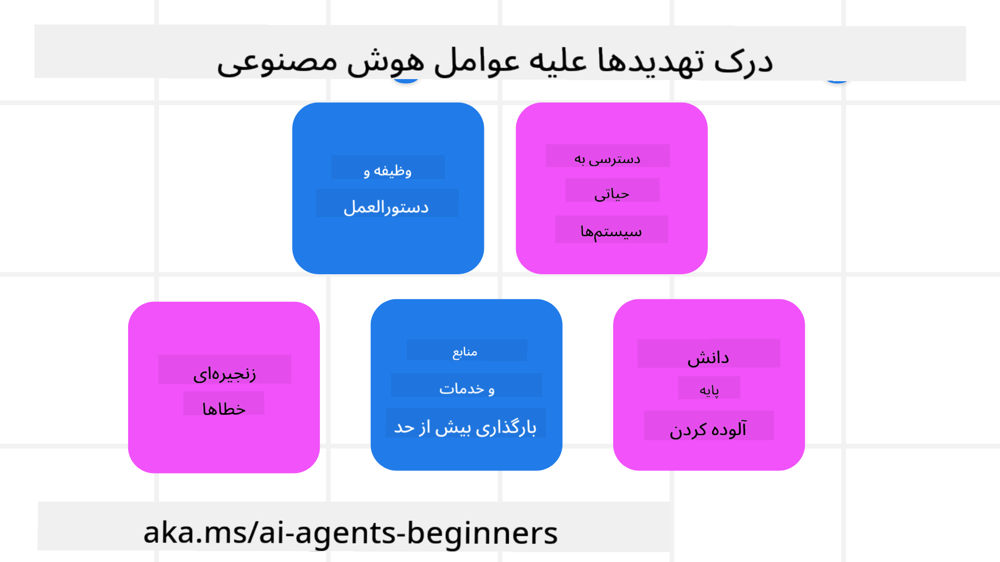
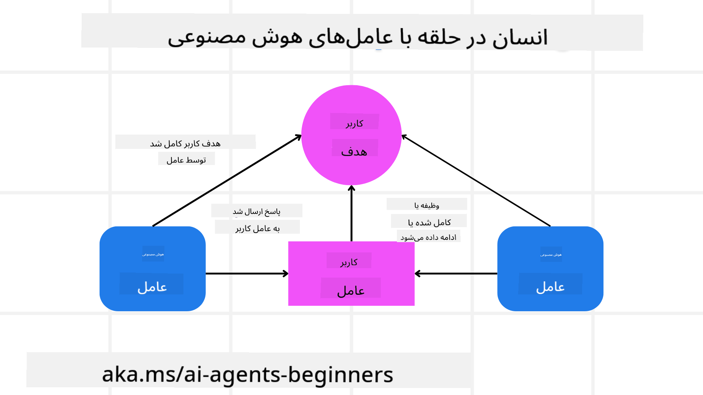

<!--
CO_OP_TRANSLATOR_METADATA:
{
  "original_hash": "c069d7ff0feca3027f88819355866ca1",
  "translation_date": "2025-03-28T09:28:15+00:00",
  "source_file": "06-building-trustworthy-agents\\README.md",
  "language_code": "fa"
}
-->
[](https://youtu.be/iZKkMEGBCUQ?si=Q-kEbcyHUMPoHp8L)

> _(برای مشاهده ویدئوی این درس، روی تصویر بالا کلیک کنید)_

# ساخت عوامل هوش مصنوعی قابل اعتماد

## مقدمه

این درس شامل موارد زیر است:

- نحوه ساخت و استقرار عوامل هوش مصنوعی ایمن و مؤثر
- ملاحظات امنیتی مهم هنگام توسعه عوامل هوش مصنوعی
- حفظ حریم خصوصی داده‌ها و کاربران هنگام توسعه عوامل هوش مصنوعی

## اهداف آموزشی

پس از پایان این درس، شما خواهید دانست که چگونه:

- خطرات مربوط به ایجاد عوامل هوش مصنوعی را شناسایی و کاهش دهید.
- اقدامات امنیتی لازم برای مدیریت صحیح داده‌ها و دسترسی را اجرا کنید.
- عوامل هوش مصنوعی‌ای بسازید که حریم خصوصی داده‌ها را حفظ کرده و تجربه کاربری باکیفیتی ارائه دهند.

## ایمنی

ابتدا به ساخت برنامه‌های عامل محور ایمن می‌پردازیم. ایمنی به این معناست که عامل هوش مصنوعی طبق طراحی عمل کند. به‌عنوان سازندگان برنامه‌های عامل محور، ما روش‌ها و ابزارهایی برای به حداکثر رساندن ایمنی داریم:

### ایجاد چارچوب پیام سیستم

اگر تاکنون برنامه‌ای مبتنی بر هوش مصنوعی با استفاده از مدل‌های زبانی بزرگ (LLMs) ساخته‌اید، اهمیت طراحی یک پیام سیستم قوی یا پیام اولیه سیستم را می‌دانید. این پیام‌ها قوانین، دستورالعمل‌ها و راهنمایی‌های کلی را برای تعامل مدل زبانی با کاربر و داده‌ها تعیین می‌کنند.

برای عوامل هوش مصنوعی، پیام سیستم حتی مهم‌تر است، زیرا این عوامل نیاز به دستورالعمل‌های بسیار خاصی برای انجام وظایفی که برای آنها طراحی شده‌اند دارند.

برای ایجاد پیام‌های سیستم مقیاس‌پذیر، می‌توانیم از یک چارچوب پیام سیستم برای ایجاد یک یا چند عامل در برنامه خود استفاده کنیم:



#### مرحله ۱: ایجاد پیام سیستم متا 

پیام متا توسط یک مدل زبانی بزرگ (LLM) برای تولید پیام‌های سیستم عوامل ما استفاده می‌شود. ما آن را به‌صورت یک الگو طراحی می‌کنیم تا بتوانیم در صورت نیاز، به‌طور مؤثر عوامل متعدد ایجاد کنیم.

در اینجا نمونه‌ای از پیام سیستم متا آورده شده است که به مدل زبانی ارائه می‌دهیم:

```plaintext
You are an expert at creating AI agent assistants. 
You will be provided a company name, role, responsibilities and other
information that you will use to provide a system prompt for.
To create the system prompt, be descriptive as possible and provide a structure that a system using an LLM can better understand the role and responsibilities of the AI assistant. 
```

#### مرحله ۲: ایجاد یک پیام پایه

مرحله بعدی ایجاد یک پیام پایه برای توصیف عامل هوش مصنوعی است. شما باید نقش عامل، وظایفی که عامل انجام خواهد داد، و هر مسئولیت دیگری را که بر عهده دارد، شامل کنید.

نمونه‌ای از این پیام پایه:

```plaintext
You are a travel agent for Contoso Travel that is great at booking flights for customers. To help customers you can perform the following tasks: lookup available flights, book flights, ask for preferences in seating and times for flights, cancel any previously booked flights and alert customers on any delays or cancellations of flights.  
```

#### مرحله ۳: ارائه پیام پایه سیستم به مدل زبانی

اکنون می‌توانیم این پیام سیستم را با ارائه پیام سیستم متا به‌عنوان پیام سیستم و پیام پایه خود بهینه کنیم.

این کار یک پیام سیستم تولید می‌کند که برای هدایت عوامل هوش مصنوعی ما بهتر طراحی شده است:

```markdown
**Company Name:** Contoso Travel  
**Role:** Travel Agent Assistant

**Objective:**  
You are an AI-powered travel agent assistant for Contoso Travel, specializing in booking flights and providing exceptional customer service. Your main goal is to assist customers in finding, booking, and managing their flights, all while ensuring that their preferences and needs are met efficiently.

**Key Responsibilities:**

1. **Flight Lookup:**
    
    - Assist customers in searching for available flights based on their specified destination, dates, and any other relevant preferences.
    - Provide a list of options, including flight times, airlines, layovers, and pricing.
2. **Flight Booking:**
    
    - Facilitate the booking of flights for customers, ensuring that all details are correctly entered into the system.
    - Confirm bookings and provide customers with their itinerary, including confirmation numbers and any other pertinent information.
3. **Customer Preference Inquiry:**
    
    - Actively ask customers for their preferences regarding seating (e.g., aisle, window, extra legroom) and preferred times for flights (e.g., morning, afternoon, evening).
    - Record these preferences for future reference and tailor suggestions accordingly.
4. **Flight Cancellation:**
    
    - Assist customers in canceling previously booked flights if needed, following company policies and procedures.
    - Notify customers of any necessary refunds or additional steps that may be required for cancellations.
5. **Flight Monitoring:**
    
    - Monitor the status of booked flights and alert customers in real-time about any delays, cancellations, or changes to their flight schedule.
    - Provide updates through preferred communication channels (e.g., email, SMS) as needed.

**Tone and Style:**

- Maintain a friendly, professional, and approachable demeanor in all interactions with customers.
- Ensure that all communication is clear, informative, and tailored to the customer's specific needs and inquiries.

**User Interaction Instructions:**

- Respond to customer queries promptly and accurately.
- Use a conversational style while ensuring professionalism.
- Prioritize customer satisfaction by being attentive, empathetic, and proactive in all assistance provided.

**Additional Notes:**

- Stay updated on any changes to airline policies, travel restrictions, and other relevant information that could impact flight bookings and customer experience.
- Use clear and concise language to explain options and processes, avoiding jargon where possible for better customer understanding.

This AI assistant is designed to streamline the flight booking process for customers of Contoso Travel, ensuring that all their travel needs are met efficiently and effectively.

```

#### مرحله ۴: تکرار و بهبود

ارزش این چارچوب پیام سیستم در این است که ایجاد پیام‌های سیستم برای عوامل متعدد را آسان‌تر کرده و همچنین امکان بهبود پیام‌های سیستم در طول زمان را فراهم می‌کند. به‌ندرت پیش می‌آید که پیام سیستم از ابتدا برای تمام موارد استفاده مناسب باشد. با امکان ایجاد تغییرات کوچک و بهبودها از طریق تغییر پیام پایه سیستم و اجرای آن، می‌توانید نتایج را مقایسه و ارزیابی کنید.

## درک تهدیدها

برای ساخت عوامل هوش مصنوعی قابل اعتماد، مهم است که خطرات و تهدیدات مربوط به عامل هوش مصنوعی خود را درک کرده و کاهش دهید. بیایید برخی از تهدیدات مختلف مربوط به عوامل هوش مصنوعی و نحوه برنامه‌ریزی و آمادگی بهتر برای آنها را بررسی کنیم.



### وظایف و دستورالعمل‌ها

**توضیح:** مهاجمان سعی می‌کنند دستورالعمل‌ها یا اهداف عامل هوش مصنوعی را از طریق ورودی‌ها یا پرسش‌های دستکاری‌شده تغییر دهند.

**کاهش خطر:** اعتبارسنجی ورودی‌ها و فیلتر کردن آنها برای شناسایی پرسش‌های بالقوه خطرناک قبل از پردازش توسط عامل هوش مصنوعی. از آنجایی که این نوع حملات معمولاً نیاز به تعامل مکرر با عامل دارند، محدود کردن تعداد چرخش‌ها در یک مکالمه نیز راهی برای جلوگیری از این حملات است.

### دسترسی به سیستم‌های حساس

**توضیح:** اگر عامل هوش مصنوعی به سیستم‌ها و خدماتی که داده‌های حساس ذخیره می‌کنند دسترسی داشته باشد، مهاجمان می‌توانند ارتباط بین عامل و این خدمات را به خطر بیندازند. این حملات می‌توانند مستقیم باشند یا به‌صورت غیرمستقیم برای به دست آوردن اطلاعات از طریق عامل انجام شوند.

**کاهش خطر:** عامل‌های هوش مصنوعی باید فقط در مواقع ضروری به سیستم‌ها دسترسی داشته باشند تا از این نوع حملات جلوگیری شود. ارتباط بین عامل و سیستم نیز باید ایمن باشد. اجرای احراز هویت و کنترل دسترسی نیز راه دیگری برای محافظت از این اطلاعات است.

### بارگذاری بیش از حد منابع و خدمات

**توضیح:** عوامل هوش مصنوعی می‌توانند برای انجام وظایف به ابزارها و خدمات مختلف دسترسی پیدا کنند. مهاجمان می‌توانند از این قابلیت برای حمله به این خدمات از طریق ارسال حجم بالایی از درخواست‌ها توسط عامل استفاده کنند که ممکن است منجر به خرابی سیستم یا هزینه‌های بالا شود.

**کاهش خطر:** اجرای سیاست‌هایی برای محدود کردن تعداد درخواست‌هایی که عامل هوش مصنوعی می‌تواند به یک خدمت ارسال کند. محدود کردن تعداد چرخش‌ها و درخواست‌ها به عامل نیز راه دیگری برای جلوگیری از این نوع حملات است.

### مسمومیت پایگاه دانش

**توضیح:** این نوع حمله مستقیماً عامل هوش مصنوعی را هدف قرار نمی‌دهد، بلکه پایگاه دانش و سایر خدماتی که عامل هوش مصنوعی استفاده می‌کند را هدف قرار می‌دهد. این ممکن است شامل خراب کردن داده‌ها یا اطلاعاتی باشد که عامل هوش مصنوعی برای انجام وظیفه استفاده می‌کند، که منجر به پاسخ‌های مغرضانه یا ناخواسته به کاربر می‌شود.

**کاهش خطر:** تأیید منظم داده‌هایی که عامل هوش مصنوعی در جریان کار خود استفاده می‌کند. اطمینان از اینکه دسترسی به این داده‌ها ایمن است و فقط توسط افراد مورد اعتماد تغییر می‌کند تا از این نوع حمله جلوگیری شود.

### خطاهای زنجیره‌ای

**توضیح:** عوامل هوش مصنوعی برای انجام وظایف به ابزارها و خدمات مختلف دسترسی دارند. خطاهایی که توسط مهاجمان ایجاد می‌شوند می‌توانند باعث خرابی سایر سیستم‌هایی شوند که عامل هوش مصنوعی به آنها متصل است، و حمله را گسترده‌تر و رفع آن را دشوارتر کنند.

**کاهش خطر:** یکی از روش‌ها برای جلوگیری از این نوع حمله این است که عامل هوش مصنوعی در یک محیط محدود مانند اجرای وظایف در یک کانتینر Docker فعالیت کند تا از حملات مستقیم به سیستم جلوگیری شود. ایجاد مکانیزم‌های جایگزین و منطق بازگشت هنگام مواجهه با خطاهای سیستم نیز راه دیگری برای جلوگیری از خرابی‌های گسترده سیستم است.

## انسان در چرخه

یکی دیگر از روش‌های مؤثر برای ساخت سیستم‌های عامل هوش مصنوعی قابل اعتماد، استفاده از انسان در چرخه است. این روش جریان کاری‌ای ایجاد می‌کند که کاربران می‌توانند در طول اجرای عامل‌ها بازخورد ارائه دهند. کاربران عملاً به‌عنوان عامل‌هایی در یک سیستم چندعاملی عمل کرده و با ارائه تأیید یا پایان دادن به فرآیند در حال اجرا، کنترل بیشتری دارند.



در اینجا یک نمونه کد با استفاده از AutoGen برای نشان دادن نحوه اجرای این مفهوم آورده شده است:

```python

# Create the agents.
model_client = OpenAIChatCompletionClient(model="gpt-4o-mini")
assistant = AssistantAgent("assistant", model_client=model_client)
user_proxy = UserProxyAgent("user_proxy", input_func=input)  # Use input() to get user input from console.

# Create the termination condition which will end the conversation when the user says "APPROVE".
termination = TextMentionTermination("APPROVE")

# Create the team.
team = RoundRobinGroupChat([assistant, user_proxy], termination_condition=termination)

# Run the conversation and stream to the console.
stream = team.run_stream(task="Write a 4-line poem about the ocean.")
# Use asyncio.run(...) when running in a script.
await Console(stream)

```

## نتیجه‌گیری

ساخت عوامل هوش مصنوعی قابل اعتماد نیازمند طراحی دقیق، اقدامات امنیتی قوی و بهبود مستمر است. با اجرای سیستم‌های پیام‌دهی متا ساختاریافته، درک تهدیدهای احتمالی و استفاده از استراتژی‌های کاهش خطر، توسعه‌دهندگان می‌توانند عوامل هوش مصنوعی‌ای ایجاد کنند که هم ایمن و هم مؤثر باشند. علاوه بر این، استفاده از رویکرد انسان در چرخه تضمین می‌کند که عوامل هوش مصنوعی با نیازهای کاربران همسو باقی می‌مانند و خطرات کاهش می‌یابد. با پیشرفت هوش مصنوعی، حفظ رویکردی فعال در زمینه امنیت، حریم خصوصی و ملاحظات اخلاقی کلید ایجاد اعتماد و قابلیت اطمینان در سیستم‌های مبتنی بر هوش مصنوعی خواهد بود.

## منابع اضافی

- <a href="https://learn.microsoft.com/azure/ai-studio/responsible-use-of-ai-overview" target="_blank">مروری بر هوش مصنوعی مسئولانه</a>
- <a href="https://learn.microsoft.com/azure/ai-studio/concepts/evaluation-approach-gen-ai" target="_blank">ارزیابی مدل‌های تولیدی هوش مصنوعی و برنامه‌های کاربردی هوش مصنوعی</a>
- <a href="https://learn.microsoft.com/azure/ai-services/openai/concepts/system-message?context=%2Fazure%2Fai-studio%2Fcontext%2Fcontext&tabs=top-techniques" target="_blank">پیام‌های سیستم ایمنی</a>
- <a href="https://blogs.microsoft.com/wp-content/uploads/prod/sites/5/2022/06/Microsoft-RAI-Impact-Assessment-Template.pdf?culture=en-us&country=us" target="_blank">الگوی ارزیابی ریسک</a>

## درس قبلی

[Agentic RAG](../05-agentic-rag/README.md)

## درس بعدی

[Planning Design Pattern](../07-planning-design/README.md)

**سلب مسئولیت**:  
این سند با استفاده از سرویس ترجمه هوش مصنوعی [Co-op Translator](https://github.com/Azure/co-op-translator) ترجمه شده است. در حالی که ما برای دقت تلاش می‌کنیم، لطفاً توجه داشته باشید که ترجمه‌های خودکار ممکن است شامل خطاها یا نادقتی‌ها باشند. سند اصلی به زبان اصلی آن باید به‌عنوان منبع معتبر در نظر گرفته شود. برای اطلاعات حساس، ترجمه حرفه‌ای انسانی توصیه می‌شود. ما مسئول هیچ‌گونه سوءتفاهم یا تفسیر نادرستی که ناشی از استفاده از این ترجمه باشد، نیستیم.