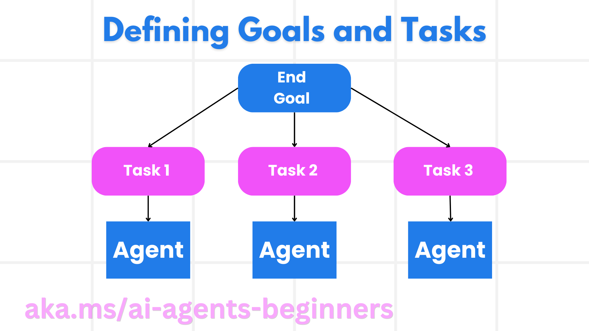

<!--
CO_OP_TRANSLATOR_METADATA:
{
  "original_hash": "8dd9a05d4dc18d3ff510e68e3798a080",
  "translation_date": "2025-03-28T09:29:44+00:00",
  "source_file": "07-planning-design\\README.md",
  "language_code": "fa"
}
-->
[](https://youtu.be/kPfJ2BrBCMY?si=9pYpPXp0sSbK91Dr)

> _(برای مشاهده ویدئوی این درس، روی تصویر بالا کلیک کنید)_

# طراحی برنامه‌ریزی

## مقدمه

این درس شامل موارد زیر است:

* تعریف یک هدف کلی واضح و تقسیم یک وظیفه پیچیده به وظایف قابل مدیریت.
* استفاده از خروجی ساختارمند برای پاسخ‌های قابل اعتمادتر و قابل خواندن توسط ماشین.
* به‌کارگیری رویکرد مبتنی بر رویداد برای مدیریت وظایف پویا و ورودی‌های غیرمنتظره.

## اهداف یادگیری

پس از اتمام این درس، شما درک خواهید کرد که چگونه:

* یک هدف کلی برای یک عامل هوش مصنوعی تعیین کنید و اطمینان حاصل کنید که دقیقاً می‌داند چه چیزی باید به دست آید.
* یک وظیفه پیچیده را به زیر وظایف قابل مدیریت تقسیم کنید و آن‌ها را به ترتیب منطقی سازماندهی کنید.
* عوامل را به ابزارهای مناسب (مانند ابزارهای جستجو یا تحلیل داده) تجهیز کنید، تصمیم بگیرید چه زمانی و چگونه از آن‌ها استفاده شود، و با شرایط غیرمنتظره مواجه شوید.
* نتایج زیر وظایف را ارزیابی کنید، عملکرد را بسنجید و برای بهبود خروجی نهایی اقدامات را تکرار کنید.

## تعریف هدف کلی و تقسیم یک وظیفه



بیشتر وظایف دنیای واقعی برای انجام در یک مرحله بیش از حد پیچیده هستند. یک عامل هوش مصنوعی به یک هدف مختصر نیاز دارد تا برنامه‌ریزی و اقداماتش را هدایت کند. به عنوان مثال، در نظر بگیرید هدف زیر:

    "ایجاد یک برنامه سفر سه‌روزه."

در حالی که بیان آن ساده است، هنوز به اصلاح نیاز دارد. هرچه هدف واضح‌تر باشد، عامل (و هر همکار انسانی) بهتر می‌تواند بر دستیابی به نتیجه مناسب تمرکز کند، مانند ایجاد یک برنامه سفر جامع با گزینه‌های پرواز، پیشنهادات هتل و فعالیت‌های پیشنهادی.

### تجزیه وظیفه

وظایف بزرگ یا پیچیده با تقسیم به زیر وظایف کوچک‌تر و هدف‌محور، قابل مدیریت‌تر می‌شوند.  
برای مثال برنامه سفر، می‌توانید هدف را به بخش‌های زیر تقسیم کنید:

* رزرو پرواز
* رزرو هتل
* اجاره خودرو
* شخصی‌سازی

هر زیر وظیفه می‌تواند توسط عوامل یا فرآیندهای اختصاصی انجام شود. یک عامل ممکن است در جستجوی بهترین پیشنهادات پرواز تخصص داشته باشد، عامل دیگر بر رزرو هتل تمرکز کند و غیره. یک عامل هماهنگ‌کننده یا "پایین‌دستی" می‌تواند این نتایج را به یک برنامه منسجم برای کاربر نهایی ترکیب کند.

این رویکرد ماژولار همچنین امکان بهبود تدریجی را فراهم می‌کند. به عنوان مثال، می‌توانید عوامل تخصصی برای پیشنهادات غذایی یا پیشنهادات فعالیت‌های محلی اضافه کنید و برنامه سفر را با گذر زمان بهبود دهید.

### خروجی ساختارمند

مدل‌های زبان بزرگ (LLMs) می‌توانند خروجی‌های ساختارمندی (مانند JSON) تولید کنند که برای پردازش و تجزیه و تحلیل توسط عوامل یا خدمات پایین‌دستی آسان‌تر است. این ویژگی در یک محیط چندعاملی بسیار مفید است، جایی که می‌توانیم پس از دریافت خروجی برنامه‌ریزی، این وظایف را اجرا کنیم. برای یک نمای کلی سریع به مثال زیر توجه کنید.

قطعه کد پایتون زیر، یک عامل برنامه‌ریزی ساده را نشان می‌دهد که هدف را به زیر وظایف تجزیه کرده و یک برنامه ساختارمند تولید می‌کند:

```python
from pydantic import BaseModel
from enum import Enum
from typing import List, Optional, Union
import json
import os
from typing import Optional
from pprint import pprint
from autogen_core.models import UserMessage, SystemMessage, AssistantMessage
from autogen_ext.models.azure import AzureAIChatCompletionClient
from azure.core.credentials import AzureKeyCredential

class AgentEnum(str, Enum):
    FlightBooking = "flight_booking"
    HotelBooking = "hotel_booking"
    CarRental = "car_rental"
    ActivitiesBooking = "activities_booking"
    DestinationInfo = "destination_info"
    DefaultAgent = "default_agent"
    GroupChatManager = "group_chat_manager"

# Travel SubTask Model
class TravelSubTask(BaseModel):
    task_details: str
    assigned_agent: AgentEnum  # we want to assign the task to the agent

class TravelPlan(BaseModel):
    main_task: str
    subtasks: List[TravelSubTask]
    is_greeting: bool

client = AzureAIChatCompletionClient(
    model="gpt-4o-mini",
    endpoint="https://models.inference.ai.azure.com",
    # To authenticate with the model you will need to generate a personal access token (PAT) in your GitHub settings.
    # Create your PAT token by following instructions here: https://docs.github.com/en/authentication/keeping-your-account-and-data-secure/managing-your-personal-access-tokens
    credential=AzureKeyCredential(os.environ["GITHUB_TOKEN"]),
    model_info={
        "json_output": False,
        "function_calling": True,
        "vision": True,
        "family": "unknown",
    },
)

# Define the user message
messages = [
    SystemMessage(content="""You are an planner agent.
    Your job is to decide which agents to run based on the user's request.
                      Provide your response in JSON format with the following structure:
{'main_task': 'Plan a family trip from Singapore to Melbourne.',
 'subtasks': [{'assigned_agent': 'flight_booking',
               'task_details': 'Book round-trip flights from Singapore to '
                               'Melbourne.'}
    Below are the available agents specialised in different tasks:
    - FlightBooking: For booking flights and providing flight information
    - HotelBooking: For booking hotels and providing hotel information
    - CarRental: For booking cars and providing car rental information
    - ActivitiesBooking: For booking activities and providing activity information
    - DestinationInfo: For providing information about destinations
    - DefaultAgent: For handling general requests""", source="system"),
    UserMessage(
        content="Create a travel plan for a family of 2 kids from Singapore to Melboune", source="user"),
]

response = await client.create(messages=messages, extra_create_args={"response_format": 'json_object'})

response_content: Optional[str] = response.content if isinstance(
    response.content, str) else None
if response_content is None:
    raise ValueError("Response content is not a valid JSON string" )

pprint(json.loads(response_content))

# # Ensure the response content is a valid JSON string before loading it
# response_content: Optional[str] = response.content if isinstance(
#     response.content, str) else None
# if response_content is None:
#     raise ValueError("Response content is not a valid JSON string")

# # Print the response content after loading it as JSON
# pprint(json.loads(response_content))

# Validate the response content with the MathReasoning model
# TravelPlan.model_validate(json.loads(response_content))
```

### عامل برنامه‌ریزی با هماهنگی چندعاملی

در این مثال، یک عامل Semantic Router درخواست کاربر (مثلاً "من به یک برنامه هتل برای سفرم نیاز دارم.") را دریافت می‌کند.

سپس برنامه‌ریز:

* دریافت برنامه هتل: برنامه‌ریز پیام کاربر را دریافت کرده و بر اساس یک سیستم پرامپت (که شامل جزئیات عوامل موجود است)، یک برنامه سفر ساختارمند تولید می‌کند.
* فهرست عوامل و ابزارهای آن‌ها: رجیستری عامل شامل لیستی از عوامل (مثلاً برای پرواز، هتل، اجاره خودرو و فعالیت‌ها) به همراه عملکردها یا ابزارهایی است که ارائه می‌دهند.
* ارسال برنامه به عوامل مربوطه: بسته به تعداد زیر وظایف، برنامه‌ریز یا پیام را مستقیماً به یک عامل اختصاصی (برای سناریوهای تک‌وظیفه‌ای) ارسال می‌کند یا از طریق یک مدیر چت گروهی برای همکاری چندعاملی هماهنگی می‌کند.
* خلاصه‌سازی نتیجه: در نهایت، برنامه‌ریز برای وضوح، برنامه تولید شده را خلاصه می‌کند.  
قطعه کد پایتون زیر این مراحل را نشان می‌دهد:

```python

from pydantic import BaseModel

from enum import Enum
from typing import List, Optional, Union

class AgentEnum(str, Enum):
    FlightBooking = "flight_booking"
    HotelBooking = "hotel_booking"
    CarRental = "car_rental"
    ActivitiesBooking = "activities_booking"
    DestinationInfo = "destination_info"
    DefaultAgent = "default_agent"
    GroupChatManager = "group_chat_manager"

# Travel SubTask Model

class TravelSubTask(BaseModel):
    task_details: str
    assigned_agent: AgentEnum # we want to assign the task to the agent

class TravelPlan(BaseModel):
    main_task: str
    subtasks: List[TravelSubTask]
    is_greeting: bool
import json
import os
from typing import Optional

from autogen_core.models import UserMessage, SystemMessage, AssistantMessage
from autogen_ext.models.openai import AzureOpenAIChatCompletionClient

# Create the client with type-checked environment variables

client = AzureOpenAIChatCompletionClient(
    azure_deployment=os.getenv("AZURE_OPENAI_DEPLOYMENT_NAME"),
    model=os.getenv("AZURE_OPENAI_DEPLOYMENT_NAME"),
    api_version=os.getenv("AZURE_OPENAI_API_VERSION"),
    azure_endpoint=os.getenv("AZURE_OPENAI_ENDPOINT"),
    api_key=os.getenv("AZURE_OPENAI_API_KEY"),
)

from pprint import pprint

# Define the user message

messages = [
    SystemMessage(content="""You are an planner agent.
    Your job is to decide which agents to run based on the user's request.
    Below are the available agents specialized in different tasks:
    - FlightBooking: For booking flights and providing flight information
    - HotelBooking: For booking hotels and providing hotel information
    - CarRental: For booking cars and providing car rental information
    - ActivitiesBooking: For booking activities and providing activity information
    - DestinationInfo: For providing information about destinations
    - DefaultAgent: For handling general requests""", source="system"),
    UserMessage(content="Create a travel plan for a family of 2 kids from Singapore to Melbourne", source="user"),
]

response = await client.create(messages=messages, extra_create_args={"response_format": TravelPlan})

# Ensure the response content is a valid JSON string before loading it

response_content: Optional[str] = response.content if isinstance(response.content, str) else None
if response_content is None:
    raise ValueError("Response content is not a valid JSON string")

# Print the response content after loading it as JSON

pprint(json.loads(response_content))
```

خروجی کد قبلی به این صورت است و سپس می‌توانید از این خروجی ساختارمند برای ارسال به `assigned_agent` و خلاصه‌سازی برنامه سفر برای کاربر نهایی استفاده کنید.

```json
{
    "is_greeting": "False",
    "main_task": "Plan a family trip from Singapore to Melbourne.",
    "subtasks": [
        {
            "assigned_agent": "flight_booking",
            "task_details": "Book round-trip flights from Singapore to Melbourne."
        },
        {
            "assigned_agent": "hotel_booking",
            "task_details": "Find family-friendly hotels in Melbourne."
        },
        {
            "assigned_agent": "car_rental",
            "task_details": "Arrange a car rental suitable for a family of four in Melbourne."
        },
        {
            "assigned_agent": "activities_booking",
            "task_details": "List family-friendly activities in Melbourne."
        },
        {
            "assigned_agent": "destination_info",
            "task_details": "Provide information about Melbourne as a travel destination."
        }
    ]
}
```

یک دفترچه یادداشت نمونه با کد قبلی [اینجا](../../../07-planning-design/07-autogen.ipynb) در دسترس است.

### برنامه‌ریزی تکراری

برخی از وظایف نیاز به بازگشت و برنامه‌ریزی مجدد دارند، جایی که نتیجه یک زیر وظیفه بر وظیفه بعدی تأثیر می‌گذارد. برای مثال، اگر عامل در حین رزرو پروازها با یک فرمت داده غیرمنتظره مواجه شود، ممکن است نیاز داشته باشد قبل از ادامه به رزرو هتل، استراتژی خود را تطبیق دهد.

علاوه بر این، بازخورد کاربر (مثلاً تصمیم یک انسان برای انتخاب پروازی زودتر) می‌تواند برنامه‌ریزی مجدد جزئی را آغاز کند. این رویکرد پویا و تکراری اطمینان می‌دهد که راه‌حل نهایی با محدودیت‌های دنیای واقعی و ترجیحات در حال تغییر کاربر همسو است.

نمونه کد:

```python
from autogen_core.models import UserMessage, SystemMessage, AssistantMessage
#.. same as previous code and pass on the user history, current plan
messages = [
    SystemMessage(content="""You are a planner agent to optimize the
    Your job is to decide which agents to run based on the user's request.
    Below are the available agents specialized in different tasks:
    - FlightBooking: For booking flights and providing flight information
    - HotelBooking: For booking hotels and providing hotel information
    - CarRental: For booking cars and providing car rental information
    - ActivitiesBooking: For booking activities and providing activity information
    - DestinationInfo: For providing information about destinations
    - DefaultAgent: For handling general requests""", source="system"),
    UserMessage(content="Create a travel plan for a family of 2 kids from Singapore to Melbourne", source="user"),
    AssistantMessage(content=f"Previous travel plan - {TravelPlan}", source="assistant")
]
# .. re-plan and send the tasks to respective agents
```

برای برنامه‌ریزی جامع‌تر حتماً Magnetic One را بررسی کنید.

## خلاصه

در این مقاله، به یک مثال از نحوه ایجاد یک برنامه‌ریز که می‌تواند عوامل موجود را به صورت پویا انتخاب کند، پرداختیم. خروجی برنامه‌ریز وظایف را تجزیه کرده و عوامل را برای اجرا اختصاص می‌دهد. فرض بر این است که عوامل به عملکردها/ابزارهایی که برای انجام وظیفه مورد نیاز هستند، دسترسی دارند. علاوه بر عوامل، می‌توانید الگوهای دیگری مانند انعکاس، خلاصه‌سازی و چت نوبتی را برای شخصی‌سازی بیشتر اضافه کنید.

## منابع اضافی

* AutoGen Magentic One - یک سیستم چندعاملی عمومی برای حل وظایف پیچیده است و نتایج چشمگیری در چندین معیار چالش‌برانگیز عاملی کسب کرده است. مرجع:

. در این پیاده‌سازی، هماهنگ‌کننده برنامه خاص وظیفه ایجاد کرده و این وظایف را به عوامل موجود واگذار می‌کند. علاوه بر برنامه‌ریزی، هماهنگ‌کننده از یک مکانیزم ردیابی برای نظارت بر پیشرفت وظیفه و برنامه‌ریزی مجدد در صورت نیاز استفاده می‌کند.

## درس قبلی

[ساخت عوامل هوش مصنوعی قابل اعتماد](../06-building-trustworthy-agents/README.md)

## درس بعدی

[الگوی طراحی چندعاملی](../08-multi-agent/README.md)

**سلب مسئولیت**:  
این سند با استفاده از سرویس ترجمه هوش مصنوعی [Co-op Translator](https://github.com/Azure/co-op-translator) ترجمه شده است. در حالی که ما تلاش می‌کنیم تا دقت را حفظ کنیم، لطفاً توجه داشته باشید که ترجمه‌های خودکار ممکن است حاوی خطاها یا نواقصی باشند. سند اصلی به زبان اصلی آن باید به عنوان منبع معتبر در نظر گرفته شود. برای اطلاعات حیاتی، توصیه می‌شود از ترجمه حرفه‌ای انسانی استفاده کنید. ما مسئولیتی در قبال سوء تفاهم‌ها یا تفسیرهای نادرست ناشی از استفاده از این ترجمه نداریم.