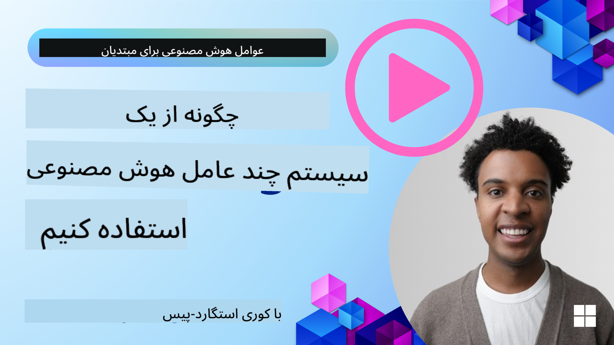
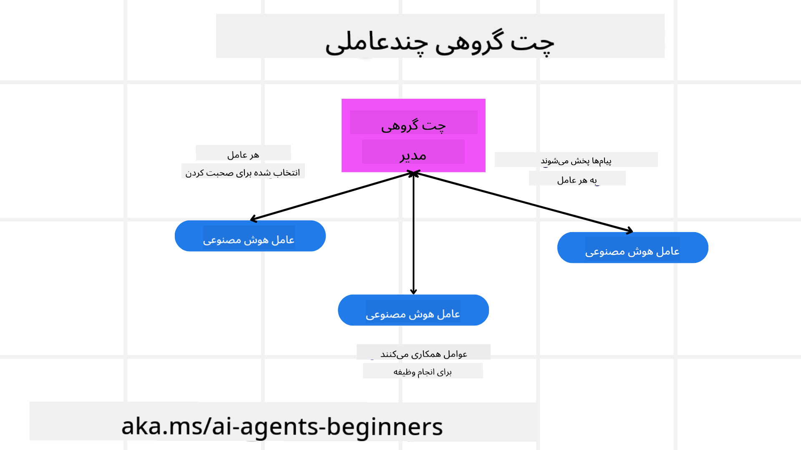
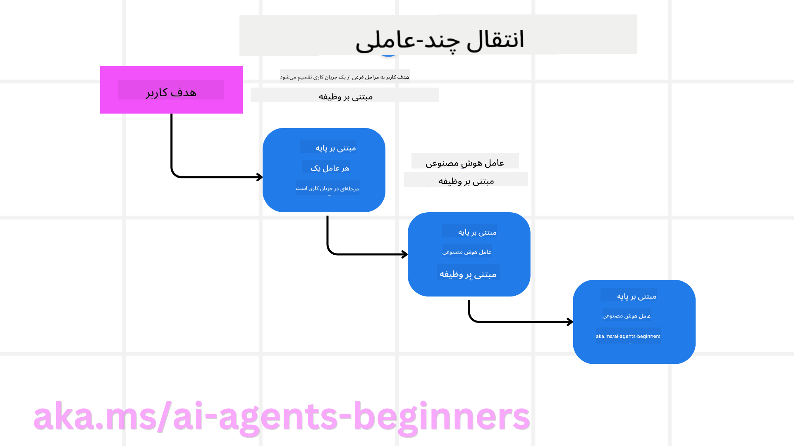
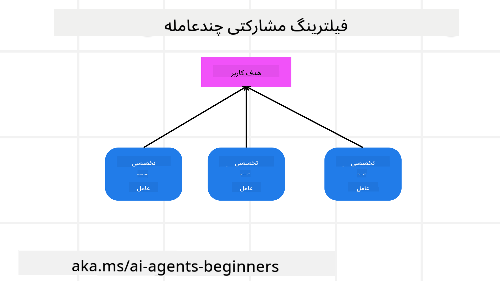

<!--
CO_OP_TRANSLATOR_METADATA:
{
  "original_hash": "bdb0a92e5a437d5fa985a6863f4a836c",
  "translation_date": "2025-03-28T09:33:09+00:00",
  "source_file": "08-multi-agent\\README.md",
  "language_code": "fa"
}
-->

> _(روی تصویر بالا کلیک کنید تا ویدیوی این درس را مشاهده کنید)_

# الگوهای طراحی چندعامله

به محض اینکه شروع به کار بر روی پروژه‌ای کنید که شامل چندین عامل است، باید الگوی طراحی چندعامله را در نظر بگیرید. با این حال، ممکن است بلافاصله مشخص نباشد که چه زمانی باید به سیستم چندعامله تغییر دهید و مزایای آن چیست.

## مقدمه

در این درس، به دنبال پاسخ دادن به سوالات زیر هستیم:

- چه سناریوهایی برای استفاده از چندعامل مناسب هستند؟
- مزایای استفاده از چندعامل نسبت به یک عامل واحد که وظایف متعددی را انجام می‌دهد چیست؟
- اجزای اصلی پیاده‌سازی الگوی طراحی چندعامله چیست؟
- چگونه می‌توانیم دیدگاهی نسبت به نحوه تعامل چندین عامل با یکدیگر داشته باشیم؟

## اهداف یادگیری

بعد از این درس، شما باید قادر باشید:

- سناریوهایی که چندعامل مناسب هستند را شناسایی کنید.
- مزایای استفاده از چندعامل نسبت به یک عامل واحد را تشخیص دهید.
- اجزای اصلی پیاده‌سازی الگوی طراحی چندعامله را درک کنید.

تصویر کلی چیست؟

*چندعامل‌ها یک الگوی طراحی هستند که به چندین عامل اجازه می‌دهند با هم همکاری کنند تا به یک هدف مشترک دست یابند.*

این الگو به طور گسترده در زمینه‌های مختلف، از جمله رباتیک، سیستم‌های خودمختار و محاسبات توزیع‌شده استفاده می‌شود.

## سناریوهایی که چندعامل مناسب هستند

پس چه سناریوهایی برای استفاده از چندعامل مناسب هستند؟ پاسخ این است که سناریوهای زیادی وجود دارد که به‌ویژه در موارد زیر استفاده از چندعامل مفید است:

- **بار کاری بزرگ**: بارهای کاری بزرگ را می‌توان به وظایف کوچک‌تر تقسیم کرد و به عوامل مختلف اختصاص داد، که این امکان را فراهم می‌کند تا پردازش موازی انجام شود و کار سریع‌تر به پایان برسد. مثالی از این مورد می‌تواند یک وظیفه پردازش داده‌های بزرگ باشد.
- **وظایف پیچیده**: وظایف پیچیده، مانند بارهای کاری بزرگ، می‌توانند به وظایف کوچک‌تر تقسیم شوند و به عوامل مختلفی اختصاص داده شوند که هر کدام در جنبه خاصی از وظیفه تخصص دارند. مثالی خوب از این مورد می‌تواند خودروهای خودران باشد که عوامل مختلفی برای مدیریت مسیریابی، شناسایی موانع و ارتباط با خودروهای دیگر وجود دارند.
- **تخصص متنوع**: عوامل مختلف می‌توانند تخصص‌های متنوعی داشته باشند، که این امکان را فراهم می‌کند تا جنبه‌های مختلف یک وظیفه را بهتر از یک عامل واحد مدیریت کنند. برای این مورد، یک مثال خوب می‌تواند حوزه سلامت باشد که عوامل می‌توانند مدیریت تشخیص‌ها، برنامه‌های درمانی و نظارت بر بیماران را بر عهده داشته باشند.

## مزایای استفاده از چندعامل نسبت به یک عامل واحد

یک سیستم عامل واحد ممکن است برای وظایف ساده به خوبی کار کند، اما برای وظایف پیچیده‌تر، استفاده از چندعامل می‌تواند چندین مزیت داشته باشد:

- **تخصصی‌سازی**: هر عامل می‌تواند برای یک وظیفه خاص تخصص داشته باشد. عدم تخصصی‌سازی در یک عامل واحد به این معناست که شما عاملی دارید که همه کارها را انجام می‌دهد اما ممکن است هنگام مواجهه با یک وظیفه پیچیده سردرگم شود. ممکن است، به عنوان مثال، وظیفه‌ای را انجام دهد که برای آن مناسب نیست.
- **مقیاس‌پذیری**: مقیاس‌بندی سیستم‌ها با اضافه کردن عوامل بیشتر آسان‌تر است تا اینکه یک عامل واحد را بیش از حد بارگذاری کنیم.
- **تحمل خطا**: اگر یک عامل شکست بخورد، عوامل دیگر می‌توانند به کار خود ادامه دهند و از قابلیت اطمینان سیستم اطمینان حاصل کنند.

بیایید یک مثال بزنیم، فرض کنید می‌خواهیم یک سفر برای یک کاربر رزرو کنیم. یک سیستم عامل واحد باید تمام جنبه‌های فرآیند رزرو سفر را مدیریت کند، از پیدا کردن پروازها گرفته تا رزرو هتل‌ها و خودروهای اجاره‌ای. برای دستیابی به این هدف با یک عامل واحد، عامل باید ابزارهایی برای مدیریت همه این وظایف داشته باشد. این می‌تواند منجر به سیستمی پیچیده و یکپارچه شود که نگهداری و مقیاس‌بندی آن دشوار است. یک سیستم چندعامله، از طرف دیگر، می‌تواند عوامل مختلفی داشته باشد که در پیدا کردن پروازها، رزرو هتل‌ها و خودروهای اجاره‌ای تخصص دارند. این باعث می‌شود سیستم ماژولارتر، نگهداری آسان‌تر و مقیاس‌پذیرتر باشد.

این را با یک دفتر سفر که به صورت یک مغازه خانوادگی اداره می‌شود در مقابل یک دفتر سفر که به صورت یک فرانچایز اداره می‌شود مقایسه کنید. مغازه خانوادگی یک عامل واحد دارد که تمام جنبه‌های فرآیند رزرو سفر را مدیریت می‌کند، در حالی که فرانچایز عوامل مختلفی دارد که جنبه‌های مختلف فرآیند رزرو سفر را مدیریت می‌کنند.

## اجزای اصلی پیاده‌سازی الگوی طراحی چندعامله

قبل از اینکه بتوانید الگوی طراحی چندعامله را پیاده‌سازی کنید، باید اجزای اصلی این الگو را بشناسید.

بیایید این موضوع را با مثال رزرو یک سفر برای یک کاربر ملموس‌تر کنیم. در این مورد، اجزای اصلی شامل موارد زیر می‌شوند:

- **ارتباط بین عوامل**: عوامل برای پیدا کردن پروازها، رزرو هتل‌ها و خودروهای اجاره‌ای باید اطلاعات مربوط به ترجیحات و محدودیت‌های کاربر را با یکدیگر به اشتراک بگذارند. شما باید درباره پروتکل‌ها و روش‌های این ارتباط تصمیم بگیرید. به طور مشخص، عامل مربوط به پیدا کردن پروازها باید با عامل مربوط به رزرو هتل‌ها ارتباط برقرار کند تا اطمینان حاصل شود که هتل برای همان تاریخ‌های پرواز رزرو شده است. این به این معناست که عوامل باید اطلاعات مربوط به تاریخ‌های سفر کاربر را به اشتراک بگذارند، یعنی شما باید تصمیم بگیرید *کدام عوامل اطلاعات را به اشتراک می‌گذارند و چگونه این اطلاعات به اشتراک گذاشته می‌شود*.
- **مکانیزم‌های هماهنگی**: عوامل باید اقدامات خود را هماهنگ کنند تا اطمینان حاصل شود که ترجیحات و محدودیت‌های کاربر رعایت شده‌اند. ترجیح کاربر می‌تواند این باشد که هتلی نزدیک به فرودگاه می‌خواهد، در حالی که محدودیت می‌تواند این باشد که خودروهای اجاره‌ای فقط در فرودگاه موجود هستند. این به این معناست که عامل مربوط به رزرو هتل‌ها باید با عامل مربوط به رزرو خودروهای اجاره‌ای هماهنگ شود تا اطمینان حاصل شود که ترجیحات و محدودیت‌های کاربر رعایت شده‌اند. این به این معناست که شما باید تصمیم بگیرید *چگونه عوامل اقدامات خود را هماهنگ می‌کنند*.
- **معماری عامل**: عوامل باید ساختار داخلی داشته باشند تا بتوانند تصمیم‌گیری کنند و از تعاملات خود با کاربر یاد بگیرند. این به این معناست که عامل مربوط به پیدا کردن پروازها باید ساختار داخلی داشته باشد تا بتواند تصمیم‌گیری کند که کدام پروازها را به کاربر پیشنهاد دهد. این به این معناست که شما باید تصمیم بگیرید *چگونه عوامل تصمیم‌گیری می‌کنند و از تعاملات خود با کاربر یاد می‌گیرند*. مثال‌هایی از اینکه چگونه یک عامل یاد می‌گیرد و بهبود می‌یابد می‌تواند این باشد که عامل مربوط به پیدا کردن پروازها از یک مدل یادگیری ماشین استفاده کند تا پروازهایی را بر اساس ترجیحات گذشته کاربر پیشنهاد دهد.
- **دیدگاه به تعاملات چندعامله**: شما باید دیدگاهی داشته باشید نسبت به اینکه چگونه چندین عامل با یکدیگر تعامل دارند. این به این معناست که شما باید ابزارها و تکنیک‌هایی برای ردیابی فعالیت‌ها و تعاملات عامل داشته باشید. این می‌تواند به صورت ابزارهای ثبت و نظارت، ابزارهای تصویری و معیارهای عملکرد باشد.
- **الگوهای چندعامله**: الگوهای مختلفی برای پیاده‌سازی سیستم‌های چندعامله وجود دارد، مانند معماری متمرکز، غیرمتمرکز و ترکیبی. شما باید الگوی مناسب برای مورد استفاده خود را انتخاب کنید.
- **حضور انسان در حلقه**: در بیشتر موارد، شما انسانی در حلقه دارید و باید به عوامل دستور دهید که چه زمانی درخواست مداخله انسانی کنند. این می‌تواند به صورت یک کاربر که درخواست یک هتل یا پرواز خاصی را دارد که عوامل پیشنهاد نداده‌اند یا درخواست تایید قبل از رزرو یک پرواز یا هتل باشد.

## دیدگاه به تعاملات چندعامله

مهم است که شما دیدگاهی نسبت به اینکه چگونه چندین عامل با یکدیگر تعامل دارند داشته باشید. این دیدگاه برای اشکال‌زدایی، بهینه‌سازی و اطمینان از اثربخشی کلی سیستم ضروری است. برای دستیابی به این هدف، شما باید ابزارها و تکنیک‌هایی برای ردیابی فعالیت‌ها و تعاملات عامل داشته باشید. این می‌تواند به صورت ابزارهای ثبت و نظارت، ابزارهای تصویری و معیارهای عملکرد باشد.

برای مثال، در مورد رزرو سفر برای یک کاربر، شما می‌توانید داشبوردی داشته باشید که وضعیت هر عامل، ترجیحات و محدودیت‌های کاربر، و تعاملات بین عوامل را نشان دهد. این داشبورد می‌تواند تاریخ‌های سفر کاربر، پروازهای پیشنهادی توسط عامل پرواز، هتل‌های پیشنهادی توسط عامل هتل، و خودروهای اجاره‌ای پیشنهادی توسط عامل خودرو را نشان دهد. این به شما دیدگاه واضحی از نحوه تعامل عوامل با یکدیگر و اینکه آیا ترجیحات و محدودیت‌های کاربر رعایت شده‌اند می‌دهد.

بیایید هر یک از این جنبه‌ها را با جزئیات بیشتر بررسی کنیم.

- **ابزارهای ثبت و نظارت**: شما می‌خواهید ثبت هر اقدام انجام‌شده توسط یک عامل را داشته باشید. یک ورودی ثبت می‌تواند اطلاعاتی درباره عاملی که اقدام را انجام داده، اقدامی که انجام شده، زمان انجام اقدام و نتیجه اقدام ذخیره کند. این اطلاعات سپس می‌تواند برای اشکال‌زدایی، بهینه‌سازی و موارد دیگر استفاده شود.

- **ابزارهای تصویری**: ابزارهای تصویری می‌توانند به شما کمک کنند تعاملات بین عوامل را به روشی شهودی‌تر مشاهده کنید. برای مثال، شما می‌توانید نموداری داشته باشید که جریان اطلاعات بین عوامل را نشان دهد. این می‌تواند به شما کمک کند گلوگاه‌ها، ناکارآمدی‌ها و مسائل دیگر در سیستم را شناسایی کنید.

- **معیارهای عملکرد**: معیارهای عملکرد می‌توانند به شما کمک کنند اثربخشی سیستم چندعامله را پیگیری کنید. برای مثال، شما می‌توانید زمان انجام یک وظیفه، تعداد وظایف انجام‌شده در واحد زمان، و دقت پیشنهادات داده‌شده توسط عوامل را پیگیری کنید. این اطلاعات می‌تواند به شما کمک کند زمینه‌های بهبود را شناسایی کنید و سیستم را بهینه کنید.

## الگوهای چندعامله

بیایید به برخی الگوهای مشخصی که می‌توانیم برای ایجاد اپلیکیشن‌های چندعامله استفاده کنیم بپردازیم. در اینجا چند الگوی جالب برای بررسی وجود دارد:

### چت گروهی

این الگو زمانی مفید است که شما بخواهید یک اپلیکیشن چت گروهی ایجاد کنید که در آن چندین عامل بتوانند با یکدیگر ارتباط برقرار کنند. موارد استفاده معمولی برای این الگو شامل همکاری تیمی، پشتیبانی مشتری و شبکه‌های اجتماعی است.

در این الگو، هر عامل نماینده یک کاربر در چت گروهی است و پیام‌ها بین عوامل با استفاده از یک پروتکل پیام‌رسانی مبادله می‌شوند. عوامل می‌توانند پیام‌ها را به چت گروهی ارسال کنند، پیام‌ها را از چت گروهی دریافت کنند و به پیام‌های دیگر عوامل پاسخ دهند.

این الگو می‌تواند با استفاده از معماری متمرکز که همه پیام‌ها از طریق یک سرور مرکزی هدایت می‌شوند، یا معماری غیرمتمرکز که پیام‌ها مستقیماً مبادله می‌شوند، پیاده‌سازی شود.

### انتقال وظیفه

این الگو زمانی مفید است که شما بخواهید یک اپلیکیشن ایجاد کنید که در آن چندین عامل بتوانند وظایف را به یکدیگر منتقل کنند.

موارد استفاده معمولی برای این الگو شامل پشتیبانی مشتری، مدیریت وظایف و خودکارسازی جریان کار است.

در این الگو، هر عامل نماینده یک وظیفه یا مرحله‌ای در یک جریان کار است و عوامل می‌توانند وظایف را براساس قوانین از پیش تعریف‌شده به عوامل دیگر منتقل کنند.

### فیلترسازی مشارکتی

این الگو زمانی مفید است که شما بخواهید یک اپلیکیشن ایجاد کنید که در آن چندین عامل بتوانند برای ارائه پیشنهادات به کاربران همکاری کنند.

چرا شما بخواهید چندین عامل همکاری کنند این است که هر عامل می‌تواند تخصص متفاوتی داشته باشد و در فرآیند پیشنهاد به شیوه‌های مختلفی مشارکت کند.

بیایید مثالی بزنیم که یک کاربر می‌خواهد پیشنهادی درباره بهترین سهام برای خرید در بازار سهام داشته باشد.

- **کارشناس صنعت**: یک عامل می‌تواند متخصص در یک صنعت خاص باشد.
- **تحلیل تکنیکال**: عامل دیگر می‌تواند متخصص در تحلیل تکنیکال باشد.
- **تحلیل بنیادی**: و عامل دیگر می‌تواند متخصص در تحلیل بنیادی باشد. با همکاری، این عوامل می‌توانند پیشنهاد جامع‌تری به کاربر ارائه دهند.

## سناریو: فرآیند بازپرداخت

فرض کنید یک سناریو وجود دارد که مشتری تلاش می‌کند برای یک محصول بازپرداخت بگیرد، می‌تواند عوامل زیادی در این فرآیند دخیل باشند اما بیایید آن را بین عوامل خاص برای این فرآیند و عوامل عمومی که می‌توانند در فرآیندهای دیگر استفاده شوند تقسیم کنیم.

**عوامل خاص برای فرآیند بازپرداخت**:

در ادامه چند عامل که می‌توانند در فرآیند بازپرداخت دخیل باشند آورده شده است:

- **عامل مشتری**: این عامل نماینده مشتری است و مسئول آغاز فرآیند بازپرداخت است.
- **عامل فروشنده**: این عامل نماینده فروشنده است و مسئول پردازش بازپرداخت است.
- **عامل پرداخت**: این عامل نماینده فرآیند پرداخت است و مسئول بازپرداخت مبلغ مشتری است.
- **عامل حل و فصل**: این عامل نماینده فرآیند حل و فصل است و مسئول حل هرگونه مشکلی است که در طول فرآیند بازپرداخت پیش می‌آید.
- **عامل تطابق**: این عامل نماینده فرآیند تطابق است و مسئول اطمینان از اینکه فرآیند بازپرداخت مطابق با مقررات و سیاست‌ها است.

**عوامل عمومی**:

این عوامل می‌توانند توسط سایر بخش‌های کسب‌وکار شما استفاده شوند.

- **عامل حمل و نقل**: این عامل نماینده فرآیند حمل و نقل است و مسئول حمل محصول به فروشنده است. این عامل می‌تواند هم برای فرآیند بازپرداخت و هم برای حمل عمومی محصول از طریق خرید، به عنوان مثال، استفاده شود.
- **عامل بازخورد**: این عامل نماینده فرآیند بازخورد است و مسئول جمع‌آوری بازخورد از مشتری است. بازخورد می‌تواند در هر زمان و نه فقط در طول فرآیند بازپرداخت جمع‌آوری شود.
- **عامل تشدید**: این عامل نماینده فرآیند تشدید است و مسئول تشدید مسائل به سطح بالاتر پشتیبانی است. شما می‌توانید از این نوع عامل برای هر فرآیندی که نیاز به تشدید مشکل دارد استفاده کنید.
- **عامل اطلاع‌رسانی**: این عامل نماینده فرآیند اطلاع‌رسانی است و مسئول ارسال اطلاعیه‌ها به مشتری در مراحل مختلف فرآیند بازپرداخت است.
- **عامل تحلیل**: این عامل نماینده فرآیند تحلیل است و مسئول تحلیل داده‌های مربوط به فرآیند بازپرداخت است.
- **عامل حسابرسی**: این عامل نماینده فرآیند حسابرسی است و مسئول حسابرسی فرآیند بازپرداخت برای اطمینان از اینکه به درستی انجام می‌شود.
- **عامل گزارش‌دهی**: این عامل نماینده فرآیند گزارش‌دهی است و مسئول تولید گزارش‌های مربوط به فرآیند بازپرداخت است.
- **عامل دانش**: این عامل نماینده فرآیند دانش است و مسئول نگهداری پایگاه دانشی از اطلاعات مربوط به فرآیند بازپرداخت است. این عامل می‌تواند هم در زمینه بازپرداخت و هم در سایر بخش‌های کسب‌وکار شما دانشمند باشد.
- **عامل امنیت**: این عامل نماینده فرآیند امنیت است و مسئول اطمینان از امنیت فرآیند بازپرداخت است.
- **عامل کیفیت**: این عامل نماینده فرآیند کیفیت است و مسئول اطمینان از کیفیت فرآیند بازپرداخت است.

عوامل زیادی در بالا ذکر شدند، هم برای فرآیند خاص بازپرداخت و هم برای عوامل عمومی که می‌توانند در سایر بخش‌های کسب‌وکار شما استفاده شوند. امیدواریم این به شما ایده‌ای بدهد که چگونه می‌توانید تصمیم بگیرید کدام عوامل را در سیستم چندعامله خود استفاده کنید.

## تمرین

یک سیستم چندعامله برای فرآیند پشتیبانی مشتری طراحی کنید. عوامل دخیل در فرآیند، نقش‌ها و مسئولیت‌های آن‌ها و نحوه تعامل آن‌ها با یکدیگر را شناسایی کنید. هم عوامل خاص برای فرآیند پشتیبانی مشتری و هم عوامل عمومی که می‌توانند در سایر بخش‌های کسب‌وکار شما استفاده شوند را در نظر بگیرید.

> قبل از خواندن راه‌حل زیر فکر کنید، ممکن است به عوامل بیشتری نسبت به آنچه فکر می‌کنید نیاز داشته باشید.

> نکته: به مراحل مختلف فرآیند پشتیبانی مشتری فکر کنید و همچنین عوامل مورد نیاز برای هر سیستمی را در نظر بگیرید.

## راه‌حل

[راه‌حل](./solution/solution.md)

## سوالات دانشی

سوال: چه زمانی باید به استفاده از چندعامل فکر کنید؟

- [ ] گزینه ۱: وقتی بار کاری کوچک و وظیفه‌ای ساده دارید.
- [ ] گزینه ۲

**سلب مسئولیت**:  
این سند با استفاده از سرویس ترجمه هوش مصنوعی [Co-op Translator](https://github.com/Azure/co-op-translator) ترجمه شده است. در حالی که ما برای دقت تلاش می‌کنیم، لطفاً توجه داشته باشید که ترجمه‌های خودکار ممکن است شامل اشتباهات یا نادقتی‌هایی باشند. سند اصلی به زبان اصلی آن باید به عنوان منبع معتبر در نظر گرفته شود. برای اطلاعات حساس، توصیه می‌شود از ترجمه انسانی حرفه‌ای استفاده کنید. ما هیچ مسئولیتی در قبال سوء تفاهم‌ها یا تفسیرهای اشتباه ناشی از استفاده از این ترجمه نداریم.