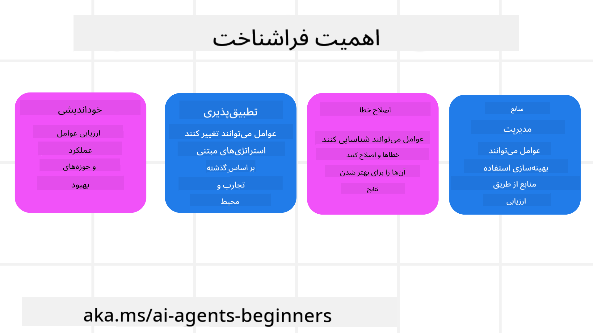
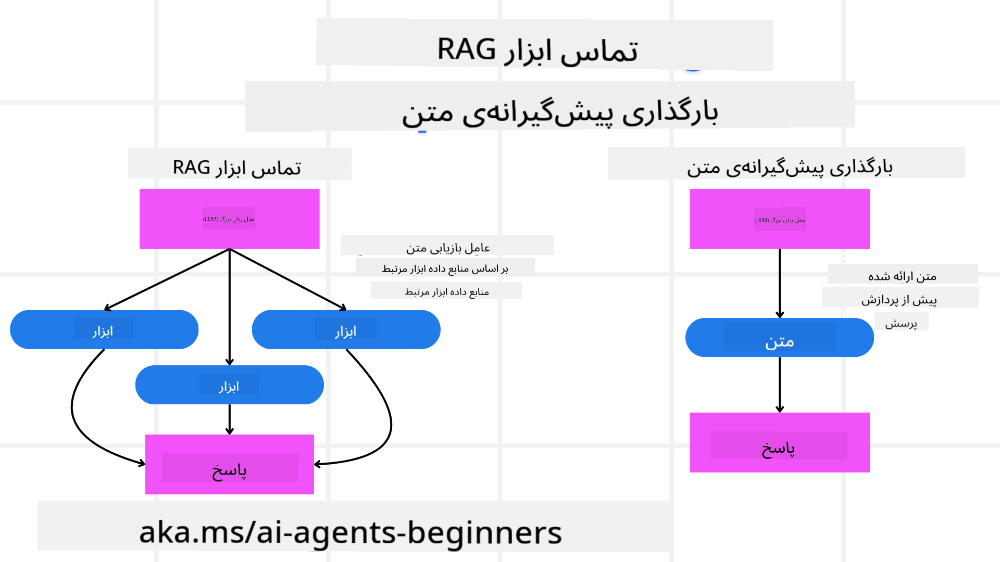

<!--
CO_OP_TRANSLATOR_METADATA:
{
  "original_hash": "3171ed887315c3ddeaccf966e40e9a50",
  "translation_date": "2025-03-28T09:42:22+00:00",
  "source_file": "09-metacognition\\README.md",
  "language_code": "fa"
}
-->
[](https://youtu.be/His9R6gw6Ec?si=3_RMb8VprNvdLRhX)

> _(برای مشاهده ویدئوی این درس، روی تصویر بالا کلیک کنید)_

# فراشناخت در عوامل هوش مصنوعی

## مقدمه

به درس فراشناخت در عوامل هوش مصنوعی خوش آمدید! این فصل برای مبتدیانی طراحی شده است که کنجکاوند بدانند چگونه عوامل هوش مصنوعی می‌توانند درباره فرآیندهای فکری خود فکر کنند. در پایان این درس، مفاهیم کلیدی را درک خواهید کرد و با مثال‌های عملی برای استفاده از فراشناخت در طراحی عوامل هوش مصنوعی مجهز خواهید شد.

## اهداف یادگیری

پس از اتمام این درس، قادر خواهید بود:

1. پیامدهای حلقه‌های استدلال در تعریف عوامل را درک کنید.
2. از تکنیک‌های برنامه‌ریزی و ارزیابی برای کمک به عوامل خوداصلاح‌گر استفاده کنید.
3. عوامل خود را ایجاد کنید که بتوانند کد را برای انجام وظایف دستکاری کنند.

## معرفی به فراشناخت

فراشناخت به فرآیندهای شناختی سطح بالاتری اشاره دارد که شامل فکر کردن درباره تفکر خود است. برای عوامل هوش مصنوعی، این به معنای توانایی ارزیابی و تنظیم اقدامات بر اساس خودآگاهی و تجربیات گذشته است. فراشناخت یا "فکر کردن درباره تفکر" یک مفهوم مهم در توسعه سیستم‌های هوش مصنوعی عاملی است. این شامل آگاهی سیستم‌های هوش مصنوعی از فرآیندهای داخلی خود و توانایی نظارت، تنظیم و تطبیق رفتارشان است.

مانند وقتی که ما "فضا را می‌خوانیم" یا به یک مسئله نگاه می‌کنیم. این خودآگاهی می‌تواند به سیستم‌های هوش مصنوعی کمک کند تصمیمات بهتری بگیرند، خطاها را شناسایی کنند و عملکرد خود را با گذشت زمان بهبود بخشند - و دوباره ما را به آزمون تورینگ و بحث در مورد اینکه آیا هوش مصنوعی جهان را تسخیر خواهد کرد، بازمی‌گرداند.

در زمینه سیستم‌های هوش مصنوعی عاملی، فراشناخت می‌تواند به چالش‌های متعددی کمک کند، از جمله:

- **شفافیت**: اطمینان از اینکه سیستم‌های هوش مصنوعی می‌توانند استدلال و تصمیمات خود را توضیح دهند.
- **استدلال**: افزایش توانایی سیستم‌های هوش مصنوعی برای ترکیب اطلاعات و گرفتن تصمیمات منطقی.
- **تطبیق‌پذیری**: اجازه دادن به سیستم‌های هوش مصنوعی برای تطبیق با محیط‌های جدید و شرایط در حال تغییر.
- **ادراک**: بهبود دقت سیستم‌های هوش مصنوعی در تشخیص و تفسیر داده‌ها از محیطشان.

### فراشناخت چیست؟

فراشناخت یا "فکر کردن درباره تفکر" یک فرآیند شناختی سطح بالاست که شامل خودآگاهی و خودتنظیمی فرآیندهای شناختی فرد است. در حوزه هوش مصنوعی، فراشناخت به عوامل اجازه می‌دهد تا استراتژی‌ها و اقدامات خود را ارزیابی و تطبیق دهند، که منجر به بهبود توانایی‌های حل مسئله و تصمیم‌گیری می‌شود. با درک فراشناخت، می‌توانید عوامل هوش مصنوعی طراحی کنید که نه تنها هوشمندتر، بلکه تطبیق‌پذیرتر و کارآمدتر نیز باشند.

در فراشناخت واقعی، شما مشاهده می‌کنید که هوش مصنوعی به‌طور صریح درباره استدلال خود فکر می‌کند. مثال: "من پروازهای ارزان‌تر را اولویت دادم چون... ممکن است پروازهای مستقیم را از دست بدهم، پس اجازه بدهید دوباره بررسی کنم." پیگیری اینکه چگونه یا چرا یک مسیر خاص را انتخاب کرده است.

- توجه به اینکه اشتباهاتی مرتکب شده چون بیش از حد به ترجیحات کاربر از دفعه قبل تکیه کرده، بنابراین استراتژی تصمیم‌گیری خود را تغییر می‌دهد، نه فقط پیشنهاد نهایی.
- تشخیص الگوهایی مانند: "هر وقت کاربر از 'خیلی شلوغ' صحبت می‌کند، نباید فقط برخی جاذبه‌ها را حذف کنم، بلکه باید بازتاب کنم که روش من برای انتخاب 'جاذبه‌های برتر' ناقص است اگر همیشه بر اساس محبوبیت رتبه‌بندی کنم."

### اهمیت فراشناخت در عوامل هوش مصنوعی

فراشناخت نقش حیاتی در طراحی عوامل هوش مصنوعی دارد، به دلایل زیر:



- **خودبازتابی**: عوامل می‌توانند عملکرد خود را ارزیابی کرده و حوزه‌های نیازمند بهبود را شناسایی کنند.
- **تطبیق‌پذیری**: عوامل می‌توانند استراتژی‌های خود را بر اساس تجربیات گذشته و محیط‌های در حال تغییر تغییر دهند.
- **تصحیح خطا**: عوامل می‌توانند به‌طور خودکار خطاها را شناسایی و تصحیح کنند، که منجر به نتایج دقیق‌تر می‌شود.
- **مدیریت منابع**: عوامل می‌توانند استفاده از منابع، مانند زمان و توان محاسباتی، را با برنامه‌ریزی و ارزیابی اقدامات خود بهینه کنند.

## اجزای یک عامل هوش مصنوعی

پیش از ورود به فرآیندهای فراشناختی، درک اجزای پایه‌ای یک عامل هوش مصنوعی ضروری است. یک عامل هوش مصنوعی معمولاً شامل موارد زیر است:

- **شخصیت**: شخصیت و ویژگی‌های عامل که نحوه تعامل آن با کاربران را تعریف می‌کند.
- **ابزارها**: قابلیت‌ها و عملکردهایی که عامل می‌تواند انجام دهد.
- **مهارت‌ها**: دانش و تخصصی که عامل دارد.

این اجزا با هم یک "واحد تخصصی" ایجاد می‌کنند که می‌تواند وظایف خاصی را انجام دهد.

**مثال**: یک عامل سفر را در نظر بگیرید، خدماتی که نه تنها تعطیلات شما را برنامه‌ریزی می‌کند بلکه مسیر خود را بر اساس داده‌های لحظه‌ای و تجربیات قبلی مشتری تنظیم می‌کند.

### مثال: فراشناخت در یک سرویس عامل سفر

تصور کنید در حال طراحی یک سرویس عامل سفر مبتنی بر هوش مصنوعی هستید. این عامل، "عامل سفر"، به کاربران در برنامه‌ریزی تعطیلاتشان کمک می‌کند. برای گنجاندن فراشناخت، عامل سفر باید اقدامات خود را بر اساس خودآگاهی و تجربیات گذشته ارزیابی و تنظیم کند.

#### وظیفه فعلی

وظیفه فعلی کمک به کاربر برای برنامه‌ریزی یک سفر به پاریس است.

#### مراحل انجام وظیفه

1. **جمع‌آوری ترجیحات کاربر**: از کاربر در مورد تاریخ‌های سفر، بودجه، علایق (مانند موزه‌ها، غذا، خرید) و هر نیاز خاصی سؤال کنید.
2. **بازیابی اطلاعات**: جستجو برای گزینه‌های پرواز، اقامتگاه‌ها، جاذبه‌ها و رستوران‌هایی که با ترجیحات کاربر مطابقت دارند.
3. **ایجاد پیشنهادات**: یک برنامه سفر شخصی‌سازی شده با جزئیات پرواز، رزرو هتل و فعالیت‌های پیشنهادی ارائه دهید.
4. **تنظیم بر اساس بازخورد**: از کاربر بازخورد بگیرید و تنظیمات لازم را انجام دهید.

#### منابع مورد نیاز

- دسترسی به پایگاه‌های داده رزرو پرواز و هتل.
- اطلاعات در مورد جاذبه‌ها و رستوران‌های پاریس.
- داده‌های بازخورد کاربران از تعاملات قبلی.

#### تجربه و خودبازتابی

عامل سفر از فراشناخت برای ارزیابی عملکرد خود و یادگیری از تجربیات گذشته استفاده می‌کند. برای مثال:

1. **تحلیل بازخورد کاربر**: عامل سفر بازخورد کاربر را بررسی می‌کند تا مشخص کند کدام پیشنهادات مورد پسند قرار گرفته و کدام‌ها نه. بر این اساس پیشنهادات آینده را تنظیم می‌کند.
2. **تطبیق‌پذیری**: اگر کاربر قبلاً از مکان‌های شلوغ خوشش نمی‌آمده، عامل سفر در آینده از توصیه مکان‌های توریستی محبوب در ساعات اوج خودداری می‌کند.
3. **تصحیح خطا**: اگر عامل سفر در یک رزرو قبلی اشتباهی مرتکب شده باشد، مانند پیشنهاد یک هتل که پر بوده، یاد می‌گیرد که قبل از ارائه پیشنهادات، موجودی را با دقت بیشتری بررسی کند.

#### مثال عملی برای توسعه‌دهندگان

در اینجا یک مثال ساده از نحوه کدنویسی عامل سفر با گنجاندن فراشناخت آورده شده است:

```python
class Travel_Agent:
    def __init__(self):
        self.user_preferences = {}
        self.experience_data = []

    def gather_preferences(self, preferences):
        self.user_preferences = preferences

    def retrieve_information(self):
        # Search for flights, hotels, and attractions based on preferences
        flights = search_flights(self.user_preferences)
        hotels = search_hotels(self.user_preferences)
        attractions = search_attractions(self.user_preferences)
        return flights, hotels, attractions

    def generate_recommendations(self):
        flights, hotels, attractions = self.retrieve_information()
        itinerary = create_itinerary(flights, hotels, attractions)
        return itinerary

    def adjust_based_on_feedback(self, feedback):
        self.experience_data.append(feedback)
        # Analyze feedback and adjust future recommendations
        self.user_preferences = adjust_preferences(self.user_preferences, feedback)

# Example usage
travel_agent = Travel_Agent()
preferences = {
    "destination": "Paris",
    "dates": "2025-04-01 to 2025-04-10",
    "budget": "moderate",
    "interests": ["museums", "cuisine"]
}
travel_agent.gather_preferences(preferences)
itinerary = travel_agent.generate_recommendations()
print("Suggested Itinerary:", itinerary)
feedback = {"liked": ["Louvre Museum"], "disliked": ["Eiffel Tower (too crowded)"]}
travel_agent.adjust_based_on_feedback(feedback)
```

#### چرا فراشناخت مهم است؟

- **خودبازتابی**: عوامل می‌توانند عملکرد خود را تحلیل کرده و حوزه‌های نیازمند بهبود را شناسایی کنند.
- **تطبیق‌پذیری**: عوامل می‌توانند استراتژی‌های خود را بر اساس بازخورد و شرایط در حال تغییر تنظیم کنند.
- **تصحیح خطا**: عوامل می‌توانند به‌طور خودکار اشتباهات را شناسایی و تصحیح کنند.
- **مدیریت منابع**: عوامل می‌توانند استفاده از منابع را بهینه کنند، مانند زمان و توان محاسباتی.

با گنجاندن فراشناخت، عامل سفر می‌تواند توصیه‌های سفر شخصی‌تر و دقیق‌تری ارائه دهد و تجربه کلی کاربر را بهبود بخشد.

---

## 2. برنامه‌ریزی در عوامل

برنامه‌ریزی یک جزء حیاتی از رفتار عامل هوش مصنوعی است. این شامل ترسیم مراحل لازم برای دستیابی به یک هدف، با در نظر گرفتن وضعیت فعلی، منابع و موانع ممکن است.

### عناصر برنامه‌ریزی

- **وظیفه فعلی**: وظیفه را به وضوح تعریف کنید.
- **مراحل انجام وظیفه**: وظیفه را به مراحل قابل مدیریت تقسیم کنید.
- **منابع مورد نیاز**: منابع ضروری را شناسایی کنید.
- **تجربه**: از تجربیات گذشته برای اطلاع‌رسانی برنامه‌ریزی استفاده کنید.

**مثال**: در اینجا مراحلی که عامل سفر باید برای کمک به یک کاربر در برنامه‌ریزی سفرش انجام دهد آورده شده است:

### مراحل برای عامل سفر

1. **جمع‌آوری ترجیحات کاربر**

   - از کاربر درباره تاریخ‌های سفر، بودجه، علایق و هر نیاز خاصی سؤال کنید.
   - مثال‌ها: "چه زمانی قصد سفر دارید؟" "محدوده بودجه شما چقدر است؟" "در تعطیلات از چه فعالیت‌هایی لذت می‌برید؟"

2. **بازیابی اطلاعات**

   - جستجو برای گزینه‌های سفر مرتبط بر اساس ترجیحات کاربر.
   - **پروازها**: جستجو برای پروازهای موجود در محدوده بودجه و تاریخ‌های ترجیحی کاربر.
   - **اقامتگاه‌ها**: یافتن هتل‌ها یا املاک اجاره‌ای که با ترجیحات کاربر برای مکان، قیمت و امکانات مطابقت دارند.
   - **جاذبه‌ها و رستوران‌ها**: شناسایی جاذبه‌های محبوب، فعالیت‌ها و گزینه‌های غذاخوری که با علایق کاربر همخوانی دارند.

3. **ایجاد پیشنهادات**

   - اطلاعات بازیابی شده را در یک برنامه سفر شخصی‌سازی شده ترکیب کنید.
   - جزئیاتی مانند گزینه‌های پرواز، رزرو هتل و فعالیت‌های پیشنهادی را ارائه دهید و مطمئن شوید که پیشنهادات مطابق با ترجیحات کاربر باشند.

4. **ارائه برنامه سفر به کاربر**

   - برنامه سفر پیشنهادی را برای بررسی با کاربر به اشتراک بگذارید.
   - مثال: "این یک برنامه سفر پیشنهادی برای سفر شما به پاریس است. شامل جزئیات پرواز، رزرو هتل و لیستی از فعالیت‌ها و رستوران‌های پیشنهادی است. نظرتان چیست؟"

5. **جمع‌آوری بازخورد**

   - از کاربر بازخورد درباره برنامه سفر پیشنهادی بخواهید.
   - مثال‌ها: "آیا گزینه‌های پرواز را دوست دارید؟" "آیا هتل برای نیازهای شما مناسب است؟" "آیا فعالیت‌هایی هست که بخواهید اضافه یا حذف کنید؟"

6. **تنظیم بر اساس بازخورد**

   - برنامه سفر را بر اساس بازخورد کاربر اصلاح کنید.
   - تغییرات لازم در پیشنهادات پرواز، اقامتگاه و فعالیت‌ها را انجام دهید تا بهتر با ترجیحات کاربر مطابقت داشته باشد.

7. **تأیید نهایی**

   - برنامه سفر به‌روزشده را برای تأیید نهایی به کاربر ارائه دهید.
   - مثال: "بر اساس بازخورد شما، تنظیماتی انجام داده‌ام. این برنامه سفر به‌روزشده است. آیا همه چیز خوب به نظر می‌رسد؟"

8. **رزرو و تأیید نهایی**

   - پس از تأیید کاربر، به رزرو پروازها، اقامتگاه‌ها و هر فعالیت برنامه‌ریزی‌شده بپردازید.
   - جزئیات تأییدیه را به کاربر ارسال کنید.

9. **ارائه پشتیبانی مداوم**

   - آماده باشید تا در صورت نیاز، تغییرات یا درخواست‌های اضافی را قبل و در طول سفر انجام دهید.
   - مثال: "اگر در طول سفر به کمک بیشتری نیاز داشتید، در هر زمان با من تماس بگیرید!"

### مثال تعامل

```python
class Travel_Agent:
    def __init__(self):
        self.user_preferences = {}
        self.experience_data = []

    def gather_preferences(self, preferences):
        self.user_preferences = preferences

    def retrieve_information(self):
        flights = search_flights(self.user_preferences)
        hotels = search_hotels(self.user_preferences)
        attractions = search_attractions(self.user_preferences)
        return flights, hotels, attractions

    def generate_recommendations(self):
        flights, hotels, attractions = self.retrieve_information()
        itinerary = create_itinerary(flights, hotels, attractions)
        return itinerary

    def adjust_based_on_feedback(self, feedback):
        self.experience_data.append(feedback)
        self.user_preferences = adjust_preferences(self.user_preferences, feedback)

# Example usage within a booing request
travel_agent = Travel_Agent()
preferences = {
    "destination": "Paris",
    "dates": "2025-04-01 to 2025-04-10",
    "budget": "moderate",
    "interests": ["museums", "cuisine"]
}
travel_agent.gather_preferences(preferences)
itinerary = travel_agent.generate_recommendations()
print("Suggested Itinerary:", itinerary)
feedback = {"liked": ["Louvre Museum"], "disliked": ["Eiffel Tower (too crowded)"]}
travel_agent.adjust_based_on_feedback(feedback)
```

## 3. سیستم اصلاحی RAG

ابتدا بیایید تفاوت بین ابزار RAG و بارگذاری پیش‌گیرانه کانتکست را بررسی کنیم.



### تولید تقویت‌شده با بازیابی (RAG)

RAG یک سیستم بازیابی را با یک مدل تولیدی ترکیب می‌کند. وقتی یک درخواست ارائه می‌شود، سیستم بازیابی اسناد یا داده‌های مرتبط را از یک منبع خارجی دریافت می‌کند و این اطلاعات بازیابی‌شده برای تقویت ورودی مدل تولیدی استفاده می‌شود. این امر به مدل کمک می‌کند پاسخ‌های دقیق‌تر و مرتبط‌تر تولید کند.

در یک سیستم RAG، عامل اطلاعات مرتبط را از یک پایگاه دانش بازیابی کرده و از آن برای تولید پاسخ‌ها یا اقدامات مناسب استفاده می‌کند.

### رویکرد اصلاحی RAG

رویکرد اصلاحی RAG بر استفاده از تکنیک‌های RAG برای تصحیح خطاها و بهبود دقت عوامل هوش مصنوعی تمرکز دارد. این شامل موارد زیر است:

1. **تکنیک‌های پرامپتینگ**: استفاده از پرامپت‌های خاص برای راهنمایی عامل در بازیابی اطلاعات مرتبط.
2. **ابزارها**: پیاده‌سازی الگوریتم‌ها و مکانیزم‌هایی که به عامل اجازه می‌دهند مرتبط بودن اطلاعات بازیابی‌شده را ارزیابی کرده و پاسخ‌های دقیق تولید کنند.
3. **ارزیابی**: ارزیابی مستمر عملکرد عامل و انجام تنظیمات برای بهبود دقت و کارایی.
مثال: RAG اصلاحی در یک عامل جستجو  
در نظر بگیرید یک عامل جستجو اطلاعات را از وب بازیابی می‌کند تا به پرسش‌های کاربران پاسخ دهد. رویکرد RAG اصلاحی ممکن است شامل موارد زیر باشد:  
1. **تکنیک درخواست**: فرموله کردن پرسش‌های جستجو بر اساس ورودی کاربر.  
2. **ابزار**: استفاده از پردازش زبان طبیعی و الگوریتم‌های یادگیری ماشین برای رتبه‌بندی و فیلتر کردن نتایج جستجو.  
3. **ارزیابی**: تحلیل بازخورد کاربران برای شناسایی و اصلاح نواقص در اطلاعات بازیابی شده.  

### RAG اصلاحی در عامل سفر  
RAG اصلاحی (تولید تقویت‌شده با بازیابی) توانایی هوش مصنوعی را در بازیابی و تولید اطلاعات همراه با اصلاح نواقص افزایش می‌دهد. بیایید ببینیم عامل سفر چگونه می‌تواند از رویکرد RAG اصلاحی برای ارائه توصیه‌های سفر دقیق‌تر و مرتبط‌تر استفاده کند. این شامل موارد زیر است:  
- **تکنیک درخواست**: استفاده از درخواست‌های خاص برای هدایت عامل در بازیابی اطلاعات مرتبط.  
- **ابزار**: پیاده‌سازی الگوریتم‌ها و مکانیسم‌هایی که به عامل امکان ارزیابی مرتبط بودن اطلاعات بازیابی شده و تولید پاسخ‌های دقیق را می‌دهند.  
- **ارزیابی**: ارزیابی مداوم عملکرد عامل و ایجاد تنظیمات برای بهبود دقت و کارایی آن.  

#### مراحل پیاده‌سازی RAG اصلاحی در عامل سفر  
1. **تعامل اولیه با کاربر**  
   - عامل سفر ترجیحات اولیه کاربر را جمع‌آوری می‌کند، مانند مقصد، تاریخ‌های سفر، بودجه و علاقه‌ها.  
   - مثال: ```python
     preferences = {
         "destination": "Paris",
         "dates": "2025-04-01 to 2025-04-10",
         "budget": "moderate",
         "interests": ["museums", "cuisine"]
     }
     ```  

2. **بازیابی اطلاعات**  
   - عامل سفر اطلاعات مربوط به پروازها، اقامتگاه‌ها، جاذبه‌ها و رستوران‌ها را بر اساس ترجیحات کاربر بازیابی می‌کند.  
   - مثال: ```python
     flights = search_flights(preferences)
     hotels = search_hotels(preferences)
     attractions = search_attractions(preferences)
     ```  

3. **تولید توصیه‌های اولیه**  
   - عامل سفر از اطلاعات بازیابی شده برای تولید یک برنامه سفر شخصی‌سازی‌شده استفاده می‌کند.  
   - مثال: ```python
     itinerary = create_itinerary(flights, hotels, attractions)
     print("Suggested Itinerary:", itinerary)
     ```  

4. **جمع‌آوری بازخورد کاربر**  
   - عامل سفر از کاربر بازخوردی در مورد توصیه‌های اولیه می‌گیرد.  
   - مثال: ```python
     feedback = {
         "liked": ["Louvre Museum"],
         "disliked": ["Eiffel Tower (too crowded)"]
     }
     ```  

5. **فرآیند RAG اصلاحی**  
   - **تکنیک درخواست**: عامل سفر بر اساس بازخورد کاربر پرسش‌های جستجوی جدیدی فرموله می‌کند.  
     - مثال: ```python
       if "disliked" in feedback:
           preferences["avoid"] = feedback["disliked"]
       ```  
   - **ابزار**: عامل سفر از الگوریتم‌ها برای رتبه‌بندی و فیلتر کردن نتایج جستجوی جدید، با تاکید بر مرتبط بودن بر اساس بازخورد کاربر استفاده می‌کند.  
     - مثال: ```python
       new_attractions = search_attractions(preferences)
       new_itinerary = create_itinerary(flights, hotels, new_attractions)
       print("Updated Itinerary:", new_itinerary)
       ```  
   - **ارزیابی**: عامل سفر مرتبط بودن و دقت توصیه‌های خود را به طور مداوم با تحلیل بازخورد کاربر ارزیابی کرده و تنظیمات لازم را انجام می‌دهد.  
     - مثال: ```python
       def adjust_preferences(preferences, feedback):
           if "liked" in feedback:
               preferences["favorites"] = feedback["liked"]
           if "disliked" in feedback:
               preferences["avoid"] = feedback["disliked"]
           return preferences

       preferences = adjust_preferences(preferences, feedback)
       ```  

#### مثال عملی  
در اینجا یک مثال ساده کد پایتون که رویکرد RAG اصلاحی را در عامل سفر پیاده‌سازی می‌کند آورده شده است:  
```python
class Travel_Agent:
    def __init__(self):
        self.user_preferences = {}
        self.experience_data = []

    def gather_preferences(self, preferences):
        self.user_preferences = preferences

    def retrieve_information(self):
        flights = search_flights(self.user_preferences)
        hotels = search_hotels(self.user_preferences)
        attractions = search_attractions(self.user_preferences)
        return flights, hotels, attractions

    def generate_recommendations(self):
        flights, hotels, attractions = self.retrieve_information()
        itinerary = create_itinerary(flights, hotels, attractions)
        return itinerary

    def adjust_based_on_feedback(self, feedback):
        self.experience_data.append(feedback)
        self.user_preferences = adjust_preferences(self.user_preferences, feedback)
        new_itinerary = self.generate_recommendations()
        return new_itinerary

# Example usage
travel_agent = Travel_Agent()
preferences = {
    "destination": "Paris",
    "dates": "2025-04-01 to 2025-04-10",
    "budget": "moderate",
    "interests": ["museums", "cuisine"]
}
travel_agent.gather_preferences(preferences)
itinerary = travel_agent.generate_recommendations()
print("Suggested Itinerary:", itinerary)
feedback = {"liked": ["Louvre Museum"], "disliked": ["Eiffel Tower (too crowded)"]}
new_itinerary = travel_agent.adjust_based_on_feedback(feedback)
print("Updated Itinerary:", new_itinerary)
```  

### بارگذاری پیش‌گیرانه زمینه  
بارگذاری پیش‌گیرانه زمینه شامل بارگذاری اطلاعات زمینه یا پس‌زمینه مرتبط در مدل قبل از پردازش یک پرسش است. این به این معناست که مدل از ابتدا به این اطلاعات دسترسی دارد، که می‌تواند به تولید پاسخ‌های آگاهانه‌تر بدون نیاز به بازیابی داده‌های اضافی در طول فرآیند کمک کند.  

در اینجا یک مثال ساده از نحوه بارگذاری پیش‌گیرانه زمینه برای یک برنامه عامل سفر در پایتون آورده شده است:  
```python
class TravelAgent:
    def __init__(self):
        # Pre-load popular destinations and their information
        self.context = {
            "Paris": {"country": "France", "currency": "Euro", "language": "French", "attractions": ["Eiffel Tower", "Louvre Museum"]},
            "Tokyo": {"country": "Japan", "currency": "Yen", "language": "Japanese", "attractions": ["Tokyo Tower", "Shibuya Crossing"]},
            "New York": {"country": "USA", "currency": "Dollar", "language": "English", "attractions": ["Statue of Liberty", "Times Square"]},
            "Sydney": {"country": "Australia", "currency": "Dollar", "language": "English", "attractions": ["Sydney Opera House", "Bondi Beach"]}
        }

    def get_destination_info(self, destination):
        # Fetch destination information from pre-loaded context
        info = self.context.get(destination)
        if info:
            return f"{destination}:\nCountry: {info['country']}\nCurrency: {info['currency']}\nLanguage: {info['language']}\nAttractions: {', '.join(info['attractions'])}"
        else:
            return f"Sorry, we don't have information on {destination}."

# Example usage
travel_agent = TravelAgent()
print(travel_agent.get_destination_info("Paris"))
print(travel_agent.get_destination_info("Tokyo"))
```  

#### توضیح  
1. **مقدمه (`__init__` method)**: The `TravelAgent` class pre-loads a dictionary containing information about popular destinations such as Paris, Tokyo, New York, and Sydney. This dictionary includes details like the country, currency, language, and major attractions for each destination.

2. **Retrieving Information (`get_destination_info` method)**: When a user queries about a specific destination, the `get_destination_info` method)**: این متد اطلاعات مرتبط را از دیکشنری زمینه پیش‌بارگذاری شده بازیابی می‌کند. با پیش‌بارگذاری زمینه، برنامه عامل سفر می‌تواند به سرعت به پرسش‌های کاربر پاسخ دهد بدون اینکه نیاز باشد این اطلاعات را در زمان واقعی از منبع خارجی بازیابی کند. این برنامه را کارآمدتر و پاسخگوتر می‌کند.  

### شروع برنامه‌ریزی با یک هدف قبل از تکرار  
شروع برنامه‌ریزی با یک هدف شامل شروع با یک هدف واضح یا نتیجه مطلوب در ذهن است. با تعریف این هدف از ابتدا، مدل می‌تواند از آن به عنوان یک اصل راهنما در طول فرآیند تکرار استفاده کند. این کمک می‌کند که هر تکرار به دستیابی به نتیجه مطلوب نزدیک‌تر شود و فرآیند کارآمدتر و متمرکزتر شود.  

در اینجا یک مثال از نحوه شروع برنامه سفر با یک هدف قبل از تکرار برای یک عامل سفر در پایتون آورده شده است:  

### سناریو  
یک عامل سفر می‌خواهد یک تعطیلات سفارشی برای یک مشتری برنامه‌ریزی کند. هدف ایجاد یک برنامه سفر است که رضایت مشتری را بر اساس ترجیحات و بودجه او به حداکثر برساند.  

### مراحل  
1. ترجیحات و بودجه مشتری را تعریف کنید.  
2. برنامه اولیه را بر اساس این ترجیحات شروع کنید.  
3. برای بهبود برنامه، تکرار کنید و رضایت مشتری را بهینه کنید.  

#### کد پایتون  
```python
class TravelAgent:
    def __init__(self, destinations):
        self.destinations = destinations

    def bootstrap_plan(self, preferences, budget):
        plan = []
        total_cost = 0

        for destination in self.destinations:
            if total_cost + destination['cost'] <= budget and self.match_preferences(destination, preferences):
                plan.append(destination)
                total_cost += destination['cost']

        return plan

    def match_preferences(self, destination, preferences):
        for key, value in preferences.items():
            if destination.get(key) != value:
                return False
        return True

    def iterate_plan(self, plan, preferences, budget):
        for i in range(len(plan)):
            for destination in self.destinations:
                if destination not in plan and self.match_preferences(destination, preferences) and self.calculate_cost(plan, destination) <= budget:
                    plan[i] = destination
                    break
        return plan

    def calculate_cost(self, plan, new_destination):
        return sum(destination['cost'] for destination in plan) + new_destination['cost']

# Example usage
destinations = [
    {"name": "Paris", "cost": 1000, "activity": "sightseeing"},
    {"name": "Tokyo", "cost": 1200, "activity": "shopping"},
    {"name": "New York", "cost": 900, "activity": "sightseeing"},
    {"name": "Sydney", "cost": 1100, "activity": "beach"},
]

preferences = {"activity": "sightseeing"}
budget = 2000

travel_agent = TravelAgent(destinations)
initial_plan = travel_agent.bootstrap_plan(preferences, budget)
print("Initial Plan:", initial_plan)

refined_plan = travel_agent.iterate_plan(initial_plan, preferences, budget)
print("Refined Plan:", refined_plan)
```  

#### توضیح کد  
1. **مقدمه (`__init__` method)**: The `TravelAgent` class is initialized with a list of potential destinations, each having attributes like name, cost, and activity type.

2. **Bootstrapping the Plan (`bootstrap_plan` method)**: This method creates an initial travel plan based on the client's preferences and budget. It iterates through the list of destinations and adds them to the plan if they match the client's preferences and fit within the budget.

3. **Matching Preferences (`match_preferences` method)**: This method checks if a destination matches the client's preferences.

4. **Iterating the Plan (`iterate_plan` method)**: This method refines the initial plan by trying to replace each destination in the plan with a better match, considering the client's preferences and budget constraints.

5. **Calculating Cost (`calculate_cost` method)**: این متد هزینه کل برنامه فعلی، از جمله یک مقصد جدید بالقوه را محاسبه می‌کند.  

#### مثال استفاده  
- **برنامه اولیه**: عامل سفر یک برنامه اولیه بر اساس ترجیحات مشتری برای بازدید از اماکن دیدنی و بودجه ۲۰۰۰ دلار ایجاد می‌کند.  
- **برنامه اصلاح‌شده**: عامل سفر برنامه را تکرار کرده و ترجیحات و بودجه مشتری را بهینه می‌کند.  

با شروع برنامه با یک هدف واضح (مانند به حداکثر رساندن رضایت مشتری) و تکرار برای اصلاح برنامه، عامل سفر می‌تواند یک برنامه سفر سفارشی و بهینه برای مشتری ایجاد کند. این رویکرد تضمین می‌کند که برنامه سفر از ابتدا با ترجیحات و بودجه مشتری هم‌خوانی داشته باشد و با هر تکرار بهبود یابد.  

### بهره‌گیری از LLM برای رتبه‌بندی مجدد و امتیازدهی  
مدل‌های زبان بزرگ (LLM) می‌توانند برای رتبه‌بندی مجدد و امتیازدهی با ارزیابی مرتبط بودن و کیفیت اسناد بازیابی شده یا پاسخ‌های تولید شده استفاده شوند.  

در اینجا نحوه کار آن آورده شده است:  
**بازیابی:** مرحله بازیابی اولیه مجموعه‌ای از اسناد یا پاسخ‌های کاندید را بر اساس پرسش بازیابی می‌کند.  
**رتبه‌بندی مجدد:** LLM این کاندیدها را ارزیابی کرده و بر اساس مرتبط بودن و کیفیت آن‌ها رتبه‌بندی مجدد می‌کند. این مرحله تضمین می‌کند که اطلاعات مرتبط و با کیفیت بالا ابتدا ارائه شود.  
**امتیازدهی:** LLM به هر کاندید امتیاز اختصاص می‌دهد که منعکس‌کننده مرتبط بودن و کیفیت آن‌ها است. این به انتخاب بهترین پاسخ یا سند برای کاربر کمک می‌کند.  

با بهره‌گیری از LLM برای رتبه‌بندی مجدد و امتیازدهی، سیستم می‌تواند اطلاعات دقیق‌تر و مرتبط‌تر ارائه دهد و تجربه کلی کاربر را بهبود بخشد.  

در اینجا یک مثال از نحوه استفاده یک عامل سفر از یک مدل زبان بزرگ (LLM) برای رتبه‌بندی مجدد و امتیازدهی مقصدهای سفر بر اساس ترجیحات کاربر در پایتون آورده شده است:  

#### سناریو  
- سفر بر اساس ترجیحات  
یک عامل سفر می‌خواهد بهترین مقصدهای سفر را بر اساس ترجیحات مشتری توصیه کند. LLM به رتبه‌بندی مجدد و امتیازدهی مقصدها کمک می‌کند تا مطمئن شود که مرتبط‌ترین گزینه‌ها ارائه شده‌اند.  

#### مراحل:  
1. جمع‌آوری ترجیحات کاربر.  
2. بازیابی لیستی از مقصدهای سفر بالقوه.  
3. استفاده از LLM برای رتبه‌بندی مجدد و امتیازدهی مقصدها بر اساس ترجیحات کاربر.  

در اینجا نحوه به‌روزرسانی مثال قبلی برای استفاده از خدمات Azure OpenAI آورده شده است:  

#### نیازمندی‌ها  
1. شما باید یک اشتراک Azure داشته باشید.  
2. یک منبع Azure OpenAI ایجاد کنید و کلید API خود را دریافت کنید.  

#### مثال کد پایتون  
```python
import requests
import json

class TravelAgent:
    def __init__(self, destinations):
        self.destinations = destinations

    def get_recommendations(self, preferences, api_key, endpoint):
        # Generate a prompt for the Azure OpenAI
        prompt = self.generate_prompt(preferences)
        
        # Define headers and payload for the request
        headers = {
            'Content-Type': 'application/json',
            'Authorization': f'Bearer {api_key}'
        }
        payload = {
            "prompt": prompt,
            "max_tokens": 150,
            "temperature": 0.7
        }
        
        # Call the Azure OpenAI API to get the re-ranked and scored destinations
        response = requests.post(endpoint, headers=headers, json=payload)
        response_data = response.json()
        
        # Extract and return the recommendations
        recommendations = response_data['choices'][0]['text'].strip().split('\n')
        return recommendations

    def generate_prompt(self, preferences):
        prompt = "Here are the travel destinations ranked and scored based on the following user preferences:\n"
        for key, value in preferences.items():
            prompt += f"{key}: {value}\n"
        prompt += "\nDestinations:\n"
        for destination in self.destinations:
            prompt += f"- {destination['name']}: {destination['description']}\n"
        return prompt

# Example usage
destinations = [
    {"name": "Paris", "description": "City of lights, known for its art, fashion, and culture."},
    {"name": "Tokyo", "description": "Vibrant city, famous for its modernity and traditional temples."},
    {"name": "New York", "description": "The city that never sleeps, with iconic landmarks and diverse culture."},
    {"name": "Sydney", "description": "Beautiful harbour city, known for its opera house and stunning beaches."},
]

preferences = {"activity": "sightseeing", "culture": "diverse"}
api_key = 'your_azure_openai_api_key'
endpoint = 'https://your-endpoint.com/openai/deployments/your-deployment-name/completions?api-version=2022-12-01'

travel_agent = TravelAgent(destinations)
recommendations = travel_agent.get_recommendations(preferences, api_key, endpoint)
print("Recommended Destinations:")
for rec in recommendations:
    print(rec)
```  

#### توضیح کد  
- رزرو ترجیحات  
1. **مقدمه**: `TravelAgent` class is initialized with a list of potential travel destinations, each having attributes like name and description.

2. **Getting Recommendations (`get_recommendations` method)**: This method generates a prompt for the Azure OpenAI service based on the user's preferences and makes an HTTP POST request to the Azure OpenAI API to get re-ranked and scored destinations.

3. **Generating Prompt (`generate_prompt` method)**: This method constructs a prompt for the Azure OpenAI, including the user's preferences and the list of destinations. The prompt guides the model to re-rank and score the destinations based on the provided preferences.

4. **API Call**: The `requests` library is used to make an HTTP POST request to the Azure OpenAI API endpoint. The response contains the re-ranked and scored destinations.

5. **Example Usage**: The travel agent collects user preferences (e.g., interest in sightseeing and diverse culture) and uses the Azure OpenAI service to get re-ranked and scored recommendations for travel destinations.

Make sure to replace `your_azure_openai_api_key` with your actual Azure OpenAI API key and `https://your-endpoint.com/...` با URL نقطه پایانی واقعی استقرار Azure OpenAI خود جایگزین کنید.  

با بهره‌گیری از LLM برای رتبه‌بندی مجدد و امتیازدهی، عامل سفر می‌تواند توصیه‌های سفر شخصی‌تر و مرتبط‌تر به مشتریان ارائه دهد و تجربه کلی آن‌ها را بهبود بخشد.  

### RAG: تکنیک درخواست در مقابل ابزار  
تولید تقویت‌شده با بازیابی (RAG) می‌تواند هم به عنوان یک تکنیک درخواست و هم به عنوان یک ابزار در توسعه عوامل هوش مصنوعی باشد. درک تفاوت بین این دو می‌تواند به شما کمک کند از RAG در پروژه‌های خود به طور مؤثرتری استفاده کنید.  

#### RAG به عنوان یک تکنیک درخواست  
**چیست؟**  
- به عنوان یک تکنیک درخواست، RAG شامل فرموله کردن پرسش‌ها یا درخواست‌های خاص برای هدایت بازیابی اطلاعات مرتبط از یک مجموعه بزرگ یا پایگاه داده است. این اطلاعات سپس برای تولید پاسخ‌ها یا اقدامات استفاده می‌شود.  

**چگونه کار می‌کند:**  
1. **فرموله کردن درخواست‌ها**: ایجاد درخواست‌ها یا پرسش‌های ساختاریافته بر اساس وظیفه مورد نظر یا ورودی کاربر.  
2. **بازیابی اطلاعات**: استفاده از درخواست‌ها برای جستجوی داده‌های مرتبط از یک پایگاه دانش یا مجموعه داده موجود.  
3. **تولید پاسخ**: ترکیب اطلاعات بازیابی شده با مدل‌های تولیدی هوش مصنوعی برای تولید یک پاسخ جامع و منسجم.  

**مثال در عامل سفر**:  
- ورودی کاربر: "می‌خواهم از موزه‌های پاریس دیدن کنم."  
- درخواست: "یافتن بهترین موزه‌های پاریس."  
- اطلاعات بازیابی شده: جزئیات درباره موزه لوور، موزه اورسی، و غیره.  
- پاسخ تولید شده: "در اینجا برخی از بهترین موزه‌های پاریس آورده شده است: موزه لوور، موزه اورسی، و مرکز پمپیدو."  

#### RAG به عنوان یک ابزار  
**چیست؟**  
- به عنوان یک ابزار، RAG یک سیستم یکپارچه است که فرآیند بازیابی و تولید را خودکار می‌کند و پیاده‌سازی قابلیت‌های پیچیده هوش مصنوعی را برای توسعه‌دهندگان آسان‌تر می‌کند، بدون نیاز به ساخت دستی درخواست‌ها برای هر پرسش.  

**چگونه کار می‌کند:**  
1. **یکپارچه‌سازی**: جاسازی RAG در معماری عامل هوش مصنوعی، که به آن امکان مدیریت خودکار وظایف بازیابی و تولید را می‌دهد.  
2. **اتوماسیون**: ابزار کل فرآیند را مدیریت می‌کند، از دریافت ورودی کاربر تا تولید پاسخ نهایی، بدون نیاز به درخواست‌های صریح برای هر مرحله.  
3. **کارایی**: عملکرد عامل را با ساده‌سازی فرآیند بازیابی و تولید افزایش می‌دهد، امکان پاسخ‌های سریع‌تر و دقیق‌تر را فراهم می‌کند.  

**مثال در عامل سفر**:  
- ورودی کاربر: "می‌خواهم از موزه‌های پاریس دیدن کنم."  
- ابزار RAG: اطلاعات مربوط به موزه‌ها را به طور خودکار بازیابی کرده و یک پاسخ تولید می‌کند.  
- پاسخ تولید شده: "در اینجا برخی از بهترین موزه‌های پاریس آورده شده است: موزه لوور، موزه اورسی، و مرکز پمپیدو."  

### مقایسه  
| جنبه | تکنیک درخواست | ابزار |  
|------------------------|-------------------------------------------------------------|-------------------------------------------------------|  
| **دستی در مقابل خودکار**| فرموله کردن دستی درخواست‌ها برای هر پرسش. | فرآیند خودکار برای بازیابی و تولید. |  
| **کنترل** | کنترل بیشتری بر فرآیند بازیابی ارائه می‌دهد. | بازیابی و تولید را ساده و خودکار می‌کند. |  
| **انعطاف‌پذیری** | امکان درخواست‌های سفارشی بر اساس نیازهای خاص را فراهم می‌کند. | کارآمدتر برای پیاده‌سازی‌های در مقیاس بزرگ. |  
| **پیچیدگی** | نیاز به ساخت و تنظیم درخواست‌ها دارد. | آسان‌تر برای یکپارچه‌سازی در معماری عامل هوش مصنوعی. |  

### مثال‌های عملی  
**مثال تکنیک درخواست:**  
```python
def search_museums_in_paris():
    prompt = "Find top museums in Paris"
    search_results = search_web(prompt)
    return search_results

museums = search_museums_in_paris()
print("Top Museums in Paris:", museums)
```  

**مثال ابزار:**  
```python
class Travel_Agent:
    def __init__(self):
        self.rag_tool = RAGTool()

    def get_museums_in_paris(self):
        user_input = "I want to visit museums in Paris."
        response = self.rag_tool.retrieve_and_generate(user_input)
        return response

travel_agent = Travel_Agent()
museums = travel_agent.get_museums_in_paris()
print("Top Museums in Paris:", museums)
```  

### ارزیابی مرتبط بودن  
ارزیابی مرتبط بودن یک جنبه حیاتی از عملکرد عامل هوش مصنوعی است. این اطمینان می‌دهد که اطلاعات بازیابی شده و تولید شده توسط عامل مناسب، دقیق و مفید برای کاربر است. بیایید بررسی کنیم چگونه مرتبط بودن را در عوامل هوش مصنوعی ارزیابی کنیم، شامل مثال‌ها و تکنیک‌های عملی.  

#### مفاهیم کلیدی در ارزیابی مرتبط بودن  
1. **آگاهی از زمینه**:  
   - عامل باید زمینه پرسش کاربر را درک کند تا اطلاعات مرتبط را بازیابی و تولید کند.  
   - مثال: اگر کاربر بپرسد "بهترین رستوران‌ها در پاریس"، عامل باید ترجیحات کاربر مانند نوع غذا و بودجه را در نظر بگیرد.  

2. **دقت**:  
   - اطلاعات ارائه شده توسط عامل باید از نظر واقعی صحیح و به‌روز باشد.  
   - مثال: توصیه رستوران‌هایی که در حال حاضر باز هستند و نظرات خوبی دارند، به جای گزینه‌های قدیمی یا بسته شده.  

3. **قصد کاربر**:  
عامل باید قصد کاربر را از پرسش استخراج کند تا مرتبط‌ترین اطلاعات را ارائه دهد.  
- مثال: اگر کاربر درخواست "هتل‌های اقتصادی" کند، عامل باید گزینه‌های مقرون‌به‌صرفه را اولویت‌بندی کند.  

4. **حلقه بازخورد**:  
- جمع‌آوری و تحلیل مداوم بازخورد کاربران به عامل کمک می‌کند فرآیند ارزیابی مرتبط بودن را بهبود دهد.  
- مثال: استفاده از رتبه‌بندی‌ها و بازخورد کاربران درباره پیشنهادات قبلی برای بهبود پاسخ‌های آینده.  

#### تکنیک‌های عملی برای ارزیابی مرتبط بودن  
1. **امتیازدهی مرتبط بودن**:  
- به هر مورد بازیابی شده بر اساس میزان تطابق با پرسش و ترجیحات کاربر امتیاز مرتبط بودن اختصاص دهید.  
- مثال: ```python
     def relevance_score(item, query):
         score = 0
         if item['category'] in query['interests']:
             score += 1
         if item['price'] <= query['budget']:
             score += 1
         if item['location'] == query['destination']:
             score += 1
         return score
     ```  

2. **فیلتر کردن و رتبه‌بندی**:  
- موارد غیرمرتبط را حذف کنید و موارد باقی‌مانده را بر اساس امتیاز مرتبط بودن رتبه‌بندی کنید.  
- مثال: ```python
     def filter_and_rank(items, query):
         ranked_items = sorted(items, key=lambda item: relevance_score(item, query), reverse=True)
         return ranked_items[:10]  # Return top 10 relevant items
     ```  

3. **پردازش زبان طبیعی (NLP)**:  
- از تکنیک‌های NLP برای فهم پرسش کاربر و بازیابی اطلاعات مرتبط استفاده کنید.  
- مثال: ```python
     def process_query(query):
         # Use NLP to extract key information from the user's query
         processed_query = nlp(query)
         return processed_query
     ```  

4. **ادغام بازخورد کاربر**:  
- بازخورد کاربران درباره پیشنهادات ارائه شده را جمع‌آوری کرده و از آن برای تنظیم ارزیابی‌های مرتبط بودن آینده استفاده کنید.  
- مثال: ```python
     def adjust_based_on_feedback(feedback, items):
         for item in items:
             if item['name'] in feedback['liked']:
                 item['relevance'] += 1
             if item['name'] in feedback['disliked']:
                 item['relevance'] -= 1
         return items
     ```  

#### مثال: ارزیابی مرتبط بودن در عامل سفر  
در اینجا یک مثال عملی از نحوه ارزیابی مرتبط بودن توصیه‌های سفر توسط عامل سفر آمده است: ```python
class Travel_Agent:
    def __init__(self):
        self.user_preferences = {}
        self.experience_data = []

    def gather_preferences(self, preferences):
        self.user_preferences = preferences

    def retrieve_information(self):
        flights = search_flights(self.user_preferences)
        hotels = search_hotels(self.user_preferences)
        attractions = search_attractions(self.user_preferences)
        return flights, hotels, attractions

    def generate_recommendations(self):
        flights, hotels, attractions = self.retrieve_information()
        ranked_hotels = self.filter_and_rank(hotels, self.user_preferences)
        itinerary = create_itinerary(flights, ranked_hotels, attractions)
        return itinerary

    def filter_and_rank(self, items, query):
        ranked_items = sorted(items, key=lambda item: self.relevance_score(item, query), reverse=True)
        return ranked_items[:10]  # Return top 10 relevant items

    def relevance_score(self, item, query):
        score = 0
        if item['category'] in query['interests']:
            score += 1
        if item['price'] <= query['budget']:
            score += 1
        if item['location'] == query['destination']:
            score += 1
        return score

    def adjust_based_on_feedback(self, feedback, items):
        for item in items:
            if item['name'] in feedback['liked']:
                item['relevance'] += 1
            if item['name'] in feedback['disliked']:
                item['relevance'] -= 1
        return items

# Example usage
travel_agent = Travel_Agent()
preferences = {
    "destination": "Paris",
    "dates": "2025-04-01 to 2025-04-10",
    "budget": "moderate",
    "interests": ["museums", "cuisine"]
}
travel_agent.gather_preferences(preferences)
itinerary = travel_agent.generate_recommendations()
print("Suggested Itinerary:", itinerary)
feedback = {"liked": ["Louvre Museum"], "disliked": ["Eiffel Tower (too crowded)"]}
updated_items = travel_agent.adjust_based_on_feedback(feedback, itinerary['hotels'])
print("Updated Itinerary with Feedback:", updated_items)
```  

### جستجو با قصد  
جستجو با قصد شامل فهم و تفسیر هدف یا هدف اساسی پشت پرسش کاربر برای بازیابی و تولید مرتبط‌ترین و مفیدترین اطلاعات است. این رویکرد فراتر از تطابق ساده کلمات کلیدی رفته و بر درک نیازها و زمینه واقعی کاربر تمرکز دارد.  

#### مفاهیم کلیدی در جستجو با قصد  
1. **فهم قصد کاربر**:  
- قصد کاربر را می‌توان به سه نوع اصلی دسته‌بندی کرد: اطلاعاتی، پیمایشی و تراکنشی.  
- **قصد اطلاعاتی**: کاربر به دنبال اطلاعات درباره یک موضوع است (مثلاً "بهترین موزه‌های پاریس کدامند؟").  
- **قصد پیمایشی**: کاربر می‌خواهد به یک وب‌سایت یا صفحه خاص هدایت شود (مثلاً "وب‌سایت رسمی موزه لوور").  
- **قصد تراکنشی**: کاربر قصد انجام تراکنش دارد، مانند رزرو پرواز یا خرید (مثلاً "رزرو پرواز به پاریس").  

2. **آگاهی از زمینه**:  
- تحلیل زمینه پرسش کاربر به شناسایی دقیق قصد او کمک می‌کند. این شامل در نظر گرفتن تعاملات قبلی، ترجیحات کاربر و جزئیات خاص پرسش فعلی است.  

3. **پردازش زبان طبیعی (NLP)**:  
- تکنیک‌های NLP برای فهم و تفسیر پرسش‌های زبان طبیعی ارائه شده توسط کاربران به کار گرفته می‌شوند. این شامل وظایفی مانند شناسایی موجودیت‌ها، تحلیل احساسات و تجزیه پرسش است.  

4. **شخصی‌سازی**:  
- شخصی‌سازی نتایج جستجو بر اساس تاریخچه، ترجیحات و بازخورد کاربر، مرتبط بودن اطلاعات بازیابی شده را افزایش می‌دهد.  

#### مثال عملی: جستجو با قصد در عامل سفر  
بیایید عامل سفر را به عنوان یک مثال ببینیم که چگونه جستجو با قصد می‌تواند اجرا شود.  

1. **جمع‌آوری ترجیحات کاربر** ```python
   class Travel_Agent:
       def __init__(self):
           self.user_preferences = {}

       def gather_preferences(self, preferences):
           self.user_preferences = preferences
   ```  
2. **فهم قصد کاربر** ```python
   def identify_intent(query):
       if "book" in query or "purchase" in query:
           return "transactional"
       elif "website" in query or "official" in query:
           return "navigational"
       else:
           return "informational"
   ```  
3. **آگاهی از زمینه** ```python
   def analyze_context(query, user_history):
       # Combine current query with user history to understand context
       context = {
           "current_query": query,
           "user_history": user_history
       }
       return context
   ```  
4. **جستجو و شخصی‌سازی نتایج** ```python
   def search_with_intent(query, preferences, user_history):
       intent = identify_intent(query)
       context = analyze_context(query, user_history)
       if intent == "informational":
           search_results = search_information(query, preferences)
       elif intent == "navigational":
           search_results = search_navigation(query)
       elif intent == "transactional":
           search_results = search_transaction(query, preferences)
       personalized_results = personalize_results(search_results, user_history)
       return personalized_results

   def search_information(query, preferences):
       # Example search logic for informational intent
       results = search_web(f"best {preferences['interests']} in {preferences['destination']}")
       return results

   def search_navigation(query):
       # Example search logic for navigational intent
       results = search_web(query)
       return results

   def search_transaction(query, preferences):
       # Example search logic for transactional intent
       results = search_web(f"book {query} to {preferences['destination']}")
       return results

   def personalize_results(results, user_history):
       # Example personalization logic
       personalized = [result for result in results if result not in user_history]
       return personalized[:10]  # Return top 10 personalized results
   ```  
5. **استفاده از مثال** ```python
   travel_agent = Travel_Agent()
   preferences = {
       "destination": "Paris",
       "interests": ["museums", "cuisine"]
   }
   travel_agent.gather_preferences(preferences)
   user_history = ["Louvre Museum website", "Book flight to Paris"]
   query = "best museums in Paris"
   results = search_with_intent(query, preferences, user_history)
   print("Search Results:", results)
   ```  

---  

## 4. تولید کد به عنوان یک ابزار  
عامل‌های تولید کد از مدل‌های هوش مصنوعی برای نوشتن و اجرای کد استفاده می‌کنند، مشکلات پیچیده را حل کرده و وظایف را خودکار می‌کنند.  

### عامل‌های تولید کد  
عامل‌های تولید کد از مدل‌های تولیدی هوش مصنوعی برای نوشتن و اجرای کد استفاده می‌کنند. این عامل‌ها می‌توانند مشکلات پیچیده را حل کنند، وظایف را خودکار کنند و با تولید و اجرای کد به زبان‌های مختلف برنامه‌نویسی، اطلاعات ارزشمندی ارائه دهند.  

#### کاربردهای عملی  
1. **تولید خودکار کد**: تولید قطعه‌های کد برای وظایف خاص، مانند تحلیل داده، وب اسکرپینگ یا یادگیری ماشین.  
2. **SQL به عنوان RAG**: استفاده از پرسش‌های SQL برای بازیابی و دستکاری داده‌ها از پایگاه‌های داده.  
3. **حل مسئله**: ایجاد و اجرای کد برای حل مشکلات خاص، مانند بهینه‌سازی الگوریتم‌ها یا تحلیل داده‌ها.  

#### مثال: عامل تولید کد برای تحلیل داده  
تصور کنید که در حال طراحی یک عامل تولید کد هستید. در اینجا نحوه عملکرد آن آمده است:  

1. **وظیفه**: تحلیل یک مجموعه داده برای شناسایی روندها و الگوها.  
2. **مراحل**:  
- بارگذاری مجموعه داده در یک ابزار تحلیل داده.  
- تولید پرسش‌های SQL برای فیلتر کردن و تجمیع داده‌ها.  
- اجرای پرسش‌ها و بازیابی نتایج.  
- استفاده از نتایج برای تولید بصری‌سازی‌ها و بینش‌ها.  

3. **منابع مورد نیاز**: دسترسی به مجموعه داده، ابزارهای تحلیل داده و قابلیت‌های SQL.  
4. **تجربه**: استفاده از نتایج تحلیل‌های قبلی برای بهبود دقت و مرتبط بودن تحلیل‌های آینده.  

### مثال: عامل تولید کد برای عامل سفر  
در این مثال، ما یک عامل تولید کد طراحی می‌کنیم، عامل سفر، برای کمک به کاربران در برنامه‌ریزی سفرشان با تولید و اجرای کد. این عامل می‌تواند وظایفی مانند بازیابی گزینه‌های سفر، فیلتر کردن نتایج و تهیه یک برنامه سفر با استفاده از هوش مصنوعی تولیدی را انجام دهد.  

#### نمای کلی عامل تولید کد  
1. **جمع‌آوری ترجیحات کاربر**: ورودی‌های کاربر مانند مقصد، تاریخ‌های سفر، بودجه و علایق را جمع‌آوری می‌کند.  
2. **تولید کد برای بازیابی داده‌ها**: قطعه‌های کد برای بازیابی داده‌های مربوط به پروازها، هتل‌ها و جاذبه‌ها تولید می‌کند.  
3. **اجرای کد تولید شده**: کد تولید شده را برای بازیابی اطلاعات واقعی اجرا می‌کند.  
4. **تولید برنامه سفر**: داده‌های بازیابی شده را به یک برنامه سفر شخصی‌سازی شده ترکیب می‌کند.  
5. **تنظیم بر اساس بازخورد**: بازخورد کاربر را دریافت کرده و در صورت لزوم کد را دوباره تولید می‌کند تا نتایج را بهبود دهد.  

#### اجرای مرحله به مرحله  
1. **جمع‌آوری ترجیحات کاربر** ```python
   class Travel_Agent:
       def __init__(self):
           self.user_preferences = {}

       def gather_preferences(self, preferences):
           self.user_preferences = preferences
   ```  
2. **تولید کد برای بازیابی داده‌ها** ```python
   def generate_code_to_fetch_data(preferences):
       # Example: Generate code to search for flights based on user preferences
       code = f"""
       def search_flights():
           import requests
           response = requests.get('https://api.example.com/flights', params={preferences})
           return response.json()
       """
       return code

   def generate_code_to_fetch_hotels(preferences):
       # Example: Generate code to search for hotels
       code = f"""
       def search_hotels():
           import requests
           response = requests.get('https://api.example.com/hotels', params={preferences})
           return response.json()
       """
       return code
   ```  
3. **اجرای کد تولید شده** ```python
   def execute_code(code):
       # Execute the generated code using exec
       exec(code)
       result = locals()
       return result

   travel_agent = Travel_Agent()
   preferences = {
       "destination": "Paris",
       "dates": "2025-04-01 to 2025-04-10",
       "budget": "moderate",
       "interests": ["museums", "cuisine"]
   }
   travel_agent.gather_preferences(preferences)
   
   flight_code = generate_code_to_fetch_data(preferences)
   hotel_code = generate_code_to_fetch_hotels(preferences)
   
   flights = execute_code(flight_code)
   hotels = execute_code(hotel_code)

   print("Flight Options:", flights)
   print("Hotel Options:", hotels)
   ```  
4. **تولید برنامه سفر** ```python
   def generate_itinerary(flights, hotels, attractions):
       itinerary = {
           "flights": flights,
           "hotels": hotels,
           "attractions": attractions
       }
       return itinerary

   attractions = search_attractions(preferences)
   itinerary = generate_itinerary(flights, hotels, attractions)
   print("Suggested Itinerary:", itinerary)
   ```  
5. **تنظیم بر اساس بازخورد** ```python
   def adjust_based_on_feedback(feedback, preferences):
       # Adjust preferences based on user feedback
       if "liked" in feedback:
           preferences["favorites"] = feedback["liked"]
       if "disliked" in feedback:
           preferences["avoid"] = feedback["disliked"]
       return preferences

   feedback = {"liked": ["Louvre Museum"], "disliked": ["Eiffel Tower (too crowded)"]}
   updated_preferences = adjust_based_on_feedback(feedback, preferences)
   
   # Regenerate and execute code with updated preferences
   updated_flight_code = generate_code_to_fetch_data(updated_preferences)
   updated_hotel_code = generate_code_to_fetch_hotels(updated_preferences)
   
   updated_flights = execute_code(updated_flight_code)
   updated_hotels = execute_code(updated_hotel_code)
   
   updated_itinerary = generate_itinerary(updated_flights, updated_hotels, attractions)
   print("Updated Itinerary:", updated_itinerary)
   ```  

### استفاده از آگاهی محیطی و استدلال  
بر اساس طرح‌واره جدول می‌توان فرآیند تولید پرسش را با استفاده از آگاهی محیطی و استدلال تقویت کرد. در اینجا مثالی از نحوه انجام این کار آمده است:  

1. **فهم طرح‌واره**: سیستم طرح‌واره جدول را فهمیده و از این اطلاعات برای پایه‌گذاری تولید پرسش استفاده خواهد کرد.  
2. **تنظیم بر اساس بازخورد**: سیستم ترجیحات کاربر را بر اساس بازخورد تنظیم کرده و استدلال می‌کند که کدام فیلدها در طرح‌واره باید به‌روزرسانی شوند.  
3. **تولید و اجرای پرسش‌ها**: سیستم پرسش‌هایی برای بازیابی داده‌های به‌روزرسانی شده پرواز و هتل بر اساس ترجیحات جدید تولید و اجرا می‌کند.  

در اینجا یک مثال به‌روز شده از کد پایتون که این مفاهیم را در بر دارد آمده است: ```python
def adjust_based_on_feedback(feedback, preferences, schema):
    # Adjust preferences based on user feedback
    if "liked" in feedback:
        preferences["favorites"] = feedback["liked"]
    if "disliked" in feedback:
        preferences["avoid"] = feedback["disliked"]
    # Reasoning based on schema to adjust other related preferences
    for field in schema:
        if field in preferences:
            preferences[field] = adjust_based_on_environment(feedback, field, schema)
    return preferences

def adjust_based_on_environment(feedback, field, schema):
    # Custom logic to adjust preferences based on schema and feedback
    if field in feedback["liked"]:
        return schema[field]["positive_adjustment"]
    elif field in feedback["disliked"]:
        return schema[field]["negative_adjustment"]
    return schema[field]["default"]

def generate_code_to_fetch_data(preferences):
    # Generate code to fetch flight data based on updated preferences
    return f"fetch_flights(preferences={preferences})"

def generate_code_to_fetch_hotels(preferences):
    # Generate code to fetch hotel data based on updated preferences
    return f"fetch_hotels(preferences={preferences})"

def execute_code(code):
    # Simulate execution of code and return mock data
    return {"data": f"Executed: {code}"}

def generate_itinerary(flights, hotels, attractions):
    # Generate itinerary based on flights, hotels, and attractions
    return {"flights": flights, "hotels": hotels, "attractions": attractions}

# Example schema
schema = {
    "favorites": {"positive_adjustment": "increase", "negative_adjustment": "decrease", "default": "neutral"},
    "avoid": {"positive_adjustment": "decrease", "negative_adjustment": "increase", "default": "neutral"}
}

# Example usage
preferences = {"favorites": "sightseeing", "avoid": "crowded places"}
feedback = {"liked": ["Louvre Museum"], "disliked": ["Eiffel Tower (too crowded)"]}
updated_preferences = adjust_based_on_feedback(feedback, preferences, schema)

# Regenerate and execute code with updated preferences
updated_flight_code = generate_code_to_fetch_data(updated_preferences)
updated_hotel_code = generate_code_to_fetch_hotels(updated_preferences)

updated_flights = execute_code(updated_flight_code)
updated_hotels = execute_code(updated_hotel_code)

updated_itinerary = generate_itinerary(updated_flights, updated_hotels, feedback["liked"])
print("Updated Itinerary:", updated_itinerary)
```  

#### توضیح - رزرو بر اساس بازخورد  
1. **آگاهی از طرح‌واره**: متد `schema` dictionary defines how preferences should be adjusted based on feedback. It includes fields like `favorites` and `avoid`, with corresponding adjustments.
2. **Adjusting Preferences (`adjust_based_on_feedback` method)**: This method adjusts preferences based on user feedback and the schema.
3. **Environment-Based Adjustments (`adjust_based_on_environment` این تنظیمات را بر اساس طرح‌واره و بازخورد شخصی‌سازی می‌کند.  
4. **تولید و اجرای پرسش‌ها**: سیستم کدی برای بازیابی داده‌های به‌روزرسانی شده پرواز و هتل بر اساس ترجیحات تنظیم شده تولید کرده و اجرای این پرسش‌ها را شبیه‌سازی می‌کند.  
5. **تولید برنامه سفر**: سیستم یک برنامه سفر به‌روزرسانی شده بر اساس داده‌های جدید پرواز، هتل و جاذبه‌ها ایجاد می‌کند.  

با محیط‌آگاه کردن سیستم و استدلال بر اساس طرح‌واره، می‌تواند پرسش‌های دقیق‌تر و مرتبط‌تری تولید کند، که منجر به توصیه‌های بهتر سفر و تجربه‌ای شخصی‌سازی‌شده‌تر برای کاربر می‌شود.  

### استفاده از SQL به عنوان یک تکنیک بازیابی-تقویت تولید (RAG)  
SQL (زبان پرسش ساختاریافته) یک ابزار قدرتمند برای تعامل با پایگاه‌های داده است. هنگامی که به عنوان بخشی از رویکرد بازیابی-تقویت تولید (RAG) استفاده شود، SQL می‌تواند داده‌های مرتبط را از پایگاه‌های داده بازیابی کند تا پاسخ‌ها یا اقدامات در عامل‌های هوش مصنوعی را اطلاع‌رسانی و تولید کند. بیایید بررسی کنیم که چگونه SQL می‌تواند به عنوان یک تکنیک RAG در زمینه عامل سفر استفاده شود.  

#### مفاهیم کلیدی  
1. **تعامل با پایگاه داده**:  
- SQL برای پرسش پایگاه‌های داده، بازیابی اطلاعات مرتبط و دستکاری داده‌ها استفاده می‌شود.  
- مثال: بازیابی جزئیات پرواز، اطلاعات هتل و جاذبه‌ها از یک پایگاه داده سفر.  

2. **ادغام با RAG**:  
- پرسش‌های SQL بر اساس ورودی‌ها و ترجیحات کاربر تولید می‌شوند.  
- داده‌های بازیابی شده سپس برای تولید توصیه‌های شخصی‌سازی شده یا اقدامات استفاده می‌شوند.  

3. **تولید پرسش‌های پویا**:  
- عامل هوش مصنوعی پرسش‌های SQL پویا بر اساس زمینه و نیازهای کاربر تولید می‌کند.  
- مثال: شخصی‌سازی پرسش‌های SQL برای فیلتر کردن نتایج بر اساس بودجه، تاریخ‌ها و علایق.  

#### کاربردها  
- **تولید خودکار کد**: تولید قطعه‌های کد برای وظایف خاص.  
- **SQL به عنوان RAG**: استفاده از پرسش‌های SQL برای دستکاری داده‌ها.  
- **حل مسئله**: ایجاد و اجرای کد برای حل مشکلات.  

**مثال**: یک عامل تحلیل داده:  
1. **وظیفه**: تحلیل یک مجموعه داده برای یافتن روندها.  
2. **مراحل**:  
- بارگذاری مجموعه داده.  
- تولید پرسش‌های SQL برای فیلتر کردن داده‌ها.  
- اجرای پرسش‌ها و بازیابی نتایج.  
- تولید بصری‌سازی‌ها و بینش‌ها.  

3. **منابع**: دسترسی به مجموعه داده، قابلیت‌های SQL.  
4. **تجربه**: استفاده از نتایج گذشته برای بهبود تحلیل‌های آینده.  

#### مثال عملی: استفاده از SQL در عامل سفر  
1. **جمع‌آوری ترجیحات کاربر** ```python
   class Travel_Agent:
       def __init__(self):
           self.user_preferences = {}

       def gather_preferences(self, preferences):
           self.user_preferences = preferences
   ```  
2. **تولید پرسش‌های SQL** ```python
   def generate_sql_query(table, preferences):
       query = f"SELECT * FROM {table} WHERE "
       conditions = []
       for key, value in preferences.items():
           conditions.append(f"{key}='{value}'")
       query += " AND ".join(conditions)
       return query
   ```  
3. **اجرای پرسش‌های SQL** ```python
   import sqlite3

   def execute_sql_query(query, database="travel.db"):
       connection = sqlite3.connect(database)
       cursor = connection.cursor()
       cursor.execute(query)
       results = cursor.fetchall()
       connection.close()
       return results
   ```  
4. **تولید توصیه‌ها** ```python
   def generate_recommendations(preferences):
       flight_query = generate_sql_query("flights", preferences)
       hotel_query = generate_sql_query("hotels", preferences)
       attraction_query = generate_sql_query("attractions", preferences)
       
       flights = execute_sql_query(flight_query)
       hotels = execute_sql_query(hotel_query)
       attractions = execute_sql_query(attraction_query)
       
       itinerary = {
           "flights": flights,
           "hotels": hotels,
           "attractions": attractions
       }
       return itinerary

   travel_agent = Travel_Agent()
   preferences = {
       "destination": "Paris",
       "dates": "2025-04-01 to 2025-04-10",
       "budget": "moderate",
       "interests": ["museums", "cuisine"]
   }
   travel_agent.gather_preferences(preferences)
   itinerary = generate_recommendations(preferences)
   print("Suggested Itinerary:", itinerary)
   ```  

#### مثال پرسش‌های SQL  
1. **پرسش پرواز** ```sql
   SELECT * FROM flights WHERE destination='Paris' AND dates='2025-04-01 to 2025-04-10' AND budget='moderate';
   ```  
2. **پرسش هتل** ```sql
   SELECT * FROM hotels WHERE destination='Paris' AND budget='moderate';
   ```  
3. **پرسش جاذبه‌ها** ```sql
   SELECT * FROM attractions WHERE destination='Paris' AND interests='museums, cuisine';
   ```  

با استفاده از SQL به عنوان بخشی از تکنیک بازیابی-تقویت تولید (RAG)، عامل‌های هوش مصنوعی مانند عامل سفر می‌توانند داده‌های مرتبط را به صورت پویا بازیابی و استفاده کنند تا توصیه‌های دقیق و شخصی‌سازی شده ارائه دهند.  

### مثال فراشناخت  
برای نشان دادن پیاده‌سازی فراشناخت، بیایید یک عامل ساده ایجاد کنیم که *بر فرآیند تصمیم‌گیری خود بازتاب می‌کند* در حالی که یک مشکل را حل می‌کند. برای این مثال، سیستمی ایجاد می‌کنیم که یک عامل تلاش می‌کند انتخاب هتل را بهینه کند، اما سپس استدلال خود را ارزیابی کرده و استراتژی خود را هنگامی که اشتباهات یا انتخاب‌های غیربهینه انجام دهد تنظیم می‌کند.  

#### نحوه نشان دادن فراشناخت:  
1. **تصمیم اولیه**: عامل ارزان‌ترین هتل را انتخاب می‌کند، بدون اینکه تأثیر کیفیت را درک کند.  
2. **بازتاب و ارزیابی**: پس از انتخاب اولیه، عامل بررسی می‌کند که آیا هتل یک انتخاب "بد" بوده است با استفاده از بازخورد کاربر. اگر متوجه شود که کیفیت هتل خیلی پایین بوده است، بر استدلال خود بازتاب می‌کند.  
3. **تنظیم استراتژی**: عامل استراتژی خود را بر اساس بازتاب تنظیم کرده و از "ارزان‌ترین" به "بالاترین کیفیت" تغییر می‌دهد، و در نتیجه فرآیند تصمیم‌گیری خود را در تکرارهای آینده بهبود می‌بخشد.  

در اینجا یک مثال آمده است: ```python
class HotelRecommendationAgent:
    def __init__(self):
        self.previous_choices = []  # Stores the hotels chosen previously
        self.corrected_choices = []  # Stores the corrected choices
        self.recommendation_strategies = ['cheapest', 'highest_quality']  # Available strategies

    def recommend_hotel(self, hotels, strategy):
        """
        Recommend a hotel based on the chosen strategy.
        The strategy can either be 'cheapest' or 'highest_quality'.
        """
        if strategy == 'cheapest':
            recommended = min(hotels, key=lambda x: x['price'])
        elif strategy == 'highest_quality':
            recommended = max(hotels, key=lambda x: x['quality'])
        else:
            recommended = None
        self.previous_choices.append((strategy, recommended))
        return recommended

    def reflect_on_choice(self):
        """
        Reflect on the last choice made and decide if the agent should adjust its strategy.
        The agent considers if the previous choice led to a poor outcome.
        """
        if not self.previous_choices:
            return "No choices made yet."

        last_choice_strategy, last_choice = self.previous_choices[-1]
        # Let's assume we have some user feedback that tells us whether the last choice was good or not
        user_feedback = self.get_user_feedback(last_choice)

        if user_feedback == "bad":
            # Adjust strategy if the previous choice was unsatisfactory
            new_strategy = 'highest_quality' if last_choice_strategy == 'cheapest' else 'cheapest'
            self.corrected_choices.append((new_strategy, last_choice))
            return f"Reflecting on choice. Adjusting strategy to {new_strategy}."
        else:
            return "The choice was good. No need to adjust."

    def get_user_feedback(self, hotel):
        """
        Simulate user feedback based on hotel attributes.
        For simplicity, assume if the hotel is too cheap, the feedback is "bad".
        If the hotel has quality less than 7, feedback is "bad".
        """
        if hotel['price'] < 100 or hotel['quality'] < 7:
            return "bad"
        return "good"

# Simulate a list of hotels (price and quality)
hotels = [
    {'name': 'Budget Inn', 'price': 80, 'quality': 6},
    {'name': 'Comfort Suites', 'price': 120, 'quality': 8},
    {'name': 'Luxury Stay', 'price': 200, 'quality': 9}
]

# Create an agent
agent = HotelRecommendationAgent()

# Step 1: The agent recommends a hotel using the "cheapest" strategy
recommended_hotel = agent.recommend_hotel(hotels, 'cheapest')
print(f"Recommended hotel (cheapest): {recommended_hotel['name']}")

# Step 2: The agent reflects on the choice and adjusts strategy if necessary
reflection_result = agent.reflect_on_choice()
print(reflection_result)

# Step 3: The agent recommends again, this time using the adjusted strategy
adjusted_recommendation = agent.recommend_hotel(hotels, 'highest_quality')
print(f"Adjusted hotel recommendation (highest_quality): {adjusted_recommendation['name']}")
```  

#### توانایی‌های فراشناختی عامل  
نکته کلیدی اینجا توانایی عامل است برای:  
- ارزیابی انتخاب‌های قبلی و فرآیند تصمیم‌گیری خود.  
- تنظیم استراتژی خود بر اساس آن بازتاب، یعنی فراشناخت در عمل.  

این یک شکل ساده از فراشناخت است که در آن سیستم قادر به تنظیم فرآیند استدلال خود بر اساس بازخورد داخلی است.  

### نتیجه‌گیری  
فراشناخت یک ابزار قدرتمند است که می‌تواند به طور قابل توجهی قابلیت‌های عامل‌های هوش مصنوعی را افزایش دهد. با ترکیب فراشناخت
فرآیندها، شما می‌توانید عامل‌هایی طراحی کنید که هوشمندتر، سازگارتر و کارآمدتر باشند. از منابع اضافی استفاده کنید تا دنیای جذاب فراشناخت در عامل‌های هوش مصنوعی را بیشتر کاوش کنید.  
## درس قبلی  
[الگوی طراحی چند عاملی](../08-multi-agent/README.md)  
## درس بعدی  
[عامل‌های هوش مصنوعی در تولید](../10-ai-agents-production/README.md)  

**سلب مسئولیت**:  
این سند با استفاده از سرویس ترجمه هوش مصنوعی [Co-op Translator](https://github.com/Azure/co-op-translator) ترجمه شده است. در حالی که ما تلاش می‌کنیم دقت ترجمه را حفظ کنیم، لطفاً توجه داشته باشید که ترجمه‌های خودکار ممکن است حاوی خطاها یا نادرستی‌هایی باشند. سند اصلی به زبان اصلی باید به عنوان منبع معتبر در نظر گرفته شود. برای اطلاعات حساس، توصیه می‌شود از ترجمه انسانی حرفه‌ای استفاده کنید. ما هیچ مسئولیتی در قبال سوء تفاهم‌ها یا تفسیرهای نادرست ناشی از استفاده از این ترجمه نداریم.