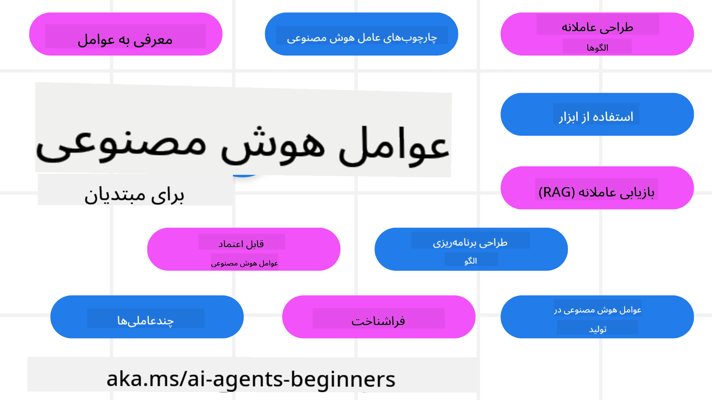

<!--
CO_OP_TRANSLATOR_METADATA:
{
  "original_hash": "9fefa40e18c7568cb137fbbf89ac784d",
  "translation_date": "2025-03-28T09:06:44+00:00",
  "source_file": "README.md",
  "language_code": "fa"
}
-->
# دوره‌ای برای مبتدیان در زمینه عوامل هوش مصنوعی

## ۱۰ درس برای آموزش هر چیزی که برای شروع ساخت عوامل هوش مصنوعی نیاز دارید

  
  
  
  

### پشتیبانی از زبان‌ها
  
  
  
  
  
  
  
  
  
  
  

  
  

## 🌱 شروع به کار

این دوره شامل ۱۰ درس است که اصول اولیه ساخت عوامل هوش مصنوعی را پوشش می‌دهند. هر درس موضوع خاص خود را دارد، بنابراین می‌توانید از هر جایی که دوست دارید شروع کنید!

این دوره از پشتیبانی چندزبانه برخوردار است. برای مشاهده زبان‌های موجود، به [اینجا مراجعه کنید](../..).

اگر اولین بار است که با مدل‌های هوش مصنوعی تولیدی کار می‌کنید، دوره [هوش مصنوعی تولیدی برای مبتدیان](https://aka.ms/genai-beginners) را بررسی کنید که شامل ۲۱ درس در زمینه ساخت با GenAI است.

فراموش نکنید که [این مخزن را ستاره‌دار کنید (🌟)](https://docs.github.com/en/get-started/exploring-projects-on-github/saving-repositories-with-stars?WT.mc_id=academic-105485-koreyst) و [آن را انشعاب دهید](https://github.com/microsoft/ai-agents-for-beginners/fork) تا کد را اجرا کنید.

### موارد مورد نیاز

هر درس در این دوره شامل مثال‌های کدی است که در پوشه code_samples موجود هستند. شما می‌توانید [این مخزن را انشعاب دهید](https://github.com/microsoft/ai-agents-for-beginners/fork) تا نسخه‌ای از آن را برای خود ایجاد کنید.

مثال‌های کد در این تمرین‌ها از Azure AI Foundry و GitHub Model Catalogs برای تعامل با مدل‌های زبان استفاده می‌کنند:

- [مدل‌های GitHub](https://aka.ms/ai-agents-beginners/github-models) - رایگان / محدود  
- [Azure AI Foundry](https://aka.ms/ai-agents-beginners/ai-foundry) - نیازمند حساب Azure  

این دوره همچنین از چارچوب‌ها و خدمات عوامل هوش مصنوعی زیر از Microsoft استفاده می‌کند:

- [خدمات عوامل هوش مصنوعی Azure](https://aka.ms/ai-agents-beginners/ai-agent-service)  
- [Semantic Kernel](https://aka.ms/ai-agents-beginners/semantic-kernel)  
- [AutoGen](https://aka.ms/ai-agents/autogen)  

برای اطلاعات بیشتر درباره اجرای کد این دوره، به [تنظیمات دوره](./00-course-setup/README.md) مراجعه کنید.  

## 🙏 آیا می‌خواهید کمک کنید؟  

آیا پیشنهاد دارید یا خطاهای املایی یا کدی پیدا کرده‌اید؟ [یک مشکل ثبت کنید](https://github.com/microsoft/ai-agents-for-beginners/issues?WT.mc_id=academic-105485-koreyst) یا [یک درخواست تغییر ایجاد کنید](https://github.com/microsoft/ai-agents-for-beginners/pulls?WT.mc_id=academic-105485-koreyst).  

اگر گیر کردید یا سوالی درباره ساخت عامل‌های هوش مصنوعی دارید، به [دیسکورد جامعه هوش مصنوعی آژور](https://discord.gg/kzRShWzttr) بپیوندید.  

## 📂 هر درس شامل  

- یک درس نوشته شده در فایل README و یک ویدئوی کوتاه  
- نمونه‌های کد پایتون که از Azure AI Foundry و مدل‌های گیت‌هاب (رایگان) پشتیبانی می‌کنند  
- لینک‌هایی به منابع اضافی برای ادامه یادگیری  

## 🗃️ درس‌ها  

| **درس**                                   | **متن و کد**                                      | **ویدئو**                                                   | **یادگیری اضافی**                                                                         |  
|-------------------------------------------|--------------------------------------------------|-------------------------------------------------------------|------------------------------------------------------------------------------------------|  
| مقدمه‌ای بر عامل‌های هوش مصنوعی و موارد استفاده از آن‌ها | [لینک](./01-intro-to-ai-agents/README.md)        | [ویدئو](https://youtu.be/3zgm60bXmQk?si=z8QygFvYQv-9WtO1)    | [لینک](https://aka.ms/ai-agents-beginners/collection?WT.mc_id=academic-105485-koreyst)   |  
| بررسی چارچوب‌های عامل‌های هوش مصنوعی      | [لینک](./02-explore-agentic-frameworks/README.md) | [ویدئو](https://youtu.be/ODwF-EZo_O8?si=Vawth4hzVaHv-u0H)    | [لینک](https://aka.ms/ai-agents-beginners/collection?WT.mc_id=academic-105485-koreyst)   |  
| درک الگوهای طراحی عامل‌های هوش مصنوعی     | [لینک](./03-agentic-design-patterns/README.md)   | [ویدئو](https://youtu.be/m9lM8qqoOEA?si=BIzHwzstTPL8o9GF)    | [لینک](https://aka.ms/ai-agents-beginners/collection?WT.mc_id=academic-105485-koreyst)   |  
| الگوی طراحی استفاده از ابزار              | [لینک](./04-tool-use/README.md)                  | [ویدئو](https://youtu.be/vieRiPRx-gI?si=2z6O2Xu2cu_Jz46N)    | [لینک](https://aka.ms/ai-agents-beginners/collection?WT.mc_id=academic-105485-koreyst)   |  
| عامل‌های RAG                              | [لینک](./05-agentic-rag/README.md)               | [ویدئو](https://youtu.be/WcjAARvdL7I?si=gKPWsQpKiIlDH9A3)    | [لینک](https://aka.ms/ai-agents-beginners/collection?WT.mc_id=academic-105485-koreyst)   |  
| ساخت عامل‌های قابل اعتماد هوش مصنوعی       | [لینک](./06-building-trustworthy-agents/README.md) | [ویدئو](https://youtu.be/iZKkMEGBCUQ?si=jZjpiMnGFOE9L8OK )   | [لینک](https://aka.ms/ai-agents-beginners/collection?WT.mc_id=academic-105485-koreyst)   |  
| الگوی طراحی برنامه‌ریزی                   | [لینک](./07-planning-design/README.md)           | [ویدئو](https://youtu.be/kPfJ2BrBCMY?si=6SC_iv_E5-mzucnC)    | [لینک](https://aka.ms/ai-agents-beginners/collection?WT.mc_id=academic-105485-koreyst)   |  
| الگوی طراحی چندعاملی                      | [لینک](./08-multi-agent/README.md)               | [ویدئو](https://youtu.be/V6HpE9hZEx0?si=rMgDhEu7wXo2uo6g)    | [لینک](https://aka.ms/ai-agents-beginners/collection?WT.mc_id=academic-105485-koreyst)   |  
| الگوی طراحی فراشناخت | [Link](./09-metacognition/README.md) | [Video](https://youtu.be/His9R6gw6Ec?si=8gck6vvdSNCt6OcF) | [Link](https://aka.ms/ai-agents-beginners/collection?WT.mc_id=academic-105485-koreyst) |
| عوامل هوش مصنوعی در تولید | [Link](./10-ai-agents-production/README.md) | [Video](https://youtu.be/l4TP6IyJxmQ?si=31dnhexRo6yLRJDl) | [Link](https://aka.ms/ai-agents-beginners/collection?WT.mc_id=academic-105485-koreyst) |

## 🌐 پشتیبانی از چند زبان

| زبان | کد | لینک به README ترجمه‌شده | آخرین به‌روزرسانی |
|------|-----|---------------------------|-------------------|
| چینی (ساده‌شده) | zh | [ترجمه چینی](../zh/README.md) | 2025-03-24 |
| چینی (سنتی) | tw | [ترجمه چینی](../tw/README.md) | 2025-02-13 |
| چینی (هنگ‌کنگ) | hk | [ترجمه چینی (هنگ‌کنگ)](../hk/README.md) | 2025-02-13 |
| فرانسوی | fr | [ترجمه فرانسوی](../fr/README.md) | 2025-02-13 |
| ژاپنی | ja | [ترجمه ژاپنی](../ja/README.md) | 2025-02-13 |
| کره‌ای | ko | [ترجمه کره‌ای](../ko/README.md) | 2025-02-13 |
| پرتغالی | pt | [ترجمه پرتغالی](../pt/README.md) | 2025-02-13 |
| اسپانیایی | es | [ترجمه اسپانیایی](../es/README.md) | 2025-02-13 |
| آلمانی | de | [ترجمه آلمانی](../de/README.md) | 2025-02-13 |
| فارسی | fa | [ترجمه فارسی](./README.md) | 2025-03-26 |
| لهستانی | pl | [ترجمه لهستانی](../pl/README.md) | 2025-03-26 |

## 🎒 دوره‌های دیگر

تیم ما دوره‌های دیگری نیز تولید می‌کند! بررسی کنید:

- [**جدید** هوش مصنوعی تولیدی برای مبتدیان با استفاده از .NET](https://github.com/microsoft/Generative-AI-for-beginners-dotnet?WT.mc_id=academic-105485-koreyst)
- [هوش مصنوعی تولیدی برای مبتدیان](https://github.com/microsoft/generative-ai-for-beginners?WT.mc_id=academic-105485-koreyst)
- [یادگیری ماشین برای مبتدیان](https://aka.ms/ml-beginners?WT.mc_id=academic-105485-koreyst)
- [علم داده برای مبتدیان](https://aka.ms/datascience-beginners?WT.mc_id=academic-105485-koreyst)
- [هوش مصنوعی برای مبتدیان](https://aka.ms/ai-beginners?WT.mc_id=academic-105485-koreyst)
- [امنیت سایبری برای مبتدیان](https://github.com/microsoft/Security-101??WT.mc_id=academic-96948-sayoung)
- [توسعه وب برای مبتدیان](https://aka.ms/webdev-beginners?WT.mc_id=academic-105485-koreyst)
- [اینترنت اشیا برای مبتدیان](https://aka.ms/iot-beginners?WT.mc_id=academic-105485-koreyst)
- [توسعه XR برای مبتدیان](https://github.com/microsoft/xr-development-for-beginners?WT.mc_id=academic-105485-koreyst)
- [تسلط بر GitHub Copilot برای برنامه‌نویسی جفتی هوش مصنوعی](https://aka.ms/GitHubCopilotAI?WT.mc_id=academic-105485-koreyst)
- [تسلط بر GitHub Copilot برای توسعه‌دهندگان C#/.NET](https://github.com/microsoft/mastering-github-copilot-for-dotnet-csharp-developers?WT.mc_id=academic-105485-koreyst)
- [ماجراجویی خود را با Copilot انتخاب کنید](https://github.com/microsoft/CopilotAdventures?WT.mc_id=academic-105485-koreyst)

## 🌟 تشکر از جامعه

از [Shivam Goyal](https://www.linkedin.com/in/shivam2003/) بابت ارائه نمونه‌های کد مهم برای نشان دادن Agentic RAG تشکر می‌کنیم.

## مشارکت

این پروژه از مشارکت‌ها و پیشنهادات استقبال می‌کند. اکثر مشارکت‌ها نیاز به توافقنامه مجوز مشارکت‌کننده (CLA) دارند که اعلام می‌کند شما حق دارید و واقعاً به ما حقوق استفاده از مشارکت خود را اعطا می‌کنید. برای جزئیات، به <https://cla.opensource.microsoft.com> مراجعه کنید.

هنگامی که یک درخواست pull ارسال می‌کنید، یک ربات CLA به طور خودکار تعیین می‌کند که آیا باید یک CLA ارائه دهید و درخواست را به طور مناسب تزئین می‌کند (مانند بررسی وضعیت، نظر). فقط دستورالعمل‌های ارائه شده توسط ربات را دنبال کنید. شما فقط باید این کار را یک بار در تمام مخازن استفاده‌کننده از CLA انجام دهید.
این پروژه [Microsoft Open Source Code of Conduct](https://opensource.microsoft.com/codeofconduct/) را پذیرفته است.  
برای اطلاعات بیشتر به [Code of Conduct FAQ](https://opensource.microsoft.com/codeofconduct/faq/) مراجعه کنید یا  
در صورت داشتن سوالات یا نظرات اضافی با [opencode@microsoft.com](mailto:opencode@microsoft.com) تماس بگیرید.  

## علائم تجاری  

این پروژه ممکن است شامل علائم تجاری یا لوگوهایی برای پروژه‌ها، محصولات یا خدمات باشد. استفاده مجاز از علائم تجاری یا لوگوهای Microsoft  
باید مطابق با [Microsoft's Trademark & Brand Guidelines](https://www.microsoft.com/legal/intellectualproperty/trademarks/usage/general) باشد و از آن پیروی کند.  
استفاده از علائم تجاری یا لوگوهای Microsoft در نسخه‌های اصلاح‌شده این پروژه نباید باعث سردرگمی شود یا حمایت Microsoft را القا کند.  
هرگونه استفاده از علائم تجاری یا لوگوهای شخص ثالث باید مطابق با سیاست‌های آن شخص ثالث باشد.  

**سلب مسئولیت**:  
این سند با استفاده از سرویس ترجمه هوش مصنوعی [Co-op Translator](https://github.com/Azure/co-op-translator) ترجمه شده است. در حالی که ما برای دقت تلاش می‌کنیم، لطفاً توجه داشته باشید که ترجمه‌های خودکار ممکن است حاوی خطاها یا نواقصی باشند. سند اصلی به زبان مادری آن باید به عنوان منبع معتبر در نظر گرفته شود. برای اطلاعات حیاتی، توصیه می‌شود از ترجمه حرفه‌ای انسانی استفاده کنید. ما مسئولیتی در قبال سوء تفاهم‌ها یا تفسیرهای اشتباه ناشی از استفاده از این ترجمه نداریم.