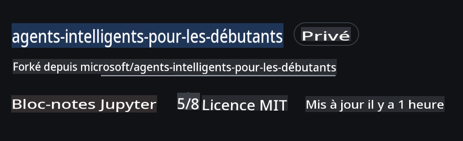
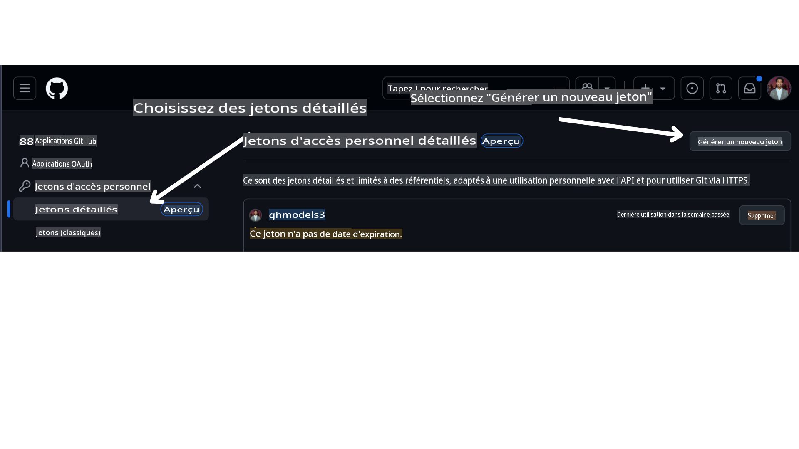

<!--
CO_OP_TRANSLATOR_METADATA:
{
  "original_hash": "366bc6709dd95b8a32ec7c705b0f179c",
  "translation_date": "2025-03-28T10:08:26+00:00",
  "source_file": "00-course-setup\\README.md",
  "language_code": "fr"
}
-->
# Configuration du cours

## Introduction

Cette leçon couvrira comment exécuter les exemples de code de ce cours.

## Prérequis

- Un compte GitHub
- Python 3.12+
- Abonnement Azure
- Compte Azure AI Foundry

## Cloner ou Forker ce dépôt

Pour commencer, veuillez cloner ou forker le dépôt GitHub. Cela vous permettra de créer votre propre version du matériel de cours afin de pouvoir exécuter, tester et modifier le code !

Cela peut être fait en cliquant sur le lien suivant :



## Récupérer votre jeton d'accès personnel GitHub (PAT)

Actuellement, ce cours utilise le Marketplace de modèles GitHub pour offrir un accès gratuit à des modèles de langage étendus (LLMs) qui seront utilisés pour créer des agents d'IA.

Pour accéder à ce service, vous devez créer un jeton d'accès personnel GitHub.

Cela peut être fait en vous rendant dans votre compte GitHub.

Sélectionnez l'option `Fine-grained tokens` sur le côté gauche de votre écran.

Puis sélectionnez `Generate new token`.



Copiez le nouveau jeton que vous venez de créer. Vous allez maintenant l'ajouter à votre fichier `.env` inclus dans ce cours.

## Ajouter cela à vos variables d'environnement

Pour créer votre fichier `.env`, exécutez la commande suivante dans votre terminal :

```bash
cp .env.example .env
```

Cela copiera le fichier exemple et créera un fichier `.env` dans votre répertoire. Remplissez les valeurs des variables d'environnement. Vous pouvez localiser les valeurs pour chaque variable d'environnement dans les emplacements suivants sur le portail [Azure AI Foundry](https://ai.azure.com?WT.mc_id=academic-105485-koreyst) :

Ouvrez ce fichier et collez le jeton que vous avez créé dans `GITHUB_TOKEN=` field of the .env file. 
- `AZURE_SUBSCRIPTION_ID` - On the **Overview** page of your project within **Project details**.
- `AZURE_AI_PROJECT_NAME` - At the top of the **Overview** page for your project.
- `AZURE_OPENAI_RESOURCE_GROUP` - On the **Overview** page of the **Management Center** within **Project properties**.
- `AZURE_OPENAI_SERVICE` - On the **Overview** page of your project in the **Included capabilities** tab for **Azure OpenAI Service**.
- `AZURE_OPENAI_API_VERSION` - On the [API version lifecycle](https://learn.microsoft.com/azure/ai-services/openai/api-version-deprecation#latest-ga-api-release?WT.mc_id=academic-105485-koreyst) webpage within the **Latest GA API release** section.
- `AZURE_OPENAI_ENDPOINT` - Dans l'onglet **Détails** de votre déploiement de modèle sous **Endpoint** (c'est-à-dire **Target URI**).

## Installer les paquets requis

Pour vous assurer que vous avez tous les paquets Python nécessaires pour exécuter le code, exécutez la commande suivante dans votre terminal.

Nous recommandons de créer un environnement virtuel Python pour éviter tout conflit ou problème.

```bash
pip install -r requirements.txt
```

Cela devrait installer les paquets Python requis.

# Se connecter à Azure

En tant que bonne pratique de sécurité, nous utiliserons [l'authentification sans clé](https://learn.microsoft.com/azure/developer/ai/keyless-connections?tabs=csharp%2Cazure-cli?WT.mc_id=academic-105485-koreyst) pour nous authentifier auprès d'Azure OpenAI avec Microsoft Entra ID. Avant de pouvoir le faire, vous devez d'abord installer **Azure CLI** en suivant les [instructions d'installation](https://learn.microsoft.com/cli/azure/install-azure-cli?WT.mc_id=academic-105485-koreyst) pour votre système d'exploitation.

Ensuite, ouvrez un terminal et exécutez `az login` to sign in to your Azure account.

## Sign in to Azure

Login with your Azure AI account used to provision the Azure resources.

Open a new terminal and enter the following command and follow the instructions in the terminal:

`az login --use-device-code`

Once you've logged in, select your subscription in the terminal.

## Access the environment variables.

We'll import `os` and `load_dotenv` afin de pouvoir accéder aux variables d'environnement.

```python
import os
from dotenv import load_dotenv

load_dotenv()
```

## Configurer l'authentification sans clé

Plutôt que de coder en dur vos identifiants, nous utiliserons une connexion sans clé avec Azure OpenAI. Pour ce faire, nous importerons la fonction `DefaultAzureCredential` and later call the `DefaultAzureCredential` pour obtenir les identifiants.

```python
from azure.identity import DefaultAzureCredential, InteractiveBrowserCredential
```

Vous êtes maintenant prêt à exécuter le code de ce cours, bonne exploration du monde des agents d'IA !

Si vous rencontrez des problèmes lors de cette configuration, rejoignez notre communauté ou forum.

## Leçon suivante

[Introduction aux agents d'IA et cas d'utilisation des agents](../01-intro-to-ai-agents/README.md)

**Avertissement** :  
Ce document a été traduit à l'aide du service de traduction automatique [Co-op Translator](https://github.com/Azure/co-op-translator). Bien que nous nous efforcions d'assurer l'exactitude, veuillez noter que les traductions automatisées peuvent contenir des erreurs ou des imprécisions. Le document original dans sa langue d'origine doit être considéré comme la source faisant autorité. Pour les informations critiques, il est recommandé de recourir à une traduction professionnelle réalisée par un humain. Nous déclinons toute responsabilité en cas de malentendus ou d'interprétations erronées résultant de l'utilisation de cette traduction.