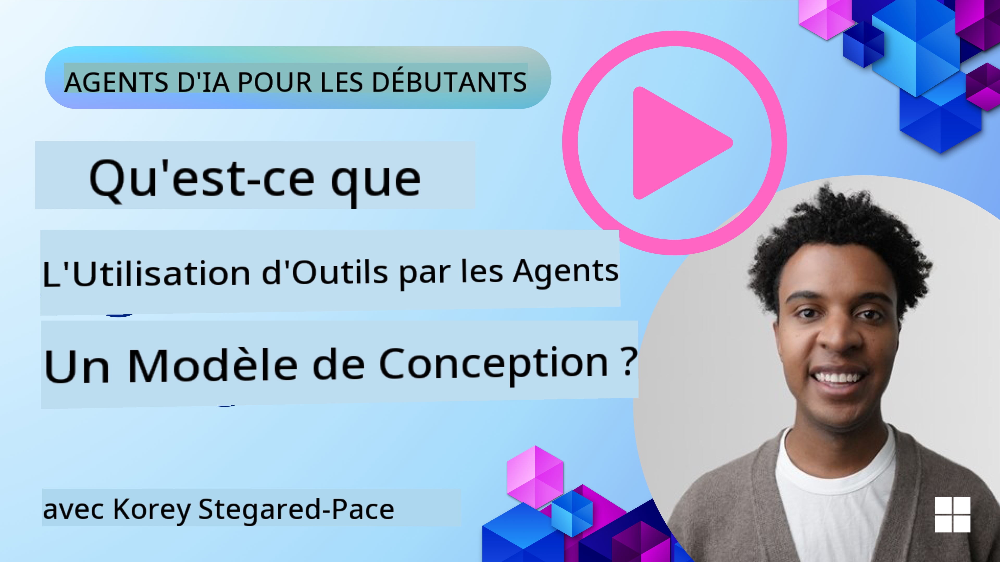
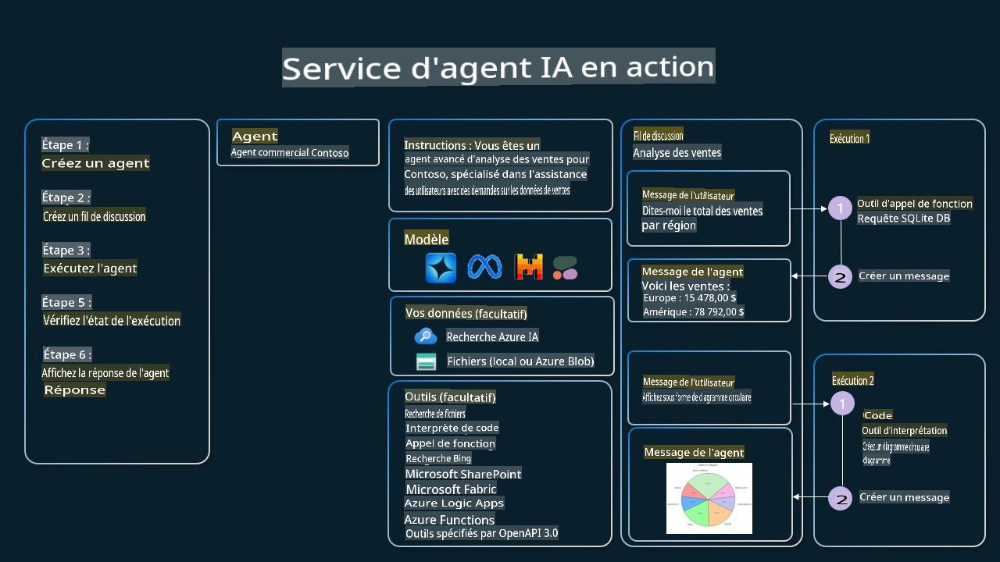

<!--
CO_OP_TRANSLATOR_METADATA:
{
  "original_hash": "b8ea2abd1a674f736d5fc08982e6ec06",
  "translation_date": "2025-03-28T10:23:40+00:00",
  "source_file": "04-tool-use\\README.md",
  "language_code": "fr"
}
-->
[](https://youtu.be/vieRiPRx-gI?si=cEZ8ApnT6Sus9rhn)

> _(Cliquez sur l'image ci-dessus pour visionner la vidéo de cette leçon)_

# Modèle de conception pour l'utilisation d'outils

Les outils sont intéressants car ils permettent aux agents IA d'avoir une gamme de capacités plus large. Au lieu de se limiter à un ensemble restreint d'actions, l'ajout d'un outil permet à l'agent d'exécuter une variété d'actions. Dans ce chapitre, nous allons explorer le modèle de conception pour l'utilisation d'outils, qui décrit comment les agents IA peuvent utiliser des outils spécifiques pour atteindre leurs objectifs.

## Introduction

Dans cette leçon, nous cherchons à répondre aux questions suivantes :

- Qu'est-ce que le modèle de conception pour l'utilisation d'outils ?
- À quels cas d'utilisation peut-il être appliqué ?
- Quels sont les éléments nécessaires pour implémenter ce modèle de conception ?
- Quelles sont les considérations particulières pour utiliser ce modèle afin de créer des agents IA fiables ?

## Objectifs d'apprentissage

Après avoir terminé cette leçon, vous serez capable de :

- Définir le modèle de conception pour l'utilisation d'outils et son objectif.
- Identifier les cas d'utilisation où ce modèle est applicable.
- Comprendre les éléments clés nécessaires pour implémenter le modèle.
- Reconnaître les considérations pour garantir la fiabilité des agents IA utilisant ce modèle.

## Qu'est-ce que le modèle de conception pour l'utilisation d'outils ?

Le **modèle de conception pour l'utilisation d'outils** vise à donner aux LLMs la capacité d'interagir avec des outils externes pour atteindre des objectifs spécifiques. Les outils sont des morceaux de code exécutables par un agent pour effectuer des actions. Un outil peut être une fonction simple comme une calculatrice, ou un appel API à un service tiers tel que la recherche de prix d'actions ou les prévisions météorologiques. Dans le contexte des agents IA, les outils sont conçus pour être exécutés par les agents en réponse à des **appels de fonction générés par le modèle**.

## À quels cas d'utilisation peut-il être appliqué ?

Les agents IA peuvent utiliser des outils pour accomplir des tâches complexes, récupérer des informations ou prendre des décisions. Le modèle de conception pour l'utilisation d'outils est souvent utilisé dans des scénarios nécessitant une interaction dynamique avec des systèmes externes tels que des bases de données, des services web ou des interpréteurs de code. Cette capacité est utile dans plusieurs cas d'utilisation, notamment :

- **Récupération dynamique d'informations** : Les agents peuvent interroger des API externes ou des bases de données pour obtenir des données à jour (par exemple, interroger une base SQLite pour une analyse de données, récupérer des prix d'actions ou des informations météorologiques).
- **Exécution et interprétation de code** : Les agents peuvent exécuter du code ou des scripts pour résoudre des problèmes mathématiques, générer des rapports ou effectuer des simulations.
- **Automatisation des flux de travail** : Automatiser des flux de travail répétitifs ou en plusieurs étapes en intégrant des outils comme des planificateurs de tâches, des services de messagerie ou des pipelines de données.
- **Support client** : Les agents peuvent interagir avec des systèmes CRM, des plateformes de gestion des tickets ou des bases de connaissances pour résoudre les requêtes des utilisateurs.
- **Création et édition de contenu** : Les agents peuvent utiliser des outils tels que des correcteurs grammaticaux, des résumeurs de texte ou des évaluateurs de sécurité de contenu pour aider à des tâches de création de contenu.

## Quels sont les éléments nécessaires pour implémenter le modèle de conception pour l'utilisation d'outils ?

Ces éléments permettent à l'agent IA d'exécuter une large gamme de tâches. Examinons les éléments clés nécessaires pour implémenter ce modèle de conception :

- **Appels de fonction/outils** : C'est le moyen principal permettant aux LLMs d'interagir avec des outils. Les fonctions ou outils sont des blocs de code réutilisables que les agents utilisent pour accomplir des tâches. Cela peut aller de fonctions simples comme une calculatrice à des appels API vers des services tiers tels que la recherche de prix d'actions ou les prévisions météorologiques.

- **Récupération dynamique d'informations** : Les agents peuvent interroger des API externes ou des bases de données pour obtenir des données à jour. Cela est utile pour des tâches comme l'analyse de données, la récupération de prix d'actions ou d'informations météorologiques.

- **Exécution et interprétation de code** : Les agents peuvent exécuter du code ou des scripts pour résoudre des problèmes mathématiques, générer des rapports ou effectuer des simulations.

- **Automatisation des flux de travail** : Cela implique d'automatiser des flux de travail répétitifs ou en plusieurs étapes en intégrant des outils comme des planificateurs de tâches, des services de messagerie ou des pipelines de données.

- **Support client** : Les agents peuvent interagir avec des systèmes CRM, des plateformes de gestion des tickets ou des bases de connaissances pour résoudre les requêtes des utilisateurs.

- **Création et édition de contenu** : Les agents peuvent utiliser des outils tels que des correcteurs grammaticaux, des résumeurs de texte ou des évaluateurs de sécurité de contenu pour aider à des tâches de création de contenu.

Ensuite, examinons plus en détail les appels de fonction/outils.

### Appels de fonction/outils

Les appels de fonction sont le moyen principal permettant aux modèles de langage de grande taille (LLMs) d'interagir avec des outils. Vous verrez souvent les termes "fonction" et "outil" utilisés de manière interchangeable, car les "fonctions" (blocs de code réutilisables) sont les "outils" que les agents utilisent pour accomplir des tâches. Pour qu'un code de fonction soit invoqué, un LLM doit comparer la requête de l'utilisateur avec la description des fonctions. Pour ce faire, un schéma contenant les descriptions de toutes les fonctions disponibles est envoyé au LLM. Le LLM sélectionne ensuite la fonction la plus appropriée pour la tâche et renvoie son nom et ses arguments. La fonction sélectionnée est invoquée, sa réponse est renvoyée au LLM, qui utilise les informations pour répondre à la requête de l'utilisateur.

Pour que les développeurs implémentent les appels de fonction pour les agents, vous aurez besoin de :

1. Un modèle LLM qui prend en charge les appels de fonction
2. Un schéma contenant les descriptions des fonctions
3. Le code pour chaque fonction décrite

Prenons l'exemple d'obtenir l'heure actuelle dans une ville pour illustrer :

1. **Initialiser un LLM qui prend en charge les appels de fonction** :

    Tous les modèles ne prennent pas en charge les appels de fonction, il est donc important de vérifier que le LLM que vous utilisez le fait. <a href="https://learn.microsoft.com/azure/ai-services/openai/how-to/function-calling" target="_blank">Azure OpenAI</a> prend en charge les appels de fonction. Nous pouvons commencer par initier le client Azure OpenAI.

    ```python
    # Initialize the Azure OpenAI client
    client = AzureOpenAI(
        azure_endpoint = os.getenv("AZURE_OPENAI_ENDPOINT"), 
        api_key=os.getenv("AZURE_OPENAI_API_KEY"),  
        api_version="2024-05-01-preview"
    )
    ```

1. **Créer un schéma de fonction** :

    Ensuite, nous définirons un schéma JSON contenant le nom de la fonction, une description de ce que fait la fonction, ainsi que les noms et descriptions des paramètres de la fonction. Nous prendrons ensuite ce schéma et le passerons au client créé précédemment, avec la requête de l'utilisateur pour trouver l'heure à San Francisco. Ce qui est important à noter, c'est qu'un **appel d'outil** est ce qui est renvoyé, **pas** la réponse finale à la question. Comme mentionné précédemment, le LLM renvoie le nom de la fonction qu'il a sélectionnée pour la tâche et les arguments qui lui seront passés.

    ```python
    # Function description for the model to read
    tools = [
        {
            "type": "function",
            "function": {
                "name": "get_current_time",
                "description": "Get the current time in a given location",
                "parameters": {
                    "type": "object",
                    "properties": {
                        "location": {
                            "type": "string",
                            "description": "The city name, e.g. San Francisco",
                        },
                    },
                    "required": ["location"],
                },
            }
        }
    ]
    ```
   
    ```python
  
    # Initial user message
    messages = [{"role": "user", "content": "What's the current time in San Francisco"}] 
  
    # First API call: Ask the model to use the function
      response = client.chat.completions.create(
          model=deployment_name,
          messages=messages,
          tools=tools,
          tool_choice="auto",
      )
  
      # Process the model's response
      response_message = response.choices[0].message
      messages.append(response_message)
  
      print("Model's response:")  

      print(response_message)
  
    ```

    ```bash
    Model's response:
    ChatCompletionMessage(content=None, role='assistant', function_call=None, tool_calls=[ChatCompletionMessageToolCall(id='call_pOsKdUlqvdyttYB67MOj434b', function=Function(arguments='{"location":"San Francisco"}', name='get_current_time'), type='function')])
    ```
  
1. **Le code de la fonction nécessaire pour effectuer la tâche** :

    Maintenant que le LLM a choisi quelle fonction doit être exécutée, le code qui effectue la tâche doit être implémenté et exécuté. Nous pouvons implémenter le code pour obtenir l'heure actuelle en Python. Nous devrons également écrire le code pour extraire le nom et les arguments du `response_message` afin d'obtenir le résultat final.

    ```python
      def get_current_time(location):
        """Get the current time for a given location"""
        print(f"get_current_time called with location: {location}")  
        location_lower = location.lower()
        
        for key, timezone in TIMEZONE_DATA.items():
            if key in location_lower:
                print(f"Timezone found for {key}")  
                current_time = datetime.now(ZoneInfo(timezone)).strftime("%I:%M %p")
                return json.dumps({
                    "location": location,
                    "current_time": current_time
                })
      
        print(f"No timezone data found for {location_lower}")  
        return json.dumps({"location": location, "current_time": "unknown"})
    ```

     ```python
     # Handle function calls
      if response_message.tool_calls:
          for tool_call in response_message.tool_calls:
              if tool_call.function.name == "get_current_time":
     
                  function_args = json.loads(tool_call.function.arguments)
     
                  time_response = get_current_time(
                      location=function_args.get("location")
                  )
     
                  messages.append({
                      "tool_call_id": tool_call.id,
                      "role": "tool",
                      "name": "get_current_time",
                      "content": time_response,
                  })
      else:
          print("No tool calls were made by the model.")  
  
      # Second API call: Get the final response from the model
      final_response = client.chat.completions.create(
          model=deployment_name,
          messages=messages,
      )
  
      return final_response.choices[0].message.content
     ```

     ```bash
      get_current_time called with location: San Francisco
      Timezone found for san francisco
      The current time in San Francisco is 09:24 AM.
     ```

Les appels de fonction sont au cœur de la plupart, sinon de tous, les designs d'utilisation d'outils par les agents. Cependant, les implémenter à partir de zéro peut parfois être difficile. Comme nous l'avons appris dans [Leçon 2](../../../02-explore-agentic-frameworks), les frameworks agentiques nous fournissent des blocs de construction pré-construits pour implémenter l'utilisation d'outils.

## Exemples d'utilisation d'outils avec des frameworks agentiques

Voici quelques exemples de la manière dont vous pouvez implémenter le modèle de conception pour l'utilisation d'outils à l'aide de différents frameworks agentiques :

### Semantic Kernel

<a href="https://learn.microsoft.com/azure/ai-services/agents/overview" target="_blank">Semantic Kernel</a> est un framework IA open-source pour les développeurs .NET, Python et Java travaillant avec des modèles de langage de grande taille (LLMs). Il simplifie le processus d'utilisation des appels de fonction en décrivant automatiquement vos fonctions et leurs paramètres au modèle via un processus appelé <a href="https://learn.microsoft.com/semantic-kernel/concepts/ai-services/chat-completion/function-calling/?pivots=programming-language-python#1-serializing-the-functions" target="_blank">sérialisation</a>. Il gère également la communication entre le modèle et votre code. Un autre avantage d'utiliser un framework agentique comme Semantic Kernel est qu'il vous permet d'accéder à des outils pré-construits comme <a href="https://github.com/microsoft/semantic-kernel/blob/main/python/samples/getting_started_with_agents/openai_assistant/step4_assistant_tool_file_search.py" target="_blank">File Search</a> et <a href="https://github.com/microsoft/semantic-kernel/blob/main/python/samples/getting_started_with_agents/openai_assistant/step3_assistant_tool_code_interpreter.py" target="_blank">Code Interpreter</a>.

Le diagramme suivant illustre le processus d'appel de fonction avec Semantic Kernel :


Dans Semantic Kernel, les fonctions/outils sont appelés <a href="https://learn.microsoft.com/semantic-kernel/concepts/plugins/?pivots=programming-language-python" target="_blank">Plugins</a>. Nous pouvons convertir la fonction `get_current_time` function we saw earlier into a plugin by turning it into a class with the function in it. We can also import the `kernel_function` en décorateur, qui prend la description de la fonction. Lorsque vous créez ensuite un kernel avec le GetCurrentTimePlugin, le kernel sérialisera automatiquement la fonction et ses paramètres, créant le schéma à envoyer au LLM dans le processus.

```python
from semantic_kernel.functions import kernel_function

class GetCurrentTimePlugin:
    async def __init__(self, location):
        self.location = location

    @kernel_function(
        description="Get the current time for a given location"
    )
    def get_current_time(location: str = ""):
        ...

```

```python 
from semantic_kernel import Kernel

# Create the kernel
kernel = Kernel()

# Create the plugin
get_current_time_plugin = GetCurrentTimePlugin(location)

# Add the plugin to the kernel
kernel.add_plugin(get_current_time_plugin)
```
  
### Azure AI Agent Service

<a href="https://learn.microsoft.com/azure/ai-services/agents/overview" target="_blank">Azure AI Agent Service</a> est un nouveau framework agentique conçu pour permettre aux développeurs de créer, déployer et étendre des agents IA de haute qualité de manière sécurisée, sans avoir à gérer les ressources de calcul et de stockage sous-jacentes. Il est particulièrement utile pour les applications d'entreprise puisqu'il s'agit d'un service entièrement géré avec une sécurité de niveau entreprise.

Comparé au développement direct avec l'API LLM, Azure AI Agent Service offre certains avantages, notamment :

- Appels d'outils automatiques – pas besoin de traiter un appel d'outil, d'invoquer l'outil et de gérer la réponse ; tout cela est désormais fait côté serveur.
- Gestion sécurisée des données – au lieu de gérer votre propre état de conversation, vous pouvez compter sur des threads pour stocker toutes les informations nécessaires.
- Outils prêts à l'emploi – Outils que vous pouvez utiliser pour interagir avec vos sources de données, tels que Bing, Azure AI Search et Azure Functions.

Les outils disponibles dans Azure AI Agent Service peuvent être divisés en deux catégories :

1. Outils de connaissance :
    - <a href="https://learn.microsoft.com/azure/ai-services/agents/how-to/tools/bing-grounding?tabs=python&pivots=overview" target="_blank">Recherche avec Bing</a>
    - <a href="https://learn.microsoft.com/azure/ai-services/agents/how-to/tools/file-search?tabs=python&pivots=overview" target="_blank">Recherche de fichiers</a>
    - <a href="https://learn.microsoft.com/azure/ai-services/agents/how-to/tools/azure-ai-search?tabs=azurecli%2Cpython&pivots=overview-azure-ai-search" target="_blank">Azure AI Search</a>

2. Outils d'action :
    - <a href="https://learn.microsoft.com/azure/ai-services/agents/how-to/tools/function-calling?tabs=python&pivots=overview" target="_blank">Appels de fonction</a>
    - <a href="https://learn.microsoft.com/azure/ai-services/agents/how-to/tools/code-interpreter?tabs=python&pivots=overview" target="_blank">Interpréteur de code</a>
    - <a href="https://learn.microsoft.com/azure/ai-services/agents/how-to/tools/openapi-spec?tabs=python&pivots=overview" target="_blank">Outils définis par OpenAI</a>
    - <a href="https://learn.microsoft.com/azure/ai-services/agents/how-to/tools/azure-functions?pivots=overview" target="_blank">Azure Functions</a>

Le service Agent permet d'utiliser ces outils ensemble comme un `toolset`. It also utilizes `threads` which keep track of the history of messages from a particular conversation.

Imagine you are a sales agent at a company called Contoso. You want to develop a conversational agent that can answer questions about your sales data.

The following image illustrates how you could use Azure AI Agent Service to analyze your sales data:



To use any of these tools with the service we can create a client and define a tool or toolset. To implement this practically we can use the following Python code. The LLM will be able to look at the toolset and decide whether to use the user created function, `fetch_sales_data_using_sqlite_query`, ou l'interpréteur de code pré-construit, selon la requête de l'utilisateur.

```python 
import os
from azure.ai.projects import AIProjectClient
from azure.identity import DefaultAzureCredential
from fecth_sales_data_functions import fetch_sales_data_using_sqlite_query # fetch_sales_data_using_sqlite_query function which can be found in a fetch_sales_data_functions.py file.
from azure.ai.projects.models import ToolSet, FunctionTool, CodeInterpreterTool

project_client = AIProjectClient.from_connection_string(
    credential=DefaultAzureCredential(),
    conn_str=os.environ["PROJECT_CONNECTION_STRING"],
)

# Initialize function calling agent with the fetch_sales_data_using_sqlite_query function and adding it to the toolset
fetch_data_function = FunctionTool(fetch_sales_data_using_sqlite_query)
toolset = ToolSet()
toolset.add(fetch_data_function)

# Initialize Code Interpreter tool and adding it to the toolset. 
code_interpreter = code_interpreter = CodeInterpreterTool()
toolset = ToolSet()
toolset.add(code_interpreter)

agent = project_client.agents.create_agent(
    model="gpt-4o-mini", name="my-agent", instructions="You are helpful agent", 
    toolset=toolset
)
```

## Quelles sont les considérations particulières pour utiliser le modèle de conception pour l'utilisation d'outils afin de créer des agents IA fiables ?

Une préoccupation fréquente avec le SQL généré dynamiquement par les LLMs est la sécurité, en particulier le risque d'injection SQL ou d'actions malveillantes, telles que la suppression ou la modification de la base de données. Bien que ces préoccupations soient valides, elles peuvent être efficacement atténuées en configurant correctement les permissions d'accès à la base de données. Pour la plupart des bases de données, cela implique de les configurer en mode lecture seule. Pour des services de base de données comme PostgreSQL ou Azure SQL, l'application devrait se voir attribuer un rôle en lecture seule (SELECT).

Exécuter l'application dans un environnement sécurisé améliore encore la protection. Dans les scénarios d'entreprise, les données sont généralement extraites et transformées à partir de systèmes opérationnels dans une base de données en lecture seule ou un entrepôt de données avec un schéma convivial. Cette approche garantit que les données sont sécurisées, optimisées pour les performances et l'accessibilité, et que l'application dispose d'un accès restreint en lecture seule.

## Ressources supplémentaires

- <a href="https://microsoft.github.io/build-your-first-agent-with-azure-ai-agent-service-workshop/" target="_blank">Atelier Azure AI Agents Service</a>
- <a href="https://github.com/Azure-Samples/contoso-creative-writer/tree/main/docs/workshop" target="_blank">Atelier multi-agents Contoso Creative Writer</a>
- <a href="https://learn.microsoft.com/semantic-kernel/concepts/ai-services/chat-completion/function-calling/?pivots=programming-language-python#1-serializing-the-functions" target="_blank">Tutoriel sur les appels de fonction avec Semantic Kernel</a>
- <a href="https://github.com/microsoft/semantic-kernel/blob/main/python/samples/getting_started_with_agents/openai_assistant/step3_assistant_tool_code_interpreter.py" target="_blank">Interpréteur de code avec Semantic Kernel</a>
- <a href="https://microsoft.github.io/autogen/dev/user-guide/core-user-guide/components/tools.html" target="_blank">Outils Autogen</a>

## Leçon précédente

[Comprendre les modèles de conception agentique](../03-agentic-design-patterns/README.md)

## Leçon suivante

[Agentic RAG](../05-agentic-rag/README.md)

**Avertissement** :  
Ce document a été traduit à l'aide du service de traduction automatique [Co-op Translator](https://github.com/Azure/co-op-translator). Bien que nous nous efforcions d'assurer l'exactitude, veuillez noter que les traductions automatisées peuvent contenir des erreurs ou des inexactitudes. Le document original dans sa langue d'origine doit être considéré comme la source faisant autorité. Pour des informations critiques, une traduction professionnelle réalisée par un humain est recommandée. Nous déclinons toute responsabilité en cas de malentendus ou d'interprétations erronées résultant de l'utilisation de cette traduction.