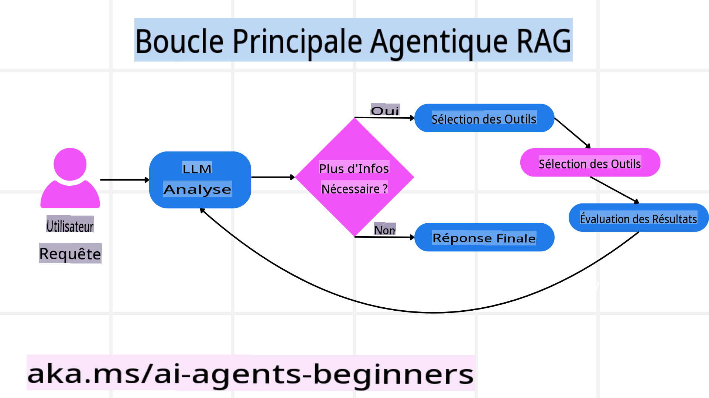
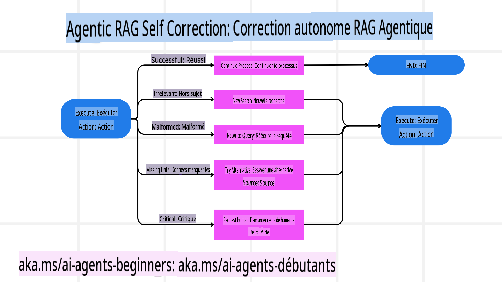
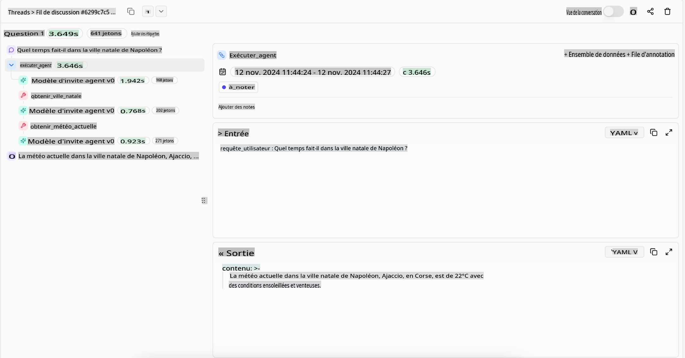
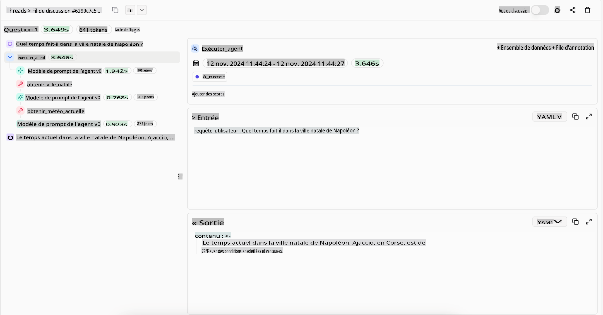

<!--
CO_OP_TRANSLATOR_METADATA:
{
  "original_hash": "4d215d159f2f3b96644fd62657988d23",
  "translation_date": "2025-03-28T10:27:16+00:00",
  "source_file": "05-agentic-rag\\README.md",
  "language_code": "fr"
}
-->

> _(Cliquez sur l'image ci-dessus pour voir la vidéo de cette leçon)_

# Agentic RAG

Cette leçon offre un aperçu complet de l'Agentic Retrieval-Augmented Generation (Agentic RAG), un paradigme émergent de l'IA où les modèles de langage de grande taille (LLMs) planifient de manière autonome leurs prochaines étapes tout en récupérant des informations provenant de sources externes. Contrairement aux schémas statiques de récupération puis lecture, Agentic RAG implique des appels itératifs au LLM, entrecoupés d'appels à des outils ou des fonctions et des sorties structurées. Le système évalue les résultats, affine les requêtes, utilise des outils supplémentaires si nécessaire, et poursuit ce cycle jusqu'à l'obtention d'une solution satisfaisante.

## Introduction

Cette leçon couvrira :

- **Comprendre Agentic RAG :** Découvrez ce paradigme émergent de l'IA où les modèles de langage de grande taille (LLMs) planifient de manière autonome leurs prochaines étapes tout en récupérant des informations provenant de sources de données externes.
- **Saisir le style itératif Maker-Checker :** Comprenez la boucle d'appels itératifs au LLM, entrecoupés d'appels à des outils ou des fonctions et des sorties structurées, conçue pour améliorer la précision et gérer les requêtes mal formées.
- **Explorer les applications pratiques :** Identifiez les scénarios où Agentic RAG excelle, comme les environnements axés sur la précision, les interactions complexes avec des bases de données et les workflows prolongés.

## Objectifs d'apprentissage

Après avoir terminé cette leçon, vous serez capable de :

- **Comprendre Agentic RAG :** Découvrir ce paradigme émergent de l'IA où les modèles de langage de grande taille (LLMs) planifient de manière autonome leurs prochaines étapes tout en récupérant des informations provenant de sources de données externes.
- **Style itératif Maker-Checker :** Saisir le concept d'une boucle d'appels itératifs au LLM, entrecoupés d'appels à des outils ou des fonctions et des sorties structurées, conçue pour améliorer la précision et gérer les requêtes mal formées.
- **Appropriation du processus de raisonnement :** Comprendre la capacité du système à maîtriser son processus de raisonnement, en prenant des décisions sur la manière d'aborder les problèmes sans dépendre de chemins prédéfinis.
- **Workflow :** Comprendre comment un modèle agentique décide de manière autonome de récupérer des rapports sur les tendances du marché, d'identifier des données sur les concurrents, de corréler des métriques internes de ventes, de synthétiser les résultats et d'évaluer la stratégie.
- **Boucles itératives, intégration d'outils et mémoire :** Découvrir la dépendance du système à un schéma d'interaction en boucle, en maintenant un état et une mémoire au fil des étapes pour éviter les boucles répétitives et prendre des décisions éclairées.
- **Gestion des modes d'échec et auto-correction :** Explorer les mécanismes d'auto-correction robustes du système, notamment l'itération et la requalification, l'utilisation d'outils de diagnostic et le recours à une supervision humaine.
- **Limites de l'autonomie :** Comprendre les limites de Agentic RAG, en mettant l'accent sur l'autonomie spécifique au domaine, la dépendance à l'infrastructure et le respect des garde-fous.
- **Cas d'utilisation pratiques et valeur :** Identifier les scénarios où Agentic RAG excelle, comme les environnements axés sur la précision, les interactions complexes avec des bases de données et les workflows prolongés.
- **Gouvernance, transparence et confiance :** Apprenez l'importance de la gouvernance et de la transparence, y compris le raisonnement explicable, le contrôle des biais et la supervision humaine.

## Qu'est-ce que Agentic RAG ?

Agentic Retrieval-Augmented Generation (Agentic RAG) est un paradigme émergent de l'IA où les modèles de langage de grande taille (LLMs) planifient de manière autonome leurs prochaines étapes tout en récupérant des informations provenant de sources externes. Contrairement aux schémas statiques de récupération puis lecture, Agentic RAG implique des appels itératifs au LLM, entrecoupés d'appels à des outils ou des fonctions et des sorties structurées. Le système évalue les résultats, affine les requêtes, utilise des outils supplémentaires si nécessaire, et poursuit ce cycle jusqu'à l'obtention d'une solution satisfaisante. Ce style itératif “maker-checker” améliore la précision, gère les requêtes mal formées et garantit des résultats de haute qualité.

Le système prend activement en charge son processus de raisonnement, réécrit les requêtes échouées, choisit différentes méthodes de récupération et intègre plusieurs outils—comme la recherche vectorielle dans Azure AI Search, les bases de données SQL ou les API personnalisées—avant de finaliser sa réponse. La qualité distinctive d'un système agentique est sa capacité à maîtriser son processus de raisonnement. Les implémentations traditionnelles de RAG reposent sur des chemins prédéfinis, mais un système agentique détermine de manière autonome la séquence des étapes en fonction de la qualité des informations qu'il trouve.

## Définir Agentic Retrieval-Augmented Generation (Agentic RAG)

Agentic Retrieval-Augmented Generation (Agentic RAG) est un paradigme émergent dans le développement de l'IA où les LLMs non seulement récupèrent des informations provenant de sources de données externes mais planifient également leurs prochaines étapes de manière autonome. Contrairement aux schémas statiques de récupération puis lecture ou aux séquences de prompts soigneusement scriptées, Agentic RAG implique une boucle d'appels itératifs au LLM, entrecoupés d'appels à des outils ou des fonctions et des sorties structurées. À chaque étape, le système évalue les résultats obtenus, décide s'il doit affiner ses requêtes, utilise des outils supplémentaires si nécessaire, et poursuit ce cycle jusqu'à ce qu'il obtienne une solution satisfaisante.

Ce style itératif “maker-checker” est conçu pour améliorer la précision, gérer les requêtes mal formées vers des bases de données structurées (par exemple NL2SQL), et garantir des résultats équilibrés et de haute qualité. Plutôt que de s'appuyer uniquement sur des chaînes de prompts soigneusement conçues, le système prend activement en charge son processus de raisonnement. Il peut réécrire des requêtes qui échouent, choisir différentes méthodes de récupération et intégrer plusieurs outils—comme la recherche vectorielle dans Azure AI Search, les bases de données SQL ou les API personnalisées—avant de finaliser sa réponse. Cela élimine le besoin de cadres d'orchestration excessivement complexes. À la place, une boucle relativement simple de “appel LLM → utilisation d'outil → appel LLM → …” peut produire des sorties sophistiquées et bien fondées.

## Appropriation du processus de raisonnement

La qualité distinctive qui rend un système “agentique” est sa capacité à maîtriser son processus de raisonnement. Les implémentations traditionnelles de RAG dépendent souvent des humains pour prédéfinir un chemin pour le modèle : une chaîne de pensée qui décrit quoi récupérer et quand. Mais lorsqu'un système est véritablement agentique, il décide en interne comment aborder le problème. Il ne se contente pas d'exécuter un script ; il détermine de manière autonome la séquence des étapes en fonction de la qualité des informations qu'il trouve.

Par exemple, s'il est demandé de créer une stratégie de lancement de produit, il ne se contente pas de s'appuyer sur un prompt qui décrit tout le processus de recherche et de prise de décision. Au lieu de cela, le modèle agentique décide de manière autonome de :

1. Récupérer des rapports sur les tendances actuelles du marché à l'aide de Bing Web Grounding.
2. Identifier des données pertinentes sur les concurrents à l'aide d'Azure AI Search.
3. Corréler des métriques internes historiques de ventes à l'aide d'Azure SQL Database.
4. Synthétiser les résultats en une stratégie cohérente orchestrée via Azure OpenAI Service.
5. Évaluer la stratégie pour détecter des lacunes ou des incohérences, ce qui peut entraîner un autre cycle de récupération si nécessaire.

Toutes ces étapes—affiner les requêtes, choisir les sources, itérer jusqu'à être “satisfait” de la réponse—sont décidées par le modèle, et non prédéfinies par un humain.

## Boucles itératives, intégration d'outils et mémoire

Un système agentique repose sur un schéma d'interaction en boucle :

- **Appel initial :** L'objectif de l'utilisateur (alias prompt utilisateur) est présenté au LLM.
- **Invocation d'outil :** Si le modèle identifie des informations manquantes ou des instructions ambiguës, il sélectionne un outil ou une méthode de récupération—comme une requête de base de données vectorielle (par exemple recherche hybride Azure AI Search sur des données privées) ou un appel SQL structuré—pour obtenir plus de contexte.
- **Évaluation et raffinement :** Après avoir examiné les données retournées, le modèle décide si les informations sont suffisantes. Sinon, il affine la requête, essaie un autre outil ou ajuste son approche.
- **Répéter jusqu'à satisfaction :** Ce cycle se poursuit jusqu'à ce que le modèle détermine qu'il dispose de suffisamment de clarté et de preuves pour fournir une réponse finale bien raisonnée.
- **Mémoire et état :** Étant donné que le système maintient un état et une mémoire au fil des étapes, il peut se rappeler des tentatives précédentes et de leurs résultats, évitant les boucles répétitives et prenant des décisions plus éclairées au fur et à mesure.

Avec le temps, cela crée un sentiment de compréhension évolutive, permettant au modèle de naviguer dans des tâches complexes en plusieurs étapes sans nécessiter une intervention humaine constante ou une reformulation du prompt.

## Gestion des modes d'échec et auto-correction

L'autonomie de Agentic RAG implique également des mécanismes robustes d'auto-correction. Lorsque le système atteint des impasses—comme la récupération de documents non pertinents ou la rencontre de requêtes mal formées—il peut :

- **Itérer et requalifier :** Au lieu de fournir des réponses peu utiles, le modèle tente de nouvelles stratégies de recherche, réécrit des requêtes de base de données ou explore des ensembles de données alternatifs.
- **Utiliser des outils de diagnostic :** Le système peut invoquer des fonctions supplémentaires conçues pour l'aider à déboguer ses étapes de raisonnement ou confirmer la précision des données récupérées. Des outils comme Azure AI Tracing seront importants pour permettre une observabilité et un suivi robustes.
- **Recourir à la supervision humaine :** Pour les scénarios critiques ou les échecs répétés, le modèle peut signaler une incertitude et demander des conseils humains. Une fois que l'humain fournit des commentaires correctifs, le modèle peut intégrer cette leçon pour les sessions futures.

Cette approche itérative et dynamique permet au modèle de s'améliorer continuellement, garantissant qu'il n'est pas seulement un système ponctuel mais qu'il apprend de ses erreurs au cours d'une session donnée.

## Limites de l'autonomie

Malgré son autonomie dans une tâche, Agentic RAG n'est pas équivalent à une intelligence artificielle générale. Ses capacités “agentiques” sont limitées aux outils, sources de données et politiques fournies par les développeurs humains. Il ne peut pas inventer ses propres outils ni sortir des limites du domaine qui lui ont été fixées. Au contraire, il excelle dans l'orchestration dynamique des ressources disponibles.

Les différences clés avec des formes d'IA plus avancées incluent :

1. **Autonomie spécifique au domaine :** Les systèmes Agentic RAG se concentrent sur l'atteinte d'objectifs définis par l'utilisateur dans un domaine connu, en employant des stratégies comme la réécriture de requêtes ou la sélection d'outils pour améliorer les résultats.
2. **Dépendance à l'infrastructure :** Les capacités du système dépendent des outils et données intégrés par les développeurs. Il ne peut pas dépasser ces limites sans intervention humaine.
3. **Respect des garde-fous :** Les lignes directrices éthiques, les règles de conformité et les politiques commerciales restent très importantes. La liberté de l'agent est toujours limitée par des mesures de sécurité et des mécanismes de supervision (espérons-le ?).

## Cas d'utilisation pratiques et valeur

Agentic RAG excelle dans les scénarios nécessitant un raffinement itératif et une précision :

1. **Environnements axés sur la précision :** Dans les vérifications de conformité, les analyses réglementaires ou les recherches juridiques, le modèle agentique peut vérifier les faits de manière répétée, consulter plusieurs sources et réécrire des requêtes jusqu'à produire une réponse soigneusement validée.
2. **Interactions complexes avec des bases de données :** Lorsqu'il s'agit de données structurées où les requêtes échouent souvent ou nécessitent des ajustements, le système peut affiner ses requêtes de manière autonome à l'aide d'Azure SQL ou Microsoft Fabric OneLake, garantissant que la récupération finale correspond à l'intention de l'utilisateur.
3. **Workflows prolongés :** Les sessions de longue durée peuvent évoluer à mesure que de nouvelles informations apparaissent. Agentic RAG peut intégrer continuellement de nouvelles données, modifiant ses stratégies à mesure qu'il en apprend davantage sur le problème.

## Gouvernance, transparence et confiance

À mesure que ces systèmes deviennent plus autonomes dans leur raisonnement, la gouvernance et la transparence sont cruciales :

- **Raisonnement explicable :** Le modèle peut fournir une piste d'audit des requêtes qu'il a effectuées, des sources qu'il a consultées et des étapes de raisonnement qu'il a suivies pour arriver à sa conclusion. Des outils comme Azure AI Content Safety et Azure AI Tracing / GenAIOps peuvent aider à maintenir la transparence et à atténuer les risques.
- **Contrôle des biais et récupération équilibrée :** Les développeurs peuvent ajuster les stratégies de récupération pour garantir que des sources de données équilibrées et représentatives sont prises en compte, et auditer régulièrement les sorties pour détecter des biais ou des schémas déséquilibrés à l'aide de modèles personnalisés pour les organisations avancées en science des données utilisant Azure Machine Learning.
- **Supervision humaine et conformité :** Pour les tâches sensibles, la revue humaine reste essentielle. Agentic RAG n'a pas pour objectif de remplacer le jugement humain dans les décisions critiques—il l'augmente en fournissant des options plus soigneusement validées.

Disposer d'outils qui offrent un enregistrement clair des actions est essentiel. Sans eux, déboguer un processus en plusieurs étapes peut être très difficile. Voir l'exemple suivant de Literal AI (société derrière Chainlit) pour une exécution d'agent :

## Conclusion

Agentic RAG représente une évolution naturelle dans la manière dont les systèmes d'IA gèrent des tâches complexes et intensives en données. En adoptant un schéma d'interaction en boucle, en sélectionnant des outils de manière autonome et en affinant les requêtes jusqu'à obtenir un résultat de haute qualité, le système dépasse les suivis de prompts statiques pour devenir un décideur plus adaptatif et conscient du contexte. Tout en restant limité par des infrastructures définies par des humains et des lignes directrices éthiques, ces capacités agentiques permettent des interactions IA plus riches, dynamiques et, en fin de compte, plus utiles pour les entreprises et les utilisateurs finaux.

## Ressources supplémentaires

- <a href="https://learn.microsoft.com/training/modules/use-own-data-azure-openai" target="_blank">Implémenter Retrieval Augmented Generation (RAG) avec Azure OpenAI Service : Découvrez comment utiliser vos propres données avec Azure OpenAI Service. Ce module Microsoft Learn fournit un guide complet sur la mise en œuvre de RAG</a>
- <a href="https://learn.microsoft.com/azure/ai-studio/concepts/evaluation-approach-gen-ai" target="_blank">Évaluation des applications d'IA générative avec Azure AI Foundry : Cet article couvre l'évaluation et la comparaison des modèles sur des ensembles de données disponibles publiquement, y compris les applications Agentic AI et les architectures RAG</a>
- <a href="https://weaviate.io/blog/what-is-agentic-rag" target="_blank">Qu'est-ce que Agentic RAG | Weaviate</a>
- <a href="https://ragaboutit.com/agentic-rag-a-complete-guide-to-agent-based-retrieval-augmented-generation/" target="_blank">Agentic RAG : Un guide complet sur la génération augmentée par récupération basée sur des agents – Actualités de generation RAG</a>
- <a href="https://huggingface.co/learn/cookbook/agent_rag" target="_blank">Agentic RAG : dynamisez votre RAG avec la reformulation de requêtes et l'auto-requête ! Hugging Face Open-Source AI Cookbook</a>
- <a href="https://youtu.be/aQ4yQXeB1Ss?si=2HUqBzHoeB5tR04U" target="_blank">Ajout de couches agentiques à RAG</a>
- <a href="https://www.youtube.com/watch?v=zeAyuLc_f3Q&t=244s" target="_blank">L'avenir des assistants de connaissances : Jerry Liu</a>
- <a href="https://www.youtube.com/watch?v=AOSjiXP1jmQ" target="_blank">Comment construire des systèmes Agentic RAG</a>
- <a href="https://ignite.microsoft.com/sessions/BRK102?source=sessions" target="_blank">Utilisation du service d'agents Azure AI Foundry pour développer vos agents IA</a>

### Articles académiques

- <a href="https://arxiv.org/abs/2303.17651" target="_blank">2303.17651 Self-Refine : Raffinement itératif avec auto-feedback</a>
- <a href="https://arxiv.org/abs/2303.11366" target="_blank">2303.11366 Reflexion : Agents de langage avec apprentissage par renforcement verbal</a>
- <a href="https://arxiv.org/abs/

**Avertissement** :  
Ce document a été traduit à l'aide du service de traduction automatisée [Co-op Translator](https://github.com/Azure/co-op-translator). Bien que nous nous efforcions d'assurer l'exactitude, veuillez noter que les traductions automatisées peuvent contenir des erreurs ou des inexactitudes. Le document original dans sa langue d'origine doit être considéré comme la source faisant autorité. Pour des informations critiques, il est recommandé de faire appel à une traduction humaine professionnelle. Nous déclinons toute responsabilité en cas de malentendus ou d'interprétations erronées résultant de l'utilisation de cette traduction.