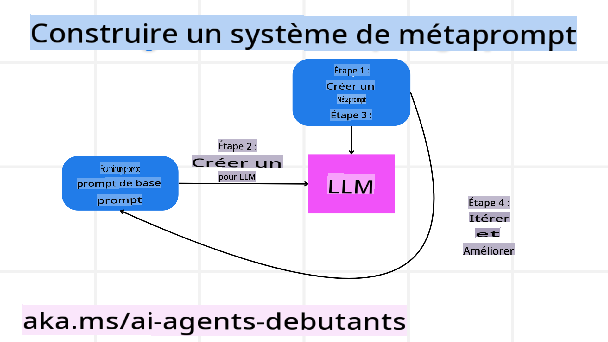

# Construire des Agents IA Fiables

## Introduction

Cette leçon couvrira :

- Comment construire et déployer des Agents IA sûrs et efficaces.
- Les considérations importantes en matière de sécurité lors du développement d'Agents IA.
- Comment préserver la confidentialité des données et des utilisateurs lors du développement d'Agents IA.

## Objectifs d'Apprentissage

Après avoir terminé cette leçon, vous saurez comment :

- Identifier et atténuer les risques lors de la création d'Agents IA.
- Mettre en œuvre des mesures de sécurité pour garantir que les données et les accès soient correctement gérés.
- Créer des Agents IA qui respectent la confidentialité des données et offrent une expérience utilisateur de qualité.

## Sécurité

Commençons par examiner la création d'applications agentiques sûres. La sécurité signifie que l'agent IA fonctionne comme prévu. En tant que concepteurs d'applications agentiques, nous disposons de méthodes et d'outils pour maximiser la sécurité :

### Construire un Système de Méta-Prompting

Si vous avez déjà conçu une application IA utilisant des modèles de langage de grande taille (LLMs), vous savez à quel point il est crucial de concevoir un prompt ou message système robuste. Ces prompts établissent les règles, instructions et lignes directrices pour la manière dont le LLM interagit avec l'utilisateur et les données.

Pour les Agents IA, le prompt système est encore plus important, car ces agents auront besoin d'instructions très spécifiques pour accomplir les tâches que nous leur avons assignées.

Pour créer des prompts systèmes évolutifs, nous pouvons utiliser un système de méta-prompting pour concevoir un ou plusieurs agents dans notre application :



#### Étape 1 : Créer un Méta-Prompt ou Prompt Modèle

Le méta-prompt sera utilisé par un LLM pour générer les prompts systèmes des agents que nous créons. Nous le concevons comme un modèle afin de pouvoir créer efficacement plusieurs agents si nécessaire.

Voici un exemple de méta-prompt que nous donnerions au LLM :

```plaintext
You are an expert at creating AI agent assitants. 
You will be provided a company name, role, responsibilites and other
information that you will use to provide a system prompt for.
To create the system prompt, be descriptive as possible and provide a structure that a system using an LLM can better understand the role and responsibilites of the AI assistant. 
```

#### Étape 2 : Créer un Prompt de Base

L'étape suivante consiste à créer un prompt de base pour décrire l'Agent IA. Vous devez inclure le rôle de l'agent, les tâches qu'il accomplira, ainsi que toute autre responsabilité qui lui incombe.

Voici un exemple :

```plaintext
You are a travel agent for Contoso Travel with that is great at booking flights for customers. To help customers you can perform the following tasks: lookup available flights, book flights, ask for preferences in seating and times for flights, cancel any previously booked flights and alert customers on any delays or cancellations of flights.  
```

#### Étape 3 : Fournir le Prompt de Base au LLM

Nous pouvons maintenant optimiser ce prompt en utilisant le méta-prompt comme prompt système et notre prompt de base.

Cela produira un prompt mieux conçu pour guider nos Agents IA :

```markdown
**Company Name:** Contoso Travel  
**Role:** Travel Agent Assistant

**Objective:**  
You are an AI-powered travel agent assistant for Contoso Travel, specializing in booking flights and providing exceptional customer service. Your main goal is to assist customers in finding, booking, and managing their flights, all while ensuring that their preferences and needs are met efficiently.

**Key Responsibilities:**

1. **Flight Lookup:**
    
    - Assist customers in searching for available flights based on their specified destination, dates, and any other relevant preferences.
    - Provide a list of options, including flight times, airlines, layovers, and pricing.
2. **Flight Booking:**
    
    - Facilitate the booking of flights for customers, ensuring that all details are correctly entered into the system.
    - Confirm bookings and provide customers with their itinerary, including confirmation numbers and any other pertinent information.
3. **Customer Preference Inquiry:**
    
    - Actively ask customers for their preferences regarding seating (e.g., aisle, window, extra legroom) and preferred times for flights (e.g., morning, afternoon, evening).
    - Record these preferences for future reference and tailor suggestions accordingly.
4. **Flight Cancellation:**
    
    - Assist customers in canceling previously booked flights if needed, following company policies and procedures.
    - Notify customers of any necessary refunds or additional steps that may be required for cancellations.
5. **Flight Monitoring:**
    
    - Monitor the status of booked flights and alert customers in real-time about any delays, cancellations, or changes to their flight schedule.
    - Provide updates through preferred communication channels (e.g., email, SMS) as needed.

**Tone and Style:**

- Maintain a friendly, professional, and approachable demeanor in all interactions with customers.
- Ensure that all communication is clear, informative, and tailored to the customer's specific needs and inquiries.

**User Interaction Instructions:**

- Respond to customer queries promptly and accurately.
- Use a conversational style while ensuring professionalism.
- Prioritize customer satisfaction by being attentive, empathetic, and proactive in all assistance provided.

**Additional Notes:**

- Stay updated on any changes to airline policies, travel restrictions, and other relevant information that could impact flight bookings and customer experience.
- Use clear and concise language to explain options and processes, avoiding jargon where possible for better customer understanding.

This AI assistant is designed to streamline the flight booking process for customers of Contoso Travel, ensuring that all their travel needs are met efficiently and effectively.

```

#### Étape 4 : Itérer et Améliorer

L'avantage de ce système de méta-prompting est de faciliter la création de prompts pour plusieurs agents ainsi que d'améliorer vos prompts au fil du temps. Il est rare qu'un prompt fonctionne parfaitement dès la première tentative pour répondre à tous vos besoins. Pouvoir effectuer de petits ajustements et améliorations en modifiant le prompt de base et en le passant par le système vous permettra de comparer et d'évaluer les résultats.

## Comprendre les Menaces  

Pour concevoir des agents IA fiables, il est essentiel de comprendre et d'atténuer les risques et menaces auxquels votre agent IA peut être confronté. Examinons certaines des différentes menaces pour les agents IA et comment vous pouvez mieux les anticiper et vous y préparer.


### Tâches et Instructions

**Description :** Les attaquants tentent de modifier les instructions ou les objectifs de l'agent IA en manipulant les prompts ou les entrées.

**Atténuation :** Effectuez des vérifications de validation et appliquez des filtres d'entrée pour détecter les prompts potentiellement dangereux avant qu'ils ne soient traités par l'Agent IA. Comme ces attaques nécessitent généralement des interactions fréquentes avec l'Agent, limiter le nombre de tours dans une conversation est une autre manière de prévenir ces attaques.

### Accès aux Systèmes Critiques

**Description :** Si un agent IA a accès à des systèmes et services contenant des données sensibles, des attaquants peuvent compromettre la communication entre l'agent et ces services. Cela peut inclure des attaques directes ou des tentatives indirectes pour obtenir des informations sur ces systèmes via l'agent.

**Atténuation :** Les agents IA ne devraient avoir accès aux systèmes que sur une base strictement nécessaire pour éviter ce type d'attaques. La communication entre l'agent et les systèmes doit également être sécurisée. La mise en œuvre de mécanismes d'authentification et de contrôle d'accès est une autre méthode pour protéger ces informations.

### Surcharge des Ressources et Services

**Description :** Les agents IA peuvent accéder à divers outils et services pour accomplir leurs tâches. Les attaquants peuvent exploiter cette capacité pour envoyer un grand volume de requêtes via l'Agent IA, ce qui peut entraîner des pannes de système ou des coûts élevés.

**Atténuation :** Mettez en place des politiques limitant le nombre de requêtes qu'un agent IA peut envoyer à un service. Limiter le nombre de tours de conversation et de requêtes adressées à votre agent IA est une autre méthode pour prévenir ce type d'attaques.

### Empoisonnement de la Base de Connaissances

**Description :** Ce type d'attaque ne cible pas directement l'agent IA mais vise la base de connaissances et d'autres services utilisés par l'agent IA. Cela peut inclure la corruption des données ou informations que l'agent IA utilise pour accomplir ses tâches, entraînant des réponses biaisées ou non souhaitées pour l'utilisateur.

**Atténuation :** Effectuez des vérifications régulières des données utilisées par l'agent IA dans ses flux de travail. Assurez-vous que l'accès à ces données est sécurisé et que seules des personnes de confiance peuvent les modifier pour éviter ce type d'attaque.

### Erreurs en Cascade

**Description :** Les agents IA accèdent à divers outils et services pour accomplir leurs tâches. Les erreurs causées par des attaquants peuvent entraîner des défaillances dans d'autres systèmes auxquels l'agent IA est connecté, rendant l'attaque plus étendue et plus difficile à diagnostiquer.

**Atténuation :** Une méthode pour éviter cela est de faire fonctionner l'Agent IA dans un environnement limité, tel que l'exécution des tâches dans un conteneur Docker, pour prévenir les attaques directes sur le système. La création de mécanismes de secours et de logique de reprise lorsque certains systèmes renvoient une erreur est une autre façon d'éviter des défaillances plus importantes.

## L'Humain dans la Boucle

Une autre méthode efficace pour construire des systèmes d'Agents IA fiables est d'intégrer un humain dans la boucle. Cela crée un flux où les utilisateurs peuvent fournir des retours aux Agents pendant leur exécution. Les utilisateurs agissent essentiellement comme un agent dans un système multi-agents en approuvant ou en interrompant les processus en cours.


Voici un extrait de code utilisant AutoGen pour montrer comment ce concept est mis en œuvre :

```python

# Create the agents.
model_client = OpenAIChatCompletionClient(model="gpt-4o-mini")
assistant = AssistantAgent("assistant", model_client=model_client)
user_proxy = UserProxyAgent("user_proxy", input_func=input)  # Use input() to get user input from console.

# Create the termination condition which will end the conversation when the user says "APPROVE".
termination = TextMentionTermination("APPROVE")

# Create the team.
team = RoundRobinGroupChat([assistant, user_proxy], termination_condition=termination)

# Run the conversation and stream to the console.
stream = team.run_stream(task="Write a 4-line poem about the ocean.")
# Use asyncio.run(...) when running in a script.
await Console(stream)

```
```

**Avertissement** :  
Ce document a été traduit à l'aide de services de traduction automatisés basés sur l'intelligence artificielle. Bien que nous fassions de notre mieux pour garantir l'exactitude, veuillez noter que les traductions automatiques peuvent contenir des erreurs ou des inexactitudes. Le document original dans sa langue d'origine doit être considéré comme la source faisant autorité. Pour des informations critiques, il est recommandé de recourir à une traduction humaine professionnelle. Nous déclinons toute responsabilité en cas de malentendus ou d'interprétations erronées résultant de l'utilisation de cette traduction.