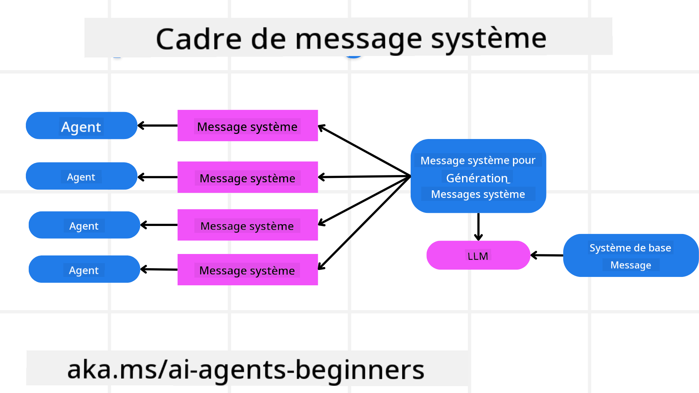
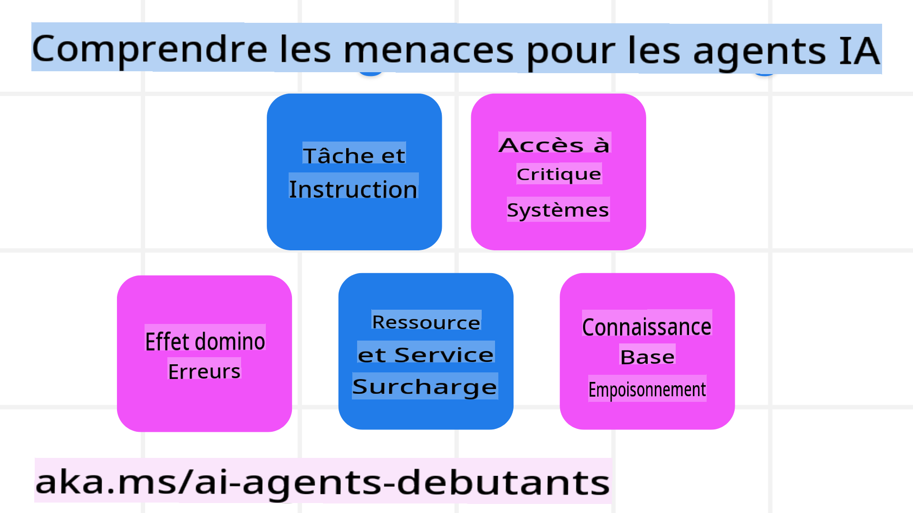
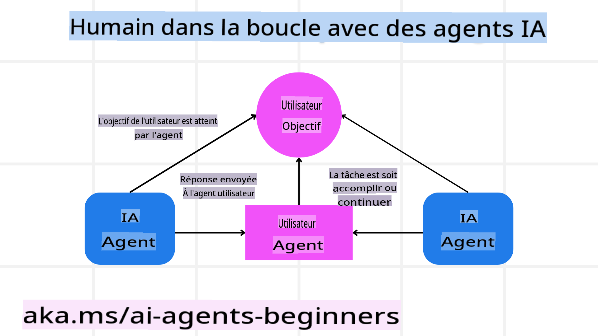

<!--
CO_OP_TRANSLATOR_METADATA:
{
  "original_hash": "c069d7ff0feca3027f88819355866ca1",
  "translation_date": "2025-03-28T10:29:56+00:00",
  "source_file": "06-building-trustworthy-agents\\README.md",
  "language_code": "fr"
}
-->
[](https://youtu.be/iZKkMEGBCUQ?si=Q-kEbcyHUMPoHp8L)

> _(Cliquez sur l'image ci-dessus pour voir la vidéo de cette leçon)_

# Construire des agents IA fiables

## Introduction

Cette leçon couvre :

- Comment créer et déployer des agents IA sûrs et efficaces.
- Les considérations importantes en matière de sécurité lors du développement d'agents IA.
- Comment préserver la confidentialité des données et des utilisateurs lors du développement d'agents IA.

## Objectifs d'apprentissage

Après avoir terminé cette leçon, vous saurez :

- Identifier et atténuer les risques liés à la création d'agents IA.
- Mettre en œuvre des mesures de sécurité pour garantir une gestion appropriée des données et des accès.
- Créer des agents IA qui respectent la confidentialité des données tout en offrant une expérience utilisateur de qualité.

## Sécurité

Commençons par examiner la création d'applications agentiques sûres. La sécurité signifie que l'agent IA fonctionne comme prévu. En tant que concepteurs d'applications agentiques, nous disposons de méthodes et d'outils pour maximiser la sécurité :

### Construire un cadre de messages système

Si vous avez déjà conçu une application IA utilisant des modèles de langage de grande taille (LLMs), vous connaissez l'importance de concevoir un message système robuste. Ces messages établissent les règles, instructions et directives générales pour la manière dont le LLM interagira avec l'utilisateur et les données.

Pour les agents IA, le message système est encore plus important, car ils nécessitent des instructions très spécifiques pour accomplir les tâches prévues.

Pour créer des messages système évolutifs, nous pouvons utiliser un cadre de messages système pour concevoir un ou plusieurs agents dans notre application :



#### Étape 1 : Créer un message système méta

Le message méta sera utilisé par un LLM pour générer les messages système des agents que nous créons. Nous le concevons comme un modèle afin de pouvoir créer efficacement plusieurs agents si nécessaire.

Voici un exemple de message système méta que nous fournirions au LLM :

```plaintext
You are an expert at creating AI agent assistants. 
You will be provided a company name, role, responsibilities and other
information that you will use to provide a system prompt for.
To create the system prompt, be descriptive as possible and provide a structure that a system using an LLM can better understand the role and responsibilities of the AI assistant. 
```

#### Étape 2 : Créer un message de base

L'étape suivante consiste à créer un message de base décrivant l'agent IA. Vous devez inclure le rôle de l'agent, les tâches qu'il accomplira, ainsi que toute autre responsabilité de l'agent.

Voici un exemple :

```plaintext
You are a travel agent for Contoso Travel that is great at booking flights for customers. To help customers you can perform the following tasks: lookup available flights, book flights, ask for preferences in seating and times for flights, cancel any previously booked flights and alert customers on any delays or cancellations of flights.  
```

#### Étape 3 : Fournir le message système de base au LLM

Nous pouvons maintenant optimiser ce message système en fournissant le message système méta comme message système ainsi que notre message système de base.

Cela produira un message système mieux conçu pour guider nos agents IA :

```markdown
**Company Name:** Contoso Travel  
**Role:** Travel Agent Assistant

**Objective:**  
You are an AI-powered travel agent assistant for Contoso Travel, specializing in booking flights and providing exceptional customer service. Your main goal is to assist customers in finding, booking, and managing their flights, all while ensuring that their preferences and needs are met efficiently.

**Key Responsibilities:**

1. **Flight Lookup:**
    
    - Assist customers in searching for available flights based on their specified destination, dates, and any other relevant preferences.
    - Provide a list of options, including flight times, airlines, layovers, and pricing.
2. **Flight Booking:**
    
    - Facilitate the booking of flights for customers, ensuring that all details are correctly entered into the system.
    - Confirm bookings and provide customers with their itinerary, including confirmation numbers and any other pertinent information.
3. **Customer Preference Inquiry:**
    
    - Actively ask customers for their preferences regarding seating (e.g., aisle, window, extra legroom) and preferred times for flights (e.g., morning, afternoon, evening).
    - Record these preferences for future reference and tailor suggestions accordingly.
4. **Flight Cancellation:**
    
    - Assist customers in canceling previously booked flights if needed, following company policies and procedures.
    - Notify customers of any necessary refunds or additional steps that may be required for cancellations.
5. **Flight Monitoring:**
    
    - Monitor the status of booked flights and alert customers in real-time about any delays, cancellations, or changes to their flight schedule.
    - Provide updates through preferred communication channels (e.g., email, SMS) as needed.

**Tone and Style:**

- Maintain a friendly, professional, and approachable demeanor in all interactions with customers.
- Ensure that all communication is clear, informative, and tailored to the customer's specific needs and inquiries.

**User Interaction Instructions:**

- Respond to customer queries promptly and accurately.
- Use a conversational style while ensuring professionalism.
- Prioritize customer satisfaction by being attentive, empathetic, and proactive in all assistance provided.

**Additional Notes:**

- Stay updated on any changes to airline policies, travel restrictions, and other relevant information that could impact flight bookings and customer experience.
- Use clear and concise language to explain options and processes, avoiding jargon where possible for better customer understanding.

This AI assistant is designed to streamline the flight booking process for customers of Contoso Travel, ensuring that all their travel needs are met efficiently and effectively.

```

#### Étape 4 : Itérer et améliorer

L'intérêt de ce cadre de messages système est de faciliter la création de messages système pour plusieurs agents tout en permettant d'améliorer vos messages système au fil du temps. Il est rare d'avoir un message système qui fonctionne parfaitement dès la première tentative pour l'ensemble de votre cas d'utilisation. Pouvoir effectuer de petits ajustements et améliorations en modifiant le message système de base et en le faisant passer par le système vous permettra de comparer et d'évaluer les résultats.

## Comprendre les menaces

Pour construire des agents IA fiables, il est essentiel de comprendre et d'atténuer les risques et menaces auxquels ils peuvent être confrontés. Examinons quelques-unes des différentes menaces qui pèsent sur les agents IA et comment vous pouvez mieux planifier et vous préparer à les affronter.



### Tâche et instruction

**Description :** Les attaquants tentent de modifier les instructions ou les objectifs de l'agent IA en manipulant les invites ou les entrées.

**Atténuation :** Effectuez des contrôles de validation et appliquez des filtres d'entrée pour détecter les invites potentiellement dangereuses avant qu'elles ne soient traitées par l'agent IA. Étant donné que ces attaques nécessitent généralement une interaction fréquente avec l'agent, limiter le nombre de tours dans une conversation est une autre méthode pour prévenir ces attaques.

### Accès aux systèmes critiques

**Description :** Si un agent IA a accès à des systèmes et services contenant des données sensibles, les attaquants peuvent compromettre la communication entre l'agent et ces services. Ces attaques peuvent être directes ou indirectes, visant à obtenir des informations sur ces systèmes par l'intermédiaire de l'agent.

**Atténuation :** Les agents IA ne devraient avoir accès aux systèmes que sur une base strictement nécessaire pour éviter ce type d'attaques. La communication entre l'agent et le système doit également être sécurisée. La mise en œuvre de mécanismes d'authentification et de contrôle d'accès est une autre façon de protéger ces informations.

### Surcharge des ressources et services

**Description :** Les agents IA peuvent accéder à différents outils et services pour accomplir des tâches. Les attaquants peuvent exploiter cette capacité pour surcharger ces services en envoyant un grand volume de requêtes via l'agent IA, ce qui peut entraîner des pannes de système ou des coûts élevés.

**Atténuation :** Mettez en œuvre des politiques limitant le nombre de requêtes qu'un agent IA peut effectuer auprès d'un service. Limiter le nombre de tours de conversation et de requêtes adressées à votre agent IA est une autre méthode pour prévenir ce type d'attaques.

### Empoisonnement de la base de connaissances

**Description :** Ce type d'attaque ne cible pas directement l'agent IA, mais la base de connaissances et les autres services qu'il utilise. Cela pourrait impliquer de corrompre les données ou informations que l'agent IA utilise pour accomplir une tâche, conduisant à des réponses biaisées ou non intentionnelles pour l'utilisateur.

**Atténuation :** Effectuez une vérification régulière des données que l'agent IA utilisera dans ses flux de travail. Assurez-vous que l'accès à ces données est sécurisé et ne peut être modifié que par des personnes de confiance pour éviter ce type d'attaques.

### Erreurs en cascade

**Description :** Les agents IA accèdent à divers outils et services pour accomplir des tâches. Les erreurs causées par des attaquants peuvent entraîner des pannes dans d'autres systèmes auxquels l'agent IA est connecté, rendant l'attaque plus étendue et plus difficile à résoudre.

**Atténuation :** Une méthode pour éviter cela est de faire fonctionner l'agent IA dans un environnement limité, comme effectuer des tâches dans un conteneur Docker, afin d'éviter les attaques directes sur les systèmes. Créer des mécanismes de secours et des logiques de reprise lorsque certains systèmes répondent par une erreur est une autre façon de prévenir les pannes de systèmes plus larges.

## Boucle humaine

Une autre manière efficace de construire des systèmes d'agents IA fiables est d'intégrer une boucle humaine. Cela crée un flux où les utilisateurs peuvent fournir des retours aux agents en cours d'exécution. Les utilisateurs agissent essentiellement comme des agents dans un système multi-agents en approuvant ou en interrompant le processus en cours.



Voici un extrait de code utilisant AutoGen pour illustrer comment ce concept est implémenté :

```python

# Create the agents.
model_client = OpenAIChatCompletionClient(model="gpt-4o-mini")
assistant = AssistantAgent("assistant", model_client=model_client)
user_proxy = UserProxyAgent("user_proxy", input_func=input)  # Use input() to get user input from console.

# Create the termination condition which will end the conversation when the user says "APPROVE".
termination = TextMentionTermination("APPROVE")

# Create the team.
team = RoundRobinGroupChat([assistant, user_proxy], termination_condition=termination)

# Run the conversation and stream to the console.
stream = team.run_stream(task="Write a 4-line poem about the ocean.")
# Use asyncio.run(...) when running in a script.
await Console(stream)

```

## Conclusion

Construire des agents IA fiables nécessite une conception minutieuse, des mesures de sécurité robustes et une itération continue. En mettant en œuvre des systèmes de messages méta structurés, en comprenant les menaces potentielles et en appliquant des stratégies d'atténuation, les développeurs peuvent créer des agents IA à la fois sûrs et efficaces. De plus, intégrer une boucle humaine garantit que les agents IA restent alignés sur les besoins des utilisateurs tout en minimisant les risques. À mesure que l'IA évolue, adopter une approche proactive en matière de sécurité, de confidentialité et de considérations éthiques sera essentiel pour favoriser la confiance et la fiabilité des systèmes pilotés par l'IA.

## Ressources supplémentaires

- <a href="https://learn.microsoft.com/azure/ai-studio/responsible-use-of-ai-overview" target="_blank">Vue d'ensemble de l'IA responsable</a>  
- <a href="https://learn.microsoft.com/azure/ai-studio/concepts/evaluation-approach-gen-ai" target="_blank">Évaluation des modèles génératifs et des applications IA</a>  
- <a href="https://learn.microsoft.com/azure/ai-services/openai/concepts/system-message?context=%2Fazure%2Fai-studio%2Fcontext%2Fcontext&tabs=top-techniques" target="_blank">Messages système de sécurité</a>  
- <a href="https://blogs.microsoft.com/wp-content/uploads/prod/sites/5/2022/06/Microsoft-RAI-Impact-Assessment-Template.pdf?culture=en-us&country=us" target="_blank">Modèle d'évaluation des risques</a>  

## Leçon précédente

[Agentic RAG](../05-agentic-rag/README.md)

## Leçon suivante

[Modèle de conception de planification](../07-planning-design/README.md)

**Avertissement** :  
Ce document a été traduit à l'aide du service de traduction automatique [Co-op Translator](https://github.com/Azure/co-op-translator). Bien que nous nous efforcions d'assurer l'exactitude, veuillez noter que les traductions automatisées peuvent contenir des erreurs ou des inexactitudes. Le document original dans sa langue native doit être considéré comme la source faisant autorité. Pour des informations critiques, il est recommandé de recourir à une traduction professionnelle effectuée par un humain. Nous déclinons toute responsabilité en cas de malentendus ou d'interprétations erronées résultant de l'utilisation de cette traduction.