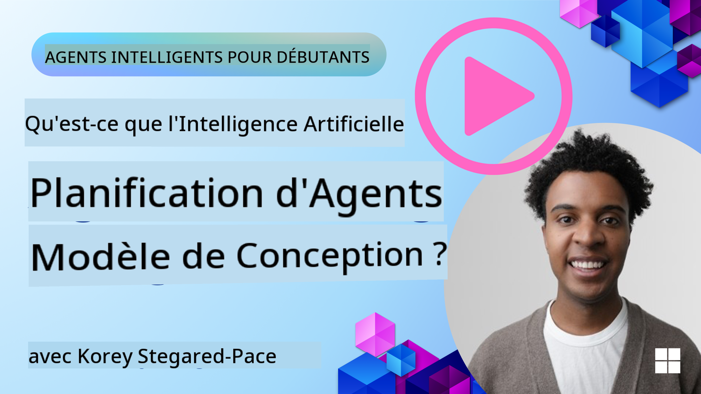

<!--
CO_OP_TRANSLATOR_METADATA:
{
  "original_hash": "8dd9a05d4dc18d3ff510e68e3798a080",
  "translation_date": "2025-03-28T10:31:59+00:00",
  "source_file": "07-planning-design\\README.md",
  "language_code": "fr"
}
-->
[](https://youtu.be/kPfJ2BrBCMY?si=9pYpPXp0sSbK91Dr)

> _(Cliquez sur l'image ci-dessus pour voir la vidéo de cette leçon)_

# Conception de la Planification

## Introduction

Cette leçon couvrira :

* Définir un objectif global clair et décomposer une tâche complexe en tâches gérables.
* Exploiter des sorties structurées pour des réponses plus fiables et lisibles par machine.
* Appliquer une approche événementielle pour gérer des tâches dynamiques et des entrées inattendues.

## Objectifs d'apprentissage

Après avoir terminé cette leçon, vous comprendrez :

* Comment identifier et définir un objectif global pour un agent IA, afin qu'il sache clairement ce qu'il doit accomplir.
* Comment décomposer une tâche complexe en sous-tâches gérables et les organiser dans une séquence logique.
* Comment équiper les agents des bons outils (par exemple, outils de recherche ou d'analyse de données), décider quand et comment les utiliser, et gérer les situations imprévues qui se présentent.
* Comment évaluer les résultats des sous-tâches, mesurer les performances et itérer les actions pour améliorer le résultat final.

## Définir l'objectif global et décomposer une tâche


La plupart des tâches du monde réel sont trop complexes pour être abordées en une seule étape. Un agent IA a besoin d'un objectif concis pour guider sa planification et ses actions. Par exemple, considérez l'objectif suivant :

    "Créer un itinéraire de voyage de 3 jours."

Bien que cet objectif soit simple à énoncer, il nécessite encore des précisions. Plus l'objectif est clair, mieux l'agent (et tout collaborateur humain) pourra se concentrer sur l'obtention du bon résultat, comme créer un itinéraire complet avec des options de vol, des recommandations d'hôtel et des suggestions d'activités.

### Décomposition des tâches

Les tâches importantes ou complexes deviennent plus faciles à gérer lorsqu'elles sont divisées en sous-tâches orientées vers un objectif.
Pour l'exemple de l'itinéraire de voyage, vous pourriez décomposer l'objectif en :

* Réservation de vol
* Réservation d'hôtel
* Location de voiture
* Personnalisation

Chaque sous-tâche peut alors être prise en charge par des agents ou des processus dédiés. Un agent pourrait se spécialiser dans la recherche des meilleures offres de vol, un autre dans la réservation d'hôtel, et ainsi de suite. Un agent coordonnateur ou "en aval" peut ensuite compiler ces résultats en un itinéraire cohérent pour l'utilisateur final.

Cette approche modulaire permet également des améliorations progressives. Par exemple, vous pourriez ajouter des agents spécialisés pour les recommandations gastronomiques ou les suggestions d'activités locales et affiner l'itinéraire au fil du temps.

### Sortie structurée

Les modèles de langage avancés (LLMs) peuvent générer des sorties structurées (par exemple, en JSON) qui sont plus faciles à analyser et à traiter pour des agents ou des services en aval. Cela est particulièrement utile dans un contexte multi-agent, où ces tâches peuvent être exécutées après réception de la sortie de planification. Consultez ceci pour un aperçu rapide.

Le snippet Python suivant illustre un agent de planification simple décomposant un objectif en sous-tâches et générant un plan structuré :

```python
from pydantic import BaseModel
from enum import Enum
from typing import List, Optional, Union
import json
import os
from typing import Optional
from pprint import pprint
from autogen_core.models import UserMessage, SystemMessage, AssistantMessage
from autogen_ext.models.azure import AzureAIChatCompletionClient
from azure.core.credentials import AzureKeyCredential

class AgentEnum(str, Enum):
    FlightBooking = "flight_booking"
    HotelBooking = "hotel_booking"
    CarRental = "car_rental"
    ActivitiesBooking = "activities_booking"
    DestinationInfo = "destination_info"
    DefaultAgent = "default_agent"
    GroupChatManager = "group_chat_manager"

# Travel SubTask Model
class TravelSubTask(BaseModel):
    task_details: str
    assigned_agent: AgentEnum  # we want to assign the task to the agent

class TravelPlan(BaseModel):
    main_task: str
    subtasks: List[TravelSubTask]
    is_greeting: bool

client = AzureAIChatCompletionClient(
    model="gpt-4o-mini",
    endpoint="https://models.inference.ai.azure.com",
    # To authenticate with the model you will need to generate a personal access token (PAT) in your GitHub settings.
    # Create your PAT token by following instructions here: https://docs.github.com/en/authentication/keeping-your-account-and-data-secure/managing-your-personal-access-tokens
    credential=AzureKeyCredential(os.environ["GITHUB_TOKEN"]),
    model_info={
        "json_output": False,
        "function_calling": True,
        "vision": True,
        "family": "unknown",
    },
)

# Define the user message
messages = [
    SystemMessage(content="""You are an planner agent.
    Your job is to decide which agents to run based on the user's request.
                      Provide your response in JSON format with the following structure:
{'main_task': 'Plan a family trip from Singapore to Melbourne.',
 'subtasks': [{'assigned_agent': 'flight_booking',
               'task_details': 'Book round-trip flights from Singapore to '
                               'Melbourne.'}
    Below are the available agents specialised in different tasks:
    - FlightBooking: For booking flights and providing flight information
    - HotelBooking: For booking hotels and providing hotel information
    - CarRental: For booking cars and providing car rental information
    - ActivitiesBooking: For booking activities and providing activity information
    - DestinationInfo: For providing information about destinations
    - DefaultAgent: For handling general requests""", source="system"),
    UserMessage(
        content="Create a travel plan for a family of 2 kids from Singapore to Melboune", source="user"),
]

response = await client.create(messages=messages, extra_create_args={"response_format": 'json_object'})

response_content: Optional[str] = response.content if isinstance(
    response.content, str) else None
if response_content is None:
    raise ValueError("Response content is not a valid JSON string" )

pprint(json.loads(response_content))

# # Ensure the response content is a valid JSON string before loading it
# response_content: Optional[str] = response.content if isinstance(
#     response.content, str) else None
# if response_content is None:
#     raise ValueError("Response content is not a valid JSON string")

# # Print the response content after loading it as JSON
# pprint(json.loads(response_content))

# Validate the response content with the MathReasoning model
# TravelPlan.model_validate(json.loads(response_content))
```

### Agent de planification avec orchestration multi-agent

Dans cet exemple, un agent routeur sémantique reçoit une demande utilisateur (par exemple, "J'ai besoin d'un plan hôtelier pour mon voyage.").

Le planificateur :

* Reçoit le plan hôtelier : Le planificateur prend le message de l'utilisateur et, sur la base d'un prompt système (incluant les détails des agents disponibles), génère un plan de voyage structuré.
* Liste les agents et leurs outils : Le registre des agents contient une liste d'agents (par exemple, pour les vols, les hôtels, la location de voiture et les activités) ainsi que les fonctions ou outils qu'ils proposent.
* Route le plan vers les agents concernés : En fonction du nombre de sous-tâches, le planificateur envoie soit directement le message à un agent dédié (pour les scénarios de tâche unique), soit coordonne via un gestionnaire de chat de groupe pour une collaboration multi-agent.
* Résume le résultat : Enfin, le planificateur résume le plan généré pour plus de clarté.
Le code Python suivant illustre ces étapes :

```python

from pydantic import BaseModel

from enum import Enum
from typing import List, Optional, Union

class AgentEnum(str, Enum):
    FlightBooking = "flight_booking"
    HotelBooking = "hotel_booking"
    CarRental = "car_rental"
    ActivitiesBooking = "activities_booking"
    DestinationInfo = "destination_info"
    DefaultAgent = "default_agent"
    GroupChatManager = "group_chat_manager"

# Travel SubTask Model

class TravelSubTask(BaseModel):
    task_details: str
    assigned_agent: AgentEnum # we want to assign the task to the agent

class TravelPlan(BaseModel):
    main_task: str
    subtasks: List[TravelSubTask]
    is_greeting: bool
import json
import os
from typing import Optional

from autogen_core.models import UserMessage, SystemMessage, AssistantMessage
from autogen_ext.models.openai import AzureOpenAIChatCompletionClient

# Create the client with type-checked environment variables

client = AzureOpenAIChatCompletionClient(
    azure_deployment=os.getenv("AZURE_OPENAI_DEPLOYMENT_NAME"),
    model=os.getenv("AZURE_OPENAI_DEPLOYMENT_NAME"),
    api_version=os.getenv("AZURE_OPENAI_API_VERSION"),
    azure_endpoint=os.getenv("AZURE_OPENAI_ENDPOINT"),
    api_key=os.getenv("AZURE_OPENAI_API_KEY"),
)

from pprint import pprint

# Define the user message

messages = [
    SystemMessage(content="""You are an planner agent.
    Your job is to decide which agents to run based on the user's request.
    Below are the available agents specialized in different tasks:
    - FlightBooking: For booking flights and providing flight information
    - HotelBooking: For booking hotels and providing hotel information
    - CarRental: For booking cars and providing car rental information
    - ActivitiesBooking: For booking activities and providing activity information
    - DestinationInfo: For providing information about destinations
    - DefaultAgent: For handling general requests""", source="system"),
    UserMessage(content="Create a travel plan for a family of 2 kids from Singapore to Melbourne", source="user"),
]

response = await client.create(messages=messages, extra_create_args={"response_format": TravelPlan})

# Ensure the response content is a valid JSON string before loading it

response_content: Optional[str] = response.content if isinstance(response.content, str) else None
if response_content is None:
    raise ValueError("Response content is not a valid JSON string")

# Print the response content after loading it as JSON

pprint(json.loads(response_content))
```

Voici la sortie du code précédent que vous pouvez ensuite utiliser pour diriger vers `assigned_agent` et résumer le plan de voyage à l'utilisateur final.

```json
{
    "is_greeting": "False",
    "main_task": "Plan a family trip from Singapore to Melbourne.",
    "subtasks": [
        {
            "assigned_agent": "flight_booking",
            "task_details": "Book round-trip flights from Singapore to Melbourne."
        },
        {
            "assigned_agent": "hotel_booking",
            "task_details": "Find family-friendly hotels in Melbourne."
        },
        {
            "assigned_agent": "car_rental",
            "task_details": "Arrange a car rental suitable for a family of four in Melbourne."
        },
        {
            "assigned_agent": "activities_booking",
            "task_details": "List family-friendly activities in Melbourne."
        },
        {
            "assigned_agent": "destination_info",
            "task_details": "Provide information about Melbourne as a travel destination."
        }
    ]
}
```

Un notebook avec l'exemple de code précédent est disponible [ici](../../../07-planning-design/07-autogen.ipynb).

### Planification itérative

Certaines tâches nécessitent un aller-retour ou une re-planification, où le résultat d'une sous-tâche influence la suivante. Par exemple, si l'agent découvre un format de données inattendu lors de la réservation de vols, il pourrait devoir adapter sa stratégie avant de passer à la réservation d'hôtel.

De plus, les retours de l'utilisateur (par exemple, un humain décidant qu'il préfère un vol plus tôt) peuvent déclencher une re-planification partielle. Cette approche dynamique et itérative garantit que la solution finale s'aligne sur les contraintes du monde réel et les préférences évolutives de l'utilisateur.

Exemple de code :

```python
from autogen_core.models import UserMessage, SystemMessage, AssistantMessage
#.. same as previous code and pass on the user history, current plan
messages = [
    SystemMessage(content="""You are a planner agent to optimize the
    Your job is to decide which agents to run based on the user's request.
    Below are the available agents specialized in different tasks:
    - FlightBooking: For booking flights and providing flight information
    - HotelBooking: For booking hotels and providing hotel information
    - CarRental: For booking cars and providing car rental information
    - ActivitiesBooking: For booking activities and providing activity information
    - DestinationInfo: For providing information about destinations
    - DefaultAgent: For handling general requests""", source="system"),
    UserMessage(content="Create a travel plan for a family of 2 kids from Singapore to Melbourne", source="user"),
    AssistantMessage(content=f"Previous travel plan - {TravelPlan}", source="assistant")
]
# .. re-plan and send the tasks to respective agents
```

Pour une planification plus complète, consultez Magnetic One pour résoudre des tâches complexes.

## Résumé

Dans cet article, nous avons examiné un exemple de création d'un planificateur capable de sélectionner dynamiquement les agents disponibles définis. La sortie du planificateur décompose les tâches et assigne les agents afin qu'elles puissent être exécutées. Il est supposé que les agents ont accès aux fonctions/outils nécessaires pour accomplir la tâche. En plus des agents, vous pouvez inclure d'autres modèles comme la réflexion, le résumé et le chat en alternance pour une personnalisation supplémentaire.

## Ressources supplémentaires

* AutoGen Magnetic One - Un système multi-agent généraliste pour résoudre des tâches complexes, qui a obtenu des résultats impressionnants sur plusieurs benchmarks d'agents difficiles. Référence : . Dans cette implémentation, l'orchestrateur crée un plan spécifique à la tâche et délègue ces tâches aux agents disponibles. En plus de la planification, l'orchestrateur utilise également un mécanisme de suivi pour surveiller l'avancement de la tâche et re-planifier si nécessaire.

## Leçon précédente

[Construire des agents IA fiables](../06-building-trustworthy-agents/README.md)

## Leçon suivante

[Modèle de conception multi-agent](../08-multi-agent/README.md)

**Avertissement** :  
Ce document a été traduit à l'aide du service de traduction automatique [Co-op Translator](https://github.com/Azure/co-op-translator). Bien que nous nous efforcions d'assurer l'exactitude, veuillez noter que les traductions automatisées peuvent contenir des erreurs ou des inexactitudes. Le document original dans sa langue d'origine doit être considéré comme la source faisant autorité. Pour des informations critiques, il est recommandé de recourir à une traduction professionnelle effectuée par un humain. Nous ne sommes pas responsables des malentendus ou des interprétations erronées résultant de l'utilisation de cette traduction.