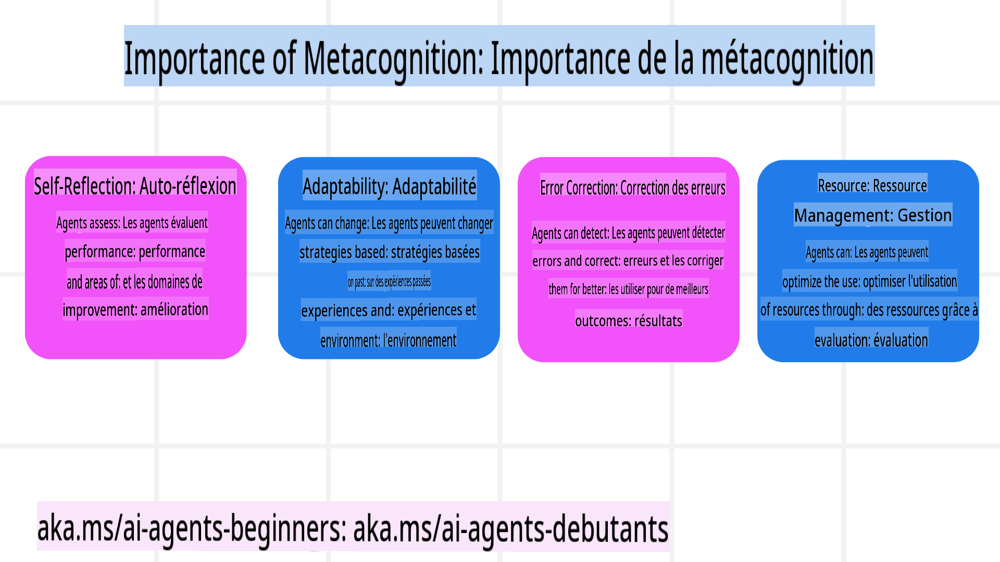

```markdown
# Métacognition chez les Agents IA

## Introduction

Bienvenue dans le cours sur la métacognition chez les agents IA ! Ce chapitre est conçu pour les débutants curieux de savoir comment les agents IA peuvent réfléchir à leurs propres processus de pensée. À la fin de cette leçon, vous comprendrez les concepts clés et serez équipé d'exemples pratiques pour appliquer la métacognition dans la conception d'agents IA.

## Objectifs d'apprentissage

Après avoir terminé cette leçon, vous serez capable de :

1. Comprendre les implications des boucles de raisonnement dans les définitions d'agents.
2. Utiliser des techniques de planification et d'évaluation pour aider les agents à s'auto-corriger.
3. Créer vos propres agents capables de manipuler du code pour accomplir des tâches.

## Introduction à la Métacognition

La métacognition fait référence aux processus cognitifs de haut niveau impliquant la réflexion sur sa propre pensée. Pour les agents IA, cela signifie être capable d'évaluer et d'ajuster leurs actions en fonction de leur conscience de soi et de leurs expériences passées.

### Qu'est-ce que la Métacognition ?

La métacognition, ou "penser à penser", est un processus cognitif de haut niveau qui implique la conscience de soi et la régulation de ses propres processus cognitifs. Dans le domaine de l'IA, la métacognition permet aux agents d'évaluer et d'adapter leurs stratégies et actions, ce qui conduit à une amélioration des capacités de résolution de problèmes et de prise de décision. En comprenant la métacognition, vous pouvez concevoir des agents IA non seulement plus intelligents, mais aussi plus adaptables et efficaces.

### Importance de la Métacognition chez les Agents IA

La métacognition joue un rôle crucial dans la conception des agents IA pour plusieurs raisons :



- **Auto-réflexion** : Les agents peuvent évaluer leurs performances et identifier les domaines à améliorer.
- **Adaptabilité** : Les agents peuvent modifier leurs stratégies en fonction des expériences passées et des environnements changeants.
- **Correction d'erreurs** : Les agents peuvent détecter et corriger les erreurs de manière autonome, ce qui conduit à des résultats plus précis.
- **Gestion des ressources** : Les agents peuvent optimiser l'utilisation des ressources, telles que le temps et la puissance de calcul, en planifiant et en évaluant leurs actions.

## Composants d'un Agent IA

Avant d'explorer les processus métacognitifs, il est essentiel de comprendre les composants de base d'un agent IA. Un agent IA se compose généralement de :

- **Persona** : La personnalité et les caractéristiques de l'agent, qui définissent comment il interagit avec les utilisateurs.
- **Outils** : Les capacités et fonctions que l'agent peut exécuter.
- **Compétences** : Les connaissances et l'expertise que possède l'agent.

Ces composants travaillent ensemble pour créer une "unité d'expertise" capable d'accomplir des tâches spécifiques.

**Exemple** : Considérez un agent de voyage qui non seulement planifie vos vacances, mais ajuste également son chemin en fonction des données en temps réel et des expériences des clients précédents.

### Exemple : Métacognition dans un Service d'Agent de Voyage

Imaginez que vous concevez un service d'agent de voyage alimenté par l'IA. Cet agent, "Agent de Voyage", aide les utilisateurs à planifier leurs vacances. Pour intégrer la métacognition, l'agent doit évaluer et ajuster ses actions en fonction de sa conscience de soi et de ses expériences passées.

#### Tâche actuelle

La tâche actuelle est d'aider un utilisateur à planifier un voyage à Paris.

#### Étapes pour accomplir la tâche

1. **Recueillir les préférences de l'utilisateur** : Demandez à l'utilisateur ses dates de voyage, son budget, ses intérêts (par exemple, musées, cuisine, shopping) et toute exigence spécifique.
2. **Récupérer des informations** : Recherchez des options de vol, d'hébergement, d'attractions et de restaurants correspondant aux préférences de l'utilisateur.
3. **Générer des recommandations** : Fournissez un itinéraire personnalisé avec les détails des vols, les réservations d'hôtel et les activités suggérées.
4. **Ajuster en fonction des retours** : Demandez à l'utilisateur des retours sur les recommandations et apportez les ajustements nécessaires.

#### Ressources nécessaires

- Accès aux bases de données de réservation de vols et d'hôtels.
- Informations sur les attractions et restaurants parisiens.
- Données de retour des utilisateurs issues des interactions précédentes.

#### Expérience et auto-réflexion

L'Agent de Voyage utilise la métacognition pour évaluer ses performances et apprendre de ses expériences passées. Par exemple :

1. **Analyse des retours utilisateurs** : L'agent examine les retours pour déterminer quelles recommandations ont été bien reçues et lesquelles ne l'ont pas été. Il ajuste ses suggestions futures en conséquence.
2. **Adaptabilité** : Si un utilisateur a précédemment mentionné qu'il n'aime pas les lieux bondés, l'agent évitera de recommander des sites touristiques populaires pendant les heures de pointe à l'avenir.
3. **Correction d'erreurs** : Si l'agent a commis une erreur lors d'une réservation passée, comme suggérer un hôtel complet, il apprend à vérifier plus rigoureusement la disponibilité avant de faire des recommandations.

#### Exemple pratique pour les développeurs

Voici un exemple simplifié de la manière dont le code de l'Agent de Voyage pourrait intégrer la métacognition :

```python
class Travel_Agent:
    def __init__(self):
        self.user_preferences = {}
        self.experience_data = []

    def gather_preferences(self, preferences):
        self.user_preferences = preferences

    def retrieve_information(self):
        # Search for flights, hotels, and attractions based on preferences
        flights = search_flights(self.user_preferences)
        hotels = search_hotels(self.user_preferences)
        attractions = search_attractions(self.user_preferences)
        return flights, hotels, attractions

    def generate_recommendations(self):
        flights, hotels, attractions = self.retrieve_information()
        itinerary = create_itinerary(flights, hotels, attractions)
        return itinerary

    def adjust_based_on_feedback(self, feedback):
        self.experience_data.append(feedback)
        # Analyze feedback and adjust future recommendations
        self.user_preferences = adjust_preferences(self.user_preferences, feedback)

# Example usage
travel_agent = Travel_Agent()
preferences = {
    "destination": "Paris",
    "dates": "2025-04-01 to 2025-04-10",
    "budget": "moderate",
    "interests": ["museums", "cuisine"]
}
travel_agent.gather_preferences(preferences)
itinerary = travel_agent.generate_recommendations()
print("Suggested Itinerary:", itinerary)
feedback = {"liked": ["Louvre Museum"], "disliked": ["Eiffel Tower (too crowded)"]}
travel_agent.adjust_based_on_feedback(feedback)
```

#### Pourquoi la Métacognition est-elle importante ?

- **Auto-réflexion** : Les agents peuvent analyser leurs performances et identifier les domaines à améliorer.
- **Adaptabilité** : Les agents peuvent modifier leurs stratégies en fonction des retours et des conditions changeantes.
- **Correction d'erreurs** : Les agents peuvent détecter et corriger les erreurs de manière autonome.
- **Gestion des ressources** : Les agents peuvent optimiser l'utilisation des ressources, telles que le temps et la puissance de calcul.

En intégrant la métacognition, l'Agent de Voyage peut fournir des recommandations de voyage plus personnalisées et précises, améliorant ainsi l'expérience utilisateur globale.

---

## 2. Planification chez les Agents

La planification est un élément crucial du comportement des agents IA. Elle consiste à définir les étapes nécessaires pour atteindre un objectif, en tenant compte de l'état actuel, des ressources et des obstacles possibles.

### Éléments de la Planification

- **Tâche actuelle** : Définir clairement la tâche.
- **Étapes pour accomplir la tâche** : Découper la tâche en étapes gérables.
- **Ressources nécessaires** : Identifier les ressources nécessaires.
- **Expérience** : Utiliser les expériences passées pour informer la planification.

**Exemple** : Voici les étapes que l'Agent de Voyage doit suivre pour aider un utilisateur à planifier son voyage efficacement :

### Étapes pour l'Agent de Voyage

1. **Recueillir les préférences de l'utilisateur**
   - Demandez à l'utilisateur des détails sur ses dates de voyage, son budget, ses intérêts et toute exigence spécifique.
   - Exemples : "Quand prévoyez-vous de voyager ?" "Quelle est votre gamme de budget ?" "Quelles activités aimez-vous pendant vos vacances ?"

2. **Récupérer des informations**
   - Recherchez des options de voyage pertinentes en fonction des préférences de l'utilisateur.
   - **Vols** : Recherchez des vols disponibles dans le budget et les dates de voyage de l'utilisateur.
   - **Hébergements** : Trouvez des hôtels ou des propriétés locatives correspondant aux préférences de l'utilisateur en termes d'emplacement, de prix et d'équipements.
   - **Attractions et restaurants** : Identifiez des attractions populaires, des activités et des options de restauration alignées sur les intérêts de l'utilisateur.

3. **Générer des recommandations**
   - Compilez les informations récupérées dans un itinéraire personnalisé.
   - Fournissez des détails tels que les options de vol, les réservations d'hôtel et les activités suggérées, en veillant à adapter les recommandations aux préférences de l'utilisateur.

4. **Présenter l'itinéraire à l'utilisateur**
   - Partagez l'itinéraire proposé avec l'utilisateur pour qu'il le passe en revue.
   - Exemple : "Voici un itinéraire suggéré pour votre voyage à Paris. Il inclut les détails des vols, les réservations d'hôtel et une liste d'activités et de restaurants recommandés. Faites-moi savoir ce que vous en pensez !"

5. **Recueillir des retours**
   - Demandez à l'utilisateur des retours sur l'itinéraire proposé.
   - Exemples : "Les options de vol vous conviennent-elles ?" "L'hôtel correspond-il à vos besoins ?" "Y a-t-il des activités que vous souhaitez ajouter ou supprimer ?"

6. **Ajuster en fonction des retours**
   - Modifiez l'itinéraire en fonction des retours de l'utilisateur.
   - Apportez les changements nécessaires aux recommandations de vol, d'hébergement et d'activités pour mieux correspondre aux préférences de l'utilisateur.

7. **Confirmation finale**
   - Présentez l'itinéraire mis à jour à l'utilisateur pour confirmation finale.
   - Exemple : "J'ai apporté les ajustements en fonction de vos retours. Voici l'itinéraire mis à jour. Tout vous semble-t-il correct ?"

8. **Réserver et confirmer les réservations**
   - Une fois que l'utilisateur approuve l'itinéraire, procédez à la réservation des vols, des hébergements et des activités pré-planifiées.
   - Envoyez les détails de confirmation à l'utilisateur.

9. **Fournir un support continu**
   - Restez disponible pour aider l'utilisateur avec des modifications ou des demandes supplémentaires avant et pendant son voyage.
   - Exemple : "Si vous avez besoin d'une assistance supplémentaire pendant votre voyage, n'hésitez pas à me contacter à tout moment !"

### Exemple d'interaction

```python
class Travel_Agent:
    def __init__(self):
        self.user_preferences = {}
        self.experience_data = []

    def gather_preferences(self, preferences):
        self.user_preferences = preferences

    def retrieve_information(self):
        flights = search_flights(self.user_preferences)
        hotels = search_hotels(self.user_preferences)
        attractions = search_attractions(self.user_preferences)
        return flights, hotels, attractions

    def generate_recommendations(self):
        flights, hotels, attractions = self.retrieve_information()
        itinerary = create_itinerary(flights, hotels, attractions)
        return itinerary

    def adjust_based_on_feedback(self, feedback):
        self.experience_data.append(feedback)
        self.user_preferences = adjust_preferences(self.user_preferences, feedback)

# Example usage within a booing request
travel_agent = Travel_Agent()
preferences = {
    "destination": "Paris",
    "dates": "2025-04-01 to 2025-04-10",
    "budget": "moderate",
    "interests": ["museums", "cuisine"]
}
travel_agent.gather_preferences(preferences)
itinerary = travel_agent.generate_recommendations()
print("Suggested Itinerary:", itinerary)
feedback = {"liked": ["Louvre Museum"], "disliked": ["Eiffel Tower (too crowded)"]}
travel_agent.adjust_based_on_feedback(feedback)
```
```
```markdown
L'agent de voyage formule de nouvelles requêtes de recherche en fonction des retours des utilisateurs.  
- Exemple : ```python
       if "disliked" in feedback:
           preferences["avoid"] = feedback["disliked"]
       ```  
- **Outil** : L'agent de voyage utilise des algorithmes pour classer et filtrer les nouveaux résultats de recherche, en mettant l'accent sur la pertinence basée sur les retours des utilisateurs.  
- Exemple : ```python
       new_attractions = search_attractions(preferences)
       new_itinerary = create_itinerary(flights, hotels, new_attractions)
       print("Updated Itinerary:", new_itinerary)
       ```  
- **Évaluation** : L'agent de voyage évalue en continu la pertinence et l'exactitude de ses recommandations en analysant les retours des utilisateurs et en effectuant les ajustements nécessaires.  
- Exemple : ```python
       def adjust_preferences(preferences, feedback):
           if "liked" in feedback:
               preferences["favorites"] = feedback["liked"]
           if "disliked" in feedback:
               preferences["avoid"] = feedback["disliked"]
           return preferences

       preferences = adjust_preferences(preferences, feedback)
       ```  

#### Exemple pratique  
Voici un exemple simplifié de code Python intégrant l'approche Corrective RAG dans l'agent de voyage :  
```python
class Travel_Agent:
    def __init__(self):
        self.user_preferences = {}
        self.experience_data = []

    def gather_preferences(self, preferences):
        self.user_preferences = preferences

    def retrieve_information(self):
        flights = search_flights(self.user_preferences)
        hotels = search_hotels(self.user_preferences)
        attractions = search_attractions(self.user_preferences)
        return flights, hotels, attractions

    def generate_recommendations(self):
        flights, hotels, attractions = self.retrieve_information()
        itinerary = create_itinerary(flights, hotels, attractions)
        return itinerary

    def adjust_based_on_feedback(self, feedback):
        self.experience_data.append(feedback)
        self.user_preferences = adjust_preferences(self.user_preferences, feedback)
        new_itinerary = self.generate_recommendations()
        return new_itinerary

# Example usage
travel_agent = Travel_Agent()
preferences = {
    "destination": "Paris",
    "dates": "2025-04-01 to 2025-04-10",
    "budget": "moderate",
    "interests": ["museums", "cuisine"]
}
travel_agent.gather_preferences(preferences)
itinerary = travel_agent.generate_recommendations()
print("Suggested Itinerary:", itinerary)
feedback = {"liked": ["Louvre Museum"], "disliked": ["Eiffel Tower (too crowded)"]}
new_itinerary = travel_agent.adjust_based_on_feedback(feedback)
print("Updated Itinerary:", new_itinerary)
```  

### Chargement de contexte préventif  
Le chargement de contexte préventif consiste à charger des informations de contexte ou des informations de base pertinentes dans le modèle avant de traiter une requête. Cela signifie que le modèle a accès à ces informations dès le départ, ce qui peut l'aider à générer des réponses plus informées sans avoir besoin de récupérer des données supplémentaires pendant le processus.  

Voici un exemple simplifié de ce à quoi pourrait ressembler un chargement de contexte préventif pour une application d'agent de voyage en Python :  
```python
class TravelAgent:
    def __init__(self):
        # Pre-load popular destinations and their information
        self.context = {
            "Paris": {"country": "France", "currency": "Euro", "language": "French", "attractions": ["Eiffel Tower", "Louvre Museum"]},
            "Tokyo": {"country": "Japan", "currency": "Yen", "language": "Japanese", "attractions": ["Tokyo Tower", "Shibuya Crossing"]},
            "New York": {"country": "USA", "currency": "Dollar", "language": "English", "attractions": ["Statue of Liberty", "Times Square"]},
            "Sydney": {"country": "Australia", "currency": "Dollar", "language": "English", "attractions": ["Sydney Opera House", "Bondi Beach"]}
        }

    def get_destination_info(self, destination):
        # Fetch destination information from pre-loaded context
        info = self.context.get(destination)
        if info:
            return f"{destination}:\nCountry: {info['country']}\nCurrency: {info['currency']}\nLanguage: {info['language']}\nAttractions: {', '.join(info['attractions'])}"
        else:
            return f"Sorry, we don't have information on {destination}."

# Example usage
travel_agent = TravelAgent()
print(travel_agent.get_destination_info("Paris"))
print(travel_agent.get_destination_info("Tokyo"))
```  

#### Explication  
1. **Initialisation (`__init__` method)**: The `TravelAgent` class pre-loads a dictionary containing information about popular destinations such as Paris, Tokyo, New York, and Sydney. This dictionary includes details like the country, currency, language, and major attractions for each destination.

2. **Retrieving Information (`get_destination_info` method)**: When a user queries about a specific destination, the `get_destination_info`)** : Cette méthode récupère les informations pertinentes à partir du dictionnaire de contexte préchargé. En préchargeant le contexte, l'application d'agent de voyage peut répondre rapidement aux requêtes des utilisateurs sans avoir à récupérer ces informations depuis une source externe en temps réel. Cela rend l'application plus efficace et réactive.  

### Démarrage du plan avec un objectif avant itération  
Démarrer un plan avec un objectif implique de commencer avec un objectif clair ou un résultat cible en tête. En définissant cet objectif dès le départ, le modèle peut l'utiliser comme principe directeur tout au long du processus itératif. Cela permet de s'assurer que chaque itération se rapproche de l'objectif souhaité, rendant le processus plus efficace et ciblé.  

Voici un exemple de la manière dont vous pourriez démarrer un plan de voyage avec un objectif avant de l'itérer pour un agent de voyage en Python :  

### Scénario  
Un agent de voyage souhaite planifier des vacances personnalisées pour un client. L'objectif est de créer un itinéraire de voyage qui maximise la satisfaction du client en fonction de ses préférences et de son budget.  

### Étapes  
1. Définir les préférences et le budget du client.  
2. Démarrer le plan initial basé sur ces préférences.  
3. Itérer pour affiner le plan, en optimisant la satisfaction du client.  

#### Code Python  
```python
class TravelAgent:
    def __init__(self, destinations):
        self.destinations = destinations

    def bootstrap_plan(self, preferences, budget):
        plan = []
        total_cost = 0

        for destination in self.destinations:
            if total_cost + destination['cost'] <= budget and self.match_preferences(destination, preferences):
                plan.append(destination)
                total_cost += destination['cost']

        return plan

    def match_preferences(self, destination, preferences):
        for key, value in preferences.items():
            if destination.get(key) != value:
                return False
        return True

    def iterate_plan(self, plan, preferences, budget):
        for i in range(len(plan)):
            for destination in self.destinations:
                if destination not in plan and self.match_preferences(destination, preferences) and self.calculate_cost(plan, destination) <= budget:
                    plan[i] = destination
                    break
        return plan

    def calculate_cost(self, plan, new_destination):
        return sum(destination['cost'] for destination in plan) + new_destination['cost']

# Example usage
destinations = [
    {"name": "Paris", "cost": 1000, "activity": "sightseeing"},
    {"name": "Tokyo", "cost": 1200, "activity": "shopping"},
    {"name": "New York", "cost": 900, "activity": "sightseeing"},
    {"name": "Sydney", "cost": 1100, "activity": "beach"},
]

preferences = {"activity": "sightseeing"}
budget = 2000

travel_agent = TravelAgent(destinations)
initial_plan = travel_agent.bootstrap_plan(preferences, budget)
print("Initial Plan:", initial_plan)

refined_plan = travel_agent.iterate_plan(initial_plan, preferences, budget)
print("Refined Plan:", refined_plan)
```  

#### Explication du code  
1. **Initialisation (`__init__` method)**: The `TravelAgent` class is initialized with a list of potential destinations, each having attributes like name, cost, and activity type.

2. **Bootstrapping the Plan (`bootstrap_plan` method)**: This method creates an initial travel plan based on the client's preferences and budget. It iterates through the list of destinations and adds them to the plan if they match the client's preferences and fit within the budget.

3. **Matching Preferences (`match_preferences` method)**: This method checks if a destination matches the client's preferences.

4. **Iterating the Plan (`iterate_plan` method)**: This method refines the initial plan by trying to replace each destination in the plan with a better match, considering the client's preferences and budget constraints.

5. **Calculating Cost (`calculate_cost`)** : Cette méthode calcule le coût total du plan actuel, y compris une éventuelle nouvelle destination.  

#### Exemple d'utilisation  
- **Plan initial** : L'agent de voyage crée un plan initial basé sur les préférences du client pour des visites touristiques et un budget de 2000 $.  
- **Plan affiné** : L'agent de voyage itère le plan, en optimisant les préférences et le budget du client.  

En démarrant le plan avec un objectif clair (par exemple, maximiser la satisfaction du client) et en l'itérant pour l'affiner, l'agent de voyage peut créer un itinéraire de voyage personnalisé et optimisé pour le client. Cette approche garantit que le plan de voyage s'aligne sur les préférences et le budget du client dès le départ et s'améliore à chaque itération.  

### Tirer parti des LLM pour le re-classement et le scoring  
Les grands modèles de langage (LLM) peuvent être utilisés pour le re-classement et le scoring en évaluant la pertinence et la qualité des documents récupérés ou des réponses générées. Voici comment cela fonctionne :  

**Récupération :** La première étape de récupération extrait un ensemble de documents ou de réponses candidats en fonction de la requête.  
**Re-classement :** Le LLM évalue ces candidats et les re-classe en fonction de leur pertinence et de leur qualité. Cette étape garantit que les informations les plus pertinentes et de haute qualité sont présentées en premier.  
**Scoring :** Le LLM attribue des scores à chaque candidat, reflétant leur pertinence et leur qualité. Cela aide à sélectionner la meilleure réponse ou le meilleur document pour l'utilisateur.  

En tirant parti des LLM pour le re-classement et le scoring, le système peut fournir des informations plus précises et contextuellement pertinentes, améliorant ainsi l'expérience utilisateur globale.  

Voici un exemple de la manière dont un agent de voyage pourrait utiliser un grand modèle de langage (LLM) pour re-classer et scorer des destinations de voyage en fonction des préférences des utilisateurs en Python :  

#### Scénario - Voyage basé sur les préférences  
Un agent de voyage souhaite recommander les meilleures destinations de voyage à un client en fonction de ses préférences. Le LLM aidera à re-classer et scorer les destinations pour s'assurer que les options les plus pertinentes sont présentées.  

#### Étapes :  
1. Collecter les préférences de l'utilisateur.  
2. Récupérer une liste de destinations potentielles.  
3. Utiliser le LLM pour re-classer et scorer les destinations en fonction des préférences de l'utilisateur.  

Voici comment vous pouvez mettre à jour l'exemple précédent pour utiliser Azure OpenAI Services :  

#### Prérequis  
1. Vous devez avoir un abonnement Azure.  
2. Créez une ressource Azure OpenAI et obtenez votre clé API.  

#### Exemple de code Python  
```python
import requests
import json

class TravelAgent:
    def __init__(self, destinations):
        self.destinations = destinations

    def get_recommendations(self, preferences, api_key, endpoint):
        # Generate a prompt for the Azure OpenAI
        prompt = self.generate_prompt(preferences)
        
        # Define headers and payload for the request
        headers = {
            'Content-Type': 'application/json',
            'Authorization': f'Bearer {api_key}'
        }
        payload = {
            "prompt": prompt,
            "max_tokens": 150,
            "temperature": 0.7
        }
        
        # Call the Azure OpenAI API to get the re-ranked and scored destinations
        response = requests.post(endpoint, headers=headers, json=payload)
        response_data = response.json()
        
        # Extract and return the recommendations
        recommendations = response_data['choices'][0]['text'].strip().split('\n')
        return recommendations

    def generate_prompt(self, preferences):
        prompt = "Here are the travel destinations ranked and scored based on the following user preferences:\n"
        for key, value in preferences.items():
            prompt += f"{key}: {value}\n"
        prompt += "\nDestinations:\n"
        for destination in self.destinations:
            prompt += f"- {destination['name']}: {destination['description']}\n"
        return prompt

# Example usage
destinations = [
    {"name": "Paris", "description": "City of lights, known for its art, fashion, and culture."},
    {"name": "Tokyo", "description": "Vibrant city, famous for its modernity and traditional temples."},
    {"name": "New York", "description": "The city that never sleeps, with iconic landmarks and diverse culture."},
    {"name": "Sydney", "description": "Beautiful harbour city, known for its opera house and stunning beaches."},
]

preferences = {"activity": "sightseeing", "culture": "diverse"}
api_key = 'your_azure_openai_api_key'
endpoint = 'https://your-endpoint.com/openai/deployments/your-deployment-name/completions?api-version=2022-12-01'

travel_agent = TravelAgent(destinations)
recommendations = travel_agent.get_recommendations(preferences, api_key, endpoint)
print("Recommended Destinations:")
for rec in recommendations:
    print(rec)
```  

#### Explication du code - Préférences de réservation  
1. **Initialisation** : Le `TravelAgent` class is initialized with a list of potential travel destinations, each having attributes like name and description.

2. **Getting Recommendations (`get_recommendations` method)**: This method generates a prompt for the Azure OpenAI service based on the user's preferences and makes an HTTP POST request to the Azure OpenAI API to get re-ranked and scored destinations.

3. **Generating Prompt (`generate_prompt` method)**: This method constructs a prompt for the Azure OpenAI, including the user's preferences and the list of destinations. The prompt guides the model to re-rank and score the destinations based on the provided preferences.

4. **API Call**: The `requests` library is used to make an HTTP POST request to the Azure OpenAI API endpoint. The response contains the re-ranked and scored destinations.

5. **Example Usage**: The travel agent collects user preferences (e.g., interest in sightseeing and diverse culture) and uses the Azure OpenAI service to get re-ranked and scored recommendations for travel destinations.

Make sure to replace `your_azure_openai_api_key` with your actual Azure OpenAI API key and `https://your-endpoint.com/...` avec l'URL réelle de point de terminaison de votre déploiement Azure OpenAI.  

En tirant parti du LLM pour le re-classement et le scoring, l'agent de voyage peut fournir des recommandations de voyage plus personnalisées et pertinentes aux clients, améliorant ainsi leur expérience globale.  
```
```markdown
les meilleurs musées à Paris ?"). - **Intention de navigation** : L'utilisateur souhaite accéder à un site web ou une page spécifique (par exemple, "site officiel du Musée du Louvre"). - **Intention transactionnelle** : L'utilisateur vise à effectuer une transaction, comme réserver un vol ou effectuer un achat (par exemple, "Réserver un vol pour Paris"). 2. **Conscience du contexte** : - L'analyse du contexte de la requête de l'utilisateur aide à identifier précisément son intention. Cela inclut la prise en compte des interactions précédentes, des préférences de l'utilisateur et des détails spécifiques de la requête actuelle. 3. **Traitement du langage naturel (NLP)** : - Les techniques de NLP sont utilisées pour comprendre et interpréter les requêtes en langage naturel fournies par les utilisateurs. Cela inclut des tâches comme la reconnaissance d'entités, l'analyse de sentiment et le parsing des requêtes. 4. **Personnalisation** : - Personnaliser les résultats de recherche en fonction de l'historique, des préférences et des retours de l'utilisateur améliore la pertinence des informations récupérées. #### Exemple pratique : Recherche avec intention dans Travel Agent Prenons Travel Agent comme exemple pour voir comment la recherche avec intention peut être mise en œuvre. 1. **Collecte des préférences de l'utilisateur** ```python
   class Travel_Agent:
       def __init__(self):
           self.user_preferences = {}

       def gather_preferences(self, preferences):
           self.user_preferences = preferences
   ``` 2. **Compréhension de l'intention de l'utilisateur** ```python
   def identify_intent(query):
       if "book" in query or "purchase" in query:
           return "transactional"
       elif "website" in query or "official" in query:
           return "navigational"
       else:
           return "informational"
   ``` 3. **Conscience du contexte** ```python
   def analyze_context(query, user_history):
       # Combine current query with user history to understand context
       context = {
           "current_query": query,
           "user_history": user_history
       }
       return context
   ``` 4. **Recherche et personnalisation des résultats** ```python
   def search_with_intent(query, preferences, user_history):
       intent = identify_intent(query)
       context = analyze_context(query, user_history)
       if intent == "informational":
           search_results = search_information(query, preferences)
       elif intent == "navigational":
           search_results = search_navigation(query)
       elif intent == "transactional":
           search_results = search_transaction(query, preferences)
       personalized_results = personalize_results(search_results, user_history)
       return personalized_results

   def search_information(query, preferences):
       # Example search logic for informational intent
       results = search_web(f"best {preferences['interests']} in {preferences['destination']}")
       return results

   def search_navigation(query):
       # Example search logic for navigational intent
       results = search_web(query)
       return results

   def search_transaction(query, preferences):
       # Example search logic for transactional intent
       results = search_web(f"book {query} to {preferences['destination']}")
       return results

   def personalize_results(results, user_history):
       # Example personalization logic
       personalized = [result for result in results if result not in user_history]
       return personalized[:10]  # Return top 10 personalized results
   ``` 5. **Exemple d'utilisation** ```python
   travel_agent = Travel_Agent()
   preferences = {
       "destination": "Paris",
       "interests": ["museums", "cuisine"]
   }
   travel_agent.gather_preferences(preferences)
   user_history = ["Louvre Museum website", "Book flight to Paris"]
   query = "best museums in Paris"
   results = search_with_intent(query, preferences, user_history)
   print("Search Results:", results)
   ``` --- ## 4. Génération de code comme outil Les agents générateurs de code utilisent des modèles d'IA pour écrire et exécuter du code, résoudre des problèmes complexes et automatiser des tâches. ### Agents générateurs de code Les agents générateurs de code utilisent des modèles d'IA générative pour écrire et exécuter du code. Ces agents peuvent résoudre des problèmes complexes, automatiser des tâches et fournir des informations précieuses en générant et exécutant du code dans divers langages de programmation. #### Applications pratiques 1. **Génération de code automatisée** : Générer des extraits de code pour des tâches spécifiques, comme l'analyse de données, le web scraping ou le machine learning. 2. **SQL comme RAG** : Utiliser des requêtes SQL pour récupérer et manipuler des données à partir de bases de données. 3. **Résolution de problèmes** : Créer et exécuter du code pour résoudre des problèmes spécifiques, comme l'optimisation d'algorithmes ou l'analyse de données. #### Exemple : Agent générateur de code pour l'analyse de données Imaginez que vous conceviez un agent générateur de code. Voici comment il pourrait fonctionner : 1. **Tâche** : Analyser un jeu de données pour identifier des tendances et des modèles. 2. **Étapes** : - Charger le jeu de données dans un outil d'analyse de données. - Générer des requêtes SQL pour filtrer et agréger les données. - Exécuter les requêtes et récupérer les résultats. - Utiliser les résultats pour générer des visualisations et des insights. 3. **Ressources nécessaires** : Accès au jeu de données, outils d'analyse de données et capacités SQL. 4. **Expérience** : Utiliser les résultats d'analyses passées pour améliorer la précision et la pertinence des analyses futures. ### Exemple : Agent générateur de code pour Travel Agent Dans cet exemple, nous concevrons un agent générateur de code, Travel Agent, pour aider les utilisateurs à planifier leur voyage en générant et en exécutant du code. Cet agent peut gérer des tâches telles que la recherche d'options de voyage, le filtrage des résultats et la compilation d'un itinéraire à l'aide de l'IA générative. #### Vue d'ensemble de l'agent générateur de code 1. **Collecte des préférences de l'utilisateur** : Recueille les saisies de l'utilisateur comme la destination, les dates de voyage, le budget et les centres d'intérêt. 2. **Génération de code pour récupérer des données** : Génère des extraits de code pour récupérer des données sur les vols, hôtels et attractions. 3. **Exécution du code généré** : Exécute le code généré pour récupérer des informations en temps réel. 4. **Génération d'un itinéraire** : Compile les données récupérées dans un plan de voyage personnalisé. 5. **Ajustement en fonction des retours** : Reçoit les retours de l'utilisateur et régénère le code si nécessaire pour affiner les résultats. #### Mise en œuvre étape par étape 1. **Collecte des préférences de l'utilisateur** ```python
   class Travel_Agent:
       def __init__(self):
           self.user_preferences = {}

       def gather_preferences(self, preferences):
           self.user_preferences = preferences
   ``` 2. **Génération de code pour récupérer des données** ```python
   def generate_code_to_fetch_data(preferences):
       # Example: Generate code to search for flights based on user preferences
       code = f"""
       def search_flights():
           import requests
           response = requests.get('https://api.example.com/flights', params={preferences})
           return response.json()
       """
       return code

   def generate_code_to_fetch_hotels(preferences):
       # Example: Generate code to search for hotels
       code = f"""
       def search_hotels():
           import requests
           response = requests.get('https://api.example.com/hotels', params={preferences})
           return response.json()
       """
       return code
   ``` 3. **Exécution du code généré** ```python
   def execute_code(code):
       # Execute the generated code using exec
       exec(code)
       result = locals()
       return result

   travel_agent = Travel_Agent()
   preferences = {
       "destination": "Paris",
       "dates": "2025-04-01 to 2025-04-10",
       "budget": "moderate",
       "interests": ["museums", "cuisine"]
   }
   travel_agent.gather_preferences(preferences)
   
   flight_code = generate_code_to_fetch_data(preferences)
   hotel_code = generate_code_to_fetch_hotels(preferences)
   
   flights = execute_code(flight_code)
   hotels = execute_code(hotel_code)

   print("Flight Options:", flights)
   print("Hotel Options:", hotels)
   ``` 4. **Génération d'un itinéraire** ```python
   def generate_itinerary(flights, hotels, attractions):
       itinerary = {
           "flights": flights,
           "hotels": hotels,
           "attractions": attractions
       }
       return itinerary

   attractions = search_attractions(preferences)
   itinerary = generate_itinerary(flights, hotels, attractions)
   print("Suggested Itinerary:", itinerary)
   ``` 5. **Ajustement en fonction des retours** ```python
   def adjust_based_on_feedback(feedback, preferences):
       # Adjust preferences based on user feedback
       if "liked" in feedback:
           preferences["favorites"] = feedback["liked"]
       if "disliked" in feedback:
           preferences["avoid"] = feedback["disliked"]
       return preferences

   feedback = {"liked": ["Louvre Museum"], "disliked": ["Eiffel Tower (too crowded)"]}
   updated_preferences = adjust_based_on_feedback(feedback, preferences)
   
   # Regenerate and execute code with updated preferences
   updated_flight_code = generate_code_to_fetch_data(updated_preferences)
   updated_hotel_code = generate_code_to_fetch_hotels(updated_preferences)
   
   updated_flights = execute_code(updated_flight_code)
   updated_hotels = execute_code(updated_hotel_code)
   
   updated_itinerary = generate_itinerary(updated_flights, updated_hotels, attractions)
   print("Updated Itinerary:", updated_itinerary)
   ``` ### Exploitation de la conscience de l'environnement et du raisonnement Basée sur le schéma de la table peut en effet améliorer le processus de génération de requêtes en exploitant la conscience de l'environnement et le raisonnement. Voici un exemple de comment cela peut être fait : 1. **Compréhension du schéma** : Le système comprendra le schéma de la table et utilisera cette information pour ancrer la génération de requêtes. 2. **Ajustement en fonction des retours** : Le système ajustera les préférences de l'utilisateur en fonction des retours et réfléchira aux champs du schéma qui doivent être mis à jour. 3. **Génération et exécution des requêtes** : Le système générera et exécutera des requêtes pour récupérer des données de vols et d'hôtels mises à jour en fonction des nouvelles préférences. Voici un exemple de code Python mis à jour qui intègre ces concepts : ```python
def adjust_based_on_feedback(feedback, preferences, schema):
    # Adjust preferences based on user feedback
    if "liked" in feedback:
        preferences["favorites"] = feedback["liked"]
    if "disliked" in feedback:
        preferences["avoid"] = feedback["disliked"]
    # Reasoning based on schema to adjust other related preferences
    for field in schema:
        if field in preferences:
            preferences[field] = adjust_based_on_environment(feedback, field, schema)
    return preferences

def adjust_based_on_environment(feedback, field, schema):
    # Custom logic to adjust preferences based on schema and feedback
    if field in feedback["liked"]:
        return schema[field]["positive_adjustment"]
    elif field in feedback["disliked"]:
        return schema[field]["negative_adjustment"]
    return schema[field]["default"]

def generate_code_to_fetch_data(preferences):
    # Generate code to fetch flight data based on updated preferences
    return f"fetch_flights(preferences={preferences})"

def generate_code_to_fetch_hotels(preferences):
    # Generate code to fetch hotel data based on updated preferences
    return f"fetch_hotels(preferences={preferences})"

def execute_code(code):
    # Simulate execution of code and return mock data
    return {"data": f"Executed: {code}"}

def generate_itinerary(flights, hotels, attractions):
    # Generate itinerary based on flights, hotels, and attractions
    return {"flights": flights, "hotels": hotels, "attractions": attractions}

# Example schema
schema = {
    "favorites": {"positive_adjustment": "increase", "negative_adjustment": "decrease", "default": "neutral"},
    "avoid": {"positive_adjustment": "decrease", "negative_adjustment": "increase", "default": "neutral"}
}

# Example usage
preferences = {"favorites": "sightseeing", "avoid": "crowded places"}
feedback = {"liked": ["Louvre Museum"], "disliked": ["Eiffel Tower (too crowded)"]}
updated_preferences = adjust_based_on_feedback(feedback, preferences, schema)

# Regenerate and execute code with updated preferences
updated_flight_code = generate_code_to_fetch_data(updated_preferences)
updated_hotel_code = generate_code_to_fetch_hotels(updated_preferences)

updated_flights = execute_code(updated_flight_code)
updated_hotels = execute_code(updated_hotel_code)

updated_itinerary = generate_itinerary(updated_flights, updated_hotels, feedback["liked"])
print("Updated Itinerary:", updated_itinerary)
``` #### Explication - Réservation basée sur les retours 1. **Conscience du schéma** : La méthode `schema` dictionary defines how preferences should be adjusted based on feedback. It includes fields like `favorites` and `avoid`, with corresponding adjustments.
2. **Adjusting Preferences (`adjust_based_on_feedback` method)**: This method adjusts preferences based on user feedback and the schema.
3. **Environment-Based Adjustments (`adjust_based_on_environment` personnalise les ajustements en fonction du schéma et des retours. 4. **Génération et exécution des requêtes** : Le système génère du code pour récupérer des données de vols et d'hôtels mises à jour en fonction des préférences ajustées et simule l'exécution de ces requêtes. 5. **Génération d'un itinéraire** : Le système crée un itinéraire mis à jour basé sur les nouvelles données de vols, hôtels et attractions. En rendant le système conscient de l'environnement et en raisonnant sur la base du schéma, il peut générer des requêtes plus précises et pertinentes, conduisant à de meilleures recommandations de voyage et une expérience utilisateur plus personnalisée. ### Utilisation de SQL comme technique de génération augmentée par récupération (RAG) SQL (Structured Query Language) est un outil puissant pour interagir avec les bases de données. Lorsqu'il est utilisé dans le cadre d'une approche de génération augmentée par récupération (RAG), SQL peut récupérer des données pertinentes à partir de bases de données pour informer et générer des réponses ou des actions dans les agents IA. Explorons comment SQL peut être utilisé comme technique RAG dans le contexte de Travel Agent. #### Concepts clés 1. **Interaction avec les bases de données** : - SQL est utilisé pour interroger des bases de données, récupérer des informations pertinentes et manipuler des données. - Exemple : Récupérer les détails des vols, les informations sur les hôtels et les attractions d'une base de données de voyage. 2. **Intégration avec RAG** : - Les requêtes SQL sont générées en fonction des saisies et des préférences de l'utilisateur. - Les données récupérées sont ensuite utilisées pour générer des recommandations ou des actions personnalisées. 3. **Génération dynamique de requêtes** : - L'agent IA génère des requêtes SQL dynamiques en fonction du contexte et des besoins de l'utilisateur. - Exemple : Personnaliser les requêtes SQL pour filtrer les résultats en fonction du budget, des dates et des centres d'intérêt. #### Applications - **Génération de code automatisée** : Générer des extraits de code pour des tâches spécifiques. - **SQL comme RAG** : Utiliser des requêtes SQL pour manipuler des données. - **Résolution de problèmes** : Créer et exécuter du code pour résoudre des problèmes. **Exemple** : Un agent d'analyse de données : 1. **Tâche** : Analyser un jeu de données pour trouver des tendances. 2. **Étapes** : - Charger le jeu de données. - Générer des requêtes SQL pour filtrer les données. - Exécuter les requêtes et récupérer les résultats. - Générer des visualisations et des insights. 3. **Ressources** : Accès au jeu de données, capacités SQL. 4. **Expérience** : Utiliser les résultats passés pour améliorer les analyses futures. #### Exemple pratique : Utilisation de SQL dans Travel Agent 1. **Collecte des préférences de l'utilisateur** ```python
   class Travel_Agent:
       def __init__(self):
           self.user_preferences = {}

       def gather_preferences(self, preferences):
           self.user_preferences = preferences
   ``` 2. **Génération de requêtes SQL** ```python
   def generate_sql_query(table, preferences):
       query = f"SELECT * FROM {table} WHERE "
       conditions = []
       for key, value in preferences.items():
           conditions.append(f"{key}='{value}'")
       query += " AND ".join(conditions)
       return query
   ``` 3. **Exécution des requêtes SQL** ```python
   import sqlite3

   def execute_sql_query(query, database="travel.db"):
       connection = sqlite3.connect(database)
       cursor = connection.cursor()
       cursor.execute(query)
       results = cursor.fetchall()
       connection.close()
       return results
   ``` 4. **Génération de recommandations** ```python
   def generate_recommendations(preferences):
       flight_query = generate_sql_query("flights", preferences)
       hotel_query = generate_sql_query("hotels", preferences)
       attraction_query = generate_sql_query("attractions", preferences)
       
       flights = execute_sql_query(flight_query)
       hotels = execute_sql_query(hotel_query)
       attractions = execute_sql_query(attraction_query)
       
       itinerary = {
           "flights": flights,
           "hotels": hotels,
           "attractions": attractions
       }
       return itinerary

   travel_agent = Travel_Agent()
   preferences = {
       "destination": "Paris",
       "dates": "2025-04-01 to 2025-04-10",
       "budget": "moderate",
       "interests": ["museums", "cuisine"]
   }
   travel_agent.gather_preferences(preferences)
   itinerary = generate_recommendations(preferences)
   print("Suggested Itinerary:", itinerary)
   ``` #### Exemples de requêtes SQL 1. **Requête de vol** ```sql
   SELECT * FROM flights WHERE destination='Paris' AND dates='2025-04-01 to 2025-04-10' AND budget='moderate';
   ``` 2. **Requête d'hôtel** ```sql
   SELECT * FROM hotels WHERE destination='Paris' AND budget='moderate';
   ``` 3. **Requête d'attraction** ```sql
   SELECT * FROM attractions WHERE destination='Paris' AND interests='museums, cuisine';
   ``` En exploitant SQL dans le cadre de la technique de génération augmentée par récupération (RAG), les agents IA comme Travel Agent peuvent récupérer et utiliser dynamiquement des données pertinentes pour fournir des recommandations précises et personnalisées. ### Conclusion La métacognition est un outil puissant qui peut améliorer considérablement les capacités des agents IA. En intégrant des processus métacognitifs, vous pouvez concevoir des agents plus intelligents, adaptatifs et efficaces. Utilisez les ressources supplémentaires pour explorer davantage le monde fascinant de la métacognition dans les agents IA.
```

**Avertissement** :  
Ce document a été traduit à l'aide de services de traduction automatisée par intelligence artificielle. Bien que nous nous efforcions d'assurer l'exactitude, veuillez noter que les traductions automatiques peuvent contenir des erreurs ou des inexactitudes. Le document original dans sa langue d'origine doit être considéré comme la source faisant autorité. Pour des informations critiques, une traduction humaine professionnelle est recommandée. Nous déclinons toute responsabilité en cas de malentendus ou d'interprétations erronées résultant de l'utilisation de cette traduction.