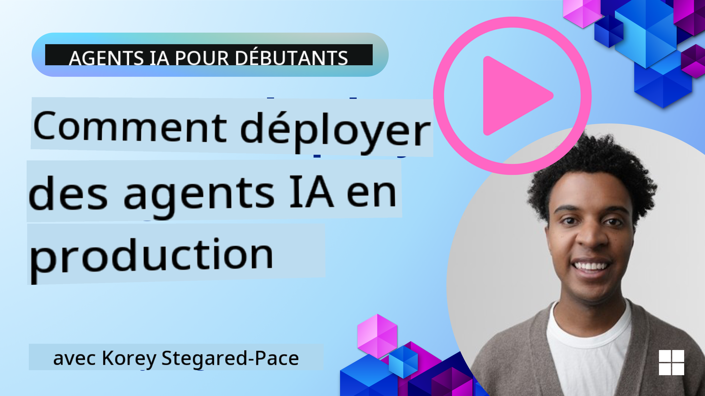

<!--
CO_OP_TRANSLATOR_METADATA:
{
  "original_hash": "44013a98d980c8b92d4b814dc49b545d",
  "translation_date": "2025-03-28T10:53:45+00:00",
  "source_file": "10-ai-agents-production\\README.md",
  "language_code": "fr"
}
-->

> _(Cliquez sur l'image ci-dessus pour visionner la vidéo de cette leçon)_
# Agents IA en Production

## Introduction

Cette leçon couvrira :

- Comment planifier efficacement le déploiement de votre agent IA en production.
- Les erreurs courantes et les problèmes auxquels vous pourriez être confronté lors du déploiement de votre agent IA en production.
- Comment gérer les coûts tout en maintenant la performance de votre agent IA.

## Objectifs d'apprentissage

Après avoir terminé cette leçon, vous saurez/comment :

- Utiliser des techniques pour améliorer la performance, les coûts et l'efficacité d'un système d'agent IA en production.
- Évaluer vos agents IA et comprendre les critères d'évaluation.
- Contrôler les coûts lors du déploiement des agents IA en production.

Il est essentiel de déployer des agents IA fiables. Consultez également la leçon "Construire des agents IA de confiance".

## Évaluation des Agents IA

Avant, pendant et après le déploiement des agents IA, il est crucial de disposer d'un système adéquat pour évaluer vos agents IA. Cela garantit que votre système est aligné avec vos objectifs et ceux de vos utilisateurs.

Pour évaluer un agent IA, il est important de pouvoir évaluer non seulement les résultats de l'agent, mais aussi l'ensemble du système dans lequel il opère. Cela inclut, mais ne se limite pas à :

- La requête initiale du modèle.
- La capacité de l'agent à identifier l'intention de l'utilisateur.
- La capacité de l'agent à choisir l'outil approprié pour accomplir la tâche.
- La réponse de l'outil à la requête de l'agent.
- La capacité de l'agent à interpréter la réponse de l'outil.
- Les retours de l'utilisateur concernant la réponse de l'agent.

Cela permet d'identifier les points à améliorer de manière plus modulaire. Vous pouvez ensuite surveiller l'effet des modifications apportées aux modèles, aux invites, aux outils et à d'autres composants avec une meilleure efficacité.

## Problèmes courants et solutions possibles avec les agents IA

| **Problème**                                   | **Solution possible**                                                                                                                                                                                                      |
| ---------------------------------------------- | -------------------------------------------------------------------------------------------------------------------------------------------------------------------------------------------------------------------------- |
| L'agent IA n'accomplit pas les tâches de manière cohérente | - Affinez l'invite donnée à l'agent IA ; soyez clair sur les objectifs. - Identifiez si diviser les tâches en sous-tâches et les gérer avec plusieurs agents peut être utile.                                             |
| L'agent IA tombe dans des boucles continues    | - Assurez-vous de définir des termes et conditions clairs pour la terminaison afin que l'agent sache quand arrêter le processus. - Pour les tâches complexes nécessitant du raisonnement et de la planification, utilisez un modèle plus grand spécialisé dans ces tâches. |
| Les appels d'outils de l'agent IA ne fonctionnent pas correctement | - Testez et validez la réponse de l'outil en dehors du système de l'agent. - Affinez les paramètres définis, les invites et la nomenclature des outils.                                                                  |
| Le système multi-agents manque de cohérence    | - Affinez les invites données à chaque agent pour qu'elles soient spécifiques et distinctes les unes des autres. - Construisez un système hiérarchique en utilisant un agent "routeur" ou contrôleur pour déterminer quel agent est le plus adapté.               |

## Gestion des coûts

Voici quelques stratégies pour gérer les coûts liés au déploiement des agents IA en production :

- **Mise en cache des réponses** - Identifier les requêtes et tâches courantes et fournir les réponses avant qu'elles ne passent par votre système agentique est un bon moyen de réduire le volume de requêtes similaires. Vous pouvez même implémenter un flux pour identifier à quel point une requête ressemble à vos requêtes mises en cache en utilisant des modèles IA plus basiques.

- **Utilisation de modèles plus petits** - Les petits modèles de langage (SLM) peuvent bien fonctionner dans certains cas d'utilisation agentique et réduire significativement les coûts. Comme mentionné précédemment, construire un système d'évaluation pour déterminer et comparer la performance par rapport aux modèles plus grands est la meilleure façon de comprendre l'efficacité d'un SLM dans votre cas d'utilisation.

- **Utilisation d'un modèle routeur** - Une stratégie similaire consiste à utiliser une diversité de modèles et de tailles. Vous pouvez utiliser un LLM/SLM ou une fonction sans serveur pour acheminer les requêtes en fonction de leur complexité vers les modèles les plus adaptés. Cela permet également de réduire les coûts tout en garantissant la performance sur les tâches appropriées.

## Félicitations

Ceci est actuellement la dernière leçon de "Agents IA pour Débutants".

Nous prévoyons de continuer à ajouter des leçons basées sur les retours et les évolutions de cette industrie en constante croissance, alors revenez nous voir bientôt.

Si vous souhaitez continuer à apprendre et à développer avec les agents IA, rejoignez le <a href="https://discord.gg/kzRShWzttr" target="_blank">Discord de la communauté Azure AI</a>.

Nous organisons des ateliers, des tables rondes communautaires et des sessions "posez-moi n'importe quoi".

Nous avons également une collection d'apprentissage contenant des ressources supplémentaires qui peuvent vous aider à commencer à déployer des agents IA en production.

## Leçon précédente

[Motif de conception Métacognition](../09-metacognition/README.md)

**Avertissement** :  
Ce document a été traduit à l'aide du service de traduction automatique [Co-op Translator](https://github.com/Azure/co-op-translator). Bien que nous nous efforcions d'assurer l'exactitude, veuillez noter que les traductions automatiques peuvent contenir des erreurs ou des inexactitudes. Le document original dans sa langue d'origine doit être considéré comme la source faisant autorité. Pour des informations critiques, il est recommandé de faire appel à une traduction professionnelle réalisée par un humain. Nous déclinons toute responsabilité en cas de malentendus ou d'interprétations erronées résultant de l'utilisation de cette traduction.