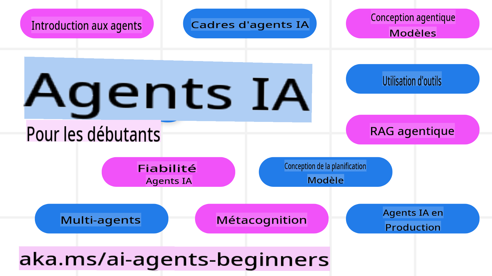

<!--
CO_OP_TRANSLATOR_METADATA:
{
  "original_hash": "09e975d95b470ee45ab546c22ee35d33",
  "translation_date": "2025-03-28T10:01:19+00:00",
  "source_file": "README.md",
  "language_code": "fr"
}
-->
# Agents IA pour Débutants - Un Cours

## 10 Leçons pour apprendre tout ce qu'il faut savoir pour commencer à créer des agents IA

### Support linguistique

     
 

 

  
 
 

## 🌱 Commencer

Ce cours comprend 10 leçons couvrant les bases de la création d'agents IA. Chaque leçon aborde un sujet spécifique, alors commencez où vous voulez !

Ce cours est disponible en plusieurs langues. Consultez notre [liste des langues disponibles ici](../..). 

Si c'est votre première expérience avec les modèles d'IA générative, découvrez notre cours [IA Générative pour Débutants](https://aka.ms/genai-beginners), qui inclut 21 leçons sur la création avec GenAI.

N'oubliez pas de [mettre une étoile (🌟) à ce dépôt](https://docs.github.com/en/get-started/exploring-projects-on-github/saving-repositories-with-stars?WT.mc_id=academic-105485-koreyst) et de [cloner ce dépôt](https://github.com/microsoft/ai-agents-for-beginners/fork) pour exécuter le code.

### Ce dont vous avez besoin 

Chaque leçon de ce cours inclut des exemples de code, disponibles dans le dossier code_samples. Vous pouvez [cloner ce dépôt](https://github.com/microsoft/ai-agents-for-beginners/fork) pour créer votre propre copie.  

Les exemples de code dans ces exercices utilisent Azure AI Foundry et les catalogues de modèles GitHub pour interagir avec les modèles linguistiques :

- [Modèles GitHub](https://aka.ms/ai-agents-beginners/github-models) - Gratuit / Limité
- [Azure AI Foundry](https://aka.ms/ai-agents-beginners/ai-foundry) - Compte Azure requis

Ce cours utilise également les frameworks et services d'agents IA suivants de Microsoft :

- [Service d'Agent IA Azure](https://aka.ms/ai-agents-beginners/ai-agent-service)
- [Semantic Kernel](https://aka.ms/ai-agents-beginners/semantic-kernel)  
- [AutoGen](https://aka.ms/ai-agents/autogen)  

Pour plus d'informations sur l'exécution du code de ce cours, consultez la section [Configuration du cours](./00-course-setup/README.md).  

## 🙏 Vous souhaitez contribuer ?  

Vous avez des suggestions ou avez trouvé des fautes d'orthographe ou des erreurs dans le code ? [Soumettez un problème](https://github.com/microsoft/ai-agents-for-beginners/issues?WT.mc_id=academic-105485-koreyst) ou [Créez une demande de tirage](https://github.com/microsoft/ai-agents-for-beginners/pulls?WT.mc_id=academic-105485-koreyst).  

Si vous êtes bloqué ou avez des questions sur la création d'agents IA, rejoignez notre [Communauté Azure AI sur Discord](https://discord.gg/kzRShWzttr).  

## 📂 Chaque leçon comprend  

- Une leçon écrite située dans le fichier README et une courte vidéo  
- Des exemples de code Python prenant en charge Azure AI Foundry et les modèles Github (Gratuit)  
- Des liens vers des ressources supplémentaires pour approfondir votre apprentissage  

## 🗃️ Leçons  

| **Leçon**                                | **Texte & Code**                                   | **Vidéo**                                                  | **Ressources supplémentaires**                                                       |
|------------------------------------------|----------------------------------------------------|------------------------------------------------------------|---------------------------------------------------------------------------------------|
| Introduction aux agents IA et cas d'utilisation des agents   | [Lien](./01-intro-to-ai-agents/README.md)          | [Vidéo](https://youtu.be/3zgm60bXmQk?si=z8QygFvYQv-9WtO1)  | [Lien](https://aka.ms/ai-agents-beginners/collection?WT.mc_id=academic-105485-koreyst) |
| Exploration des cadres agentiques IA     | [Lien](./02-explore-agentic-frameworks/README.md)  | [Vidéo](https://youtu.be/ODwF-EZo_O8?si=Vawth4hzVaHv-u0H)  | [Lien](https://aka.ms/ai-agents-beginners/collection?WT.mc_id=academic-105485-koreyst) |
| Comprendre les modèles de conception agentique IA | [Lien](./03-agentic-design-patterns/README.md)     | [Vidéo](https://youtu.be/m9lM8qqoOEA?si=BIzHwzstTPL8o9GF)  | [Lien](https://aka.ms/ai-agents-beginners/collection?WT.mc_id=academic-105485-koreyst) |
| Modèle de conception d'utilisation d'outils | [Lien](./04-tool-use/README.md)                    | [Vidéo](https://youtu.be/vieRiPRx-gI?si=2z6O2Xu2cu_Jz46N)  | [Lien](https://aka.ms/ai-agents-beginners/collection?WT.mc_id=academic-105485-koreyst) |
| Agentic RAG                              | [Lien](./05-agentic-rag/README.md)                 | [Vidéo](https://youtu.be/WcjAARvdL7I?si=gKPWsQpKiIlDH9A3)  | [Lien](https://aka.ms/ai-agents-beginners/collection?WT.mc_id=academic-105485-koreyst) |
| Construire des agents IA fiables         | [Lien](./06-building-trustworthy-agents/README.md) | [Vidéo](https://youtu.be/iZKkMEGBCUQ?si=jZjpiMnGFOE9L8OK ) | [Lien](https://aka.ms/ai-agents-beginners/collection?WT.mc_id=academic-105485-koreyst) |
| Modèle de conception de planification    | [Lien](./07-planning-design/README.md)             | [Vidéo](https://youtu.be/kPfJ2BrBCMY?si=6SC_iv_E5-mzucnC)  | [Lien](https://aka.ms/ai-agents-beginners/collection?WT.mc_id=academic-105485-koreyst) |
| Modèle de conception multi-agents        | [Lien](./08-multi-agent/README.md)                 | [Vidéo](https://youtu.be/V6HpE9hZEx0?si=rMgDhEu7wXo2uo6g)  | [Lien](https://aka.ms/ai-agents-beginners/collection?WT.mc_id=academic-105485-koreyst) |  
| Modèle de conception de métacognition    | [Lien](./09-metacognition/README.md)               | [Vidéo](https://youtu.be/His9R6gw6Ec?si=8gck6vvdSNCt6OcF)  | [Lien](https://aka.ms/ai-agents-beginners/collection?WT.mc_id=academic-105485-koreyst) |
| Agents IA en production                  | [Lien](./10-ai-agents-production/README.md)        | [Vidéo](https://youtu.be/l4TP6IyJxmQ?si=31dnhexRo6yLRJDl)  | [Lien](https://aka.ms/ai-agents-beginners/collection?WT.mc_id=academic-105485-koreyst) |

## 🌐 Support multilingue

| Langue               | Code | Lien vers le README traduit                             | Dernière mise à jour |
|----------------------|------|---------------------------------------------------------|-----------------------|
| Chinois (simplifié)  | zh   | [Traduction en chinois](../zh/README.md)    | 2025-03-24           |
| Chinois (traditionnel)| tw   | [Traduction en chinois](../tw/README.md)    | 2025-02-13           |
| Chinois (Hong Kong)  | hk   | [Traduction en chinois (Hong Kong)](../hk/README.md) | 2025-02-13           |
| Français             | fr   | [Traduction en français](./README.md)   | 2025-02-13           |
| Japonais             | ja   | [Traduction en japonais](../ja/README.md)   | 2025-02-13           |
| Coréen               | ko   | [Traduction en coréen](../ko/README.md)     | 2025-02-13           |
| Portugais            | pt   | [Traduction en portugais](../pt/README.md)  | 2025-02-13           |
| Espagnol             | es   | [Traduction en espagnol](../es/README.md)   | 2025-02-13           |
| Allemand             | de   | [Traduction en allemand](../de/README.md)   | 2025-02-13           |
| Persan               | fa   | [Traduction en persan](../fa/README.md)     | 2025-03-26           |
| Polonais             | pl   | [Traduction en polonais](../pl/README.md)   | 2025-03-26           |

## 🎒 Autres cours

Notre équipe propose d'autres cours ! Découvrez :

- [**NOUVEAU** IA générative pour débutants avec .NET](https://github.com/microsoft/Generative-AI-for-beginners-dotnet?WT.mc_id=academic-105485-koreyst)
- [IA générative pour débutants](https://github.com/microsoft/generative-ai-for-beginners?WT.mc_id=academic-105485-koreyst)
- [ML pour débutants](https://aka.ms/ml-beginners?WT.mc_id=academic-105485-koreyst)
- [Science des données pour débutants](https://aka.ms/datascience-beginners?WT.mc_id=academic-105485-koreyst)
- [IA pour débutants](https://aka.ms/ai-beginners?WT.mc_id=academic-105485-koreyst)
- [Cybersécurité pour débutants](https://github.com/microsoft/Security-101??WT.mc_id=academic-96948-sayoung)
- [Développement web pour débutants](https://aka.ms/webdev-beginners?WT.mc_id=academic-105485-koreyst)
- [IoT pour débutants](https://aka.ms/iot-beginners?WT.mc_id=academic-105485-koreyst)
- [Développement XR pour débutants](https://github.com/microsoft/xr-development-for-beginners?WT.mc_id=academic-105485-koreyst)
- [Maîtriser GitHub Copilot pour la programmation assistée par IA](https://aka.ms/GitHubCopilotAI?WT.mc_id=academic-105485-koreyst)
- [Maîtriser GitHub Copilot pour les développeurs C#/.NET](https://github.com/microsoft/mastering-github-copilot-for-dotnet-csharp-developers?WT.mc_id=academic-105485-koreyst)
- [Choisissez votre propre aventure Copilot](https://github.com/microsoft/CopilotAdventures?WT.mc_id=academic-105485-koreyst)

## 🌟 Remerciements à la communauté

Merci à [Shivam Goyal](https://www.linkedin.com/in/shivam2003/) pour avoir contribué avec des exemples de code importants démontrant Agentic RAG. 

## Contribution

Ce projet accueille les contributions et suggestions. La plupart des contributions nécessitent que vous acceptiez un
Accord de Licence de Contributeur (CLA) déclarant que vous avez le droit, et que vous accordez effectivement, les droits
d'utiliser votre contribution. Pour plus de détails, visitez <https://cla.opensource.microsoft.com>.

Lorsque vous soumettez une pull request, un bot CLA déterminera automatiquement si vous devez fournir
un CLA et annotera la PR en conséquence (par exemple, vérification de statut, commentaire). Suivez simplement les instructions
fournies par le bot. Vous n'aurez besoin de faire cela qu'une seule fois pour tous les dépôts utilisant notre CLA.
Ce projet a adopté le [Code de conduite Open Source de Microsoft](https://opensource.microsoft.com/codeofconduct/).  
Pour plus d'informations, consultez la [FAQ sur le Code de conduite](https://opensource.microsoft.com/codeofconduct/faq/) ou  
contactez [opencode@microsoft.com](mailto:opencode@microsoft.com) pour toute question ou commentaire supplémentaire.  

## Marques déposées  

Ce projet peut contenir des marques déposées ou des logos liés à des projets, produits ou services. L'utilisation autorisée des marques déposées ou des logos de Microsoft doit respecter  
et suivre les [Directives sur les marques et la marque de Microsoft](https://www.microsoft.com/legal/intellectualproperty/trademarks/usage/general).  
L'utilisation des marques déposées ou des logos de Microsoft dans des versions modifiées de ce projet ne doit pas entraîner de confusion ou suggérer un parrainage de Microsoft.  
Toute utilisation de marques déposées ou de logos de tiers est soumise aux politiques de ces tiers.  

**Avertissement** :  
Ce document a été traduit à l'aide du service de traduction automatique [Co-op Translator](https://github.com/Azure/co-op-translator). Bien que nous nous efforcions de garantir l'exactitude, veuillez noter que les traductions automatisées peuvent contenir des erreurs ou des inexactitudes. Le document original dans sa langue d'origine doit être considéré comme la source faisant autorité. Pour les informations critiques, une traduction professionnelle réalisée par un humain est recommandée. Nous déclinons toute responsabilité en cas de malentendus ou d'interprétations erronées résultant de l'utilisation de cette traduction.